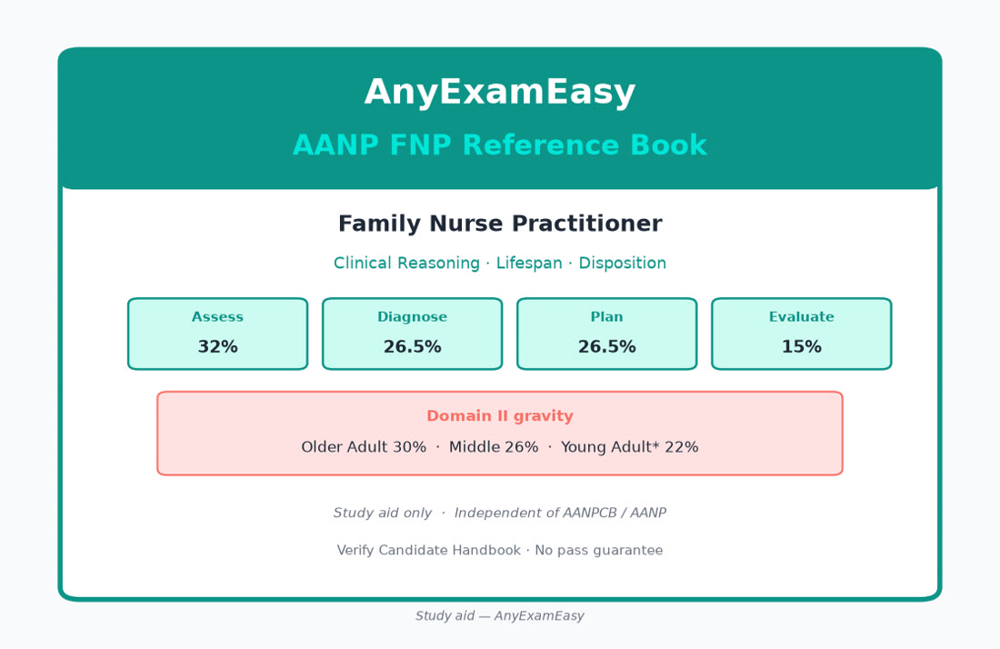
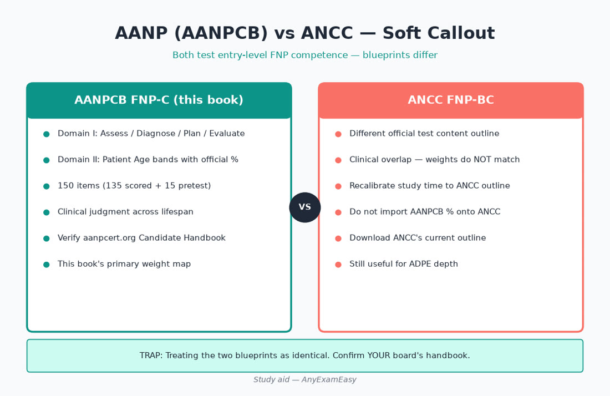

# AnyExamEasy AANP FNP Reference Book

**Subtitle:** Pass-Focused Primary Care Companion for the AANPCB Family Nurse Practitioner (FNP-C) Exam

**For:** FNP candidates preparing for AANPCB FNP-C certification  
**From:** [AnyExamEasy](https://anyexameasy.com)  
**Edition framing:** AANPCB Domain I (Practice) + Domain II (Patient Age) blueprint — verify current Candidate Handbook at [aanpcert.org](https://www.aanpcert.org)

---

## Study-aid disclaimer (read this)

> **MUST KNOW** — This is a study aid only — not clinical advice, not AANPCB, no pass guarantee.

> **HIGHLIGHT** — Official blueprint: 150 Qs (135 scored + 15 pretest); Domain I Assess 32% / Diagnose 26.5% / Plan 26.5% / Evaluate 15%; Older Adult 30%.

> **TRAP** — Studying only adult chronic disease and skipping prenatal (YA*) and Older Adult multimorbidity.

> **LIFESPAN** — Age parameters aren’t fixed; prenatal is folded into Young Adult*.

This book is a **study aid for exam preparation**. It is **not**:

- Clinical advice, a treatment protocol, or a substitute for individualized patient care  
- A substitute for your NP program, clinical preceptors, collaborating/supervising agreements, or employer policy  
- An official **AANPCB** or **AANP** publication or replacement for the Candidate Handbook / FNP exam blueprint  

**Always verify** guidelines, dosing, immunization schedules, screening recommendations, controlled-substance rules, and state scope-of-practice requirements with current official sources (AANPCB, USPSTF, ACIP/CDC, major specialty guidelines, FDA labeling, DEA/state boards). When dosing or guidelines are mentioned, treat them as **teaching themes to verify** — not standing orders.

AnyExamEasy does **not** guarantee exam results, certification, licensure, or employment. We are **independent** and not affiliated with AANPCB, AANP, ANCC, or Pearson VUE. Exam names and trademarks belong to their owners.

---

## How to use this book

1. **Start with Part I (Exam Strategy)** once — format, Domain I/II weights, ADPE framework, study plans, traps, exam day.  
2. **Use Part II (Content chapters)** as a deep reference — read a topic, then immediately practice related questions.  
3. **Keep Part III (Quick Reference)** open in your final week — red flags, screening strip, sprint plan.  
4. **Run the learning loop:** topic → 20–40 Qbank items → full rationale review → 3 “remember this” lines in your error log (include age band).  
5. **Do not** use this book as your only content source or as a practice protocol.

**Pro tip:** Application beats rereading. A tired 40-question day with honest rationale review beats 150 rushed guesses.

---

## Path note — AANP (AANPCB) vs ANCC

This book is **AANP/AANPCB-first** (FNP-C).

| Exam | Credential | This book |
| --- | --- | --- |
| **AANPCB FNP** | FNP-C | **Yes — primary focus** |
| **ANCC FNP** | FNP-BC | **Short callout only** — separate blueprint; if you’re taking ANCC, use ANCC’s official test content outline as your weight map and still practice ADPE clinical judgment |

Both exams test entry-level FNP competence; blueprints, emphasis, and item styles differ. Confirm your chosen board’s current handbook before you lock a study plan.

---

## Official source of truth

- **AANPCB FNP exam blueprint** — Domain I Practice + Domain II Patient Age weights  
- **AANPCB Candidate Handbook** — eligibility, format, test-day rules, attempts  
- Primary site: [aanpcert.org](https://www.aanpcert.org)

Third-party guides (including this one) prepare you — they do **not** replace AANPCB documents.

### Blueprint numbers used in this book (do not invent others)

| Domain I Practice | Items (approx.) | Weight |
| --- | ---: | ---: |
| Assess | 43 | 32% |
| Diagnose | 36 | 26.5% |
| Plan | 36 | 26.5% |
| Evaluate | 20 | 15% |

| Domain II Patient Age | Weight |
| --- | ---: |
| Newborn | 2% |
| Infant | 3% |
| Toddler | 4% |
| Child | 4% |
| Adolescent* | 9% |
| Young Adult* | 22% |
| Middle Adult | 26% |
| Older Adult | 30% |

\*Includes prenatal. Age parameters are not fixed by AANPCB.

**Exam length:** 150 questions total (135 scored + 15 pretest).

---

## Table of contents

**Part I — Exam Strategy**  
1. Exam Strategy (format, Domain I/II, ADPE, plans)

**Part II — Content Reference**  
2. Clinical Reasoning  
3. Health Promotion & Screening  
4. Cardiology  
5. Pulmonary  
6. Endocrine  
7. GI / Hepatic  
8. Renal / GU  
9. Women’s Health  
10. Pediatrics & Lifespan  
11. Psych / Neuro  
12. MSK / Derm  
13. ENT / Eyes / Heme / ID  
14. Pharmacology & Prescribing

**Part III — Quick Reference & Close**  
15. Quick Reference  
16. Back Matter (FAQ, CTA, legal)

---

## Pairing with AnyExamEasy

| Piece | Role |
| --- | --- |
| **This book** | Foundation & strategy — domains, ADPE, high-yield primary care |
| **AnyExamEasy Qbank** | Active practice — exam-style items, teachable rationales, Blueprint Roadmaps, mocks |

**Start free** on [anyexameasy.com](https://anyexameasy.com) — try a free question, explore the AANP FNP bank, and upgrade when you’re ready ($27.99/mo after trial; trial terms on site).

---

## Critical checklist — before you dig into chapters

- [ ] I know Domain I process weights  
- [ ] I know Domain II age weights (Older Adult 30%)  
- [ ] I know this book is AANP-first; ANCC is separate  
- [ ] I will verify guidelines/doses clinically  
- [ ] I will pair reading with Qbank practice  
