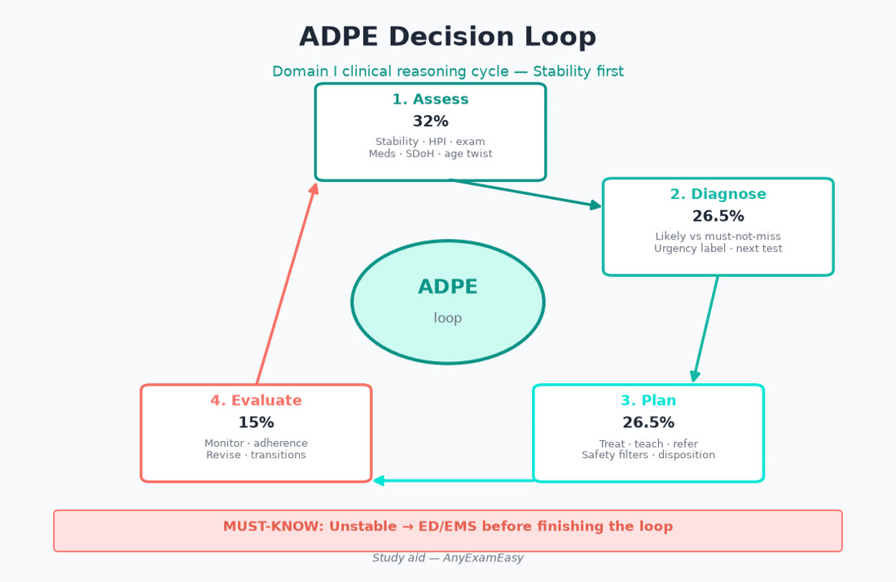
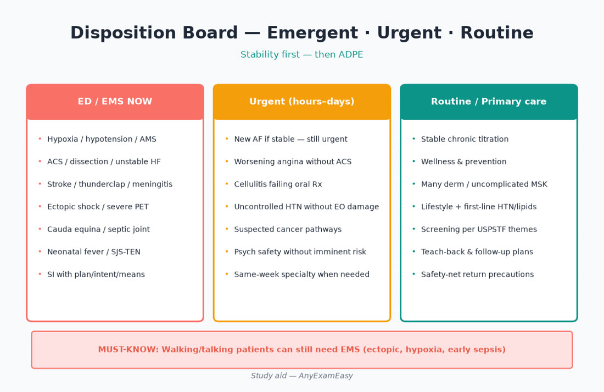

# Chapter 2 — Clinical Reasoning

> **Study aid only.** Reasoning frameworks for AANP FNP exam judgment — not individualized clinical advice. Verify guidelines, imaging pathways, and local referral standards. Independent of AANPCB/AANP.

---

> **MUST KNOW** — Stability first. Then ADPE. Then age band (Older Adult 30%; prenatal in YA*).

> **HIGHLIGHT** — Scan MUST KNOW / TRAP boxes before bed — they are your sprint sheet.

> **TRAP** — Memorizing drugs without disposition and lifespan twists.

> **LIFESPAN** — Atypical presentations and polypharmacy dominate Older Adult stems.

#### Critical checklist — open this chapter
- [ ] I can name the chapter’s can’t-miss emergencies
- [ ] I know one prenatal and one older-adult twist
- [ ] I will do practice questions after reading

## Why this chapter matters

Domain I is literally a reasoning blueprint: **Assess 32% / Diagnose 26.5% / Plan 26.5% / Evaluate 15%**. System chapters teach *what* disease patterns look like; this chapter teaches *how* not to miss the dangerous ones, how to choose the next test, and how to disposition patients without under- or over-triage. Most exam heartbreak is reasoning heartbreak: premature closure, therapy-first thinking, age-blind priors, or sending hypoxia home with “supportive care.”

**Pair with practice:** After this chapter, do mixed “next step” and “most likely diagnosis” sets and force yourself to name the ADPE verb before answering. Soft practice home: [anyexameasy.com](https://anyexameasy.com) ($27.99/mo after trial; trial terms on site).

---

## ADPE lens for clinical reasoning

| Process | Reasoning behaviors the exam rewards |
| --- | --- |
| Assess | Stability first; targeted data; SDoH; pregnancy potential; what is missing |
| Diagnose | Probabilistic differentials; can’t-miss lane kept open; tests that change management |
| Plan | Disposition matched to risk; least harm path; teach-back; referral quality |
| Evaluate | Monitoring plan; when therapy failure means wrong diagnosis; transitions of care |

---

## Topic A — Building differentials under pressure

### The three-lane board

For every nontrivial presentation, hold:
1. **Most likely** (pretest probability + classic pattern)  
2. **Most dangerous / treatable** (even if less likely)  
3. **Common mimics** (so you don’t anchor)

Example — acute dyspnea: pneumonia/COPD/asthma exacerbation (likely) · PE/ACS/pneumothorax (dangerous) · anxiety/anemia/metabolic acidosis (mimics).

### Path from syndrome → hypothesis

Start with the **syndrome** (acute dyspnea, syncope, abdominal pain), not the specialty. Time course, severity trajectory, associated features, and context (cancer, anticoag, pregnancy, immunocompromise, travel, surgery) reshuffle priors.

### Older adult (30%) — atypical is typical

Infection without fever, ACS without chest pain, UTI presenting as confusion, appendicitis without textbook peritonitis — raise your can’t-miss index and lower your reassurance threshold.

### Prenatal (Young Adult\*) — parallel diagnoses

Abdominal/pelvic pain, bleeding, headache, BP rise, dyspnea — always run an obstetric-emergency lane beside the “normal primary care” lane.

---

## Topic B — Red flags and disposition

### Emergent (ED/EMS now) — exemplar themes

| System | Can’t-miss themes |
| --- | --- |
| Cardio/pulm | ACS, PE with instability, hypoxic respiratory failure, dissection, tamponade themes |
| Neuro | Stroke/TIA window, meningitis/encephalitis cues, status themes, cauda equina |
| Abdomen/OB | Peritonitis, ectopic with instability, testicular/ovarian torsion themes |
| ID/MSK | Necrotizing infection, septic arthritis, severe sepsis |
| Psych | Immediate danger to self/others, inability to care for self with severe impairment |
| Heme | Suspected acute leukemia with blast crisis themes / severe symptomatic anemia instability |

### Urgent (same/next day specialty or structured close follow-up)

Stable DVT suspicion, uncontrolled asthma without hypoxia, new neuro findings without EMS criteria, suspected cancer alarm features needing prompt workup, SI without immediate intent but needing rapid safety planning (still take seriously — escalate per risk tools/policy).

### Routine

Stable chronic titration, wellness, many derm, uncomplicated MSK without red flags.

### Exam trap

Choosing elegant outpatient panels while the stem screams instability (RR, SpO₂, BP, mental status, peritoneal signs).

---

## Topic C — Choosing tests (and choosing restraint)

### Principles

- A test should change today’s or near-term management.  
- Prefer bedside game-changers first: ECG, glucose, pulse ox, pregnancy test, UA.  
- Consider harm: radiation, false positives, incidentalomas, cost, delay.  
- Decision aids themes (Ottawa ankle/knee/C-spine) reward selective imaging.  
- Low back pain: early imaging mainly for red flags / progressive deficits (verify current guidance).  
- Headache imaging: focal deficit, thunderclap, trauma on anticoag, cancer, papilledema themes — not every migraine.

### Pregnancy + imaging

Pregnancy test before ionizing radiation when relevant. Prefer ultrasound pathways for many pelvic/biliary questions. Coordinate with Ob when unsure.

### Checklist before imaging

- [ ] Working differential listed  
- [ ] Result will change plan?  
- [ ] Bedside test better first?  
- [ ] Pregnancy status considered?  
- [ ] Follow-up plan for incidental findings?

---

## Topic D — Labs that unlock Plan

| Presentation | Often-first considerations (themes) |
| --- | --- |
| Fatigue | CBC, TSH, metabolic panel ± iron/B12 by clues |
| New HTN | BMP, lipids, glucose/A1c themes, UACR |
| UTI symptoms | UA ± culture by complexity/pregnancy |
| Abd/pelvic pain, amenorrhea | **Pregnancy test** reflex |
| Edema | BMP, albumin themes, TSH; BNP/echo via pathway |
| Cognitive change (elder) | Glucose, BMP, CBC, B12, TSH, infection, med review |
| Chest pain pathway | ECG first; troponin in ED pathways |
| Suspected endocrine crisis | Directed labs + ED if unstable |

> **HIGHLIGHT** — People who can be pregnant + abdominal/pelvic symptoms → pregnancy test before cleverness.

---

## Topic E — Referral quality & transitions of care

### High-quality referral

Clear question · what you already tried · urgency · relevant data attached · barrier plan (transport, language, insurance).

### Transitions (Evaluate gold)

Med reconciliation after ED/hospital · high-risk drugs (anticoag, insulin, opioids, immunosuppressants) · follow-up timing for HF/ACS/pneumonia/new diabetes/SI safety · plain-language return precautions · caregiver inclusion in older adults.

### Documentation themes

Working diagnosis · alternatives considered · shared decisions · monitoring parameters · what defines failure.

---

## Topic F — Cognitive biases that cost points

| Bias | Fix on the exam |
| --- | --- |
| Premature closure | Force one alternative for 10 seconds |
| Anchoring | Revisit when course doesn’t fit |
| Availability | Last week’s zebra ≠ this zebra |
| Age-blindness | Atypical ACS/infection in elders |
| Therapy-first | Name diagnosis lane before Rx |
| Attribution (“noncompliant”) | Check SDoH and teach-back |
| Commission bias | Sometimes watchful waiting is correct |
| Omission bias | Don’t delay ED for fear of “overreacting” when unstable |

---

## Topic G — Procedures & primary-care scope awareness

Stems may ask whether to perform, defer, or refer: skin biopsy themes, I&D of simple abscess vs deep/facial danger zones, joint injection comfort limits, endometrial biopsy contexts, toenail procedures, laceration complexity, foreign body. Rule of thumb: **airway, eyes, hand tendons, deep spaces, immunocompromise, anticoagulated bleeds, and uncertain anatomy → lower threshold to refer/ED**. Know your training and state scope — exam rewards safety humility.

---

## Topic H — Evidence-informed reasoning

- Screening ≠ diagnosis.  
- Shared decision when benefit/harm close.  
- Absolute vs relative risk conversations in plain language.  
- Stewardship: antibiotics only when bacterial likelihood and benefit warrant.  
- Deprescribing in older adults as Evaluate/Plan courage.

---

## Clinical vignette 1 — “Just a virus” that isn’t

**Stem:** 68-year-old, 3 days dyspnea, low-grade fever, HR 112, RR 28, SpO₂ 88% RA; remote smoker.

| ADPE | Move |
| --- | --- |
| Assess | Unstable respiratory status; Older Adult; comorbidity/vaccine/smoking |
| Diagnose | CAP / cardiac / PE lanes — cannot outpatient-observe hypoxia |
| Plan | ED transfer |
| Evaluate | Later vaccines, cessation, follow-up |

**Distractors fail:** azithromycin script + “call if worse,” steroids alone for “asthma” without history, D-dimer in unstable patient without ED support.

---

## Clinical vignette 2 — Young adult\* pelvic pain

**Stem:** 24-year-old unilateral pelvic pain + spotting; BP 90/50.

| ADPE | Move |
| --- | --- |
| Assess | Shock + pregnancy possible |
| Diagnose | Ectopic until proven otherwise |
| Plan | ED/OB emergency pathway — not empiric STI meds alone |
| Evaluate | Rh, contraception after resolution (later) |

**Distractors fail:** IM ceftriaxone in clinic and discharge while hypotensive; CT abdomen before pregnancy test; reassure mittelschmerz.

---

## Clinical vignette 3 — Back pain with a twist

**Stem:** 58-year-old with acute low back pain, urinary retention, saddle numbness.

| ADPE | Move |
| --- | --- |
| Assess | Cauda equina red flags |
| Diagnose | Neurologic emergency until proven otherwise |
| Plan | Emergent imaging/ED-spine pathway |
| Evaluate | Time-to-decompression matters — don’t schedule “MRI next week” |

**Distractors fail:** NSAID + PT only; “musculoskeletal until proven otherwise” after red flags named.

---

## Exam traps

| Trap | Better move |
| --- | --- |
| Therapy before differential | Three-lane board first |
| Shotgun imaging | Bedside tests + pretest probability |
| Ignoring age band | Recalculate priors |
| Calling SDoH “noncompliance” | Fix access barriers |
| Undertriage because patient is “walking” | Walking hypoxic patients still leave by EMS |
| Overtriage every viral kid to ED | Use age-based fever algorithms + appearance |

---

## Quick checklist — clinical reasoning

- [ ] Stability / red-flag filter applied  
- [ ] ADPE verb identified  
- [ ] Three-lane differential held  
- [ ] Age band + pregnancy potential considered  
- [ ] Next test changes management  
- [ ] Disposition matches risk  
- [ ] Education + return precautions if outpatient  
- [ ] Evaluate/monitoring plan stated  
- [ ] SDoH scanned when adherence/outcome at risk  
- [ ] Bias check (anchoring/premature closure)  

---

## Remember this

- Assess is 32% — missing data is a scored skill.  
- Can’t-miss diagnoses earn early rule-out energy.  
- Older adults present atypically; prenatal doubles the differential.  
- Verify local pathways; this is a study aid only.

**Next:** Practice “next step” items on [AnyExamEasy](https://anyexameasy.com) — start free; $27.99/mo after trial (trial terms on site).

---

## Topic I — Communication, uncertainty, and “sick vs not sick”

Expert primary care sounds calm under uncertainty. On the exam, that reads as:
- Name what you know vs what you must rule out.  
- Share a safety-net plan (“If X/Y/Z happens, go to ED”).  
- Avoid false reassurance (“It’s definitely migraine”) when secondary headache red flags exist.  
- Use plain language; confirm understanding with teach-back.  
- In older adults, include caregivers when cognition or hearing limits teach-back — with consent/privacy respect.

### Sick vs not sick (rapid gestalt — then verify)

“Sick” cues: altered mentation, work of breathing, mottling, diaphoresis with pain, rigid abdomen, petechiae with fever themes, inability to walk normally when that is new. Gestalt does **not** replace vitals — it prioritizes speed.

### Serial assessment as Evaluate

Worsening despite appropriate therapy → revisit diagnosis (wrong bug, missed PE, missed ischemia, abscess, factitious, SDoH blocking uptake). Therapy failure is data.

---

## Topic J — Legal/ethical reasoning themes (light, high-yield)

- Consent/assent; capacity vs disagreeing with your plan.  
- Adolescent confidentiality vs mandatory harm exceptions (laws vary — know concepts).  
- Mandatory reporting cues (child/elder/vulnerable adult abuse suspicions).  
- Documentation that matches what you did and why.  
- Stay in scope; collaborative/supervisory requirements are state-specific — don’t invent statutes on the exam; choose the safest in-scope option.

---

## Topic K — Putting it together: a reasoning OS for every stem

1. Read the last line (the ask).  
2. Spot age band + pregnancy potential.  
3. Stability/red flags.  
4. ADPE verb.  
5. Three-lane differential.  
6. Next action that is safest and most informative.  
7. If outpatient: safety net + Evaluate plan.

Run this OS until it is automatic — then system knowledge has somewhere to land.

---

## Expanded practice hooks (self-drill)

Without looking up answers, narrate ADPE for: thunderclap headache; painless jaundice; child refusing to bear weight; postpartum woman with headache and BP 168/110; older adult “weak and dizzy” on new diuretic; adolescent with weight loss and bradycardia. Then check your disposition instincts against red-flag tables above.

---

## Concept checks

**1.** Hypoxic older adult with presumed URI — best Plan?  
A. Home supportive care  B. ED evaluation  C. Wait for viral panel mail-in  D. Start amoxicillin always  
**Answer:** B.

**2.** Which Domain I process asks “what monitoring proves therapy worked?”  
A. Assess  B. Diagnose  C. Evaluate  D. None  
**Answer:** C.

**3.** First lab reflex in fertile patient with pelvic pain?  
A. ANA  B. Pregnancy test  C. MRI  D. Tumor markers  
**Answer:** B.

---

## Appendix — High-yield “next step” patterns (drill these)

| Stem pattern | Usually correct instinct |
| --- | --- |
| Unstable vitals + any diagnosis guess | Stabilize / ED first |
| Woman of childbearing potential + abd/pelvic sx | Pregnancy test early |
| Thunderclap / focal neuro / meningismus | Emergent neuroimaging/ED |
| Post-op or cancer + dyspnea | PE on the board |
| Back pain + saddle / bowel / bladder | Cauda pathway |
| Hot joint + fever | Septic arthritis until proven otherwise |
| Elder confusion | Meds, infection, metabolic, ischemia — not “just dementia” |
| Therapy failure | Adherence/SDoH + wrong diagnosis reconsider |
| New murmur + fever | Endocarditis pathway thinking |
| Exertional syncope | Cardiac workup urgency |

### Documentation one-liners that mirror good reasoning

- “Discussed red-flag return precautions; patient verbalized teach-back.”  
- “Differential includes X; choosing test Y because it changes management by Z.”  
- “Shared decision regarding screening given limited life expectancy; deferred with revisit plan.”  
- “Barriers: transportation; arranged telehealth + local lab.”  

### How this chapter feeds every system chapter

When you open Cardiology or Pediatrics next, keep this OS open. Disease facts without disposition skill fail Domain I Assess/Diagnose. Disposition skill without disease facts fails Diagnose/Plan. You need both — and Domain II age tags on every miss.

---

## Extended case set — narrate ADPE aloud (answers in mindset form)

### Case A — Thunderclap headache
Assess emergent neuroimaging need; Diagnose SAH lane; Plan ED; Evaluate neuro checks en route mindset. Distractor: outpatient sumatriptan.

### Case B — Toddler limping after trivial fall yesterday, now febrile
Assess refusal to bear weight + fever; Diagnose septic hip/osteomyelitis lane; Plan ED; not “sprain rest.”

### Case C — Postpartum day 5, BP 170/110, headache
Assess YA\* postpartum preeclampsia lane; Plan L&D/ED obstetric emergency — not new hydrochlorothiazide script alone.

### Case D — Older adult on warfarin with black stools, BP 88/50
Assess GI bleed shock; Plan EMS; Diagnose bleed severity; not “hold warfarin and see Monday.”

### Case E — Adolescent with weight loss, bradycardia, lanugo
Assess restriction/eating disorder danger; Diagnose medical instability criteria; Plan ED/specialty — not only outpatient counseling flyer.

### Case F — Middle adult progressive jaundice, painless
Assess obstructive/malignant lane; Diagnose need for urgent labs/imaging; Plan expedited workup — not reassure Gilbert’s without data.

### Reasoning lab: pretest probability language

Say “I’m 70% this is viral URI, but 5% pneumonia would change disposition — what finding would move me?” SpO₂ 91% moves you. That’s Diagnose discipline.

---

## Referral letter quality (Plan skill)

Bad: “Please see for stomach issues.”  
Better: “6 weeks epigastric pain, +H. pylori stool Ag, failed PPI adherence due to cost; requesting GI for persistent symptoms / ulcer risk; on naproxen; Hgb 11.2; no melena now.”

Include: question for specialist, timeline urgency, key data, what patient already understands, barriers.

### Continuity as Evaluate

A correct diagnosis with no follow-up plan fails Evaluate. Write the monitoring interval into your mental answer before you pick the option.

> **TRAP** — Skipping Evaluate (monitoring/follow-up) because the prescription felt complete.

> **TRAP** — Using ANCC weights while sitting AANPCB (or the reverse).

---

## Critical callouts — reasoning (scan tonight)

> **MUST KNOW** — Hypoxia, hypotension, AMS, peritonitis, neonatal fever, ectopic shock, thunderclap, cauda equina, septic joint -> ED/EMS pathways.

> **MUST KNOW** — Pregnancy test early when it changes imaging, meds, or differential.

> **HIGHLIGHT** — Three-lane differential: most likely / most dangerous / common mimics.

> **TRAP** — Premature closure / therapy-first thinking.

> **LIFESPAN** — Older adults present atypically — lower the reassurance threshold.

#### Critical checklist — reasoning OS
- [ ] Find the ADPE verb
- [ ] Stability / red flags
- [ ] Age band + pregnancy potential
- [ ] Disposition matches risk
