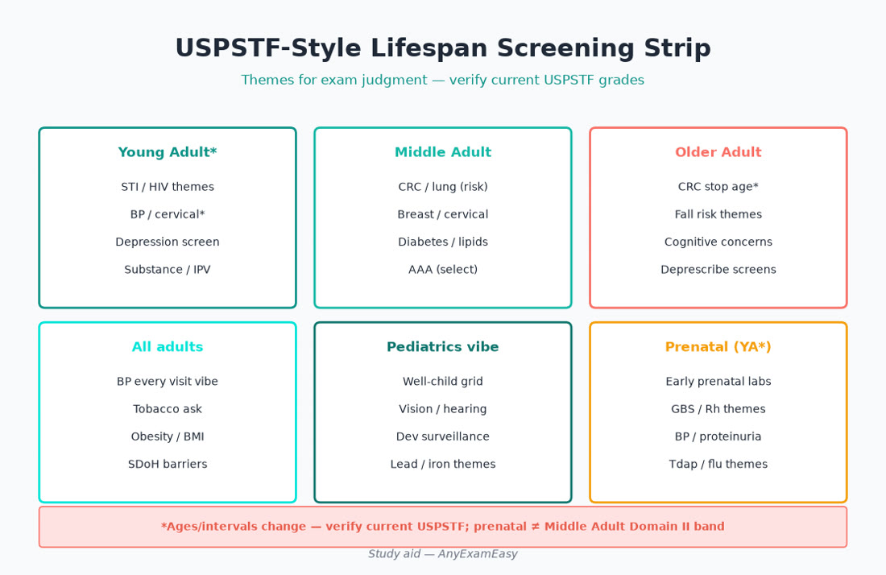
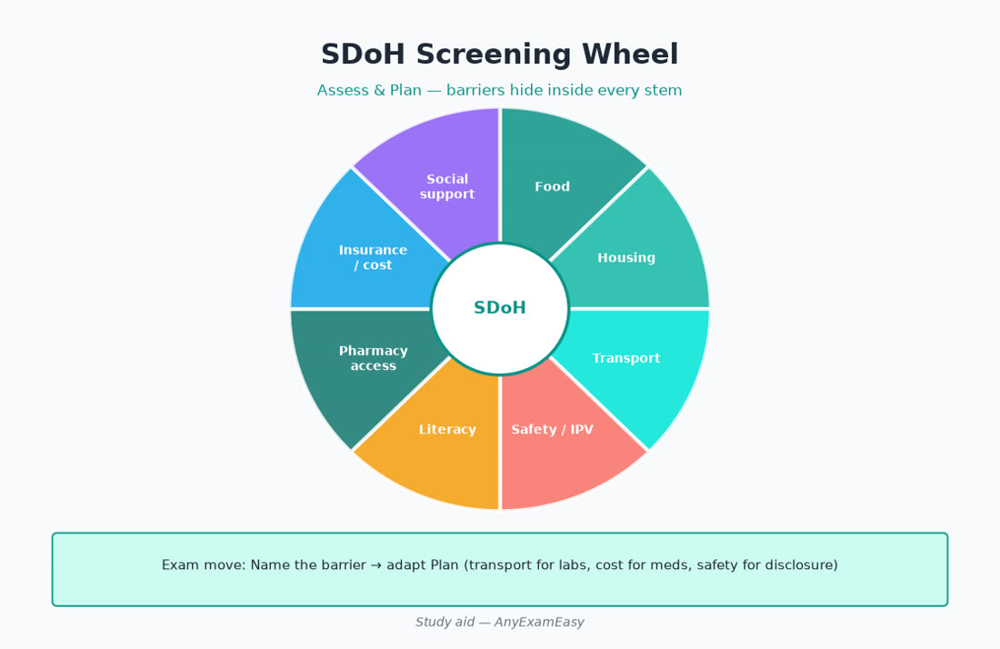
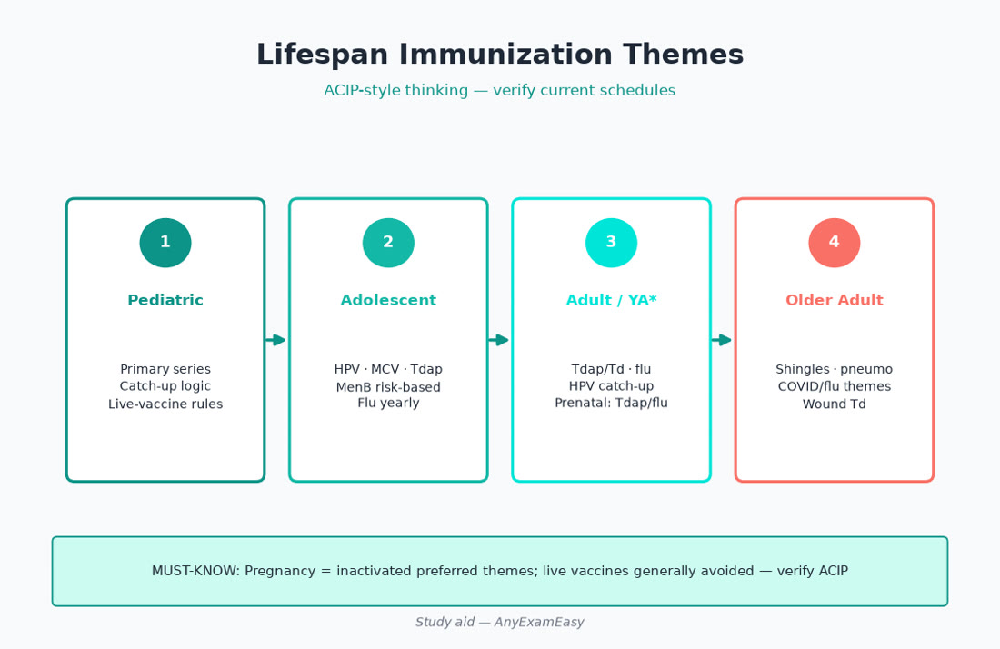

# Chapter 3 — Health Promotion & Screening

> **Study aid only.** Screening and immunization themes follow USPSTF-style and ACIP-style thinking for exam judgment. Recommendations change — verify current USPSTF, ACIP/CDC, specialty guidance, and AANPCB handbook before clinical use.

---

> **MUST KNOW** — Stability first. Then ADPE. Then age band (Older Adult 30%; prenatal in YA*).

> **HIGHLIGHT** — Scan MUST KNOW / TRAP boxes before bed — they are your sprint sheet.

> **TRAP** — Memorizing drugs without disposition and lifespan twists.

> **LIFESPAN** — Atypical presentations and polypharmacy dominate Older Adult stems.

#### Critical checklist — open this chapter
- [ ] I can name the chapter’s can’t-miss emergencies
- [ ] I know one prenatal and one older-adult twist
- [ ] I will do practice questions after reading

## Why this chapter matters

Prevention is not a side quest. It is woven through **Assess/Plan/Evaluate** and every Domain II age band. Young/Middle/Older adults generate most prevention volume — but missed newborn screens, adolescent risk counseling, and prenatal prevention (inside **Young Adult\***) are classic traps. Items ask *who* to screen, *when to stop*, how to counsel briefly, and how SDoH explains “nonadherence.”

**Pair with practice:** Drill age-banded prevention sets, then mixed ADPE stems that hide a missing mammogram or overdue Tdap in pregnancy. Soft start: [anyexameasy.com](https://anyexameasy.com) ($27.99/mo after trial; trial terms on site).

---

## ADPE lens for prevention

| Process | Prevention behaviors |
| --- | --- |
| Assess | Risk factors, family Hx, surgical Hx (hysterectomy/mastectomy), smoking pack-years, sexual Hx, SDoH, life expectancy/frailty |
| Diagnose | Distinguish screening vs diagnostic testing; identify vaccine gaps as “problems to solve” |
| Plan | Offer evidence-aligned screens/vaccines; brief interventions; shared decisions; resource linkage |
| Evaluate | Confirm completion; track overdue lists; revisit readiness; monitor after positive screens |

---

## Topic A — Thinking in USPSTF logic (exam mindset)

- **Grade logic themes:** A/B generally offer; C selective/shared; D discourage; I insufficient — verify current grades; don’t memorize forever-fixed ages without checking.  
- Screening is for **asymptomatic** people. Symptoms → diagnostic pathway.  
- Harm matters: false positives, overdiagnosis (PSA themes), radiation, anxiety.  
- Start with age, sex/anatomy, pregnancy potential, smoking, sexual history, family history, and risk enhancers.  
- Frail older adults: life expectancy may modify cancer screening — shared decisions, not automatic endless colonoscopy.

---

## Topic B — High-yield screening map (verify current)

### Cardiometabolic

| Theme | Exam hooks |
| --- | --- |
| BP | All adults; technique; out-of-office confirmation |
| Lipids / ASCVD | Risk-based statin discussions; diabetes as enhancer |
| Diabetes/prediabetes | Age/BMI/risk-based themes |
| Obesity | BMI + counseling offer; waist adjunct |

### Cancer themes

| Theme | Hooks |
| --- | --- |
| Cervical | Cytology/HPV strategies by age; stop rules after adequate history + hysterectomy nuances |
| Breast | Mammography start/interval shared decisions in some bands — verify |
| Colorectal | Start-age themes; FIT vs colonoscopy options |
| Lung | Pack-year + quit-year eligibility for LDCT |
| Prostate | Shared decision — avoid automatic PSA |
| Skin | Opportunistic exam; ABCDE teaching; biopsy suspicious lesions |

### Infectious / prenatal-adjacent

HIV offer/risk-based themes · hepatitis C adult one-time themes (verify birth-cohort vs universal adult) · hepatitis B risk/pregnancy · STI intensification for young adults/pregnancy · prenatal panel themes (type/Rh, anemia, infections, GDM timing, GBS later — verify schedules)

### Behavioral / safety / bone / sensory

Depression (± anxiety) screens with **SI safety net** · alcohol/tobacco/substance brief interventions · IPV screening themes · fall risk older adults · osteoporosis screening older women (selected men) · vision/hearing opportunistic in elders

---

## Topic C — Immunizations (verify ACIP every year)

### Principles

Live vaccine precautions (pregnancy, severe immunocompromise themes) · catch-up exists · document counseling/VIS themes when asked · egg-allergy myths vs current influenza guidance — verify.

### Lifespan hooks

| Group | Themes |
| --- | --- |
| Infants/children | Series completeness; prematurity nuances |
| Adolescents | HPV, meningococcal decision themes, Tdap, influenza |
| Pregnancy | Inactivated influenza; Tdap each pregnancy timing; RSV themes as current |
| Adults | Td/Tdap, influenza, COVID per current, pneumococcal age/risk, zoster age, hep B adult themes |
| Older adults | Pneumococcal, zoster, higher-dose/adjuvant influenza themes as current |

**Trap:** Live vaccines in pregnancy; missing Tdap opportunity in pregnancy; assuming “I had shingles vaccine once forever ago” without checking product/age rules.

---

## Topic D — Counseling that scores (Plan)

### 5A-style brief intervention

Ask → Advise → Assess readiness → Assist → Arrange follow-up. Apply to tobacco, alcohol, activity, diet, sleep, safety.

### MI micro-skills

Open questions, affirmations, reflections, summaries; resist righting reflex; pair with concrete next step (quit date, med option, referral).

### Nutrition/activity language

DASH/Mediterranean patterns · sugar-sweetened beverage limits · protein + resistance work for older adults (sarcopenia) · sleep as BP/glucose lever.

---

## Topic E — SDoH (Assess/Plan/Evaluate glue)

Domains: food · housing · transport · utilities · interpersonal safety · literacy · insurance/pharmacy · immigration stress · digital access.

Uncontrolled A1c may be insulin rationing. Missed mammogram may be no ride. Plan moves: resources, regimen simplification, covered generics, sometimes *shorter* follow-up.

---

## Topic F — Health literacy & teach-back

Plain language · interpreter use (not minor children for complex consent) · teach-back · written AVS with return precautions · device demo for inhalers/insulin.

---

## Topic G — Special prevention lanes by Domain II

### Newborn/infant/child
Congenital screens follow-through · bilirubin risk · well-child periodicity · lead/anemia risk themes · dental varnish/fluoride themes as indicated · injury prevention anticipatory guidance.

### Adolescent\*
Confidential time · HEADDSS-style · HPV · sexual health · mood · substances · firearms/safety · sports physical as prevention opportunity — not only a form.

### Young Adult\* / prenatal
Preconception folate themes · medication teratogen review · prenatal visit cadence · vaccine opportunities · STI/HIV · intimate partner safety · postpartum depression screen themes.

### Middle Adult\*
Cancer screening peak · cardiometabolic assault · alcohol · sleep apnea · caregiver stress.

### Older Adult (30%)
Deprescribing · fall/bone · cognition/mood · vaccines · cancer screening stop rules · advance care planning · sensory impairment · elder abuse awareness.

---

## Clinical vignette 1 — Older adult wellness

**68-year-old** checkup; smokes ½ ppd; colonoscopy 12 years ago; no depression screen.

| ADPE | Action |
| --- | --- |
| Assess | Tobacco, CRC gap, PHQ, falls/vision, vaccines, BP/lipids/A1c |
| Diagnose | Tobacco use disorder; overdue CRC screen; screen for depression |
| Plan | Brief tobacco intervention ± pharmacotherapy themes; schedule CRC modality; ACIP vaccines; LDCT if eligible |
| Evaluate | Quit follow-up 1–2 weeks; confirm screening done; recheck PHQ |

**Distractors fail:** only refill HTN med; PSA without shared decision as the “main” prevention move; skip tobacco because “BP first.”

---

## Clinical vignette 2 — Adolescent\* sports physical

**16-year-old**; parent waiting.

| ADPE | Action |
| --- | --- |
| Assess | Confidential time; mood/substances/sex/safety; cardiac sports screen questions |
| Diagnose | Risk ID without over-pathologizing |
| Plan | Vaccines due; counseling; STI/contraception if indicated; clearance vs hold for cardiac red flags |
| Evaluate | Follow-up if PHQ/substance positives; vaccine series completion |

**Distractors fail:** refuse confidential time; clear for sports despite exertional syncope history without workup.

---

## Clinical vignette 3 — Prenatal prevention inside YA\*

**28-year-old** at 28 weeks; no Tdap yet; smoking cut down; PHQ-2 positive.

| ADPE | Action |
| --- | --- |
| Assess | Prenatal care gaps, mood safety, tobacco, domestic safety |
| Diagnose | Overdue gestational Tdap opportunity; tobacco use; possible depression — assess SI |
| Plan | Tdap timing themes; tobacco assist; mental health plan; Ob coordination as needed |
| Evaluate | Confirm vaccine given; mood follow-up; cessation check |

**Distractors fail:** live vaccine offers; ignore PHQ; delay Tdap to postpartum without reason.

---

## Exam traps

| Trap | Fix |
| --- | --- |
| Screening a symptomatic patient | Diagnostic workup |
| Endless cancer screening in severe frailty | Shared decision / stop rules |
| Skipping SDoH | Barrier-focused Plan |
| Memorizing one fixed mammogram age forever | Verify current USPSTF-style guidance |
| Forgetting prenatal vaccines | YA\* includes prenatal |
| No SI assessment after positive depression screen | Safety first |

---

## Quick checklist — prevention

- [ ] Age/anatomy/pregnancy potential known  
- [ ] Screening vs diagnostic distinguished  
- [ ] Cardiometabolic screens considered  
- [ ] Cancer screens age/risk-appropriate  
- [ ] HIV/hep/STI themes offered when indicated  
- [ ] Vaccines: live-vaccine safety checked  
- [ ] Depression screen + SI pathway  
- [ ] Tobacco/alcohol brief intervention  
- [ ] SDoH scanned  
- [ ] Teach-back used  
- [ ] Older adult fall/bone/vaccine/deprescribing considered  
- [ ] Evaluate: completion tracking  

---

## Remember this

- Prevention lives inside ADPE — not a separate optional chapter in your brain.  
- Older Adult 30% means vaccines, falls, and stop-rules matter as much as “start screens.”  
- Verify USPSTF/ACIP — teaching themes age.  

**Practice prevention + ADPE items** on [AnyExamEasy](https://anyexameasy.com) — start free; $27.99/mo after trial (trial terms on site).

---

## Topic H — Shared decision tools (Plan language)

When stems involve PSA, mammography timing preference-sensitive bands, lung cancer screening eligibility borderline cases, or continuing cancer screening in limited life expectancy:
- Explain benefit and harm in absolute terms when possible.  
- Ask values (fear of cancer vs fear of procedures/false positives).  
- Document the decision.  
- Offer a revisit — readiness changes.

### Chemoprevention / preventive meds awareness (themes only)

Aspirin for primary prevention is no longer a casual “everyone over 50” reflex — risk of bleed vs ASCVD benefit is individualized (verify current USPSTF-style guidance). Statins are prevention *and* therapeutics. PrEP for HIV in appropriate risk is prevention therapeutics — screen and refer/initiate per training and guidelines. Don’t invent eligibility cutoffs under stress; recognize the *lane*.

---

## Topic I — Occupational, environmental, travel, school forms

FNP prevention includes:
- School/camp forms as chances to catch vaccine gaps and mental health.  
- Travel: vaccines/meds timing, malaria themes by destination — often refer travel clinic if complex.  
- Occupation: noise, chemical, shift work, needlestick policies.  
- Environmental: lead risk housing, smoke exposure, heat risk in elders.

---

## Topic J — Population health & panel management (Evaluate at scale)

Even on an individual exam, items may imply panel thinking: overdue colorectal lists, uncontrolled HTN outreach, postpartum depression screening workflows, standing orders for vaccines under protocol. Choose options that close loops — not “advise patient to remember someday.”

---

## Prevention mnemonic for last-minute review

**VITALS-P:** Vaccines · Intake (diet/alcohol) · Tobacco · Activity · Loneliness/mood/safety · Screens (cancer/ID/metabolic) · Prenatal/parenting as age-appropriate · SDoH.

---

## Concept checks

**1.** Rectal bleeding in average-risk 52-year-old — mindset?  
A. Wait until screening birthday only  B. Diagnostic evaluation for symptoms  C. Reassure hemorrhoids always  D. Vitamin D only  
**Answer:** B.

**2.** Largest Domain II weight?  
A. Newborn  B. Adolescent  C. Older Adult 30%  D. Toddler  
**Answer:** C.

**3.** Best prevention counseling pattern?  
A. 20-minute lecture  B. Brief intervention + arrange follow-up  C. Pamphlet only  D. Skip tobacco if A1c high  
**Answer:** B.

---

## Appendix — Age-band prevention sprint cards

### Newborn / infant / child (small Domain II % — high regret)
- Hearing/metabolic screen follow-through  
- Growth plotting + development surveillance  
- Vaccine series on time; catch-up without panic inventing intervals  
- Anticipatory guidance: sleep safe, choking, car seats, dental  
- Lead/anemia risk questions when indicated  

### Adolescent* (9%)
- Confidential HEADDSS  
- HPV series  
- Depression/anxiety/substance  
- Sexual health + consent education  
- Sports cardiac screen questions; concussion return-to-play awareness  

### Young Adult* incl. prenatal (22%)
- Cervical/STI/HIV as indicated  
- Preconception: folate, teratogen med review, glycemic control if diabetes  
- Prenatal visit rhythm + vaccines (influenza, Tdap timing, RSV themes as current)  
- Postpartum mood screen  

### Middle Adult (26%)
- Cardiometabolic + cancer screens peak  
- Alcohol, sleep apnea, caregiver stress  
- Skin checks opportunistic  

### Older Adult (30%)
- Vaccines with product nuances  
- Fall/bone/vision/hearing  
- Cognition/mood  
- Deprescribing Beers themes  
- Cancer screening stop conversations  
- Advance care planning  

### One-page “offer today” habit in adult visits
BP · tobacco · BMI · depression · vaccines due · cancer screen status · sex/safety as appropriate · meds that need monitoring labs.

---

## Deep prevention counseling scripts (Plan)

**Tobacco:** “The most important thing you can do for your BP and lungs is stop smoking. I’m recommending varenicline/NRT themes if appropriate — verify — and a quit date this week. Can we problem-solve triggers?”  

**Colon cancer screen:** “You have two good options — colonoscopy or FIT stool testing — let’s match to your values and access.”  

**Lung CT eligibility:** “Because of your pack-years and age, low-dose CT can find cancers earlier — also false alarms happen; here’s what follow-up looks like.”  

**Depression screen positive:** “Thanks for telling me. Are you having thoughts of wanting to die or of hurting yourself?” — never skip safety.

**Vaccine hesitancy:** Ask concerns; affirm autonomy; share specific disease risk relevant to age (zoster pain, pneumococcal hospitalization in elders, HPV cancer prevention); offer without shaming; revisit.

### Clinic system Evaluate

Standing orders for vaccines, overdue registries, after-visit summaries listing open screens, and referral navigators close loops — choose answer options that institutionalize completion when stems allow.

---

## Preconception & interconception care (YA\* bridge)

Between pregnancies and before first pregnancy: optimize BMI, glycemic control, BP, teratogenic med switches (ACEI, some AEDs, isotretinoin systems), folate, rubella immunity awareness, smoking/alcohol, dental, mental health. This is Domain II Young Adult\* gold often missed by adult-medicine-only study plans.

---

## Prevention item anatomy (how stems disguise ADPE)

Many “prevention” items are Assess items in disguise (“which additional history?”) or Plan items (“which vaccine today?”) or Evaluate items (“which follow-up confirms screening completion?”). Label the verb. A stem about mammography in a woman with a breast lump is **not** screening — it is diagnostic delay if you schedule “routine mammogram in 6 months.”

### Health disparities lens

Race, language, rural access, disability, and insurance alter completion of screening. Choosing culturally appropriate education, interpreters, and navigators is evidence-informed practice — not “extra.” Older adults in facilities need vaccine programs brought to them. Adolescents need confidential billing awareness so STI screens aren’t auto-disclosed via EOBs when possible.

### Dental, vision, hearing — primary care adjacent

Oral health affects diabetes/CVD inflammation themes; fluoride/dental referral for kids; vision screens for driving safety and diabetes retinopathy referral pathways; hearing loss → isolation/depression in elders. Mention when stems offer the option.

### Final prevention checklist add-ons
- [ ] Preconception offered when relevant  
- [ ] Postpartum mood screen not forgotten  
- [ ] PrEP/HIV prevention lane recognized for risk  
- [ ] Aspirin primary prevention not reflexive  
- [ ] Shared decision documented when preference-sensitive  

### Closing prevention remember-this
- Domain II drives prevention priorities; Older Adult 30% means stop-rules and vaccines matter.
- Screening ≠ diagnostic testing for symptoms.
- SDoH explains many Evaluate failures.
- Verify USPSTF/ACIP yearly — teaching ages drift.
- Soft practice: https://anyexameasy.com ($27.99/mo after trial; trial terms on site).

---

