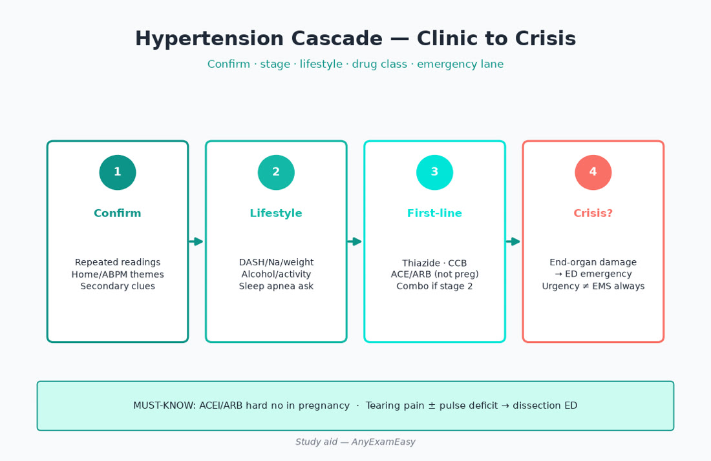
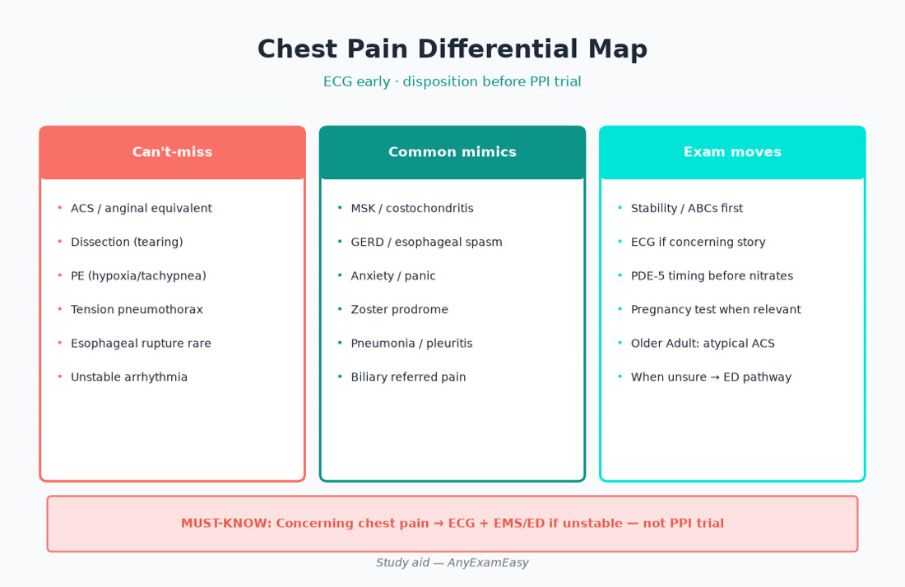
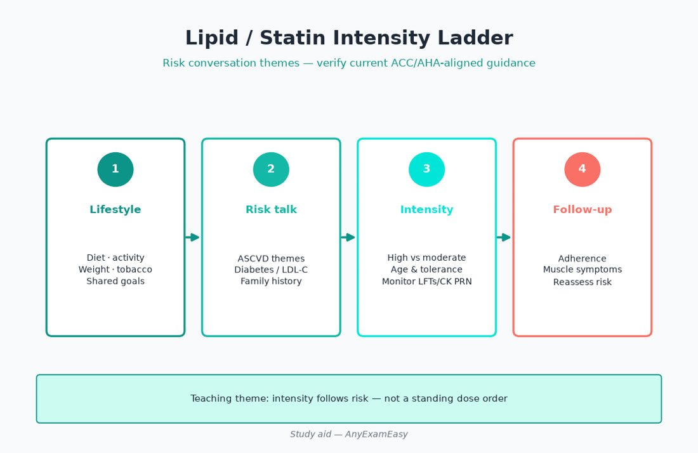
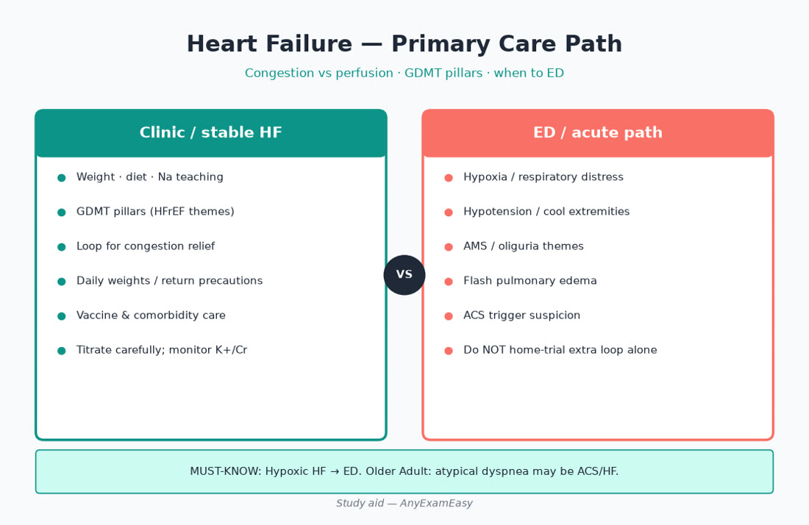
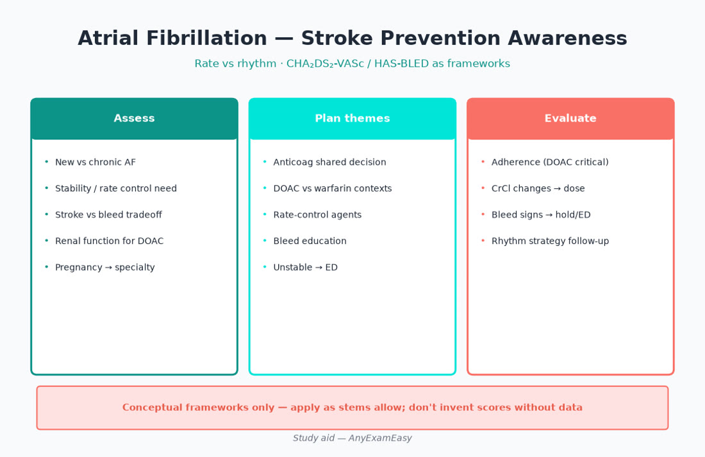

# Chapter 4 — Cardiology

> **Study aid only.** Guideline themes for primary-care FNP exam judgment — not individualized prescribing or a protocol. Verify current ACC/AHA-aligned and related guidance, FDA labeling, and the AANPCB Candidate Handbook. When drugs or intervals appear below, treat them as **teaching themes to verify**, not standing orders.

---

> **MUST KNOW** — Stability first. Then ADPE. Then age band (Older Adult 30%; prenatal in YA*).

> **HIGHLIGHT** — Scan MUST KNOW / TRAP boxes before bed — they are your sprint sheet.

> **TRAP** — Memorizing drugs without disposition and lifespan twists.

> **LIFESPAN** — Atypical presentations and polypharmacy dominate Older Adult stems.

#### Critical checklist — open this chapter
- [ ] I can name the chapter’s can’t-miss emergencies
- [ ] I know one prenatal and one older-adult twist
- [ ] I will do practice questions after reading

## Why this chapter matters

Cardiology is the backbone of outpatient adult primary care — and it sits squarely where AANPCB puts the most Domain II weight: **Middle Adult 26%** and **Older Adult 30%**, with **Young Adult\* 22%** (including prenatal hypertensive disorders themes). Domain I still grades every item by process: Did you **Assess** BP correctly and catch instability? **Diagnose** urgency vs emergency and the right differential lane? **Plan** lifestyle + compelling-indication therapy? **Evaluate** labs, home readings, and adherence?

Expect stems on hypertension cascades, statin risk conversations, chest-pain triage, heart-failure congestion vs perfusion, atrial fibrillation rate-vs-anticoagulation decisions, and syncope red flags. Candidates who memorize drug lists without ADPE lose easy points; candidates who send unstable patients home with “trial of PPI” lose dangerous ones.

**Pair with practice:** After each topic block, run related items in a strong Qbank, review every miss, and tag your error log with age band + ADPE stage. Soft start: [anyexameasy.com](https://anyexameasy.com) ($27.99/mo after trial; trial terms on site).

---

## ADPE lens for cardiology

| Domain I process | What it looks like in cardio stems |
| --- | --- |
| **Assess (32%)** | BP technique, orthostatics, volume exam, murmur timing, pulse deficit, edema, home logs, med/NSAID/stimulant history, pregnancy status, SDoH (can they afford DOAC?), fall risk on anticoag |
| **Diagnose (26.5%)** | HTN stage/resistant/secondary cues; ACS vs PE vs dissection vs MSK; HFrEF vs HFpEF suspicion; AF vs SVT themes; urgency vs emergency |
| **Plan (26.5%)** | Lifestyle + first-line classes; statin intensity themes; ED vs outpatient; anticoagulation shared decision; teach nitro/weights/bleed precautions |
| **Evaluate (15%)** | K/Cr after ACEI/ARB/MRA; BP response; statin tolerance after interaction check; weight trajectory in HF; DOAC adherence/refills; when to revise diagnosis |

**Red-flag filter first:** hypoxia, hypotension, ongoing ischemic pain, neuro deficit, tearing severe chest/back pain, syncope with exertional or cardiac features → disposition before clever outpatient titration.

---

## Topic A — Hypertension (primary care core)

### Presentation & pathophysiology themes

Sustained elevated arterial pressure damages vessels and end organs (heart, brain, kidney, eye). Most primary care HTN is primary (essential); secondary causes are less common but exam-favorite when clues stack (resistant HTN, unprovoked hypokalemia, abdominal bruit, OSA, pheo-like spells, coarctation in young adults, sudden onset after 55, CKD out of proportion).

### Assessment — get this right before you escalate

- Seated, back supported, feet on floor, arm at heart level, correct cuff size, quiet rest; avoid caffeine/exercise/smoking just before when possible.  
- Confirm with repeat readings and **out-of-office** data (home or ambulatory) when feasible — white-coat and masked HTN change plans.  
- Orthostatics in older adults, diabetics, and volume-depleted patients before aggressive titration.  
- Med reconciliation: NSAIDs, decongestants, stimulants, excess alcohol, licorice, abrupt clonidine stop.  
- Pregnancy / pregnancy potential before ACEI/ARB.

### Red flags

| Finding | Meaning on exam |
| --- | --- |
| Severe BP + end-organ damage (encephalopathy, ACS, acute HF, aortic emergency, papilledema themes, AKI with crisis) | **Hypertensive emergency → ED** |
| Very high BP without acute end-organ damage | Urgency themes — controlled outpatient adjustment; avoid precipitous plunges causing ischemia |
| Sudden tearing pain ± pulse deficit | Dissection lane — ED, not clinic clonidine |
| Pregnancy + HTN ± headache/visual/RUQ/proteinuria cues | Obstetric hypertensive disorder pathway — do not casual-titrate ACEI |

### Differentials / labels to hold

Primary HTN · white-coat · masked · secondary · resistant (≥3 agents at optimal doses including diuretic themes, adherence confirmed) · pseudoresistance (wrong cuff, nonadherence).

### First-line workup themes (verify current guidance)

BMP (electrolytes/Cr), lipids, A1c or glucose themes, urinalysis ± urine albumin-creatinine, ECG when useful. Add TSH, sleep study referral, renal duplex, aldosterone/renin themes, plasma metanephrines **when secondary cues present** — not shotgun every mild HTN.

### Plan themes (pharmacology = classes + compelling indications)

| Situation | Therapy thinking (verify doses/guidelines) |
| --- | --- |
| Many adults without compelling indication | Thiazide-type, ACEI, ARB, or DHP-CCB |
| CKD with albuminuria / diabetes with albuminuria | ACEI or ARB themes |
| HFrEF | GDMT-aware choices (see HF section) — beta blocker evidence agents, etc. |
| Black adults, HTN alone (nuance) | CCB or thiazide often preferred initially per guideline themes |
| Pregnancy | Avoid ACEI/ARB; obstetric-preferred agents (historical teaching examples: labetalol, nifedipine, methyldopa — **verify current Ob guidance**) |
| Markedly above goal | Combination therapy themes; single-pill combos help adherence |
| Resistant | Confirm adherence & interfering meds; add MRA themes often discussed; seek secondary causes |

Lifestyle is not optional Plan language: sodium reduction, DASH-style pattern, weight, activity, alcohol limits, OSA evaluation, tobacco cessation.

### Evaluate

- Recheck K⁺/Cr after ACEI/ARB/MRA start or uptitration.  
- Home BP log technique + follow-up interval matched to severity.  
- Cough on ACEI → switch thinking to ARB (angioedema is different — never casual rechallenge).  
- Edema on DHP-CCB ≠ automatic HF — compare to congestion signs.

### Lifespan notes

- **Peds/adolescent\*:** Confirm technique; look harder for secondary causes; lifestyle first in many essential HTN teens; sports clearance implications.  
- **Prenatal (Young Adult\*):** Different diagnostic labels (gestational HTN, preeclampsia spectrum) — collaborate with Ob; emergency features need L&D/ED pathways.  
- **Older Adult (30%):** Start lower/go slower themes; orthostasis/falls; polypharmacy; isolated systolic HTN common; still treat — don’t nihilistically ignore.

---

## Topic B — Dyslipidemia & ASCVD risk conversations

### Presentation

Often silent until event or lab finding. Sometimes xanthomas/arcus in severe genetic lipid disorders (refer). Triglyceride-driven pancreatitis presents as acute abdomen — different lane.

### Assess

ASCVD history (secondary prevention?), diabetes, CKD, smoking, BP, family premature ASCVD, inflammatory disease themes, current meds (steroids, antipsychotics), adherence barriers, prior “statin intolerance” story (was it interaction? vitamin D? hypothyroidism?).

### Diagnose / risk frame

- Secondary prevention nearly always high-intensity statin themes unless contraindicated.  
- Primary prevention uses risk estimators + risk enhancers (verify current calculator/guideline year).  
- Very high TG → pancreatitis prevention mindset + glycemic control/alcohol/weight.

### Plan themes

Statins are outcome drugs, not cosmetic LDL erasers. Nonstatins (ezetimibe, PCSK9 mAbs, bempedoic acid themes) enter when LDL remains above threshold on maximally tolerated statin or true intolerance after workup. Counsel: benefit timeline, muscle symptom reporting, pregnancy avoidance themes (labeling has evolved — verify; many exam stems still treat as avoid in pregnancy unless told otherwise).

### Evaluate

Lipid follow-up timing per guideline themes; recheck adherence before adding agents; review CYP/transporter interactors (simvastatin/lovastatin + strong CYP3A4 inhibitors classic trap).

### Older adult / prenatal

- Older adults: shared decisions if limited life expectancy/frailty — still offer if secondary prevention clear benefit.  
- Pregnancy: shift to Ob-aligned lipid strategies; bile acid sequestrants historically discussed in selected cases — verify.

---

## Topic C — Chest pain & ischemic heart disease

### Presentation spectrum

Pressure/squeeze ± radiation, dyspnea, diaphoresis, nausea, sense of doom. **Atypical patterns** dominate in women, older adults, and diabetes (fatigue, epigastric “indigestion,” dyspnea alone, confusion). Stable angina is exertional and predictable; unstable is new/crescendo/rest.

### Must-not-miss differential board

| Lane | Clues that keep it on the board |
| --- | --- |
| ACS | Exertional/pressure, diaphoresis, ECG changes, risk factors |
| PE | Sudden dyspnea/pleuritic pain, tachycardia, VTE risks |
| Aortic dissection | Sudden severe tearing, pulse/BP asymmetry, neuro signs |
| Pneumothorax | Sudden unilateral pain/dyspnea, trauma/tall thin themes |
| Esophageal rupture | Severe vomiting then pain (ED rare catastrophe) |
| Pericarditis | Positional, rub, diffuse ST themes |
| Mimics | MSK reproducible, GERD, panic, zoster prodrome, pneumonia |

### Assess in clinic

ABCs/stability first. If unstable or high-risk ischemic story → **ECG + EMS/ED**, not a 20-minute lifestyle lecture. Ask PDE-5 inhibitor timing before any nitrate thinking. Pregnancy test when relevant to differential (PE, dissection less, but abdominal/chest atypical + young adult*).

### Workup themes

ECG is the bedside king in concerning pain. Troponin belongs to ED/ACS pathways. D-dimer/CT pathways for PE are pretest-probability driven. Chest film when cardiopulmonary alternate diagnoses plausible.

### Chronic CAD Plan themes

Risk-factor assault (statin, antiplatelet as indicated, BP, diabetes, tobacco). Antianginal ladder themes: beta blocker, CCB, long-acting nitrate, ranolazine awareness — verify. **Nitroglycerin + PDE-5 inhibitors = hard contraindication.** After PCI: uninterrupted dual antiplatelet adherence is stent-protective — calendar counseling; dental/surgery holds coordinated with cardiology.

### Refer / ED

Ongoing pain, hemodynamic instability, syncope with pain, new HF signs, ECG ischemic changes → ED. Progressive stable angina despite meds → cardiology.

---

## Topic D — Heart failure in primary care

### Concepts

HF is a clinical syndrome of congestion and/or inadequate perfusion due to structural/functional cardiac impairment. Ejection fraction labels (HFrEF vs HFpEF) need imaging — arrange echo through appropriate pathways. Primary care owns early recognition, volume teaching, GDMT adherence/labs, vaccines, and knowing when the floor is safer than the clinic.

### Assess — congestion vs hypoperfusion

| Congestion cues | Hypoperfusion cues |
| --- | --- |
| Orthopnea, PND, rales, edema, JVD, weight gain, ascites | Cool extremities, narrow pulse pressure, altered mentation, oliguria, hypotension, lactate themes in ED |

### Red flags → ED

Hypoxia, hypotension, ACS overlap chest pain, rapid AF with instability, flash edema, altered mentation, suspected arrhythmia storm.

### Diagnose

Precipitants: ischemia, arrhythmia, infection, anemia, thyroid, NSAIDs/TZDs, dietary indiscretion, missed diuretics, uncontrolled HTN. BNP/NT-proBNP and CXR support but don’t replace exam. Echo characterizes phenotype.

### Plan themes

- Loop diuretics for congestion; daily weights; sodium counseling individualized.  
- HFrEF GDMT awareness: ARNI/ACE/ARB, evidence-based beta blockers (carvedilol/metoprolol succinate/bisoprolol themes), MRA, SGLT2 inhibitor — cardiology often titrates, FNP catches adherence, hypotension, K/Cr.  
- ACEI→ARNI washout awareness (angioedema risk).  
- Avoid NSAIDs. Vaccinate (influenza, pneumococcal, COVID per current ACIP).  
- HFpEF: treat congestion, BP, AF, obesity, diabetes — fewer “miracle” outpatient tricks; still high older-adult burden.

### Evaluate

Weight diary, symptom scores, K/Cr after uptitration, refill gaps, caregiver teaching, advance care planning as disease progresses, timely post-hospital follow-up (transitions of care = Domain I Evaluate gold).

### Lifespan

Rare in pediatrics (congenital/myocarditis — refer). Pregnancy/peripartum cardiomyopathy themes → specialty. Older adults: atypical presentations (fatigue, confusion), polypharmacy, fall risk with overdiuresis.

---

## Topic E — Atrial fibrillation & rate/rhythm

### Presentation

Palpitations, fatigue, dyspnea, effort intolerance — or asymptomatic on ECG. Irregularly irregular pulse; pulse deficit possible. New AF may present as embolic stroke — prevention mindset.

### Assess

Stability (rate, BP, ischemia, HF). Triggers: alcohol (“holiday heart”), infection, thyroid, surgery, sleep apnea, electrolyte shifts. Bleed risk, fall risk, CrCl for DOAC dosing themes, mechanical valve history, pregnancy.

### Diagnose lanes

New vs chronic; valvular vs nonvalvular themes; rate control vs rhythm control candidates; stroke risk vs bleed risk tradeoff. CHA₂DS₂-VASc / HAS-BLED are **conceptual frameworks** — apply as stems allow; don’t invent scores without data.

### Plan themes

- Unstable → ED for rate/rhythm emergency care.  
- Anticoagulation decision is **independent** of “I feel fine in sinus” after cardioversion themes — duration/risk rules apply (verify).  
- DOAC vs warfarin: mechanical valves / certain antiphospholipid syndromes → warfarin territory; DOACs need renal dosing discipline.  
- Rate control: beta blockers, non-DHP CCBs (avoid in decompensated HFrEF themes), digoxin adjunct awareness.  
- Rhythm: refer for antiarrhythmics/ablation discussions; amiodarone multi-organ monitoring if already prescribed.

### Evaluate

Renal function periodic on DOAC; INR cadence on warfarin; adherence/refill gaps; bleeding events; sleep apnea treatment; thyroid if on amiodarone.

---

## Topic F — Syncope, palpitations, murmurs, PAD (high-yield triage)

### Syncope

- **Red flags:** exertional, supine, family sudden death, abnormal ECG, HF, murmur suggesting obstruction (HOCM/AS themes), neuro deficit.  
- Vasovagal common in younger patients with prodrome.  
- Older adults: cardiac syncope, orthostasis, meds (diuretics, vasodilators, PD meds) rise in pretest probability.  
- Disposition: red-flag syncope → ED/urgent cardiology — not “drink more water” alone.

### Palpitations

Capture ECG; consider ambulatory monitor; screen anemia, thyroid, stimulants, anxiety — but don’t miss VT risk features (structural heart disease, syncope, family SCD).

### Murmurs

Know bedside descriptors enough to triage: systolic vs diastolic, radiation, change with Valsalva (HOCM themes), symptomatic AS in older adult → cardiology. Fever + new murmur → endocarditis pathway thinking.

### PAD

Claudication, pulse deficits, wound healing issues; high-intensity statin themes; smoking cessation critical; antiplatelet therapy; cilostazol contraindicated in HF; refer vascular for critical limb ischemia (rest pain, ulcer, gangrene).

---

## Clinical vignette 1 — Middle adult\* with “just stress BP”

**Stem:** 52-year-old teacher, BP 162/98 and 158/96 today (correct technique). BMI 31. Father MI at 54. Takes ibuprofen for knee pain most days. Fasting glucose last year 116. She wants “a calm pill only if I have to.”

### Assess
- Confirm out-of-office plan; med/NSAID use; OSA snoring; activity; sodium; tobacco/alcohol; SDoH/pharmacy coverage.  
- Age band: Middle Adult (26% Domain II). Compelling ASCVD family history.

### Diagnose
- Hypertension (confirmed pattern pending home readings). Prediabetes risk. NSAID-associated BP elevation contributor. Elevated ASCVD risk — statin conversation likely.

### Plan
- Lifestyle intensive (weight, DASH, activity, sodium, sleep).  
- Reduce/eliminate chronic NSAID; prefer acetaminophen or topical strategies when appropriate (verify).  
- Start first-line antihypertensive class theme matched to patient; discuss ACEI/ARB if albuminuria/diabetes pathway emerges after labs.  
- Order BMP, lipids, A1c, UACR as indicated; shared statin decision per risk.  
- Teach home BP technique.

### Evaluate
- Follow-up 2–4 weeks with home log + BMP if ACEI/ARB started.  
- Reassess NSAID cessation and adherence barriers.

### Why distractors fail
- “Lifestyle only for 6 months with BP 160s and strong family history” delays risk reduction without close confirmation plan.  
- “Start ACEI+ARB dual therapy” — not appropriate dual blockade.  
- “Ignore NSAIDs” misses a reversible driver.  
- “CT coronaries today” — wrong first move for asymptomatic elevated BP.

---

## Clinical vignette 2 — Older adult with dyspnea (don’t miss HF/ACS)

**Stem:** 74-year-old with orthopnea, 8-lb weight gain, ankle edema. HR 108 irregular, BP 150/88, SpO₂ 90% on room air. Remote smoker. On amlodipine and ibuprofen for “arthritis.”

### Assess
- Hypoxia + congestion signs + irregular tachycardia — Older Adult 30% band. Med list (NSAID, DHP-CCB edema confounder). Volume exam, JVD, lung sounds, ECG if available in clinic.

### Diagnose
- Acute decompensated HF highly likely; AF with rapid ventricular response possible; ACS precipitant possible. **Not** “amlodipine ankle swelling only” when hypoxic.

### Plan
- EMS/ED — oxygen per protocol, not home trial of extra furosemide without monitoring.  
- Later (post-stabilize): echo, GDMT, stop NSAID, vaccine update, weight teaching, cardiology collaboration as needed.

### Evaluate
- Transitions: med rec within days of discharge, K/Cr, weight diary, rate/anticoag plan if AF confirmed, SDoH for med costs.

### Why distractors fail
- “Increase amlodipine for BP” worsens edema narrative and ignores hypoxia.  
- “Outpatient azithromycin for bronchitis” — wrong frame for orthopnea + edema + hypoxia.  
- “Reassure CCB edema” — hypoxia breaks that story.  
- “Start DOAC in clinic without confirming AF diagnosis/CrCl/bleed risk” — premature.

---

## Clinical vignette 3 — Young adult\* AF vs stimulant / thyroid / PE lane

**Stem:** 29-year-old with palpitations and mild dyspnea after a respiratory illness. HR 128 irregular, BP 118/70, SpO₂ 98%. Takes no meds; drinks socially; uses nicotine pouches. Last menstrual period 6 weeks ago.

### Assess
- Stability OK-ish but new rapid irregular rhythm. **Pregnancy test** before imaging/meds that matter. Stimulant/nicotine/alcohol triggers. Chest pain? Leg swelling? TSH later. Young Adult\* includes prenatal.

### Diagnose
- New AF with RVR vs other SVT — ECG differentiates. Differential includes thyrotoxicosis, PE if risk, myocarditis post-viral, substance trigger. Pregnancy changes anticoagulation and imaging choices.

### Plan
- Urgent ECG; if AF with instability criteria → ED. If stable, urgent evaluation pathway still needed for new AF — rate control themes and anticoagulation decision rules differ by duration/risk; pregnancy → specialty.  
- Soft: stop nicotine, limit alcohol; evaluate thyroid; consider sleep/ stimulants.

### Evaluate
- Confirm rhythm diagnosis, pregnancy result, specialist follow-through, trigger counseling.

### Why distractors fail
- “Metoprolol prescription and routine follow-up in 3 months” without ECG/pregnancy/urgency — undertriage.  
- “CTPE on every palpitations patient” without pretest — shotgun.  
- “Warfarin today without indication clarity” — premature.  
- “Ignore LMP” — misses prenatal Domain II mapping and drug safety.

---

## Exam traps / common miss patterns

| Trap | What to do instead |
| --- | --- |
| Treating one anxious BP as diagnosis without confirmation plan | Technique + repeats + out-of-office |
| ACEI/ARB in pregnancy | Stop/switch per Ob guidance |
| Dual ACEI+ARB | Avoid |
| PPI trial for crushing pressure pain | ECG/ED first |
| Forgetting anticoagulation because rate is controlled | Stroke risk is separate |
| Labeling all CCB edema as HF | Compare congestion vs drug edema |
| Starting statin intensity by “LDL looks meh” only | Match indication/risk intensity themes |
| Ignoring NSAIDs in HTN/HF | Deprescribe when possible |
| Sending hypoxic “bronchitis” home | Reassess for HF/PE/pneumonia |
| Cilostazol in HF patient for PAD | Contraindication theme |

---

## Quick checklist — cardiology

- [ ] BP technique + out-of-office confirmation plan  
- [ ] Pregnancy screen before ACEI/ARB and before radiation when relevant  
- [ ] Compelling indications drive antihypertensive class  
- [ ] Hypertensive emergency vs urgency disposition correct  
- [ ] Chest pain differential includes ACS/PE/dissection  
- [ ] ECG early in concerning chest pain/palpitations/syncope  
- [ ] Statin intensity matched to secondary vs primary prevention themes  
- [ ] HF: congestion vs perfusion; daily weights; no NSAIDs  
- [ ] AF: anticoagulation decision ≠ rate-control decision; valves matter  
- [ ] PDE-5 inhibitor + nitrate contraindication  
- [ ] Older adult orthostasis/falls/polypharmacy considered  
- [ ] SDoH: can the patient obtain and take the med?  
- [ ] Evaluate labs (K/Cr) after ACEI/ARB/MRA changes  
- [ ] Post-hospital HF/ACS transitions scheduled  

---

## Remember this

- Domain II reality: most cardio stems live in middle/older adult — atypical ACS is still ACS.  
- ADPE order: stability and can’t-miss differentials before clever titration.  
- Teaching doses/intervals change — verify guidelines and labels.  
- Independent study aid — not AANPCB/AANP; no pass guarantee.

**Next practice move:** Drill HTN, lipids, chest pain triage, HF, and AF items with full rationale review on [AnyExamEasy](https://anyexameasy.com) — start free; $27.99/mo after trial (trial terms on site).

---

## Topic G — Anticoagulation judgment for the FNP (primary-care ownership)

You may not start every anticoagulant, but you will **Assess** bleed/fall risk, **Diagnose** whether indication is still valid, **Plan** peri-procedural holds with specialists, and **Evaluate** adherence and bleeding.

### Warfarin vs DOAC decision themes

| Lens | Warfarin leans | DOAC leans |
| --- | --- | --- |
| Indication | Mechanical valves; selected APS; some valvular disease themes | Many nonvalvular AF and VTE cases when eligible |
| Monitoring | INR cadence; diet K consistency | Renal/hepatic dosing; adherence critical (short half-life) |
| Interactions | Many antibiotics/amiodarone/food | P-gp/CYP themes agent-specific |
| Reversal | Vitamin K ± concentrates (specialty) | Agent-specific pathways — know “seek emergency care for major bleed” |

### Evaluate hooks that show up on items

- Missed DOAC doses → don’t invent doubling rules; use labeling/specialty advice.  
- New antibiotic on warfarin → INR plan, not vibes.  
- CrCl decline in older adult → DOAC dose may need adjustment or agent change.  
- Epistaxis/melena/hematuria on therapy → assess severity; hold/ED as indicated; look for underlying lesion when appropriate.

### Transitions of care

Hospital starts anticoagulant → primary care confirms indication, duration (provoked VTE vs AF indefinite themes), pharmacy access, and follow-up labs. Duration errors (stopping AF anticoagulation because “rate is fine”) are classic misses.

---

## Topic H — Hypertensive disorders thinking across prenatal\* and primary care

Because prenatal content maps into **Young Adult\***, FNP candidates must recognize:

- Chronic HTN vs gestational HTN vs preeclampsia spectrum cues (headache, visual changes, RUQ pain, proteinuria themes, hyperreflexia in severe disease).  
- ACEI/ARB exposure requires immediate regimen change and Ob coordination.  
- Postpartum BP follow-up matters — preeclampsia complications can declare after delivery.  
- Do not manage severe features in an unsupervised primary-care lane — disposition to obstetric emergency care.

---

## Topic I — ECG literacy for triage (not cardiologist-level reading)

You are not scored on naming every fascicular block. You *are* scored on recognizing when an ECG (or lack of one) changes disposition:

- Chest pain / anginal equivalents → ECG urgently.  
- Syncope with red flags → ECG.  
- Irregular tachycardia → ECG before guessing AF.  
- Medication starts that need baseline QT awareness (some psychotropics, macrolides + interactors) — know the concept of QT risk stacking.  
- When clinic ECG shows STEMI themes / new ischemic changes → EMS activation mindset.

---

## Topic J — Counseling scripts that map to Plan items

- “This blood pressure medicine protects your kidneys and heart — not just the number.”  
- “If your legs swell on amlodipine but you can lie flat and your weight is stable, call us — don’t stop everything without a plan.”  
- “Chest pressure with sweating is an emergency — call EMS, don’t drive.”  
- “After a stent, stopping your blood thinner early can clot the stent.”  
- “Viagra/Cialis-type medicines do not mix with nitroglycerin.”  
- “Weigh daily with heart failure; call for gains per your written plan.”  
- “If you start an antibiotic on warfarin, we need an INR plan.”

Teach-back beats pamphlet drops — Domain I Plan loves clear education plus return precautions.

---

## Integrated older-adult multimorbidity mini-case (Domain II 30%)

**Stem vibe:** 82-year-old with CKD stage 3, HFpEF, AF on apixaban, osteoarthritis on frequent naproxen, BP 168/70, dizzy on standing, daughter reports missed DOAC doses because “breakfast is weird in assisted living.”

**ADPE compressed:** Assess orthostasis, volume, adherence system, NSAID use, CrCl trend. Diagnose competing risks (stroke vs bleed vs AKI vs congestion). Plan: stop NSAID, coordinate analgesic alternatives, simplify BP regimen for orthostasis, fix DOAC administration workflow with facility, consider cardiology/geriatrics input. Evaluate: close follow-up, BMP, symptom diary, confirm DOAC administration logs.

This is the exam’s love language: not one disease, but safe prioritization.

---

## Concept checks

**1.** Which action best matches Assess for suspected white-coat HTN?  
A. Start three antihypertensives today based on one reading  B. Confirm technique and obtain out-of-office readings  C. Immediate CT angiogram  D. Dual ACEI+ARB  
**Answer:** B.

**2.** Mechanical mitral valve — anticoagulation theme?  
A. Any DOAC interchangeable  B. Warfarin with INR targets per indication  C. Aspirin monotherapy always adequate  D. Stop anticoagulation if rate controlled  
**Answer:** B.

**3.** Hypoxic older adult with orthopnea and edema — best Plan?  
A. Empiric outpatient azithromycin only  B. ED/acute pathway for decompensated HF workup  C. Reassure amlodipine edema without exam  D. Increase NSAID for “inflammatory edema”  
**Answer:** B.

**4.** Why is pregnancy status critical before starting lisinopril?  
A. Improves fetal renal development always  B. ACEI/ARB teratogenicity / fetal toxicity themes  C. No relevance  D. Only matters after 36 weeks  
**Answer:** B.

**5.** AF rate controlled — does that complete stroke prevention?  
A. Yes, always  B. No — anticoagulation decision follows stroke-risk/indication frameworks separately  C. Only if HR <50  D. Only in newborns  
**Answer:** B.

> **TRAP** — Skipping Evaluate (monitoring/follow-up) because the prescription felt complete.

> **TRAP** — Using ANCC weights while sitting AANPCB (or the reverse).

---

## Critical callouts — cardiology (scan tonight)

> **MUST KNOW** — ACEI/ARB hard no in pregnancy.

> **MUST KNOW** — Concerning chest pain -> ECG + EMS/ED if unstable — not PPI trial.

> **MUST KNOW** — Hypoxic HF -> ED. PDE-5 + nitrates = absolute no.

> **HIGHLIGHT** — AF anticoagulation decision is separate from rate control.

> **TRAP** — Dual ACEI+ARB; stopping anticoag because rate controlled.

> **LIFESPAN** — Older Adult atypical ACS; prenatal HTN needs Ob pathways.

#### Critical checklist — cardiology tonight
- [ ] HTN technique + pregnancy filter
- [ ] Chest pain cannot-miss board
- [ ] HF / AF / nitrate rules
