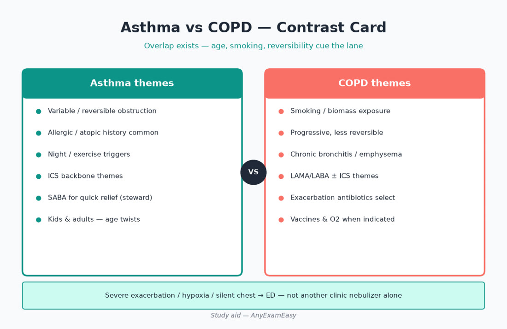
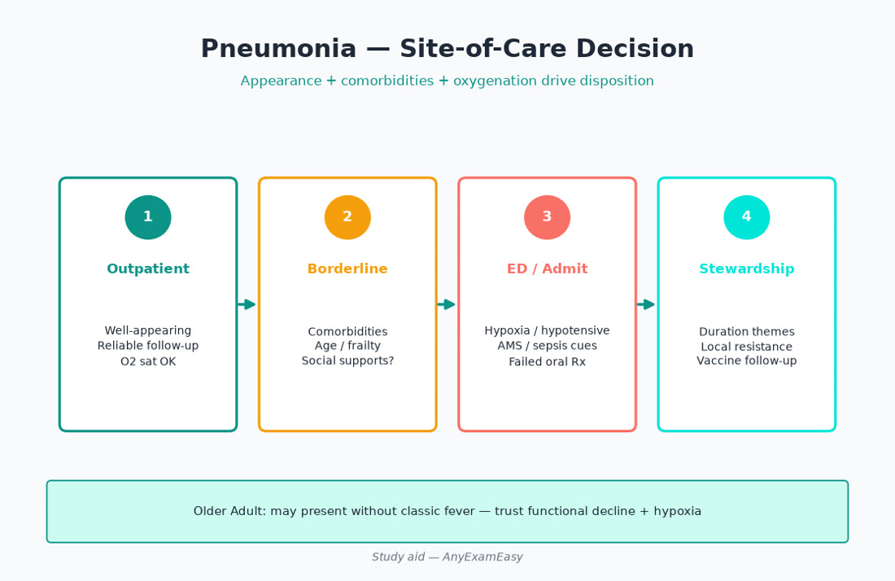
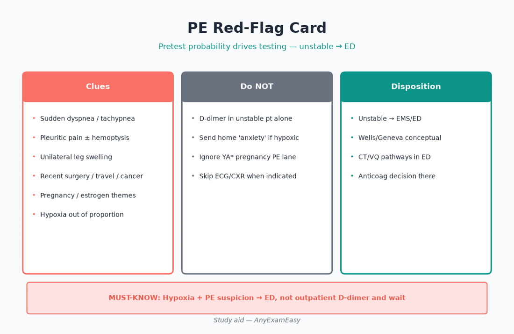

# Chapter 5 — Pulmonary

> **Study aid only.** Primary-care pulmonary themes for AANP FNP exam judgment — not a protocol. Verify current NHLBI/GINA/GOLD-aligned guidance, antibiotic stewardship resources, and labels. Teaching themes only where drugs appear.

---

## Why this chapter matters

Dyspnea, cough, wheeze, and “I can’t shake this cold” fill primary care — across **Child/Adolescent asthma**, **Young/Middle Adult** asthma and PE risk, and **Older Adult (30%)** COPD, pneumonia, and HF mimics. Domain I will ask whether you **Assess** severity and hypoxia, **Diagnose** asthma vs COPD vs CHF vs PE, **Plan** controllers vs ED, and **Evaluate** technique, adherence, and steroids/antibiotics stewardship.

**Pair with practice:** After each topic, drill pulmonary items and tag age band + ADPE. Soft start: [anyexameasy.com](https://anyexameasy.com) ($27.99/mo after trial; trial terms on site).

---

## ADPE lens for pulmonary

| Process | Pulmonary behaviors |
| --- | --- |
| Assess | RR, SpO₂, work of breathing, speak-full-sentences?, peak flow if known asthmatic, smoking/vape/occupational, orthopnea (HF overlap), calf swelling (PE), meds (ACEI cough, beta blocker) |
| Diagnose | Obstructive vs infectious vs cardiac vs PE vs anemia; CXR when it changes management; spirometry for chronic labels |
| Plan | Reliever/controller themes; steroids/abx stewardship; oxygen only if hypoxic per themes; ED thresholds; smoking cessation |
| Evaluate | Inhaler teach-back, exacerbation frequency, step-up/down, vaccine status, pulmonary rehab referral themes |

**Red-flag filter:** SpO₂ low, severe work of breathing, altered mentation, silent chest, hemoptysis with instability, suspected PE with instability, stridor → ED/EMS.

---

## Topic A — Asthma

### Presentation & concepts

Chronic airway inflammation + hyperresponsiveness → variable airflow obstruction. Triggers: viruses, allergens, exercise, irritants, GERD, sinus disease, NSAIDs/ASA in sensitive patients. Night symptoms and viral exacerbations are common. Kids often present with cough-variant patterns; adults may have occupational asthma.

### Assess severity / control (themes)

Day symptoms, night awakenings, reliever use, activity limitation, exacerbations requiring oral steroids/ED. In visit: RR, SpO₂, accessory muscles, breath sounds, peak expiratory flow if patient has personal best.

### Red flags / exacerbation triage

| Feature | Action vibe |
| --- | --- |
| Speaks words only, hunched, hypoxic, silent chest | ED/EMS |
| Partial response to clinic nebulizer/MDI+spacer | Close watch; low threshold ED |
| Frequent oral steroid bursts | Controller failure — reassess adherence/technique/diagnosis |

### Differentials

COPD (smoking, older, less reversible) · HF (“cardiac asthma”) · vocal cord dysfunction · PE · foreign body (child) · bronchiolitis (infant) · eosinophilic/COPD overlap themes.

### Workup themes

Spirometry with bronchodilator response for diagnosis/monitoring when feasible. Allergy testing selective. CXR if focal findings, first atypical presentation, or suspect alternate diagnosis — not every wheeze.

### Plan themes (verify GINA/NHLBI current)

- Reliever access + **controller** for persistent patterns — exam loves “no long-acting beta agonist alone in asthma.”  
- Inhaled corticosteroid backbone themes; add-on therapies stepwise.  
- Spacer technique for MDIs; rinse mouth after ICS.  
- Written action plan: green/yellow/red.  
- Exacerbation: prompt systemic corticosteroids themes when indicated; oxygen if hypoxic; SABA frequent dosing per protocol; ED if not responding.  
- Vaccines; trigger reduction; treat comorbid rhinitis/GERD/obesity.

### Evaluate

Technique every visit until perfect · adherence (cost, thrush, dysphonia) · step-down when controlled · refer severe/frequent exacerbations / diagnostic uncertainty.

### Lifespan

- **Peds:** growth concerns with ICS are usually outweighed by control benefits at appropriate doses — verify; spacer/mask by age; school action plan.  
- **Pregnancy (YA\*):** uncontrolled asthma harms fetus more than most controller therapies — coordinate; avoid cavalier step-downs.  
- **Older adults:** overlapping COPD/HF; inhaler arthritis/cognitive barriers; nebulizer logistics.

---

## Topic B — COPD

### Presentation

Progressive dyspnea, chronic cough/sputum, smoking/biomass history. Exacerbations accelerate decline. Older Adult heavy.

### Assess

Smoking pack-years, alpha-1 antitrypsin consideration in young emphysema, SpO₂, exacerbation history, comorbidities (CVD, osteoporosis, anxiety), inhaler barriers.

### Diagnose

Spirometry required for confident diagnosis themes (post-bronchodilator obstruction). CXR/CT when alternate diagnoses (cancer, ILD, bronchiectasis). Eosinophil counts sometimes guide ICS decisions in modern paradigms — verify current GOLD-style themes.

### Plan themes

Smoking cessation is disease-modifying · long-acting bronchodilator themes (LAMA/LABA) · ICS for selected phenotypes (frequent exacerbations/eosinophils — verify) · not every COPD patient needs chronic ICS (pneumonia risk themes) · oxygen for qualifying resting hypoxia (evaluate carefully) · pulmonary rehab · vaccines · steroids ± antibiotics for selected exacerbations (purulence/severity themes — stewardship) · NIV/ED for hypercapnic failure.

### Red flags

Severe exacerbation with hypoxia/hypercapnia suspicion, cor pulmonale decompensation, massive hemoptysis, suspected pneumothorax.

### Evaluate

mMRC/CAT-style symptom tracking · exacerbation counts · inhaler technique · bone health if recurrent steroids · depression/anxiety · advance care planning in advanced disease.

---

## Topic C — Community-acquired pneumonia (CAP)

### Presentation

Fever, cough, pleuritic pain, dyspnea — or **older adult afebrile confusion/falls**. Crackles, dullness; vitals drive site-of-care.

### Site-of-care (Plan critical)

Use severity cues (RR, BP, confusion, SpO₂, urea/BUN themes, comorbidities). Hypoxia, hypotension, AMS → ED. Outpatient only if stable with reliable follow-up and SDoH supports oral therapy.

### Workup themes

CXR when it changes management; don’t delay ED care for perfect imaging. Microbiologic testing selective outpatient. Influenza/COVID testing when season/epidemiology fits.

### Plan themes

Empiric outpatient regimens follow current IDSA/ATS-style guidance — **verify**; consider comorbidities and resistance risk. Duration themes shorter than historical marathon courses for many uncomplicated cases — verify. Steroids not routine for all CAP. Smoking cessation; vaccines after recovery.

### Evaluate

Clinical response 48–72h; if failing — wrong drug, resistant organism, wrong diagnosis (PE, HF, obstruction, empyema), nonadherence. Follow-up imaging in selected patients (e.g., smokers with risk for underlying mass) — verify local practice.

---

## Topic D — Acute bronchitis / URI / influenza-like illness

Mostly viral. Antibiotics rarely help uncomplicated acute bronchitis. Assess for pneumonia signs, COVID/flu when relevant, asthma/COPD flare. Plan: symptom support, stewardship counseling (“antibiotics won’t fix the virus and cause harm”), return precautions. Evaluate: lingering cough common; revisit if red flags.

**ACEI cough** is a differential for chronic cough — switch thinking to ARB if appropriate.

---

## Topic E — PE red flags (don’t miss)

Sudden dyspnea/pleuritic pain/hemoptysis/syncope; risk: surgery, cancer, estrogen/pregnancy, prior VTE, immobility, leg swelling. Stable vs unstable splits pathway. Primary care role: recognize, risk-stratify conceptually, **don’t delay ED** when suspicion meaningful. Pregnancy: special imaging pathways — coordinate.

---

## Topic F — Other high-yield primary care pulmonary

| Topic | Hooks |
| --- | --- |
| OSA | Day somnolence, snoring, resistant HTN, AF; sleep study referral; CPAP adherence Evaluate |
| Chronic cough | Algorithm themes: ACEI, postnasal, asthma, GERD, smoking, CXR if indicated |
| Hemoptysis | Volume + stability; infection/cancer/PE/bronchiectasis; ED if large/unstable |
| TB themes | Risk + prolonged cough/night sweats/weight loss; public health reporting awareness |
| Smoking/vaping | Brief intervention + pharmacotherapy themes; adolescents included |
| Interstitial/cancer cues | Progressive dyspnea, clubbing, weight loss, hemoptysis → imaging/refer |

---

## Clinical vignette 1 — Child asthma exacerbation

**Stem:** 7-year-old with URI, now wheezing, SpO₂ 91%, speaking short phrases; uses PRN albuterol only; no controller.

| ADPE | Move |
| --- | --- |
| Assess | Hypoxia + work of breathing; Child band; controller gap |
| Diagnose | Moderate-severe exacerbation; persistent asthma pattern likely |
| Plan | Clinic bronchodilators if equipped + early ED given hypoxia; systemic steroid themes; later start controller + action plan + spacer teaching |
| Evaluate | Technique, refill adherence, step therapy, school plan |

**Distractors fail:** oral antibiotic for wheeze without bacterial signs; send home hypoxic with “more albuterol”; LABA monotherapy.

---

## Clinical vignette 2 — Older adult “bronchitis”

**Stem:** 79-year-old cough/fever/confusion; RR 30, SpO₂ 90%; lives alone.

| ADPE | Move |
| --- | --- |
| Assess | Older Adult atypical infection; hypoxia; SDoH (alone) |
| Diagnose | CAP until proven otherwise — not simple bronchitis |
| Plan | ED; not oral abx home alone |
| Evaluate | Post-discharge vaccines, swallow/aspiration risk, follow-up |

**Distractors fail:** “supportive care for viral syndrome” despite hypoxia/confusion; ignore living-alone barrier.

---

## Clinical vignette 3 — Middle adult dyspnea post-flight

**Stem:** 48-year-old sudden pleuritic pain + dyspnea 2 days after long flight; HR 110, BP 128/78, SpO₂ 94%; on OCP.

| ADPE | Move |
| --- | --- |
| Assess | PE risks (flight, estrogen), tachycardia |
| Diagnose | PE on must-not-miss board |
| Plan | Urgent ED/pathway evaluation — not azithromycin |
| Evaluate | Later: provoke factors, anticoagulation duration themes with specialty, OCP counseling |

**Distractors fail:** diagnose costochondritis because chest wall tenderish; outpatient D-dimer without pathway when concern high and logistics unsafe.

---

## Exam traps

| Trap | Fix |
| --- | --- |
| Antibiotics for viral bronchitis | Stewardship counseling |
| LABA alone for asthma | ICS backbone themes |
| Missing HF as “wheeze” | Orthopnea/edema/weight |
| Outpatient CAP despite hypoxia | Site-of-care honesty |
| Chronic ICS in all COPD | Phenotype-selected |
| Ignoring inhaler technique | Teach-back every failure |
| Missing PE for “anxiety” | Risk factors + sudden onset |

---

## Lifespan quick strip

| Band | Pulmonary focus |
| --- | --- |
| Infant | Bronchiolitis themes; fever/work of breathing triage |
| Child | Asthma, foreign body, pneumonia |
| Adolescent* | Asthma, vaping, sports-induced |
| YA* / prenatal | Asthma control in pregnancy; PE risk rises |
| Middle | Asthma/COPD onset, OSA, smoking Ca risk |
| Older | COPD, CAP atypical, PE, HF mimics, aspiration |

---

## Quick checklist — pulmonary

- [ ] SpO₂/RR/work of breathing documented  
- [ ] Can’t-miss: PE, pneumothorax, severe asthma/COPD, HF  
- [ ] Asthma: controller + no LABA alone  
- [ ] COPD: cessation + spirometry label + stewardship on exacerbations  
- [ ] CAP: site-of-care before drug choice  
- [ ] Inhaler technique teach-back  
- [ ] Vaccines (flu, pneumococcal, COVID per current)  
- [ ] Smoking/vaping brief intervention  
- [ ] Older adult atypical infection considered  
- [ ] Pregnancy asthma: control > fear of controllers  
- [ ] Evaluate: exacerbations count, step therapy, SDoH for device access  

---

## Remember this

- Hypoxia rarely gets a “routine outpatient” Plan.  
- Asthma ≠ COPD management twin.  
- Stewardship is Plan + Evaluate.  
- Verify GINA/GOLD/IDSA-style guidance — teaching themes age.

**Practice pulmonary ADPE items** on [AnyExamEasy](https://anyexameasy.com) — start free; $27.99/mo after trial (trial terms on site).

---

## Topic G — Oxygen, devices, and counseling depth

Oxygen is a drug for hypoxia — not a comfort default for every dyspneic patient with normal sats (current ACS/chest pain pathways similarly discourage reflexive hyperoxia). For COPD, long-term oxygen has specific qualification themes (resting hypoxemia thresholds — verify). Counsel fire safety if smoking continues (still push cessation).

### Device map (Plan/Evaluate)

| Device | Teaching hooks |
| --- | --- |
| MDI ± spacer | Slow breath, shake, seal, one puff at a time, wait between puffs per product |
| DPI | Forceful inhalation; humidity/moisture issues; don’t shake like MDI |
| Soft-mist | Device-specific priming |
| Nebulizer | Cleaning to prevent contamination; time cost |
| Peak flow | Personal best; zones in action plan |

Arthritis, tremor, and cognitive impairment in older adults break DPI assumptions — match device to patient (patient-factor filter).

### When to refer pulmonology

Diagnostic uncertainty, severe persistent asthma, frequent exacerbations, oxygen qualification, suspected ILD/cancer, advanced COPD for advanced therapies/palliative co-management, abnormal spirometry not fitting clinic narrative.

---

## Topic H — COVID / post-viral / overlapping eras (high-level)

Epidemiology changes. Exam-stable skills: isolate/test when indicated per current public health, protect high-risk older adults with vaccines/antivirals eligibility awareness (verify current), watch for red-flag dyspnea/hypoxia, and don’t let “it’s just COVID” blind you to PE or bacterial superinfection when course worsens.

---

## Concept checks

**1.** Best next step for SpO₂ 88% presumed viral URI in clinic?  
A. Oral azithromycin home  B. ED/acute evaluation  C. Watch 1 week  D. DPP4 inhaler only  
**Answer:** B.

**2.** Asthma controller principle theme?  
A. LABA monotherapy preferred  B. ICS-containing controller for persistent patterns  C. Antibiotics monthly  D. No action plans ever  
**Answer:** B.

**3.** Older adult confusion + tachypnea without fever — still consider?  
A. Only psychiatric cause  B. CAP/other infection + cardiopulmonary emergencies  C. Normal aging  D. Stop vaccines  
**Answer:** B.

---

## Mechanisms that unlock stems (short pathophysiology)

- **Asthma:** IgE/allergen and nonallergic triggers → inflammatory mediators → bronchoconstriction, mucus, edema → reversible obstruction.  
- **COPD:** Smoking-related inflammation → irreversible airflow limitation ± emphysema destruction → V/Q mismatch → hypoxia/hypercapnia risk.  
- **Pneumonia:** Alveolar infection → consolidation → impaired gas exchange; elders mount weaker fever responses.  
- **PE:** Venous thrombi → pulmonary arterial obstruction → dead space / strain on right heart; hypoxia variable.  
- **HF mimic:** Elevated pressure → pulmonary edema → wheeze/crackles overlapping asthma language.

If the mechanism doesn’t fit (sudden hypoxia after flight in a young woman on OCP), don’t force “viral bronchitis.”

---

## Final pulmonary sprint table

| If you see… | Think… | First move vibe |
| --- | --- | --- |
| Night cough child + viral | Asthma pattern | Severity + controller plan |
| Smoker progressive dyspnea | COPD | Spirometry + cessation |
| Hypoxic elder “cold” | CAP/HF/PE | ED |
| Pleuritic + risks | PE | Urgent pathway |
| Chronic dry cough on lisinopril | ACEI cough | Switch class themes |
| Daytime sleepiness + HTN | OSA | Sleep referral |

---

## Deep dive — Asthma exacerbation algorithm for primary care

### Stepwise clinic thinking (themes — verify protocols)

1. **Recognize severity:** light speaking, posture, RR, SpO₂, pulse, accessory muscles, air movement.  
2. **Oxygen** if hypoxic per local protocol.  
3. **SABA** via MDI+spacer or nebulizer; repeat per protocol while monitoring.  
4. **Early systemic corticosteroid** themes when exacerbation is more than trivial — do not wait for complete failure of bronchodilators in moderate-severe flares.  
5. **Reassess** after treatments: if not clearly safe for home (persistent hypoxia, poor air movement, fatigue, social isolation without caregiver), **ED**.  
6. **Before discharge (only if appropriate):** controller initiation/escalation, spacer, written action plan, steroid course counseling (mood, glucose, appetite), return precautions, follow-up in 48–72 hours.

### Controller counseling that Prevents Evaluate failures

- ICS adherence prevents ED cycling more than PRN albuterol heroics.  
- Thrush/dysphonia → rinse, spacer, technique fix — not automatic ICS abandonment.  
- “Steroid phobia” in parents: discuss growth evidence themes honestly; uncontrolled asthma also harms growth/activity.  
- Biological therapies exist for severe eosinophilic/allergic phenotypes — refer, don’t guess doses.

### Occupational and aspirin-exacerbated respiratory disease cues

Adult-onset asthma with workplace pattern (better on weekends) → occupational referral themes. Nasal polyps + asthma + NSAID sensitivity → AERD awareness; advise NSAID caution and ENT/allergy collaboration.

---

## Deep dive — COPD exacerbation vs pneumonia vs PE vs HF

Older adults often trigger multi-lane differentials. Build a comparison habit:

| Feature | COPD exacerbation | CAP | PE | HF |
| --- | --- | --- | --- | --- |
| Onset | Days, often viral prodrome | Days; may be abrupt | Sudden | Hours–days |
| Fever | ± | More common (may be absent in elders) | Usually absent | Absent unless infection |
| Chest pain | Less central | Pleuritic possible | Pleuritic classic | Pressure if ischemic trigger |
| Edema/orthopnea | Cor pulmonale late | Less | Unilateral leg clues | Bilateral edema/orthopnea |
| Imaging | Hyperinflation; ± infiltrate if overlap | Infiltrate | Often normal CXR | Vascular congestion/edema |

**Plan rule:** When lanes compete and patient is hypoxic or frail/alone → ED unlocks parallel workup safely.

### Antibiotics in COPD exacerbation (stewardship themes)

Not automatic. Consider when increased sputum purulence plus increased dyspnea/volume (classic Anthonisen-style thinking — verify current GOLD). Duration shorter than historical habits for many — verify. Counsel risks: C. diff, resistance, interactions (QT, warfarin).

---

## Deep dive — CAP outpatient counseling & failure plan

If truly outpatient-eligible:
- Antibiotic teaching: complete course as directed (modern durations may be shorter — verify), take with food if needed, warn diarrhea/rash/anaphylaxis signs.  
- Antipyretics, hydration, rest.  
- **Return precautions:** worse dyspnea, SpO₂ concerns if they have a home monitor, chest pain, confusion, inability to keep meds down, fever persisting beyond expected window.  
- Follow-up call or visit 48–72h.  
- Smoking cessation offer same day.  
- Schedule vaccines after acute phase.  

### Aspiration pneumonia themes (Older Adult)

Risk: stroke, dementia, alcohol, poor dentition, GERD. Prevention: upright feeding, oral care, swallow eval. Antibiotics/regimens differ from standard CAP in some pathways — verify; disposition often higher acuity.

---

## Deep dive — PE in primary care: communication & risk

You rarely CT yourself in clinic — you **recognize and disposition**. Document risk factors, vital signs, and why ED was chosen. If suspicion is low and validated pathways plus D-dimer logistics exist in your system, follow local protocol — the exam still rewards not missing high-probability stories (sudden dyspnea, unilateral swelling, estrogen/pregnancy, cancer, recent surgery).

Pregnancy + suspected PE: do not withhold indicated imaging due to fear alone — coordinate obstetric/ED pathways; maternal hypoxia harms fetus.

### Estrogen counseling crossover (YA\* / Middle Adult\*)

Combined hormonals raise VTE risk — assess migraines with aura, smoking >35, prior VTE, thrombophilia themes when prescribing (women’s health chapter expands). Pulmonary items may hide in contraception stems.

---

## Additional vignette 4 — Pregnancy asthma under-treated

**Stem:** 31-year-old at 24 weeks, using albuterol 6×/day, stopped ICS “for the baby,” night symptoms nightly, SpO₂ 97%.

| ADPE | Move |
| --- | --- |
| Assess | YA\* prenatal; controller stopped; frequent reliever = poor control |
| Diagnose | Uncontrolled asthma in pregnancy — fetal hypoxia risk from uncontrolled disease |
| Plan | Restart appropriate controller themes per pregnancy-safe guidance (verify); Ob communication; action plan; avoid antibiotic creep |
| Evaluate | Symptom diary, technique, follow closely; ED precautions |

**Distractors fail:** praise stopping ICS; oral steroid bursts monthly without controller; albuterol-only plan.

---

## Additional vignette 5 — COPD + possible lung cancer cue

**Stem:** 64-year-old 40-pack-year, weight loss, new hemoptysis streaks, COPD on LAMA; SpO₂ 94%.

| ADPE | Move |
| --- | --- |
| Assess | Cancer alarm + COPD baseline |
| Diagnose | Hemoptysis/weight loss → malignancy on board (also TB/bronchiectasis) |
| Plan | Urgent imaging pathway + pulmonology; smoking cessation still offered; don’t only refill LAMA |
| Evaluate | Track imaging completion (SDoH transport), staging referrals |

**Distractors fail:** treat as “acute bronchitis” with azithromycin alone; delay imaging until “hemoptysis is massive.”

---

## Inhaled therapy safety & interactions (therapeutics knowledge area)

- Nonselective beta blockers can blunt SABA response / worsen asthma — patient-factor filter.  
- ICS + CYP3A inhibitors (some azoles/HIV meds) may increase systemic steroid effects — rare but real.  
- Theophylline (less used): narrow therapeutic index, interactions — know existence.  
- Chronic oral steroids: bone density, glucose, infection risk, adrenal suppression — Evaluate & deprescribe path.  
- Macrolide anti-inflammatory themes in selected COPD/bronchiectasis — specialty lane.

### Pulmonary rehab & palliative crossover

Rehab improves dyspnea and hospitalizations in COPD themes. In advanced disease, opioids for refractory dyspnea and advance care planning are Evaluate/Plan courage — not “giving up.”

### Spirometry interpretation literacy (high-level)

Obstruction: FEV1/FVC reduced themes. Restriction patterns need volumes. Bronchodilator reversibility supports asthma but overlap exists. Don’t diagnose COPD on smoking history alone without confirmatory testing when feasible.

### Older adult pulmonary multimorbidity (Domain II realism)

82-year-old with COPD, HF, CKD, on LABA/LAMA, PRN furosemide, using albuterol q2h for a week, sleeping in recliner, SpO₂ 90%. Assess both congestion and obstruction; Diagnose possible HF exacerbation ± COPD ± pneumonia; Plan ED; Evaluate later for palliative goals, home O₂ qualification, caregiver support, vaccine status. This is Domain II Older Adult 30% realism.

### Closing pulmonary remember-this
- Hypoxia changes disposition.
- Asthma needs ICS-containing controllers for persistent disease — no LABA alone.
- COPD diagnosis wants spirometry; cessation is disease-modifying.
- CAP site-of-care before drug name.
- PE lives on sudden dyspnea boards — especially estrogen/pregnancy/post-op/cancer.
- Inhaler teach-back is Evaluate gold.
- Pair practice: https://anyexameasy.com ($27.99/mo after trial; trial terms on site).

---

