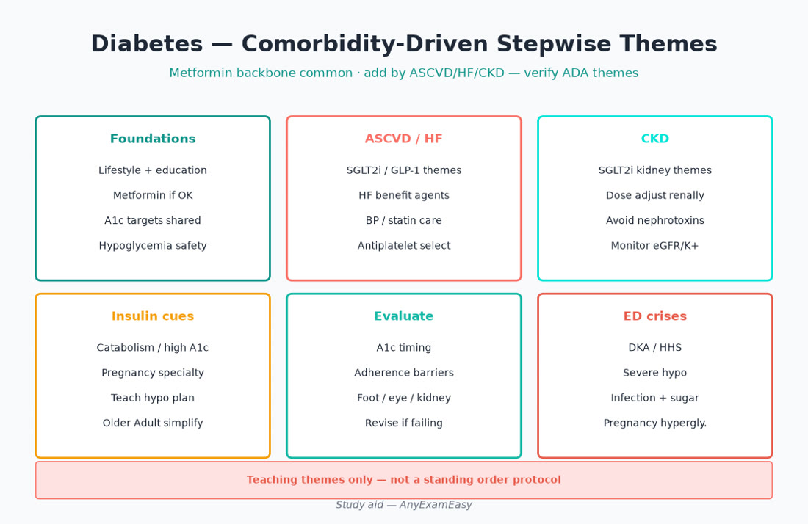
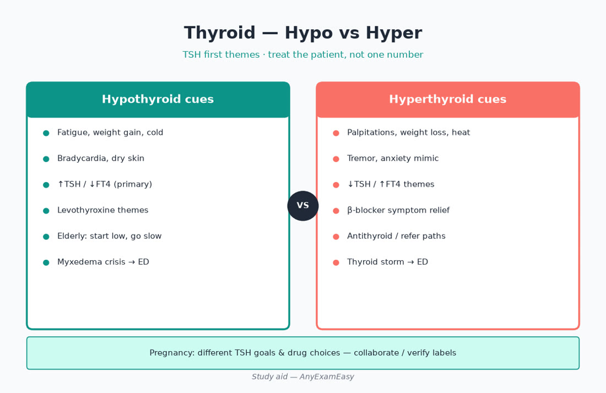
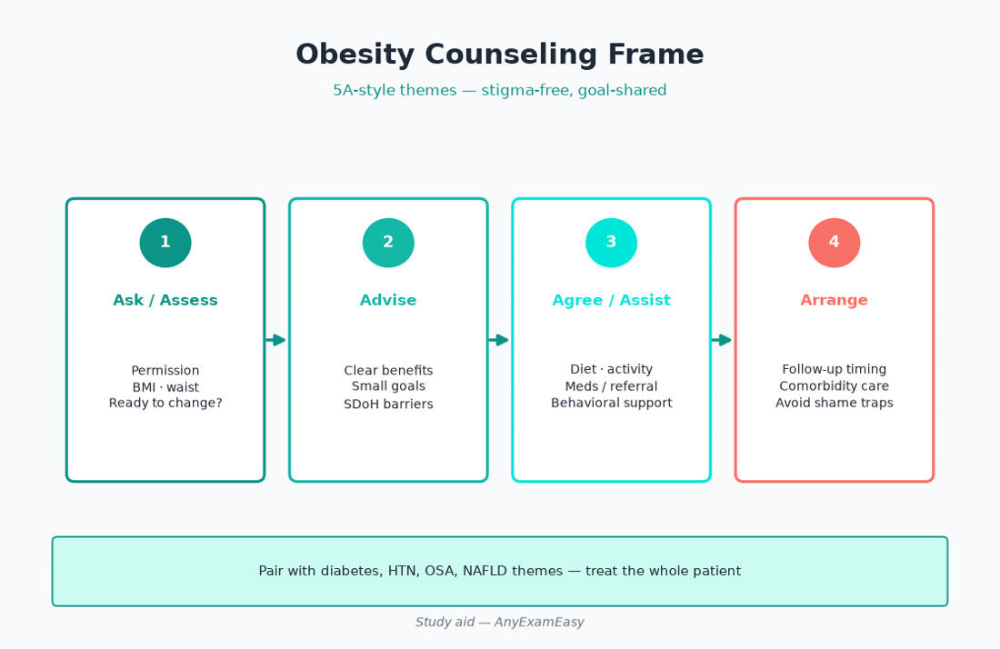

# Chapter 6 — Endocrine

> **Study aid only.** Primary-care endocrine themes for AANP FNP exam judgment — not individualized care. Verify ADA/AACE-aligned diabetes guidance, thyroid guidelines, and drug labels. Teaching themes only.

---

## Why this chapter matters

**Diabetes, thyroid, and obesity drive middle- and older-adult visits — and Older Adult is ~30% of Domain II.**

You’ll **Assess** symptoms and SDoH, **Diagnose** T2DM vs others, **Plan** comorbidity-driven therapy (not “A1c-only”), and **Evaluate** hypoglycemia risk, labs, and adherence.

**Pair with practice:** Drill endocrine items, tag age band + ADPE. Soft start: [anyexameasy.com](https://anyexameasy.com) ($27.99/mo after trial; trial terms on site).

---

## ADPE lens for endocrine

| Process | What good looks like |
| --- | --- |
| **Assess** | Polyuria/polydipsia, weight change, hypo cues, meds (steroids), foot/eye/dental, food access, pregnancy |
| **Diagnose** | Diagnostic thresholds themes; hypo vs hyperthyroid; secondary obesity cues |
| **Plan** | Lifestyle + meds matched to ASCVD/HF/CKD; thyroid replace/refer; obesity 5A + meds/surgery awareness |
| **Evaluate** | A1c timing, hypo logs, TSH after dose change, weight trajectory, SDoH barriers |

> **MUST KNOW** — Unstable DKA/HHS, myxedema, thyroid storm themes → **ED**, not clinic titration.

---

## Topic A — Type 2 diabetes mellitus

**Takeaway: Match therapy to heart, kidney, and hypo risk — not A1c cosmetics alone.**

### Presentation

Often silent until screening. Classic: polyuria, polydipsia, blurry vision, yeast infections, fatigue. Older adults may present with dehydration, falls, or confusion.

### Diagnostic themes (verify current ADA-style criteria)

| Test | Diagnostic vibe (confirm current cutoffs) |
| --- | --- |
| A1c | ≥6.5% theme (lab NGSP-certified) |
| Fasting glucose | ≥126 mg/dL theme |
| Random + symptoms | ≥200 mg/dL theme |
| OGTT 2-hr | ≥200 mg/dL theme |

Confirm unless clear classic hyperglycemia with symptoms. Watch false A1c (anemia, CKD, hemoglobinopathy).

> **HIGHLIGHT** — Prediabetes is a Plan opportunity (lifestyle intensity), not a shrug.

### Red flags → ED

| Cue | Think |
| --- | --- |
| Kussmaul breathing, fruity breath, vomiting, AMS | DKA |
| Profound dehydration, very high glucose, AMS (often older/T2) | HHS |
| Severe hypo with seizure/coma | Emergency glucose |

### Differentials

T1DM / LADA · drug-induced (steroids) · pancreatic disease · monogenic rare · stress hyperglycemia.

### First-line workup themes

A1c, fasting lipids, BMP/eGFR, UACR, TSH if indicated, liver enzymes before some meds, baseline foot exam, retinopathy referral timing per guidance.

### Plan themes (verify current ADA Standards)

1. **Lifestyle** always: nutrition pattern, activity, sleep, tobacco.  
2. **Metformin** remains common foundational theme if tolerated/eGFR allows — verify.  
3. **Comorbidity-driven add-ons:** ASCVD / HF / CKD → SGLT2 and/or GLP-1 RA themes often preferred regardless of A1c in modern paradigms — **verify current**.  
4. Insulin when catabolic, severe hyperglycemia, or not at goal on orals/GLP-1 — teach hypo.  
5. BP and statin risk reduction are part of diabetes Plan.  
6. Vaccines; dental; depression screen.

| Class theme | Pearl | Watch |
| --- | --- | --- |
| Metformin | Foundational | GI; B12 long-term; eGFR limits |
| SGLT2i | HF/CKD/ASCVD benefit themes | GU infections; volume; euglycemic DKA rare; foot caution peri-op |
| GLP-1 RA | Weight + ASCVD themes | GI; titrate; boxed themes for MTC/MEN2 history — verify |
| DPP-4 | Modest A1c | HF nuance agent-specific historically |
| Sulfonylurea | Cheap glucose drop | **Hypoglycemia** — risky in elders |
| TZD | Insulin sensitivity | HF edema — avoid in HF |
| Insulin | Powerful | Hypo; teaching; storage |

> **TRAP** — Starting a sulfonylurea in a frail older adult as “first add-on” when hypo risk is high and SGLT2/GLP-1 fit comorbidities better (per current guidance).

> **LIFESPAN** — **Older Adult (30%):** looser individualized A1c targets if hypo risk/frailty; simplify regimens; avoid sliding-scale-only chaos. **Prenatal (YA\*):** different glycemic targets and meds — Ob/diabetes specialty collaboration; many orals not preferred.

### Evaluate

- A1c ~q3 months when changing therapy (themes).  
- Hypo log; CGM awareness when used.  
- eGFR/UACR periodic.  
- Foot checks; eye follow-through.  
- Cost/refill gaps = SDoH Evaluate problem.

#### Critical checklist — T2DM
- [ ] Confirm diagnosis properly  
- [ ] ASCVD/HF/CKD drive therapy class  
- [ ] Hypo risk screened every visit  
- [ ] Metformin OK with eGFR rules  
- [ ] Statin/BP addressed  
- [ ] DKA/HHS disposition correct  
- [ ] Older adult: simplify + avoid risky hypo drugs when possible  
- [ ] Pregnancy: specialty pathway  

---

## Topic B — Type 1 / insulin teaching (primary-care awareness)

**Takeaway: New ketosis-prone / young lean DKA picture → urgent specialty + ED, not metformin-first.**

> **MUST KNOW** — Suspected new T1DM with vomiting/AMS → ED for DKA workup.

Primary care still owns: vaccine, lipids/BP when applicable, depression, device prescription logistics, sick-day teaching collaboration.

#### Critical checklist — insulin safety
- [ ] Never confuse basal vs bolus  
- [ ] Teach hypo rule-15 themes  
- [ ] Storage/expiration  
- [ ] Needle disposal  
- [ ] Sick-day when not eating  

---

## Topic C — Hypothyroidism

**Takeaway: Replace with levothyroxine; separate from interacting meds; don’t over-replace elders.**

### Presentation

Fatigue, weight gain, cold intolerance, constipation, dry skin, menorrhagia, depression mimic, bradycardia, delayed reflexes. Subclinical common on labs.

### Assess / Diagnose

TSH first-line; free T4 if TSH abnormal. Antibodies (TPO) selective. Look for amiodarone, lithium, pituitary clues (low TSH + low FT4 → central — don’t treat like primary).

> **TRAP** — Treating on a single mildly abnormal TSH without context/repeat when asymptomatic and unreliable timing.

### Plan themes

Levothyroxine dosing individualized (weight, age, pregnancy, cardiac disease — **verify**). Take empty stomach; separate from calcium/iron/antacids. Recheck TSH after dose change (~6 weeks theme).

> **LIFESPAN** — **Pregnancy:** dose needs often rise; trimester-specific TSH goals — coordinate Ob. **Older Adult:** start lower, go slower; over-replacement → AF/osteoporosis risk.

> **MUST KNOW** — Myxedema coma themes (hypothermia, AMS, hypotension) → ED.

#### Critical checklist — hypoT
- [ ] TSH ± FT4 interpreted correctly  
- [ ] Central hypo considered if both low  
- [ ] Absorption counseling  
- [ ] Pregnancy dosing vigilance  
- [ ] Elder: avoid over-replacement  

---

## Topic D — Hyperthyroidism

**Takeaway: New AF + weight loss in older adult → check thyroid; storm → ED.**

### Presentation

Heat intolerance, tremor, palpitations, weight loss, diarrhea, anxiety, lid lag. Elders: “apathetic” hyperthyroid — failure to thrive, AF.

### Diagnose

Low TSH + high FT4/T3 themes. Radioiodine uptake/scan via specialty for etiology (Graves vs toxic nodule vs thyroiditis).

### Plan / refer

Beta blocker symptom control themes if no contraindication. Antithyroid drugs / RAI / surgery — specialty. Avoid empiric reckless PTU/methimazole without plan (hepatotoxicity/agranulocytosis teaching themes).

> **MUST KNOW** — Thyroid storm (fever, AMS, tachyarrhythmia) → ED.

> **LIFESPAN** — Postpartum thyroiditis lane in YA\*; screen mood + thyroid when indicated.

#### Critical checklist — hyperT
- [ ] TSH suppressed → free hormones  
- [ ] AF workup includes thyroid  
- [ ] Storm = ED  
- [ ] Refer for definitive therapy  

---

## Topic E — Obesity & metabolic syndrome

**Takeaway: Obesity care is chronic disease care — 5A counseling + offer evidence therapies, not shame.**

### Assess

BMI, waist, weight trajectory, sleep apnea, OA, NAFLD cues, meds that cause weight gain, food insecurity, ready-to-change.

### Plan themes

Lifestyle foundation · behavioral programs · meds when BMI/comorbidity thresholds met (GLP-1 RA / others — verify indications) · bariatric referral awareness · treat OSA/HTN/lipids/glucose.

> **TRAP** — Only saying “eat less, move more” with no follow-up, no barrier assessment, no therapy offer when indicated.

> **HIGHLIGHT** — Stopping weight-gain meds (when safe) is therapy.

#### Critical checklist — obesity
- [ ] BMI + complications mapped  
- [ ] 5A brief intervention  
- [ ] SDoH food access  
- [ ] Pharmacotherapy/surgery eligibility considered  
- [ ] OSA screened  

---

## Topic F — Adrenal / pituitary high-yield (don’t overstudy, don’t miss)

| Cue cluster | Think | Move |
| --- | --- | --- |
| Centripetal obesity, purple striae, easy bruise, resistant HTN | Cushing themes | Screen/refer |
| Orthostatic hypo, hyperK, tan skin, crisis with illness | Adrenal insufficiency | ED if unstable; don’t stop chronic steroids abruptly |
| Headache, visual field cuts, milky discharge, low hormones | Pituitary mass / prolactinoma themes | Imaging/refer |
| Incidental adrenal nodule | Workup per guidance | Don’t ignore hormonally |

> **MUST KNOW** — Chronic steroid users need stress-dose thinking when sick — adrenal crisis kills.

> **TRAP** — Abruptly stopping long-term prednisone.

---

## Topic G — Osteoporosis (endocrine-metabolic bridge)

**Takeaway: Fracture risk > T-score alone; treat high-risk; fall prevention is Plan.**

DEXA screening themes in older women (selected men). Calcium/vit D adequacy. Antiresorptives when indicated — jaw osteonecrosis/atypical femur counseling themes. Fall risk Evaluate in Older Adult 30%.

---

## Clinical vignette 1 — Middle adult\* new T2DM with CKD albuminuria

**Stem:** 54-year-old A1c 8.2%, eGFR 52, UACR elevated, BMI 34, prior MI stent 2 years ago. On metformin 1 g BID.

| Stage | Move |
| --- | --- |
| **Assess** | ASCVD + CKD + obesity; med tolerance; hypo history; food access |
| **Diagnose** | T2DM with CKD + ASCVD — comorbidity-driven lane |
| **Plan** | Add SGLT2 and/or GLP-1 themes per current ADA-style guidance (**verify**); lifestyle; statin intensity check; BP/ACEI-ARB if indicated for albuminuria |
| **Evaluate** | eGFR after SGLT2 start (expected dip themes), GU symptoms, A1c 3 months, weight |

**Why distractors fail**
- Add sulfonylurea only → hypo, no outcome focus.  
- Stop metformin automatically at eGFR 52 → often still OK in range — verify cutoff.  
- “Diet alone for 1 year” with A1c 8.2% + ASCVD → undertreats.

> **TRAP** — Ignoring cardiorenal benefit drugs because A1c is “only 8.”

---

## Clinical vignette 2 — Older adult on glipizide with falls

**Stem:** 78-year-old A1c 6.4% on glipizide; daughter reports AM confusion and sweats; two near-falls.

| Stage | Move |
| --- | --- |
| **Assess** | Hypo cues; frailty; Older Adult band |
| **Diagnose** | Iatrogenic hypoglycemia; overtight control for frailty |
| **Plan** | Stop/reduce sulfonylurea; simplify; individualized higher A1c target themes; treat fall risk |
| **Evaluate** | Symptom resolution; safer regimen; home safety |

**Distractors fail:** increase glipizide to “optimize” A1c 6.4%; ignore neuroglycopenic symptoms as dementia.

> **LIFESPAN** — In Older Adult, **hypoglycemia is the enemy** more often than a cosmically perfect A1c.

---

## Clinical vignette 3 — Young adult\* fatigue + TSH

**Stem:** 28-year-old planning pregnancy; TSH 8.5, FT4 low-normal; heavy menses; on calcium gummies with breakfast vitamins including iron.

| Stage | Move |
| --- | --- |
| **Assess** | Pregnancy intention (YA\*); absorption blockers |
| **Diagnose** | Overt/early hypoT pattern — confirm per labs |
| **Plan** | Levothyroxine; separate from Ca/iron; preconception counseling; Ob if pregnant |
| **Evaluate** | TSH after ~6 weeks; sooner if pregnant |

**Distractors fail:** start desiccated thyroid empirically; say “wait until after pregnancy to treat.”

---

## Exam traps — endocrine

| Trap | Instead |
| --- | --- |
| A1c-only drug picking | Comorbidity-first |
| SU in frail elder | Safer classes / deintensify |
| Ignoring euglycemic DKA risk teaching on SGLT2 when sick | Sick-day rules |
| Treating central hypo like primary | Check FT4 with TSH |
| Stopping steroids cold turkey | Taper / stress dosing awareness |
| Shaming obesity without offers | 5A + therapies |

---

## Quick checklist — endocrine chapter

- [ ] T2DM: cardiorenal therapy themes  
- [ ] Hypo risk every diabetes visit  
- [ ] DKA/HHS/storm/myxedema → ED  
- [ ] Levothyroxine absorption counseling  
- [ ] Pregnancy changes thyroid + diabetes lanes  
- [ ] Older adult: simplify, prevent hypo  
- [ ] Obesity: chronic care model  
- [ ] Steroid / adrenal crisis awareness  

---

## Remember this

> **HIGHLIGHT** — SGLT2/GLP-1 changed the diabetes playbook — verify current ADA Standards annually.

> **MUST KNOW** — Unstable endocrine emergencies leave the clinic.

**Practice endocrine ADPE items** on [AnyExamEasy](https://anyexameasy.com) — start free; $27.99/mo after trial (trial terms on site).

---

## Monitoring table (diabetes & thyroid)

| Therapy | Evaluate hooks |
| --- | --- |
| Metformin | GI, B12 long-term, eGFR |
| SGLT2i | Volume, GU, eGFR dip, foot peri-op hold themes |
| GLP-1 RA | GI titration, gallbladder themes, weight |
| Insulin | Hypo, technique, site rotation |
| Levothyroxine | TSH timing, interactors, pregnancy |
| Antithyroid | CBC/LFT symptom triggers; agranulocytosis teaching — fever/sore throat → urgent labs |
| Anti-osteoporosis | Dental exam themes before some agents; adherence (weekly/monthly/yearly products differ) |

### Concept checks

**1.** T2DM + HFrEF — preferred add-on theme family?  
A. TZD  B. SGLT2 inhibitor themes  C. High-dose SU  D. Stop all meds  
**Answer:** B (verify current).

**2.** Frail elder A1c 6.3% on SU with hypo symptoms — best move?  
A. Add more SU  B. Deintensify / stop SU; prioritize safety  C. Ignore  D. Start TZD for HF  
**Answer:** B.

**3.** Suspected myxedema with AMS — Plan?  
A. Oral levo and follow up in 8 weeks  B. ED  C. Iodine supplements only  D. PTU  
**Answer:** B.

## Deep therapeutics — choosing among diabetes tools

**Takeaway: Ask “What organ are we protecting?” before “What drops A1c fastest?”**

### Decision card (teaching themes — verify ADA Standards yearly)

| Patient picture | Lean toward |
| --- | --- |
| Prior MI / stroke / high ASCVD risk | GLP-1 RA and/or SGLT2 themes |
| HFrEF or HFpEF | SGLT2 themes |
| CKD with albuminuria / reduced eGFR (eligible) | SGLT2 ± GLP-1 themes |
| Need weight loss | GLP-1 RA (or dual agonists as available — verify) |
| Cost-constrained, low hypo risk, no compelling comorbidity | Metformin foundation; consider SU carefully |
| Catabolic / A1c very high / pregnancy hyperglycemia lane | Insulin pathways |

> **MUST KNOW** — Compelling cardiorenal indications can justify agents even near A1c goal.

> **TRAP** — Stacking multiple hypo-causing drugs in an older adult living alone.

### Sick-day rules teaching (Evaluate/Plan)

- Hold SGLT2 when critically ill / prolonged fasting / dehydration risk (ketoacidosis awareness).  
- Continue basal insulin in T1 — never stop abruptly.  
- Fingerstick more often when ill.  
- ED if vomiting prevents intake / AMS / Kussmaul.

#### Critical checklist — sick day
- [ ] Written instructions given  
- [ ] Which meds to hold  
- [ ] When to escalate  
- [ ] Caregiver taught in older adults  

## Lipid & BP as endocrine “co-travelers”

Diabetes Plan without BP/statin talk is incomplete on exams.

> **HIGHLIGHT** — Many diabetes mortality benefits historically came from BP + statin + smoking cessation, not only glucose cosmetics.

> **LIFESPAN** — Older adults still benefit from statin in secondary prevention; primary prevention is shared decision if frailty dominates.

## Nodules & calcium (quick primary-care lane)

**Thyroid nodule:** TSH → ultrasound risk stratification → FNA when indicated (specialty). Red flags: hard fixed mass, nodes, history radiation, vocal cord paralysis themes.

**Hypercalcemia:** Stones, bones, groans, psychiatric overtones — check PTH to separate PTH-dependent vs not; severe symptomatic → ED; cancer and hyperpara on board.

> **MUST KNOW** — Don’t ignore corrected calcium extremes — arrhythmia and crisis risk.

#### Critical checklist — nodule/calcium
- [ ] TSH before nuclear toys in nodules  
- [ ] Urgency if compressive symptoms  
- [ ] Severe hyperCa → ED  

## Additional vignette 4 — Steroid-induced hyperglycemia

**Stem:** 62-year-old on prednisone 40 mg for COPD burst; home glucoses 280s; no prior diabetes.

| ADPE | Move |
| --- | --- |
| Assess | Steroid timing (often post-lunch/evening peaks); hypo risk if adding SU |
| Diagnose | Drug-induced hyperglycemia |
| Plan | Diet counseling; temporary glucose-lowering themes (sometimes insulin) — verify; don’t ignore |
| Evaluate | Taper steroids when possible; screen for persistent diabetes after |

> **TRAP** — Blaming “noncompliance” when steroids are the driver.

## Additional vignette 5 — Suspected adrenal crisis

**Stem:** 45-year-old chronic prednisone for autoimmune disease ran out 3 days ago; now vomiting, BP 86/50, glucose 60.

| ADPE | Move |
| --- | --- |
| Assess | Shock + steroid withdrawal |
| Diagnose | Adrenal crisis until proven otherwise |
| Plan | **ED** — emergent glucocorticoids per protocol |
| Evaluate | Later: stress-dose education, medic alert, never abrupt stop |

> **MUST KNOW** — Adrenal crisis is an emergency — clinic oral refill alone is not enough when unstable.

> **HIGHLIGHT** — Re-read the MUST KNOW boxes the night before the exam; they are your sprint sheet.

### Micro-drill
Cover the answers and recite: first move, can’t-miss diagnosis, lifespan twist, and one trap for each topic above.

## Endocrine FAQ-style exam drills

**Q: A1c unreliable when?**  
A: Anemia, CKD, recent transfusion, hemoglobinopathy — use glucose criteria.

**Q: When is insulin first-line-ish in T2?**  
A: Catabolism, severe hyperglycemia, pregnancy pathways, or failure to escalate orals/GLP-1 appropriately — verify.

**Q: Subclinical hypo treat?**  
A: Depends on TSH level, antibodies, symptoms, pregnancy — not automatic for every TSH 4.8.

**Q: Graves eye disease?**  
A: Refer; don’t smoke; specialty therapies.

**Q: Obesity meds instead of lifestyle?**  
A: Both — meds adjunct when indicated, not moral replacement for behavioral care.

> **HIGHLIGHT** — Write three remember-this lines after every endocrine practice set: one drug safety, one emergency disposition, one lifespan twist.

---

---

## Topic G — Osteoporosis (expanded primary-care ownership)

**Takeaway: Fracture prevention is Assess (falls + bone density risk) + Plan (lifestyle, calcium/vit D adequacy, pharmacologic candidates) + Evaluate (adherence, dental clearance themes for some agents).**

### Who to think about

Postmenopausal women, older men with fragility fracture or height loss, long-term glucocorticoids, hyperthyroid/hyperpara, malabsorption, smoking/alcohol, hypogonadism, prior fracture from standing height.

### Workup themes (verify)

DEXA when indicated by age/risk/fracture history. Labs before blaming “just aging bone”: Ca, vitamin D, TSH, CBC/BMP when secondary causes plausible. Spine imaging if height loss/kyphosis suggests vertebral fracture.

### Plan themes

Fall prevention is therapy. Weight-bearing activity as tolerated. Smoking cessation. Calcium/vitamin D from diet ± supplements to meet targets — verify. Pharmacologic candidates (bisphosphonates, denosumab, anabolics in high risk) — know **who refers**, dental exam themes before antiresorptives that risk ONJ, and that atypical femur fracture counseling exists for long-term antiresorptive use.

> **MUST KNOW** — Hip/vertebral fragility fracture → treat as high risk; don’t wait for another break to “start thinking.”

> **TRAP** — Ordering DEXA then never acting on T-score or fracture history.

> **LIFESPAN** — Older Adult (30%): treat to reduce fracture/mortality risk when life expectancy and goals support; deprescribe only with deliberate rationale.

#### Critical checklist — osteoporosis
- [ ] Fall risk addressed  
- [ ] Secondary causes considered  
- [ ] Therapy matched to fracture risk  
- [ ] Dental/ONJ counseling when relevant  
- [ ] Follow-up adherence plan  

---

## Critical callouts — endocrine (scan tonight)

> **MUST KNOW** — DKA/HHS/thyroid storm/myxedema/adrenal crisis → ED.

> **MUST KNOW** — Compelling ASCVD/HF/CKD drive diabetes drug class themes — verify ADA Standards yearly.

> **MUST KNOW** — Never stop chronic steroids abruptly; unstable adrenal crisis needs ED glucocorticoids.

> **HIGHLIGHT** — Levothyroxine: empty stomach timing; separate from calcium/iron; pregnancy raises requirements.

> **TRAP** — Sulfonylurea in frail older adult; dual ACEI+ARB elsewhere; A1c-only prescribing.

> **LIFESPAN** — Older Adult: individualized looser targets if hypo risk high. Prenatal (YA*): specialty diabetes/thyroid pathways.

#### Critical checklist — endocrine tonight
- [ ] Cardiorenal therapy matched  
- [ ] Hypo risk every diabetes visit  
- [ ] Thyroid absorption + pregnancy rules  
- [ ] Steroid / adrenal crisis awareness  
- [ ] Obesity as chronic disease, not willpower lecture

---

## Integrated multimorbidity mini-case (Older Adult 30%)

**Stem vibe:** 78-year-old with T2DM (A1c 6.4% on glipizide), CKD stage 3, HF history, BMI 28, daughter reports afternoon confusion and a recent ground-level fall. Home glucose log shows 55 mg/dL before dinner twice this week.

**ADPE compressed:** Assess hypo symptoms, falls, renal function, meal timing, vision for meter use. Diagnose iatrogenic hypoglycemia from SU in a frail older adult near “too tight” control. Plan: stop/reduce SU; simplify; consider cardiorenal agents if eligible and tolerated; liberalize A1c target per frailty; fall precautions; teach hypo treatment. Evaluate: close call follow-up, meter review, caregiver teach-back.

> **MUST KNOW** — In older adults, preventing hypo often outranks chasing a “perfect” A1c.

---

## Concept checks — extra

**6.** Why separate levothyroxine from calcium/iron?  
A. Improves taste  B. Absorption interaction themes  C. No reason  D. Only matters in infants  
**Answer:** B.

**7.** New lean adult with vomiting, glucose 420, ketones — first Plan?  
A. Metformin and f/u 3 months  B. ED for DKA pathway  C. SU starter pack  D. Reassure stress hyperglycemia only  
**Answer:** B.
