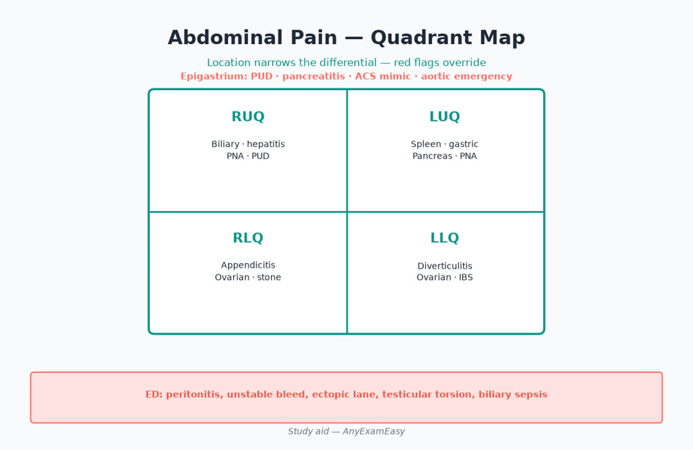
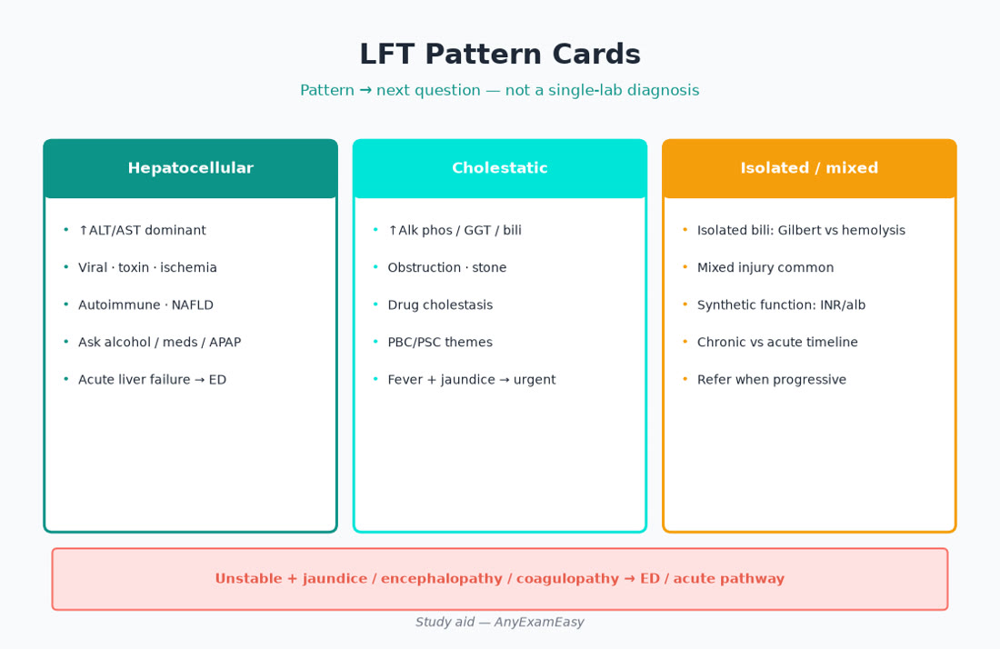
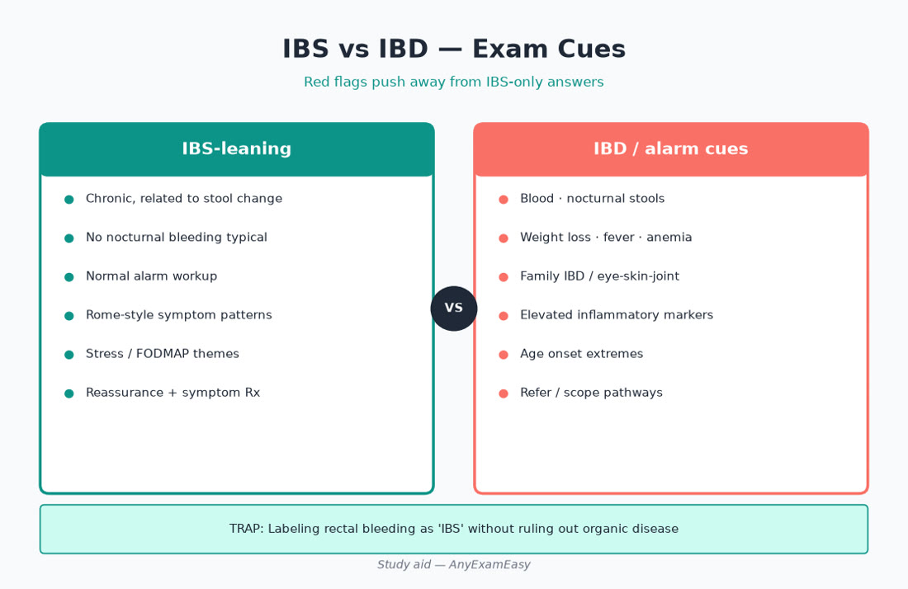

# Chapter 7 — GI / Hepatic

> **Study aid only.** High-yield FNP primary-care themes for exam judgment — not a protocol. Verify current guidelines, USPSTF/ACIP when relevant, and drug labels. Teaching themes only where drugs appear. Independent of AANPCB/AANP.

---

## Why this chapter matters

**Abdominal pain, reflux, liver tests, and GI bleeding cues cut across Young Adult* (including prenatal), Middle Adult, and Older Adult (30%). Domain I grades whether you catch surgical emergencies and choose the right first test.**

Soft practice pairing: [anyexameasy.com](https://anyexameasy.com) ($27.99/mo after trial; trial terms on site).

---

## ADPE lens

| Process | Behaviors |
| --- | --- |
| **Assess** | Pain pattern, rebound/guarding, pregnancy, bleeding, alcohol, meds/NSAIDs, jaundice, travel, SDoH/alcohol use |
| **Diagnose** | Surgical vs medical; IBS vs IBD cues; hepatocellular vs cholestatic LFTs; hepatitis etiologies |
| **Plan** | PPI stewardship, H. pylori pathways, antiemetics carefully, referral/ED, lifestyle for NAFLD |
| **Evaluate** | Alarm feature follow-through, LFT trend, PPI deprescribe attempts, alcohol counseling |

> **MUST KNOW** — Unstable patients leave clinic — ED/EMS before clever outpatient plans.

---

## Topic A — GERD & dyspepsia

**Takeaway: Trial PPI thoughtfully; alarm features need investigation—not endless empiric therapy.**

### Presentation
Heartburn, regurgitation, epigastric pain. Alarm: weight loss, anemia, dysphagia, bleeding, persistent vomiting, age/risk thresholds for endoscopy themes.

| Approach | When |
| --- | --- |
| Lifestyle | Trigger foods, weight, head-of-bed, timing of meals |
| PPI trial | Classic GERD without alarms — verify duration guidance |
| H. pylori testing | Dyspepsia pathways when indicated |
| Endoscopy | Alarms / failure / high-risk |

> **MUST KNOW** — Dysphagia, GI bleeding, progressive weight loss → investigate — don’t chronic-PPI and pray.

> **HIGHLIGHT** — Deprescribe PPI when indication gone — older adults: infection/fracture/malabsorption themes discussed in literature.

> **TRAP** — Ignoring NSAID + dyspepsia/bleed risk.

> **LIFESPAN** — Older Adult: higher GI bleed risk on NSAID/antiplatelet/anticoag stacks. Prenatal: reflux common — med safety verify.

#### Critical checklist — GERD & dyspepsia

- [ ] Alarm features screened
- [ ] PPI not eternal without review
- [ ] H. pylori considered when appropriate
- [ ] Lifestyle counseled

## Topic B — PUD / H. pylori / GI bleed cues

**Takeaway: Stop the bleed risk; test-and-treat H. pylori when indicated; melena/hematemesis → ED if unstable.**

### Red flags
Coffee-ground emesis, melena, hematochezia with instability, syncope, peritonitis after ulcer history.

| Stable dyspepsia | Unstable bleed |
| --- | --- |
| Test H. pylori (stool Ag/breath — verify) | ABCs, ED |
| Stop NSAIDs if possible | Resuscitation pathway |
| PPI per guidance | Don’t outpatient “observe melena” |

> **MUST KNOW** — Active GI bleeding with instability → ED.

> **TRAP** — Starting anticoagulation without asking about black stools.

#### Critical checklist — PUD / H. pylori / GI bleed cues

- [ ] Bleed disposition correct
- [ ] NSAID review
- [ ] H. pylori test-of-treat themes
- [ ] Anticoag/antiplatelet context

## Topic C — IBS vs IBD cues

**Takeaway: IBS is diagnosis of pattern + limited red-flag workup; IBD needs timely GI referral.**

| Feature | IBS vibe | IBD vibe |
| --- | --- | --- |
| Night symptoms / blood | Less | More concerning |
| Weight loss / fever | No | Yes concerning |
| Young adult chronic diarrhea + blood | Consider IBD | Refer |
| Pain relieved by stool, years of stability | IBS possible | Still screen alarms |

Rome-style pattern recognition helps but **alarms override**.

> **HIGHLIGHT** — Normalize IBS; don’t CT every flare without indication.

> **TRAP** — Calling bloody diarrhea ‘IBS’.

#### Critical checklist — IBS vs IBD cues

- [ ] Alarms excluded
- [ ] IBS education + diet/stress therapies
- [ ] IBD referred
- [ ] Celiac considered when fitting

## Topic D — Hepatitis & LFT patterns

**Takeaway: Pattern first: hepatocellular vs cholestatic vs mixed — then etiology.**

| Pattern | Labs vibe | Think |
| --- | --- | --- |
| Hepatocellular | ALT/AST dominant | Viral, toxin/alcohol, ischemic, autoimmune |
| Cholestatic | Alk phos/GGT/bili | Obstruction, drug, PBC themes |
| Isolated bili | Indirect vs direct | Gilbert vs hemolysis vs obstruction |

Acute hep A/B/C testing when indicated; acetaminophen history; alcohol quantification; NAFLD in metabolic syndrome.

> **MUST KNOW** — Acetaminophen toxicity and acute liver failure themes → ED.

> **LIFESPAN** — Pregnancy: HELLP/AFLP lanes — Ob emergency, not ‘NAFLD’.

#### Critical checklist — Hepatitis & LFT patterns

- [ ] Pattern named
- [ ] Med/toxin review
- [ ] Viral serologies when indicated
- [ ] Refer obstructive jaundice urgently

## Topic E — Abdominal pain differentials

**Takeaway: Quadrant + acuity + pregnancy status drive imaging and disposition.**

| Cue | Can’t-miss |
| --- | --- |
| RLQ | Appendicitis |
| RUQ | Cholecystitis/cholangitis |
| LLQ | Diverticulitis (older) |
| Flank | Pyelo/stone |
| Diffuse + rigid | Perforation/peritonitis |
| Pelvic + YA* | Ectopic/torsion |

> **MUST KNOW** — Peritonitis / unstable abd pain → ED — not oral abx trial at home alone.

> **LIFESPAN** — Older Adult: appendicitis atypical; diverticulitis rises. Child: intussusception/appendicitis lanes.

#### Critical checklist — Abdominal pain differentials

- [ ] Pregnancy test when relevant
- [ ] Peritoneal signs → ED
- [ ] Age-appropriate diverticulitis/appendicitis priors

---

## Clinical vignette 1 — RUQ pain after fatty meal

**Stem:** 42-year-old woman RUQ pain, +Murphy, fever 101.2, HR 110

| Stage | Move |
| --- | --- |
| **Assess** | Febrile tachycardic biliary pain |
| **Diagnose** | Acute cholecystitis lane |
| **Plan** | ED/surgery pathway — NPO, imaging |
| **Evaluate** | Later: stones counseling, diet |

**Why distractors fail**
- Outpatient ‘GI cocktail’ and home
- Ignore fever

> **MUST KNOW** — Febrile cholangitis/cholecystitis themes need acute care.

> **TRAP** — Sending febrile biliary patient home on oral abx without pathway.

#### Critical checklist — this vignette
- [ ] Stability assessed
- [ ] Age band tagged
- [ ] Can’t-miss named
- [ ] Evaluate/follow-up planned

## Clinical vignette 2 — Chronic diarrhea young adult

**Stem:** 26-year-old months of diarrhea, blood streaks, weight loss 12 lb

| Stage | Move |
| --- | --- |
| **Assess** | Alarm features + YA* |
| **Diagnose** | IBD until proven otherwise — not IBS |
| **Plan** | Labs + timely GI referral; rule out infection |
| **Evaluate** | Ensure follow-through |

**Why distractors fail**
- Loperamide only forever
- IBS label with blood+weight loss

> **TRAP** — Blood + weight loss ≠ IBS.

#### Critical checklist — this vignette
- [ ] Stability assessed
- [ ] Age band tagged
- [ ] Can’t-miss named
- [ ] Evaluate/follow-up planned

## Clinical vignette 3 — Older adult LFTs + confusion

**Stem:** 70-year-old on multiple meds, rising AST/ALT, sleepy, taking extra acetaminophen for OA

| Stage | Move |
| --- | --- |
| **Assess** | Older Adult; toxin exposure |
| **Diagnose** | Drug-induced liver injury / possible toxicity |
| **Plan** | ED if acute liver failure cues; stop offender |
| **Evaluate** | Med reconciliation, OA plan without toxic APAP doses |

**Why distractors fail**
- Add another pain med blindly

> **MUST KNOW** — Acetaminophen ceilings matter — teach totals including combo products.

> **LIFESPAN** — Older Adult + chronic pain → hidden APAP overdose risk.

#### Critical checklist — this vignette
- [ ] Stability assessed
- [ ] Age band tagged
- [ ] Can’t-miss named
- [ ] Evaluate/follow-up planned

---

## Exam traps

| Trap | Instead |
| --- | --- |
| Therapy before stability | Red-flag filter first |
| Ignoring age band | Recalculate priors (Older Adult 30%) |
| Missing pregnancy | YA* includes prenatal |
| SDoH as “noncompliance” | Fix barriers |
| Inventing exact doses | Class + safety; verify guidelines |

---

## Quick chapter checklist

- [ ] ADPE labeled on every stem  
- [ ] MUST KNOW emergencies dispositioned to ED  
- [ ] Lifespan twist applied  
- [ ] Teach-back / Evaluate plan stated  
- [ ] Verify current guidelines before clinical use  

**Pair with Qbank:** Practice related items on [AnyExamEasy](https://anyexameasy.com) — start free; $27.99/mo after trial (trial terms on site). Independent of AANPCB/AANP; no pass guarantee.

---

## Topic F — Constipation, diarrhea acuity, and C. difficile cues

**Takeaway: Acute bloody diarrhea, severe dehydration, and post-antibiotic colitis change disposition — don’t call everything “viral gastroenteritis.”**

### Constipation (primary care)

Assess stool form, opioids, iron, calcium, anticholinergics, hypothyroidism, obstruction red flags (vomiting, no flatus, severe pain, mass). Plan: fiber/fluids when appropriate, osmotic agents themes, stimulant short courses, opioid bowel regimens. **New severe constipation in older adult** → think obstruction/ileus/meds — exam before “just senna.”

### Acute diarrhea

Travel, food, antibiotic exposure, immunocompromise, blood, fever, severe abdominal pain. Oral rehydration first-line for most viral illness. Stool studies when dysentery, severe, outbreak, immunocompromised, or prolonged. **Antibiotics only when bacterial likelihood and guidance support** — stewardship.

### C. difficile awareness

Recent abx/hospitalization + watery diarrhea ± leukocytosis. Stop unnecessary abx; test when pretest high; treat per current ID guidance; infection control teaching. Severe (hypotension, megacolon, ICU cues) → ED.

> **MUST KNOW** — Toxic megacolon / severe colitis → ED, not outpatient antimotility alone.

> **TRAP** — Empiric fluoroquinolone for every traveler without thought; antimotility in bloody/toxic diarrhea.

> **LIFESPAN** — Infants/children: dehydration staging rules (see pediatrics). Older adults: volume + electrolyte disaster risk rises fast.

---

## Topic G — NAFLD / metabolic liver disease & alcohol

**Takeaway: Fatty liver is a cardiometabolic disease — weight, diabetes, lipids, alcohol quantification, and fibrosis risk stratification beat “LFTs are mildly up, ignore.”**

### Assess

BMI, waist, diabetes, lipids, alcohol (honest quantification), meds (amiodarone, methotrexate, tamoxifen themes), viral hepatitis risk.

### Diagnose lane

NAFLD/MASLD themes vs alcohol-associated liver disease vs viral vs drug. Fibrosis risk tools / elastography referral when indicated (verify current hepatology pathways). Don’t label every ALT 45 as “normal for them” without metabolic Plan.

### Plan

Weight loss (7–10% themes often discussed), Mediterranean-style pattern, treat diabetes/HTN/lipids, alcohol counseling or abstinence if alcohol-associated. Refer for advanced fibrosis suspicion, unexplained cholestasis, or decompensation cues (ascites, encephalopathy, variceal bleed history).

> **HIGHLIGHT** — Cardiovascular risk reduction is part of “liver” Plan.

> **TRAP** — Reassuring rising bilirubin + INR bump as “fatty liver” — that may be acute liver injury.

---

## Topic H — Pancreatitis & gallbladder spectrum (clinic triage)

**Takeaway: Epigastric pain radiating to back + lipase themes + alcohol/gallstones → acute care pathway when moderate-severe.**

Mild recovered gallstone colic may be outpatient surgical referral. **Fever + jaundice + RUQ pain (Charcot)** → ascending cholangitis emergency thinking. Hypertriglyceridemia pancreatitis: don’t miss very high TG as cause.

> **MUST KNOW** — Cholangitis / severe pancreatitis → ED.

---

## Topic I — Anorectal & colorectal cancer screening bridge

Hemorrhoids vs fissure vs cancer worry: **rectal bleeding still needs age-appropriate cancer exclusion** — don’t forever diagnose “hemorrhoids” in a 55-year-old never screened. FIT/colonoscopy themes per USPSTF-aligned timing (verify). Family history changes start age — ask.

> **LIFESPAN** — Middle Adult prevention weight; Older Adult continue screening until shared decision on life expectancy/comorbidity.

---

## Expanded vignette notes — teach-back scripts (Plan items)

- “Black stools or vomiting blood is an emergency — go to the ED.”  
- “Heartburn with food sticking or weight loss needs a look inside, not endless acid pills.”  
- “If your diarrhea started after antibiotics, call us — we may need a special test.”  
- “Fatty liver improves most with weight and sugar control — this protects your heart too.”  
- “Acetaminophen is in many cold products — count your total daily amount.”

---

## GI-specific exam traps (add to board)

| Trap | Instead |
| --- | --- |
| Chronic PPI without indication review | Attempt step-down when appropriate |
| IBS label with nocturnal blood/weight loss | IBD/infection workup + GI referral |
| Ignoring pregnancy in pelvic/abd pain | Test early (YA*) |
| Outpatient observe melena in dizzy patient | ED |
| Missed alcohol history in LFT elevation | Quantify; counsel |
| Treating NH asymptomatic +UA as UTI forever | Symptom + stewardship lens |

---

## Critical callouts — GI/hepatic (scan tonight)

> **MUST KNOW** — Peritonitis, unstable GI bleed, cholangitis, acute liver failure cues → ED.

> **MUST KNOW** — Alarm GERD/dyspepsia features → investigate, don’t eternal empiric PPI.

> **HIGHLIGHT** — LFT pattern first (hepatocellular vs cholestatic), then etiology.

> **TRAP** — Bloody diarrhea called IBS; APAP overdose hidden in combo products.

> **LIFESPAN** — Older Adult atypical abd exams; prenatal HELLP/AFLP are Ob emergencies.

#### Critical checklist — GI tonight
- [ ] Pregnancy filter on abd/pelvic pain  
- [ ] Bleed/peritonitis disposition  
- [ ] H. pylori / PPI stewardship  
- [ ] IBD alarms vs IBS  
- [ ] Acetaminophen ceiling teaching

---

## Topic A+ — GERD/dyspepsia depth (workup & deprescribing)

### Assess details that change Plan

Timing (postprandial vs nocturnal), dysphagia map (solids only vs solids+liquids), NSAID/ASA/anticoag stack, *H. pylori* risk, Barrett risk factors (chronic GERD, age, male, smoking, central obesity — verify referral thresholds), red-flag weight loss measured on scale not vibes.

### Plan ladder themes

1. Lifestyle always documented.  
2. Antacids/H2 for mild intermittent.  
3. PPI once daily before meal for typical GERD without alarms — time-limited trial then reassess (verify duration).  
4. Failure → adherence/timing check, twice-daily consideration themes, or endoscopy pathway — don’t infinite escalate forever without looking.  
5. Deprescribe: if asymptomatic on long-term PPI for unclear indication, attempt step-down with return precautions.

### Evaluate

Symptom scores, alarm emergence, B12/Mg themes discussed for long-term PPI in some patients, bone health conversation in older adults on chronic PPI + other risk factors — shared decision, not fear-mongering.

---

## Topic B+ — GI bleed risk stacking (Older Adult favorite)

Antiplatelet + anticoagulant + NSAID + SSRI + alcohol = bleed multiplier. Primary care Plan: deprescribe NSAID, gastroprotection when indicated (verify), teach melena/hematemesis return precautions, coordinate periprocedural holds with specialists.

| Stack | Thinking |
| --- | --- |
| ASA + ibuprofen daily | Stop NSAID; protect if ASA essential |
| DOAC + new NSAID for “arthritis” | High-risk combo — alternative analgesia |
| Steroid burst + NSAID | Ulcer risk spike |

> **LIFESPAN** — Older Adult 30%: this stack is everywhere — med reconciliation is the intervention.

---

## Topic C+ — Celiac & food-triggered diarrhea

Chronic diarrhea, iron deficiency, dermatitis herpetiformis themes, family history — consider celiac serology **while on gluten**. Don’t start gluten-free diet before testing. Positive → dietitian + GI confirmation pathway per guidance.

Lactose intolerance is common; trial is reasonable after alarms excluded. FODMAP trials for IBS — preferably with dietitian when possible.

---

## Topic D+ — Viral hepatitis primary-care jobs

| Virus | FNP jobs |
| --- | --- |
| HAV | Vaccine when indicated; report outbreaks; supportive care |
| HBV | Screen at-risk; vaccinate; refer chronic for staging/therapy |
| HCV | Universal adult screen themes (verify USPSTF); link to cure pathways |

Occupational exposures and pregnancy screening themes belong in YA*/prevention chapters — don’t forget them here when LFTs rise.

> **MUST KNOW** — New jaundice with encephalopathy/coagulopathy → ED for acute liver failure pathway.

---

## Additional vignette 4 — Black stools on DOAC

**Stem:** 68-year-old on apixaban for AF, started naproxen for knee; melena, dizzy, BP 92/58, HR 112.

| ADPE | Move |
| --- | --- |
| Assess | Unstable GI bleed + antithrombotic + NSAID |
| Diagnose | Acute upper GI bleed likely |
| Plan | **ED/EMS** — not oral PPI and home |
| Evaluate | Later: stop NSAID; gastroprotection; anticoag restart decision with specialists |

**Why distractors fail:** Outpatient PPI “trial”; increasing naproxen; blaming hemorrhoids without vitals.

---

## Additional vignette 5 — Pregnant RUQ pain

**Stem:** 32-year-old at 34 weeks, RUQ pain, headache, BP 158/98, platelets pending.

| ADPE | Move |
| --- | --- |
| Assess | YA* prenatal; preeclampsia/HELLP lane |
| Diagnose | Not routine chole alone until Ob emergency excluded |
| Plan | Urgent obstetric pathway / ED-L&D |
| Evaluate | Postpartum BP follow-through awareness |

**Why distractors fail:** GI cocktail and home; outpatient ultrasound only without BP emergency recognition.

---

## Topic J — Dysphagia & odynophagia

Solids-only progressive dysphagia → structural (stricture, cancer, ring) — endoscopy pathway. Solids+liquids from outset → motility themes. Odynophagia → infectious esophagitis in immunocompromised (candida/HSV/CMV). Pill esophagitis (doxy, bisphosphonate) — take with water upright.

> **MUST KNOW** — Progressive dysphagia + weight loss in older adult → investigate — not chronic PPI forever.

---

## Topic K — Diverticulitis, appendicitis, bowel obstruction cues

LLQ pain + fever in older adult → diverticulitis lane; peritonitis/abscess → ED. RLQ pain classic appendicitis; older adults atypical. Obstipation + vomiting + distension → obstruction → ED. Don’t give antimotility blindly in acute abdomen.

---

## Topic L — IBD therapy awareness for primary care

Know vaccines before immunosuppression, infection vigilance, skin cancer counseling themes on some agents, bone health on steroids, CRC surveillance ownership with GI. Flare with toxicity → ED. Pregnancy planning with GI/Ob.

---

## Remember this — GI

- Pattern LFTs before shotgun serologies.  
- Alarms override IBS labels.  
- Acetaminophen totals include combo cold products.  
- Prenatal RUQ + HTN ≠ routine fatty meal colic.

**Practice:** [AnyExamEasy](https://anyexameasy.com) ($27.99/mo after trial; trial terms on site).

---

## Concept checks — GI extra

**4.** Melena + BP 88/50 on warfarin — Plan?  
A. Oral PPI and home  B. ED  C. Increase warfarin  D. Fiber  
**Answer:** B.

**5.** Best first LFT thinking step?  
A. Immediate liver biopsy  B. Hepatocellular vs cholestatic pattern  C. Start steroids  D. Ignore if <2× ULN always  
**Answer:** B.

---

## Topic M — Upper endoscopy & colonoscopy referral timing (primary-care ownership)

Know alarm features that should not wait: progressive dysphagia, GI bleeding, iron-deficiency anemia unexplained, progressive weight loss, abnormal imaging mass. Screening colonoscopy/FIT intervals per USPSTF-aligned age (verify). Family history of CRC/advanced polyps shifts start age — take a three-generation history. After polypectomy, follow GI surveillance intervals — Evaluate means closing the loop on the report.

Post-EGD “Barrett’s” letters: confirm surveillance plan; antireflux optimization; don’t lose the patient to follow-up.

---

## Topic N — Nausea, antiemetics, and pregnancy bridge

Assess pregnancy early (YA*). Hyperemesis with ketones/dehydration → acute care. Prefer pregnancy-safer antiemetic themes when pregnant — verify. In general adults: ondansetron QT awareness with interactors; metoclopramide tardive risk with chronic use; anticholinergic antiemetics worsen elder confusion.

Cannabinoid hyperemesis: hot showers relief history + cannabis — cessation is therapy.

---

## Topic O — Abdominal wall vs visceral pain

Carnett’s sign themes help separate wall pain from visceral. Hernia incarceration/strangulation → ED. Shingles prodrome can mimic acute abdomen — look for dermatomal vesicles.

---

## Integrated Older Adult GI mini-case

**Stem vibe:** 81-year-old on ASA + apixaban + intermittent ibuprofen, new epigastric pain, Hb drop 2 g, guaiac positive, orthostatic.

**ADPE:** Unstable bleed risk → ED. Later deprescribe NSAID, revisit gastroprotection, anticoag restart with specialty, H. pylori testing when appropriate, teach melena precautions.

---

## Topic P — GI pharmacology safety board (teaching themes)

| Theme | Exam hook |
| --- | --- |
| Chronic PPI | Deprescribe when indication unclear; interaction/absorption conversations |
| Clopidogrel + omeprazole | CYP interaction themes historically discussed — verify current guidance |
| Lactulose / rifaximin | Hepatic encephalopathy Plan awareness with GI/hepatology |
| Mesalamine / thiopurines / biologics | IBD — infection screen/vaccines before immuno suppression |
| Loperamide | Avoid in bloody/toxic colitis; high-dose misuse cardiac risk awareness |
| Antacids / sucralfate | Separate from some drugs (levothyroxine, quinolones) |

> **TRAP** — Adding antidiarrheal in suspected C. diff or dysentery with fever/blood.

---

## Topic Q — Post-hospital GI transitions (Evaluate gold)

Discharge after GI bleed: confirm anticoag/antiplatelet restart timing with specialists, PPI duration indication, H. pylori test-of-cure when treated, follow-up endoscopy if needed, iron repletion plan, teach rebleed signs. After new cirrhosis diagnosis: variceal screening pathway, alcohol cessation resources, vaccine update, med reconciliation (avoid NSAIDs).

---

## Clinical vignette 6 — New jaundice young adult

**Stem:** 24-year-old fatigue, dark urine, RUQ ache, ALT 1200, bili 4.2, no alcohol binge, recent raw oysters travel history possible, sexually active.

| ADPE | Move |
| --- | --- |
| Assess | Acute hepatitis picture; exposures; pregnancy test |
| Diagnose | Acute viral hepatitis on board (HAV/HBV/others) |
| Plan | Serologies; supportive care; ED if coagulopathy/encephalopathy; public health as indicated |
| Evaluate | Contacts/vaccination; sexual health counseling |

**Why distractors fail:** Start high-dose acetaminophen for pain; reassure Gilbert’s with ALT 1200.
