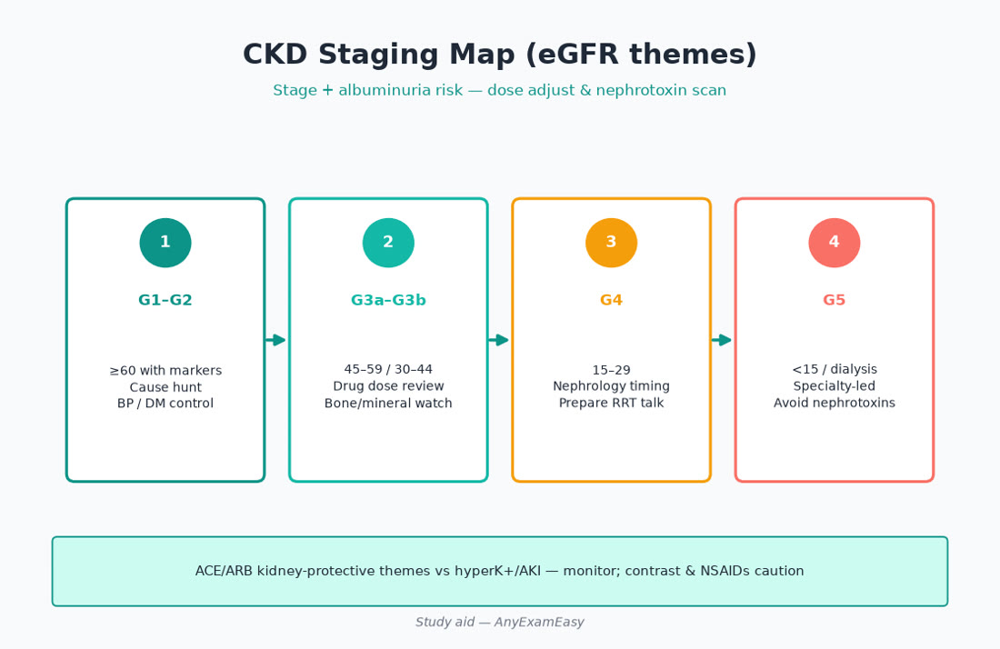
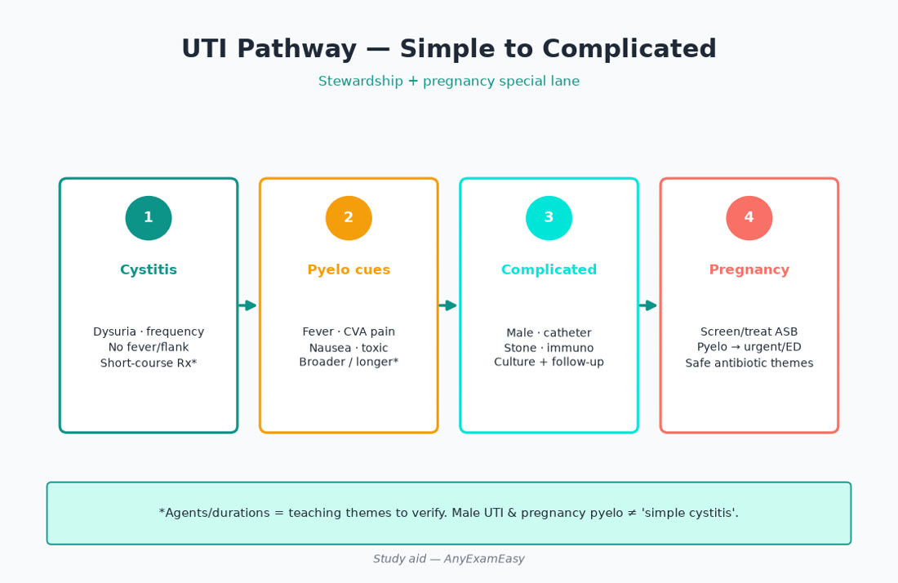
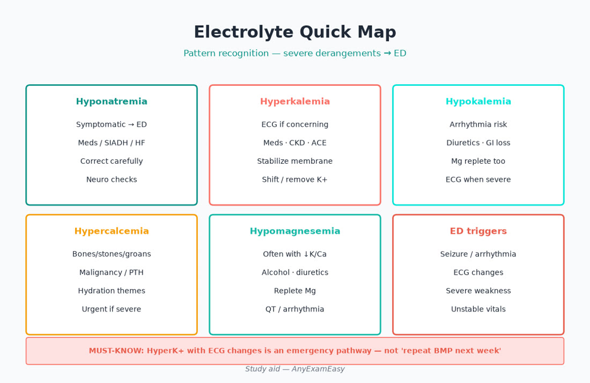

# Chapter 8 — Renal / GU

> **Study aid only.** High-yield FNP primary-care themes for exam judgment — not a protocol. Verify current guidelines, USPSTF/ACIP when relevant, and drug labels. Teaching themes only where drugs appear. Independent of AANPCB/AANP.

---

## Why this chapter matters

**CKD, UTI, BPH, hematuria, and electrolytes show up constantly in Older Adult (30%) and women’s health overlap. Missed complicated UTI and hyperkalemia emergencies are classic board traps.**

Soft practice pairing: [anyexameasy.com](https://anyexameasy.com) ($27.99/mo after trial; trial terms on site).

---

## ADPE lens

| Process | Behaviors |
| --- | --- |
| **Assess** | Urinary symptoms, volume status, meds (NSAID/ACEI/diuretic), sexual Hx, obstruction cues, pregnancy |
| **Diagnose** | Uncomplicated vs complicated UTI; CKD stage; prerenal vs intrinsic; stone vs pyelo |
| **Plan** | Abx stewardship, ACEI/ARB in albuminuric CKD, refer eGFR thresholds, BPH therapies |
| **Evaluate** | Culture follow-up, K/Cr after drug changes, PSA shared decision, recurrence prevention |

> **MUST KNOW** — Unstable patients leave clinic — ED/EMS before clever outpatient plans.

---

## Topic A — CKD

**Takeaway: Stage with eGFR + albuminuria; protect kidney with BP and drug choices; know when to refer.**

| Tool | Use |
| --- | --- |
| eGFR | Staging themes |
| UACR | Albuminuria grading |
| BMP | K, bicarb, Cr trend |
| Med review | NSAIDs, dual blockade, nephrotoxins |

Plan themes: BP control, ACEI/ARB for albuminuria/diabetes themes, SGLT2 in eligible T2DM/CKD — verify, avoid NSAIDs, dose-adjust renally cleared drugs, anemia/MBD awareness, refer when eGFR low or rapid decline/uncertain etiology.

> **MUST KNOW** — Severe hyperK with ECG changes / weakness → ED.

> **HIGHLIGHT** — AKI on CKD often from volume depletion + NSAID + ACEI ‘triple whammy’ with diuretic.

> **LIFESPAN** — Older Adult: lower muscle mass confuses Cr; start low go slow.

#### Critical checklist — CKD

- [ ] Stage documented
- [ ] NSAID avoidance
- [ ] K monitored on ACEI/ARB/MRA
- [ ] Referral thresholds known

## Topic B — UTI

**Takeaway: Treat true infection; don’t treat asymptomatic bacteriuria except pregnancy/specific procedures.**

| Type | Plan vibe |
| --- | --- |
| Uncomplicated cystitis (nonpregnant) | Short-course abx themes — verify local resistance |
| Pyelo | Broader / possible ED if toxic |
| Complicated (male, stone, catheter, immunocompromise) | Culture + broader thinking |
| Pregnancy | Always treat bacteriuria themes — verify agents safe |
| Asymptomatic bacteriuria | Usually don’t treat |

> **MUST KNOW** — Male UTI is complicated until proven otherwise — don’t 3-day nitrofurantoin autopilot without thought.

> **TRAP** — Treating every positive UA in asymptomatic elder in a NH without symptoms — C. diff risk.

> **LIFESPAN** — Pregnancy (YA*): screen/treat ASB. Elders: atypical — confusion may be cue but don’t reflex abx without assessment.

#### Critical checklist — UTI

- [ ] Pregnancy status known
- [ ] Culture when complicated
- [ ] Stewardship duration
- [ ] Return precautions

## Topic C — BPH / LUTS / ED

**Takeaway: Improve symptoms; watch retention; ED is CVD risk conversation too.**

BPH: alpha blockers / 5-ARI themes; avoid anticholinergics that worsen retention in some; catheterize/ED for acute retention.

ED: ask about CVD symptoms; PDE-5 inhibitors — **never with nitrates**.

> **MUST KNOW** — PDE-5 inhibitor + nitrate = hard no.

> **TRAP** — Starting anticholinergic for LUTS without checking PVR/retention risk.

#### Critical checklist — BPH / LUTS / ED

- [ ] Retention red flags
- [ ] PDE-5 + nitrate contraindication
- [ ] Shared PSA decision if screening discussed

## Topic D — Hematuria

**Takeaway: Gross hematuria needs evaluation; don’t assume UTI forever.**

Risk-based urology pathways (smoking, age, gross vs microscopic). Treat UTI if present but ensure resolution and follow through if hematuria persists.

> **MUST KNOW** — Painless gross hematuria → urologic evaluation pathway — not endless abx.

#### Critical checklist — Hematuria

- [ ] Gross hematuria plan timed
- [ ] Cancer risk factors asked
- [ ] Anticoag patients still need evaluation

## Topic E — Electrolytes high-yield

**Takeaway: Na/K emergencies first; find the drug driver.**

| Problem | Themes |
| --- | --- |
| HyperK | ACEI/ARB/MRA/TMP, CKD; ECG; ED if severe |
| HypoK | Diuretics, GI loss; arrhythmia risk; replete Mg too often |
| Hyponatremia | SIADH vs thiazide vs polydipsia; severe AMS → ED |
| HyperNa | Free water loss; elders with poor access |

> **MUST KNOW** — Symptomatic severe Na/K disorders → ED — not casual oral repletion alone.

#### Critical checklist — Electrolytes high-yield

- [ ] ECG thinking for K extremes
- [ ] Med list reviewed
- [ ] Severe symptomatic Na disorders → ED

---

## Clinical vignette 1 — Complicated UTI male

**Stem:** 58-year-old dysuria/fever/flank pain; HR 105

| Stage | Move |
| --- | --- |
| **Assess** | Toxic pyelo cues |
| **Diagnose** | Complicated / pyelo |
| **Plan** | Urgent care pathway/ED if toxic; culture; abx per guidance |
| **Evaluate** | Follow culture; obstruction imaging if fails |

**Why distractors fail**
- 3-day cystitis regimen and home without follow-up

> **MUST KNOW** — Febrile UTI with systemic signs needs acute management.

#### Critical checklist — this vignette
- [ ] Stability assessed
- [ ] Age band tagged
- [ ] Can’t-miss named
- [ ] Evaluate/follow-up planned

## Clinical vignette 2 — CKD + NSAID + ACEI

**Stem:** 72-year-old eGFR 40 on lisinopril starts daily ibuprofen for knee; Cr rises, K 5.6

| Stage | Move |
| --- | --- |
| **Assess** | Triple whammy; Older Adult |
| **Diagnose** | AKI on CKD + hyperK risk |
| **Plan** | Stop NSAID; hold/adjust per severity; ED if ECG changes/severe K |
| **Evaluate** | Pain plan without NSAID; pharmacy education |

**Why distractors fail**
- Add MRA for BP now

> **TRAP** — NSAID in CKD on ACEI.

> **LIFESPAN** — Older Adult multimorbidity = med reconciliation every visit.

#### Critical checklist — this vignette
- [ ] Stability assessed
- [ ] Age band tagged
- [ ] Can’t-miss named
- [ ] Evaluate/follow-up planned

## Clinical vignette 3 — Pregnancy ASB

**Stem:** 29-year-old 16 weeks, asymptomatic, UA culture 10^5 E. coli

| Stage | Move |
| --- | --- |
| **Assess** | YA* prenatal |
| **Diagnose** | ASB in pregnancy — treat |
| **Plan** | Pregnancy-safe abx themes — verify; test of cure per guidance |
| **Evaluate** | Recurrence surveillance |

**Why distractors fail**
- Reassure ASB never treated

> **LIFESPAN** — Prenatal maps to Young Adult* — don’t skip.

#### Critical checklist — this vignette
- [ ] Stability assessed
- [ ] Age band tagged
- [ ] Can’t-miss named
- [ ] Evaluate/follow-up planned

---

## Exam traps

| Trap | Instead |
| --- | --- |
| Therapy before stability | Red-flag filter first |
| Ignoring age band | Recalculate priors (Older Adult 30%) |
| Missing pregnancy | YA* includes prenatal |
| SDoH as “noncompliance” | Fix barriers |
| Inventing exact doses | Class + safety; verify guidelines |

---

## Quick chapter checklist

- [ ] ADPE labeled on every stem  
- [ ] MUST KNOW emergencies dispositioned to ED  
- [ ] Lifespan twist applied  
- [ ] Teach-back / Evaluate plan stated  
- [ ] Verify current guidelines before clinical use  

**Pair with Qbank:** Practice related items on [AnyExamEasy](https://anyexameasy.com) — start free; $27.99/mo after trial (trial terms on site). Independent of AANPCB/AANP; no pass guarantee.

---

## Topic F — Nephrolithiasis & obstruction cues

**Takeaway: Colicky flank pain ± hematuria is often stone — but fever + obstruction is an emergency.**

### Assess

Pain pattern, prior stones, urine output, fever, nausea, pregnancy status, meds (topiramate, protease inhibitors themes), high-purine diet/hydration.

### Diagnose / disposition

Uncomplicated stone: analgesia, strain urine, imaging pathway per guidance, urology if large/infected/solitary kidney/intractable pain. **Infected obstructing stone (fever, pyelo picture)** → ED/urology urgently — source control risk.

### Plan / Evaluate

Hydration teaching, citrate/dietary themes by stone type when known, thiazide for recurrent calcium stones in selected patients (verify), follow imaging as indicated, metabolic workup for recurrent formers.

> **MUST KNOW** — Stone + infection/sepsis cues → ED, not oral abx and hope.

> **TRAP** — Ketorolac-heavy analgesia without checking CKD/bleed risk.

---

## Topic G — Proteinuria, nephritic/nephrotic awareness

**Takeaway: UACR quantifies albuminuria; heavy proteinuria + edema + hypoalbuminemia themes → nephrotic lane — timely nephrology.**

Nephritic vibes (HTN, oliguria, active urine sediment, rising Cr) need urgent evaluation. Orthostatic proteinuria in adolescents is a different story — history and timed collections help.

> **HIGHLIGHT** — Diabetes + albuminuria → ACEI/ARB + SGLT2 eligibility thinking (endocrine/renal bridge).

---

## Topic H — Acute kidney injury in primary care

**Takeaway: Compare to baseline Cr; bin prerenal vs intrinsic vs post-renal; stop the insult.**

| Bin | Clues | First moves |
| --- | --- | --- |
| Prerenal | Volume loss, HF low output, overdiuresis | Fluids if dry; hold nephrotoxins |
| Intrinsic | ATN after ischemia/toxin; AIN (drugs, rash, eos themes) | Stop offender; specialty |
| Post-renal | Retention, hydronephrosis, BPH, stones, mass | Bladder scan/catheter; imaging; urology |

Triple whammy: ACEI/ARB + diuretic + NSAID in volume depletion. Hold metformin in significant AKI (lactic acidosis risk themes). HyperK and volume overload drive ED.

> **MUST KNOW** — Anuric/oliguric AKI with hyperK/volume overload/uremic symptoms → ED.

> **LIFESPAN** — Older Adult: small Cr rise can mean large GFR loss; meds pile up.

---

## Topic I — Incontinence, catheter stewardship, scrotal emergencies

Stress vs urge vs overflow incontinence — exam + PVR when overflow/retention suspected. Avoid reflex anticholinergics in cognitively frail elders without reviewing Beers-style risk. Catheters: remove ASAP; treat CAUTI only when symptomatic infection criteria met.

**Scrotal pain:** torsion (adolescent/young adult sudden severe) → ED/urology immediately. Epididymitis often STI-related in young — treat GC/CT themes + partners. Older: consider enteric organisms / obstruction.

> **MUST KNOW** — Suspected testicular torsion → immediate ED/urology — time = testis.

---

## Topic J — STI overlap in GU (male & partner care)

Urethritis, epididymitis, proctitis — NAAT testing, empiric coverage when indicated, expedited partner therapy where legal, HIV/syphilis screening. Don’t treat “chronic prostatitis” with endless quinolones without diagnosis discipline.

---

## Expanded counseling scripts (Plan)

- “Ibuprofen plus your blood-pressure kidney medicine can injure kidneys when you’re sick or dehydrated — use other pain plans.”  
- “A urine culture growing bacteria without symptoms usually should not get antibiotics — except in pregnancy.”  
- “If you take nitroglycerin or isosorbide, you cannot use erectile-dysfunction pills like sildenafil.”  
- “Blood you can see in the urine needs a full evaluation even if a urine infection was treated.”  
- “Sudden severe testicular pain is an emergency.”

---

## Renal/GU exam traps (add)

| Trap | Instead |
| --- | --- |
| 3-day nitrofurantoin for febrile male UTI | Culture + complicated pathway |
| Treat NH ASB routinely | Symptoms + stewardship |
| Ignore rising K on ACEI+TMP-SMX | Monitor / adjust |
| Start PDE-5 without nitrate screen | Absolute contraindication check |
| Call all hematuria “UTI” | Risk-based urology follow-through |
| Miss pregnancy ASB | Treat + appropriate follow-up |

---

## Critical callouts — renal/GU (scan tonight)

> **MUST KNOW** — Severe hyperK, toxic pyelo, obstructed infected stone, torsion → ED.

> **MUST KNOW** — Pregnancy ASB is treated; most other ASB is not.

> **HIGHLIGHT** — Triple whammy AKI: ACEI/ARB + diuretic + NSAID.

> **TRAP** — PDE-5 + nitrates; endless abx for asymptomatic bacteriuria in elders.

> **LIFESPAN** — YA* prenatal UTI/ASB; Older Adult 30% = CKD + polypharmacy + atypical UTI.

#### Critical checklist — renal/GU tonight
- [ ] Complicated vs uncomplicated UTI labeled  
- [ ] CKD staged; NSAIDs off the table when risky  
- [ ] K/Cr after ACEI/ARB/MRA changes  
- [ ] Hematuria pathway not endless abx  
- [ ] Nitrate screen before PDE-5

---

## Topic A+ — CKD staging & referral thresholds (teaching map)

| Element | Why it matters on items |
| --- | --- |
| eGFR category | G1–G5 themes — know severe CKD needs specialty |
| Albuminuria A1–A3 | Drives ACEI/ARB and SGLT2 conversations |
| Trajectory | Rapid decline ≠ “watch yearly” |
| Cause | Diabetes/HTN vs GN vs obstruction vs polycystic — etiology changes Plan |

Referral themes (verify local/guideline): eGFR below threshold, heavy proteinuria, active urine sediment, refractory HTN, uncertain diagnosis, preparation for RRT education. Vaccinate; avoid nephrotoxins; dose-adjust; discuss advance care when appropriate.

### Anemia & mineral bone disease awareness

CKD anemia is not always “iron deficiency only” — check iron studies before ESA thinking (specialty). Phosphate/calcium/PTH monitoring enters later stages — know when primary care orders vs nephrology owns.

---

## Topic B+ — UTI stewardship table (verify local antibiogram)

| Scenario | Stewardship vibe |
| --- | --- |
| Healthy nonpregnant cystitis | Short course; nitrofurantoin/TMP-SMX/fosfomycin themes when susceptible |
| Pyelonephritis outpatient-eligible | Broader / longer; culture; close follow-up |
| Catheter | Remove catheter if possible; treat only symptomatic CAUTI criteria |
| Recurrent cystitis | Confirm cultures; non-abx prevention first; post-coital strategies when fitting |
| Prophylaxis | Selected recurrent cases — not first reflex |

Return precautions: fever, flank pain, vomiting, pregnancy symptoms.

---

## Topic C+ — BPH / LUTS expanded

IPSS-style symptom scoring conceptually. Alpha-1 blockers: orthostasis teaching (older adult fall risk). 5-ARIs: sexual side effects, PSA interpretation changes, slower onset. Combination therapy for larger glands/higher risk progression themes. **Acute urinary retention** → catheter + urology. Hematuria with BPH still needs cancer exclusion when risk warrants.

PSA shared decision: age, life expectancy, family history, Black ancestry risk themes, false positives → biopsy anxiety — document conversation.

---

## Topic E+ — Hyponatremia clinic algorithm (conceptual)

1. Confirm true hypoNa (not pseudohyponatremia themes).  
2. Volume status: hypovolemic vs euvolemic vs hypervolemic.  
3. Meds: thiazides, SSRIs/SNRIs, carbamazepine, oxcarbazepine, ecstasy — classic.  
4. SIADH vs hypothyroidism/adrenal insufficiency when euvolemic.  
5. Severe symptoms (seizure, deep AMS) → ED for controlled correction — osmotic demyelination risk if too fast (specialty).

> **TRAP** — Free-water chasing every low Na without volume/med assessment.

---

## Additional vignette 4 — Torsion vs epididymitis

**Stem:** 16-year-old sudden left testicular pain 2 hours, high-riding testis, nausea, no fever.

| ADPE | Move |
| --- | --- |
| Assess | Time-critical ischemia cues |
| Diagnose | Torsion until proven otherwise |
| Plan | Immediate ED/urology — do not wait for clinic ultrasound slot tomorrow |
| Evaluate | Later STI teaching if epididymitis confirmed instead |

**Why distractors fail:** Empiric doxycycline and home; “ice and elevate overnight.”

---

## Additional vignette 5 — Overflow incontinence older adult

**Stem:** 81-year-old with frequency/dribbling, new confusion, PVR 650 mL, on oxybutynin and diphenhydramine PM.

| ADPE | Move |
| --- | --- |
| Assess | Retention + delirium cues + anticholinergic load |
| Diagnose | Overflow from retention; med-induced contribution |
| Plan | Decompress bladder; stop anticholinergics; evaluate obstruction/BPH/neuro; ED if post-obstructive complications |
| Evaluate | Trial void protocol; urology; Beers-aware regimen |

**Why distractors fail:** Increase oxybutynin for “overactive bladder”; ignore PVR.

---

## Topic K — Prostate cancer screening shared decision

Offer PSA discussion at appropriate ages with life expectancy; discuss false positives, biopsy risks, overdiagnosis. Black men and strong family history may warrant earlier conversation themes — verify USPSTF/specialty. Abnormal DRE → evaluate regardless of PSA.

---

## Topic L — CKD–cardiorenal–diabetes bridge

SGLT2 inhibitors and finerenone awareness in eligible albuminuric CKD — verify current. ACEI/ARB foundational for albuminuria. BP targets individualized. Avoid NSAIDs. Sick-day hold teaching for some agents. Vaccinate; prepare for nephrology when approaching advanced CKD.

---

## Topic M — Hematuria risk table

| Feature | Action vibe |
| --- | --- |
| Gross, painless | Urology pathway — cancer until evaluated |
| Microscopic + risk (age, smoking, male, occupational dyes) | Risk-stratified urology |
| UTI with hematuria | Treat; confirm resolution; escalate if persists |
| Anticoagulated patient | Still evaluate — anticoag unmasks lesions |

---

## Remember this — renal/GU

- Complicated UTI ≠ 3-day cystitis autopilot.  
- Pregnancy ASB treated; most other ASB not.  
- Triple whammy AKI is preventable.  
- Torsion is time = testis.

**Practice:** [AnyExamEasy](https://anyexameasy.com) ($27.99/mo after trial; trial terms on site).

---

## Concept checks — renal extra

**4.** PDE-5 inhibitor counseling must include?  
A. Take with grapefruit only  B. Absolute nitrate contraindication  C. Doubles warfarin always  D. Safe in all HF  
**Answer:** B.

**5.** Asymptomatic bacteriuria in nonpregnant elder LTC resident — usual Plan?  
A. Treat every positive culture  B. Do not treat if truly asymptomatic (stewardship)  C. Lifelong prophylaxis automatic  D. CT each time  
**Answer:** B.

---

## Topic N — Male GU infections beyond cystitis

Prostatitis: acute febrile obstructive symptoms → careful exam, culture, longer therapy themes, ED if septic/retention. Chronic pelvic pain syndrome ≠ endless quinolones without diagnosis. Epididymo-orchitis age split: STI organisms in younger vs enteric in older/obstruction. Always keep torsion on the board for acute scrotal pain.

---

## Topic O — Female GU overlap (cystitis vs STI vs vaginitis)

Dysuria with vaginal discharge → examine and test for STI/vaginitis, not nitrofurantoin autopilot alone. Interstitial cystitis/BPS is chronic diagnosis of exclusion. Postcoital prevention strategies for recurrent cystitis when fitting. Atrophic urethritis in menopause: local vaginal estrogen themes help selected patients (women’s health bridge).

---

## Topic P — Imaging stewardship

CT stone protocols carry radiation — use when disposition/management changes. Ultrasound first in pregnancy and often in pediatrics. Hydronephrosis + infection → decompress urgently. Incidental adrenal/renal lesions: follow radiology risk algorithms; don’t ignore solid enhancing masses.

---

## Integrated Older Adult renal mini-case

**Stem vibe:** 86-year-old eGFR 32, on lisinopril/furosemide, starts OTC naproxen, poor PO intake during gastroenteritis, K 6.1, Cr up 0.8 from baseline, mild weakness.

**ADPE:** Hold nephrotoxins/ACEI per severity; ED for hyperK management if ECG changes/severe; volume assessment; later pain plan without NSAID; sick-day teaching; pharmacy strip of OTC NSAID.

---

## Topic Q — Renal dosing & common primary-care drugs

Metformin eGFR thresholds, DOAC renal dosing, nitrofurantoin caution when eGFR very low (verify), bisphosphonate renal limits, gabapentin accumulation in CKD (falls/sedation), NSAID avoidance. Always check CrCl/eGFR before renewing these — Evaluate is a kidney exam.

---

## Topic R — Hypertension + CKD Plan overlap

BP control protects kidneys. ACEI/ARB for albuminuria — expect small Cr rise; know when rise is too much (verify thresholds) vs expected. Dual ACEI+ARB not appropriate. Hyperkalemia management: diet, binders specialty, diuretic adjustment, stop TMP-SMX stacks when possible. SGLT2 eligibility in CKD even near glycemic goal when indicated — endocrine bridge.

---

## Topic S — Urolithiasis prevention counseling

Fluid target themes (clear urine), sodium moderation, citrate-rich foods when fitting, normal calcium diet (don’t zero calcium), thiazide for recurrent calcium stones selected patients, allopurinol for uric acid stones when indicated — verify. Strain stones; tailor by composition.

---

## Clinical vignette 6 — HyperK on TMP-SMX

**Stem:** 70-year-old CKD 3 on lisinopril and spironolactone starts TMP-SMX for “UTI.” One week later K 6.4, mild weakness, ECG with peaked T themes in ED triage story.

| ADPE | Move |
| --- | --- |
| Assess | Drug stack + CKD |
| Diagnose | Severe hyperkalemia |
| Plan | ED — not oral kayexalate folklore alone in clinic |
| Evaluate | Antibiotic choice review; MRA/ACEI plan; culture justification |

**Why distractors fail:** Add another K-sparing agent; reassure “K always runs high.”

---

## Topic T — Catheter, retention, and post-obstructive care

Acute retention: bladder scan, catheterize, urology follow-up, review anticholinergics/opioids/constipation. Post-obstructive diuresis can cause volume/electrolyte shifts — monitor when large residuals released, especially older adults. Long-term catheters: closed system, dependent drainage, remove ASAP, treat symptomatic CAUTI only. Suprapubic decisions are specialty.

### Sexual health / ED revisit

ED is a CVD risk marker — ask about exertional angina before PDE-5. Testosterone therapy is not a casual ED fix; evaluate appropriately and avoid in active prostate cancer themes. Partner STI prevention still matters in GU visits.

> **MUST KNOW** — Retention + infection/sepsis cues or torsion → ED/urology, not “try flomax and call next week” alone when unstable.

> **LIFESPAN** — Older Adult 30%: retention, CKD drug dosing, hyperK stacks, and ASB stewardship dominate — practice them together.

#### Critical checklist — renal/GU final
- [ ] eGFR + UACR staged when CKD known  
- [ ] Complicated UTI recognized  
- [ ] Pregnancy ASB treated; other ASB usually not  
- [ ] HyperK / torsion / toxic pyelo dispositioned  
- [ ] Nitrate screen before PDE-5  
- [ ] Hematuria follow-through closed  

> **HIGHLIGHT** — Med reconciliation every CKD visit prevents the triple whammy.
