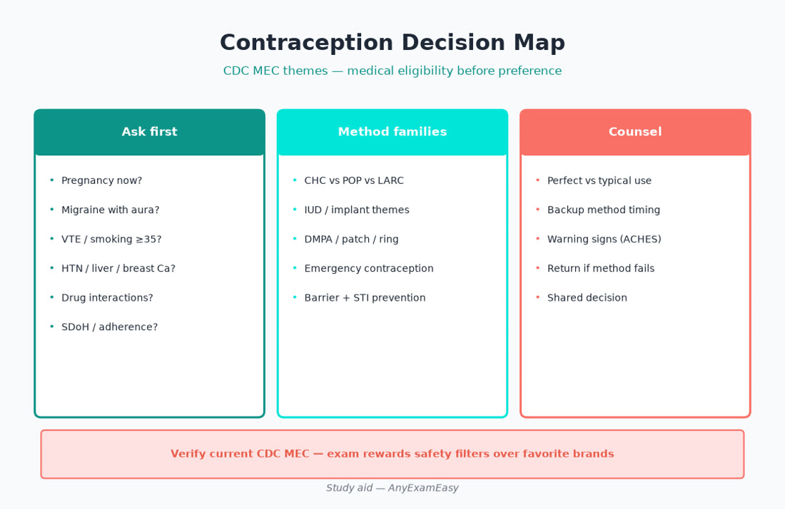
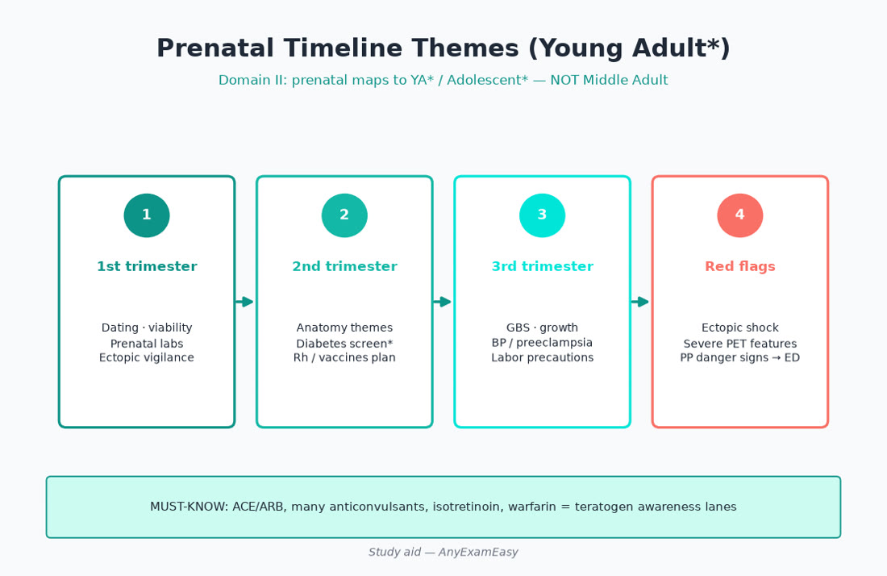
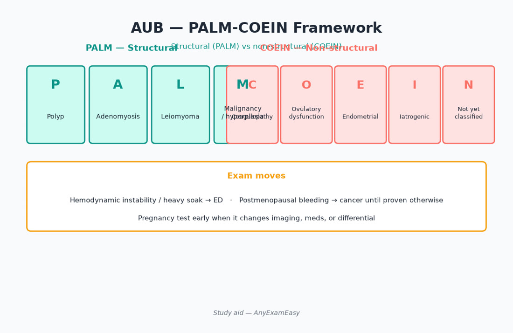
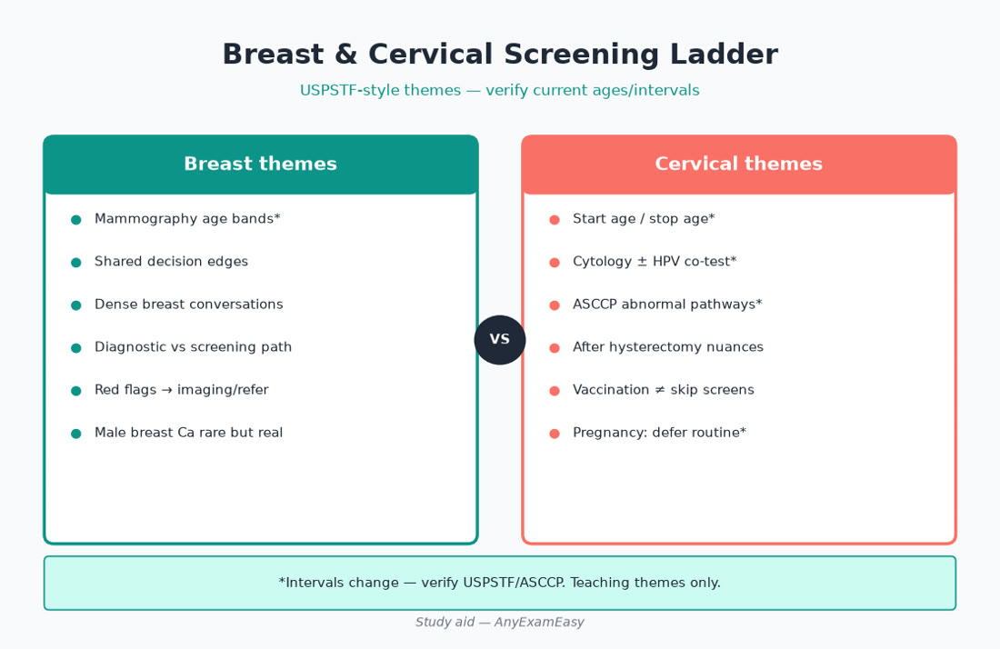

# Chapter 9 — Women’s Health

> **Study aid only.** Guideline themes for primary-care FNP exam judgment — not individualized prescribing or a protocol. Verify current CDC MEC, USPSTF, ACOG-aligned prenatal themes, STI treatment guidance, FDA labeling, and the AANPCB Candidate Handbook. When drugs or intervals appear below, treat them as **teaching themes to verify**, not standing orders.

---

> **MUST KNOW** — Pregnancy test early when it changes imaging, hormones, or disposition. Ectopic and PID toxicity leave the clinic.

> **HIGHLIGHT** — Young Adult* includes **prenatal** on AANPCB — do not skip Ob basics.

> **TRAP** — Combined hormonal contraception with migraine with aura, or ACEI/ARB in pregnancy.

> **LIFESPAN** — Adolescents need confidential care themes; midlife AUB needs cancer risk thinking; older adults still need breast/cervical decisions by life expectancy.

#### Critical checklist — open this chapter
- [ ] I can name ectopic / PID / postpartum preeclampsia red flags
- [ ] I can apply MEC-style contraception matching (aura, smoking ≥35, VTE)
- [ ] I will pair reading with practice questions

---

## Why this chapter matters

Women’s health is not a “niche elective” on AANPCB — it is everyday primary care scored across Domain I (**Assess 32%, Diagnose 26.5%, Plan 26.5%, Evaluate 15%**) and Domain II age bands, with **Young Adult\*** carrying prenatal content. Expect stems on contraception counseling, STI syndromes, PCOS, abnormal uterine bleeding (AUB), menopause, breast/cervical screening conversations, and pregnancy red flags (ectopic, teratogens, hypertensive disorders).

Candidates who memorize pill brands without medical-eligibility thinking lose easy points. Candidates who send unilateral first-trimester pain home without an ectopic plan lose dangerous ones.

**Pair with practice:** After each topic, run related items, review every miss, and tag your error log with age band + ADPE stage. Soft start: [anyexameasy.com](https://anyexameasy.com) ($27.99/mo after trial; trial terms on site).

---

## ADPE lens for women’s health

| Domain I process | What it looks like in women’s-health stems |
| --- | --- |
| **Assess (32%)** | LMP/pregnancy intention, bleeding pattern, pelvic/abd exam when indicated, STI risk, migraine/aura, smoking, VTE/HTN history, meds (teratogens), SDoH (pharmacy, confidentiality, IPV), postpartum status |
| **Diagnose (26.5%)** | Pregnancy location viability themes; PID vs UTI vs appendicitis; AUB structural vs ovulatory; PCOS vs other hyperandrogenism; menopause vs thyroid; screening result triage |
| **Plan (26.5%)** | MEC-matched contraception; dual protection; STI treat + partners; prenatal labs/vaccines themes; HRT eligibility shared decision; refer/ED timing |
| **Evaluate (15%)** | Bleeding expectations on new method; test-of-cure when indicated; Rhogam follow-through; Pap/HPV recall systems; HRT symptom response + risk revisit |

**Red-flag filter first:** hemodynamic instability from bleeding, peritoneal signs, pregnancy + unilateral pain/spotting, fever + cervical motion tenderness with toxicity, severe HA/visual/RUQ in pregnancy or postpartum → disposition before clever outpatient titration.

---

## Topic A — Contraception counseling (MEC-style matching)

### Presentation & job of the visit

Patient requests a method, postpartum method timing, emergency contraception, or “I’m done with pills.” Your job is **pregnancy intention first**, then medical eligibility, then preference, then teach-back — not pushing one brand.

### Assess — ask before you prescribe

- Pregnancy already? Need exclusion when starting selected methods (verify Quick Start rules).  
- Migraine **with aura**? Smoking and age ≥35? VTE, thrombophilia, uncontrolled HTN, migraine with aura, breast cancer history, liver disease — classic combined-hormonal restriction themes.  
- Postpartum / breastfeeding timing (estrogen timing differs — verify).  
- Adherence reality, confidentiality (adolescents), cost, desire for amenorrhea vs regular bleeds.  
- STI risk → condoms even with LARC.

### Method themes (verify CDC MEC categories)

| Method themes | Strengths | Watch / counsel |
| --- | --- | --- |
| LNG-IUD / Cu-IUD | Highest typical-use effectiveness; Cu is hormone-free | Insertion risks; Cu may increase menses/cramps; infection timing themes |
| Implant | Set-and-forget | Irregular bleeding common — set expectations |
| DMPA | Private; no daily task | Bleeding changes; bone-density themes with prolonged use — verify counseling |
| Combined pill / patch / ring | Cycle control; acne benefit themes | **Estrogen contraindications**; patch adherence/detachment; VTE teaching |
| Progestin-only pill | Lactation-friendly themes; estrogen-sparing | Timing adherence for some formulations |
| Barrier / fertility awareness | No hormones | Higher typical-use failure — honest counseling |
| Emergency contraception | Time-sensitive; nonjudgmental offer | Not ongoing contraception; discuss ongoing method |

> **MUST KNOW** — Migraine **with aura** → avoid combined estrogen methods (MEC-style). Offer progestin-only or LARC.

> **TRAP** — Starting combined pill in smoker ≥35 without risk conversation; forgetting backup method teaching after Quick Start.

> **LIFESPAN** — Adolescents: confidential care + dual protection. Postpartum: estrogen timing and VTE risk window. Perimenopause: contraception until menopause criteria met — don’t assume “too old for pregnancy.”

### Plan & Evaluate

Shared decision + teach missed-pill / patch / ring rules (verify). Return for problematic bleeding after expected adjustment window. Revisit method when migraine phenotype, smoking, or BP changes.

#### Critical checklist — contraception
- [ ] Pregnancy intention + exclusion when needed  
- [ ] Aura / smoking≥35 / VTE / HTN scanned  
- [ ] Dual protection if STI risk  
- [ ] Backup method teaching  
- [ ] Follow-up for bleeding expectations  

---

## Topic B — STI syndromes (including PID)

### Takeaway

**Screen by risk and guideline age themes; treat patient + partners; keep HIV/syphilis/hepatitis on the board when indicated.**

### Syndromes map

| Syndrome | Think | Plan vibe |
| --- | --- | --- |
| Cervicitis / urethritis | GC/CT (± M. genitalium awareness) | NAAT; treat per CDC themes; partner therapy concepts where legal |
| Vaginal discharge | BV, candida, trich | Exam + tests — don’t guess forever |
| Genital ulcers | HSV vs syphilis (± rare others) | Dark-field/serology pathways; don’t miss syphilis |
| PID | Lower abd pain + CMT/adnexal tenderness ± fever | Prompt therapy; **ED if abscess/toxic/pregnancy uncertain instability** |
| PrEP / HIV | Risk assessment | Offer prevention themes; test before PrEP |

### Red flags → acute care

Toxic appearance, inability to tolerate oral therapy, TOA suspicion, pregnancy with PID picture, severe pain/peritonitis.

> **MUST KNOW** — Suspected PID with toxicity / TOA concern → acute care pathway — infertility and sepsis risk are real.

> **HIGHLIGHT** — Expedited partner therapy concepts where legal; treat trichomoniasis partners; retest GC/CT at interval per guidance after treatment in selected groups.

> **TRAP** — Treating “UTI” repeatedly when the real story is cervicitis/PID; ignoring syphilis in ulcer differentials.

### Lifespan / SDoH

Adolescents and YA*: confidentiality + vaccine (HPV) bridge. Pregnancy changes drug choices and urgency. IPV screening when STI or injuries raise concern — safety first.

#### Critical checklist — STI
- [ ] Right tests ordered (not culture-only nostalgia)  
- [ ] Partners addressed  
- [ ] HIV/syphilis considered when fitting  
- [ ] PID disposition correct  
- [ ] Retest / PrEP offered when indicated  

---

## Topic C — PCOS

### Takeaway

**Oligo-ovulation + clinical/biochemical hyperandrogenism (± polycystic ovary morphology) — counsel metabolic and endometrial risk; therapy follows goals (cycle, androgen symptoms, fertility, metabolic).**

### Assess

Cycle history, hirsutism/acne, weight trajectory, acanthosis, BP, mood, fertility intentions, family diabetes. Exclude pregnancy. Look for red-flag “not PCOS”: virilization rapid, cushingoid, galactorrhea, thyroid symptoms.

### Diagnose differentials

PCOS · thyroid · hyperprolactinemia · CAH nonclassic · androgen-secreting tumor (rapid virilization) · Cushing · meds.

### Workup themes (verify)

Pregnancy test, TSH, prolactin when indicated, androgen panel when hyperandrogenism unclear, 17-OHP if CAH on board, A1c/glucose, lipids. Ultrasound when needed for morphology or AUB structure — not mandatory for every classic phenotype (guidance nuance — verify).

### Plan themes

Lifestyle is first-line metabolic therapy. Combined hormonal contraception often used for cycle control/androgen symptoms **if MEC-eligible**. Progestin exposure protects endometrium in anovulation. Metformin themes for metabolic/insulin resistance selected cases. Spironolactone for hirsutism with pregnancy prevention. Fertility → letrozole/specialty pathways — don’t endless clomiphene folklore without referral when needed.

> **MUST KNOW** — Chronic anovulation without progestin protection → endometrial hyperplasia/cancer risk awareness.

> **TRAP** — Labeling every irregular cycle “PCOS” without excluding pregnancy/thyroid/prolactin when indicated.

> **LIFESPAN** — Adolescents: careful labeling; Midlife: AUB cancer risk rises — don’t forever call it PCOS without evaluation.

---

## Topic D — Abnormal uterine bleeding (AUB)

### Takeaway

**PALM-COEIN structures causes; rule out pregnancy and hemodynamic instability first; age changes cancer pretest probability.**

### Assess

Volume (pad/tampon counts, clots, flooding), timing (intermenstrual, postcoital, postmenopausal), pain, anemia symptoms, meds (anticoagulants), sexual activity, pap history.

### Red flags

Soaking through protection hourly, orthostasis/syncope, postpartum hemorrhage themes, postmenopausal bleeding (cancer until evaluated), pregnancy + bleeding (ectopic/SAB lanes).

### PALM-COEIN (memory frame)

| PALM (structural) | COEIN (nonstructural) |
| --- | --- |
| Polyp | Coagulopathy |
| Adenomyosis | Ovulatory dysfunction |
| Leiomyoma | Endometrial |
| Malignancy/hyperplasia | Iatrogenic |
| | Not otherwise classified |

### Workup themes

Pregnancy test always when possible. CBC for anemia. TSH when fitting. Pelvic exam ± STI tests. Ultrasound for structural. Endometrial sampling when age/risk warrant (persistent AUB, failed medical therapy, postmenopausal bleeding pathways — verify thresholds). Coag workup in adolescents with heavy menses from menarche.

### Plan themes

Acute heavy bleed with instability → ED. Stable: hormonal regulation themes (combined or progestin), TXA awareness in selected acute heavy menses (verify), iron repletion, treat cause (fibroid referral, polyp removal, etc.).

> **MUST KNOW** — Pregnancy test before hormones/imaging assumptions for reproductive-age AUB.

> **HIGHLIGHT** — Postmenopausal bleeding is never “just hormones” without evaluation.

---

## Topic E — Menopause & midlife symptoms

### Takeaway

**Vasomotor and genitourinary syndrome of menopause (GSM) are treatable; systemic MHT eligibility is timing- and risk-based — verify, don’t dogma.**

### Assess

Last menstrual period, hot flashes, sleep, mood, vaginal dryness/dyspareunia, fracture risk, CVD risk, breast/endometrial cancer history, clotting history, smoking.

### Plan themes

Nonhormonal options for vasomotor (behavioral, selected nonhormonal meds — verify). Systemic MHT for appropriate candidates within shared decision (timing hypothesis themes — younger/recent menopause generally more favorable than starting late with high ASCVD risk — verify current). **Vaginal estrogen** for GSM often local with minimal systemic themes — still counsel. Bone health, CVD prevention, cancer screening up to date.

> **TRAP** — Refusing vaginal estrogen for GSM because “hormones cause cancer” without nuance — local therapy differs from systemic risk conversations.

> **LIFESPAN** — Older Adult: deprescribe systemic MHT when risks outweigh; continue GSM care and osteoporosis attention.

---

## Topic F — Prenatal basics (Young Adult*) & teratogen awareness

### Takeaway

**Prenatal content is mapped into Young Adult* — dating, core labs, vaccines, GDM screen timing, and red flags are exam-eligible.**

### Each-visit / early care themes

| Theme | Hooks |
| --- | --- |
| Dating & viability | Early US when indicated; confirm IUP location |
| Core labs | Type/Rh, anemia, infections (HIV, syphilis, hep B themes), urine — verify panel |
| Visits | BP, weight, symptom screen, fetal heart when applicable |
| GDM screen | Mid-pregnancy timing themes (earlier if high risk) |
| Vaccines | Influenza, Tdap timing, RSV themes as current ACIP — verify |
| Rh | Anti-D immunoglobulin themes when indicated |
| Nutrition | Prenatal vitamin/folate; food safety; substance counseling |

### Teratogen / drug safety (primary-care ownership)

| Avoid / extreme caution themes | Why it shows up |
| --- | --- |
| ACEI / ARB | Fetal renal toxicity / teratogenicity themes — **stop and switch** with Ob |
| Isotretinoin / many antiepileptics / warfarin / methotrexate | High-stakes teratogens — specialty + contraception |
| Tetracyclines / fluoroquinolones (selected) | Prefer pregnancy-safer abx — verify |
| NSAIDs (later pregnancy themes) | Verify timing cautions |
| Uncontrolled alcohol / tobacco / illicit drugs | Screen and counsel every prenatal contact |

> **MUST KNOW** — ACEI/ARB exposure in pregnancy → immediate regimen change + Ob coordination — not “finish the bottle.”

### Pregnancy red flags → ED / L&D pathway

- Unilateral pain + spotting + positive test → **ectopic until evaluated**  
- Heavy bleeding / hypotension  
- Severe HA, visual changes, RUQ pain, severe HTN → preeclampsia spectrum  
- Fluid leak, decreased fetal movement, contractions preterm  
- Fever with pyelo picture  

> **LIFESPAN** — **Postpartum preeclampsia** can declare after discharge — severe HA/HTN after delivery is not “just tired mom.”

#### Critical checklist — prenatal
- [ ] IUP location considered when bleeding/pain  
- [ ] Teratogen meds reconciled  
- [ ] Vaccines timed  
- [ ] BP emergency features dispositioned  
- [ ] Postpartum warning signs taught  

---

## Topic G — Breast & cervical screening themes

### Cervical

HPV-based / cytology strategies per age (verify current USPSTF/ASCCP-aligned intervals). Don’t over-screen low-risk after hysterectomy for benign disease without cervix. Abnormal results → ASCCP-aligned pathways — know when colposcopy referral is expected.

### Breast

Shared decision mammography start age themes; don’t ignore palpable mass regardless of last mammogram (“imaging negative” does not erase a dominant mass — refer). BRCA/risk models when family history stacks — genetic counseling referral themes.

> **HIGHLIGHT** — Screening intervals are preference- and evidence-sensitive — document shared decisions; follow abnormal results to closure (Evaluate).

> **TRAP** — Reassuring a breast lump because “mammogram last year was fine.”

---

## Clinical vignette 1 — Combined pill request with migraine with aura

**Stem:** 27-year-old wants “the pill” for contraception and lighter periods. Migraine with visual aura since teens; nonsmoker; BP 118/70; no VTE history. Sexually active with one partner; inconsistent condoms.

### Assess
- MEC contraindications: **aura** is the key. Pregnancy intention and STI risk. Preference for bleeding pattern. Young Adult\* band.

### Diagnose
- Combined hormonal estrogen methods are not preferred (MEC-style restriction themes). Pregnancy not suspected today.

### Plan
- Offer progestin-only methods and LARC (IUD/implant) with counseling on bleeding patterns. Dual protection discussion. Emergency contraception information. Migraine specialty/primary management separate.

### Evaluate
- Follow-up for method satisfaction and migraine pattern; BP monitoring if any hormonal method started; Pap/HPV age-appropriate schedule.

### Why distractors fail
- “Start ethinyl estradiol combined OCP because she’s young and nonsmoking” — **aura overrides**.  
- “Refuse all contraception” — wrong; many safe options exist.  
- “Copper IUD only option ever” — valid offer, not the only one.  
- “Ignore STI prevention because monogamous by report” — still counsel.

---

## Clinical vignette 2 — First-trimester bleeding & unilateral pain

**Stem:** 29-year-old, LMP 7 weeks ago, spotting, unilateral lower quadrant pain. BP 100/60, HR 98. Positive urine hCG in clinic. No prior US this pregnancy.

### Assess
- Stability borderline; ectopic risk high. Rh status unknown. Prior ectopic/PID/tubal surgery? Young Adult\* prenatal mapping.

### Diagnose
- Threatened SAB vs ectopic vs early IUP — **cannot exclude ectopic in clinic without pathway**.

### Plan
- Urgent quantitative hCG + urgent ultrasound / Ob-ED pathway today — do not send home with “rest and repeat urine tomorrow” alone. Rhogam if Rh-negative per guidance once status known. NPO if surgical risk.

### Evaluate
- Confirm follow-through; serial hCG/US ownership; return precautions for syncope/heavy bleed/shoulder pain.

### Why distractors fail
- “Probable miscarriage — expectant home care without imaging.”  
- “Treat UTI empirically for pelvic pain.”  
- “Schedule routine OB intake in 2 weeks.”  
- “Start progesterone without locating pregnancy.”

---

## Clinical vignette 3 — Perimenopause heavy bleeding with anemia

**Stem:** 48-year-old soaking pads, dizzy, Hb 8.9, HR 104, BP 108/70 seated. Cycles irregular 18 months. Last Pap 4 years ago; never had endometrial sampling. Pregnancy test negative.

### Assess
- Symptomatic anemia; volume status; structural vs hyperplasia risk at this age; cancer risk; Middle Adult\* band.

### Diagnose
- Symptomatic AUB with anemia — not “normal perimenopause” reassurance alone. Structural disease and endometrial pathology on the board.

### Plan
- If unstable or ongoing flooding → ED for acute management. If stabilizable: iron therapy, ultrasound, endometrial evaluation per age/risk, hormonal regulation themes, GYN referral as needed. Update cervical screening.

### Evaluate
- Hb response; pathology results closure; contraception if still at risk for pregnancy; transition to menopause counseling when appropriate.

### Why distractors fail
- “It’s perimenopause — no workup.”  
- “Start combined HRT without evaluation of heavy bleeding cause.”  
- “Only iron and follow up in 6 months without structural/endometrial plan.”  
- “Assume fibroids without imaging or sampling when indicated.”

---

## Exam traps / common miss patterns

| Trap | What to do instead |
| --- | --- |
| Combined OCP despite migraine with aura | Progestin-only / LARC |
| ACEI/ARB continued in pregnancy | Stop/switch + Ob |
| First-trimester unilateral pain home without ectopic plan | Urgent hCG/US pathway |
| Postmenopausal bleeding = “hormones” | Evaluate for cancer |
| Treating ASB logic in nonpregnant UTI chapter confusion | Know pregnancy exception lives in prenatal/UTI |
| Ignoring PID toxicity | ED / imaging / parenteral themes |
| Mammogram last year rules out palpable mass | Refer dominant mass |
| No partner treatment for STI | Partner strategy + retest themes |
| Starting estrogen too early postpartum when VTE risk high | Verify timing |
| Eternal irregular menses labeled PCOS without endometrial protection | Protect endometrium / evaluate |

---

## Quick checklist — women’s health

- [ ] Pregnancy test when it changes management  
- [ ] MEC-style scan: aura, smoking≥35, VTE, HTN  
- [ ] Dual protection / STI prevention discussed  
- [ ] PID / ectopic / postpartum preeclampsia disposition correct  
- [ ] PALM-COEIN + pregnancy ruled out for AUB  
- [ ] PCOS metabolic + endometrial risk addressed  
- [ ] Prenatal labs/vaccines/teratogen reconciliation themes  
- [ ] ACEI/ARB never continued in pregnancy  
- [ ] Breast mass ≠ “normal imaging last year”  
- [ ] Cervical screening recalls closed (Evaluate)  
- [ ] SDoH: confidentiality, cost, IPV safety  
- [ ] Teach-back on method use and return precautions  

---

## Remember this

- Domain II: prenatal lives inside **Young Adult\*** — study it on purpose.  
- ADPE order: stability and can’t-miss pregnancy complications before clever hormone titration.  
- Teaching doses/intervals change — verify CDC/USPSTF/ACOG-aligned sources and labels.  
- Independent study aid — not AANPCB/AANP; no pass guarantee.

**Next practice move:** Drill contraception MEC, STI/PID, AUB/PCOS, prenatal red flags, and screening items with full rationale review on [AnyExamEasy](https://anyexameasy.com) — start free; $27.99/mo after trial (trial terms on site).

---

## Topic H — Pelvic pain differentials (primary-care board)

| Cue | Can’t-miss / common lanes |
| --- | --- |
| +hCG + unilateral pain | Ectopic |
| Fever + CMT | PID / TOA |
| Midcycle sudden pain | Ruptured cyst vs torsion themes |
| Dysmenorrhea progressive | Endometriosis awareness → GYN |
| Postmenopausal pain + bleeding | Cancer pathway |
| +GI symptoms | Appendicitis / diverticulitis age-based |

Always pregnancy test when possible. Torsion and ectopic are time-sensitive.

---

## Topic I — Intimate partner violence & confidentiality (Plan/Assess gold)

Assess privately when safe. Document injuries. Offer resources without forcing disclosure in unsafe moments. Adolescent confidentiality themes for sexual health with mandated-reporting boundaries (know local rules conceptually). Contraception access and STI care may be the visit’s hidden agenda — create a safe opening.

> **HIGHLIGHT** — A “routine GYN” stem can be an IPV Assess item — listen for control, fear, unexplained injuries.

---

## Critical callouts — women’s health (scan tonight)

> **MUST KNOW** — Ectopic instability / toxic PID / postpartum preeclampsia features → ED/L&D.

> **MUST KNOW** — Migraine with aura → no combined estrogen contraception.

> **MUST KNOW** — ACEI/ARB hard no in pregnancy.

> **HIGHLIGHT** — Postmenopausal bleeding needs evaluation; anovulation needs endometrial protection thinking.

> **TRAP** — Reassuring first-trimester unilateral pain; ignoring partners in STI care.

> **LIFESPAN** — YA* prenatal; adolescent confidentiality; midlife cancer risk in AUB.

#### Critical checklist — women’s health tonight
- [ ] MEC matching  
- [ ] Ectopic/PID/preeclampsia red flags  
- [ ] AUB pregnancy + PALM-COEIN  
- [ ] Screening follow-through  

---

## Counseling scripts that map to Plan items

- “Because you get migraine with aura, estrogen birth control raises stroke risk talk — let’s pick a safer highly effective option.”  
- “Spotting and one-sided pain in early pregnancy needs same-day evaluation to rule out ectopic.”  
- “If your partner isn’t treated, your STI can come right back — here’s how we handle partners.”  
- “Heavy periods that make you dizzy need labs and a cause workup — not only ‘you’re getting older.’”  
- “After delivery, a sudden severe headache with high blood pressure is an emergency — don’t wait for your six-week visit.”  
- “A breast lump still needs evaluation even if last year’s mammogram was normal.”

Teach-back beats pamphlet drops — Domain I Plan loves clear education plus return precautions.

---

## Concept checks

**1.** Best contraception Plan for migraine with aura?  
A. Combined ethinyl estradiol pill  B. Progestin-only or LARC themes  C. No contraception allowed  D. Estrogen patch preferred  
**Answer:** B.

**2.** Positive hCG, unilateral pain, spotting — priority?  
A. Routine OB intake in 3 weeks  B. Urgent ectopic evaluation pathway  C. Combined OCP start  D. Reassure implantation only  
**Answer:** B.

**3.** Why stop lisinopril when pregnancy confirmed?  
A. Improves milk supply  B. ACEI/ARB fetal toxicity themes  C. No reason  D. Only matters in third trimester  
**Answer:** B.
