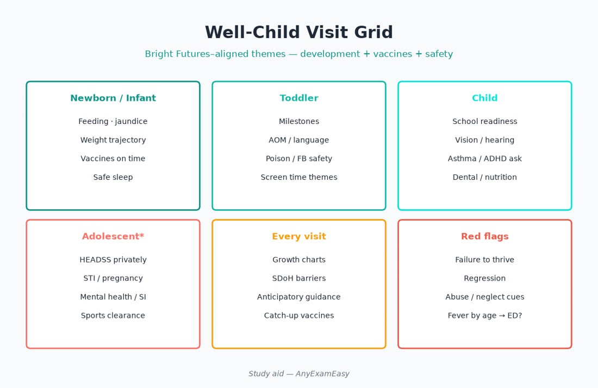
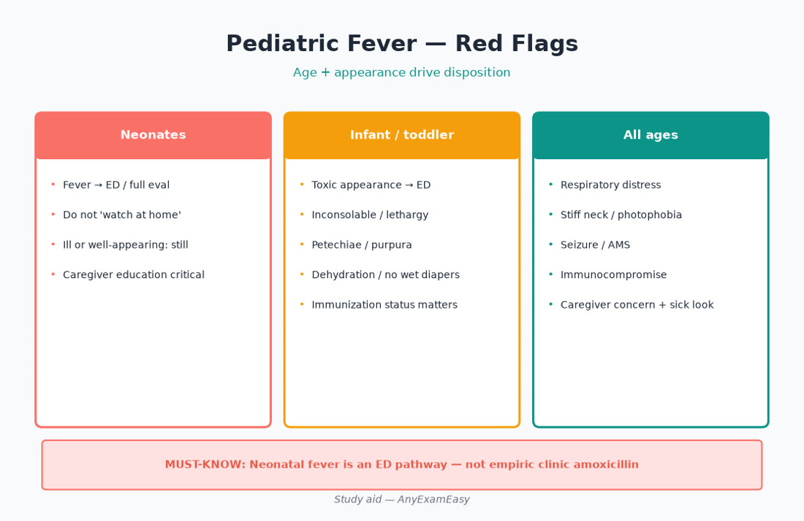
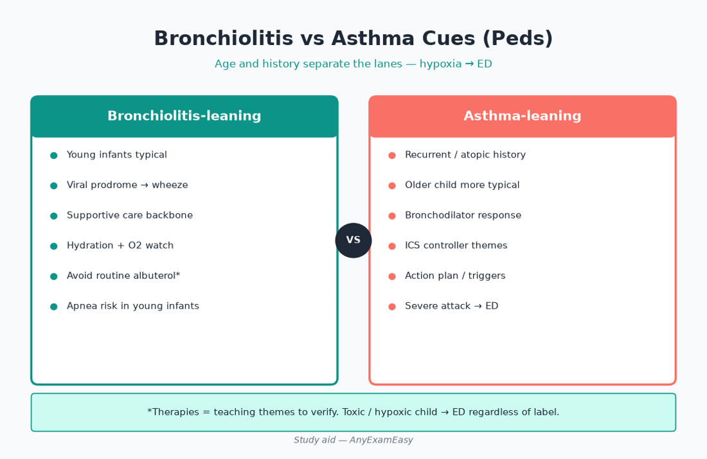
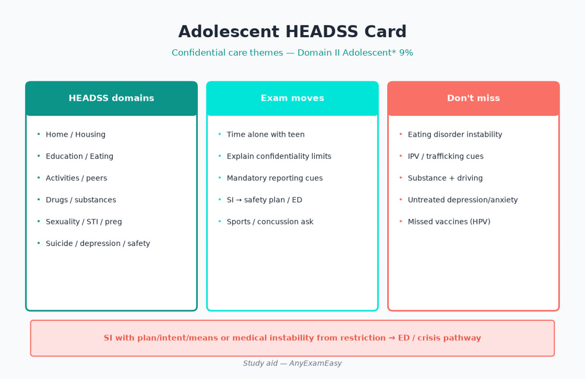

# Chapter 10 — Pediatrics & Lifespan

> **Study aid only.** Pediatric and adolescent primary-care themes for FNP exam judgment — not a protocol. Verify current AAP Bright Futures–aligned well-child themes, ACIP vaccine schedules, otitis/asthma guidance, and drug labels. Teaching themes only. Independent of AANPCB/AANP.

---

> **MUST KNOW** — Neonatal fever is not toddler fever — urgent full evaluation pathway/ED.

> **HIGHLIGHT** — Domain II pediatrics percentages are smaller than Older Adult 30%, but high-regret misses are exam classics.

> **TRAP** — Automatic antibiotics for every red ear; clearing sports with exertional syncope.

> **LIFESPAN** — Adolescent* risk (HEADSS-style), SI, and confidential care are scored content — not optional soft skills.

#### Critical checklist — open this chapter
- [ ] I can disposition fever by age band
- [ ] I know bronchiolitis supportive care vs asthma controller logic
- [ ] I will practice after reading

---

## Why this chapter matters

Newborn through adolescent care is a smaller Domain II slice than middle/older adult — and that is exactly why candidates under-study it. AANPCB still scores **Assess / Diagnose / Plan / Evaluate** (32% / 26.5% / 26.5% / 15%) on well-child visits, fever triage, AOM stewardship, asthma, ADHD, sports clearance, dehydration, bronchiolitis, vaccines, and adolescent risk. Miss a neonate fever disposition or clear an athlete with exertional syncope and you fail the item the way you’d fail the child.

**Pair with practice:** Tag every miss with age band (newborn/infant/child/adolescent*) + ADPE stage. Soft start: [anyexameasy.com](https://anyexameasy.com) ($27.99/mo after trial; trial terms on site).

---

## ADPE lens for pediatrics

| Domain I process | What it looks like in peds stems |
| --- | --- |
| **Assess (32%)** | Appearance (toxic vs well), hydration (tears, urine, fontanelle, CRT), work of breathing, growth chart trajectory, development surveillance, caregiver reliability, vaccine record, HEADDSS privately in teens, cardiac red flags for sports |
| **Diagnose (26.5%)** | Serious bacterial infection risk by age; AOM vs OME; bronchiolitis vs asthma; ADHD vs sleep/anxiety mimics; concussion themes; appendicitis atypical in young |
| **Plan (26.5%)** | Watchful waiting vs abx; supportive RSV care; asthma action plan + spacer; stimulant teaching; hold sports clearance; vaccine catch-up; safety/anticipatory guidance |
| **Evaluate (15%)** | Weight regain after illness; asthma control; ADHD rating scales; vaccine adverse event teaching; return precautions timed to age |

**Red-flag filter first:** neonate fever, infant lethargy/poor perfusion, severe respiratory distress, petechiae/purpura with illness, dehydration with altered mentation, suicidal ideation with plan → ED/safety pathway before clever outpatient plans.

---

## Topic A — Well-child care & development (newborn → adolescent)

### Takeaway

**Every well visit: growth, development, shots, anticipatory guidance, and social determinants — that is Assess + Plan gold.**

### Age-band focus

| Age band | High-yield focus |
| --- | --- |
| Newborn | Feeding (breast/formula intake), jaundice, weight regain, safe sleep (ABC: alone, back, crib), umbilical, red-flag fever, maternal depression screen themes |
| Infant | Milestones, vaccines, reflux vs red flags (bilious emesis, FTT, projectile pyloric themes), iron/fluoride timing themes |
| Toddler/preschool | Language explosion surveillance, autism screen themes, car seats, accidental ingestion, toilet learning without shaming |
| School-age | Vision/hearing, school function, asthma/ADHD screens, bullying, dental |
| Adolescent* | Confidential HEADDSS-style interview, sexual health, substances, mood/SI, sports, driving/safety |

### Growth

Plot length/height, weight, head circumference (infants). Falling off curve → intake, chronic illness, endocrine, malabsorption, neglect/SDoH — don’t shrug a crossed percentile channel without thought.

> **HIGHLIGHT** — Caregiver depression and food insecurity are clinical findings — screen and connect resources.

> **TRAP** — Skipping development surveillance because “they look fine chatting with mom.”

### Anticipatory guidance themes

Safe sleep, choking hazards, water safety, firearm storage, sunscreen, media limits, transition to solid foods, poison control number. Document teaching — Evaluate loves return precautions.

---

## Topic B — Fever red flags by age

### Takeaway

**Age changes pretest probability of serious bacterial infection more than the number on the thermometer alone.**

| Age vibe | Disposition thinking |
| --- | --- |
| Neonate (≤28 days themes) febrile | **ED / protocolized full evaluation** — not “viral and home” |
| Young infant (~1–2–3 months themes) | Low threshold acute eval; follow current febrile infant pathways |
| Older infant/toddler well-appearing | Targeted assessment; viral common; still hydrate and return precautions |
| Any age toxic / petechiae / nuchal / AMS | ED |
| Fever without source + limp / bone pain | Osteo/septic joint on board |
| Kawasaki cues (≥5 days fever + mucocutaneous signs) | Don’t miss — specialty/ED |

> **MUST KNOW** — Fever in a neonate → urgent ED pathway. Caregiver “feels warm” plus ill neonate still counts — measure and act.

> **TRAP** — Treating toddler fever logic in a 2-week-old.

> **LIFESPAN** — Immunocompromised / unvaccinated children: lower reassurance threshold at any age.

### Home teaching (Plan)

Antipyretics for comfort (correct weight-based dosing — verify; never aspirin in viral kids — Reye themes). Hydration. Return for lethargy, poor perfusion, respiratory distress, seizure, fever thresholds per your pathway teaching.

---

## Topic C — Acute otitis media & pharyngitis (stewardship)

### Takeaway

**Many red ears and sore throats do not need antibiotics — age, severity, laterality, and testing drive Plan.**

### AOM themes (verify current AAP-aligned)

| Factor | Thinking |
| --- | --- |
| Accurate diagnosis | Bulging TM, impaired mobility — not just pink TM with crying |
| Treat vs watch | Age + severity + bilateral vs unilateral influence immediate abx vs observation with follow-up — verify |
| First-line abx when treating | Amoxicillin themes when indicated; resistance/recent exposure changes choice — verify |
| OME (effusion without acute infection) | Usually observe; hearing/speech follow-up |

Pain control matters whether or not you prescribe abx.

### Pharyngitis

Viral majority. Centor/McIsaac-style pretest → test when bacterial likely; **avoid abx without support**. Scarlet fever / rheumatic fever prevention themes drive strep treatment when confirmed. Mono awareness if amoxicillin rash risk.

> **TRAP** — Automatic abx for every red ear or every sore throat “because school wants a note.”

> **HIGHLIGHT** — Watchful waiting requires a reliable follow-up plan — SDoH matters.

---

## Topic D — Bronchiolitis & respiratory distress cues

### Takeaway

**Bronchiolitis (often RSV) in infants is supportive care — oxygen/hydration assessment beats albuterol autopilot.**

### Assess

Work of breathing (retractions, grunting, nasal flaring), SpO₂, feeding ability, apnea history in young infants, hydration.

### Plan themes

Suction gently, hydrate, oxygen when indicated, ED if hypoxic/distressed/poor feeding/apnea. Bronchodilators/steroids generally not routine for typical bronchiolitis (verify current). Isolate teaching for caregivers.

Differential: foreign body, pertussis, cardiac, bacterial pneumonia, asthma in older child.

> **MUST KNOW** — Infant with bronchiolitis who cannot feed or is hypoxic → acute care — not “nebs at home and see Monday.”

---

## Topic E — Pediatric asthma

### Takeaway

**Control = daytime/night symptoms, activity limits, rescue frequency, exacerbations — daily albuterol means step-up, not endless refill.**

### Plan themes

Spacer/mask teaching, inhaled corticosteroid-containing controller for persistent disease (verify GINA/NAEPP-aligned), written action plan, trigger counseling, flu vaccine, ED precautions (speaks in words, blue lips, silent chest themes).

> **TRAP** — Refilling albuterol monthly without adding controller thinking.

> **LIFESPAN** — Bridge to adult asthma chapter: same ADPE, different caregiver teaching.

---

## Topic F — ADHD (school-age & adolescent)

### Takeaway

**Multi-setting symptoms + impairment; rating scales (Vanderbilt-style); rule out sleep apnea, hearing, learning disorder, anxiety, trauma mimics.**

### Assess

Home and school input, onset, cardiac history/family sudden death before stimulants, growth, substance risk in adolescents, sleep.

### Plan themes

Behavioral interventions; stimulant/nonstimulant themes with monitoring (appetite, sleep, BP/HR, growth). School accommodations. Reassess diagnosis if “ADHD” appears first time at 17 without history.

> **MUST KNOW** — Cardiac red-flag history before stimulant start — refer when indicated.

> **TRAP** — Diagnosing ADHD from a 10-minute parent complaint without school data.

---

## Topic G — Sports clearance & cardiac red flags

### Takeaway

**Preparticipation exam is a safety screen — not a rubber stamp.**

### Hold clearance / work up

Exertional chest pain, exertional syncope/near-syncope, unexplained dyspnea out of proportion, family sudden cardiac death / cardiomyopathy / long QT themes, abnormal exam (marfanoid, murmur suggestive of obstruction).

Concussion: return-to-play stepwise — no same-day return with suspected concussion.

> **MUST KNOW** — Exertional syncope in athlete → hold sports; ECG/cardiology pathway — not “drink Gatorade and clear.”

---

## Topic H — Adolescent risk (HEADSS-style) & confidentiality

### Takeaway

**Interview the teen privately. Cover Home, Education, Activities, Drugs, Sexuality, Suicide/depression, Safety — conceptually.**

Assess SI every mood stem. Offer contraception/STI care with confidentiality limits explained (harm/abuse reporting). Eating disorder cues (restriction, purging, bradycardia, electrolyte risk) → structured evaluation; unstable → ED.

> **LIFESPAN** — Adolescent* is scored — mental health and risk behavior are not “extra credit.”

> **MUST KNOW** — Active SI with plan/intent or inability to stay safe → emergency/safety pathway.

---

## Topic I — Vaccines (teaching + catch-up mindset)

### Takeaway

**Use current ACIP schedules — do not memorize a frozen year from an old PDF without checking.**

FNP exam loves: true contraindications vs myths (mild illness is usually OK to vaccinate), live vaccine timing themes, Tdap in pregnancy (prenatal bridge), influenza yearly, HPV catch-up, meningococcal age themes, hepatitis B birth dose importance, RSV prevention products as current.

Document refusal with education; revisit. Anaphylaxis preparedness.

> **TRAP** — Delaying all vaccines for mild URI without indication; inventing permanent contraindications from family lore.

> **HIGHLIGHT** — Verify schedules — teaching themes only in this book.

---

## Topic J — Dehydration & gastroenteritis

### Takeaway

**Oral rehydration for mild–moderate; IV/ED for severe, shock, bilious vomiting, surgical abdomen, or failed ORT.**

| Mild | Moderate | Severe |
| --- | --- | --- |
| Slightly dry MM, ↓ urine | Sunken eyes, lethargy, ↑ HR | Shock, AMS, poor perfusion |

ORS teaching beats juice/soda. Ondansetron themes in selected vomiting to enable ORT (verify). Diaper counts matter.

> **MUST KNOW** — Bilious emesis in neonate/infant → ED/surgical evaluation — not ORT and home.

---

## Clinical vignette 1 — 14-day-old with fever 100.8°F

**Stem:** Term neonate, 14 days old, rectal temp 100.8°F, feeding a little less, no cough. Mom had GBS-negative pregnancy. Baby looks quiet but arousable. SpO₂ 98%.

### Assess
- Neonate + documented fever. Hydration, perfusion, tone, rash, fontanelle. Caregiver reliability.

### Diagnose
- Serious bacterial infection / invasive disease risk until evaluated — viral possible but **not a clinic observe lane**.

### Plan
- **ED / hospital protocol pathway now** — do not outpatient “viral and follow up tomorrow.” Later parental teaching on fever and when to return.

### Evaluate
- Ensure ED arrival; post-discharge follow-up; vaccine schedule continuation when appropriate.

### Why distractors fail
- “Acetaminophen and recheck in clinic tomorrow.”  
- “Treat empirically with oral amoxicillin and home.”  
- “It’s only 100.8 — toddlers go higher.”  
- “Blood work in clinic and send home pending cultures.”

---

## Clinical vignette 2 — School-age asthma “refill only”

**Stem:** 8-year-old using albuterol 4–5 days/week, night cough twice weekly, PE gym limits. No ICS. Last “exacerbation” ER visit 2 months ago. Spacer technique never taught.

### Assess
- Poor control markers; technique gap; triggers; adherence; growth/oral thrush risk counseling later.

### Diagnose
- Persistent asthma undertreated — not intermittent.

### Plan
- Start ICS-containing controller themes (verify); spacer teaching with teach-back; written action plan; trigger counseling; follow-up; flu vaccine; ED precautions.

### Evaluate
- Symptom diary / ACT-style check; refill pattern; technique recheck; step-down only when controlled sustained.

### Why distractors fail
- “Refill albuterol only — he’s fine between attacks.”  
- “Oral steroids monthly as controller.”  
- “No action plan needed.”  
- “Stop gym permanently instead of controlling asthma.”

---

## Clinical vignette 3 — 16-year-old sports physical with exertional chest pain

**Stem:** Clearing for soccer. Reports chest pain and near-syncope on sprints. Uncle died suddenly at 34. Exam: II/VI systolic murmur increases with Valsalva (themes). BP normal; resting HR 64.

### Assess
- Cardiac red flags + family SCD. Adolescent* confidential review still for SI/substances separately, but **this visit’s stopper is cardiac**.

### Diagnose
- Not routine clearance — HOCM/arrhythmia lanes on the board until evaluated.

### Plan
- **Hold sports**; ECG + cardiology pathway urgently; do not clear “pending.” Counsel against exertion until cleared.

### Evaluate
- Specialty results before any clearance letter; document hold clearly for school.

### Why distractors fail
- “Clear now, cardiology when convenient in 3 months.”  
- “Anxiety — give note for full play.”  
- “Trial of albuterol before practice.”  
- “Normal resting HR means heart is fine.”

---

## Exam traps / common miss patterns

| Trap | What to do instead |
| --- | --- |
| Toddler fever logic in neonate | ED/protocol |
| Abx for every AOM without criteria | Age/severity/laterality + pain control |
| Albuterol-only persistent asthma | Add controller themes + action plan |
| Clear exertional syncope athlete | Hold + cardiac workup |
| Skip private teen interview | HEADSS-style + SI |
| Invent vaccine contraindications | Use ACIP true contraindications |
| ORT for bilious neonate emesis | ED/surgical lane |
| Diagnose ADHD without school data | Multi-setting assessment |
| Ignore dehydration severity | Stage and disposition |
| Same-day return after concussion | Stepwise RTP |

---

## Quick checklist — pediatrics

- [ ] Appearance + hydration + work of breathing assessed  
- [ ] Fever disposition matched to age  
- [ ] Growth plotted and interpreted  
- [ ] AOM/pharyngitis stewardship applied  
- [ ] Bronchiolitis = supportive; distress → ED  
- [ ] Asthma control stepped appropriately  
- [ ] ADHD multi-setting + cardiac pretest  
- [ ] Sports red flags hold clearance  
- [ ] Adolescent confidential risk + SI  
- [ ] Vaccines verified to current ACIP  
- [ ] Dehydration staged; bilious emesis escalated  
- [ ] Caregiver teach-back + return precautions  

---

## Remember this

- Smaller Domain II % ≠ skippable — high-regret items cluster here.  
- ADPE: toxic appearance and age-based fever rules beat recipe memorization.  
- Verify vaccine schedules and abx durations — they update.  
- Independent study aid — not AANPCB/AANP; no pass guarantee.

**Next practice move:** Drill neonatal fever, AOM stewardship, asthma, sports cardiac screens, and adolescent safety items on [AnyExamEasy](https://anyexameasy.com) — start free; $27.99/mo after trial (trial terms on site).

---

## Anticipatory guidance rapid board (Plan language)

| Age | Say this |
| --- | --- |
| Newborn | Back to sleep; no loose bedding; feed cues; jaundice follow-up |
| 6 months | Starts solids readiness; poison control; baby-proof |
| 1 year | Whole milk themes per guidance; mobility dangers; dental |
| 5 years | School readiness; stranger/fire safety; vision |
| Teen | Seat belts; substance honesty; consent; mood check |

---

## Critical callouts — pediatrics (scan tonight)

> **MUST KNOW** — Neonate fever → ED/protocol. Exertional syncope → hold sports.

> **MUST KNOW** — Bilious emesis in young infant → acute surgical evaluation mindset.

> **HIGHLIGHT** — Persistent asthma needs controller thinking; bronchiolitis is mostly supportive.

> **TRAP** — Abx autopilot for ears/throats; clearing cardiac red-flag athletes.

> **LIFESPAN** — Adolescent* SI and confidential sexual health are exam content.

#### Critical checklist — pediatrics tonight
- [ ] Fever by age  
- [ ] Stewardship ears/throats  
- [ ] Asthma / bronchiolitis lanes  
- [ ] Sports + HEADSS + vaccines verify  

---

## Topic K — Kawasaki, rash-with-fever, and can’t-miss infectious cues

**Takeaway: Prolonged fever plus mucocutaneous changes is not “viral until Monday.”**

Kawasaki disease themes: ≥5 days fever with conjunctival injection, oral changes, extremity edema/erythema, polymorphous rash, cervical nodes — incomplete forms exist (especially infants). Early specialty/ED recognition matters for coronary complications.

Petechiae/purpura with illness → meningococcemia/ITP/other — unstable → ED. Measles/varicella in under-vaccinated communities — isolation + public health thinking.

> **MUST KNOW** — Ill child with purpura fulminans picture → EMS/ED immediately.

---

## Topic L — UTI & fever without source (selected peds)

Febrile infants/young children may have UTI as occult source — culture when indicated by age/guidance. Do not treat every positive bag urine without confirmation strategy. Pyelo can present as fever + vomiting without classic dysuria in toddlers.

---

## Topic M — Developmental red flags & autism surveillance

No babbling/gestures by expected ages, loss of skills, no pointing/joint attention themes — act early: hearing test + developmental referral, don’t “wait and see” forever. Early intervention is Plan gold.

---

## Topic N — Child abuse / neglect recognition (Assess duty)

Inconsistent injury history, patterned bruises, spiral fracture themes in nonambulatory infants, delay in seeking care, failure to thrive with neglected hygiene — report per law; safety first. Medical mimics exist (osteogenesis imperfecta, bleeding disorders) — still protect the child while evaluating.

> **TRAP** — Accepting a changing story for a femoral fracture in a 3-month-old without protective action.

---

## Additional vignette 4 — Bronchiolitis with poor feeding

**Stem:** 4-month-old with 3 days URI, now RR 62, retractions, SpO₂ 89% on RA, wet diapers down to 2/day, refuses bottle.

| ADPE | Move |
| --- | --- |
| Assess | Hypoxia + tachypnea + dehydration risk |
| Diagnose | Bronchiolitis with respiratory failure risk |
| Plan | ED — oxygen/hydration support pathway |
| Evaluate | Later: RSV season teaching, vaccine products as current |

**Why distractors fail:** Home albuterol trial; oral steroids as routine; “send home with bulb syringe only.”

---

## Additional vignette 5 — Adolescent SI on PHQ

**Stem:** 15-year-old well visit. Privately endorses sadness; PHQ-A elevated; passive death wish without plan yesterday; today says “I might take the pills in mom’s drawer if I fail the test Friday.” Has access to bottles at home.

| ADPE | Move |
| --- | --- |
| Assess | SI with method/access + trigger; substances; psychosis; abuse |
| Diagnose | Acute safety risk — not “teen drama” |
| Plan | Emergency/safety pathway; means restriction; urgent MH; do not leave alone with access |
| Evaluate | Follow-up intensity; school coordination with consent; recheck SI |

**Why distractors fail:** “Start SSRI and see in 6 weeks alone”; “Tell parents later”; “Contract for safety as sole plan without means restriction.”

---

## Counseling scripts (Plan)

- “Any fever in the first month of life means we go to the emergency department — even if the baby looks okay to you.”  
- “Pink ear drums with a cold are not always an infection needing antibiotics — we treat pain and decide based on exam.”  
- “Daily rescue inhaler use means we need a daily controller — refills of albuterol alone are not the plan.”  
- “Chest pain or fainting during sprints means no sports until a heart workup says it’s safe.”  
- “What we talk about stays between us unless someone is being hurt or you might be unsafe.”

---

## Concept checks

**1.** Febrile 2-week-old — best Plan?  
A. Home antipyretic and f/u 48h  B. ED/protocol evaluation  C. Oral cefdinir  D. Reassure vaccine fever only without eval  
**Answer:** B.

**2.** Athlete with exertional syncope — next?  
A. Clear for championship  B. Hold sports + cardiac pathway  C. Increase caffeine  D. Iron only and clear  
**Answer:** B.

**3.** Domain I weight for Assess on AANPCB?  
A. 15%  B. 26.5%  C. 32%  D. 30%  
**Answer:** C (Assess 32%; Older Adult is Domain II 30%).

---

## Topic O — Orthopedics lite: limp, nursemaid’s elbow, scoliosis screen

**Limp + fever** → osteomyelitis/septic arthritis until cleared — ED/urgent imaging/ortho. Transient synovitis is a diagnosis of exclusion after serious infection considered. Nursemaid’s elbow (radial head subluxation) after pull injury: classic hold posture; reduction themes when diagnosis clear — verify technique comfort/refer. Scoliosis screening in school-age/adolescents — refer significant curves.

---

## Topic P — Dermatology high-miss in peds

Diaper dermatitis vs candida (satellite lesions). Atopic dermatitis: moisturize first, steroid potency by body site — face/folds careful. Impetigo: topical/oral per extent. Measles/varicella in underimmunized — isolate. Petechiae below the nipple line with illness raise invasive disease concern more than a few superior vena cava distribution petechiae with coughing — still examine carefully.

---

## Integrated teaching: Domain I verbs on a well-child stem

**Assess** growth + development + HEADS privately if teen. **Diagnose** nothing pathological vs defer differential. **Plan** vaccines per current ACIP + anticipatory guidance. **Evaluate** prior concerns closed (anemia recheck, hearing f/u). That single visit can hit all four process weights — practice labeling them aloud.

---

## Remember this — Domain II math vs regret

Older Adult is ~30% of Domain II — study it heavily elsewhere — but neonatal fever, bronchiolitis hypoxia, and adolescent SI are high-regret misses. A smart study plan still schedules deliberate pediatrics blocks weekly.

**Official process weights reminder:** Assess 32%, Diagnose 26.5%, Plan 26.5%, Evaluate 15%.
