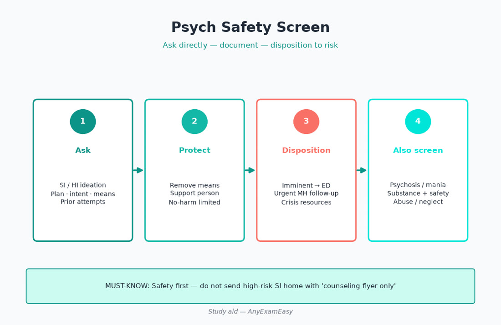
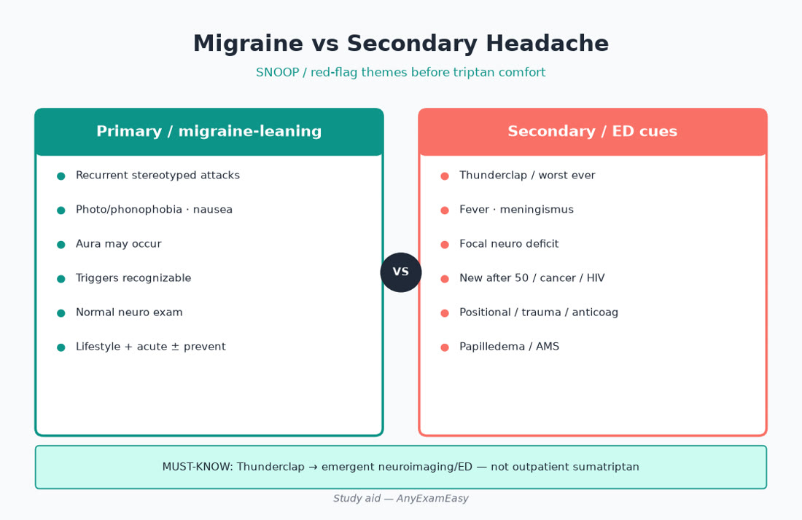
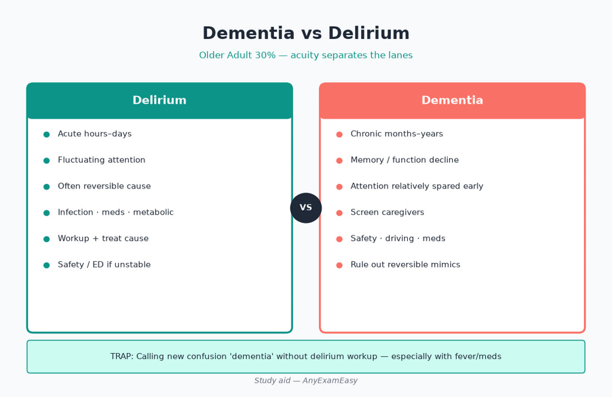
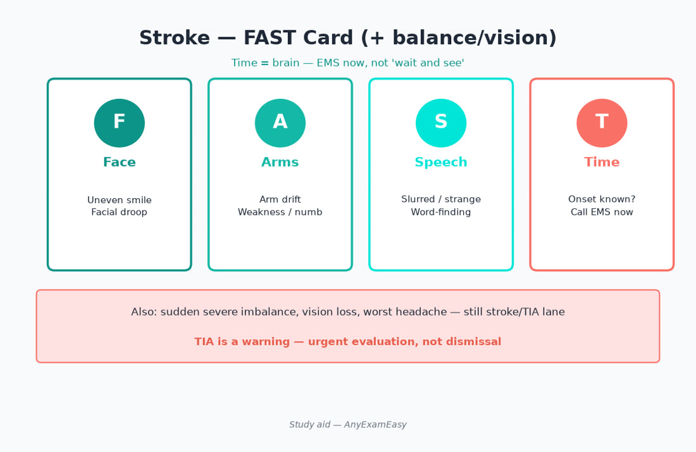
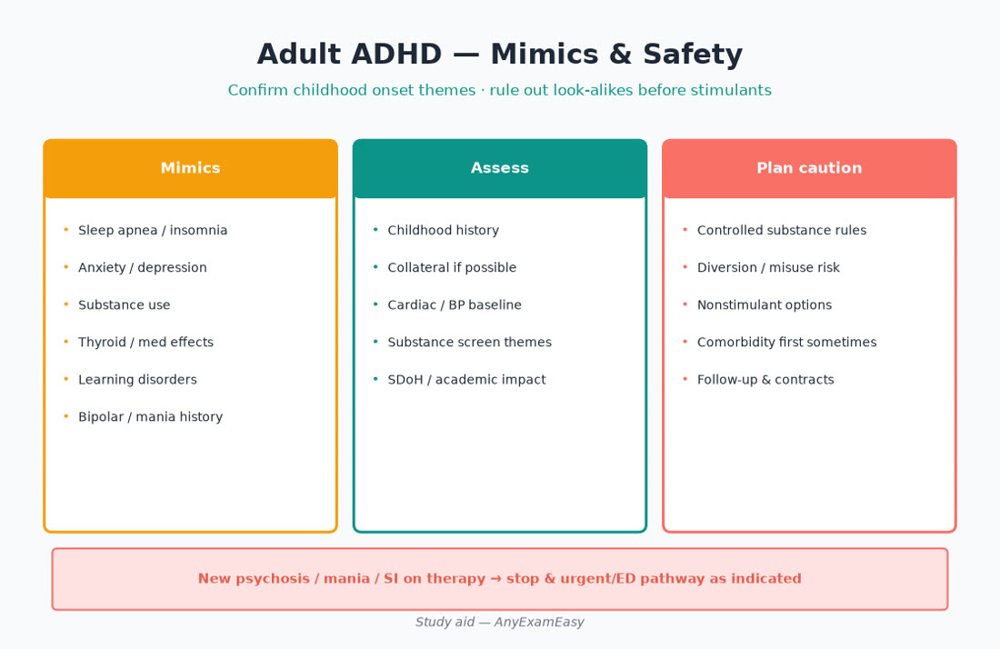

# Chapter 11 — Psych / Neuro

> **Study aid only.** Mental health and neurologic themes for FNP exam judgment — not psychotherapy protocol or stroke-center standing orders. Verify current guidelines, FDA labeling (including boxed warnings), and local crisis pathways. Independent of AANPCB/AANP.

---

> **MUST KNOW** — Active suicidal plan/intent or inability to stay safe → emergency pathway. Do not leave alone with access to means — not “follow up in 6 weeks.”

> **HIGHLIGHT** — Older Adult is ~**30%** of Domain II: delirium, dementia, stroke/TIA, and SSRI hyponatremia live here.

> **TRAP** — Starting antidepressant monotherapy without mania screen; calling thunderclap headache “migraine.”

> **LIFESPAN** — Adolescent* depression needs safety intensity; prenatal mood disorders need Ob-aware prescribing.

#### Critical checklist — open this chapter
- [ ] I can run SI assessment out loud
- [ ] I can separate migraine vs SNOOP secondary headache
- [ ] I know delirium ≠ dementia on Older Adult stems

---

## Why this chapter matters

Depression, anxiety, bipolar cues, migraine, TIA/stroke, and dementia/delirium sit at the center of middle- and older-adult primary care — and Older Adult is roughly **30%** of AANPCB Domain II. Domain I still grades the verb: Did you **Assess** safety and neuro deficits? **Diagnose** unipolar vs bipolar cues and primary vs secondary headache? **Plan** therapy + meds + EMS when needed? **Evaluate** worsening SI, sodium in elders on SSRIs, and cognition trends?

Candidates who prescribe sertraline without asking about mania or suicide lose points. Candidates who send thunderclap headache home with sumatriptan lose dangerous ones.

**Pair with practice:** Tag misses with age band + ADPE. Soft start: [anyexameasy.com](https://anyexameasy.com) ($27.99/mo after trial; trial terms on site).

---

## ADPE lens for psych / neuro

| Domain I process | What it looks like in stems |
| --- | --- |
| **Assess (32%)** | PHQ/GAD themes, SI/HI/means/access, mania cues, substance, sleep, trauma, neuro exam (focal deficits, mentation), meds (anticholinergics, benzos, opioids), fall risk, SDoH, pregnancy |
| **Diagnose (26.5%)** | MDD vs bipolar vs adjustment; GAD/panic vs medical mimics; migraine vs secondary HA; TIA vs migraine aura vs seizure; delirium vs dementia vs depression (pseudo-dementia themes) |
| **Plan (26.5%)** | Safety planning / ED; psychotherapy referral; SSRI/SNRI themes; avoid benzo-first chronic anxiety; EMS for stroke; treat reversible delirium causes |
| **Evaluate (15%)** | Early follow-up after antidepressant start/escalation; Na in older adults; cognition trend; migraine days / med overuse; secondary prevention after TIA |

**Red-flag filter first:** SI with plan/intent, psychosis with danger, thunderclap HA, acute focal neuro deficit, meningismus with fever, status seizure themes, sudden AMS → emergency pathway before clever outpatient titration.

---

## Topic A — Depression & anxiety (primary-care core)

### Takeaway

**Screen, assess safety, offer psychotherapy, start evidence meds when appropriate, follow closely — especially after initiation.**

### Assess

PHQ-2/9, GAD-7 themes. **Ask SI out loud** — ideation, plan, intent, means, protective factors, prior attempts. Mania history before antidepressant. Substance use. Medical mimics: TSH, anemia, B12, sleep apnea, meds, grief. Trauma screen when fitting.

### Diagnose lanes

MDD · persistent depressive · adjustment · bipolar depression · seasonal themes · PMDD · medical/substance-induced.

### Plan themes (verify labels/guidelines)

| Tool | Pearl |
| --- | --- |
| Psychotherapy | First-line alone or with meds — CBT/IPT themes; don’t medicate-only forever |
| SSRI/SNRI | Common primary-care starts; start low in older adults; counsel activation/SI monitoring |
| Bupropion | Seizure/eating disorder cautions; less sexual SE themes |
| Mirtazapine | Appetite/sleep themes — useful selected elders; sedation |
| Benzodiazepines | Short acute bridge sometimes — **not chronic anxiety first-line**; fall/dependence risk in elders |
| Buspirone / hydroxyzine | Selected adjuncts — verify |

Pregnancy / lactation: specialty-aware choices — untreated depression also harms; don’t abruptly stop without plan.

### Evaluate

Follow up within **1–2 weeks** themes after start/escalation (especially youth). Watch worsening SI, agitation, serotonin risk stacks, hyponatremia in elders (SSRIs), sexual SE adherence, therapeutic trial length before declaring failure.

> **MUST KNOW** — Ask SI; document; escalate when unsafe.

> **TRAP** — Antidepressant without mania screen; benzo as sole long-term Plan; 6-week silent follow-up after starting SSRI in a teen.

> **LIFESPAN** — Adolescent*: boxed warning awareness + close follow-up — still treat; untreated depression is dangerous. Older Adult: hypoNa, falls, interactions; start low/go slow.

#### Critical checklist — depression/anxiety
- [ ] SI assessed with means/access  
- [ ] Mania cues asked  
- [ ] Therapy offered  
- [ ] Follow-up timed early after start  
- [ ] Substance + medical mimics considered  
- [ ] Older adult Na/fall risk considered  

---

## Topic B — Bipolar cues & psychosis awareness

### Takeaway

**Decreased need for sleep + grandiosity + pressured speech + reckless behavior → pause before SSRI monotherapy.**

### Assess

Family bipolar history, prior antidepressant-induced mania, substance (stimulants, cocaine), postpartum psychosis risk themes (YA*).

### Plan

Acute mania/psychosis with danger → **ED**. Mood stabilizer/antipsychotic management often specialty — know your scope and refer early. Sleep restoration and substance cessation matter.

> **MUST KNOW** — Dangerous mania/psychosis → emergency pathway.

> **TRAP** — High-dose SSRI for “treatment-resistant depression” that is actually bipolar depression.

---

## Topic C — Adult ADHD

### Takeaway

**Childhood-onset themes help; adults present with organization/work failure; rule out sleep apnea, anxiety, depression, substance, thyroid mimics.**

### Assess

Multi-setting impairment, childhood history, cardiac symptoms/family SCD before stimulants, diversion/misuse risk, concurrent substance use.

### Plan

Behavioral strategies; stimulant/nonstimulant themes with BP/HR monitoring; prefer long-acting when diversion risk; treat sleep apnea first if suspected. Document DSM-style criteria thoughtfully — don’t diagnose from one self-report checklist alone.

> **HIGHLIGHT** — Stimulant + uncontrolled HTN/active cardiac symptoms → fix cardiovascular picture / refer first.

---

## Topic D — Migraine vs secondary headache (SNOOP)

### Takeaway

**Recurrent migraine pattern is outpatient treatable; SNOOP red flags are not “just migraine.”**

| Primary migraine vibes | Secondary worry (SNOOP themes) |
| --- | --- |
| Recurrent, photophobia, nausea, ± aura, disability | Systemic disease (fever, cancer, HIV) |
| Builds over hours; triggers | Neurologic deficits (weakness, vision loss, confusion) |
| Family history common | Onset sudden **thunderclap** |
| Improves in dark/quiet | Older patient **new** headache / pattern change |
| | Precipitated by Valsalva; postural; pregnancy (preeclampsia) |

### Plan themes

Acute: NSAID/triptan themes when eligible (verify CVD contraindications for triptans); antiemetic; avoid opioid-first. Preventive when frequent/disabling (beta blocker, topiramate, CGRP themes awareness — verify). Counsel medication-overuse headache. **Thunderclap / neuro deficit / meningismus → ED**.

> **MUST KNOW** — Thunderclap headache → ED / SAH workup mindset — not outpatient sumatriptan.

> **TRAP** — Triptan in uncontrolled CVD / pregnancy without thought; ignoring headache in pregnant patient with HTN (preeclampsia).

---

## Topic E — TIA / stroke

### Takeaway

**Time-sensitive. FAST cues → EMS — not aspirin debate at the clinic desk while deficit persists.**

### Assess

Face droop, Arm weakness, Speech change, Time. BP, glucose (hypoglycemia mimic), AF pulse, meds (anticoag), last known well.

### Plan

Acute deficit → **EMS/stroke pathway**. After confirmed TIA/stroke (post-hospital): antithrombotic themes, high-intensity statin themes, BP control, AF search, smoking cessation, diabetes control, driving/safety counseling — verify secondary prevention guidance. Carotid imaging pathways when indicated.

> **MUST KNOW** — Acute focal neuro deficit → stroke pathway / EMS.

> **LIFESPAN** — Older Adult: atypical presentations; fall from stroke; anticoagulation fall-risk shared decisions still need stroke prevention honesty.

---

## Topic F — Dementia vs delirium (Older Adult 30% favorite)

### Takeaway

**Delirium is acute and medical until proven otherwise; dementia is chronic progressive — they often coexist.**

| Feature | Delirium | Dementia |
| --- | --- | --- |
| Onset | Hours–days | Months–years |
| Attention | Impaired (hallmark) | Often preserved early |
| Course | Fluctuating | Progressive |
| Consciousness | Altered / waxing | Clear until late |
| Cause | Meds, infection, metabolic, urinary retention, pain, stroke, ACS | Neurodegenerative ± vascular |

### Assess delirium drivers

Meds (anticholinergics, benzos, opioids), infection (UTI/pneumonia — but don’t treat ASB as the whole story), sodium/glucose, hypoxia, MI, stroke, alcohol withdrawal, constipation/retention, sensory deprivation (no glasses/hearing aids), hospital environment.

### Plan

Treat cause; reorient; mobilize; avoid restraints/psychoactive stacks when possible; ED if unstable/unclear. Dementia: cognitive screen, B12/TSH, med review, safety (driving, meds, finances), caregiver support, cholinesterase inhibitor/memantine awareness with specialty — verify. Depression can mimic — treat mood when present.

> **MUST KNOW** — Acute confusion in older adult = delirium workup first — not “new dementia diagnosis” in one visit.

> **TRAP** — Starting donepezil for untreated UTI delirium; quetiapine-first without cause search (black box mortality themes in dementia-related psychosis — verify).

---

## Topic G — Seizure, syncope-neuro overlap, neuropathy (triage)

First unprovoked seizure → urgent evaluation; status → EMS. Syncope with neuro deficit is stroke/TIA until clarified. Distal symmetric neuropathy: diabetes control, B12, alcohol, meds (metformin B12 link awareness) — treat cause; gabapentinoid caution in elders (falls/sedation).

---

## Clinical vignette 1 — New SSRI, adolescent with rising SI

**Stem:** 16-year-old started fluoxetine 10 days ago for MDD. Parents call: more restless, sleeping less, now researching online how to overdose. No prior mania known. Has ibuprofen and leftover opioids from a dental procedure at home.

### Assess
- Adolescent* safety: SI/intent/means/access. Activation symptoms. Substance. Abuse. Support system. Domain II adolescent weight matters.

### Diagnose
- Depression with escalating SI ± antidepressant activation — acute safety risk. Bipolar unmask still on board.

### Plan
- **Urgent safety pathway / ED or crisis service** — means restriction (remove opioids), do not increase dose and wait 2 months. Involve caregivers for safety. Psychiatry collaboration. Hold/adjust med only with close supervision plan.

### Evaluate
- Post-crisis follow-up intensity; weekly contact themes early; school safety plan; reassess diagnosis.

### Why distractors fail
- “Increase fluoxetine and see in 8 weeks.”  
- “Sign a no-suicide contract and send home with opioids still in the house.”  
- “It’s just teen moodiness.”  
- “Stop all care because of boxed warning — never treat.”

---

## Clinical vignette 2 — Thunderclap headache

**Stem:** 41-year-old “worst headache of life” peaking within seconds while lifting. Photophobia, neck stiff, BP 168/96, neuro exam nonfocal. History of migraine with slower-onset headaches.

### Assess
- Sudden peak onset = thunderclap until proven otherwise. Meningismus cues. Pregnancy test if relevant. Middle Adult.

### Diagnose
- SAH / secondary headache lane — not typical migraine pattern.

### Plan
- **ED immediately** for imaging/LP pathway per emergency protocol — do not give outpatient triptan and follow up.

### Evaluate
- If negative workup later, migraine Plan can resume with specialty input; teach return precautions.

### Why distractors fail
- “Sumatriptan IM in clinic and home.”  
- “Migraine because she has a migraine history.”  
- “CT next week if not better.”  
- “Start topiramate today as sole action.”

---

## Clinical vignette 3 — Nursing-home resident acute confusion

**Stem:** 82-year-old with mild dementia baseline becomes agitated overnight, inattentive, picking at sheets. On oxybutynin, diphenhydramine PM, hydrocodone PRN. Temp 100.6°F; UA ordered “because confusion.” Daughter wants quetiapine tonight.

### Assess
- Older Adult 30%: acute change = delirium. Med list (anticholinergic + opioid). Infection, retention, pain, sodium, hypoxia, stroke.

### Diagnose
- Delirium superimposed on dementia — cause search mandatory. Do not label “worsening Alzheimer’s” alone.

### Plan
- Stop offending anticholinergics when possible; evaluate infection **with clinical context** (not treat ASB blindly); bladder scan; BMP; consider ED if unstable; nonpharm calm first; antipsychotic only if severe danger and after cause-directed care — verify.

### Evaluate
- Cognition toward baseline; med regeneration; fall prevention; caregiver teaching on delirium triggers.

### Why distractors fail
- “Quetiapine standing order without workup.”  
- “New dementia meds today as first move.”  
- “Ignore med list.”  
- “Treat every positive UA automatically without symptoms/assessment.”

---

## Exam traps / common miss patterns

| Trap | What to do instead |
| --- | --- |
| SSRI without mania/SI screen | Ask both every time |
| Thunderclap = migraine | ED / SAH mindset |
| Acute deficit = “follow neurology outpatient” | EMS/stroke pathway |
| Delirium = new dementia | Medical workup first |
| Benzo-first chronic anxiety | Therapy + SSRI/SNRI themes |
| Ignore hypoNa on SSRI in elder | Check Na if AMS/falls |
| Triptan in pregnancy/CVD blindly | Eligibility screen |
| Adult ADHD from one checklist | Multi-source + mimic search |
| Donepezil for UTI delirium | Treat cause |
| 6-week gap after starting teen antidepressant | Early follow-up |

---

## Quick checklist — psych / neuro

- [ ] SI/HI assessed with means/access  
- [ ] Mania cues before antidepressant monotherapy  
- [ ] Early Evaluate after med start (esp. youth/elders)  
- [ ] SNOOP applied to every “migraine” stem  
- [ ] Thunderclap / focal deficit → ED/EMS  
- [ ] TIA secondary prevention themes after acute phase  
- [ ] Delirium workup before dementia labeling  
- [ ] Anticholinergic/benzo load deprescribed in elders  
- [ ] Adult ADHD mimics considered  
- [ ] Pregnancy filter on psychotropics/triptans  
- [ ] SDoH: access to therapy, meds, safe housing  
- [ ] Teach-back crisis numbers / return precautions  

---

## Remember this

- Older Adult **30%** loves delirium, stroke, and drug-sensitive depression care.  
- Safety disposition is Domain I Assess/Plan — not optional soft skills.  
- Verify psychopharmacology labels and stroke guidance — they evolve.  
- Independent study aid — not AANPCB/AANP; no pass guarantee.

**Next practice move:** Drill SI safety, antidepressant starts, migraine vs secondary HA, stroke/TIA, and delirium items on [AnyExamEasy](https://anyexameasy.com) — start free; $27.99/mo after trial (trial terms on site).

---

## Topic H — Substance use, sleep, and psych mimics

Alcohol withdrawal can look like anxiety or delirium — CIWA-aware disposition when severe. Stimulant intoxication mimics mania. Untreated apnea mimics ADHD/depression — ask about snoring/daytime sleepiness before another stimulant. Benzodiazepine taper is specialty-aware when dependent — don’t abrupt stop high doses.

> **HIGHLIGHT** — Sleep is a vital sign in psych stems — ask it.

---

## Topic I — Parkinsonism & tremor triage (Older Adult)

Rest tremor, bradykinesia, rigidity → neurology; watch meds that worsen parkinsonism (metoclopramide, many antipsychotics). Essential tremor: action tremor, alcohol response themes historically — treat when impairing; fall risk with sedating options in elders.

---

## Counseling scripts (Plan)

- “I ask every patient about thoughts of wanting to die — are you having any?”  
- “A headache that hits maximum intensity in seconds is an emergency until proven otherwise.”  
- “Confusion that started yesterday is a medical workup — not just aging.”  
- “Face droop or arm weakness means call EMS now — don’t drive yourself.”  
- “We’ll check in within two weeks of starting this antidepressant — sooner if thoughts of self-harm increase.”

---

## Concept checks

**1.** Domain II Older Adult approximate weight?  
A. 9%  B. 15%  C. 30%  D. 50%  
**Answer:** C.

**2.** Thunderclap HA best first Plan?  
A. Oral sumatriptan and home  B. ED pathway  C. Start amitriptyline only  D. Reassurance migraine  
**Answer:** B.

**3.** Acute confusion fluctuating attention in elder — first frame?  
A. New Alzheimer’s diagnosis visit  B. Delirium workup  C. Donepezil start only  D. Ignore if afebrile  
**Answer:** B.

---

## Critical callouts — psych/neuro (scan tonight)

> **MUST KNOW** — SI with plan/intent → emergency safety pathway. Acute stroke signs → EMS.

> **MUST KNOW** — Thunderclap → ED. Delirium → find the medical cause.

> **HIGHLIGHT** — Screen mania before antidepressant monotherapy; early follow-up after starts.

> **TRAP** — Benzos as chronic anxiety first-line; quetiapine-first for elder confusion.

> **LIFESPAN** — Older Adult 30%: hypoNa on SSRI, delirium, stroke. Adolescent*: safety intensity.

#### Critical checklist — psych/neuro tonight
- [ ] SI script fluent  
- [ ] SNOOP + FAST  
- [ ] Delirium vs dementia table memorized  
- [ ] Mania screen habit  

---

## Topic J — Anxiety disorders depth (panic, GAD, OCD cues, PTSD)

### Panic

Sudden surge with autonomic symptoms; fear of dying/losing control; rule out ACS/PE/arrhythmia when first/worst/atypical — ECG when cardiac risk. Plan: psychoeducation, CBT, SSRI; short benzo bridge rarely and carefully.

### GAD

Excessive worry days more than not, muscle tension, sleep break — therapy + SSRI/SNRI themes. Avoid escalating alprazolam PRN culture.

### OCD / PTSD cues

Intrusions, compulsions, trauma re-experiencing, avoidance, hyperarousal — trauma-informed Assess; specialty therapies (ERP, trauma-focused CBT); meds adjunct. Acute safety if SI/substance.

> **TRAP** — CTPE on every panic attack without pretest — and the opposite trap: missing PE in a hypoxic tachycardic “panic” patient.

---

## Topic K — Antidepressant practical Evaluate table

| Issue | Move |
| --- | --- |
| No benefit 4–6 weeks at adequate dose | Confirm adherence; optimize; switch/augment thoughtfully |
| Sexual SE | Timing, switch, bupropion adjunct themes — shared decision |
| GI start-up | Take with food; slower titration |
| Elder falls / Na 128 | Stop/hold SSRI; ED if severe AMS/seizure risk |
| Pregnancy discovered on med | Do not abrupt-stop without Ob/psych plan |

---

## Topic L — Secondary stroke prevention ownership (post-acute)

After ED/hospital owns hyperacute care, FNP owns: BP meds adherence, statin intensity themes, antithrombotic choice continuity (antiplatelet vs anticoag if AF), smoking cessation, diabetes, driving clearance timing per local rules, depression screen post-stroke, rehab follow-through.

> **HIGHLIGHT** — Stopping anticoagulation because “rate is controlled” is a cardiology trap that also kills stroke prevention — AF stroke risk is separate.

---

## Topic M — Vertigo vs central causes

Peripheral BPPV: brief positional spinning, Dix-Hallpike themes, Epley treatment. Central: persistent ataxia, focal neuro signs, acute severe imbalance — stroke/TIA/posterior circulation → ED. Don’t label every vertigo “sinus.”

---

## Additional vignette 4 — Older adult hyponatremia on SSRI

**Stem:** 79-year-old on sertraline 3 weeks, new confusion and falls. Na 124. On HCTZ. Baseline Na 138.

| ADPE | Move |
| --- | --- |
| Assess | AMS + fall + meds (SSRI + thiazide) |
| Diagnose | Symptomatic hyponatremia — drug-related likely |
| Plan | ED for safe correction pathway; hold offenders |
| Evaluate | Rechallenge decisions later with psych/geriatrics; fall precautions |

**Why distractors fail:** Increase sertraline for “worsening depression”; oral salt tablets only at home for Na 124 with confusion.

---

## Additional vignette 5 — TIA that “resolved”

**Stem:** 67-year-old had 20 minutes of right arm weakness and speech trouble this morning; now normal in clinic 3 hours later. AF history, not on anticoag because “I only go into AF sometimes.” BP 162/90.

| ADPE | Move |
| --- | --- |
| Assess | Resolved focal deficit = TIA until proven otherwise; AF; BP |
| Diagnose | TIA; high short-term stroke risk |
| Plan | Urgent stroke-prevention pathway / ED or same-day rapid TIA clinic per local system — not routine f/u in 3 months; address anticoagulation eligibility |
| Evaluate | Imaging/rhythm/antithrombotic plan closure; driving counseling |

**Why distractors fail:** “Symptoms gone — no workup”; start aspirin and ignore AF anticoagulation decision; routine primary care slot next season.

---

## Multimorbidity Older Adult mini-case (Domain II 30%)

**Stem vibe:** 84-year-old with dementia, CKD 3, depression on paroxetine, insomnia on diphenhydramine, knee pain on PRN hydrocodone. Family reports new night confusion after UTI abx started. Wants “something to calm her.”

**ADPE:** Assess delirium triggers (infection, anticholinergic, opioid, Na, retention). Diagnose delirium on dementia. Plan: treat infection appropriately, strip anticholinergic/reduce opioid, lighting/glasses/hearing aids, avoid reflex antipsychotic, safety. Evaluate: return to baseline cognition as goal; deprescribe list.

This is the exam’s love language: safety + cause, not another sedative.

---

## Topic N — Neurocognitive staging & caregiver Plan

Mild cognitive impairment vs dementia functional loss (IADLs/ADLs). Safety: stove, driving, finances, meds, wandering. Caregiver burnout is a clinical outcome — respite, adult day, home health. Advance directives early. Avoid anticholinergic cognitive burden (oxybutynin, diphenhydramine, TCAs). Hearing/vision optimization is cognitive first aid.

---

## Topic O — Primary care lithium / antipsychotic awareness (collab)

If patient already on lithium: Na/volume changes, NSAID interactions, levels, thyroid/renal monitoring themes with psychiatry. Antipsychotics: metabolic monitoring (weight, A1c, lipids), QT themes, elder dementia psychosis mortality boxed warning awareness — verify. Don’t abruptly stop without specialty plan when possible.

---

## Official AANPCB numbers (keep straight)

| Domain | Weight |
| --- | --- |
| Assess | 32% |
| Diagnose | 26.5% |
| Plan | 26.5% |
| Evaluate | 15% |
| Older Adult (Domain II) | ~30% |

Psych/neuro stems often load Older Adult + Assess safety + Evaluate after med changes — practice that intersection.

---

## Counseling + Evaluate micro-drills

Cover answers and recite: (1) first words you’d say to assess SI, (2) three SNOOP examples, (3) four delirium causes you’ll check in any confused elder, (4) why mania screen precedes SSRI, (5) why resolved arm weakness still needs urgent TIA pathway.
