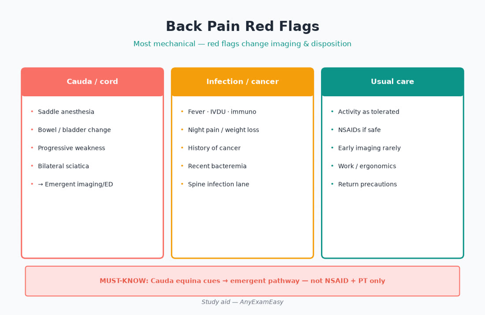
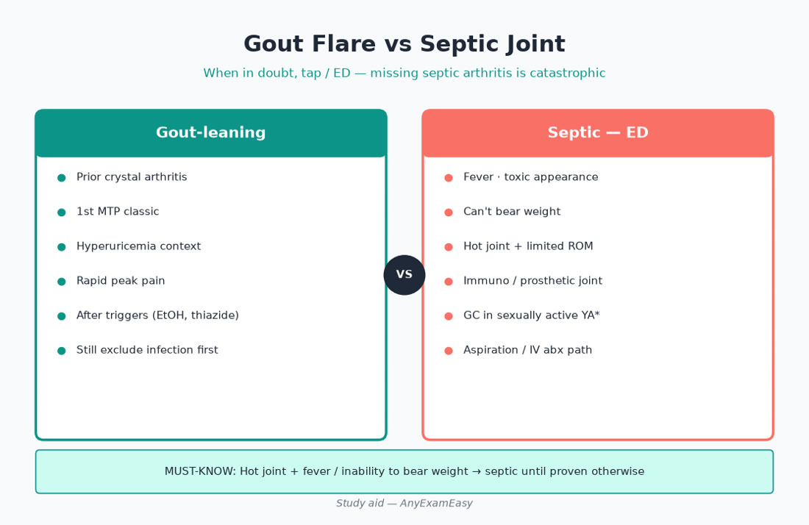
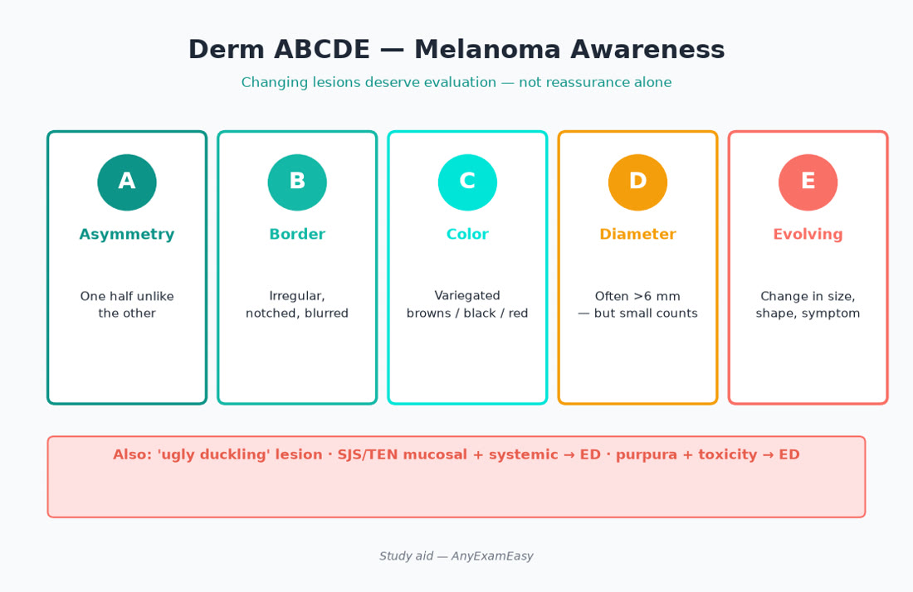
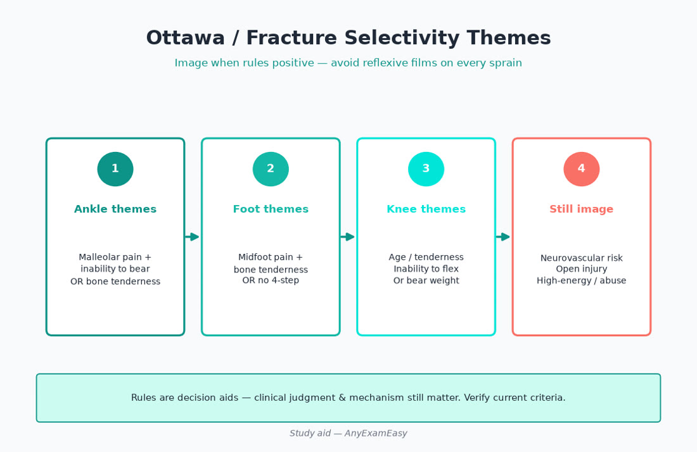
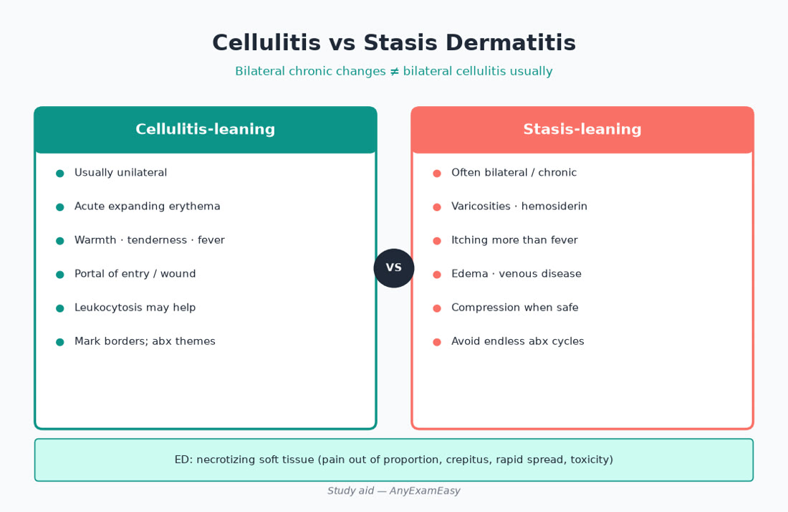

# Chapter 12 — MSK / Dermatology

> **Study aid only.** Guideline themes for primary-care FNP exam judgment — not individualized prescribing or a protocol. Verify current AAOS/ACR/AAD-aligned and related guidance, FDA labeling, and the AANPCB Candidate Handbook. When drugs or intervals appear below, treat them as **teaching themes to verify**, not standing orders.

---

> **MUST KNOW** — Stability and can’t-miss first: cauda equina, septic joint, necrotizing soft tissue, SJS/TEN, hip fracture in elders after fall.

> **HIGHLIGHT** — Scan MUST KNOW / TRAP boxes before bed — they are your sprint sheet.

> **TRAP** — MRI every backache day 2, or steroid into a hot joint that might be septic.

> **LIFESPAN** — Older Adult (30%): atypical infection, occult fracture, polypharmacy NSAID harm; Young Adult* includes prenatal NSAID caution late pregnancy.

#### Critical checklist — open this chapter
- [ ] I can name the chapter’s can’t-miss emergencies
- [ ] I know one prenatal and one older-adult twist
- [ ] I will do practice questions after reading

## Why this chapter matters

MSK and derm fill half of primary-care walk-ins — and they sit where Domain II puts weight: **Middle Adult 26%** and **Older Adult 30%**, with **Young Adult\* 22%** (prenatal drug-safety and postpartum body-change themes). Domain I still grades every item by process: Did you **Assess** neuro deficits, fever, and skin ABCDE? **Diagnose** mechanical vs emergent vs inflammatory? **Plan** PT, selective imaging, stewardship antibiotics, and potency-appropriate topicals? **Evaluate** red-flag progression, wound response, and when to revise “cellulitis” that was really stasis?

Expect stems on low-back red flags and cauda equina, OA vs inflammatory arthritis cues, Ottawa-style imaging selectivity, elder falls and occult hip fracture, gout vs septic joint, eczema/psoriasis counseling, cellulitis vs venous stasis, melanoma ABCDE, and SJS/TEN ED cues. Candidates who memorized “NSAIDs for back pain” without disposition lose dangerous points; candidates who inject steroids into a septic joint lose worse ones.

**Pair with practice:** After each topic block, run related items in a strong Qbank, review every miss, and tag your error log with age band + ADPE stage. Soft start: [anyexameasy.com](https://anyexameasy.com) ($27.99/mo after trial; trial terms on site).

---

## ADPE lens for MSK / derm

| Domain I process | What it looks like in MSK/derm stems |
| --- | --- |
| **Assess (32%)** | Trauma mechanism, neuro exam (saddle, strength, reflexes), fever, joint warmth/ROM, skin ABCDE + mucosal check, meds (NSAIDs, steroids, immunosuppressants, recent new drug), pregnancy status, fall risk, SDoH (can they afford PT / biologics specialty path?) |
| **Diagnose (26.5%)** | Mechanical LBP vs cauda/cord/infection/cancer; sprain vs fracture; OA vs crystal vs septic; eczema vs psoriasis vs infection; cellulitis vs stasis vs DVT cues; benign nevus vs melanoma concern |
| **Plan (26.5%)** | Early activity for mechanical back pain; selective imaging; Ottawa themes; joint aspiration pathway if septic possible; topical potency teaching; derm referral; ED for SJS/TEN / necrotizing cues |
| **Evaluate (15%)** | Red-flag progression return precautions; wound/antibiotic response; steroid side-effect check; biopsy follow-through; deprescribe chronic NSAIDs harming kidneys/GI/HF |

**Red-flag filter first:** saddle anesthesia, bowel/bladder retention or incontinence with back pain, progressive motor deficit, hot joint + systemic toxicity, rapidly progressive painful rash with mucosal involvement, elder fall + unable to bear weight → disposition before clever outpatient titration.

---

## Topic A — Low back pain & cauda equina

### Presentation & pathophysiology themes

Most acute low back pain in primary care is **mechanical** (strain, degenerative disc/facet themes) and improves with time, activity, and simple analgesia. Serious causes are less common but exam-favorite when **red flags stack**.

### Assessment — get this right before you image or reassure

- Onset, trauma, radiation below knee, saddle anesthesia, bowel/bladder change, fever, IV drug use, cancer history, unexplained weight loss, night pain unrelieved by position, progressive weakness, steroid/immunosuppression, recent procedure.
- Neuro: strength, reflexes, sensation including saddle region when indicated, straight-leg raise themes for radiculopathy.
- Abdominal/vascular cues in older adults (AAA rupture themes) when pain is sudden/severe with hemodynamic worry.
- Pregnancy status when relevant to imaging and NSAID decisions.

### Red flags

| Finding | Meaning on exam |
| --- | --- |
| Saddle anesthesia, new bowel/bladder dysfunction, progressive bilateral deficits | **Cauda equina themes → emergent imaging/ED pathway** |
| Fever + back pain + IVDU / immunosuppression / recent spinal procedure | Discitis/osteomyelitis/epidural abscess lane |
| Cancer history, unexplained weight loss, night pain | Metastasis / pathologic fracture workup urgency |
| Major trauma or osteoporosis + sudden pain after minor trauma | Fracture — image earlier |
| Progressive motor deficit | Urgent specialty/ED — not “PT and see you in 6 weeks” alone |

### Differentials / labels to hold

Mechanical LBP · lumbar radiculopathy · spinal stenosis (neurogenic claudication in older adults) · compression fracture · infection · malignancy · inflammatory spondyloarthropathy (younger adult morning stiffness themes) · AAA / visceral referred pain · pyelo / renal colic mimics.

### Workup themes (verify current guidance)

- **Most uncomplicated acute mechanical LBP:** no early MRI. Imaging when red flags, progressive neuro deficit, or failure of appropriate conservative care over a guideline-timed interval.
- Labs (CBC, ESR/CRP, cultures) when infection/cancer inflammatory cues present — not shotgun every backache.
- Pregnancy test before ionizing radiation when applicable.

### Plan themes

| Situation | Therapy thinking (verify) |
| --- | --- |
| Uncomplicated mechanical LBP | Stay active; heat; short NSAID or acetaminophen course if appropriate; avoid prolonged bed rest |
| Radicular symptoms without red flags | Same + time; PT; consider imaging if persistent/worsening per guidance |
| Cauda / cord / infection / unstable fracture cues | ED / emergent imaging pathway — do not send home with cyclobenzaprine only |
| Chronic non-specific LBP | Multimodal: exercise, PT, CBT themes, careful meds; avoid long opioid cascades |

### Evaluate

Return precautions in writing: new saddle/bladder symptoms, progressive weakness, fever, uncontrolled pain. Recheck if not improving on expected trajectory. Chronic opioid starts for routine LBP are a Plan/Evaluate failure pattern.

### Lifespan notes

- **Peds/adolescent\*:** Trauma, infection, spondylolysis themes; don’t dismiss persistent pain in athletes.
- **Prenatal (Young Adult\*):** Mechanical load common; avoid routine ionizing imaging; NSAID caution especially later pregnancy — verify obstetric guidance.
- **Older Adult (30%):** Compression fracture, cancer, infection, AAA, stenosis — broaden differential; NSAID GI/renal/CV risk.

> **MUST KNOW** — Cauda equina red flags → emergent pathway, not routine outpatient MRI “sometime this month.”

> **TRAP** — Immediate MRI for every 1-week MSK backache without red flags.

---

## Topic B — Osteoarthritis (primary care core)

### Presentation

Activity-related joint pain, brief morning stiffness (<30–60 min themes), crepitus, bony enlargement — knees, hips, hands (DIP/PIP, first CMC), spine. Contrast with inflammatory arthritis: prolonged morning stiffness, soft swelling, systemic features.

### Assess

Function (stairs, walking distance, sleep), prior injury, BMI, occupation, fall risk, current NSAID/opioid use, GI bleed history, CKD/HF/HTN (NSAID safety), SDoH for PT and weight programs.

### Diagnose / differentials

OA · crystal disease · septic (if hot/fever) · inflammatory arthritis · referred pain (hip→knee) · bursitis/tendinopathy · AVN themes (steroid/alcohol cues).

### Plan themes

- Nonpharmacologic first language: exercise, weight loss when overweight, PT, braces/assistive devices, activity modification.
- Topical NSAIDs often preferred before systemic in older adults for knees/hands themes.
- Oral NSAIDs shortest effective course with GI/renal/CV risk filter; acetaminophen if appropriate; avoid chronic opioid for OA as default.
- Intra-articular steroid/hyaluronic themes — indication-specific; **never inject if septic joint possible**.
- Refer ortho when function collapses, locking, or joint replacement discussion appropriate.

### Evaluate

Function and pain trajectory; NSAID adverse effects (BMP, BP, GI symptoms); deprescribe what isn’t helping.

> **LIFESPAN** — Older Adult: topical first, Beers-aware systemic NSAIDs, fall-risk with opioids/sedating muscle relaxants.

---

## Topic C — Sprains, strains & fracture selectivity (Ottawa themes, elder hip)

### Presentation

Acute trauma, swelling, inability to bear weight, point tenderness, deformity. Sprains = ligament; strains = muscle/tendon; fractures need imaging selectivity — not film every bruise, not miss high-risk sites.

### Ottawa-style imaging themes (teaching — verify current rules)

- **Ankle/foot:** bone tenderness at malleoli / navicular / base of 5th metatarsal, or inability to bear weight — imaging more likely indicated.
- **Knee:** age, inability to bear weight, isolated patellar or fibular head tenderness, inability to flex — themes that increase need for film.
- Document why you imaged **or** why you didn’t.

### High-miss fracture patterns

| Pattern | Why it matters |
| --- | --- |
| Elder fall + hip/groin pain ± shortened/externally rotated leg | **Hip fracture until cleared** — often ED/ortho; occult fracture may need advanced imaging if plain films negative and suspicion high |
| FOOSH + snuffbox tenderness | Scaphoid — immobilize/refer even if initial film negative when clinical suspicion high |
| Fifth metatarsal base pain after inversion | Jones vs avulsion — management differs; don’t casual “sprain” all lateral foot pain |
| Child refusal to use arm after pull | Nursemaid elbow themes vs fracture — mechanism matters |

### Plan themes

RICE-style / protection, early protected motion when appropriate, analgesia, crutches/boot as indicated, follow-up for persistent inability to bear weight. Suspect compartment syndrome (severe pain out of proportion, paresthesias after injury) → ED.

### Lifespan

- **Children:** growth plates — “sprain” may be Salter-Harris; lower threshold to image/refer.
- **Older Adult:** low-energy fractures (wrist, vertebra, hip); start osteoporosis evaluation pathway after fragility fracture themes.

> **MUST KNOW** — Elder fall + hip pain / can’t bear weight = fracture workup urgency, not “rest and Motrin” alone.

> **TRAP** — Calling snuffbox tenderness “wrist sprain” without scaphoid precautions.

---

## Topic D — Gout vs septic arthritis

### Presentation

Acute monoarthritis — often 1st MTP (podagra) for gout; any joint can be septic. Fever, inability to range the joint, overlying erythema.

### Assess — the dangerous question first

**Could this be septic?** Hot joint + fever/rigors/immunosuppression/IVDU/recent injection or surgery → **aspiration/acute pathway**, not empiric oral steroid and home.

Crystal disease history, alcohol, diuretics, CKD, tophi, prior similar attacks help gout probability — they do **not** exclude concurrent infection.

### Red flags

| Finding | Meaning |
| --- | --- |
| Hot joint + systemic toxicity | Septic until proven otherwise |
| Prosthetic joint infection cues | Specialty/ED — different rules |
| Rapid soft-tissue spread, crepitus, severe pain out of proportion | Necrotizing infection themes → ED |

### Differentials

Septic arthritis · gout · CPPD (pseudogout, often knee/wrist in older adults) · reactive arthritis · trauma/hemarthrosis · cellulitis overlying joint (still beware deep infection).

### Plan themes

- **Septic possible:** urgent joint aspiration (usually ED/ortho/rheum pathway), cultures before antibiotics when feasible, do **not** inject steroids.
- **Classic gout after infection reasonably excluded:** anti-inflammatory themes (NSAID if safe, colchicine, or short steroid course — verify contraindications); later urate-lowering for recurrent disease (allopurinol etc.) with flare prophylaxis themes — don’t start ULT during acute flare as a careless first move without a plan (exam nuance: verify current teaching).
- Lifestyle: alcohol, fructose, weight; med review (thiazides).

### Evaluate

Uric acid is not a reliable “rule-out” in acute flare. Follow renal function on NSAIDs/colchicine. Recurrent attacks → prevention plan + specialty if complex.

> **MUST KNOW** — Hot joint + fever → septic workup; never steroid-inject a possibly septic joint.

> **TRAP** — “He’s had gout before, so treat as gout” when febrile and non-weight-bearing.

---

## Topic E — Eczema (atopic dermatitis) & psoriasis

### Eczema themes

Itch-predominant, flexures in older kids/adults; infants may involve extensor/face. Triggers: dryness, irritants, allergens. Secondary infection (impetigo/eczema herpeticum cues) changes Plan.

**Plan:** moisturize liberally; fragrance-free care; topical corticosteroids by potency/site/duration; calcineurin inhibitor themes for face/folds when appropriate; avoid chronic high-potency on face/genital skin. Antihistamines don’t treat the inflammation — help itch/sleep sometimes. Refer when severe, recurrent infection, or diagnosis unclear.

### Psoriasis themes

Well-demarcated plaques with silvery scale — extensor elbows/knees, scalp, gluteal cleft; nail pitting; guttate after strep themes. Arthritis symptoms → PsA lane (refer).

**Plan:** topicals (steroids, vitamin D analogs); phototherapy/systemics/biologics = specialty collaboration. Screen lifestyle CV risk — psoriasis is systemic inflammatory disease, not “just skin.”

### Lifespan

- **Peds:** potency/duration discipline; eczema herpeticum (punched-out vesicles + toxicity) → urgent care.
- **Prenatal:** many systemics contraindicated — coordinate dermatology/Ob.
- **Older Adult:** thinner skin → easier steroid atrophy; polypharmacy.

> **TRAP** — Chronic high-potency topical steroid on the face.

> **HIGHLIGHT** — Psoriasis systemic therapy = specialty collaboration; don’t casual-start methotrexate in primary care without systems.

---

## Topic F — Cellulitis vs stasis dermatitis (and DVT cues)

### Why this is an exam favorite

Older adults with bilateral red legs get labeled “cellulitis” and leave on unnecessary antibiotics. **Stasis dermatitis** is usually bilateral, itchy, with hemosiderin staining, varicosities, and chronic course. **Cellulitis** is typically unilateral, painful, expanding, warmer, often with fever/leukocytosis.

### Assess

Unilateral vs bilateral, fever, lymphangitic streaking, portal of entry, chronic venous history, pulses (don’t miss arterial disease), calf swelling/pain (DVT), immunosuppression.

### Differentials

Cellulitis · erysipelas · stasis · contact dermatitis · DVT · thrombophlebitis · necrotizing infection · gout with overlying erythema · ruptured Baker cyst.

### Plan themes

| Likely label | Move |
| --- | --- |
| Classic unilateral cellulitis | Antibiotics covering typical skin flora themes; elevation; recheck 48h; mark borders |
| Bilateral chronic stasis | Compression (if arterial supply adequate), elevation, emollients, treat flares; **not** endless antibiotics |
| Uncertain / toxic / rapid progression | ED — rule out necrotizing infection, abscess needing I&D |
| DVT concern | Urgent duplex pathway |

### Evaluate

If “cellulitis” isn’t improving, reconsider abscess (ultrasound), resistant organism, wrong diagnosis (stasis, DVT, inflammatory).

> **LIFESPAN** — Cellulitis vs stasis in elders — look for true infection signs before weeks of antibiotics.

> **MUST KNOW** — Bilateral red legs ≠ automatic cellulitis.

---

## Topic G — Melanoma ABCDE & SJS/TEN ED cues

### Melanoma / pigmented lesion triage

**ABCDE themes:** Asymmetry, Border irregularity, Color variegation, Diameter (often >6 mm teaching hook — any changing lesion matters), Evolving. Also “ugly duckling” — one mole that looks different from the patient’s others.

**Plan:** suspicious lesions → biopsy/derm referral promptly; don’t freeze pigmented lesions of concern. Teach self-skin checks and sun protection. High-risk (many moles, family melanoma, immunosuppression) → lower threshold for derm.

### Drug rash vs emergency dermatology

Most morbilliform drug eruptions are uncomfortable but managed with stop-offending-drug + supportive care after assessing severity. **SJS/TEN themes** are different:

| Cue | Action |
| --- | --- |
| Rapidly progressive painful rash + mucosal involvement (eyes, mouth, genitals) | **ED / burn-center pathway thinking** |
| Nikolsky-positive / sheet-like denudation themes | Emergency |
| Recent high-risk drugs (exam favorites historically include certain anticonvulsants, allopurinol, sulfa antibiotics — verify lists) | Stop drug; emergency care |
| Fever + rash + organ symptoms | Don’t “observe at home with benadryl” |

DRESS, AGEP, and erythroderma also need specialty/ED judgment — exam wants you to **not undertriage** systemic severe cutaneous reactions.

### Other derm can’t-miss

Necrotizing fasciitis cues (pain out of proportion, rapid spread, crepitus, toxicity) → ED. Orbital vs preseptal cellulitis (eye pain/movement restriction/vision) → urgent ophthalmology/ED. Petechiae/purpura with illness → meningococcemia/ITP/TTP lanes — don’t call it “viral exanthem” when toxic.

> **MUST KNOW** — Suspected SJS/TEN / rapidly progressive rash with mucosal involvement → ED.

> **HIGHLIGHT** — ABCDE + evolving + ugly duckling → biopsy/derm, not reassurance by vibe.

---

## Clinical vignette 1 — Older adult back pain with urinary retention

**Stem:** 72-year-old with 2 days of severe low back pain after lifting a grandchild. Today: numbness in the perineum, can’t urinate, legs “feel heavy.” No fever. On warfarin for AF. BP 148/86, HR 92, afebrile.

### Assess
- Red-flag neuro + bladder → Older Adult 30%. Anticoagulation affects procedural/imaging logistics but does **not** justify delay of emergency evaluation.

### Diagnose
- **Cauda equina syndrome themes** until proven otherwise — not “muscle strain.”

### Plan
- EMS/ED for emergent imaging and surgical consultation pathway. Hold clinic “muscle relaxant + follow up Friday.”

### Evaluate
- Document time-to-ED counseling; ensure companion/EMS transport, not “drive yourself if you feel up to it” when retention/neuro deficits present.

### Why distractors fail
- “Oral steroids and MRI next week” delays cord/cauda care.
- “UA only for retention” misses neurologic emergency.
- “Increase warfarin dose for ‘clot causing pain’” — wrong frame entirely.

---

## Clinical vignette 2 — Hot knee in middle adult

**Stem:** 55-year-old with sudden swollen, exquisitely painful right knee. Temp 38.6°C. Can’t bear weight. History of “gout once years ago.” Drinks beer daily. Wants a steroid shot “like my brother got.”

### Assess
- Fever + hot joint + non-weight-bearing = septic on the board. Crystal history is a distractor, not a free pass.

### Diagnose
- Septic arthritis must be excluded; gout remains possible after aspiration pathway.

### Plan
- Urgent aspiration/culture pathway (ED/ortho). **Do not** inject steroids. Analgesia; NPO if surgery possible.

### Evaluate
- Follow cultures; if gout confirmed later, prevention counseling (alcohol, urate-lowering plan).

### Why distractors fail
- Empiric intra-articular steroid in clinic.
- Oral prednisone pack and home without ruling out infection.
- “Uric acid normal so not gout / uric acid high so not septic” — both logic errors.

---

## Clinical vignette 3 — Changing mole + drug rash fear

**Stem:** 41-year-old notes a dark mole on the calf that doubled in size over 6 months, irregular border, multiple colors. Separately asks about a friend’s “scary reaction to antibiotics.” She starts a sulfa antibiotic tomorrow for UTI per another clinician.

### Assess
- ABCDE-positive lesion. Med counseling opportunity. Middle Adult skin cancer risk conversations matter.

### Diagnose
- Suspicious pigmented lesion → needs tissue diagnosis pathway. Separately teach severe cutaneous adverse reaction return precautions when starting high-risk drugs.

### Plan
- Urgent derm/biopsy referral for the mole (don’t freeze). For antibiotic: confirm indication/allergy history; counsel stop-and-seek-care for blistering, mucosal sores, peeling, fever with rash.

### Evaluate
- Confirm biopsy scheduled/result closed loop; UTI follow-up.

### Why distractors fail
- “Watch the mole 1 year.”
- “Cryotherapy today for cosmetic freckle.”
- “Benadryl starter kit instead of ED precautions for mucosal blistering.”

---

## Exam traps / common miss patterns

| Trap | What to do instead |
| --- | --- |
| MRI all acute mechanical back pain day 2 | Red-flag filter; most improve without early MRI |
| Miss cauda cues | Emergent pathway for saddle/bladder/progressive deficit |
| Steroid injection into possibly septic joint | Aspirate/culture first |
| Elder fall = soft-tissue only | Clear the hip/occult fracture |
| Bilateral red legs = cellulitis | Stasis vs infection exam |
| Freeze suspicious pigmented lesion | Biopsy/derm referral |
| Undertriage mucosal drug rash | SJS/TEN → ED |
| Chronic systemic NSAIDs in CKD/HF elder | Safer analgesia ladder |
| Bed rest weeks for uncomplicated LBP | Early activity |
| Ignore snuffbox tenderness | Scaphoid precautions |

---

## Quick checklist — MSK / derm

- [ ] Back pain: red-flag screen every time (cauda, infection, cancer, fracture)
- [ ] Hot joint + fever → septic pathway; no steroid injection
- [ ] Ottawa-style selectivity documented; snuffbox & elder hip respected
- [ ] OA: movement, weight, topical before harmful systemic cascades
- [ ] Eczema/psoriasis: potency-by-site; infection complications recognized
- [ ] Cellulitis vs stasis vs DVT distinguished
- [ ] ABCDE / ugly duckling → biopsy/derm
- [ ] SJS/TEN mucosal + systemic cues → ED
- [ ] Pregnancy filter before NSAIDs/imaging/systemic derm drugs
- [ ] Older adult: Beers-aware NSAIDs/relaxants/opioids; fragility fracture follow-up
- [ ] SDoH: PT access, wound care supplies, specialty wait times
- [ ] Evaluate: written return precautions + closed-loop biopsy/culture results

---

## Remember this

- Domain II reality: Older Adult MSK/derm stems love occult fracture, stasis vs cellulitis, and NSAID harm.
- ADPE order: can’t-miss joint/spine/skin emergencies before clever outpatient scripts.
- Teaching doses/intervals change — verify guidelines and labels.
- Independent study aid — not AANPCB/AANP; no pass guarantee.

**Next practice move:** Drill back-pain red flags, septic joint, Ottawa/elder fracture, gout, cellulitis vs stasis, ABCDE, and SJS/TEN items with full rationale review on [AnyExamEasy](https://anyexameasy.com) — start free; $27.99/mo after trial (trial terms on site).

---

## Topic H — Soft-tissue infection spectrum (abscess, MRSA themes, necrotizing cues)

### Abscess vs cellulitis

Fluctuance, pointing, and localized collection → **incision and drainage** is often definitive; antibiotics alone may fail. Culture when systemic signs, immunosuppression, or recurrent MRSA risk. Packing/follow-up teaching matters for Evaluate.

### MRSA risk themes

Prior MRSA, household contacts, purulent cellulitis, sports teams, incarceration themes — choose antibiotics covering MRSA when indicated (verify local resistance and labeling). Don’t use MRSA drugs for every non-purulent cellulitis automatically — stewardship.

### Necrotizing soft-tissue infection

Pain out of proportion, rapid progression, systemic toxicity, crepitus, bullae, anesthesia of overlying skin → **ED/surgical emergency**. Imaging should not delay surgical evaluation when clinical suspicion is high.

---

## Topic I — Shoulder, knee, and overuse high-yield (primary care triage)

### Shoulder

Impingement/rotator cuff tendinopathy common; traumatic weakness after fall → consider acute cuff tear — earlier ortho. Frozen shoulder: stiffness > pain in later phases. Red flags: fever + joint (septic), night pain unrelieved + cancer history, neurovascular compromise after dislocation.

### Knee

Ottawa knee themes; ligament/meniscus after twist; septic vs crystal as above; adolescents with knee pain — consider hip pathology referred.

### Overuse

Plantar fasciitis, lateral epicondylitis, Achilles tendinopathy — load management, PT, avoid reckless fluoroquinolone + steroid injection combinations near tendons when avoidable (tendon rupture risk themes).

---

## Topic J — Counseling scripts that map to Plan items

- “Most back strains get better with movement — bed rest makes you stiffer.”
- “If you lose urine control, numbness between your legs, or your legs get weaker, go to the ER now.”
- “A hot joint with fever is an emergency until we prove it isn’t infected.”
- “Red legs on both sides for months is often vein skin changes — antibiotics won’t fix that.”
- “A mole that’s changing shape or color needs to be checked — we don’t freeze those.”
- “If a new medicine causes blistering or sores in your mouth or eyes, seek emergency care.”
- “Ibuprofen can hurt kidneys, stomach, and heart failure — let’s pick the safest pain plan.”

Teach-back beats pamphlet drops — Domain I Plan loves clear education plus return precautions.

---

## Integrated older-adult multimorbidity mini-case (Domain II 30%)

**Stem vibe:** 81-year-old with CKD stage 3, HFpEF, bilateral stasis changes, new unilateral shin redness and fever to 38.4°C after a cat scratch, takes daily ibuprofen for knee OA, fell last month and still limps, daughter wants “another Z-pak for the legs.”

**ADPE compressed:** Assess unilateral vs bilateral baseline photos if available, fever, wound portal, pulses, hip/knee function after fall, NSAID burden, Cr. Diagnose: likely unilateral cellulitis on stasis terrain; still consider DVT/abscess; lingering limp → occult fracture/OA flare. Plan: appropriate antibiotic for cellulitis severity, elevation, stop NSAID, safer analgesia, wound care, low threshold imaging for hip if still non-weight-bearing, compression later when infection controlled and arterial supply OK. Evaluate: 48-hour recheck, BMP, deprescribe NSAID long-term, PT/fall review.

---

## Concept checks

**1.** Best Plan for saddle anesthesia + urinary retention with acute back pain?  
A. Cyclobenzaprine and PCP follow-up in 2 weeks  B. Emergent ED/imaging pathway for cauda themes  C. Empiric oral steroids only  D. Routine MRI in 6 weeks  
**Answer:** B.

**2.** Hot knee, fever, prior gout — next?  
A. Intra-articular steroid in clinic  B. Urgent aspiration/septic pathway  C. Allopurinol today alone  D. Reassure uric acid will diagnose  
**Answer:** B.

**3.** Bilateral chronic red itchy legs without fever in an elder with hemosiderin staining?  
A. IV vancomycin  B. Stasis-directed care; avoid endless antibiotics  C. Emergent fasciotomy  D. High-potency face steroid  
**Answer:** B.

**4.** Evolving irregular multicolored mole?  
A. Cryotherapy  B. Biopsy/derm referral  C. Watch 5 years  D. Ketoconazole cream  
**Answer:** B.

**5.** New drug + painful rash + oral ulcers + eye involvement?  
A. Home diphenhydramine  B. ED for SJS/TEN pathway  C. Increase the dose  D. Allergy test next year only  
**Answer:** B.

---

> **TRAP** — Skipping Evaluate (48-hour cellulitis recheck, biopsy results, culture follow-up) because the prescription felt complete.

> **TRAP** — Using ANCC weights while sitting AANPCB (or the reverse).

---

## Critical callouts — MSK / derm (scan tonight)

> **MUST KNOW** — Cauda equina red flags → emergent pathway.

> **MUST KNOW** — Septic joint until proven otherwise for hot joint + fever; no steroid injection.

> **MUST KNOW** — Elder fall + hip pain / can’t walk → fracture clearance urgency.

> **HIGHLIGHT** — ABCDE + SJS/TEN mucosal cues separate routine derm from emergencies.

> **TRAP** — MRI-all-back-pain; bilateral-stasis-as-cellulitis; freeze suspicious moles.

> **LIFESPAN** — Older Adult occult fracture & NSAID harm; prenatal NSAID/imaging caution.

#### Critical checklist — MSK/derm tonight
- [ ] Cauda / septic / elder hip / SJS-TEN filters
- [ ] Ottawa & ABCDE
- [ ] Cellulitis vs stasis
