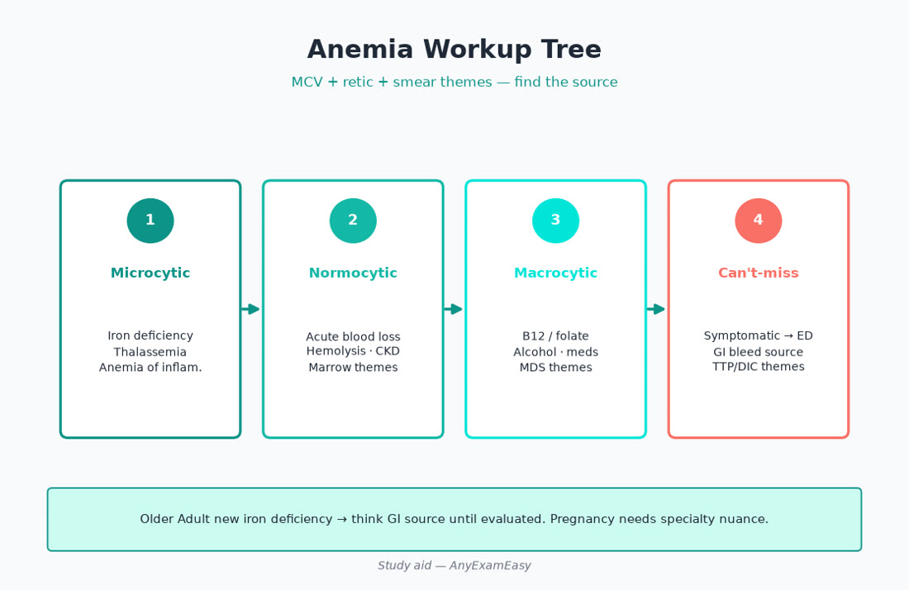
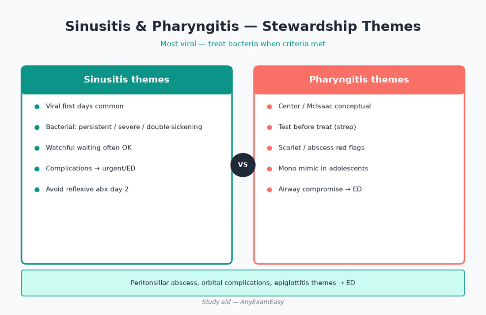
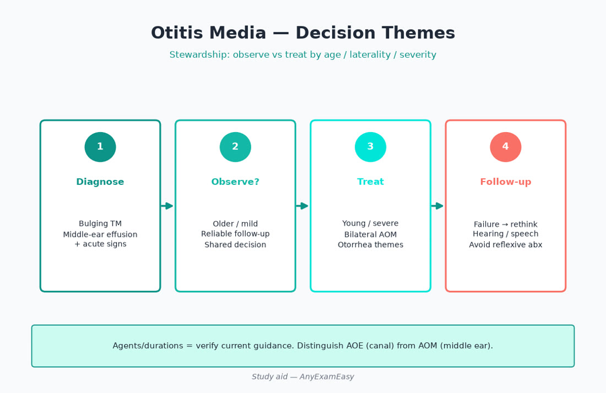
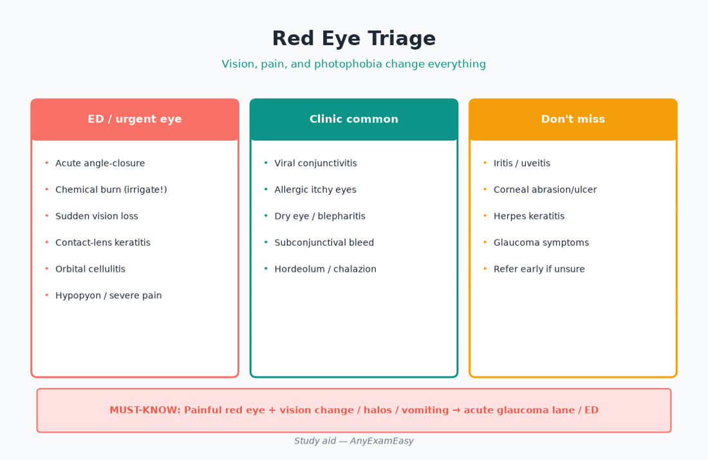
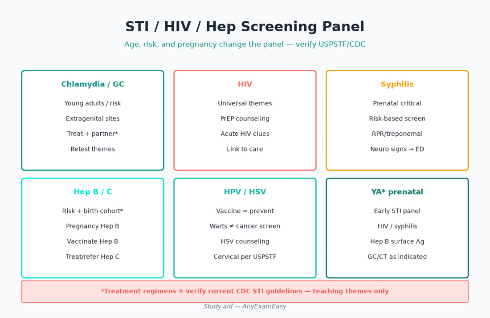

# Chapter 13 — ENT / Eyes / Heme / ID

> **Study aid only.** Guideline themes for primary-care FNP exam judgment — not individualized prescribing or a protocol. Verify current IDSA/AAO-HNS/ophthalmology-aligned and related guidance, USPSTF/ACIP themes, FDA labeling, and the AANPCB Candidate Handbook. When drugs or intervals appear below, treat them as **teaching themes to verify**, not standing orders.

---

> **MUST KNOW** — Vision-threatening eye, orbital cellulitis, epiglottitis/airway, febrile neonate, and meningococcal cues beat “another Z-pak.”

> **HIGHLIGHT** — Scan MUST KNOW / TRAP boxes before bed — they are your sprint sheet.

> **TRAP** — Antibiotics for day-2 viral URI “sinus,” or treating every sore throat without a testing strategy.

> **LIFESPAN** — Older Adult atypical infection; Young Adult* prenatal drug/eye/ID twists; peds AOM stewardship and fever pathways.

#### Critical checklist — open this chapter
- [ ] I can name the chapter’s can’t-miss emergencies
- [ ] I know one prenatal and one older-adult twist
- [ ] I will do practice questions after reading

## Why this chapter matters

ENT, eyes, anemia, and everyday infections are the “between cardiology chapters” content that still scores heavy points — especially where Domain II weights land: **Young Adult\* 22%** (STIs, mono vs strep, prenatal infection counseling), **Middle Adult 26%**, and **Older Adult 30%** (anemia of chronic disease, atypical UTI/pneumonia presentations, vision emergencies). Domain I grades process: Did you **Assess** duration, unilateral vision change, and hemodynamic stability? **Diagnose** viral vs bacterial vs can’t-miss mimics? **Plan** stewardship antibiotics, Centor-guided testing, and urgent ophthalmology when needed? **Evaluate** culture results, hemoglobin response, and screening follow-through?

Expect stems on acute bacterial rhinosinusitis criteria, GAS pharyngitis testing (Centor-style themes), AOM watchful waiting, conjunctivitis vs keratitis/acute angle-closure, iron-deficiency anemia source-finding, UTI basics, HIV/hepatitis/TB screening cues, influenza/COVID primary-care decisions, and mono vs strep. Candidates who auto-antibiotic every red throat lose stewardship points; candidates who send acute angle-closure home with artificial tears lose sight.

**Pair with practice:** After each topic block, run related items in a strong Qbank, review every miss, and tag your error log with age band + ADPE stage. Soft start: [anyexameasy.com](https://anyexameasy.com) ($27.99/mo after trial; trial terms on site).

---

## ADPE lens for ENT / eyes / heme / ID

| Domain I process | What it looks like in these stems |
| --- | --- |
| **Assess (32%)** | Duration/pattern of URI, Centor features, otoscopic exam, visual acuity, photophobia, contact-lens use, pallor/bleeding, sexual history, travel/exposures, vaccination, pregnancy, SDoH (can they fill antivirals / return for labs?) |
| **Diagnose (26.5%)** | Viral vs bacterial sinusitis; GAS vs viral vs mono; AOM vs OME; infectious vs urgent red eye; micro/normo/macrocytic anemia lanes; cystitis vs pyelo; mono vs strep overlap |
| **Plan (26.5%)** | Watchful waiting vs treat; test-before-treat when indicated; first-line abx stewardship; urgent ophtho/ED; anemia workup cascade; offer HIV/hep screening; antivirals when timing/risk fit |
| **Evaluate (15%)** | Symptom failure at 48–72h; Hb/ferritin follow-up; STI partner treatment; TB test interpretation next steps; vaccine adverse-event counseling |

**Red-flag filter first:** sudden vision loss, severe eye pain with halos/vomiting, proptosis/ophthalmoplegia, stridor/drooling, neck stiffness with fever, petechial rash with toxicity, severe anemia symptoms, pyelo in pregnancy, neonatal fever → disposition before clever outpatient scripts.

---

## Topic A — Acute rhinosinusitis

### Presentation & concepts

Most acute rhinosinusitis is **viral**. Bacterial disease is suggested by patterns such as: persistent symptoms beyond ~10 days without improvement, severe onset with high fever and purulent discharge for several days, or “double sickening” (worsening after initial improvement) — **verify current IDSA-style criteria** rather than memorizing a single day count as dogma.

### Assess

Duration, fever, facial pain, unilateral predominance, dental pain, immunocompromise, recent antibiotics, orbital/neuro symptoms.

### Red flags → urgent/ED

| Finding | Meaning |
| --- | --- |
| Orbital swelling, vision change, ophthalmoplegia | Orbital complication / cavernous sinus themes |
| Severe headache, photophobia, neuro deficits | Intracranial extension themes |
| Immunocompromised + invasive fungal cues | Emergency specialty pathway |

### Differentials

Viral URI · allergic rhinitis · bacterial ABRS · migraine · dental infection · foreign body (peds) · COVID/flu overlap.

### Plan themes

- Supportive care first for likely viral disease: saline, analgesia, intranasal steroid themes when appropriate.
- Antibiotics when bacterial criteria met — choose first-line agents per current guidance; avoid “Z-pak for everything.”
- Intranasal decongestant sprays: short courses only (rebound rhinitis).

### Evaluate

If not improving on appropriate therapy, reconsider diagnosis (dental, migraine, resistant organism, complication), not endless antibiotic switches without exam.

> **TRAP** — Macrolide for day-2 “sinus pressure” viral URI.

> **MUST KNOW** — Orbital/neuro complications of sinusitis → ED, not another oral antibiotic refill.

---

## Topic B — Pharyngitis (Centor / GAS) & mono vs strep

### Presentation

Sore throat ± fever, exudate, tender anterior cervical nodes, cough absence ( Centor-style features). Viral cues: cough, rhinorrhea, conjunctivitis, ulcers. EBV mono: fatigue, splenomegaly risk, posterior cervical nodes, atypical lymphs — often adolescents/young adults*.

### Assess / testing themes

- Use a validated clinical score **theme** (Centor/McIsaac-style) to decide who needs RADT/throat culture — don’t swab everyone and don’t treat everyone.
- Negative RADT in kids often needs culture confirmation themes; adult algorithms differ — verify current guidance.
- Consider gonococcal pharyngitis in sexual-risk stems; Fusobacterium/Lemierre rare but toxic young adult with septic emboli cues.

### Mono vs strep — exam favorite

| Feature | Favors GAS | Favors mono (EBV) |
| --- | --- | --- |
| Age vibe | School-age / young adult | Adolescent / YA* |
| Nodes | Anterior cervical | Posterior cervical, diffuse |
| Exudate | Possible | Possible — overlap! |
| Fatigue / splenomegaly | Less | More |
| Testing | RADT/culture | Heterophile/EBV serology themes |
| Key Plan trap | — | Aminopenicillin rash if mono treated as strep |

**Splenic rupture risk counseling** if mono: activity/contact sport restrictions until cleared (verify timing themes).

### Plan themes

- Confirmed GAS: penicillin/amoxicillin first-line themes if non-allergic; macrolides only with true indication (resistance issues).
- Symptom care for viral pharyngitis.
- Airway emergency (epiglottitis/abscess): drooling, stridor, tripoding → ED — don’t force oropharyngeal exam that worsens obstruction.

### Evaluate

Return if unable to swallow secretions, worsening neck swelling, rash after aminopenicillin with mono suspicion, or persistent fever.

> **MUST KNOW** — Testing strategy before reflexive antibiotics for sore throat.

> **TRAP** — Amoxicillin for presumed strep that is actually mono → rash; sports clearance ignored in mono.

---

## Topic C — Otitis (AOM, OME, OE)

### Acute otitis media (AOM)

Bulging TM, impaired mobility, acute signs of middle-ear inflammation + effusion. Pain first. **Watchful waiting** themes for selected non-severe older children; treat younger infants/severe disease sooner — verify AAP-style age/severity rules. First-line antibiotic themes (amoxicillin when appropriate); address penicillin allergy carefully (true vs delayed).

### Otitis media with effusion (OME)

Fluid without acute infection — hearing/speech implications; avoid antibiotics for routine OME; follow hearing/tympanostomy criteria with ENT when persistent.

### Otitis externa (OE)

Canal edema/pain with tragal tenderness — topical therapy themes; wick if swollen shut. **Malignant OE** in diabetics/immunocompromised with severe pain → urgent specialty (Pseudomonas invasive disease).

### Red flags

Mastoiditis (postauricular swelling/erythema), facial nerve palsy, toxic infant, malignant OE cues → urgent/ED.

### Lifespan

- **Peds:** AOM peaks; avoid fluoroquinolone reflex; vaccine status (PCV, flu) matters for prevention talk.
- **Older Adult:** OE + diabetes = higher complication worry; hearing loss evaluation for social isolation.

> **HIGHLIGHT** — OME ≠ automatic antibiotics. Malignant OE ≠ routine swimmer’s ear drops alone.

---

## Topic D — Red eye: conjunctivitis vs urgent ophthalmology

### Usually primary care

Viral conjunctivitis (watery, often bilateral sequential), allergic (itchy), bacterial (purulent — still many self-limited). Teach hygiene; contact-lens wearers with painful red eye → **think keratitis** until proven otherwise (stop lenses; urgent ophtho).

### Must-not-miss eye board

| Lane | Clues | Disposition |
| --- | --- | --- |
| Acute angle-closure glaucoma | Severe pain, halos, mid-dilated rock-hard eye, vomiting, vision drop | **ED / emergent ophtho** |
| Chemical burn | Alkali/acid exposure | Immediate irrigation + ED |
| Sudden vision loss | Vascular, retinal, neurologic | Emergent |
| Keratitis (contact lens) | Pain, photophobia, fluorescein defect themes | Urgent ophtho |
| Anterior uveitis | Pain, photophobia, ciliary flush | Urgent ophtho |
| Orbital cellulitis | Pain with EOM, proptosis, vision change, fever | ED |
| Preseptal cellulitis | Eyelid erythema without orbital signs | Careful exam; still close follow-up |
| Herpes zoster ophthalmicus | V1 distribution + eye symptoms | Urgent ophtho; antiviral themes |

### Assess always

**Visual acuity** (each eye), pupils, EOM, fluorescein when indicated, contact-lens history, trauma, chemical exposure.

### Plan

Don’t give topical steroids for undiagnosed red eye in primary care. Don’t patch a possible infection carelessly. Pregnancy: avoid unnecessary agents; coordinate when needed.

> **MUST KNOW** — Acute angle-closure / chemical burn / sudden vision loss / contact-lens keratitis suspicion → emergent/urgent eye care — not artificial tears and “return prn.”

---

## Topic E — Anemia workup themes

### Presentation

Fatigue, dyspnea, pallor, tachycardia — or incidental CBC. Bleeding (GI, menstrual), diet, CKD, hemolysis cues (dark urine, jaundice), neuro symptoms (B12).

### Pattern → next thoughts

| Pattern | Next thoughts |
| --- | --- |
| **Microcytic** | Iron deficiency, thalassemia trait, anemia of chronic disease sometimes micro; **find the bleed** in adult iron deficiency |
| **Normocytic** | Acute blood loss, CKD, anemia of inflammation, hemolysis/mixed |
| **Macrocytic** | B12/folate deficiency, alcohol, meds (hydroxyurea, etc.), marrow disorders, hypothyroidism themes |

### Assess

Medications (NSAIDs, anticoag), diet, alcohol, menstrual history, melena/BRBPR, family thalassemia/hemoglobinopathy, CKD, autoimmune disease, pregnancy.

### Plan themes

- Confirm with indices + reticulocyte count themes; ferritin/iron studies, B12/folate as pattern suggests.
- **Postmenopausal / male iron deficiency → GI evaluation themes** (don’t stop at oral iron forever without source search).
- Premenopausal heavy menses: treat iron + address gyn source.
- Hemolytic/unstable anemia → ED/heme.
- Thalassemia trait: avoid iron overload from blind supplementation without confirming deficiency.

### Evaluate

Hb response to iron (expect rise over weeks if absorbing); intolerance → IV iron specialty pathways; colonoscopy/EGD completion when indicated.

> **LIFESPAN** — Older Adult iron deficiency → look for GI source (including cancer). Prenatal: physiologic anemia vs iron deficiency — screen/treat per Ob guidance.

> **TRAP** — Calling all microcytic anemia “iron deficiency” without confirming — or iron forever without finding adult bleed source.

---

## Topic F — UTI (brief primary-care high-yield)

### Themes

Dysuria, frequency, urgency without vaginal symptoms → uncomplicated cystitis in nonpregnant women often treatable with first-line short-course agents (nitrofurantoin / TMP-SMX / fosfomycin themes — **verify resistance and labeling**). Pyelo: fever, flank pain, nausea — broader therapy and closer disposition judgment.

### Special populations

| Population | Twist |
| --- | --- |
| Pregnancy | Treat bacteriuria themes per Ob guidance; avoid fluoroquinolones/tetracyclines; nitrofurantoin/sulfa timing nuances — verify |
| Male UTI | Often complicated — consider urologic factors |
| Older Adult | Atypical (confusion, falls); **don’t treat asymptomatic bacteriuria** routinely (except pregnancy and selected procedures) |
| Catheter | Colonization common — treat symptoms/systemic infection, not every positive culture |

### Red flags

Pyelo with instability, obstruction suspicion, male/pediatric febrile UTI pathways, pregnant pyelo → higher acuity.

> **TRAP** — Antibiotics for asymptomatic bacteriuria in a demented nursing-home resident without systemic signs (common overtreat pattern).

---

## Topic G — HIV, hepatitis, TB screening cues

### HIV

Offer screening per **current USPSTF-style adult themes** (and risk-based anytime). Acute HIV can look like mono — consider testing. PrEP awareness for ongoing risk; post-exposure pathways exist — know to seek urgent evaluation. Pregnant patients: prenatal HIV testing is standard theme.

### Hepatitis B / C

Risk-based and cohort/universal adult hep C screening themes (verify current USPSTF). Hep B: vaccine status, birth in endemic regions, sexual/household exposure, before immunosuppressing therapy. Positive screens → confirmatory tests + linkage to care (Evaluate failure = positive result with no follow-up).

### TB

Screen high-risk (contacts, incarceration, congregate settings, immunosuppression, endemic exposure) with IGRA or TST themes. Positive test → rule out active TB before latent treatment; chest imaging/symptoms review. Latent TB treatment regimens — specialty collaboration often; drug interactions (rifamycins + many meds including some DOACs/HIV meds).

### STI crossover

Gonorrhea/chlamydia screening in young adults* and risk groups; syphilis rising — know when to test; treat partners; reportability awareness without inventing local law details.

> **HIGHLIGHT** — Know who to **offer** HIV/hep screening — routine offering beats only-if-they-ask.

---

## Topic H — Influenza, COVID, and high-yield primary-care respiratory viruses

### Shared ADPE

Assess severity (hypoxia, RR, work of breathing, hydration, comorbidities), timing of symptom onset for antivirals, exposure, vaccination, pregnancy, older adult/immunocompromise.

### Influenza themes

High-risk groups benefit most from early antivirals when indicated (verify timing windows). Chemoprophylaxis in outbreaks/selected exposures — situational. Vaccine counseling every season.

### COVID themes

Guidance evolves — exam wants **judgment**: isolate/mask counseling per current public health themes, know when pulse ox/ED needed (hypoxia, severe dyspnea), be aware antivirals/mAbs eligibility concepts change — **verify current**, don’t invent regimens. Vaccination/boosters per ACIP current.

### Overlap traps

Don’t miss bacterial pneumonia, PE, HF, or ACS hiding under “viral” labels — especially Older Adult.

> **MUST KNOW** — Hypoxia / severe dyspnea → ED regardless of which virus PCR is positive.

---

## Clinical vignette 1 — Adolescent sore throat (mono vs strep)

**Stem:** 17-year-old with 5 days of severe sore throat, fever, fatigue. Exudative pharynx, tender posterior cervical nodes, mild LUQ discomfort. Rapid strep negative. Parent wants amoxicillin “just in case.” Plays soccer.

### Assess
- Adolescent* band. Posterior nodes + fatigue + LUQ → mono on board. RADT negative lowers GAS probability (culture per pediatric themes if needed).

### Diagnose
- Likely EBV mono; still consider GAS false-negative pathways per age guidance; airway ok.

### Plan
- Supportive care; heterophile/EBV testing as indicated; **avoid empiric aminopenicillin**; splenic rupture counseling — no contact sports until cleared; hydrate; return precautions for airway/dehydration.

### Evaluate
- Confirm activity restriction understanding; follow if jaundice/prolonged fever.

### Why distractors fail
- Empiric amoxicillin → classic rash risk.
- Immediate return to varsity soccer.
- CT abdomen for mild LUQ without toxicity.

---

## Clinical vignette 2 — Contact-lens red eye

**Stem:** 28-year-old soft contact-lens wearer with unilateral painful red eye, photophobia, decreased acuity. No trauma. Feels “something on the cornea.”

### Assess
- YA*; acuity reduced; contact-lens keratitis until proven otherwise.

### Diagnose
- Suspected microbial keratitis — not garden-variety viral conjunctivitis.

### Plan
- Stop contact lenses; **urgent ophthalmology same day**; do not start steroid drops; avoid patching infected cornea casually.

### Evaluate
- Confirm she reached ophtho; counsel lens hygiene long-term.

### Why distractors fail
- “Pink eye — antibiotic drops and follow up in 2 weeks.”
- Topical steroid for comfort.
- Continue daily lenses with lubricating drops only.

---

## Clinical vignette 3 — Older adult fatigue / microcytic anemia

**Stem:** 74-year-old man with fatigue. Hb 9.8, MCV 72, ferritin low. Takes naproxen for OA. Guaiac not done. Wants “iron pills and see you next year.”

### Assess
- Older Adult 30%. Iron deficiency pattern. NSAID bleed risk. No postmenopausal/male free pass.

### Diagnose
- Iron-deficiency anemia — **source must be sought** (GI evaluation themes).

### Plan
- Start iron if appropriate; stop/replace NSAID; arrange GI workup (colonoscopy ± EGD per guidance); screen for other deficiencies as indicated; counsel dark stools on iron vs melena.

### Evaluate
- Hb/ferritin response; ensure endoscopy completed; cardiac symptoms → urgency.

### Why distractors fail
- Iron forever without source evaluation.
- Empiric B12 only for microcytic indices.
- Continue high-dose NSAID unchanged.

---

## Exam traps / common miss patterns

| Trap | What to do instead |
| --- | --- |
| Z-pak day-2 viral sinus | Viral care / bacterial criteria first |
| Antibiotics all sore throats | Centor-style testing strategy |
| Amoxicillin in likely mono | Avoid aminopenicillin; counsel spleen |
| Treat OME with endless abx | Watchful follow-up / hearing path |
| Artificial tears for angle-closure | Emergent ophtho/ED |
| Contact-lens pain = pink eye | Urgent keratitis pathway |
| Iron in older man without GI workup | Find the bleed |
| Treat asymptomatic bacteriuria in elders | Usually don’t |
| Ignore HIV/hep offer | Routine screening themes |
| Miss hypoxia calling it “just flu” | ED / oxygen pathway |

---

## Quick checklist — ENT / eyes / heme / ID

- [ ] Sinus: viral majority; bacterial pattern before abx; orbital red flags
- [ ] Pharyngitis: test strategy; mono vs strep; airway emergencies
- [ ] AOM stewardship; OME ≠ abx; malignant OE in diabetics
- [ ] Red eye: acuity + contact lenses + angle-closure/chemical/keratitis filters
- [ ] Anemia: indices pattern → next labs; adult iron deficiency → source
- [ ] UTI: pregnancy & elderly ASB traps; pyelo disposition
- [ ] Offer HIV/hep screening; TB risk-based; close the loop on positives
- [ ] Flu/COVID: timing, risk, hypoxia disposition; verify current antivirals
- [ ] Pregnancy filters on drugs/imaging/UTI
- [ ] Evaluate: 48–72h failure plans, biopsy/endoscopy/serology follow-through

---

## Remember this

- Domain II: YA* owns STI/mono/prenatal infection; Older Adult owns atypical infection and anemia-source hunts.
- Stewardship is Plan — not optional flavor text.
- Teaching regimens change — verify guidelines and labels.
- Independent study aid — not AANPCB/AANP; no pass guarantee.

**Next practice move:** Drill sinusitis, Centor/GAS, mono, AOM, red-eye emergencies, anemia, UTI/ASB, HIV/hep screening, and flu/COVID items on [AnyExamEasy](https://anyexameasy.com) — start free; $27.99/mo after trial (trial terms on site).

---

## Topic I — Lymphadenopathy & “mono-spot negative” thinking

Localized nodes after infection often observe. Generalized nodes → systemic workup (HIV, EBV/CMV, syphilis, TB, lymphoma/leukemia themes). Hard, fixed, supraclavicular → malignancy worry — don’t reassure endlessly. Negative heterophile early in mono can be false-negative — clinical follow-up / EBV serology themes.

---

## Topic J — Counseling scripts that map to Plan items

- “Most sinus infections start viral — antibiotics won’t help the first days.”
- “We test strep when the score says it might help — treating every sore throat breeds resistance.”
- “If mono is possible, skip amoxicillin and sit out contact sports until we clear your spleen risk.”
- “Painful red eye in contacts is an eye emergency until proven otherwise.”
- “Low iron in adults isn’t just a pill problem — we look for where you’re losing blood.”
- “A positive hepatitis or HIV test means we link you to care fast — you won’t be left hanging.”
- “Confusion alone doesn’t mean urine antibiotics if you’re otherwise well — we check the whole picture.”

---

## Integrated older-adult mini-case (Domain II 30%)

**Stem vibe:** 79-year-old with COPD, diabetes, “pink eye” on the right with pain and reduced acuity after sleeping in contacts (occasional use), also dysuria without fever, UA colonized on last admission, Hb 10.1 MCV 88, daughter wants azithromycin “for sinus drip.”

**ADPE compressed:** Assess acuity/pain (urgent eye), UTI symptoms vs colonization, anemia chronic disease vs other, viral drip vs ABRS criteria. Diagnose: urgent keratitis lane + possible uncomplicated UTI if truly symptomatic + not bacterial sinus yet. Plan: same-day ophtho; avoid reflex azithromycin for drip; treat UTI only if syndrome fits; anemia follow-up with CKD/COPD context. Evaluate: eye follow-through, UA clinical correlation, Hb trend.

---

## Concept checks

**1.** Best approach to day-3 viral-pattern rhinosinusitis without severe features?  
A. Immediate levofloxacin  B. Supportive care; bacterial criteria before abx  C. Urgent MRI  D. High-dose steroid injection  
**Answer:** B.

**2.** Contact-lens wearer, unilateral painful photophobic red eye?  
A. Artificial tears only  B. Urgent ophthalmology for keratitis pathway  C. Patch and sleep  D. Oral steroid burst  
**Answer:** B.

**3.** 70-year-old man, ferritin low, Hb 9.5 microcytic — next priority beyond iron?  
A. Nothing  B. GI source evaluation themes  C. Empiric methotrexate  D. Stop all vegetables  
**Answer:** B.

**4.** Nursing-home resident, cloudy urine, no symptoms, stable — treat?  
A. Always treat ASB  B. Usually do not treat asymptomatic bacteriuria  C. IV vancomycin automatic  D. Cystoscopy same day always  
**Answer:** B.

**5.** Exudative pharyngitis, fatigue, posterior nodes, negative RADT — avoid?  
A. Hydration  B. Empiric aminopenicillin for “just in case strep” when mono likely  C. Activity counseling  D. Follow-up  
**Answer:** B.

---

> **TRAP** — Skipping Evaluate (ophtho kept appointment, endoscopy done, HIV result disclosed with linkage).

> **TRAP** — Using ANCC weights while sitting AANPCB (or the reverse).

---

## Deep dive — Centor-style decision flow (teaching)

1. **Assess** cough, fever history, tender anterior nodes, tonsillar exudate, age adjustment themes.  
2. If score low → symptomatic care; no test/abx needed in many adults.  
3. If intermediate/high → RADT (± culture per age guidance).  
4. Treat only confirmed (or highly probable per protocol) GAS.  
5. Concurrent mono features → avoid aminopenicillin; counsel spleen.  
6. Toxic, drooling, asymmetric tonsillar bulge → peritonsillar abscess / airway ED path — not another clinic antibiotic trial.

## Deep dive — Anemia “what next” micro-scripts

- Microcytic + low ferritin + postmenopausal/male → **GI referral language** in Plan.  
- Microcytic + normal/high ferritin + ethnicity cues → consider thalassemia trait (Hb electrophoresis themes) before iron overload.  
- Macrocytic + neuro symptoms → B12 urgently; don’t give folate alone and mask B12.  
- Normocytic + rising Cr → CKD anemia lane; don’t start ESA in primary care casually.  
- Sudden drop + hemodynamic change → ED for bleed/hemolysis.

## Deep dive — Vision acuity is Assess

Documenting “red eye” without acuity is an Assess miss. Even a phone near-card beats nothing. Relative afferent pupillary defect, constricted EOM, or acuity plunge moves the stem out of “pink eye” forever.

## Final ENT/eyes/heme/ID sprint table

| Bucket | Tonight’s hooks |
| --- | --- |
| Sinus | Viral majority; double-sickening; orbital red flags |
| Throat | Centor test strategy; mono vs strep; airway |
| Ear | AOM wait/treat; OME; malignant OE |
| Eye | Acuity; contacts; angle-closure; chemical; keratitis |
| Heme | Indices → labs; find adult iron-bleed source |
| ID screen | Offer HIV/hep; TB risk; close loops |
| Viruses | Flu/COVID timing; hypoxia = ED |
| UTI | Pregnancy drugs; elder ASB trap |

---

## Critical callouts — ENT / eyes / heme / ID (scan tonight)

> **MUST KNOW** — Vision-threatening eye → emergent/urgent care.

> **MUST KNOW** — Strep testing strategy; mono ≠ amoxicillin.

> **MUST KNOW** — Adult iron deficiency → find the source.

> **HIGHLIGHT** — Offer HIV/hep screening; don’t treat elder ASB by default.

> **TRAP** — Day-2 Z-pak sinus; pink-eye label for contact-lens keratitis.

> **LIFESPAN** — Peds AOM stewardship; prenatal UTI drugs; Older Adult atypical infection.

#### Critical checklist — tonight
- [ ] Eye emergencies board
- [ ] Centor / mono / sinus stewardship
- [ ] Anemia source + screening offers
