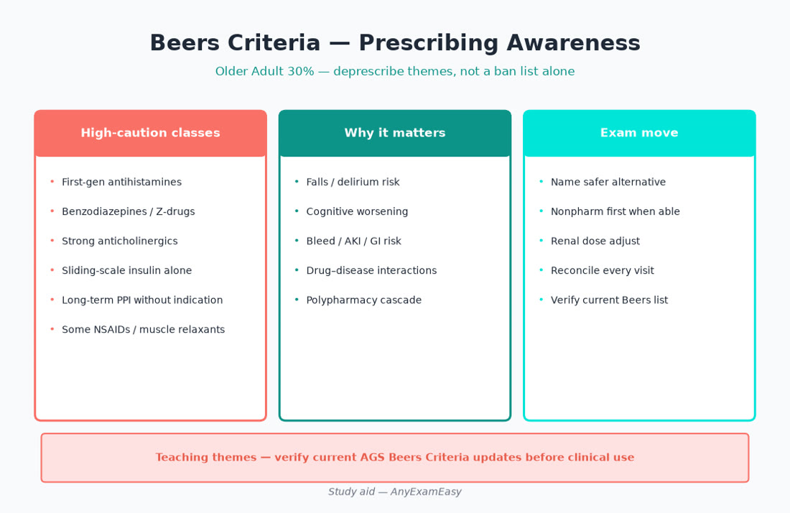
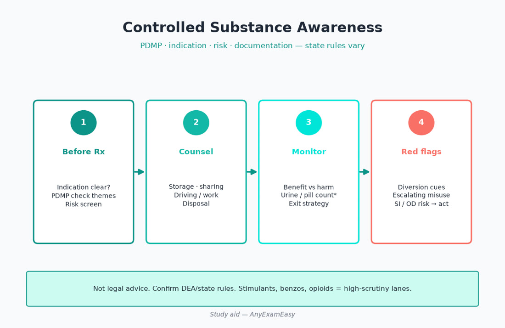
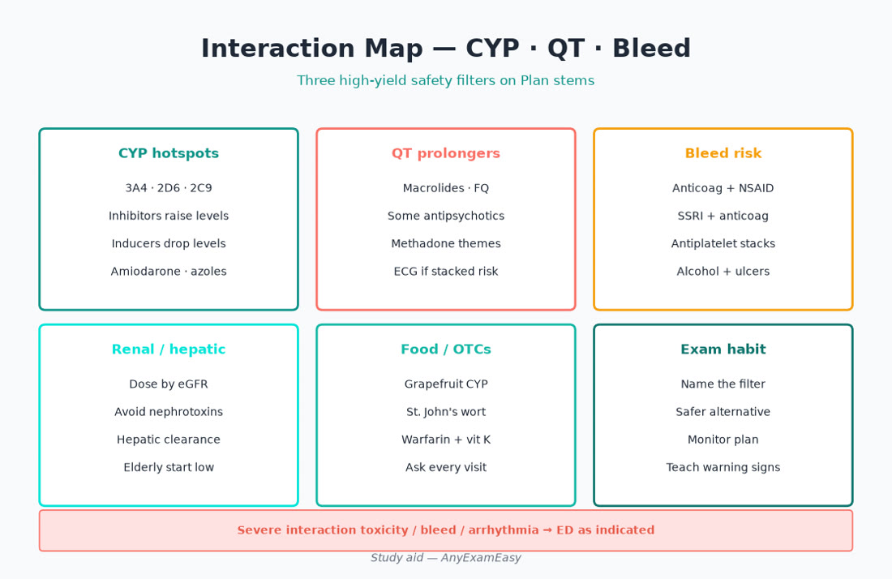
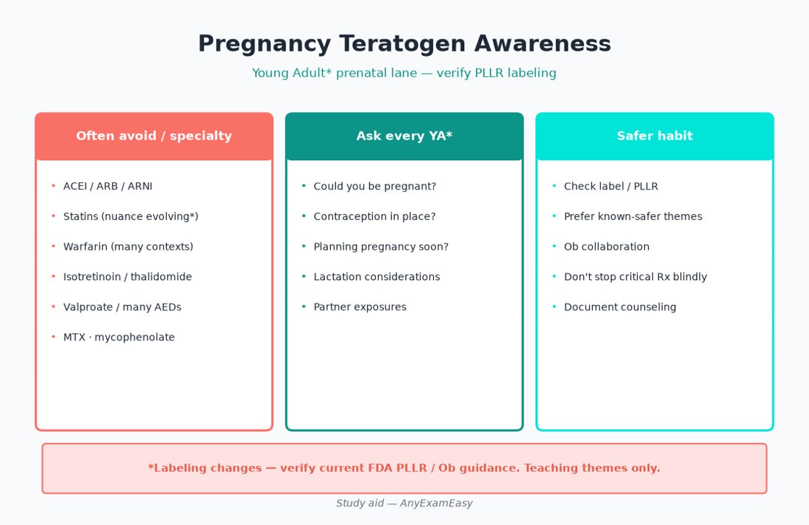
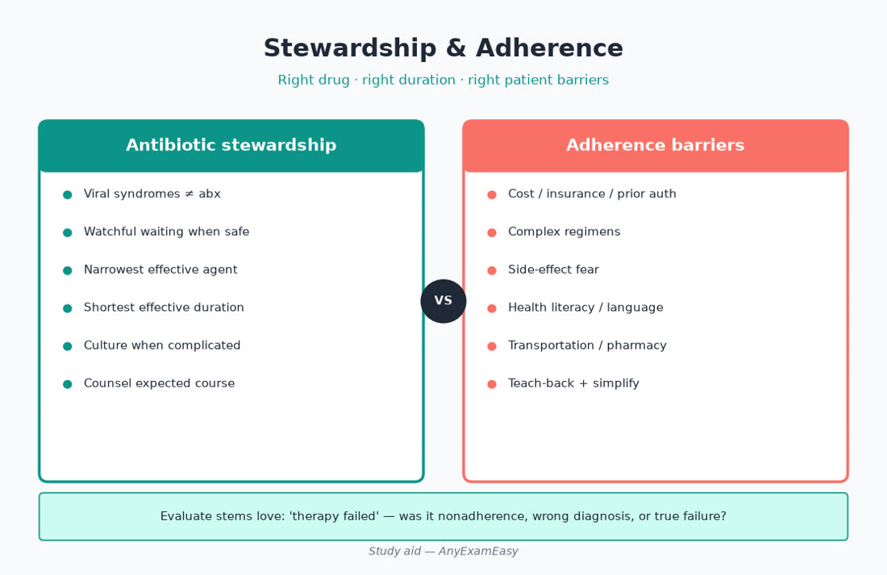

# Chapter 14 — Pharmacology & Prescribing

> **Study aid only.** Prescribing principles for exam judgment — not individualized therapy, not legal advice, not a protocol. Verify DEA/state rules, Beers Criteria updates, pregnancy/lactation resources (PLLR labeling), FDA labeling, renal/hepatic dosing references, and the AANPCB Candidate Handbook. When drugs or intervals appear below, treat them as **teaching themes to verify**, not standing orders.

---

> **MUST KNOW** — Every Rx passes safety filters: allergy, pregnancy/lactation, renal/hepatic, interactions, fall risk, cost/adherence, monitoring plan.

> **HIGHLIGHT** — Scan MUST KNOW / TRAP boxes before bed — they are your sprint sheet.

> **TRAP** — Fixing polypharmacy by adding another drug; memorizing mg without disposition and lifespan twists.

> **LIFESPAN** — Older Adult 30% = Beers + start-low-go-slow; Young Adult* = teratogen and lactation awareness.

#### Critical checklist — open this chapter
- [ ] I can name the chapter’s can’t-miss safety stops
- [ ] I know one prenatal and one older-adult twist
- [ ] I will do practice questions after reading

## Why this chapter matters

Therapeutics is not a siloed “pharm chapter” on the AANPCB exam — it is woven through **Plan (26.5%)** and **Evaluate (15%)** on nearly every adult stem, and Domain II makes **Older Adult 30%** a Beers/polypharmacy reality check. Prenatal content inside **Young Adult\* 22%** means ACEI/ARB, isotretinoin systems, valproate, warfarin, methotrexate, and tetracycline/fluoroquinolone themes are high-stakes filters, not trivia.

Expect stems on prescribing principles, geriatric potentially inappropriate meds, pregnancy/lactation teratogen awareness, CYP/QT/bleed interactions, controlled-substance judgment (PDMP, naloxone, opioid+benzo risk), antibiotic stewardship, systemic steroid counseling, insulin safety, and adherence/cost/SDoH barriers. Candidates who recall a drug name but skip monitoring lose Evaluate points; candidates who prescribe ACEI to a pregnant patient lose dangerous ones.

**Pair with practice:** After each topic block, run related items in a strong Qbank, review every miss, and tag your error log with age band + ADPE stage. Soft start: [anyexameasy.com](https://anyexameasy.com) ($27.99/mo after trial; trial terms on site).

---

## ADPE lens for prescribing

| Domain I process | What it looks like in pharm stems |
| --- | --- |
| **Assess (32%)** | Med reconciliation (including OTC/herbals), true allergy vs intolerance, pregnancy/pregnancy potential, CrCl/hepatic clues, QT risk factors, fall risk, substance use, SDoH (cost, literacy, pharmacy access), PDMP when controlled substances considered |
| **Diagnose (26.5%)** | Is the drug even indicated? Adverse drug effect vs new disease? Therapeutic failure vs nonadherence vs wrong diagnosis? |
| **Plan (26.5%)** | Right drug/dose/duration; safer alternative on Beers; teratogen avoidance; interaction check; teach-back; naloxone when opioid risk; stewardship duration |
| **Evaluate (15%)** | Labs (K/Cr, INR, A1c, LFTs, drug levels when used), refill gaps, adverse effects, deprescribing opportunities, revise regimen |

**Red-flag filter first:** anaphylaxis, Stevens–Johnson cues, serotonin syndrome/NMS themes, hypoglycemia unresponsiveness, major bleed on anticoag, overdose — ED before clever outpatient titration.

---

## Topic A — Prescribing principles (the filter every time)

### The “every Rx” checklist

| Filter | Ask |
| --- | --- |
| Indication | Does evidence/guideline theme support this drug for this problem? |
| Allergy | IgE/anaphylaxis vs GI upset vs delayed rash — documentation quality matters |
| Pregnancy / lactation / pregnancy potential | Teratogen check before writing |
| Renal / hepatic | Adjust or avoid |
| Interactions | CYP, transporters, QT, serotonin, warfarin/DOAC, additive sedation |
| Falls / cognition (esp. older adults) | Anticholinergics, benzos, Z-drugs, opioids |
| Formulation / route | Can they swallow? Split tablets? Insulin pen technique? |
| Adherence / cost / SDoH | Prior auth, $4 lists, once-daily options, pill burden |
| Monitoring | What lab/symptom and when? Who closes the loop? |
| Duration / stop date | Especially antibiotics, steroids, controlled substances |

### Allergy vs intolerance (exam nuance)

“Penicillin allergy” often isn’t IgE-mediated. Wrong labels drive broader/more toxic antibiotics. Assess reaction type/timing; don’t casually rechallenge anaphylaxis history — use safe pathways/specialty when needed.

### Teach-back is Plan

Name, purpose, how to take, what to expect, red-flag stop symptoms, follow-up labs. Literacy-plain language. Interpreter when needed.

> **MUST KNOW** — A complete prescription includes a monitoring and follow-up plan — Evaluate is scored.

> **TRAP** — Copying last clinic’s regimen without reconciling today’s CrCl, pregnancy status, and new interactors.

---

## Topic B — Beers Criteria & geriatric prescribing

### Core idea

Beers Criteria flag **potentially inappropriate medications** in older adults when safer alternatives exist — not absolute bans, but exam loves “pick the safer plan.”

### High-yield classes (themes — verify current Beers update)

| Class / example themes | Why risky in many older adults | Safer thinking |
| --- | --- | --- |
| First-gen antihistamines (diphenhydramine, etc.) | Anticholinergic: delirium, constipation, retention, falls | Non-sedating options / sleep hygiene |
| Benzodiazepines / Z-drugs | Falls, confusion, dependence | Treat cause of insomnia/anxiety; nonpharm first |
| Strong anticholinergics (e.g., some bladder agents, TCAs) | Cognitive harm, retention | Topical/behavioral / safer agents |
| Chronic systemic NSAIDs | GI bleed, AKI, HF exacerbation | Topical NSAID, acetaminophen, treat disease |
| Sliding-scale insulin alone | Hypoglycemia without basal plan | Physiologic regimens; simplify |
| Muscle relaxants (many) | Sedation/falls | PT, treat cause |
| PPIs beyond indicated duration | Infection/fracture themes with prolonged use | Deprescribe when indication gone |
| Sulfonylureas (esp. long-acting) in frail | Hypoglycemia/falls | Prefer agents with lower hypo risk when appropriate |

### Start low, go slow — then still get to goal when benefit clear

Underdosing forever isn’t “safe” if HTN/HF/diabetes need evidence-based therapy — balance frailty against disease risk.

### Deprescribing is Plan

Each visit: what can stop? Cascade (drug A causes symptom → drug B) is classic Older Adult trap.

> **LIFESPAN** — Older Adult: Beers + orthostasis + CrCl + caregiver administration system.

> **TRAP** — Adding oxybutynin + diphenhydramine + amitriptyline in a confused elder.

---

## Topic C — Pregnancy & lactation teratogen awareness

### Mindset

Pregnancy labeling moved from letter categories to **PLLR** narratives — exams still expect recognition of **classic teratogens / fetal toxicity themes**. When pregnancy possible: test before starting high-risk drugs; switch known teratogens immediately with Ob collaboration.

### High-yield “hard no / urgent switch” themes (verify labels)

| Theme | Why it matters |
| --- | --- |
| ACEI / ARB | Fetal renal toxicity / teratogenicity themes — switch per Ob guidance |
| Isotretinoin / iPLEDGE-type systems | Severe teratogen — REMS awareness |
| Valproate | Neural tube / neurodevelopmental risk — avoid in pregnancy potential when alternatives exist |
| Warfarin | Teratogenicity — anticoagulation plans change in pregnancy (specialty) |
| Methotrexate | Abortifacient/teratogen — contraception counseling when used |
| Tetracyclines / fluoroquinolones | Teeth/bone and pregnancy caution themes |
| NSAIDs (later pregnancy) | Fetal renal / ductus themes — timing matters; verify Ob guidance |
| Live vaccines | Pregnancy caution (ACIP) |
| Statins | Labeling evolved — many stems still treat as avoid unless told otherwise; **verify current** |

### Lactation

Most antibiotics used in primary care have lactation data — still check a reliable resource. Avoid assuming “natural = safe” herbals. Radioactive iodine and select cytotoxics are incompatible themes.

### Contraception when on teratogens

Shared responsibility: effective contraception + documented counseling when prescribing known teratogens to people with pregnancy potential.

> **MUST KNOW** — ACEI/ARB hard stop/switch in pregnancy; isotretinoin/methotrexate/valproate/warfarin = high-alert teratogen themes.

---

## Topic D — Interactions: CYP, QT, bleed, serotonin

### CYP / transporter classics

| Pair theme | Risk |
| --- | --- |
| Simvastatin/lovastatin + strong CYP3A4 inhibitors (e.g., clarithromycin, certain azoles, some HIV meds) | Myopathy/rhabdo risk ↑ |
| Many psychotropics / macrolides / azoles / antiarrhythmics | Check before stacking |
| Rifampin inducer themes | Failures of OCPs, DOACs, etc. |
| Grapefruit (selected drugs) | ↑ levels themes |

### QT stacking

Additive QT risk: certain psychotropics, macrolides, fluoroquinolones, antiemetics, methadone themes — especially with hypokalemia/hypomagnesemia, female sex, structural heart disease, congenital long QT. Know the **concept**: don’t stack casually; check ECG when risk high.

### Bleed risk stacks

| Stack | Concern |
| --- | --- |
| Warfarin + antibiotics/amiodarone/NSAIDs | INR shifts / bleed |
| SSRI/SNRI + NSAID ± antiplatelet | GI bleed risk ↑ |
| Dual antiplatelet + anticoagulant | “Triple therapy” specialty territory |
| DOAC + strong interactors / acute kidney injury | Dose/accumulation |

### Serotonin syndrome themes

MAOI + SSRI/SNRI/tramadol/linezolid/triptan stacks (variable risk) — agitation, hyperreflexia, clonus, hyperthermia → ED. Don’t memorize every pairwise table; recognize **poly-serotonergic** danger.

### Hard contraindication still tested

**PDE-5 inhibitors + nitrates** → profound hypotension — absolute avoidance theme.

> **MUST KNOW** — PDE-5 + nitrate = hard no. Warfarin + new antibiotic → INR plan, not vibes.

> **TRAP** — Starting clarithromycin for “bronchitis” in a patient on simvastatin 40 mg without interaction check.

---

## Topic E — Controlled substances awareness

### Judgment the exam wants

You are not being asked to recite every CFR clause. You **are** expected to: verify indication, check **PDMP** themes when prescribing controlled substances, assess risk (prior OD, benzo+opioid, SUD, sleep apnea), offer **naloxone** when opioid risk, use lowest effective dose/shortest duration for acute pain, prefer non-opioid pathways for many MSK pains, and know **stimulant diversion** / benzodiazepine dependence risks.

### Opioid + benzodiazepine

Additive respiratory depression — avoid combination when possible; if inherited, deprescribe thoughtfully with safety net.

### Practice logistics (verify current DEA/state)

DEA registration, state controlled-substance rules, e-prescribing mandates, and PDMP use change — exam tests **safe judgment**, not your ability to invent a regulation number. When in doubt on a stem: safer, documented, monitored choice wins.

### Stimulants / benzos / sleepers

Document diagnosis (ADHD criteria themes), cardiac history when relevant, diversion screening, follow-up. Benzodiazepines: short-term situational use preferred over indefinite primary-care cascades; taper caution (withdrawal/seizure risk) — don’t abrupt-stop high-dose long-term users without a plan.

> **MUST KNOW** — Opioid + benzo stack raises overdose risk — avoid when possible; naloxone offer is Plan language.

---

## Topic F — Antibiotic stewardship

### Right drug, dose, duration, indication

- Don’t treat colonization (ASB exceptions limited).
- Don’t treat viral URI/bronchitis/sinus day 2 with azithromycin by default.
- Prefer narrow spectrum when appropriate; use local resistance patterns conceptually.
- Duration: shorter evidence-based courses when guidelines support — don’t invent “14 days because tradition.”
- Penicillin allergy delabeling themes reduce vancomycin/fluoroquinolone overuse.

### High-misuse scenarios on exams

Viral pharyngitis, asymptomatic bacteriuria in elders, OME, early viral sinusitis, “prophylactic” antibiotics for healthy travelers without indication.

### Patient messaging

“Antibiotics won’t shorten this virus and can cause C. diff / rash / resistance” — Plan education that prevents the “but I always get a Z-pak” Evaluate failure.

> **HIGHLIGHT** — Stewardship is scored clinical judgment, not politics.

---

## Topic G — Systemic steroid counseling

### Benefits vs costs

Bursts help asthma/COPD/gout/allergic contact flares when indicated — but hyperglycemia, mood changes, insomnia, HTN, gastritis, infection risk, avascular necrosis with repeated bursts, and HPA suppression with prolonged use are real.

### Counseling that maps to items

- Take with food in morning themes when appropriate.
- Don’t abrupt-stop prolonged courses — taper per indication (adrenal crisis risk).
- Diabetics: expect glucose rises; monitoring plan.
- Live vaccine timing issues with high-dose steroids — verify.
- Recurrent bursts → revisit controller therapy (asthma) or gout prevention — don’t normalize endless packs.

### Topical vs systemic

Potency, site, duration for topicals (see derm chapter) — facial atrophy from chronic high-potency is a classic trap.

> **TRAP** — Unlimited steroid bursts without fixing the underlying controller/prevention plan.

---

## Topic H — Insulin safety & diabetes med themes (primary-care)

### Insulin safety

| Theme | Action |
| --- | --- |
| Hypoglycemia | Teach recognition, glucagon access themes, driving safety |
| Sliding-scale alone in elders | Avoid as sole regimen (Beers) |
| Technique | Pen primes, site rotation, needle length, never share pens |
| Concentration traps | U-100 vs U-500 mix-ups — specialty caution |
| Steroid bursts | Anticipatory insulin adjustment themes with diabetes team when needed |
| Sick-day | When to call; never stop all insulin in T1D (DKA risk) |

### Non-insulin high-yield safety

SGLT2: genital infection, rare DKA (including euglycemic), volume depletion — hold themes perioperatively/illness (verify). GLP-1 RAs: GI effects, rare gallbladder/pancreatitis counseling themes. Sulfonylureas: hypo/falls in frail. Metformin: GI titration; hold in significant AKI; B12 long-term awareness.

> **MUST KNOW** — Type 1 / insulin-deficient patients need basal insulin even when “not eating” — sick-day rules prevent DKA.

---

## Topic I — Adherence, cost & SDoH

### Why Evaluate fails without this

Perfect guideline drug that the patient never obtains = failed Plan. Assess pharmacy deserts, insurance tiers, health literacy, food insecurity (with GLP-1 nausea), transportation to labs, caregiver med admin in assisted living.

### Practical Plan moves

- Prefer generics / first-line affordable classes when efficacy similar.
- Single-pill combinations when helpful.
- 90-day supplies and mail-order when appropriate.
- Screen: “Have you been skipping doses because of cost?”
- Prior-auth documentation — don’t abandon therapy without a bridge plan.
- Community resources / manufacturer assistance awareness without inventing fake programs.

> **HIGHLIGHT** — Asking about cost is Assess; fixing the regimen for reality is Plan.

---

## Clinical vignette 1 — Older adult polypharmacy cascade

**Stem:** 78-year-old with insomnia after starting diphenhydramine for sleep, now confused at night. Also on oxybutynin for urge incontinence, amitriptyline for “neuropathy,” naproxen for knees, and lorazepam prn from a prior clinician. Daughter asks for “something stronger for sleep.”

### Assess
- Older Adult 30%. Anticholinergic + sedative load + NSAID. Confusion may be drug-induced delirium themes. Fall risk.

### Diagnose
- Adverse drug cascade / Beers-laden regimen — not automatic “new dementia diagnosis tonight” without med review.

### Plan
- Deprescribe stepwise: stop diphenhydramine; revisit amitriptyline/oxybutynin; sleep hygiene; treat incontinence with safer approaches; replace naproxen; avoid adding another sedative; consider PT/pain alternatives.

### Evaluate
- Cognition/falls after deprescribing; BMP if NSAID stopped/started alternatives; caregiver teach-back.

### Why distractors fail
- Add zolpidem.
- CT head first without med review in this context as the only move.
- Increase amitriptyline for sleep.

---

## Clinical vignette 2 — Young adult\* pregnancy discovery on lisinopril

**Stem:** 31-year-old with HTN on lisinopril; positive home pregnancy test today, LMP ~5 weeks ago. BP 128/78. Anxious. Also takes occasional ibuprofen for headaches.

### Assess
- Young Adult* prenatal mapping. Confirm pregnancy. Med list teratogen filter.

### Diagnose
- ACEI exposure in early pregnancy — needs regimen change and Ob coordination; NSAID counseling for later pregnancy timing.

### Plan
- Stop ACEI; switch to obstetric-preferred antihypertensive themes (verify current Ob guidance — historical teaching examples include labetalol/nifedipine/methyldopa). Urgent prenatal entry. Avoid starting new teratogens. Document counseling.

### Evaluate
- Confirm Ob linkage; BP control on new agent; emotional support.

### Why distractors fail
- Continue lisinopril “until first prenatal visit in 8 weeks.”
- Add ARB.
- High-dose NSAID indefinitely.

---

## Clinical vignette 3 — Antibiotic + warfarin + azithromycin request

**Stem:** 68-year-old with AF on warfarin (INR usually 2.3). URI day 2, wants azithromycin. Also on simvastatin. No pneumonia findings; SpO₂ 98%.

### Assess
- Viral URI likely. Interaction: macrolide–warfarin INR shift themes; macrolide–simvastatin myopathy themes; stewardship.

### Diagnose
- Viral bronchitis/URI — antibiotic not indicated; interaction risk if prescribed anyway.

### Plan
- Supportive care; no azithromycin; counsel INR if any antibiotic later needed; review statin choice if macrolide ever truly required; return precautions for dyspnea/hypoxia.

### Evaluate
- Symptom diary; reinforce vaccine; avoid “just in case” abx pattern.

### Why distractors fail
- Azithromycin + “check INR someday.”
- Levofloxacin automatic for viral URI.
- Stop warfarin for the week “to be safe” without indication.

---

## Exam traps / common miss patterns

| Trap | What to do instead |
| --- | --- |
| ACEI/ARB in pregnancy | Stop/switch + Ob pathway |
| Dual ACEI+ARB | Avoid |
| PDE-5 + nitrate | Absolute avoidance |
| Beers meds stacked in elders | Deprescribe / safer alternatives |
| Antibiotic for viral URI | Stewardship messaging |
| Warfarin + new abx without INR plan | Schedule monitoring |
| Opioid + benzo casually | Avoid; naloxone; taper plans |
| Sliding-scale insulin alone in frail elder | Safer physiologic regimen |
| Steroid burst without teach-back | Glucose/mood/taper counseling |
| Ignoring cost nonadherence | SDoH-adjusted Plan |

---

## Quick checklist — pharmacology & prescribing

- [ ] Indication + allergy type clarified
- [ ] Pregnancy / lactation / pregnancy potential checked
- [ ] CrCl / hepatic adjustment considered
- [ ] Interaction check (CYP, QT, bleed, serotonin, PDE-5/nitrate)
- [ ] Beers / fall risk in Older Adult
- [ ] Controlled substance: PDMP, risk, naloxone, duration
- [ ] Antibiotic: right indication/duration
- [ ] Steroid: indication, glucose, taper if prolonged
- [ ] Insulin: hypo teaching, avoid sliding-scale-only in frail
- [ ] Cost/adherence/SDoH addressed
- [ ] Monitoring labs and follow-up dated (Evaluate)
- [ ] Teach-back completed

---

## Remember this

- Pharm is Plan + Evaluate across the blueprint — not a memorized orphan list.
- Older Adult 30% makes Beers and deprescribing high-yield.
- Prenatal-in-YA* makes teratogen filters non-optional.
- Independent study aid — not AANPCB/AANP; no pass guarantee.

**Next practice move:** Drill Beers, teratogens, interactions, stewardship, steroid/insulin safety, and controlled-substance judgment items on [AnyExamEasy](https://anyexameasy.com) — start free; $27.99/mo after trial (trial terms on site).

---

## Topic J — High-alert outpatient drugs (primary-care ownership)

| Drug theme | Ownership hooks |
| --- | --- |
| Anticoagulants | Indication still valid? CrCl? Bleed? Peri-procedure holds with specialty |
| Insulin / SU | Hypo prevention; frailty |
| Immunosuppressants | Infection risk; live vaccines; drug levels specialty |
| Digoxin | Toxicity in AKI/elders; interaction awareness |
| Lithium | Levels, sodium/dehydration, NSAID interaction |
| Methotrexate | Weekly not daily trap; folate; infection; teratogen |
| Amiodarone | Thyroid/liver/lung monitoring if continued in primary care |

**Methotrexate daily dosing errors** are catastrophic — weekly dosing verification is classic safety teaching.

---

## Topic K — Counseling scripts that map to Plan items

- “This blood pressure medicine is unsafe in pregnancy — we change it the day we know.”
- “Benadryl every night can confuse older brains — let’s fix sleep another way.”
- “If you take Viagra-type medicine, you cannot take nitroglycerin.”
- “Starting an antibiotic on warfarin means we need an INR plan.”
- “Antibiotics won’t fix a virus — and they can cause serious diarrhea.”
- “Steroids can raise sugar and mood changes — call us for warning signs.”
- “Never share insulin pens; tell me if cost is the reason doses are missed.”
- “If you take opioid pain medicine, we’ll offer naloxone and avoid sleeping pills when we can.”

---

## Integrated older-adult multimorbidity mini-case (Domain II 30%)

**Stem vibe:** 83-year-old with CKD-3, AF on apixaban, T2D on glyburide, chronic lorazepam, knee OA on naproxen, new “Z-pak” from urgent care for viral cough, daughter reports daytime sleepiness and a near-fall.

**ADPE compressed:** Assess CrCl trend, hypo risk (SU), bleed risk (NSAID+DOAC), sedation (benzo), stewardship fail (macrolide). Diagnose: iatrogenic risk stack > undertreated cough. Plan: stop NSAID; safer analgesia; deprescribe/taper benzo with support; replace glyburide with lower-hypo agent themes if appropriate; stop unnecessary antibiotic; pharmacy med sync; PT/fall review. Evaluate: BMP/glucose, fall calendar, adherence, bleeding.

---

## Concept checks

**1.** Pregnant patient on lisinopril — best Plan?  
A. Continue until third trimester  B. Stop/switch per Ob-aligned agents and enter prenatal care  C. Add ARB  D. Double the dose  
**Answer:** B.

**2.** PDE-5 inhibitor last night, now chest pain needing nitrate consideration?  
A. Give nitrate freely  B. Respect absolute contraindication timing themes — ED pathway without nitrate  
C. Double nitrate  D. Add another PDE-5  
**Answer:** B.

**3.** Older adult insomnia — least appropriate long-term Plan?  
A. Sleep hygiene  B. Chronic diphenhydramine  C. Review caffeine/naps  D. Treat depression if present  
**Answer:** B.

**4.** Warfarin patient starts TMP-SMX for true bacterial infection — Evaluate priority?  
A. Ignore INR  B. INR monitoring plan  C. Stop warfarin permanently always  D. Add aspirin automatically  
**Answer:** B.

**5.** Best stewardship response to viral URI day 2?  
A. Azithromycin “just in case”  B. Supportive care + return precautions  C. IV vancomycin  D. Lifelong prophylaxis  
**Answer:** B.

---

> **TRAP** — Skipping Evaluate (INR, BMP, A1c, refill gaps) because the e-Rx felt complete.

> **TRAP** — Using ANCC weights while sitting AANPCB (or the reverse).

---

## Deep dive — Renal dosing mindset (Older Adult gold)

CrCl declines with age even when serum Cr “looks fine.” Before DOAC dosing themes, gabapentinoid titration, nitrofurantoin in low CrCl, metformin in significant AKI, and many antivirals — **think kidney**. Hold nephrotoxins in acute illness (NSAIDs, some ACEi combinations with diuretic/NSAID “triple whammy”).

## Deep dive — The prescribing timeout (30 seconds)

Before send: (1) indication, (2) pregnancy, (3) CrCl, (4) top 3 interactors on this patient’s list, (5) monitoring date, (6) cost ask. That timeout is Domain I Plan in miniature.

## Deep dive — Documentation phrases that mirror scored Plan

- “PDMP reviewed; naloxone offered; lowest dose/shortest course; non-opioid alternatives discussed.”  
- “Pregnancy test negative prior to teratogen; contraception counseling documented.”  
- “Beers-aware: avoided diphenhydramine; chose topical NSAID.”  
- “Antibiotic not indicated for viral URI; return precautions given.”  
- “INR check arranged 3–5 days after antibiotic start.”

## Final pharmacology sprint table

| Filter | Hook |
| --- | --- |
| Teratogen | ACEI/ARB, isotretinoin, MTX, valproate, warfarin |
| Beers | Anticholinergics, benzos/Z-drugs, NSAIDs, SU, sliding-scale alone |
| Interact | CYP3A statin+inhibitor; QT stacks; warfarin+abx; SSRI+NSAID; PDE-5+nitrate |
| Controlled | PDMP, naloxone, opioid+benzo avoid, short acute courses |
| Stewardship | No viral Z-pak; no elder ASB treatment |
| Steroid | Glucose/mood/taper; fix controllers |
| Insulin | Hypo teaching; sick-day; no sliding-scale-only frail |
| SDoH | Cost ask; simplify; 90-day fills |

---

## Critical callouts — pharmacology (scan tonight)

> **MUST KNOW** — Pregnancy filter before ACEI/ARB and other teratogens.

> **MUST KNOW** — PDE-5 + nitrates absolute no; opioid + benzo risk.

> **MUST KNOW** — Beers + deprescribing for Older Adult Plan.

> **HIGHLIGHT** — Stewardship + interaction checks + cost adherence = full Plan.

> **TRAP** — Polypharmacy fix = add drug; Z-pak for viruses; sliding-scale-only insulin in frail elders.

> **LIFESPAN** — Start low go slow in elders; teratogen/lactation checks in YA*.

#### Critical checklist — pharm tonight
- [ ] Teratogen / Beers / interaction filters
- [ ] Stewardship + controlled-substance safety
- [ ] Monitoring = Evaluate
