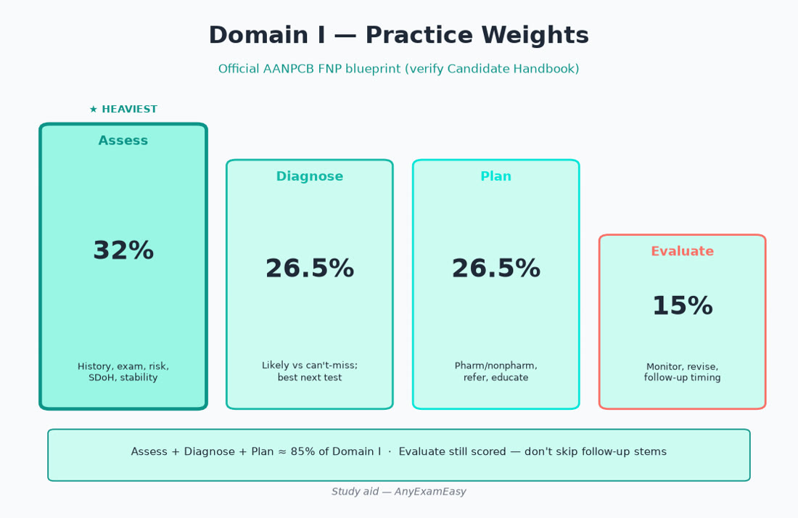
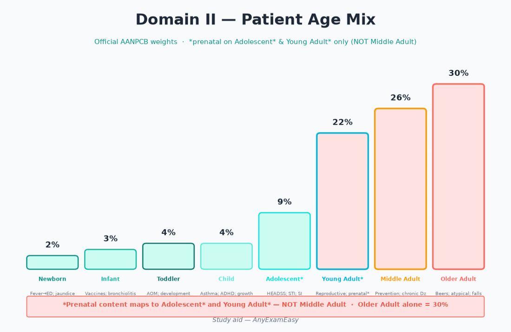
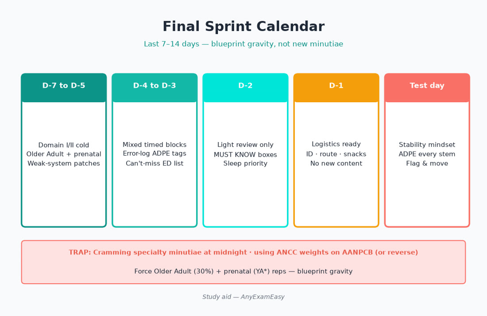
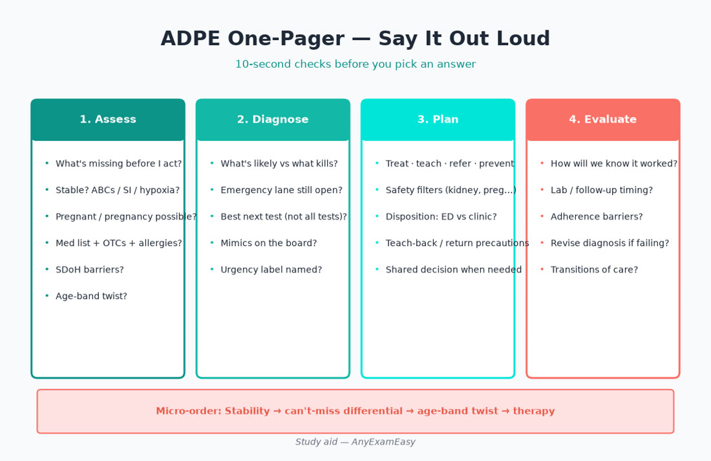
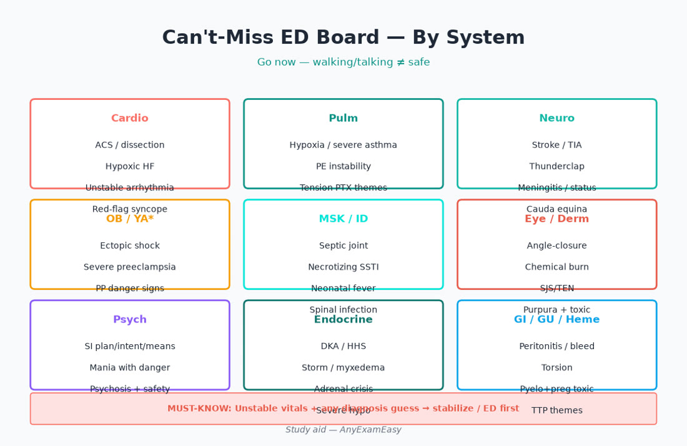

# Chapter 15 — Quick Reference

> **Study aid only.** Pocket sheets for the final sprint — verify the official AANPCB Candidate Handbook, current guidelines, and FDA labeling. No invented weights. Teaching themes only.

---

> **MUST KNOW** — 150 questions total = **135 scored** + **15 pretest**. Treat every item seriously.

> **HIGHLIGHT** — Older + Middle + Young Adult\* ≈ most of Domain II weight. Evaluate is only 15% — still scored; don’t skip follow-up answers.

> **TRAP** — Cramming new specialty minutiae at midnight; using ANCC weights on an AANPCB exam (or the reverse).

> **LIFESPAN** — If you only studied “healthy 45-year-old,” reopen Older Adult and prenatal cards tonight.

#### Critical checklist — open this chapter
- [ ] Domain I/II tables memorized cold
- [ ] ADPE one-pager rehearsed aloud
- [ ] Can’t-miss ED list skimmed by system

---

## Domain I — Practice (official AANPCB)

| Process | Items | Weight | What “right” feels like on a stem |
| --- | ---: | ---: | --- |
| **Assess** | 43 | **32%** | Missing data, stability, pregnancy, meds, SDoH, focused exam |
| **Diagnose** | 36 | **26.5%** | Likely vs can’t-miss vs mimics; urgency label |
| **Plan** | 36 | **26.5%** | Treat, teach, refer, prevent; safety filters |
| **Evaluate** | 20 | **15%** | Labs, adherence, revise diagnosis, transitions |

**Coach cue:** Before you pick a drug, name the ADPE verb the item is testing.

---

## Domain II — Patient Age (official AANPCB)

| Age band | Weight | Sprint hooks |
| --- | ---: | --- |
| Newborn | **2%** | Fever → ED; jaundice timing; feeding |
| Infant | **3%** | Vaccines; bronchiolitis themes; serious bacterial worry when toxic |
| Toddler | **4%** | Foreign body; development; accidental ingestions |
| Child | **4%** | Asthma; AOM stewardship; growth |
| Adolescent* | **9%** | SI confidentiality; mono; STI; sports clearance |
| Young Adult* | **22%** | Prenatal*; contraception MEC; STI; HTN meds teratogens |
| Middle Adult | **26%** | Cardiometabolic; cancer screens; MSK |
| Older Adult | **30%** | Beers; falls; atypical ACS/infection; deprescribe; anemia source |

\*Includes prenatal / reproductive content mapping.

> **MUST KNOW** — Older Adult alone is **30%**. Under-practicing it is a blueprint error, not a preference.

---

## ADPE one-pager (say it out loud)

| Step | One-liner | 10-second check |
| --- | --- | --- |
| **1. Assess** | “What’s missing before I act?” | Stable? Pregnant? Med list? SDoH? |
| **2. Diagnose** | “What’s likely vs what kills?” | Emergency lane still on the board? |
| **3. Plan** | “Treat, teach, refer, prevent.” | Safety filters + teach-back + disposition |
| **4. Evaluate** | “How will we know it worked?” | Lab timing, return precautions, revise |

**Micro-order on tough stems:** Stability → can’t-miss differential → age-band twist → therapy.

---

## Can’t-miss ED / EMS list by system

| System | Can’t-miss cues (go now) |
| --- | --- |
| **Cardio** | ACS/anginal equivalent; dissection tearing pain; hypoxic HF; unstable arrhythmia; syncope with cardiac red flags |
| **Pulm** | Hypoxia; severe asthma/COPD; PE instability; tension pneumothorax themes |
| **Neuro** | Stroke/TIA; thunderclap; meningitis; status; cauda equina |
| **OB / YA*** | Ectopic shock; preeclampsia severe features; postpartum danger signs |
| **MSK / ID** | Septic joint; necrotizing soft tissue; spinal infection; neonatal fever |
| **Derm** | SJS/TEN mucosal + systemic; purpura + toxicity |
| **Eye** | Acute angle-closure; chemical burn; sudden vision loss; contact-lens keratitis; orbital cellulitis |
| **Psych** | SI with plan/intent/means; mania with danger; psychosis with safety risk |
| **Endocrine** | DKA/HHS; thyroid storm/myxedema; adrenal crisis; severe hypo |
| **GI / GU** | Peritonitis; GI bleed instability; testicular torsion; pyelo in pregnancy with toxicity |
| **Heme** | Severe symptomatic anemia; suspected TTP/DIC themes; febrile neutropenia |

> **MUST KNOW** — Walking, talking patients can still need EMS (ectopic, hypoxia, early sepsis).

---

## Older Adult pearls (Domain II 30%) — pocket

| Pearl | Exam move |
| --- | --- |
| Atypical ACS | Fatigue, confusion, dyspnea — ECG/ED thinking |
| Atypical infection | Falls/confusion; still examine for source |
| Beers | Anticholinergics, benzos/Z-drugs, chronic NSAIDs, SU, sliding-scale insulin alone |
| Orthostasis | Check before aggressive titration |
| CrCl | Dose DOACs, renally cleared drugs carefully |
| Polypharmacy | Deprescribe cascades |
| ASB | Don’t treat asymptomatic bacteriuria routinely |
| Iron deficiency | Find GI source in men / postmenopausal |
| Stasis vs cellulitis | Bilateral chronic ≠ automatic abx |
| Fragility fracture | Elder fall + hip pain → clear fracture |
| Transitions | Med rec within days of discharge |
| Vaccines | Flu, pneumococcal, COVID, zoster per current ACIP |
| SDoH | Cost, caregiver admin, pharmacy access |
| Goals of care | Align intensity with frailty/benefit |

---

## Prenatal do-nots & high-alert themes (Young Adult*)

| Avoid / urgent switch themes | Why (teaching) |
| --- | --- |
| **ACEI / ARB** | Fetal renal toxicity / teratogenicity — switch per Ob |
| **Isotretinoin / REMS teratogens** | Severe birth defects |
| **Methotrexate** | Abortifacient/teratogen |
| **Valproate** | Neural tube / neurodevelopmental risk |
| **Warfarin** | Teratogen — specialty anticoagulation plan |
| **Tetracyclines / fluoroquinolones** | Fetal risk themes |
| **NSAIDs late pregnancy** | Fetal renal / ductus themes — verify timing |
| **Live vaccines** | Pregnancy caution (ACIP) |
| **Statins** | Many stems still treat as avoid — verify current labeling |
| **Misoprostol / other abortifacients** | Obvious — don’t casual-prescribe |

**Also do:** pregnancy test before teratogens and before relevant radiation; Tdap each pregnancy timing themes; influenza vaccine; HIV/syphilis/hep B prenatal screens; ectopic always on board with first-trimester pain/bleeding; MEC for contraception when not pregnant.

---

## Drug-safety strip (night-before)

| Rule | Example hook |
| --- | --- |
| No ACEI/ARB in pregnancy | Switch same day |
| No PDE-5 + nitrates | Hard stop |
| No LABA alone in asthma | ICS-containing controller |
| SU caution in frail elders | Hypo/falls |
| Warfarin + new abx | INR plan |
| Steroids — don’t abrupt stop prolonged courses | Adrenal crisis risk |
| Opioid + benzo | Avoid; offer naloxone |
| Methotrexate | Weekly — never daily mix-up |
| Simvastatin + strong CYP3A4 inhibitor | Myopathy risk |
| Triple whammy | NSAID + ACEI/ARB + diuretic → AKI risk |

> **HIGHLIGHT** — Safety filters beat memorized mg doses.

---

## Screening sprint (verify USPSTF / ACIP current)

| Item | Hook |
| --- | --- |
| BP / lipids / diabetes | Cardiometabolic core |
| Cervical / breast / CRC / lung | Age/risk + shared decisions |
| HIV / hep C | Offer per current adult themes |
| Depression / SI | + safety pathway |
| Intimate partner violence | Screen + resources |
| AAA / osteoporosis | Age/sex/risk themes |
| Vaccines | ACIP yearly — live vaccine pregnancy caution |
| STI | YA* and risk-based |

> **MUST KNOW** — Symptoms → diagnostic testing now, not “routine screening next year.”

---

## System can’t-miss micro-cards

### Cardio
HTN technique + out-of-office · emergency vs urgency · ACS/PE/dissection board · HF hypoxia → ED · AF anticoag ≠ rate control · PDE-5+nitrate

### Pulm
Asthma ICS controller · no LABA alone · COPD O2/exacerbation · CAP site-of-care · PE risk · hypoxia any virus → ED

### Endocrine
DKA/HHS · hypo safety · SGLT2 sick-day · thyroid storm/myxedema rare but disposition · osteoporosis after fragility fracture

### GI / Hepatic
Peritonitis · GI bleed · cholecystitis · HBV/HCV linkage · don’t ignore adult iron-deficiency source

### Renal / GU
AKI triple whammy · pyelo disposition · male/pregnant UTI twists · torsion · elder ASB trap

### Women’s / prenatal
Ectopic · preeclampsia · MEC contraception · teratogen list · postpartum BP/blues vs psychosis

### Peds
Neonatal fever · bronchiolitis supportive · AOM stewardship · foreign body · vaccine catch-up themes

### Psych / neuro
SI plan · serotonin syndrome · stroke window thinking · SNOOP secondary headache · status epilepticus · dementia vs delirium

### MSK / derm
Cauda · septic joint · elder hip · ABCDE · SJS/TEN · cellulitis vs stasis

### ENT / eyes / ID
Angle-closure · contact-lens keratitis · Centor strategy · mono ≠ amoxicillin · HIV/hep offer

### Pharm
Beers · teratogens · interactions · stewardship · PDMP/naloxone · Evaluate labs

---

## Final 7-day sprint plan (−7 to −1)

| Day | Focus | Deliverable |
| --- | --- | --- |
| **−7** | Full timed set (or half+half) | Error log by ADPE + age band |
| **−6** | Cardio + pulm weak misses | Redo missed rationales aloud |
| **−5** | Endocrine + renal/GU | Beers + CrCl filters |
| **−4** | Women’s + prenatal + peds fever | Teratogen + ectopic + neonatal fever |
| **−3** | Psych safety + neuro red flags + MSK/derm emergencies | SI pathway; cauda; septic; SJS/TEN |
| **−2** | Pharm + Domain I/II tables + this chapter’s ED list | Say Domain % cold; drug-safety strip |
| **−1** | Light only | IDs, route, snacks, sleep — **no new resources** |

**Daily non-negotiables (even on light days):** 1× ADPE card aloud · 1× Older Adult pearl · 1× prenatal do-not.

> **TRAP** — Opening a brand-new 600-page resource the night before.

---

## Error-log tags (use with any Qbank)

| Tag | Meaning |
| --- | --- |
| A / D / P / E | Which Domain I process failed |
| NB / INF / TOD / CH / ADOL / YA / MA / OA | Age band |
| PREN | Prenatal twist missed |
| DISP | Wrong disposition (clinic vs ED) |
| STEW | Stewardship miss |
| INTX | Interaction miss |
| SDoH | Cost/adherence ignored |

Fix patterns, not only single facts.

---

## Night-before logistics checklist

- [ ] Government ID + appointment confirmation / Pearson VUE rules skimmed
- [ ] Domain I table (32 / 26.5 / 26.5 / 15) recited
- [ ] Domain II table (esp. OA 30, MA 26, YA 22) recited
- [ ] Can’t-miss ED list skimmed once
- [ ] Prenatal do-nots skimmed once
- [ ] Beers / nitrate / ACEI pregnancy rules skimmed once
- [ ] Sleep plan protected (alarm tested)
- [ ] Travel time buffer
- [ ] No new textbooks
- [ ] Calm coach voice: “Stability → ADPE → lifespan”

---

## Walk-into-the-center card

1. Read the stem for **stability** first.  
2. Name **Assess** gaps before treating.  
3. Keep **can’t-miss** on the board.  
4. Apply **age band** (OA / prenatal).  
5. Pick Plan that includes **teach + follow-up**.  
6. If two answers seem right, the one that matches the **scored verb** wins.

---

## Soft CTA — last practice sets

Finish weak areas with exam-style items and full rationales on [AnyExamEasy](https://anyexameasy.com) — start free; **$27.99/mo after trial** (trial terms on site). Independent study aid — not AANPCB/AANP; no pass guarantee.

---

## Critical callouts — quick ref (scan tonight)

> **MUST KNOW** — Domain I: Assess 32%, Diagnose 26.5%, Plan 26.5%, Evaluate 15%.

> **MUST KNOW** — Domain II: Older Adult **30%**, Middle Adult **26%**, Young Adult* **22%**.

> **HIGHLIGHT** — ADPE aloud + can’t-miss ED list + prenatal do-nots = highest-yield hour before sleep.

> **TRAP** — New resources on −1; ignoring Evaluate options; age-blind answers.

> **LIFESPAN** — OA atypical disease + Beers; YA* teratogens/ectopic/prenatal screens.

#### Critical checklist — night before
- [ ] Sleep protected
- [ ] Blueprint numbers cold
- [ ] Red flags + Beers/pregnancy/nitrate rules
- [ ] Calm ADPE voice
