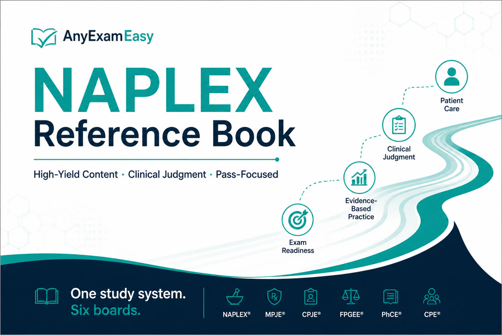

# AnyExamEasy NAPLEX Reference Book

**Subtitle:** Pass-Focused Pharmacist Judgment Companion for the NAPLEX (2025+ Content Outline)

**For:** NAPLEX candidates (PharmD graduates and FPGEC-certified foreign-educated pharmacists)  
**From:** [AnyExamEasy](https://anyexameasy.com)  
**Edition framing:** NABP Content Outline effective for exams on/after **May 1, 2025** (still the current outline into 2026 unless NABP publishes a newer change)

---

## Study-aid disclaimer (read this)

This book is a **study aid for exam preparation**. It is **not**:

- Clinical or pharmacy practice advice, a treatment protocol, or a dispensing directive  
- A substitute for your PharmD curriculum, APPE/IPPE preceptors, residency, or employer policy  
- An official **NABP** publication or replacement for the NAPLEX Content Outline / Candidate Application Bulletin  

**Always verify** dosing, interactions, compounding standards, immunization schedules, and jurisdiction rules with current official sources (NABP, FDA labeling, USP standards as applicable, CDC/ACIP, major guidelines, and your board of pharmacy). When uncertain, stay directional and confirm before clinical use.

AnyExamEasy does **not** guarantee exam results, licensure, or employment. We are **independent** and not affiliated with NABP, Pearson VUE, or other exam owners. Exam names and trademarks belong to their owners.

---

## How to use this book

1. **Start with Part I (Exam Strategy)** once — format, Content Outline domain weights, pharmacist decision frameworks, study plans, traps, exam day.  
2. **Use Part II (Content chapters)** as a deep reference — read a topic, then immediately practice related questions.  
3. **Keep Part III (Quick Reference)** open in your final week — calc patterns, high-alert themes, counseling hooks, sprint plan.  
4. **Run the learning loop:** topic → 20–40 Qbank items → full rationale review → 3 “remember this” lines in your error log.  
5. **Do not** use this book as your only content source or as a practice protocol.

**Pro tip:** Application beats rereading. A tired 40-question day with honest rationale review beats 150 rushed guesses.

---

## Path note — NAPLEX vs MPJE

This book targets the **NAPLEX** only (one national competency exam).

| Exam | What it tests | This book |
| --- | --- | --- |
| **NAPLEX** | General pharmacy practice knowledge & pharmacist judgment | **Yes — covered** |
| **MPJE** (or state jurisprudence equivalent) | Pharmacy law / jurisdiction rules | **No — separate study** |

You typically need **both** NAPLEX and a jurisprudence exam (often MPJE) for licensure, plus any state-specific requirements. Confirm your board’s process in the official Candidate Application Bulletin and your board of pharmacy website.

---

## Official source of truth

- **NABP NAPLEX Content Outline** (effective May 1, 2025+) — domain weights and topic map  
- **NAPLEX/MPJE Candidate Application Bulletin** — format, eligibility, test-day rules, attempts  
- Primary program page: [nabp.pharmacy/programs/examinations/naplex/](https://nabp.pharmacy/programs/examinations/naplex/)

Third-party guides (including this one) prepare you — they do **not** replace NABP documents.

---

## Table of contents

**Part I — Exam Strategy**  
1. Exam Strategy (format, domains, frameworks, plans)

**Part II — Content Reference**  
2. Foundational Knowledge for Pharmacy Practice  
3. Calculations  
4. Medication Use Process  
5. Cardiology  
6. Infectious Disease  
7. Endocrine  
8. Respiratory  
9. Neuro / Psych  
10. Renal / Hepatic  
11. Oncology / Hematology  
12. OTC & Self-Care  
13. Special Populations  
14. Professional Practice & Operations

**Part III — Quick Reference & Close**  
15. Quick Reference  
16. Back Matter (FAQ, CTA, legal)

---

## Pairing with AnyExamEasy

| Piece | Role |
| --- | --- |
| **This book** | Foundation & strategy — domains, frameworks, high-yield therapeutics, calc patterns |
| **AnyExamEasy Qbank** | Active practice — exam-style items, teachable rationales, Blueprint Roadmaps, mocks |

**Start free** on [anyexameasy.com](https://anyexameasy.com) — try a free question, explore the NAPLEX bank, and upgrade when you’re ready ($27.99/mo after trial; trial terms on site).
