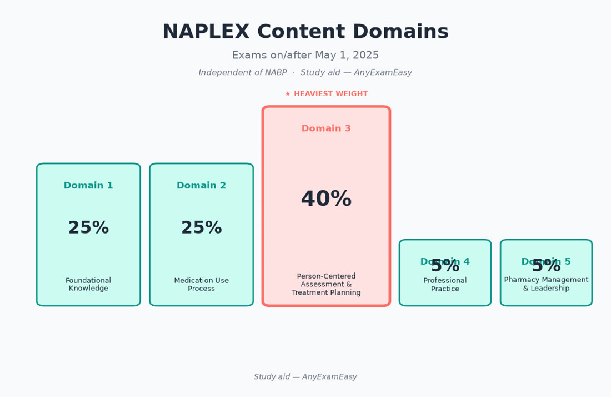
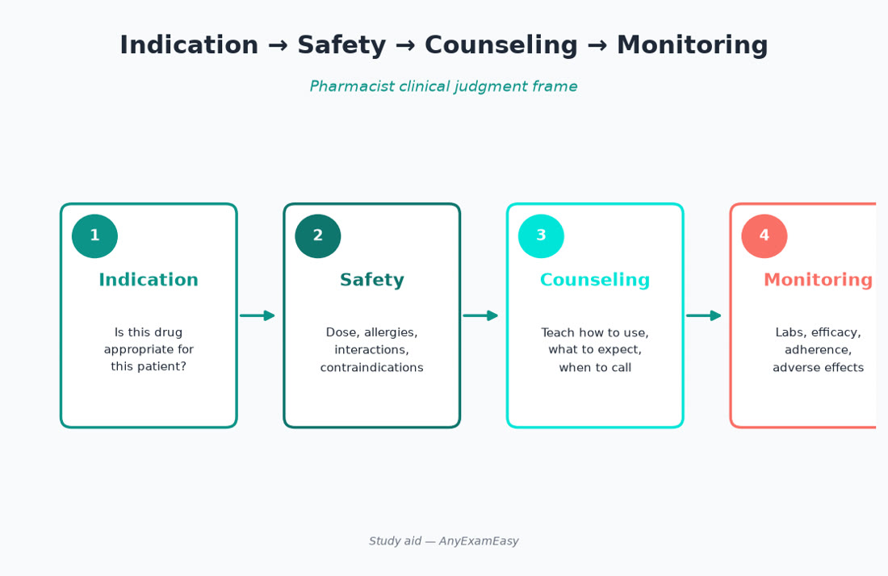
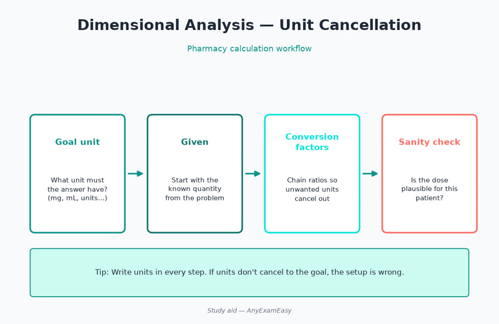

# Chapter 1 — Exam Strategy (Part I)

> **Study aid only.** Strategy framing for the NAPLEX under the NABP Content Outline (exams on/after May 1, 2025). Confirm current rules in the official Candidate Application Bulletin. Not affiliated with NABP.

---

## Why this chapter matters

The NAPLEX asks: **Can you practice as an entry-level pharmacist safely and competently?** Domain 3 (Person-Centered Assessment and Treatment Planning) alone is about **40%** of scored items — so memorizing drug lists without patient-centered judgment will not carry you. This chapter teaches how the exam is built, how to allocate study time, and how to answer like a pharmacist.

---

## How the NAPLEX works (plain English)

### The big picture

| Fact | Detail (verify in current NABP bulletin) |
| --- | --- |
| Style / delivery | Computerized **fixed-form** exam (not CAT) at Pearson VUE |
| Length | **225** questions total — **200 scored** + **25 pretest** (you won’t know which) |
| Time | **6 hours** of exam time (appointment includes extra time for screens/NDA — see bulletin) |
| Breaks | Typically **two optional ~10-minute** breaks at prompted intervals (often around items ~75 and ~150 — confirm bulletin) |
| Navigation | Generally **no skipping / no returning** once you submit an item — pace carefully |
| Scored focus | Five Content Outline domains (weights below) |
| Result | **Pass/fail** reported to boards; attempt limits apply (commonly max **5** lifetime attempts; **3** per 12-month period — confirm bulletin / board) |

**What fixed-form + no-return means for you:** Every item counts toward pace. Don’t burn three minutes on a calc you can flag mentally and move on — but you also can’t “come back later,” so make a best decision and proceed.

### Content Outline domains (official weights)

**Source of truth: NABP NAPLEX Content Outline**, effective for exams beginning **May 1, 2025** (still current into 2026 unless NABP announces otherwise). Approximate weights assume ~200 scored items:

| Domain | Focus | Exam weight (approx. scored items) |
| --- | --- | --- |
| **1. Foundational Knowledge for Pharmacy Practice** | Pharmaceutical sciences, PK/PD themes, compounding/pharmaceutics, literature/biostats basics | **25%** (~50) |
| **2. Medication Use Process** | Prescribe → transcribe/document → dispense → administer → monitor; substitutions; immunizations; med safety | **25%** (~50) |
| **3. Person-Centered Assessment and Treatment Planning** | Histories, conditions, regimens, monitoring plans, counseling — patient-centered care | **40%** (~80) |
| **4. Professional Practice** | Ethics, public health, professional responsibilities | **5%** (~10) |
| **5. Pharmacy Management and Leadership** | Operations, inventory, workflow, leadership themes | **5%** (~10) |

**Study implication:** Domains 1–3 are ~**90%** of the exam. Don’t ignore 4–5, but don’t let inventory SOP trivia crowd out therapeutics and patient assessment.

### Question flavors (high-level)

NABP publishes sample items showing multiple choice and other interactive styles (e.g., multiple response, ordered response, constructed response, hotspot themes). Practice the **thinking**, not just one button type. Download official sample items from NABP when available.

---

## Core frameworks for answering NAPLEX items

Use these on almost every clinical item.

### 1) ISCM — Indication, Safety, Counseling, Monitoring

For any drug or regimen ask:

1. **Indication** — Is this appropriate for *this* patient / condition / guideline theme?  
2. **Safety** — Allergies, contraindications, organ function, interactions, high-alert risks?  
3. **Counseling** — What must the patient know to use it correctly and seek help?  
4. **Monitoring** — Labs, efficacy endpoints, adverse-effect surveillance?

If an option fails any pillar, it is usually wrong.

### 2) Patient factors first (the “filter”)

Before choosing a “best drug,” filter:

- Allergies / intolerances / prior ADRs  
- Age, weight, pregnancy/lactation  
- Renal and hepatic function  
- Concurrent meds (PK and PD interactions)  
- Disease severity and goals of therapy  
- Adherence barriers, cost/access themes when the stem provides them  
- Formulation / route feasibility

**Remember this:** The “guideline first-line” drug is wrong if the patient can’t take it safely.

### 3) Acute before chronic / unstable before stable

- Treat life-threatening toxicity, anaphylaxis themes, status symptoms, and severe infection source control urgency before optimizing a chronic titration.  
- On calc items: unit safety and dose reasonableness beat fancy algebra.

### 4) Medication-use process lens (Domain 2)

Map the stem to the step:

| Step | Typical ask |
| --- | --- |
| Prescribing / order review | Appropriateness, interactions, missing info |
| Transcribing / documenting | Error prevention, clarity |
| Dispensing | Right product, labeling, counseling opportunity |
| Administering | Immunization technique themes, timing, route |
| Monitoring | Efficacy, toxicity, adherence follow-up |

### 5) Elimination / keyword strategy

1. Read the **stem** — what is the *real* ask (best initial, safest, counseling priority, next lab)?  
2. Predict the answer category before looking (e.g., “hold + call,” “renal adjust,” “vaccine timing”).  
3. Kill options that are **unsafe, out of scope, ignore organ function, or counsel incorrectly**.  
4. Prefer the option that is **most patient-specific and most immediate**.

| Keyword vibe | Often means… |
| --- | --- |
| Best / most appropriate | Patient-specific + guideline-aligned |
| Initial / first | Stabilize / assess critical safety |
| Counsel / educate | Correct use + red-flag symptoms |
| Monitor | Efficacy endpoint **and** toxicity |
| Contraindicated / avoid | Hard safety stop |
| Adjust / modify | Organ function, interaction, or response |

### 6) Calculation discipline

- Write units every step (dimensional analysis).  
- Sanity-check: adult vs pediatric dose magnitude; concentration vs amount.  
- Watch salt factors, reconstitution volumes, infusion rates (mL/hr vs mcg/kg/min).  
- Round only when the stem/policy implies it — and never round into an unsafe dose.

---

## Study plans

### Quick start: pick your plan

| Timeline | Best if you… | Daily practice (target) | Focus |
| --- | --- | --- | --- |
| **2 weeks** | Content fresh, test soon | 80–120 | Domains 2–3 + weak spots + daily calc |
| **4 weeks** | Solid base, balanced review | 60–100 | Rotate systems + med-use process |
| **8 weeks** | Rebuild / working / first big review | 40–80 (ramp) | Foundations → intensity → peak |

### 2-week intensive

| Day | Focus | Practice |
| --- | --- | --- |
| 1 | Format + ISCM + domain weights + calc warm-up | 40 mixed + 15 calc |
| 2 | Foundational: PK/PD, biostats, compounding themes | 80 |
| 3 | Med-use process + immunizations + substitutions | 80–100 |
| 4 | Cardiology + anticoag | 80–100 |
| 5 | ID + antimicrobials stewardship themes | 80–100 |
| 6 | Endocrine + respiratory | 80–100 |
| 7 | Neuro/psych + pain/opioids safety | 80 |
| 8 | Renal/hepatic + special pops | 80 |
| 9 | Timed long block | ~150–225 sim-style |
| 10 | Error-log deep dive + onc/heme + OTC | 80–100 |
| 11 | Weakest 2 topics only | 80 targeted |
| 12 | Second timed long block | Long sim |
| 13 | Light review: calc sheet, high-alert, counseling hooks | 40 confidence |
| 14 | Rest, logistics, light flashcards | Sleep |

### 4-week balanced plan

| Week | Theme | Daily rhythm |
| --- | --- | --- |
| 1 | Foundations + calc + med-use process | AM content 45–60 · PM 50–75 Q · Eve rationales |
| 2 | Cardio, ID, endocrine, respiratory | 60–90 Q · daily calc drill |
| 3 | Neuro/psych, renal/hepatic, onc/heme, OTC, special pops | 75–100 Q · error log |
| 4 | Peak: mocks, Domains 4–5 polish, taper | 1–2 long sims · light content · rest |

**Sample day:** morning checklist → timed set → full miss review + error log.

### 8-week rebuild plan

| Weeks | Phase | Goals |
| --- | --- | --- |
| 1–2 | Build | Domain map; 40–60 Q/day; calc fluency; ISCM habit |
| 3–5 | Intensify | 70–100 Q/day mixed; system depth; weekly long block |
| 6–7 | Integrate | 1–2 full sims/week; Domains 4–5; endurance |
| 8 | Peak & protect | Weak areas only; sleep; logistics |

**If you’re working full-time:** protect a non-negotiable daily block. Weekend = longer timed sets.

> **Ready to practice what you just planned?** Explore NAPLEX questions on [AnyExamEasy](https://anyexameasy.com) — start free, then upgrade when you’re ready ($27.99/mo after trial; trial terms on site).

---

## Common traps / why candidates struggle

| Trap | What to do instead |
| --- | --- |
| Memorizing brand/generic lists without patient context | Practice ISCM on every item |
| Skipping calculations until “later” | 10–20 calc items most days |
| Ignoring Domain 3 weight | Prioritize assessment & treatment planning cases |
| Studying only disease chapters, skipping med-use process | Weekly immunization, substitution, safety sets |
| Changing answers from anxiety | Change only if you misread units or the ask |
| Resource overload | One primary bank + NABP outline + this guide |
| No timed full-length practice | Build 6-hour endurance and no-return pacing |
| Treating MPJE content as NAPLEX | Separate law study; don’t dilute therapeutics time |

**Mindset:** The NAPLEX rewards **safe, patient-specific pharmacist decisions** under time pressure — not encyclopedic recall alone.

---

## Practice strategy

### Volume targets

| Phase | Practice/day | Notes |
| --- | --- | --- |
| Foundation | 40–60 | Accuracy + ISCM + calc |
| Build | 60–100 | Mixed domains; hard item types |
| Peak | 80–120 + sims | Timed blocks; full-length endurance |

**Quality rule:** Never finish a set without reviewing rationales for **wrong and lucky-right** answers.

### 4-box error log

1. **Topic / domain**  
2. **Miss type** (cue miss / interaction / organ function / calc / counseling / strategy)  
3. **Correct rule** in one sentence  
4. **Next drill** (similar items tomorrow)

### Score interpretation (practice only)

Practice % is **not** an official NAPLEX score. Trends matter: rising rationale understanding, fewer unit errors, stronger Domain 3 performance, comfortable pacing (~1.5–1.6 min/item average as a rough endurance guide — adjust to your style).

---

## Exam-day checklist

### The week before

- [ ] Confirm eligibility, ATT, appointment, ID requirements (bulletin + Pearson)  
- [ ] Full timed practice under quiet conditions  
- [ ] Route / parking / remote logistics check  
- [ ] Taper new content — protect confidence  
- [ ] Confirm you are **not** confusing NAPLEX with MPJE scheduling

### Night before

- [ ] Light review only (ISCM + calc patterns + high-alert hooks)  
- [ ] Lay out IDs + confirmation info  
- [ ] Set two alarms  
- [ ] No late-night cram  
- [ ] Hydrate; simple breakfast / snack plan for breaks

### Morning of

- [ ] Eat something sustaining  
- [ ] Arrive early  
- [ ] Phone off / stored per center rules  
- [ ] Breathe: you trained for judgment, not perfection

### During the exam

- [ ] Read the stem for the **real ask**  
- [ ] Apply ISCM + patient-factor filter every time  
- [ ] Write units on calcs; sanity-check magnitude  
- [ ] Use optional breaks — decision fatigue is real mid-exam  
- [ ] Keep moving — don’t narrate failure mid-item  
- [ ] Remember: pretest items are invisible — treat every item seriously

### After

- [ ] Don’t torture yourself reconstructing every item  
- [ ] Results route through NABP / boards per bulletin timelines — confirm official channels

---

## Remember this (strategy)

- Domain 3 is the largest — practice **patient-centered** plans.  
- Fixed-form + typically no return → **pace and commit**.  
- ISCM beats trivia.  
- Calcs daily.  
- Official outline + bulletin beat any third-party rumor.

### Concept check

**1.** Which domain carries the largest approximate weight on the current Content Outline?  
A. Foundational Knowledge  
B. Medication Use Process  
C. Person-Centered Assessment and Treatment Planning  
D. Pharmacy Management and Leadership  

**2.** A stem asks for the safest next step for a patient with CrCl 25 mL/min being started on a renally cleared antibiotic. Which framework move comes first?  
A. Pick the brand with the nicest counseling leaflet  
B. Filter by renal dosing / alternative agent before “first-line popularity”  
C. Skip to Domain 5 inventory rules  
D. Memorize the half-life only  

**Answers:** 1-C (≈40%). 2-B — patient factors (organ function) filter before default first-line.
