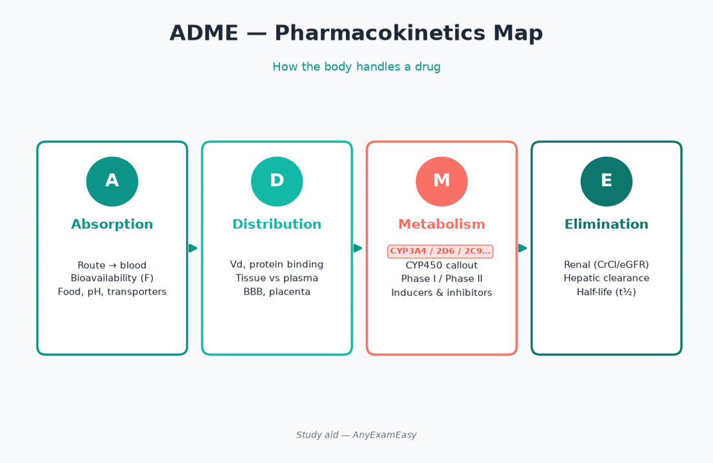
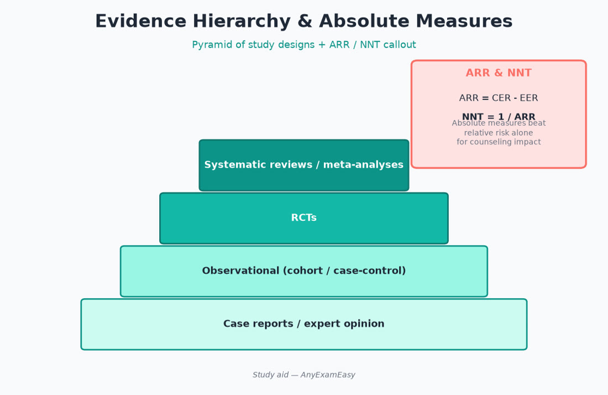

# Chapter 2 — Foundational Knowledge for Pharmacy Practice

> **Study aid only.** Domain 1 themes (~25%). Concepts for exam prep — not compounding certification or clinical protocols. Verify USP/FDA/current references.

---

## Why it matters on NAPLEX

Domain 1 asks whether you understand the **science underneath** safe dispensing and counseling: how drugs move and act, how formulations behave, how evidence is judged, and how compounding/pharmaceutics principles prevent harm. Weak foundations show up as wrong interaction calls, bad calc assumptions, and fragile counseling. On a fixed-form exam, Domain 1 items often hide inside clinical stems — you still need ARR/NNT fluency, steady-state timing, and crush/BUD judgment.

---

## Topic A — Biostatistics & literature evaluation

### Key concepts

- **Study designs (strength vibe):** meta-analysis/systematic review > RCT > cohort > case-control > case series/report > expert opinion (context matters; not absolute).  
- **Internal vs external validity:** Was the study well run? Do results apply to *this* patient?  
- **Relative risk (RR) / odds ratio (OR):** association measures; OR ≈ RR when events are rare.  
- **Absolute risk reduction (ARR)** and **NNT** = 1/ARR — clinically actionable.  
- **Relative risk reduction (RRR)** can look impressive when absolute benefit is tiny — don’t be fooled.  
- **Number needed to harm (NNH)** = 1/ARI (absolute risk increase).  
- **p-value:** probability of data (or more extreme) under null; does **not** equal “probability the drug works.”  
- **Confidence intervals:** precision; if CI for a difference/ratio includes the null, result often “not statistically significant.”  
- **Sensitivity / specificity / PPV / NPV:** screening vs diagnostic context; **prevalence** drives predictive values (low prevalence → more false positives → lower PPV).  
- **Intention-to-treat vs per-protocol:** ITT preserves randomization benefits; know what the authors analyzed.  
- **Surrogate vs hard outcomes:** A1C, LDL, viral load can matter — but mortality, hospitalization, and symptomatic events usually weigh more for shared decisions.

### Teaching example — ARR/NNT

Control event rate 5%, treatment 3% → ARR = 2% = 0.02 → NNT = 50. Marketing that shouts “40% RRR” without ARR hides that 50 people need treatment for one event prevented (plus harm/cost).

### Assessment cues on exam stems

- Marketing claims that quote only RRR  
- Underpowered studies with wide CIs  
- Surrogate endpoints without clinical outcome link  
- Industry framing without methods scrutiny  
- Screening test in low-prevalence population with surprisingly low PPV

### Pharmacist judgment priorities

1. Ask: outcome type (hard clinical vs surrogate)?  
2. Ask: absolute benefit and harm?  
3. Ask: does this patient match enrollment criteria?  
4. Translate evidence into a monitoring/counseling plan — not a journal club monologue.

### Remember this

- Prefer **ARR/NNT** over flashy RRR.  
- CI + design beat a lonely p-value.  
- External validity = “can I use this for *my* patient?”  
- Prevalence changes PPV/NPV even when sensitivity/specificity are fixed.

---

## Topic B — Pharmacokinetics / pharmacodynamics applied

### Key concepts

**ADME**

| Process | High-yield exam angles |
| --- | --- |
| Absorption | Food effects, pH, chelation (polyvalent cations + FQs/tetracyclines/thyroid/some INSTIs), first-pass |
| Distribution | Vd, protein binding, BBB, obesity/pregnancy shifts, hypoalbuminemia ↑ free fraction |
| Metabolism | CYP induction/inhibition, prodrugs needing activation, genetic polymorphisms (themes) |
| Elimination | Renal clearance, half-life, steady state (~4–5 t½), dialysis considerations |

**PK numbers you’ll reason with:**

- Steady state ≈ **4–5 half-lives** with regular dosing  
- Loading dose themes when rapid levels needed  
- Linear vs nonlinear (Michaelis-Menten) kinetics — **phenytoin** classic teaching example (small dose ↑ can cause disproportionate level ↑)  
- Bioavailability (F) and AUC comparisons for formulations  
- Clearance ↓ in organ failure → half-life ↑ if Vd unchanged

**PD themes**

- Agonist / antagonist / partial agonist / inverse agonist  
- Therapeutic index (narrow TI → monitor closely: digoxin, lithium, warfarin, many ASMs, CNIs)  
- Tolerance, dependence, tachyphylaxis  
- Synergy vs antagonism (especially antimicrobials)  
- Time- vs concentration-dependent killing (beta-lactams vs AG/FQ themes)

### Applied interaction judgment

| Pattern | Exam move |
| --- | --- |
| Strong inducer added | Watch substrate **failure** over days–weeks |
| Inducer stopped | Watch substrate **toxicity** as induction fades |
| Strong inhibitor added | Watch substrate **toxicity** sooner |
| Prodrug + inhibitor | Possible **loss of effect** if activation blocked |
| Chelation | Separate doses; counsel timing |

Common inducer themes: rifampin, carbamazepine, phenytoin, St. John’s wort.  
Common inhibitor themes: strong CYP3A4 (e.g., azoles, some macrolides, protease inhibitors/boosters), CYP2D6 inhibitors with certain psych/CV drugs.

### Safety / red flags

> **Red flag:** Narrow-TI drug + new inducer/inhibitor without a monitoring plan.

- Inducers → loss of efficacy of substrates  
- Inhibitors → toxicity risk  
- Displacement + narrow TI → toxicity windows  
- Renal decline without dose adjustment  
- Holding interacting cations “sometimes” without a schedule

### Counseling hooks

- “Take on empty stomach / with food” only when it matters for F or GI tolerance  
- Separate binders/antacids/iron/calcium from interacting drugs by instructed intervals  
- Don’t stop narrow-TI meds abruptly without a plan (seizure, steroid, clonidine, etc.)

### Remember this

- Induction takes time to appear/disappear; inhibition can be faster.  
- Organ function changes → revisit regimen.  
- Narrow TI + interaction = intensivist-level attention on an exam stem.

---

## Topic C — Pharmaceutics & compounding safety themes

### Key concepts

- **Dosage forms:** IR vs ER/DR — do not crush ER without checking; counseling on ghost tablets when relevant  
- **Solutions vs suspensions:** shake suspensions; dosing devices matter  
- **Isotonicity / pH / osmolarity** themes for ophthalmics/parenterals  
- **Beyond-use dating (BUD)** concepts vs manufacturer expiration — follow current USP guidance themes (verify current chapters)  
- **Aseptic technique / sterile compounding risk levels** (conceptual): contamination control, garbing, environmental monitoring awareness  
- **Nonsterile compounding:** accurate weighing, geometric dilution, appropriate base selection  
- **Hazardous drugs:** handling, PPE, containment themes (USP <800> awareness — verify current practice standards)  
- **Stability:** light, temperature, humidity, incompatibilities (IV Y-site themes)

### Assessment cues

- Patient can’t swallow — is a liquid or sprinkle formulation appropriate?  
- Feeding tube — crush/open restrictions  
- Cloudy IV admixture unexpectedly — incompatibility until proven otherwise  
- Temperature excursion on vaccine fridge — don’t guess; follow protocol

### Safety / red flags

> **Red flag:** Crushing long-acting opioids or oral chemo solids without verifying.

- Multi-dose vials past beyond-use or with poor aseptic technique  
- Look-alike labels in compounding area  
- Using household spoons for compounded liquids

### Remember this

- Formulation changes pharmacokinetics — “same drug” ≠ same product behavior.  
- BUD ≠ manufacturer expiration date.  
- When in doubt on crush/open: verify before counseling.

---

## Topic D — Medicinal chemistry / receptor themes (light)

### Key concepts

- Structure–activity themes that explain class effects (e.g., beta-lactam side-chain allergy nuance — not all “cillins” identical risk)  
- Stereochemistry sometimes matters (isomer products)  
- Salt forms affect molar dosing (calc chapter)  
- Catecholamine / anticholinergic / serotonergic structural “families” help predict ADR clusters

---

## Topic E — Drug information & clinical decision support

### Key concepts

- Primary vs secondary vs tertiary resources — know when to dig to the study vs when a monograph suffices  
- FDA labeling (PI) remains authoritative for indications, dosing, contraindications, and REMS existence  
- Beers, pregnancy/lactation databases, interaction checkers — tools, not autopilot  
- When CDS alerts fire: triage clinically significant vs noise; document overrides thoughtfully

### NAPLEX angle

Stems may ask what resource or next step clarifies a conflict (e.g., “check current labeling / culture data / renal function”) rather than naming a brand of database.

### Remember this

- Alerts don’t replace judgment.  
- Labeling + patient-specific data beat hallway rumor.

---

## Topic F — Acid-base & fluid therapy themes (foundational)

### Key concepts

- Crystalloid selection themes (isotonic for resuscitation; avoid free water in ↑ICP themes)  
- Maintenance vs replacement  
- Hyponatremia correction rate caution (osmotic demyelination risk if too fast in chronic hypoNa)  
- Hypertonic saline / electrolyte replacement — institutional protocols; pharmacist double-checks concentrations

### Safety

- Never IV push concentrated KCl.  
- Know what’s in “bolus” bags before verifying.

---

## Pharmacist ISCM vignettes

### Vignette 1 — Phenytoin nonlinear kinetics

**I:** Seizure control on phenytoin. **S:** Small dose increases can spike levels; albumin/renal issues alter free fraction. **C:** Don’t double missed doses casually; report ataxia/nystagmus. **M:** Levels with timing; albumin; interacting drugs (inducers/inhibitors).

### Vignette 2 — Evidence claim at the counter

**I:** Patient asks about a supplement ad claiming “50% risk reduction.” **S:** Ask for absolute numbers; check interactions. **C:** Translate ARR/NNT in plain language; defer disease-modifying Rx decisions to evidence-based therapy. **M:** If they start anything, document and recheck the Rx profile.

### Vignette 3 — ER crush request

**I:** Pain control; caregiver wants to crush ER opioid for G-tube. **S:** Dump-dose overdose risk; find IR/liquid/appropriate alternative. **C:** Explain why crushing ER is unsafe. **M:** Pain scores, sedation/RR, constipation plan, naloxone access if opioids continue.

---

## Concept checks

**1.** A trial reports RRR 40% and ARR 0.5%. Approximate NNT?  
A. 2  B. 40  C. 200  D. Cannot tell  
**Answer:** C (NNT ≈ 1/0.005 = 200).

**2.** Strong CYP3A4 inducer added to a patient on a CYP3A4 substrate with narrow TI. Biggest concern?  
A. Immediate accumulation toxicity only  B. Loss of substrate efficacy over time  C. Improved adherence automatically  D. No interaction possible  
**Answer:** B.

**3.** A CDS alert flags a major interaction. Best pharmacist action theme?  
A. Always override silently  B. Assess clinical significance, contact prescriber if needed, document  C. Delete the alert permanently without review  D. Ignore because “alerts always false”  
**Answer:** B.

**4.** Steady state with regular dosing is most often reached after approximately how many half-lives?  
A. 1  B. 2  C. 4–5  D. 20  
**Answer:** C.

**5.** Low disease prevalence primarily reduces which test metric?  
A. Sensitivity  B. Specificity  C. PPV  D. Likelihood ratio fixed by prevalence alone  
**Answer:** C (PPV falls as false positives loom larger).

---

## Topic G — Applied PK cases pharmacists actually use

### Case pattern: loading vs maintenance

When half-life is long and delay to steady state is clinically costly (e.g., some ASMs, digoxin themes), a loading strategy may appear. Exam skill: recognize *why* load is used, then monitor for toxicity during/after load — not celebrate a bigger first dose as inherently safer.

### Case pattern: dialysis

Ask: Is significant drug removed? If yes, dose after HD when labels say so. If not, still watch accumulation between sessions. High Vd / high protein binding → often poorly dialyzed (themes).

### Case pattern: obesity

Some antimicrobials and anticoagulants use TBW, IBW, or AdjBW with caps. The exam will usually signal which estimate to use or give CrCl already computed — don’t fight the stem.

### Bioequivalence vs therapeutic equivalence (Orange Book vibe)

AB-rated products meet bioequivalence standards for substitution themes. “Same molecule” compounded or non-AB products are not automatically interchangeable. NTI drugs deserve extra caution and consistency when possible.

---

## Topic H — Pharmaceutics deep hooks for NAPLEX

| Issue | Pharmacist move |
| --- | --- |
| Suspension settled | Shake; counsel; check dose device |
| ER tablet in G-tube request | Verify open/crush rules; propose alternative |
| Ophthalmic vs otic confusion | Route labels; never assume interchangeable |
| Multivitamin + levothyroxine | Separate cations/binders |
| IV phenytoin/fosphenytoin | Diluent/rate/filter themes — follow labeling |
| Light-sensitive infusions | Cover tubing/bag when required |

### Sterile compounding safety culture (exam-level)

- Garbing and surface disinfection are infection-control, not theater  
- Beyond-use dating depends on risk level and storage — verify current USP framing  
- Label must include critical BUD/storage; don’t dispense unlabeled syringes  
- Hazardous drug spill kits / PPE awareness

### Nonsterile compounding pearls

- Geometric dilution for potent powders  
- Choose base compatible with drug (aqueous vs oleaginous)  
- Accurate balance use; don’t estimate scoopfuls  
- Document formula, lot, BUD, quality checks

---

## Topic I — Biostats interpretation drills

**Drill 1:** ARR 8% → NNT = 1/0.08 = **12.5 ≈ 13**.  
**Drill 2:** Harm rate ↑ from 1% to 3% → ARI 2% → NNH = **50**.  
**Drill 3:** Sensitivity 90%, specificity 90%, prevalence 1%: most positive tests are false positives — **PPV is low**.  
**Drill 4:** CI for RR is 0.8–1.3 → includes 1 → typically not statistically significant for that contrast.  
**Drill 5:** Huge RRR with tiny ARR in low-baseline-risk patients → counsel absolute benefit honestly.

### Forest plot / meta-analysis vibe

Diamond crossing the null line → pooled estimate not clearly beneficial/harmful. Heterogeneity themes: don’t blindly pool unlike studies.

---

## Topic J — PD safety clusters to recognize fast

- **Anticholinergic burden:** dry mouth, constipation, urinary retention, confusion, tachycardia — especially elderly  
- **Serotonergic stack:** agitation, hyperreflexia, hyperthermia themes  
- **QT + electrolyte waste + interacting drug:** TdP risk awareness  
- **Orthostasis cluster:** alpha blockers, many antihypertensives, Parkinson drugs  
- **Bleeding cluster:** anticoag + antiplatelet + NSAID + SSRI themes

### Remember this (chapter close)

- Domain 1 is the wiring behind Domain 2–3 actions.  
- Translate evidence into ARR and patient-fit.  
- Formulation and PK changes are clinical interventions — counsel them that way.
