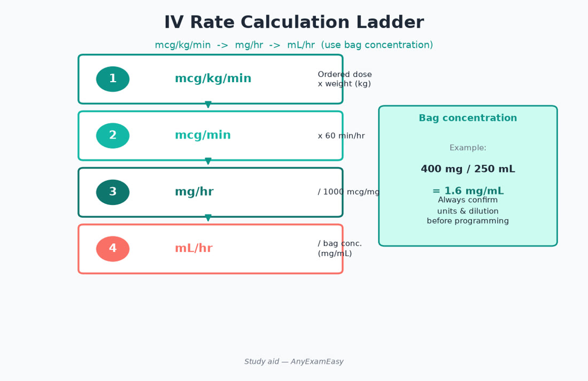
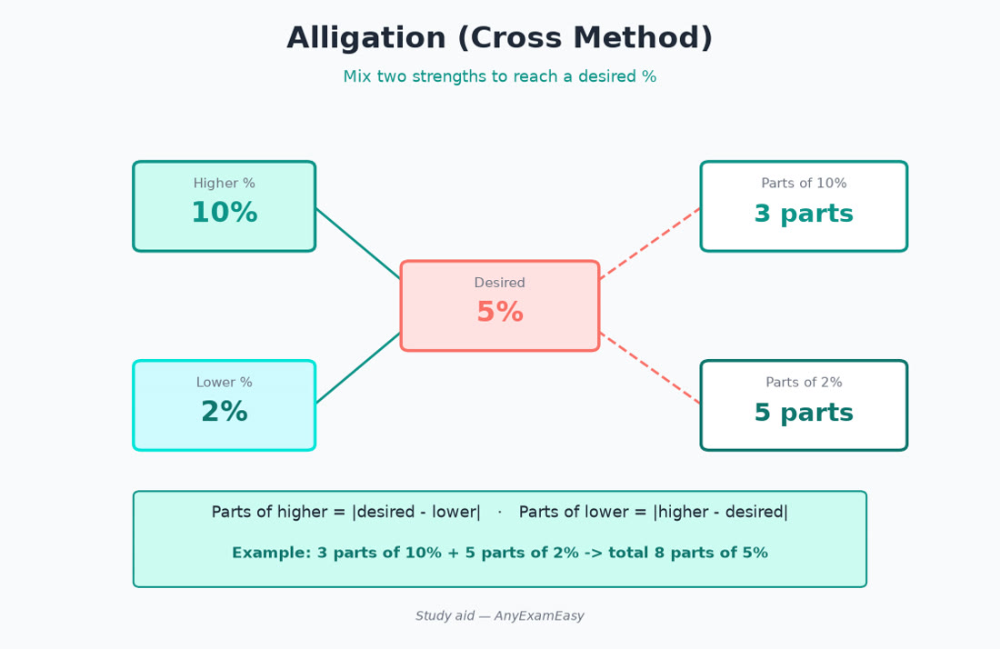

# Chapter 3 — Calculations

> **Study aid only.** Practice patterns for exam prep. Always verify institutional dosing policies and product labeling. Not a prescription for real patients.





---

## Why it matters on NAPLEX

Calculation errors harm patients. The exam expects **dimensional analysis fluency**: dosing, dilutions, IV rates, concentrations, bioavailability adjustments, and pediatric weight-based math — with unit safety checks every time. Misses often come from skipped units, lb/kg slips, or 10× decimal errors on high-alert drugs (insulin, opioids, chemo, electrolytes).

Treat every calc stem like a verification habit: write the goal unit, cancel every conversion, then sanity-check magnitude before picking an answer.

---

## Core method — dimensional analysis

1. Write what you need (goal unit).  
2. Start with given quantity.  
3. Multiply by conversion factors so units cancel.  
4. Sanity-check magnitude (adult vs neonate; mcg vs mg).  
5. Round only as appropriate to measurable volumes/doses.

**Remember this:** If units don’t cancel cleanly, the setup is wrong.

### Worked example — full setup

**Order:** gentamicin 5 mg/kg IV once; patient 154 lb; vial 40 mg/mL. How many mL?

1. Goal: mL  
2. Weight: 154 lb × (1 kg / 2.2 lb) = 70 kg  
3. Dose: 5 mg/kg × 70 kg = 350 mg  
4. Volume: 350 mg × (1 mL / 40 mg) = **8.75 mL**  
5. Sanity: adult once-daily AG dose volume is plausible (not 0.875 or 87.5).

---

## Pattern A — Dose from order

**Example pattern:** mg/kg × weight → total mg → ÷ concentration (mg/mL) → mL.

Watch:

- lb → kg (÷ 2.2)  
- Daily dose vs divided doses  
- Max dose caps in stems  
- BSA-based chemo (see Pattern G)

### Worked example — divided daily dose

Amoxicillin 90 mg/kg/day ÷ BID for 18 kg child; suspension 400 mg/5 mL.

- Daily = 90 × 18 = 1620 mg/day → 810 mg/dose  
- Volume = 810 × (5/400) = **10.125 → typically 10.1 mL/dose** (confirm measurable rounding per product)

### Worked example — max-dose cap

Acetaminophen 15 mg/kg q6h for 22 kg child; max 75 mg/kg/day or 4000 mg/day (adult framing) — check stem limits.

- Per dose = 15 × 22 = 330 mg  
- Four doses/day = 1320 mg/day < 75 × 22 = 1650 mg/day → OK if no other APAP sources

---

## Pattern B — Concentrations & dilutions

- **C1V1 = C2V2** for simple dilutions  
- Percent strength: % w/v = g/100 mL; % w/w = g/100 g; % v/v = mL/100 mL  
- Ratio strength (1:1000) → convert to workable % or mg/mL  
- **Alligation** for blending two strengths to an intermediate

**Safety:** Never assume “1% = 1 mg/mL” — 1% w/v = **10 mg/mL**.

### Worked — C1V1=C2V2

Want 1 L of 0.45% NaCl from 0.9% NaCl and sterile water.

- 0.9 × V = 0.45 × 1000 → V = **500 mL** of 0.9% + 500 mL sterile water

### Worked — percent to mg/mL

Lidocaine 2% w/v → 2 g/100 mL = 2000 mg/100 mL = **20 mg/mL**

### Worked — ratio strength

Epinephrine 1:1000 = 1 g/1000 mL = **1 mg/mL**.  
Epinephrine 1:10,000 = **0.1 mg/mL** (common crash-cart dilution theme).

### Alligation (tic-tac-toe)

Need 250 mL of 20% dextrose using D10W and D50W.

```
50    10 parts of D50
   20
10    30 parts of D10
```

Parts D50:D10 = 10:30 = **1:3**. For 250 mL total parts = 4 → D50 = 62.5 mL; D10 = 187.5 mL.

### Alligation — ointment blend

Mix 5% and 1% hydrocortisone cream to make 60 g of 2%.

```
5     1 part of 5%
  2
1     3 parts of 1%
```

Parts 1:3 → 5% = 15 g; 1% = 45 g.

---

## Pattern C — IV flow rates

- mL/hr = total mL ÷ hours  
- Drop factors: gtt/min = (mL/hr × gtt/mL) ÷ 60  
- mcg/kg/min infusions: convert carefully (kg → mcg/min → mL/hr using bag concentration)

**Common trap:** Using mg when the bag is labeled mcg/mL (or vice versa).

### Worked — dopamine mcg/kg/min

Order: 5 mcg/kg/min dopamine. Patient 70 kg. Bag: 400 mg in 250 mL.

1. 5 × 70 = 350 mcg/min  
2. 350 mcg/min × 60 = 21,000 mcg/hr = 21 mg/hr  
3. Conc = 400 mg / 250 mL = 1.6 mg/mL  
4. Rate = 21 / 1.6 ≈ **13.1 mL/hr**

### Worked — heparin units/kg/hr

Heparin 18 units/kg/hr; 80 kg; bag 25,000 units/250 mL.

- Rate = 18 × 80 = 1440 units/hr  
- Conc = 100 units/mL  
- **14.4 mL/hr**

### Worked — gtt/min

Infuse 1000 mL over 8 hours; drop factor 15 gtt/mL.

- mL/hr = 125  
- gtt/min = (125 × 15) / 60 = **31.25 → 31 gtt/min** (measurable whole drops)

---

## Pattern D — Creatinine clearance & renal dosing math

Cockcroft–Gault teaching (verify when to use IBW/AdjBW per reference):

CrCl (mL/min) ≈ [(140 − age) × weight (kg)] / (72 × SCr) × (0.85 if female)

Exam habits:

- Identify whether dose adjust, extend interval, or avoid  
- Don’t start nephrotoxins blindly in rising SCr stems  
- Frail elderly: low SCr may overestimate function

### Worked — CrCl

Female, 72 y, 60 kg, SCr 1.2 mg/dL.

CrCl ≈ [(140−72) × 60] / (72 × 1.2) × 0.85 = (4080) / (86.4) × 0.85 ≈ **40 mL/min**

If a drug’s label cuts dose below 50 mL/min, adjust or choose alternative per labeling.

### IBW / AdjBW themes (conceptual)

IBW male ≈ 50 + 2.3 × (inches over 5 ft); female ≈ 45.5 + 2.3 × (inches over 5 ft).  
AdjBW ≈ IBW + 0.4 × (TBW − IBW) when obese and reference calls for it. **Use the weight the drug’s dosing reference specifies** — don’t invent a universal rule.

---

## Pattern E — Bioavailability & salt factors

- Oral ↔ IV using F (bioavailability)  
- Salt factor (S): amount of active moiety ≠ salt weight always  
- AUC comparisons for formulation switches (conceptual)

### Worked — F conversion

IV digoxin 0.125 mg daily; F oral ≈ 0.7 for tablets (product-specific — confirm labeling). Rough oral equivalent ≈ 0.125 / 0.7 ≈ **0.18 mg** → often rounded to available strengths with clinical judgment (exam will give F if needed).

### Salt factor vibe

Phenytoin sodium vs acid: know that suspension/chewable (acid) and capsules (sodium salt) are not mg-for-mg identical — classic teaching trap. Prefer label-guided conversion factors when stemmed.

---

## Pattern F — TPN / electrolyte math

- mEq calculations from atomic weight / valence  
- Dextrose kcal (≈3.4 kcal/g typical teaching), amino acids ≈4 kcal/g, lipid emulsion kcal depends on concentration (verify product; ~10 kcal/g fat common teaching for 20% ILE)  
- Osmolarity awareness for peripheral vs central lines (conceptual)  
- Calcium–phosphate precipitation risk — follow compounding order/solubility references

### Worked — mEq from mg

How many mEq in 2 g magnesium sulfate? (MgSO₄·7H₂O MW ≈ 246.5; Mg²⁺ valence 2 — product labels often state mEq/g; exam may give MW.)

Teaching pattern: mEq = (mg × valence) / atomic (or molecular) weight as specified.

If label says MgSO₄ 1 g ≈ 8.12 mEq Mg, then 2 g ≈ **16.2 mEq** (use stem numbers).

### Worked — KCl additive

Need 40 mEq KCl; stock 2 mEq/mL. Volume = 40 / 2 = **20 mL** — never IV push concentrated KCl; dilute per policy.

### Worked — TPN kcal

Parenteral nutrition with dextrose 250 g + amino acids 80 g + 20% lipid 250 mL (≈50 g fat if 20 g/100 mL).

- Dextrose kcal ≈ 250 × 3.4 = 850  
- AA kcal ≈ 80 × 4 = 320  
- Lipid kcal ≈ 50 × 10 = 500 (teaching vibe — verify emulsion)  
- Total ≈ **1670 kcal**

### Osmolarity vibe

Osmolarity ≈ Σ (mM × i) for particles. Peripheral vs central line limits are institutional — check before verifying high-osmolar peripheral drips.

---

## Pattern G — Chemo BSA (high-level)

Mosteller common teaching: BSA (m²) = √[(ht_cm × wt_kg)/3600]

Dose = BSA × (mg/m²). Double-check decimals — chemo is high-alert.

### Worked — Mosteller + dose

Height 170 cm, weight 70 kg.

BSA = √[(170×70)/3600] = √[11900/3600] = √3.3056 ≈ **1.82 m²**

Paclitaxel-style example: 175 mg/m² × 1.82 ≈ **318.5 mg** → round per protocol/measurable strength; independent double-check required.

### AUC dosing theme (carboplatin)

Calvert formula teaching: Dose (mg) = AUC × (GFR + 25). Exam may give AUC target and GFR — plug carefully; don’t confuse mg with mg/m².

---

## Pattern H — Insulin and opioid math caution

### Insulin

- U-100 = 100 units/mL; U-500 = 500 units/mL — **5× concentration**  
- Pens vs syringes: U-500 has dedicated devices; wrong syringe = overdose  
- Correction: (BG − target) / ISF; don’t stack corrections without accounting for insulin on board

**Worked:** BG 280; target 120; ISF 40. Correction = (280−120)/40 = **4 units** (plus meal dose if indicated).

### Opioid conversions (exam-level caution)

- Incomplete cross-tolerance — **reduce** when rotating (clinical protocols; exam often states % reduction)  
- Patch strengths ≠ oral daily milligrams naively  
- MME awareness for risk, not for casual dose equivalence without tables

**Worked theme:** Oral morphine 60 mg/day → hydromorphone oral using ratio from stem table, then reduce 25–50% for cross-tolerance if instructed.

---

## Pattern I — Electrolyte & osmolarity drills (extra)

- Corrected calcium teaching: corrected Ca ≈ measured Ca + 0.8 × (4 − albumin) when hypoalbuminemic (confirm units/method)  
- Anion gap conceptual for acid-base stems  
- Hypertonic saline / electrolyte replacement — institutional protocols; pharmacist double-checks concentrations

---

## Safety / red flags

> **Red flag:** Trailing zeros (1.0 mg misread as 10) and missing leading zeros (.5 mg → 5 mg).

> **Red flag:** Insulin U-100 vs U-500 confusion; concentrated electrolytes (KCl) never as IV push; pediatric decimal slips (10× overdoses).

- Trailing zeros / missing leading zeros in written work  
- Insulin U-100 vs U-500 confusion themes  
- Concentrated electrolytes (KCl) never as IV push  
- Pediatric decimal slips (10× overdoses)  
- Chemo BSA with wrong height units (cm vs in)

### Remember this

- 1% w/v = 10 mg/mL.  
- Always cancel units.  
- High-alert: insulin, opioids, anticoags, chemo, concentrated electrolytes.  
- If options differ by 10×, hunt the decimal.  
- Show every unit in the setup; recalculate once before submitting.

---

## Pharmacist ISCM vignettes (calc-linked)

### Vignette 1 — Pediatric antibiotic liquid

**I:** Otitis media; amoxicillin weight-based. **S:** Confirm kg weight, max dose, allergy. **C:** Oral syringe in mL; refrigerate if required; finish course. **M:** Fever curve; rash/diarrhea; caregiver teach-back of mL/dose.

### Vignette 2 — Heparin infusion

**I:** VTE treatment per protocol. **S:** Dual check concentration and weight-based rate; HIT history. **C:** Bleeding signs; no IM shots casually. **M:** aPTT/anti-Xa per protocol; Hgb/platelets; injection sites.

### Vignette 3 — TPN additive check

**I:** Central PN with electrolytes. **S:** Ca–Phos product solubility; never push KCl; osmolarity for line type. **C:** Line care; report fever. **M:** Daily lytes, glucose, triglycerides; infection signs.

---

## Concept checks (with answers)

**1.** Order: 5 mcg/kg/min dopamine. Patient 70 kg. Bag: 400 mg in 250 mL. What is mL/hr?  
≈ **13.1 mL/hr** (see Pattern C).

**2.** You need 250 mL of 20% dextrose using D10W and D50W. Parts D50 : D10?  
**1 : 3** (from 10:30).

**3.** True or false: 1:1000 epinephrine is 1 mg/mL.  
**True.**

**4.** CrCl for female 72 y, 60 kg, SCr 1.2?  
≈ **40 mL/min**.

**5.** BSA Mosteller for 170 cm, 70 kg?  
≈ **1.82 m²**.

---

## Mini-problem set (8–12) with answers

**M1.** Gentamicin 7 mg/kg once; 80 kg; 40 mg/mL. mL?  
560 mg → **14 mL**.

**M2.** Want 500 mL of 1% lidocaine from 2% stock. How much 2%?  
C1V1=C2V2 → 2×V=1×500 → **250 mL** of 2% + 250 mL diluent.

**M3.** Infuse 500 mL over 4 hours; 20 gtt/mL. gtt/min?  
125 mL/hr → (125×20)/60 ≈ **42 gtt/min**.

**M4.** Phenytoin teaching: if stem gives F and IV dose, compute oral — e.g., IV 100 mg, F=0.9 → oral ≈ **111 mg** (then match available form).

**M5.** Alligation: 30 g of 2.5% cream from 5% and 1%. Parts 5%:1% = 1.5:2.5 = 3:5.  
5% = 11.25 g; 1% = 18.75 g.

**M6.** Carboplatin AUC 5; GFR 70. Dose = 5×(70+25) = **475 mg**.

**M7.** Correction insulin: BG 300, target 140, ISF 40 → **4 units**.

**M8.** KCl 20 mEq from 2 mEq/mL stock → **10 mL** (dilute; never push).

**M9.** Child 12 kg; ibuprofen 10 mg/kg; 100 mg/5 mL → 120 mg → **6 mL**.

**M10.** Heparin bag 25,000 units/500 mL; need 1000 units/hr → conc 50 units/mL → **20 mL/hr**.

**M11.** 1:10,000 epi; need 1 mg → volume = 1 mg / 0.1 mg/mL = **10 mL**.

**M12.** Dextrose 150 g in PN; kcal ≈ 150×3.4 = **510 kcal**.

### Practice discipline

On exam, re-copy the stem numbers once before committing. If options differ by a factor of 10, hunt the decimal. High-alert calcs deserve a second pass every time.


Keep a one-page personal formula sheet from your misses (only patterns you actually miss). Recopy units every time—even on exam day in the whiteboard space—and you will catch the 10× errors that sink otherwise strong candidates.
