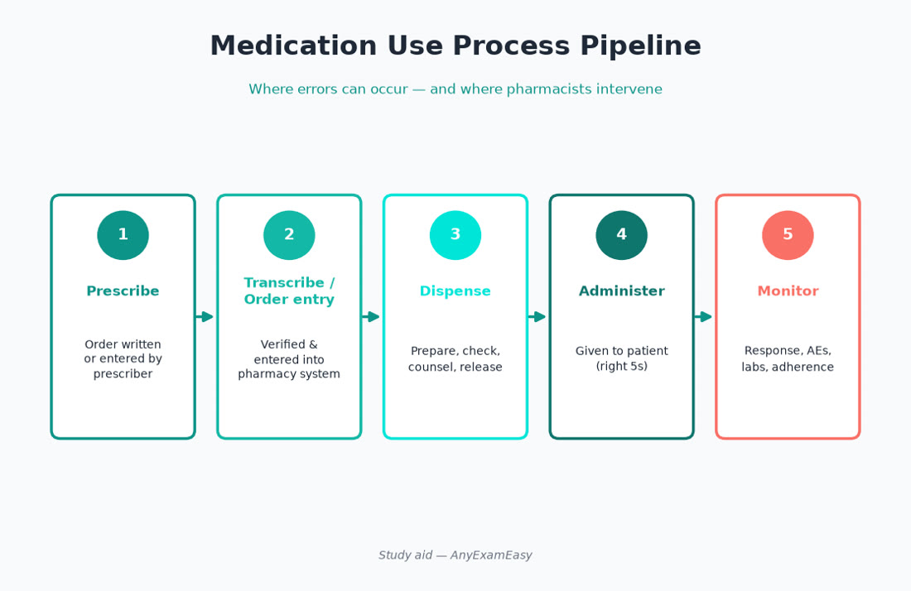
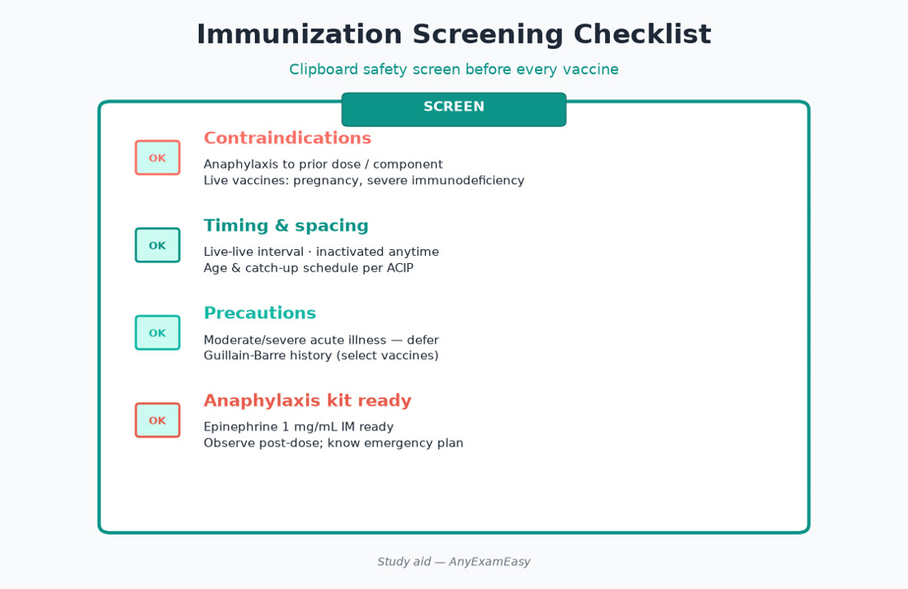

# Chapter 4 — Medication Use Process

> **Study aid only.** Domain 2 themes (~25%). Process safety for exam prep — follow employer policy and current law/standards in practice.

---

## Why it matters on NAPLEX

Domain 2 evaluates whether you can move a medication safely from **decision → documentation → dispense → administration → monitoring**, including substitutions, immunizations, and error prevention. Many misses are process misses, not “forgot the brand name.” Think like a systems pharmacist: incomplete orders, wrong patient technology errors, and missing monitoring plans are fair game.

---

## Topic A — Order review & prescribing support

### Key concepts

- Appropriateness for indication, dose, route, duration  
- Allergy / ADR history reconciliation (reaction type matters)  
- Duplicate therapy and therapeutic duplication  
- Interaction check (PK/PD) with actionable plan  
- Missing information: weight, CrCl, indication for PRN, stop dates for antibiotics, BSA for chemo

### Pharmacist actions

1. Clarify incomplete/unsafe orders before dispensing.  
2. Propose alternatives when contraindicated.  
3. Document interventions professionally.  
4. Escalate high-alert uncertainty — don’t “hope the nurse catches it.”

### Red flags

> **Red flag:** Daily methotrexate dosing when the regimen should be weekly (rheum/derm classic).

- Unusually high opioid or insulin doses without context  
- Potassium concentrate free-text orders  
- Pediatric liquid without weight  
- Anticoagulant + epidural without hold plan  
- “Continue home meds” without reconciliation

### Indication–Safety–Counseling–Monitoring on every new start

Even process items are ISCM: if indication is unclear, safety checks incomplete, counseling skipped, or monitoring unscheduled — intervene.

---

## Topic B — Transcribing, documenting, technology

### Key concepts

- CPOE, e-prescribing benefits and new error types (wrong patient, wrong sig dropdown, wrong product selected from autocomplete)  
- Tall-man lettering, barcode verification themes  
- Allergy documentation quality (rash vs anaphylaxis)  
- Med reconciliation at transitions  
- Alert fatigue: still triage serious alerts

### Remember this

Technology reduces some errors and creates others — still think. Barcode scan is a tool, not a brain replacement.

---

## Topic C — Dispensing & product selection

### Key concepts

- DAW codes / substitution themes (therapeutic vs generic equivalence concepts)  
- Orange Book AB ratings conceptual awareness  
- Narrow therapeutic index substitution caution themes  
- Biosimilars: naming and interchangeability concepts (verify current FDA framing)  
- Packaging: unit dose, child-resistant containers, compliance packaging  
- Beyond-use dating on reconstituted products; auxiliary labels that matter (shake, refrigerate, take with food)

### Counseling at pickup (high-yield)

- Directions in patient language + teach-back for devices  
- Missed-dose guidance when standard  
- Storage (insulin, biologics, suspensions)  
- Serious ADR warning symptoms  
- Device technique (inhalers, pens, nasal sprays, patches)

---

## Topic D — Administration & immunizations

### Key concepts

- Rights of administration mindset (patient, drug, dose, route, time + documentation)  
- Immunization: screen for contraindications/precautions, age indications, spacing, live-vaccine themes, adverse event reporting awareness (VAERS concept)  
- Injection site / route / IM vs SQ; needle length for body habitus themes  
- Anaphylaxis preparedness themes when vaccinating (epinephrine available)

### Assessment cues

- Pregnancy, immunocompromise, recent blood products (live vaccine timing themes)  
- Prior Guillain-Barré or severe allergy to components — follow current ACIP-style caution framing (verify current schedules)  
- Moderate–severe acute illness may defer some vaccines; mild cold usually does not

### Pharmacist immunization workflow

1. Screen → 2. Consent/educate → 3. Prepare correctly → 4. Administer with technique → 5. Observe → 6. Document/report to IIS when applicable → 7. Manage AE / VAERS if indicated.

---

## Topic E — Monitoring & medication safety systems

### Key concepts

- Labs for efficacy and toxicity scheduled at start  
- Adherence check-ins and refill gap patterns  
- High-alert medication lists; independent double-checks themes  
- LASA (look-alike sound-alike) pairs — storage separation  
- ISMP-style safety habits (conceptual): avoid abbreviations that harm, read-back, dilute properly  
- Error reporting culture — fix systems, not only blame people  
- Smart pumps / concentration standardization reduce IV errors

### High-alert process examples

| Drug / class | Process control themes |
| --- | --- |
| Insulin | Standard concentrations; U-500 safeguards; pen labeling |
| Anticoagulants | Indication, overlapping therapy check, procedure holds |
| Opioids | MME awareness, naloxone offer, benzo stack check |
| Chemo | Dual check, route controls (no IT vinca) |
| MTX | Weekly alerts; folinic/folic acid context |
| Concentrated electrolytes | Restricted access; dilution rules |

### Remember this

- Weekly vs daily methotrexate is a forever trap.  
- Immunization = screening + technique + emergency readiness + documentation.  
- Monitoring plans belong in Domain 2 *and* Domain 3 thinking.

---

## Topic F — Therapeutic interchange & substitutions

### Key concepts

- Generic substitution vs therapeutic interchange (class swap under protocol)  
- Orange Book therapeutic equivalence codes (AB) conceptual use  
- Narrow therapeutic index drugs — extra caution with product switches  
- Biosimilar interchangeability vs “highly similar” — follow current FDA + state rules (law detail → MPJE)  
- During shortages: evidence-based alternatives + prescriber communication + patient counseling on device/technique changes

### Remember this

- Interchange protocols still need clinical appropriateness.  
- Teach device changes explicitly (inhaler/pen switches).

---

## Topic G — Controlled substances process (high-level)

### Key concepts

- Corresponding responsibility themes when verifying controlled Rx  
- PDMP check habits where required (jurisdiction-specific — MPJE)  
- Partial fills / dating / inventory concepts at high level for NAPLEX ops awareness  
- Diversion red flags: early fills pattern, cash-only, multi-prescriber — address professionally and legally

**Do not** treat this as complete controlled-substance law review.

---

## Topic H — Medication reconciliation & transitions

### Key concepts

- Admission/discharge/AMC: best possible med history  
- High-risk: anticoagulants, insulin, opioids, immunosuppressants, anticonvulsants  
- Clarify OTC/herbals — they count  
- Provide updated list + teach changes (“stop / start / change”)  
- Discharge counseling beats handing a bag silently

### Common transition failures

- Duplicate anticoagulants (bridging leftovers)  
- Wrong insulin product/concentration after formulary swap  
- Missing rebound plans (steroids, PPIs, beta blockers, clonidine, denosumab)

---

## Topic I — Adverse event reporting & REMS awareness

- FAERS / MedWatch conceptual reporting for serious ADRs  
- REMS elements: may include prescriber certification, pharmacy certification, patient enrollment, labs (clozapine ANC, isotretinoin iPLEDGE, etc.)  
- Vaccines: VAERS awareness after immunization clinics  
- Document interventions that prevent harm — they are part of the medication-use record

### Remember this

- REMS is not optional paperwork trivia — it gates safe access.  
- Reporting serious ADRs improves population safety.

---

## Pharmacist ISCM vignettes

### Vignette 1 — Weekly methotrexate

**I:** Rheumatoid arthritis; MTX weekly. **S:** Catch daily sig error; liver/lung/infection cautions; pregnancy. **C:** Weekly schedule calendar; folic acid if prescribed; report fever/SOB/mouth sores. **M:** CBC/LFTs per protocol; refill timing anomalies.

### Vignette 2 — Flu clinic

**I:** Annual influenza vaccine. **S:** Screen allergy/egg framing per current ACIP; Guillain-Barré history caution; acute severe illness. **C:** Expect arm soreness; rare serious allergy → emergency care. **M:** 15-minute observation when indicated; document; VAERS if serious AE.

### Vignette 3 — Discharge anticoag

**I:** New VTE; DOAC start. **S:** Renal dose; interacting drugs; no duplicate heparin left active. **C:** Don’t skip doses; bleeding signs; procedure holds. **M:** CBC/renal as indicated; adherence at first refill.

---

## Concept checks

**1.** Patient picks up new warfarin. Which dispensing action is most complete?  
A. Hand vial only  B. Verify dose/indication interactions, counsel diet/bleeding signs, confirm INR follow-up plan  C. Substitute to any anticoagulant silently  D. Skip allergy check because history unknown  
**Answer:** B.

**2.** Best immediate step if order is incomplete for a pediatric liquid antibiotic?  
A. Guess weight  B. Clarify weight/dose with prescriber before dispensing  C. Dispense adult tablet  D. Ignore duration  
**Answer:** B.

**3.** Shortage of a patient’s inhaler brand device. Best process?  
A. Omit therapy until next year  B. Identify equivalent therapy/device per protocol, ensure technique counseling, communicate change  C. Substitute oral steroid chronically without plan  D. Double unrelated nasal spray  
**Answer:** B.

**4.** REMS for clozapine primarily exists to manage which monitoring theme?  
A. Hair loss only  B. Severe neutropenia / ANC monitoring framework  C. Cough  D. Hyperglycemia alone without labs  
**Answer:** B.

**5.** Wrong-patient CPOE risk is best reduced by which habit theme?  
A. Ignoring barcodes  B. Dual identifiers + verify before act  C. Relying on room number alone  D. Disabling all alerts forever  
**Answer:** B.

---

## Topic J — Independent double-checks & high-alert workflow

Independent double-check means **two qualified people separately verify** critical elements (patient, drug, dose, route, pump settings) — not one person rubber-stamping the other. Use for chemo, pediatric high-alert, concentrated electrolytes, and per policy for insulin/anticoagulants.

### Pump programming traps

- Wrong concentration selected in drug library  
- Weight entered in lb instead of kg  
- Bolus vs continuous line mix-ups  
- Secondary infusion “piggyback” rate errors

Pharmacist verifying IV drips should confirm bag label concentration matches order *and* pump library entry.

---

## Topic K — Medication safety culture & just culture

- Human error → console, train, system design  
- At-risk behavior → coach  
- Reckless conduct → disciplinary pathway  
- Hide-the-error cultures guarantee repeat harm  
- Near-miss reporting is gold — celebrate reporting, fix latent conditions (look-alike storage, ambiguous labels, staffing interruptions)

### Interruptions during verification

Leadership (Domain 5 crossover): protect sterile compounding and final verification from unnecessary interruptions; batch non-urgent questions; use “sterile zone” habits.

---

## Topic L — Immunization schedules & screening depth

### Screening questions that change the plan

- Prior anaphylaxis to vaccine component  
- Immunosuppression / household contacts (live vaccine nuances)  
- Pregnancy (live vaccines generally avoided)  
- Recent illness severity  
- History of Guillain-Barré timing themes for certain vaccines (follow current ACIP)  
- Age/indication mismatch (zoster, pneumococcal product choice themes — verify current schedules)

### Documentation essentials

Product, lot, expiration, site, route, dose, VIS date, consenter, vaccinator — incomplete records are process failures.

### Anaphylaxis readiness

Epinephrine IM first-line; call emergency services; protocols for observation and second dose themes. Antihistamines are adjunctive, not a substitute.

---

## Topic M — Med rec script pharmacists can run

1. Collect: Rx + OTC + herbals + samples + specialty meds  
2. Compare: home vs hospital vs discharge  
3. Correct: duplicates, omissions, dose discrepancies  
4. Communicate: patient + team + updated list  
5. Counsel: what changed and why; red-flag symptoms

**High-yield discrepancy:** “Home warfarin + new prophylactic heparin both active” or “two APAP-containing products.”

---

## Topic N — Specialty pharmacy & REMS operations (exam level)

- Specialty: cold chain, financial onboarding, adherence calendars, lab gatekeeping  
- REMS: enrollments, negative pregnancy tests, ANC thresholds — **no product until elements met**  
- 340B / PA delays affect adherence — help navigate without inventing coverage rules

### Remember this (chapter close)

- Domain 2 rewards careful process more than trivia brand names.  
- Incomplete order → clarify, don’t guess.  
- Immunizations and high-alert workflows are core pharmacist identity skills on NAPLEX.

---

## Topic O — Counseling quality that Domain 2 actually tests

Open with the purpose of the medicine in one sentence, then how to take it, then what to watch for, then when to seek help. Ask the patient to teach back device steps. For liquid antibiotics, demonstrate the oral syringe markings. For patches, cover site rotation, heat precautions, and safe disposal. For eye drops, teach spacing between drops and nasolacrimal occlusion when appropriate. Document that counseling occurred and any barriers (language, vision, hearing, health literacy) with accommodations used.
