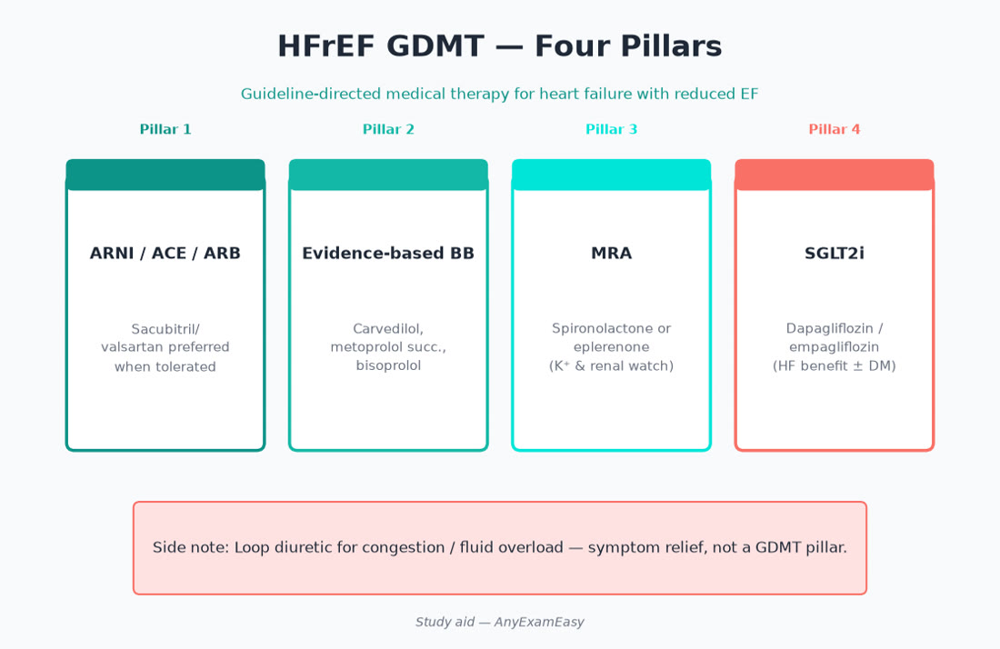
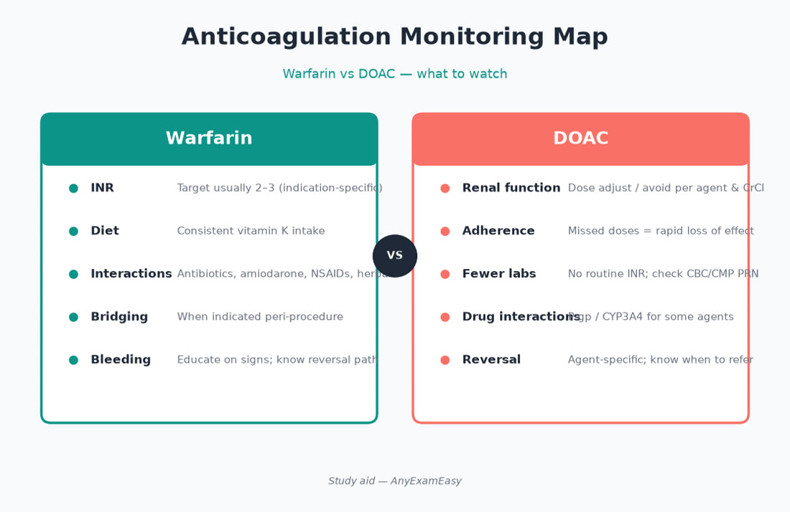
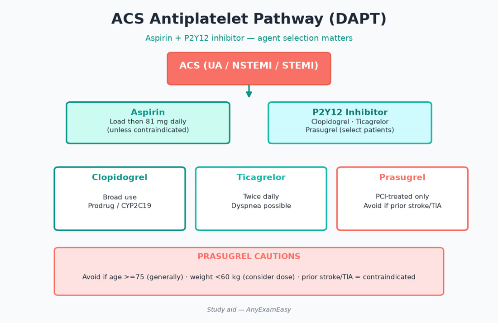

# Chapter 5 — Cardiology

> **Study aid only.** Guideline themes for exam judgment — not individualized prescribing. Verify current ACC/AHA-aligned references and labeling.

---

## Why it matters on NAPLEX

Cardiology items sit heavily in **Domain 3**: choose/adjust regimens, catch interactions, counsel devices and adherence, and monitor labs/vitals. High-yield clusters: hypertension, dyslipidemia, heart failure, ischemic heart disease/ACS secondary prevention, anticoagulation, and arrhythmias. Expect ISCM on every stem — especially ACEI→ARNI washout, DOAC renal dosing, mechanical-valve warfarin, and DAPT adherence after stents.

---

## Topic A — Hypertension

### Key concepts

- Confirm technique and adherence before escalating.  
- First-line themes for many adults: thiazide-type diuretic, ACEI, ARB, CCB (patient-specific).  
- Compelling indications steer class choice (CKD with albuminuria → ACEI/ARB themes; HFrEF → GDMT classes; diabetes with albuminuria → ACEI/ARB themes).  
- Prefer combo therapy when BP markedly above goal (guideline-theme).  
- Prefer agents that improve outcomes in comorbidities over “any BP drop.”

### Class comparison (exam hooks)

| Class | Pearls | Watch |
| --- | --- | --- |
| Thiazide-type | Good add-on; chlorthalidone often emphasized in literature themes | Na/K, uric acid, lithium levels |
| ACEI | Outcome benefits in many compelling indications | K/Cr, cough, angioedema, pregnancy |
| ARB | Alternative when ACEI cough | K/Cr, pregnancy; don’t dual with ACEI |
| DHP-CCB | Useful in older adults / Black adults HTN themes | Edema, GERD, CYP3A interactions (some) |
| Non-DHP CCB | Rate control roles | Bradycardia, HFrEF caution, CYP3A |
| Beta blocker | Not first-line for HTN alone unless compelling (HF, post-MI, angina) | Bradycardia, masking hypo, withdrawal |
| MRA / K-sparing | Resistant HTN / HF roles | HyperK |
| Central agents | Clonidine etc. — adherence/rebound issues | Rebound HTN if stopped abruptly |

### Assessment cues / patient factors

- Pregnancy: avoid ACEI/ARB (teratogenicity themes); know safer alternatives conceptually (labetalol/nifedipine/methyldopa historically — verify current Ob guidance).  
- Black adults: CCB/thiazide often preferred initially for HTN alone (guideline-theme nuance).  
- Bilateral renal artery stenosis caution with ACEI/ARB.  
- Baseline K⁺/Cr before ACEI/ARB; watch hyperkalemia and Cr bumps.  
- Resistant HTN: confirm adherence, interfering meds (NSAIDs, sympathomimetics, excess alcohol), secondary causes themes.

### Treatment priorities

1. Lifestyle counseling always (Na, weight, alcohol, activity, sleep apnea screen themes).  
2. Start evidence-aligned class for the patient.  
3. Titrate / combine to goal; simplify regimens for adherence (single-pill combos).  
4. Resistant HTN workup mindset before endless add-ons.

### Counseling

- ACEI cough vs angioedema (angioedema = emergency; don’t rechallenge casually).  
- Diuretic timing (AM) to reduce nocturia.  
- CCB edema vs true HF edema differentiation themes.  
- Home BP log technique (seated, cuff size, quiet rest).

### Safety / red flags

> **Red flag:** Dual ACEI + ARB generally avoided. Abrupt clonidine stop → rebound hypertension.

- Hyperkalemia with ACEI/ARB + potassium-sparing agents / trimethoprim / salt substitutes.  
- Overdiuresis → AKI/orthostasis.

### Remember this

- Match drug class to comorbidity.  
- ACEI/ARB + pregnancy = hard no.  
- Monitor K⁺/Cr after ACEI/ARB starts/uptitration.

---

## Topic B — Dyslipidemia

### Key concepts

- Statins remain foundation for ASCVD risk reduction.  
- Intensity (high vs moderate) based on indication (secondary prevention, LDL thresholds, diabetes, risk calculators — guideline-theme).  
- Nonstatins (ezetimibe, PCSK9 mAbs, bempedoic acid themes) when LDL remains above threshold or statin intolerance.  
- Triglycerides: lifestyle; pharmacologic themes when very high to reduce pancreatitis risk.  
- Lifestyle always: diet pattern, activity, weight, glycemic control, alcohol in high TG.

### Statin intensity vibe (confirm current labeling/guidelines)

High-intensity themes often include atorvastatin 40–80 mg and rosuvastatin 20–40 mg — verify product/indication. Moderate intensity covers many primary-prevention starts.

### Counseling

- Muscle symptoms: report unexplained pain/weakness; check adherence/interacting drugs (strong CYP3A4 inhibitors with simvastatin/lovastatin especially).  
- Evening dosing historically for some older statins; many can be anytime — follow product.  
- Don’t use gemfibrozil + statin (myopathy risk); fenofibrate caution themes.  
- PCSK9 injectables: storage, injection sites, adherence.

### Safety

- Pregnancy: generally avoid statins (labeling evolved — verify current FDA framing for specific cases; exam often still treats as avoid unless told otherwise).  
- LFTs: baseline themes; not endless routine panels if asymptomatic per modern practice themes.  
- Simvastatin dose ceilings with certain interactors — classic safety stem.

### Remember this

- Statin benefit is outcome-driven, not just LDL cosmetics.  
- Interaction check before blaming “statin intolerance.”

---

## Topic C — Heart failure (HFrEF focus)

### Key concepts

**GDMT pillars (themes):** ACEI/ARB/ARNI, evidence-based beta blocker (carvedilol/metoprolol succinate/bisoprolol), MRA, SGLT2 inhibitor — plus loop diuretics for congestion.

- ARNI (sacubitril/valsartan): washout after ACEI before starting (angioedema risk).  
- Digoxin: symptom/rate themes; toxicity risk with hypokalemia/renal impairment.  
- Ivabradine: sinus rhythm, HR criteria themes.  
- HFpEF: SGLT2 themes increasingly relevant; treat comorbidities; congestion management.  
- Device therapy eligibility conceptual (ICD/CRT) — pharmacist role is med optimization + counseling, not implantation decisions alone.

### Assessment cues

- Weight gain, edema, orthopnea, fatigue → congestion.  
- Cold extremities, hypotension, rising Cr → hypoperfusion / overdiuresis / low output themes.  
- Hyponatremia in advanced HF.  
- Nonadherence and NSAID use as reversible precipitants.

### Titration judgment

- Uptitrate GDMT when congested state allows and BP/K/Cr tolerate.  
- Don’t abandon pillars for “soft BP” without assessing volume and timing.  
- Loop diuretics for symptoms — not a substitute for pillars.

### Counseling

- Daily weights; report gains per parameters.  
- Salt/fluid guidance per care team.  
- SGLT2: genital hygiene, volume depletion, rare DKA awareness (including euglycemic themes).  
- Don’t stop beta blockers abruptly without plan.  
- ARNI: hypotension, hyperK, angioedema education.

### Safety / red flags

> **Red flag:** Combining ACEI + ARNI without washout. NSAIDs worsen HF.

- Hyperkalemia with ACEI/ARB/ARNI + MRA.  
- Digoxin toxicity with interacting drugs / renal decline.

### Remember this

- Four pillars when indicated/tolerated — don’t leave GDMT as “furosemide only.”  
- ACEI→ARNI needs washout.  
- NSAIDs are HF enemies.

---

## Topic D — Ischemic heart disease / ACS secondary prevention

### Key concepts

- Dual antiplatelet therapy (DAPT) duration depends on ACS vs elective stent and bleeding risk — follow current cardiology guidance themes.  
- Aspirin + P2Y12 inhibitor (clopidogrel/ticagrelor/prasugrel themes) with prasugrel contraindications (prior stroke/TIA; age/weight cautions).  
- High-intensity statin, beta blocker, ACEI/ARB when indicated.  
- Antianginals: nitrates, beta blockers, CCB, ranolazine themes.  
- Complete smoking cessation counseling every encounter.

### P2Y12 comparison hooks

| Agent | Hooks |
| --- | --- |
| Clopidogrel | Prodrug; CYP2C19 themes; omeprazole interaction debate |
| Ticagrelor | Dyspnea; aspirin dose ceiling themes; twice daily adherence |
| Prasugrel | Avoid prior stroke/TIA; age/weight cautions |

### Counseling

- Nitroglycerin: sit, dose timing, call emergency services if unrelieved per teaching.  
- PDE-5 inhibitor + nitrate = dangerous hypotension.  
- Bleeding precautions on DAPT; don’t stop antiplatelets without cardiology input (stent thrombosis risk).

### Safety

- Omeprazole–clopidogrel interaction debate themes — prefer interaction-aware PPI choice when gastroprotection needed.  
- Ticagrelor: dyspnea, aspirin dose ceiling themes.

---

## Topic E — Anticoagulation (AF / VTE)

### Key concepts

| Theme | Warfarin | DOACs |
| --- | --- | --- |
| Monitoring | INR | Renal function, adherence, baseline labs |
| Onset | Delayed | Faster |
| Interactions | Many (diet K, drugs) | P-gp/CYP themes vary by agent |
| Reversal themes | Vitamin K ± complex concentrates | Agent-specific / nonspecific options — know concept |

- AF stroke risk vs bleeding risk frameworks (CHA₂DS₂-VASc / HAS-BLED conceptual use).  
- VTE: acute treatment vs secondary prevention duration themes.  
- Bridging: not automatic for all procedures — risk-based (mechanical valves / recent VTE differ from low-risk AF).  
- Cancer-associated VTE has nuances (see oncology chapter).

### DOAC judgment checklist

1. Correct indication (not mechanical valve / not APS themes where warfarin preferred).  
2. Renal/hepatic dose rules.  
3. Interacting drugs (strong dual P-gp/CYP3A modulators — agent-specific).  
4. Adherence plan (missed dose instructions differ by agent — use labeling).  
5. Procedure hold timing per protocol.

### Counseling

- Warfarin: consistent vitamin K intake, INR schedule, bleeding signs, drug/herb interactions.  
- DOACs: don’t skip doses; renal dosing; avoid duplicate anticoagulants; procedure holds per protocol.

### Safety / red flags

> **Red flag:** Mechanical valves: warfarin territory — DOACs generally not substitutes. Epidural/spinal risk with anticoagulants (hematoma).

### Remember this

- Match anticoagulant to indication (valve ≠ AF).  
- Renal function drives many DOAC doses.  
- Bleeding + thrombosis risk always traded off.

---

## Topic F — Arrhythmias (rate vs rhythm)

### Key concepts

- Rate control: beta blockers, non-DHP CCBs (avoid in HFrEF decompensation themes), digoxin adjunct.  
- Rhythm: amiodarone multi-organ toxicity monitoring (thyroid, liver, lungs, eyes, skin); drug interactions (warfarin, digoxin, QT).  
- QT-prolonging combinations → TdP risk awareness; replete K/Mg.  
- Digoxin toxicity: GI, visual changes, arrhythmias; worse with hypoK/hypoMg.  
- Anticoagulation decision in AF is separate from rate vs rhythm choice — don’t forget stroke prevention.

### Amiodarone monitoring map (themes)

Baseline and periodic: TFTs, LFTs, CXR/pulmonary symptoms, eye exams as indicated, ECG/QT, drug interaction review every new Rx.

---

## Topic G — Peripheral vascular / antiplatelet chronic use

- PAD: high-intensity statin themes; smoking cessation; antiplatelet therapy.  
- Cilostazol: contraindicated in HF.  
- Dual pathway inhibition themes (low-dose rivaroxaban + aspirin) in selected CAD/PAD — bleeding tradeoff counseling.  
- After PCI: adherence to DAPT schedule is stent-protective — calendar counseling.

---

## Topic H — Hypertensive urgency vs emergency mindset

- Emergency = end-organ damage → ED/inpatient IV therapies.  
- Urgency without damage: controlled outpatient adjustment — avoid overly rapid drops causing ischemia.  
- Counsel adherence and follow-up rather than one-time huge PRN clonidine habits without plan.

### Remember this

- Cilostazol ↔ HF contraindication.  
- Rapid BP plunges can harm — controlled reduction themes.

---

## Pharmacist ISCM vignettes

### Vignette 1 — New HFrEF discharge

**I:** HFrEF; start/continue GDMT pillars + loop for congestion. **S:** ACEI→ARNI washout; K/Cr; hypotension; NSAID avoidance. **C:** Daily weights; SGLT2 hygiene; med list simplification. **M:** K/Cr after uptitration; symptoms; adherence at day 7–14.

### Vignette 2 — AF DOAC start

**I:** Nonvalvular AF; stroke prevention. **S:** Confirm not mechanical valve; renal dose; interactors; bleed history. **C:** Don’t double up after miss without label guidance; bleeding signs. **M:** Renal function periodic; CBC as indicated; refill gaps.

### Vignette 3 — Post-ACS DAPT

**I:** Recent stent; aspirin + P2Y12. **S:** Prasugrel cautions; PPI choice if needed; fall/bleed risk. **C:** Never stop early without cardiology; bleeding precautions. **M:** Adherence calendar; ischemia symptoms; bleed events.

---

## Concept checks

**1.** Patient on lisinopril; starting sacubitril/valsartan. Critical step?  
A. Start same day as last ACEI dose  B. Ensure adequate ACEI washout before ARNI  C. Add ARB on top of ACEI  D. Stop beta blocker first always  
**Answer:** B.

**2.** Mechanical mitral valve anticoagulation of choice theme?  
A. Rivaroxaban routinely  B. Warfarin with INR targets per indication  C. Aspirin alone  D. No anticoagulation  
**Answer:** B.

**3.** Why avoid chronic NSAIDs in HFrEF?  
A. They cure congestion  B. They can worsen HF / affect renal perfusion  C. They increase GDMT absorption too much  D. No concern  
**Answer:** B.

**4.** Cilostazol is contraindicated in which condition theme?  
A. Mild seasonal allergies  B. Heart failure  C. Remote resolved sprain  D. Controlled gout only  
**Answer:** B.

**5.** Best counseling pair for SL nitroglycerin?  
A. Take standing during PDE-5 use  B. Sit, use as directed, seek emergency care if unrelieved per teaching; never with PDE-5 inhibitors  C. Combine freely with sildenafil  D. Stop all antiplatelets when using NTG  
**Answer:** B.

---

## Topic I — ACS acute pharmacotherapy themes (pharmacist lens)

In acute coronary syndromes, pharmacists reinforce: dual antiplatelet loading when indicated, anticoagulation per protocol (heparin/enoxaparin/bivalirudin themes), high-intensity statin early, beta blocker when no contraindications, ACEI/ARB for LV dysfunction/diabetes/CKD themes, and avoiding NSAIDs. Watch for bleeding, thrombocytopenia, and hypotension. Counsel that stent protection depends on uninterrupted P2Y12 therapy after PCI.

### Bridging anticoagulation — judgment frame

- Ask: Why is anticoagulation on board (mechanical valve, recent VTE, AF with high stroke risk)?  
- Ask: What is bleed risk of the procedure?  
- Low-risk AF often needs **no** heparin bridge — interrupting DOAC per timing windows may suffice.  
- Mechanical mitral valves / recent VTE are higher-risk scenarios where bridging themes appear.  
- Never invent a bridge plan on exam without stem cues — choose the option that risk-stratifies.

### Rate vs rhythm decision hooks

Rate control is reasonable for many patients; rhythm control when symptoms persist, younger patients, or heart failure themes where sinus rhythm helps — confirm current trial-aligned guidance. Anticoagulation continues based on stroke risk, not on “I feel fine in sinus.”

### Digoxin practical safety

Check renal function, potassium, interacting drugs (amiodarone, verapamil, macrolides themes), and levels when toxicity suspected — not as a vanity daily lab. Educate caregivers on appetite loss, visual changes, and new arrhythmias as toxicity clues.

### Warfarin procedure periop sketch

Know INR goals differ by indication. Bridging decisions are individualized. Vitamin K reversal is not casual for mechanical valves without specialist input — exam may test “hold and check INR” vs reckless full reversal.

---

## Topic J — Monitoring labs cardiology pharmacists own

| Therapy | Monitor themes |
| --- | --- |
| ACEI/ARB/ARNI/MRA | K, Cr, BP, angioedema history |
| Loop diuretics | Weight, electrolytes, Cr, ototoxicity high-dose IV |
| Statins | Muscle symptoms; baseline lipids; interacting drugs |
| Amiodarone | TFT, LFT, lungs, eyes, INR if on warfarin |
| DOAC | Renal, adherence, CBC as needed |
| Warfarin | INR schedule, interacting abx, diet consistency |
| Digoxin | Cr, K/Mg, levels when indicated |
| DAPT | Bleeding, adherence, planned dental/surgery holds |

### Counseling scripts worth memorizing

- “Do not stop your heart stent medicine unless cardiology tells you — clotting the stent is an emergency.”  
- “If you start an antibiotic while on warfarin, we need an INR plan.”  
- “Viagra/Cialis-type medicines do not mix with nitroglycerin.”  
- “Weigh yourself daily with heart failure; call for rapid gains per your plan.”
