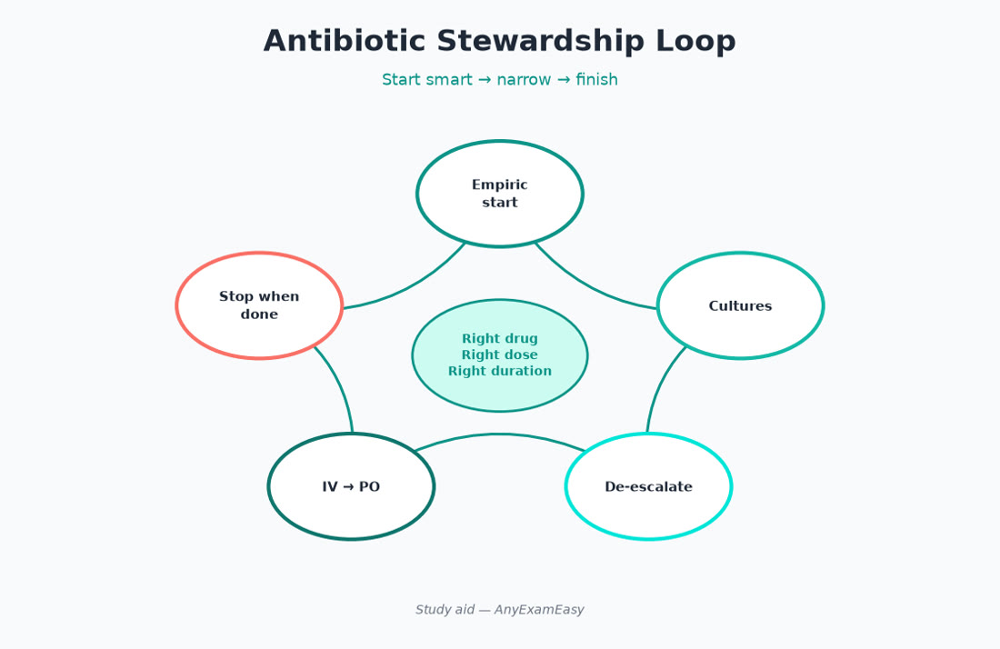
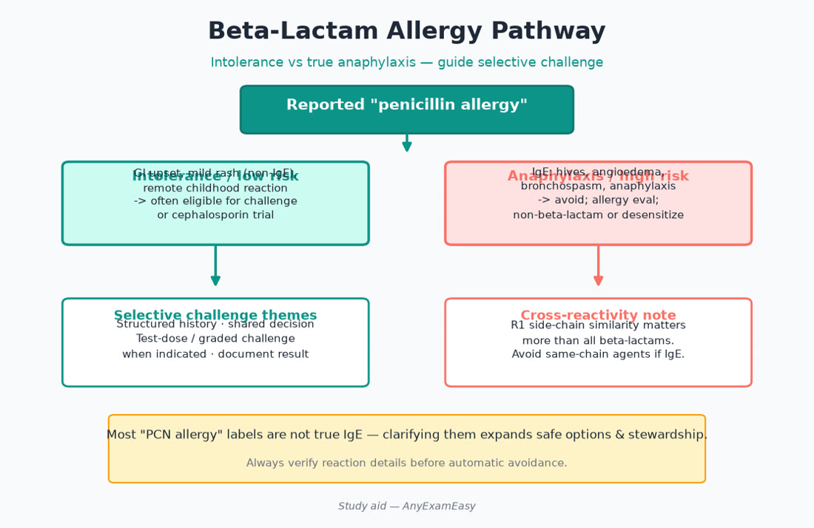
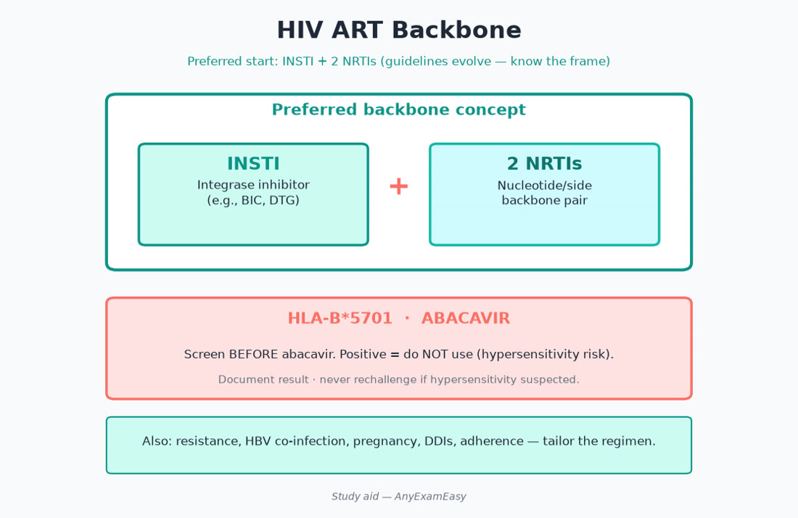

# Chapter 6 — Infectious Disease

> **Study aid only.** Stewardship and regimen themes for exam prep — not a substitute for culture data, ID consult, or current IDSA-style guidance.

---

## Why it matters on NAPLEX

ID items test **bug-drug-patient** matching, allergy assessment, organ dosing, interactions (especially HIV/HCV/azole/rifamycin), and stewardship: right drug, dose, route, duration — then narrow or stop. Stewardship is pharmacist identity on this exam: IV→PO, stop treating colonization, and catch daptomycin-for-pneumonia mistakes.

---

## Topic A — Stewardship principles

### Key concepts

- Empiric therapy → de-escalate with cultures/clinical response.  
- IV→PO when absorbing and clinically stable (excellent bioavailability agents are classic switches).  
- Avoid treating asymptomatic bacteriuria in most non-pregnant adults.  
- Duration: longer isn’t always better — confirm current syndrome guidance.  
- Double coverage only when evidence/context supports (e.g., selected severe Pseudomonas themes).  
- Source control beats endless antibiotic escalation.

### Pharmacist moves

1. Allergy clarification (reaction type/timing).  
2. Renal/hepatic adjust.  
3. Interaction check (warfarin + many antibiotics; QT; CYP).  
4. Counsel adherence and expected side effects.  
5. Monitor efficacy (fever curve, WBC, source control) and toxicity.  
6. Time-out at 48–72 hours: still needed? Can we narrow?

### IV→PO checklist themes

- Hemodynamically improving  
- Functioning GI tract  
- Oral option covers the pathogen  
- No unresolved undrainable focus requiring IV (nuance)

---

## Topic B — Major antibacterial classes (judgment hooks)

| Class | Hooks |
| --- | --- |
| Beta-lactams | Time-dependent; allergy nuances; seizures at high doses/renal failure |
| Vancomycin | AUC/trough monitoring themes; nephrotoxicity; Red Man (infusion rate) |
| Aminoglycosides | Concentration-dependent; levels; oto/nephro toxicity |
| Macrolides | QT; CYP3A interactions; GI |
| Fluoroquinolones | Tendon, CNS, QT, aortic/hypoglycemia warnings — reserve appropriately |
| Tetracyclines | Photosensitivity; chelation; teeth themes in young children/pregnancy |
| TMP-SMX | HyperK; SJS/TEN rare; warfarin INR surge; crystalluria hydration |
| Metronidazole | Alcohol disulfiram-like counseling; anaerobic/protozoal niches |
| Linezolid | Serotonin syndrome with serotonergics; myelosuppression with duration |
| Daptomycin | Muscle toxicity (CK); inactivated by lung surfactant (not for pneumonia) |

### Beta-lactam allergy pathway (exam mindset)

- Anaphylaxis to penicillin ≠ automatic forever ban on all beta-lactams without assessment.  
- Many “allergies” are intolerances (GI).  
- Cross-reactivity depends on side chains/classes — think carefully; follow institutional protocols.  
- Severe delayed reactions (SJS/TEN, DRESS) → specialist caution; don’t casually rechallenge.

> **Red flag:** Labeling everyone “PCN allergic” and defaulting to fluoroquinolones for every infection.

---

## Topic C — Common syndromes (high-yield)

### CAP / HAP themes

- Outpatient vs inpatient regimen themes; comorbidities; MRSA/Pseudomonas risk factors for CAP.  
- HAP/VAP: local resistance, prior IV antibiotics, MDR risk — institutional antibiograms matter.  
- Vaccination counseling (pneumococcal, influenza, COVID per current ACIP).  
- Duration often shorter than historical 10–14 day habits for uncomplicated CAP — confirm current guidance themes.

### UTI

- Uncomplicated cystitis vs pyelo vs complicated.  
- Pregnancy: treat bacteriuria; agent safety matters.  
- Male / catheter / structural disease → complicated framing.  
- Asymptomatic bacteriuria: usually don’t treat (exceptions: pregnancy, upcoming urologic procedures disrupting mucosa — themes).

### Skin / soft tissue

- Purulent vs nonpurulent; MRSA risk.  
- Abscess → drainage primary.  
- Necrotizing infection red flags: pain out of proportion, rapid progression → emergency care.

### Intra-abdominal / C. difficile

- Source control.  
- C. diff: stop culprit abx when possible; guideline-preferred agents; avoid antimotility; infection control; recurrence pathways (fidaxomicin/bezlotoxumab/FMT themes at high level).

### Meningitis themes

- Empiric coverage urgency; steroids timing concepts in bacterial meningitis; Listeria age risk (neonates, older adults, pregnancy).  
- Never delay therapy for logistics when bacterial meningitis suspected.

### Endocarditis / osteomyelitis duration mindset

- Long IV→oral transitions increasingly evidence-based for some osteo cases — follow ID guidance themes.  
- Staph bacteremia: repeat cultures / echo themes; ID involvement common.  
- OPAT: line care, lab calendar, who to call for rash/fever recurrence.

---

## Topic D — Antifungals & antivirals (selected)

- Azoles: CYP interactions galore; QT; hepatotoxicity; food/acid requirements for some.  
- Amphotericin: nephrotoxicity, electrolyte wasting.  
- Echinocandins: Candida bloodstream themes.  
- Oseltamivir timing for influenza (earlier is better).  
- HSV/VZV antivirals: renal dosing; hydration for IV acyclovir crystalluria themes.  
- Hepatitis B/C: regimens specialized — focus on interactions and counseling adherence if stemmed.

---

## Topic E — HIV essentials for NAPLEX

### Key concepts

- Prefer guideline-recommended INSTI-based regimens for many starting ART (verify current DHHS themes).  
- Never monotherapy; never dual NRTI alone as complete modern ART.  
- **HLA-B\*5701 before abacavir.**  
- Tenofovir formulations: TDF vs TAF renal/bone tradeoffs.  
- Boosters (ritonavir/cobicistat) = interaction bombs.  
- Opportunistic infection prophylaxis thresholds (CD4 themes).  
- PrEP/PEP: adherence and renal monitoring themes; confirm current CDC regimens when studying.

### Counseling

- Daily adherence prevents resistance.  
- U=U concepts may appear in counseling tone — stick to accurate, non-stigmatizing education.  
- Separate polyvalent cations from some INSTIs.  
- New Rx for cough/ulcer/anticonvulsant → interaction check every time.

### Remember this

- Abacavir ↔ HLA-B\*5701.  
- Boosted PIs/INSTI regimens → check every new drug.  
- Stewardship = shortest effective duration + narrowest effective spectrum.

---

## Topic F — Hepatitis & latent TB themes (exam level)

- HBV: nucleos(t)ide analogs require adherence; flares if stopped casually; screen before immunosuppression/chemo when indicated.  
- HCV: DAA specialty regimens — NAPLEX angle is interaction checks, adherence, and cure-as-goal counseling.  
- Latent TB: rifamycin short courses vs isoniazid themes; hepatotoxicity monitoring; rifampin induction on warfarin, DOACs, OCPs, CNIs.

### Remember this

- Rifampin = induction earthquake — re-check the entire profile.  
- Don’t stop HBV therapy without a plan when suppressing virus.

---

## Pharmacist ISCM vignettes

### Vignette 1 — CAP outpatient

**I:** CAP without MRSA/Pseudomonas risks. **S:** QT/interaction check; allergy pathway; pregnancy. **C:** Finish intended duration; take with food if needed; sun/tendon warnings if FQ used. **M:** Fever/ SOB trajectory at 48–72 h; C. diff symptoms.

### Vignette 2 — “PCN allergy” on cefazolin need

**I:** MSSA SSTI; cefazolin preferred. **S:** Clarify childhood rash vs anaphylaxis; prior cephalosporin tolerance. **C:** Explain allergy assessment rationale. **M:** Observe first doses if protocolized challenge/test-dose pathways used.

### Vignette 3 — New ART start

**I:** Treatment-naïve HIV; INSTI-based regimen. **S:** HLA-B\*5701 if abacavir; HBV co-infection tenofovir needs; baseline labs. **C:** Adherence; cation spacing; stigma-free support. **M:** Viral load/CD4 per guidelines; renal if TDF; interaction screen each visit.

---

## Concept checks

**1.** Daptomycin is a poor choice for pneumonia because:  
A. It prolongs QT uniquely  B. Pulmonary surfactant inactivates it  C. It has no gram-positive activity  D. It requires anaerobic coverage always  
**Answer:** B.

**2.** Patient reports childhood rash with penicillin, tolerated cephalexin later. Next best mindset?  
A. Never give any beta-lactam forever  B. Clarify reaction; many can receive carefully selected beta-lactams per protocol  C. Give fluoroquinolone automatically for every infection  D. Ignore allergy documentation  
**Answer:** B.

**3.** Abacavir requires which pre-start test theme?  
A. HLA-B\*5701  B. G6PD only  C. Troponin  D. Amylase only  
**Answer:** A.

**4.** Asymptomatic bacteriuria in a non-pregnant adult outpatient — usual stewardship move?  
A. Treat with 14 days FQ always  B. Generally do not treat  C. Lifelong nitrofurantoin  D. Immediate CT scan mandate by pharmacist  
**Answer:** B.

**5.** Best IV→PO theme when patient is improving on highly bioavailable therapy?  
A. Continue IV for tradition  B. Switch to PO when clinically appropriate  C. Stop all antibiotics abruptly without plan  D. Add aminoglycoside automatically  
**Answer:** B.

---

## Topic G — Spectrum & organism hooks (study aid)

| Scenario theme | Coverage thinking |
| --- | --- |
| MSSA | Anti-staph beta-lactam preferred over vanco when possible |
| MRSA | Vanco/daptomycin/linezolid/ceftaroline themes — site matters (dapto ≠ pneumonia) |
| Pseudomonas | Pip-tazo, cefepime, certain carbapenems, cipro/levo (not moxi), AG — local resistance |
| Anaerobes (mouth vs gut) | Ampicillin/sulbactam, metro, carbapenems, etc. — match site |
| Atypicals (CAP) | Macrolide/FQ/doxy themes |
| ESBL | Often carbapenem themes for serious infections — stewardship nuance evolving |
| C. diff | Oral vanco or fidaxomicin themes — not IV vanco for colonic disease |

### Duration & stop rules

- Reassess at 48–72 h with cultures.  
- Uncomplicated cystitis: short-course agents when appropriate.  
- Cellulitis without abscess: often shorter than historical long courses — confirm guidance.  
- Osteomyelitis/endocarditis: long — don’t casual-stop.  
- Document intended stop date on order entry when possible.

---

## Topic H — Interaction & toxicity hot list for ID

| Pair / issue | Why it matters |
| --- | --- |
| Warfarin + TMP-SMX / metro / FQ | INR spikes / bleed |
| Linezolid + SSRI/SNRI/MAOI/tramadol | Serotonin syndrome |
| Macrolide/FQ + other QT drugs | TdP risk |
| Rifampin + DOAC/warfarin/OCP/CNI/ART | Induction failure of substrate |
| Azole + CYP3A substrates | Toxicity of substrate; QT |
| Valproate + carbapenems | Valproate levels crash |
| AG + vanco + other nephrotoxins | Additive kidney injury |
| IV acyclovir under-hydrated | Crystal nephropathy |

### Vancomycin practical

Modern practice favors AUC-guided dosing themes over trough-only in many centers — know both concepts. Red man syndrome → slow infusion, antihistamine per protocol; true allergy differs. Rising SCr → reassess dose/interval and concomitant nephrotoxins.

### Aminoglycoside practical

Extended-interval dosing when appropriate; levels; avoid in some myasthenia contexts; counsel tinnitus/balance changes.

---

## Topic I — Meningitis & encephalitis pharmacist urgency

- Empiric therapy minutes matter — don’t delay for CT if not required.  
- Dexamethasone timing relative to antibiotics in pneumococcal meningitis themes.  
- Acyclovir early when HSV encephalitis in differential.  
- Adjust for age (Listeria coverage in extremes of age).  
- Renal dosing for acyclovir/vanco; hydration.

### SSTI algorithm vibe

1. Purulent vs nonpurulent  
2. Mild vs moderate vs severe  
3. MRSA risk factors  
4. Drain abscesses  
5. Reassess in 48 h — failure may mean wrong bug, deep infection, or resistance

### UTI algorithm vibe

1. Symptoms vs colonization  
2. Cystitis vs pyelo  
3. Complicated features  
4. Pregnancy?  
5. Local resistance (e.g., TMP-SMX/FQ resistance rates)  
6. Counsel fluids, finish course, return if fever/flank pain

---

## Topic J — HIV opportunistic infection prophylaxis themes

- PCP prophylaxis below CD4 thresholds (TMP-SMX classic).  
- Toxoplasma IgG+ additional considerations at lower CD4.  
- MAC prophylaxis historically at very low CD4 — confirm current guidance as ART potency changed practice.  
- Vaccinations: avoid live vaccines when immunocompromised; hepatitis/pneumococcal/influenza importance.

### PrEP/PEP counseling essentials

- Adherence makes or breaks PrEP.  
- Renal monitoring for tenofovir-containing PrEP.  
- PEP is time-sensitive after exposure — urgent evaluation.  
- Nonjudgmental sexual health counseling; STI screening themes.

---

## Topic K — Stewardship communication scripts

- “Cultures are negative and patient is well — recommend stopping vancomycin.”  
- “Excellent bioavailability — recommend oral step-down today.”  
- “Asymptomatic bacteriuria — recommend no antibiotics.”  
- “Daptomycin won’t treat this pneumonia — recommend alternative.”  
- “Rifampin will induce metabolism of the transplant meds — need plan before starting.”

### Remember this (chapter close)

- Bug–drug–patient–place (site) — all four.  
- Allergy labels deserve investigation.  
- Interactions with warfarin, ART, azoles, and rifampin change lives.

---

## Topic L — Outpatient parenteral antibiotic therapy (OPAT)

OPAT succeeds when labs, line care, and communication are scheduled. Pharmacists verify drug stability in pumps, counsel on red-flag fever/rigors/line erythema, and ensure AUC/level draws happen for vancomycin. Missed lab windows are safety events — reschedule, don’t ignore. When oral options become appropriate, transition and remove lines ASAP to cut CLABSI risk.

### Special populations in ID

- Pregnancy: avoid tetracyclines/FQ generally; treat bacteriuria; Listeria food counseling.  
- Pediatrics: weight-based; avoid tetracyclines in young children for teeth staining themes; codeine restrictions unrelated but often co-appear in peds safety stems.  
- Dialysis: dose after HD when removed; confirm supplemental doses.  
- Neutropenia: fever is an emergency — rapid broad IV therapy (see oncology chapter).

### C. difficile prevention angle

Minimize unnecessary antibiotics and PPIs when possible; isolate per policy; soap-and-water hand hygiene themes (spores); dedicated equipment. Recurrence risk counseling after first episode.

### Fungal pearls quick list

- Candida in blood is never a contaminant until proven otherwise — echinocandin themes often.  
- Azole therapeutic drug monitoring for some (voriconazole themes).  
- Amphotericin premedication/hydration strategies institutional.  
- Dermatophyte OTCs differ from systemic azoles for extensive disease — refer when severe.

### Remember this (final)

- Stewardship is active: start smart, narrow early, stop promptly.  
- Site of infection changes drug choice as much as the organism name.  
- Every new antibiotic on warfarin or ART deserves an interaction pause.

---

## Topic M — Rapid ID exam traps (memorize the vibe)

1. Daptomycin for pneumonia → wrong.  
2. Treating asymptomatic bacteriuria in non-pregnant adults → usually wrong.  
3. IV vancomycin for C. diff colitis → wrong route for that disease.  
4. Starting abacavir without HLA-B*5701 → wrong.  
5. Rifampin added without checking warfarin/DOAC/OCP/CNI/ART → wrong.  
6. Linezolid + SSRI without serotonin caution → incomplete.  
7. “PCN allergy” forever FQ for MSSA when cefazolin would work after assessment → stewardship fail.  
8. No stop date on empiric broad therapy → process fail.  
9. Ignoring renal dosing on AG/vanco/many beta-lactams → harm.  
10. Live vaccines in significantly immunocompromised hosts → wrong.
