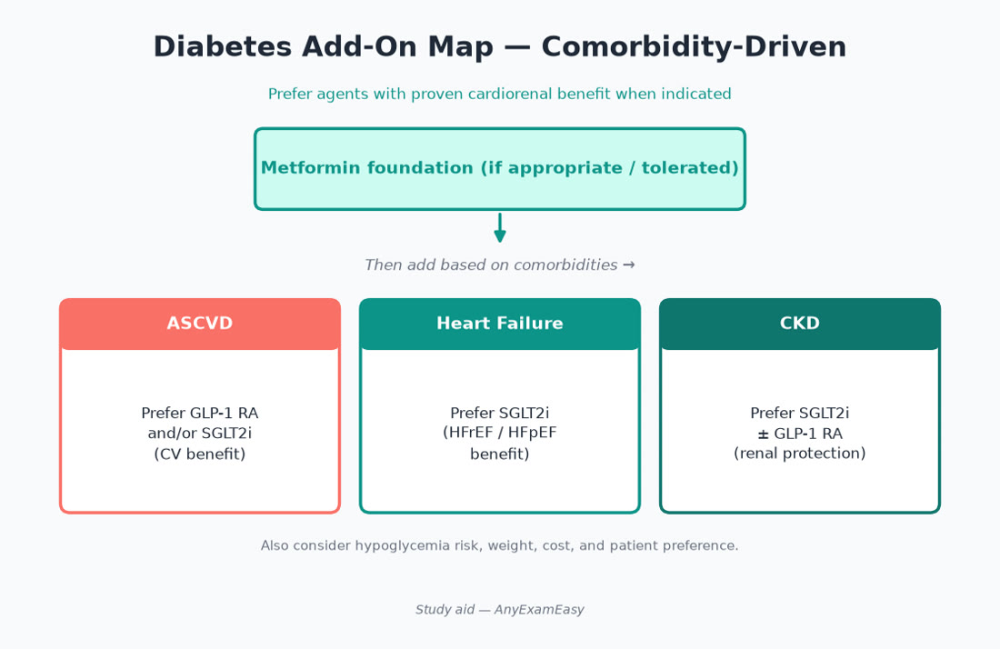
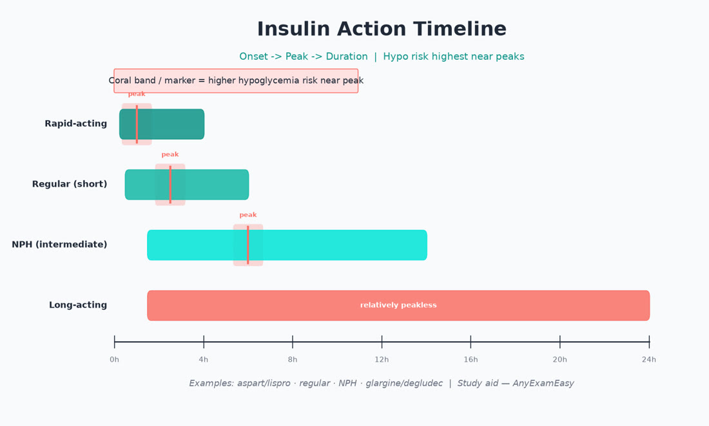
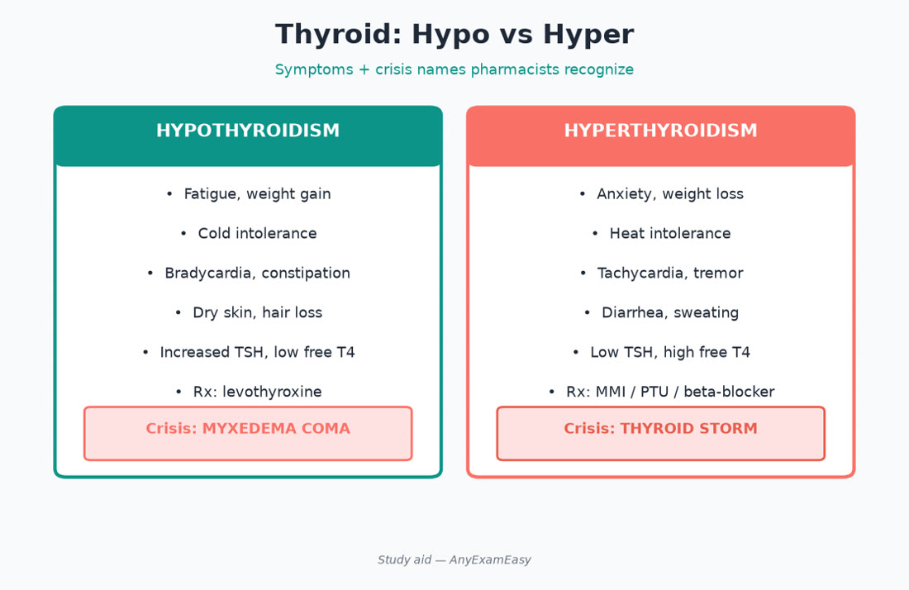
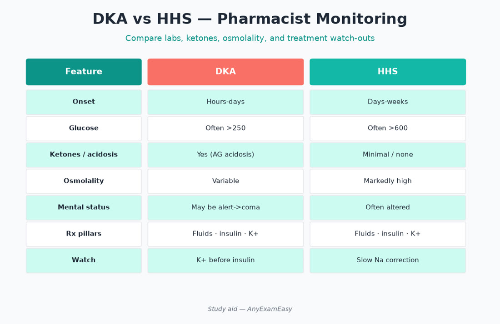

# Chapter 7 — Endocrine

> **Study aid only.** Glucose targets and regimens are individualized — verify ADA-aligned standards and labeling. Not dosing advice for real patients.

---

## Why it matters on NAPLEX

Endocrine stems reward **regimen design**, hypo prevention, device counseling, sick-day rules, thyroid replacement timing, and steroid taper/stress-dose awareness. Modern Type 2 diabetes care is comorbidity-driven: ASCVD, HF, and CKD often pick the second agent before A1C vanity alone.

---

## Topic A — Type 2 diabetes (comorbidity-driven therapy)

### Key concepts

- Lifestyle + metformin foundation for many (if tolerated/eGFR allows).  
- Add agents by comorbidity: **ASCVD/HF/CKD → SGLT2 and/or GLP-1 RA themes** independent of A1C in modern algorithms (confirm current ADA Standards).  
- Avoid therapeutic inertia; also avoid stacking hypo-prone agents carelessly.  
- Injection technique and storage for GLP-1 RAs / insulin.  
- Weight, cost, hypoglycemia risk, and patient preference still matter.

### Class comparison table

| Class | Efficacy vibe | Key risks / pearls |
| --- | --- | --- |
| Metformin | Foundation | GI; B12 long-term; lactic acidosis rare — eGFR rules |
| SGLT2i | CV/renal benefit | Genital mycotic, volume depletion, euglycemic DKA rare; amputation/Fournier rare boxed themes — counsel hygiene |
| GLP-1 RA | Weight + CV benefit (agent-specific) | GI; boxed caution themes (MEN2/MTC history); titrate slowly |
| Dual GIP/GLP-1 themes | Potent weight/A1C | GI titration; same counseling discipline as GLP-1 class |
| DPP-4i | Modest A1C | Weight neutral; HF caution with saxagliptin themes; don’t stack with GLP-1 |
| Sulfonylurea | Cheap A1C drop | Hypoglycemia; weight gain; caution elderly |
| TZD | Insulin sensitizer | Edema/HF; fracture themes; bladder cancer caution themes for pioglitazone historically |
| Insulin | Most potent | Hypo; education intensive |

### Assessment cues

- Hypoglycemia unawareness.  
- eGFR for metformin/SGLT2 dosing/continuation.  
- Gastroparesis affecting absorption / GLP-1 GI intolerance.  
- Steroid-induced hyperglycemia.  
- Heart failure symptoms before starting TZD.

### Treatment priority sketch

1. Metformin if appropriate.  
2. Layer SGLT2/GLP-1 for cardiorenal indications when eligible.  
3. Address persistent hyperglycemia with additional agents/insulin.  
4. De-intensify hypo-causing agents in elderly / low A1C with frailty.

### Counseling

- Hypo treatment (15-15 rule themes) for insulin/secretagogues; glucagon access when high risk.  
- SGLT2: stop before surgery/prolonged fasting per protocols; hydration; genital hygiene.  
- GLP-1: eat smaller meals; report severe abdominal pain (pancreatitis concern); missed-dose rules per product.  
- Foot care; screenings (eye, kidney, feet).  
- Sick-day: when to check more often; when to call.

### Safety / red flags

> **Red flag:** Combining GLP-1 RA + DPP-4i generally not useful. Pioglitazone in symptomatic HF. Insulin U-500 confusion.

### Remember this

- Match second agent to ASCVD/HF/CKD first when indicated.  
- Metformin + eGFR rules.  
- Hypo education whenever risk exists.

---

## Topic B — Insulin therapeutics

### Key concepts

- Basal vs bolus vs premix roles.  
- Correct stacking / “insulin on board” concepts.  
- Sick-day: never stop insulin blindly in T1; ketone checking themes.  
- Concentrated insulins and pens: brand-specific counseling.  
- Peak timing: rapid-acting with meals; basal relatively peakless (product-specific).

### Onset/peak/duration teaching vibe

| Type | Role hooks |
| --- | --- |
| Rapid (lispro/aspart/glulisine) | Meals / corrections |
| Regular | IV infusions; some meal use |
| NPH | Intermediate; peaks → hypo risk |
| Basal analogs (glargine/detemir/degludec) | Background coverage |
| U-500 regular | Severe insulin resistance — special counseling |

### Acute crises (pharmacist lens)

- **DKA/HHS:** fluids, insulin infusion protocols, potassium repletion vigilance — inpatient team sport.  
- Outpatient: recognize precipitants (infection, missed insulin, SGLT2 + stress).  
- Euglycemic DKA on SGLT2: nausea/vomiting/fatigue with near-normal glucose — don’t dismiss.

### Hypoglycemia management

- Conscious: ~15 g fast carbs; recheck ~15 min; repeat; then protein/complex carb per plan.  
- Unconscious: glucagon (IM/IN/SC products); call emergency services; IV dextrose inpatient.  
- Review cause: dose error, skipped meal, exercise, alcohol, renal decline.

---

## Topic C — Thyroid disorders

### Key concepts

- Levothyroxine: morning empty stomach; separate from cations/binders; consistent product when possible.  
- TSH monitoring timing after dose changes (~4–6 weeks themes).  
- Hyperthyroidism: methimazole preferred in many non-pregnant; PTU in first trimester themes historically — verify current guidance.  
- Agranulocytosis counseling (fever/sore throat) for thionamides.  
- Thyroid storm / myxedema = emergencies (supportive + directed therapy).  
- Amiodarone and lithium can derange thyroid — monitor.

### Hypo vs hyper counseling contrast

| Hypothyroid on LT4 | Hyperthyroid on thionamide |
| --- | --- |
| Empty stomach consistency | Report fever/sore throat ASAP |
| Separate iron/Ca/PPI timing issues | Hepatotoxicity awareness (esp. PTU) |
| Don’t titrate daily by mood | Adherence prevents storm |

### Remember this

- Empty-stomach levothyroxine + separate binders.  
- Don’t adjust doses daily based on symptoms alone — use labs timed properly.

---

## Topic D — Adrenal / corticosteroids

### Key concepts

- Physiologic vs pharmacologic dosing.  
- Taper after prolonged use to avoid adrenal crisis.  
- Stress dosing education for adrenal insufficiency.  
- Long-term risks: infection, osteoporosis, hyperglycemia, hypertension, mood, PUD risk with NSAIDs.  
- Inhaled/intranasal/topical steroids still add to cumulative burden in high doses.

### Pharmacist crisis prevention

Counsel medical alert habits for adrenal insufficiency; never abrupt-stop chronic steroids; vomiting/illness → stress-dose plan per clinician.

---

## Topic E — Osteoporosis & reproductive hormones

### Osteoporosis

- Bisphosphonates / denosumab vs anabolics (specialty).  
- Oral bisphosphonate: upright 30–60 min, full glass water, separate cations; rare ONJ/atypical fracture awareness; dental exam themes before start.  
- Denosumab: rebound vertebral fracture risk if delayed/stopped without plan.  
- Calcium/vitamin D foundation; fall prevention.  
- IV zoledronic acid: renal function, flu-like reaction counseling.

### Contraception / hormones

- CHC: VTE / migraine-with-aura / smoking-age cautions.  
- Enzyme-inducing ASMs/rifampin reduce CHC efficacy — backup methods.  
- Emergency contraception timing.  
- Menopausal HRT: individualized risk framing (VTE, breast cancer, timing from menopause).  
- Testosterone/estrogen therapy: hematocrit, VTE, prostate monitoring themes when stemmed.

### Remember this

- Bisphosphonate sit-upright counseling prevents esophagitis.  
- Inducers + CHC = pregnancy risk counseling.

---

## Topic F — Type 1 diabetes & technology themes

- Always need insulin — never “oral only.”  
- Carb counting / ICR / ISF concepts at exam level.  
- CGM/pump: site rotation; hypo alarms; sick-day ketone checks.  
- Honeymoon phase doesn’t mean stop insulin casually.

---

## Pharmacist ISCM vignettes

### Vignette 1 — T2D + HFrEF

**I:** Add SGLT2 if eligible after metformin. **S:** Volume status, eGFR, genital infection history, DKA risk with low carb/surgery. **C:** Hygiene, hydration, sick-day hold rules. **M:** Weight, BP, Cr/eGFR, genital symptoms, A1C.

### Vignette 2 — New levothyroxine

**I:** Hypothyroidism replacement. **S:** CAD start-low themes in elderly; interactions. **C:** Empty stomach; separate coffee/cations per labeling habits; consistent brand when possible. **M:** TSH in 4–6 weeks; symptoms; AF signs if over-replaced.

### Vignette 3 — Chronic prednisone

**I:** Autoimmune flare course extending weeks. **S:** Infection, glucose, BP, mood, bone; taper plan. **C:** Take with food; don’t stop abruptly; infection warning. **M:** Glucose, BP, weight; consider bone protection if prolonged.

---

## Concept checks

**1.** T2D + HFrEF — preferred add-on class theme after metformin (if eligible)?  
A. Sulfonylurea first always  B. SGLT2 inhibitor  C. Meglitinide  D. Hot thyroid hormone  
**Answer:** B.

**2.** Levothyroxine counseling pearl?  
A. Take with iron for better absorption  B. Take consistently on empty stomach; separate from iron/calcium  C. Double dose if tired that day  D. Crush and mix with soy milk always  
**Answer:** B.

**3.** Why avoid DPP-4i + GLP-1 RA together?  
A. Synergy mandatory  B. Little added benefit / not useful stacking theme  C. Required by REMS  D. Cancels metformin  
**Answer:** B.

**4.** First step for conscious hypoglycemia on insulin?  
A. Long-acting insulin bolus  B. ~15 g fast-acting carbohydrate; recheck  C. Ignore until next meal  D. High-dose aspirin  
**Answer:** B.

**5.** Oral bisphosphonate key counseling?  
A. Lie down immediately after  B. Upright 30–60 min with full glass water; separate cations  C. Take with milk always  D. Crush and put in juice  
**Answer:** B.

---

## Topic G — Hyperglycemia hospital & steroid themes

Steroid bursts raise glucose — anticipate, don’t wait for crisis. NPH or correctional algorithms often appear in hospital protocols; hold parameters prevent stacking. Transition back to home regimen carefully at discharge; ensure patients on new insulin leave with supplies, education, and hypo plan. Tube feeds / TPN need basal coverage strategies — coordinate with nutrition.

### Weight-management overlap

GLP-1 and dual agonists used for weight may appear in stems with GI titration and gallbladder/pancreatitis caution themes. Distinguish compounding “research” pens (unsafe) from approved products — counsel FDA-approved pathways only.

### Continuous glucose monitoring counseling

Explain sensor warm-up, acetaminophen/interference themes for some older sensors (product-specific), when to confirm with fingerstick (hypo symptoms, discordant values), and alarm fatigue. CGM does not replace ketone checks in T1 sick days.

---

## Topic H — Osteoporosis decision tree (pharmacist)

1. Assess fracture history, DEXA, fall risk, calcium/vit D intake.  
2. Address reversible causes (hyperthyroid, steroids, smoking, alcohol, hypogonadism themes).  
3. Antiresorptive vs anabolic referral for very high risk.  
4. Counsel administration meticulously — technique failures cause esophagitis or missed denosumab doses.  
5. Dental health before IV/high-potency antiresorptives when possible.  
6. Plan the exit strategy for denosumab (transition to bisphosphonate themes) to prevent rebound fractures.

### Thyroid + AF / osteoporosis links

Over-replacement with LT4 can worsen AF and bone loss — especially elderly. Titrate to age-appropriate TSH targets per guidance themes.

### Adrenal vignette expansion

Patient on prednisone 20 mg for 8 weeks stopping tomorrow “because they feel better” → intervene: taper plan, adrenal crisis education, sick-day rules. Stress-dose cards for known adrenal insufficiency are lifesaving counseling.

### Diabetes + CKD deep hooks

- Metformin eGFR cutoffs/dose adjustments — confirm current labeling.  
- SGLT2 renal indications may extend to nondiabetic CKD themes — confirm current labeling.  
- Avoid repeated nephrotoxins; ACEI/ARB kidney protection in albuminuric CKD.  
- Hypoglycemia risk rises as GFR falls for insulin/sulfonylureas — de-intensify.

### Insulin pen safety

Prime pens; hold after injection; never share pens (bloodborne pathogen risk even with new needles); match pen needles; store in-use pens per product (often room temp time-limited). U-500: only with dedicated pen/syringe education.

### Remember this (chapter close)

- Comorbidities pick many T2D add-ons.  
- Hypoglycemia plans are part of the prescription.  
- Thyroid timing and steroid tapers are high-yield pharmacist saves.

---

## Topic I — Reproductive endocrine & PCOS themes (brief)

PCOS may involve metformin, combined hormonal contraceptives for cycle regulation when safe, anti-androgens specialty, and fertility pathways — screen VTE risk before CHC. Counsel weight, glucose screening, and endometrial protection themes. For gestational diabetes, insulin is classic preferred pharmacologic; metformin/glyburide nuances exist in practice — verify current Ob guidance if stemmed. Postpartum thyroiditis can confuse LT4 needs — don’t adjust wildly without labs.

### Pituitary / prolactin themes

Dopamine agonists (cabergoline/bromocriptine) for hyperprolactinemia: counsel nausea, orthostasis, impulse-control rare themes; take with food if needed. Interacting antipsychotics that raise prolactin may appear as cause — coordinate with psychiatry before abrupt stops.

### Exam-day endocrine checklist

- Cardiorenal agent before SU when indicated  
- Empty-stomach LT4  
- Upright bisphosphonate  
- Steroid taper / stress dose  
- Glucagon + 15-15 for hypo risk  
- SGLT2 sick-day / surgery holds  
- No GLP-1 + DPP-4 stack  
- DKA/HHS = fluids, insulin, K vigilance

### Final endocrine traps

SU in frail elderly with tight A1C → de-intensify. TZD + HF symptoms → stop/avoid. Missed denosumab dose → urgent reschedule/plan. LT4 with breakfast coffee and multivitamin → absorption fail. SGLT2 before bariatric bowel prep / surgery without hold → DKA risk. Insulin pen sharing → never.

When in doubt on NAPLEX endocrine stems: protect the heart and kidney first in T2D, prevent hypoglycemia, time thyroid correctly, taper steroids safely, and treat osteoporosis counseling as a fall-and-fracture prevention skill—not a footnote.

Confirm current ADA Standards of Care and product labeling whenever A1C targets, eGFR cutoffs, or pregnancy guidance appear on exam stems.
