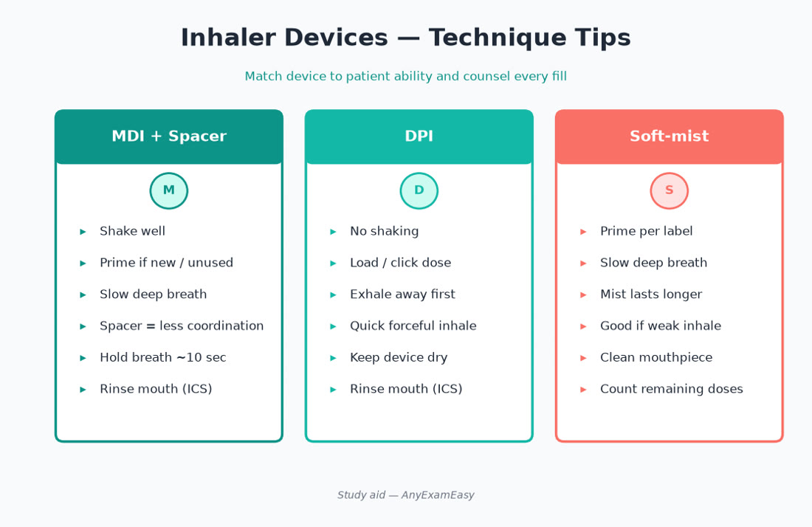
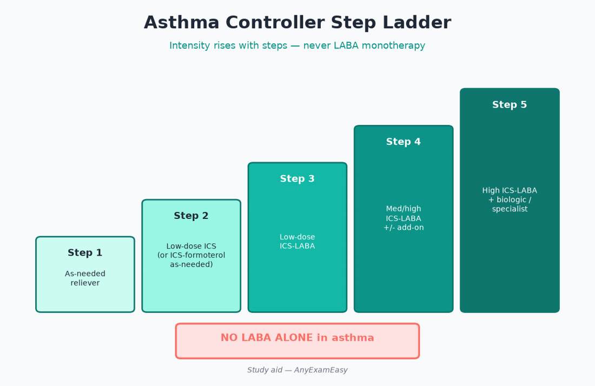
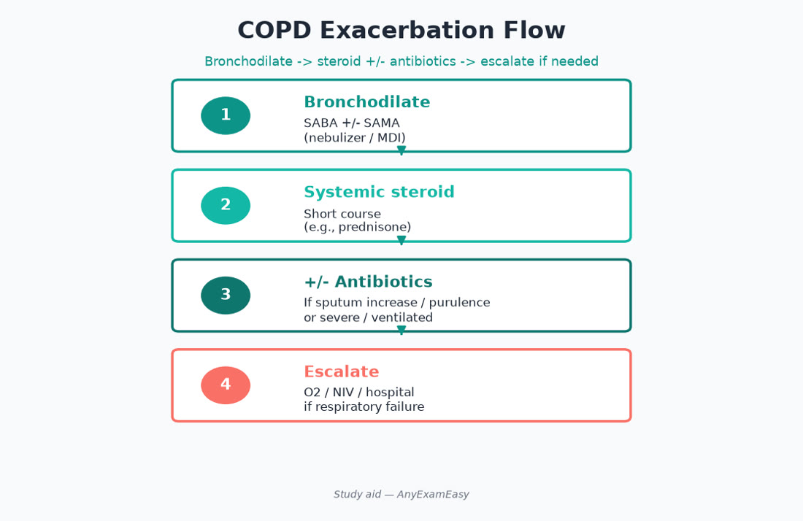

# Chapter 8 — Respiratory

> **Study aid only.** Asthma/COPD regimens follow evolving GINA/GOLD-aligned themes — verify current guidelines and product labeling. Device technique matters as much as drug choice.

---

## Why it matters on NAPLEX

Respiratory items test **controller vs reliever logic**, exacerbation management, device counseling, smoking cessation pharmacotherapy, and allergy/immunotherapy safety. Technique failure masquerades as drug failure — NAPLEX loves that trap. Never endorse LABA monotherapy in asthma.

---

## Topic A — Asthma (stepwise judgment)

### Key concepts

- Inflammation + variable airflow obstruction + airway hyperresponsiveness.  
- Reliever strategies evolving: many adults use ICS-containing reliever approaches per modern GINA themes (verify current). Classic teaching still contrasts SABA-only risks.  
- Controllers: ICS backbone; add LABA only in combination with ICS (**never LABA monotherapy in asthma**).  
- LAMA add-on, biologics for severe phenotypes (eosinophilic/IgE/IL-5 themes).  
- Step up for poor control; step down when stable after 3 months themes.  
- Written action plan beats verbal-only counseling.

### Stepwise vibe (confirm current GINA)

| Control issue | Pharmacist thinking |
| --- | --- |
| Rare symptoms | ICS-containing approach preferred over SABA-only chronic patterns |
| More frequent symptoms | Daily ICS or ICS-LABA maintenance |
| Uncontrolled on low-dose ICS-LABA | Increase ICS dose / add LAMA / check adherence & technique |
| Severe eosinophilic/allergic | Biologic referral themes |
| Exacerbation | Systemic steroids short course; escalate controller after |

### Assessment cues

- Night symptoms, rescue frequency, activity limitation, peak flow trends.  
- Red flags: silent chest, hypoxia, accessory muscles — emergency care.  
- Triggers: allergens, viral illness, NSAIDs/beta blockers in sensitive patients.  
- GERD, rhinitis, obesity as comorbidities worsening control.

### Device counseling table

| Device | Hooks |
| --- | --- |
| MDI | Shake, prime, slow inhale, spacer for many; rinse after ICS |
| DPI | Forceful inhale; don’t shake like MDI; humidity/capsules |
| Soft mist | Slow inhale; assembly/priming product-specific |
| Nebulizer | Cleaning; not automatically stronger than MDI+spacer |

### Counseling

- Shake/prime/spacer/rinse mouth after ICS (thrush, dysphonia).  
- Distinguish maintenance vs rescue inhalers visually (stickers help).  
- Action plan zones (green/yellow/red themes).  
- Nebs ≠ automatically “stronger” than proper inhaler + spacer.

### Safety

> **Red flag:** LABA alone for asthma. Oral steroid bursts without follow-up plan.

- Theophylline: narrow TI — mostly legacy.  
- Aspirin-exacerbated respiratory disease awareness.  
- Biologics: injection site, hypersensitivity, specialty monitoring.

### Remember this

- No LABA alone for asthma.  
- Technique failure looks like “drug failure.”  
- Mouth rinse after ICS.

---

## Topic B — COPD

### Key concepts

- Spirometry for diagnosis themes; smoking cessation = disease-modifying.  
- Bronchodilators (LAMA/LABA) foundation; ICS for exacerbators with eosinophil/asthma-overlap themes — not everyone needs ICS.  
- Exacerbation: bronchodilators, steroids (±), antibiotics when indicated (sputum purulence/severity criteria themes).  
- Oxygen for severe resting hypoxemia — CO₂ retainers need controlled O₂ targets.  
- Vaccinations critical (influenza, pneumococcal, COVID, pertussis/RSV themes per current ACIP).  
- Pulmonary rehab referral themes for deconditioning.

### Assessment cues

- Chronic bronchitis vs emphysema phenotypes (clinical).  
- Frequent exacerbators → escalate therapy / check eosinophils for ICS benefit likelihood.  
- Depression/anxiety and malnutrition common comorbidities.  
- Alpha-1 antitrypsin testing themes in younger/ nonsmoker emphysema.

### Exacerbation flowchart vibe

1. Increase short-acting bronchodilators.  
2. Systemic corticosteroids short course when indicated.  
3. Antibiotics if purulent sputum / certain criteria.  
4. Assess O₂ need carefully.  
5. Escalate controller after recovery; review inhaler technique.  
6. Red flags (respiratory failure) → ED.

### Counseling

- HandiHaler/Ellipta/Respimat technique differences.  
- Smoking cessation every visit.  
- Recognize exacerbation early (sputum, dyspnea change).  
- ICS pneumonia risk counseling in COPD — risk/benefit.

### Safety

- Chronic systemic steroids — avoid as maintenance when possible.  
- ICS pneumonia risk in COPD.  
- Uncontrolled O₂ in chronic hypercapnia can worsen CO₂ retention.

---

## Topic C — Allergic rhinitis & anaphylaxis readiness

### Key concepts

- Intranasal corticosteroids first-line for persistent allergic rhinitis.  
- Antihistamines: 2nd-gen preferred (less sedation).  
- Intranasal antihistamines / combination sprays.  
- Epinephrine autoinjector counseling for anaphylaxis history: when to use, hold correctly, call emergency services, second dose timing themes.  
- Immunotherapy: specialty-supervised; observe after injections.  
- Avoid 1st-gen antihistamines in elderly when possible (Beers).

### Autoinjector counseling checklist

1. Recognize anaphylaxis (skin + respiratory/GI/hypotension themes).  
2. Inject into mid-outer thigh; hold per device.  
3. Call emergency services even if improved.  
4. Second dose timing if available/needed.  
5. Positioning; avoid sudden standing if hypotensive.  
6. Expiration check; train caregivers; school plans for kids.

### Remember this

- Epinephrine first for anaphylaxis — not diphenhydramine alone.  
- Intranasal steroid technique (aim outward) reduces epistaxis.

---

## Topic D — Smoking cessation pharmacotherapy

### Key concepts

- NRT (patch/gum/lozenge/inhaler/nasal): combination NRT (patch + short-acting) often effective.  
- Varenicline: neuropsych monitoring historically — still counsel mood changes; start before quit date per labeling; vivid dreams.  
- Bupropion SR: seizure risk; avoid in eating disorder/seizure history themes; insomnia/dry mouth.  
- Behavioral support multiplies success.  
- E-cigarettes: not FDA-approved cessation drugs — don’t present as proven therapy on exam.

### Counseling pearls

- Patch: rotate sites; don’t smoke while using as a dual unrestricted habit without plan.  
- Gum: park-and-chew technique; avoid acidic beverages around dose.  
- Set quit date; address triggers; follow up.

---

## Topic E — Specialty pulmonary & oxygen

- PAH drugs (ERA, PDE-5, prostacyclin themes): REMS/monitoring/interactions when stemmed; don’t confuse PAH vs ED PDE-5 counseling.  
- Antifibrotics: GI/LFT monitoring specialty.  
- Home O₂: fire risk, no smoking, target sats per clinician (CO₂ retainers).  
- Nebulizer cleaning; peak flow technique for asthma plans.

### Remember this

- Controlled O₂ targets matter in chronic hypercapnia.  
- Device hygiene is part of therapy success.

---

## Pharmacist ISCM vignettes

### Vignette 1 — Uncontrolled asthma

**I:** Symptoms nightly; using SABA daily. **S:** Confirm no LABA monotherapy; check adherence/technique; oral steroid need. **C:** ICS-LABA technique + rinse; action plan. **M:** Rescue use diary; peak flows; exacerbation follow-up.

### Vignette 2 — COPD exacerbation

**I:** Increased dyspnea/sputum. **S:** Antibiotic criteria; steroid course; O₂ caution. **C:** Finish steroids/abx; inhaler review; smoking cessation offer. **M:** Symptom trajectory 48–72 h; pneumonia signs.

### Vignette 3 — Anaphylaxis history

**I:** Food allergy; fill epinephrine. **S:** Correct dose/device for weight; expiration. **C:** When/how to inject; call 911; second dose. **M:** Refill before expiry; practice trainer; allergy follow-up.

---

## Concept checks

**1.** Why is LABA monotherapy inappropriate in asthma?  
A. It cures inflammation alone  B. Associated with increased risk of asthma-related adverse outcomes without ICS  C. It never bronchodilates  D. DEA scheduling  
**Answer:** B.

**2.** First drug for anaphylaxis intramuscularly?  
A. Ranitidine  B. Epinephrine  C. Inhaled fluticasone only  D. Oral prednisone alone  
**Answer:** B.

**3.** Best foundational COPD intervention that modifies disease?  
A. Chronic systemic steroids for all  B. Smoking cessation  C. Theophylline monotherapy  D. Ignoring vaccines  
**Answer:** B.

**4.** Mouth rinse after ICS prevents mainly?  
A. Otitis  B. Oral candidiasis / dysphonia themes  C. Renal failure  D. Hyperkalemia  
**Answer:** B.

**5.** Oxymetazoline counseling limit theme?  
A. Unlimited months  B. About 3 days to avoid rhinitis medicamentosa  C. Only with MAOI  D. IV use only  
**Answer:** B.

---

## Topic F — Asthma vs COPD contrast table

| Feature | Asthma | COPD |
| --- | --- | --- |
| Age vibe | Often younger / allergic | Older / smoking history |
| Reversibility | Variable, often reversible | Persistent airflow limitation |
| ICS role | Core controller | Selected exacerbators / eos / overlap |
| LABA alone | Never | May appear with LAMA strategies |
| Biologics | Severe phenotypes | Not classic first-line COPD tool |
| Key counseling | Action plan + rinse | Smoking cessation + vaccines |

### Inhaler technique failure patterns

- MDI: inhaling too fast; not coordinating actuation; empty canister guessing  
- DPI: insufficient inspiratory flow; exhaling into device; swallowing capsule wrong  
- Holding chambers: not cleaning; multiple puffs without waiting  
- Soft mist: incomplete turn/prime  

Always demonstrate + teach-back. Refill too frequent for SABA = uncontrolled disease signal.

---

## Topic G — Acute severe asthma pharmacist actions

Oxygen per targets, frequent SABA (± ipratropium), systemic corticosteroids early, monitor response, prepare for escalation (Mg themes inpatient, ventilatory support). Avoid nonspecific beta blockers. Counsel after discharge: controller intensification, spacer, follow-up within days, trigger plan. Dispense epinephrine if anaphylaxis overlap unclear — but primary path is asthma exacerbation protocol.

### Allergic rhinitis step-up

1. Allergen avoidance practical tips  
2. Intranasal steroid daily (not PRN-only for persistent)  
3. Add antihistamine / saline irrigation  
4. Refer for immunotherapy if refractory  
5. Watch for CSF leak red flags with trauma history before nasal steroid in special cases — rare stem

### Smoking cessation motivational micro-script

Ask → Advise → Assess readiness → Assist (meds + counseling) → Arrange follow-up. Combine pharmacotherapy with behavioral support. Address weight gain fears, depression, and other smokers in household.

### Pulmonary drug interaction sparks

- Fluvoxamine / strong CYP1A2 inhibitors with some agents (theophylline legacy)  
- PAH ERA pregnancy REMS themes  
- Corticosteroids + CYP3A inhibitors → Cushingoid risk (even inhaled in extreme interaction cases themes)  
- Beta blockers in reactive airway disease — cardioselective nuance, still caution

### Oxygen safety counseling

No smoking/vaping/open flames; secure tanks; know target saturation range; report morning headaches/confusion that might signal CO₂ retention issues; humidification for high-flow comfort.

### Vaccination bundle for chronic lung disease

Keep current on influenza yearly, pneumococcal per age/indication schedules, COVID per ACIP, Tdap if due, RSV when indicated by age/risk — verify current ACIP at study time. Pharmacists screen and document.

### Remember this (chapter close)

- Device technique is therapy.  
- LABA needs ICS in asthma.  
- Exacerbation prevention: vaccines, smoking cessation, adherence, action plans.  
- Epinephrine first in anaphylaxis.

---

## Topic H — Community pharmacist respiratory triage

Refer urgently for: respiratory distress, blue lips, inability to speak full sentences, SpO2 concerning if measured, peak flow in red zone per plan, suspected anaphylaxis, hemoptysis, high fever with stiff neck, or chest pain with dyspnea. Mild seasonal rhinitis or stable mild cough without red flags may be self-care eligible with clear return precautions.

### Combination inhalers & adherence

Once-daily Ellipta-style or single-inhaler ICS-LABA-LAMA products can improve adherence versus multi-inhaler chaos — counsel the specific device. Insurance switches require technique re-training the same day. Never assume “same class, same inhaler skills.”

### Montelukast counseling note

Neuropsychiatric events boxed warning themes — counsel mood/behavior changes, especially in adolescents; reserve per current indication preference after shared decision. Still useful in select allergic rhinitis/asthma overlap cases.

### Rescue vs maintenance labeling

Put colored stickers: “EVERY DAY” vs “FOR RESCUE.” Ask patients to show you which inhaler they would grab if wheezing at 2 a.m. Wrong answer = teach again.

---

## Topic I — Final respiratory exam traps

SABA-only reliance without controller reassessment; DPI counseling as if it were an MDI; chronic oral steroids for COPD maintenance; skipping vaccines; giving diphenhydramine alone for anaphylaxis; ignoring pneumonia risk talk when adding ICS in COPD; uncontrolled oxygen in retainers; empty inhalers continued because the canister still “rattles.” Fix these and you pick up easy Domain 3 points.

Verify current GINA/GOLD documents when stepping therapy; product technique videos help teach-back stick. Pair every controller change with a device check the same day.

Keep spacers clean and replace inhalers before they run empty—dose counters beat rattling canisters.
