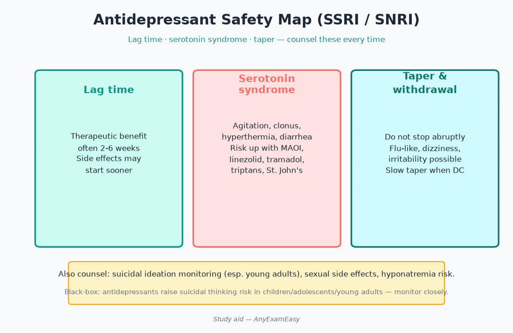
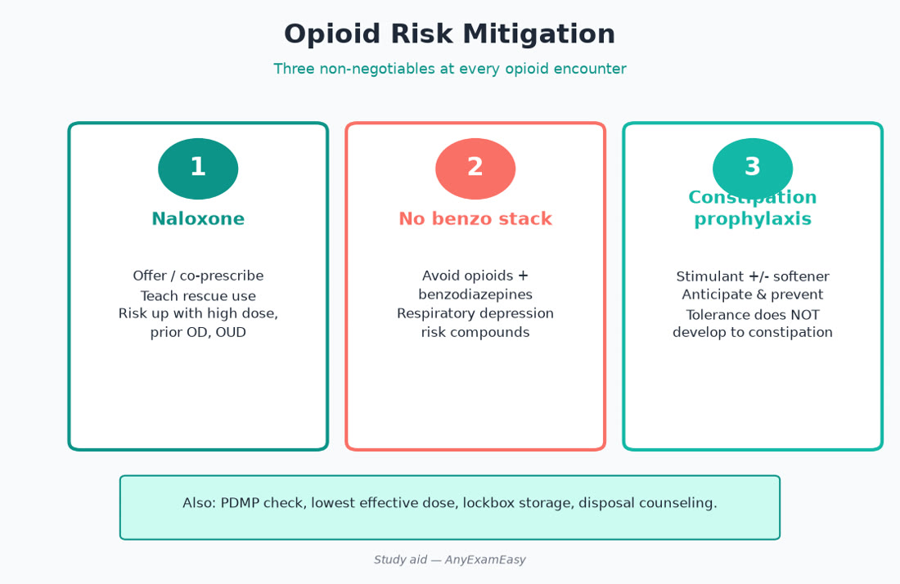
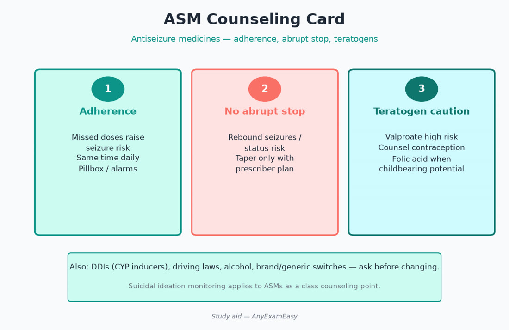

# Chapter 9 — Neuro / Psych

> **Study aid only.** Psychopharmacology and neurology themes for exam judgment — not a treatment protocol. Suicide risk, controlled substances, and monitoring requirements follow clinical/legal standards.

---

## Why it matters on NAPLEX

Neuro/psych stems emphasize **safety monitoring**, interaction checks (serotonin, QT, CYP), controlled-substance stewardship, adherence in chronic disease (epilepsy, Parkinson), and counseling that doesn’t stigmatize. Clozapine REMS, lithium interactions, lamotrigine titration, and opioid+naloxone clusters are classic.

---

## Topic A — Depression & anxiety pharmacotherapy

### Key concepts

- SSRIs/SNRIs common first-line themes; onset lag (weeks) — counsel expectations.  
- Boxed warning: suicidal ideation risk in younger patients — monitor activation.  
- Serotonin syndrome: MAOI interactions; tramadol/linezolid/triptans additive themes.  
- Discontinuation syndromes — taper when appropriate (especially paroxetine, venlafaxine).  
- Bipolar depression: antidepressant monotherapy risk of mania — mood stabilizer/antipsychotic frameworks.  
- Benzodiazepines: short-term roles; dependence, falls, cognitive risk — prefer SSRI/SNRI/buspirone for chronic anxiety themes.  
- Augmentation strategies (atypical antipsychotic, lithium) are specialty — watch metabolic/QT.

### Class hooks table

| Class | Pearls | Watch |
| --- | --- | --- |
| SSRI | First-line many | SIADH, bleed risk +NSAID, sexual SE, QT (citalopram ceilings) |
| SNRI | Pain overlap themes | BP ↑, discontinuation |
| Bupropion | Less sexual SE; smoking | Seizure risk; avoid eating disorders |
| Mirtazapine | Sleep/appetite | Sedation, weight |
| TCA | Neuropathic pain legacy | Anticholinergic, cardiotoxicity OD |
| MAOI | Refractory | Diet tyramine; washouts |
| Buspirone | GAD adjunct | Slow onset; CYP3A |
| Benzodiazepine | Acute bridge | Falls, dependence, opioid stack |

### Assessment cues

- Prior mania, seizure threshold, bleeding risk on SSRI + NSAID/anticoagulant.  
- Hyponatremia (SIADH) especially elderly on SSRIs.  
- Sexual side effects → adherence threat.  
- Pregnancy: paroxetine cardiac concern themes historically; sertraline often preferred — verify current guidance.

### Counseling

- Don’t stop abruptly without plan.  
- Alcohol potentiation with sedatives.  
- Time-to-benefit honesty (2–4+ weeks).  
- Report agitation, insomnia spike, or suicidal thoughts early after start/dose change.

### Safety / red flags

> **Red flag:** MAOI washouts ignored. Opioid + benzo stacks. Citalopram above dose ceilings with interacting QT drugs.

---

## Topic B — Antipsychotics

### Key concepts

- FGAs: EPS / tardive dyskinesia / NMS risk.  
- SGAs: metabolic syndrome (weight, lipids, glucose) — monitor.  
- Clozapine: REMS, ANC monitoring, constipation/ileus, myocarditis, seizures, smoking induction of metabolism.  
- Acute agitation vs long-acting injectables adherence roles.  
- QT risk varies (e.g., ziprasidone/thioridazine themes).

### Metabolic monitoring schedule vibe

Baseline and follow-up: weight/BMI, waist, BP, fasting glucose/A1C, lipids — especially olanzapine/clozapine/quetiapine themes.

### Remember this

- Clozapine = monitoring intensive.  
- Metabolic monitoring for SGAs is not optional trivia.  
- Smoking ↓ clozapine levels — cessation can raise levels/toxicity.

---

## Topic C — Mood stabilizers

| Agent | Hooks |
| --- | --- |
| Lithium | Narrow TI; levels; Na/dehydration; NSAIDs/ACEI/thiazides ↑ levels; thyroid/renal long-term |
| Valproate | Teratogenicity; LFTs/platelets; weight; ammonia; PCOS themes |
| Lamotrigine | Slow titration — SJS/TEN risk if rushed; valproate interaction ↑ levels |
| Carbamazepine | Autoinduction; HLA-B*1502 in at-risk ancestry for SJS; hyponatremia; inducer |

### Lithium counseling pack

Maintain fluid/salt consistency; hold NSAIDs unless cleared; seek care for vomiting/diarrhea/coarse tremor/confusion; labs for level, TSH, Cr.

---

## Topic D — Epilepsy / ASMs

### Key concepts

- Match drug to seizure type; avoid enzyme inducers when possible with oral contraceptives / DOACs / chemo.  
- Status epilepticus: benzodiazepine first themes then ASM load — inpatient protocols.  
- Women of childbearing potential: folic acid; valproate avoidance when feasible.  
- Adherence prevents breakthrough seizures — counsel driving/safety laws conceptually.  
- HLA-B*1502 screening themes before carbamazepine in at-risk ancestry.

### Counseling

- Don’t abruptly stop ASMs.  
- Breakthrough seizure action plan.  
- Bone health with enzyme inducers long-term.  
- Interaction check every new antibiotic/antifungal.

### Common ASM pearls

| ASM | Pearl |
| --- | --- |
| Lamotrigine | Titrate slowly; rash emergency |
| Levetiracetam | Mood/irritability |
| Phenytoin | Nonlinear kinetics; gums; interactions |
| Valproate | Teratogen; ammonia |
| Oxcarbazepine | Hyponatremia |
| Topiramate | Cognition/word finding; kidney stones; weight loss |

---

## Topic E — Parkinson / Alzheimer themes

- Carbidopa/levodopa: timing with protein; motor fluctuations; nausea.  
- Dopamine agonists: impulse control, sleep attacks — counsel driving.  
- Cholinesterase inhibitors / memantine: GI, bradycardia themes; modest benefit expectations.  
- Anticholinergics worsen cognition in elderly — Beers awareness.  
- Avoid abrupt Parkinson med withdrawal (NMS-like risk themes).

---

## Topic F — Pain, opioids, migraine

### Key concepts

- Multimodal non-opioid first when appropriate (APAP, NSAID if safe, topical, adjuvants for neuropathic pain).  
- Opioid risk: respiratory depression (esp. + benzos/alcohol), constipation (prophylax), OD education, naloxone colocation themes.  
- Morphine milligram equivalent awareness; don’t escalate casually.  
- Neuropathic: gabapentinoids, SNRIs, TCAs — sedating stacks with opioids increase risk.  
- Migraine: triptans (vascular cautions); CGRP agents themes; avoid medication-overuse headache; antiemetics.

### Opioid safety checklist

1. Indication & non-opioid options tried  
2. PDMP / corresponding responsibility themes  
3. Benzo/alcohol/sleep aid screen  
4. Offer naloxone  
5. Constipation plan (stimulant ± softener)  
6. Storage/disposal  
7. Exit strategy / reassessment

### Safety / red flags

> **Red flag:** Fentanyl patch on opioid-naïve patient; heat on patch; cutting matrix incorrectly. Methadone QT + complex kinetics.

- APAP hidden in combos — liver toxicity ceiling.

### Remember this

- Naloxone access counseling saves lives.  
- Opioid + benzo = high-risk stack.  
- Lithium + NSAID/ACEI/diuretic = level spike risk.

---

## Topic G — Stimulants, sleep, substance use

### ADHD

- Stimulant stewardship; appetite/sleep/BP monitoring; atomoxetine liver/CYP2D6 themes; no MAOI combos; cardiovascular history screen themes.

### Insomnia

- CBT-I preferred conceptually; hypnotics: complex sleep behaviors; z-drugs/BZDs fall risk in elderly; avoid stacking with opioids; orexin antagonists newer option themes.

### Substance use disorder pharmacotherapy

- OUD: buprenorphine/naloxone, methadone (OTP), naltrexone — naloxone access.  
- AUD: naltrexone, acamprosate, disulfiram themes.  
- Treat as chronic care — stigma-free counseling.

### Remember this

- Treat OUD as chronic care — stigma-free counseling.  
- Hypnotics + opioids = respiratory depression risk.

---

## Pharmacist ISCM vignettes

### Vignette 1 — New SSRI in adolescent

**I:** MDD; start fluoxetine-class therapy. **S:** Boxed SI warning; mania screen; interactors. **C:** Lag to benefit; report agitation/SI; don’t stop abruptly. **M:** Early follow-up contact; adherence; hyponatremia if elderly (different pop).

### Vignette 2 — Lithium + new ibuprofen request

**I:** Bipolar maintenance on lithium. **S:** NSAID ↑ lithium — prefer APAP if appropriate / contact prescriber. **C:** Hydration; toxicity signs. **M:** Level/Cr if exposure occurred.

### Vignette 3 — High-dose opioid + new benzo

**I:** Chronic pain + new anxiety Rx. **S:** Synergistic respiratory depression. **C:** Naloxone; avoid alcohol; constipation. **M:** Sedation/RR; contact prescribers to coordinate safer plan.

---

## Concept checks

**1.** Starting lamotrigine with valproate already on board — biggest process risk?  
A. Faster clearance always  B. Need slower titration due to increased lamotrigine levels / SJS risk  C. No interaction  D. Stop all contraception automatically without discussion  
**Answer:** B.

**2.** Best immediate community pharmacy action theme for patient on high-dose opioids + new benzodiazepine?  
A. Ignore  B. Assess risk, counsel, consider naloxone, contact prescriber as appropriate  C. Double opioid for synergy  D. Switch to barbiturate silently  
**Answer:** B.

**3.** Clozapine REMS primarily manages which risk?  
A. Hair loss  B. Severe neutropenia / ANC framework  C. Cough only  D. Hyperglycemia alone  
**Answer:** B.

**4.** Triptans caution theme includes?  
A. Uncontrolled vascular disease / certain CV risks  B. Always safe in stroke history  C. Required with MAOI always  D. No interaction with serotonergics ever  
**Answer:** A.

**5.** Lithium toxicity risk rises with?  
A. NSAIDs / ACEI / thiazides / dehydration  B. Excess free water only always protective  C. Topical vitamin C  D. Inhaled albuterol exclusively  
**Answer:** A.

---

## Topic H — Serotonin syndrome vs NMS vs anticholinergic toxicity (recognition vibe)

| Syndrome | Clues | Drug themes |
| --- | --- | --- |
| Serotonin syndrome | Hyperreflexia, clonus, agitation, hyperthermia | SSRI/SNRI + MAOI/linezolid/tramadol/triptans |
| NMS | Rigidity, bradyreflexia, fever, CK↑ | Antipsychotics; dopamine withdrawal |
| Anticholinergic tox | Dry, hot, delirious, urinary retention | TCAs, antihistamines, some antipsychotics |

Exam move: stop offenders, supportive care, escalate emergently — don’t add another serotonergic “for sleep.”

---

## Topic I — Migraine stepped care

1. Trigger diary; lifestyle.  
2. NSAID/APAP early for mild attacks if safe.  
3. Triptans for moderate–severe when no vascular contraindications.  
4. Antiemetic adjunct.  
5. Preventive: beta blocker, topiramate, SNRI/TCA, CGRP mAbs/gepants themes — adherence & cost counseling.  
6. Avoid >10–15 acute treatment days/month (medication-overuse headache themes).  
7. Red flags (thunderclap, neuro deficit, fever) → emergency referral — not another triptan.

### Gepants / ditans / CGRP

Newer acute/preventive options appear on exams as “not vasoconstrictive like triptans” themes — still verify labeling for interactions (CYP3A) and indications.

---

## Topic J — Epilepsy women of childbearing potential

- Folate supplementation themes.  
- Prefer ASMs with better pregnancy data when possible; avoid valproate when feasible.  
- Enzyme-inducing ASMs reduce CHC efficacy — IUD/backup counseling.  
- Preconception planning with neurology.  
- Seizure freedom matters for maternal/fetal safety — don’t stop ASMs abruptly due to fear without a plan.

---

## Topic K — Parkinson motor fluctuation pharmacist tips

- Space protein if it interferes with levodopa absorption.  
- Avoid sudden holding of doses inpatient (akinetic crisis).  
- Antiemetic choice: prefer non-dopamine-blocking agents when possible (metoclopramide worsens Parkinsonism).  
- Orthostasis: hydrate; review antihypertensives.  
- Impulse control: ask about gambling/shopping/hypersexuality on agonists.

---

## Topic L — Safe psych prescribing process in community pharmacy

- Early fills of stimulants/benzos → PDMP/corresponding responsibility themes.  
- Duplicate serotonergic antidepressants from two prescribers → intervene.  
- Clozapine without ANC on file → do not dispense.  
- Lithium without recent level/renal context on dose jump → clarify.  
- Lamotrigine restarted at full dose after interruption → retitrate risk — contact prescriber.

### Remember this (chapter close)

- Safety monitoring is the psych pharmacy curriculum.  
- Naloxone + constipation plan with opioids.  
- Mood stabilizers and ASMs are interaction magnets — check every new drug.

---

## Topic M — Additional concept anchors

**Boxed warnings to respect:** antidepressants (SI in young), antipsychotics (elderly dementia-related psychosis mortality), BZDs with opioids, valproate teratogenicity/hepatotoxicity, carbamazepine SJS in HLA-B*1502 populations, clozapine agranulocytosis/myocarditis/constipation, stimulants (abuse/CV), esketamine REMS themes if stemmed.

**Counseling tone:** Mental health and pain care deserve the same nonjudgmental clarity as antibiotics. Shame reduces adherence and increases overdose risk. Offer naloxone the same way you offer a spacer — as standard safety equipment.

**When stems include suicide risk:** Do not dispense and shrug. Assess urgency, involve the patient compassionately, and use emergency/crisis pathways when indicated (local emergency services / crisis lines). Pharmacists are part of the safety net.

**Gabapentinoid caution:** Sedation, misuse potential rising, renal dosing essential, additive opioid respiratory depression — document counseling and consider naloxone when combined with opioids.

---

## Topic N — Quick neuro/psych monitoring table

| Drug | Labs / monitoring themes |
| --- | --- |
| Lithium | Level, Cr, TSH, pregnancy awareness |
| Valproate | LFTs, platelets, pregnancy test themes |
| Clozapine | ANC per REMS; metabolic; constipation bowel regimen |
| SGAs | Weight, glucose, lipids, AIMS for TD |
| Carbamazepine | CBC, Na, levels, HLA-B*1502 when indicated |
| Stimulants | BP/HR, growth in kids, diversion risk |
| Methadone | ECG/QT themes, interactions |
| ASMs | Adherence, levels when indicated, bone health long-term |

Naloxone co-prescribing is a professional norm when overdose risk factors stack—opioids plus benzos, prior OD, respiratory disease, or high MME. Teach responders how to assemble and spray/inject, then call emergency services.

Confirm current labeling for REMS elements, boxed warnings, and pregnancy registries whenever psych/neuro agents appear—guidelines and labels evolve.

Study aid only—pair this chapter with Qbank items on lithium, clozapine, and opioids.
