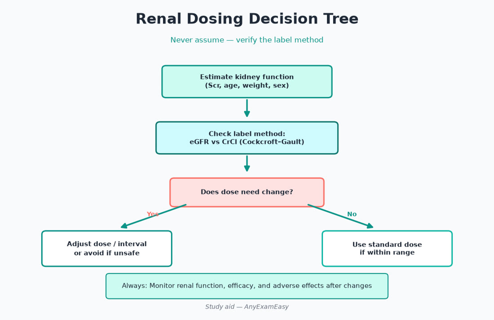
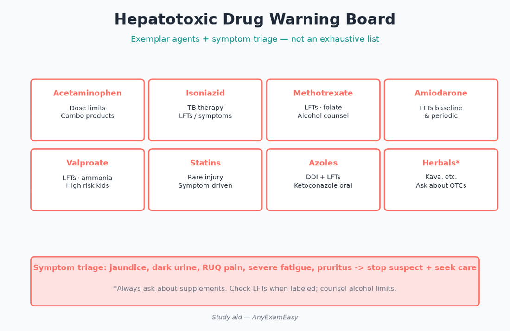
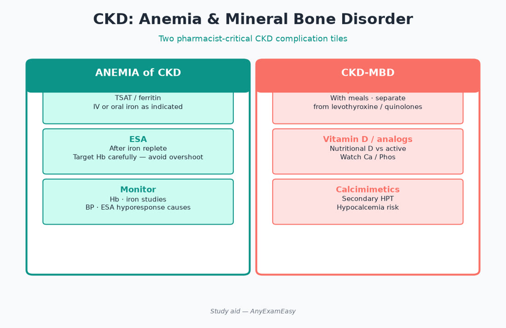

# Chapter 10 — Renal / Hepatic

> **Study aid only.** Dosing adjustments require current product labeling and clinical context — this chapter teaches judgment patterns, not automatic calculators for real patients.

---

## Why it matters on NAPLEX

Renal/hepatic items are classic **Domain 1 + 3** crossovers: estimate function, adjust or avoid, monitor, and counsel. Missed adjustments are high-severity errors. Frail elderly with “normal” SCr, cirrhosis + NSAIDs, and lactulose titrated to stools are high-yield judgment tests.

---

## Topic A — Assessing kidney function for dosing (decision tree)

### Key concepts

- CrCl (Cockcroft–Gault) still common for drug dosing tables; eGFR (CKD-EPI) for staging CKD — know which the label references.  
- Weight choice (TBW/IBW/AdjBW) matters in extremes — follow reference for the drug.  
- SCr lag in AKI — don’t assume “normal SCr” = normal function in frail elderly.  
- Dialysis: does the drug clear? Dose after HD when indicated.  
- Cystatin C / measured GFR rarely on NAPLEX — stick to stem data.

### Pharmacist renal dosing tree (applied)

1. Identify renally cleared / nephrotoxic drugs on profile.  
2. Compute/estimate function with correct patient factors.  
3. Decide: **full dose / reduce dose / extend interval / avoid / monitor levels**.  
4. Set monitoring (SCr, K⁺, drug levels, urine output inpatient).  
5. Reassess frequently in AKI — yesterday’s CrCl is stale.  
6. Document the estimate used.

### High-yield renally adjusted / caution classes

- Many antivirals, beta-lactams, FQs, vancomycin, AG, DOACs, gabapentinoids, H2RAs, metformin, SGLT2 continuation rules, bisphosphonates IV, colchicine, allopurinol starting doses, digoxin, lithium, many chemotherapeutics (specialty).

### Nephrotoxin awareness

- NSAIDs, iodinated contrast themes, AG, amphotericin, calcineurin inhibitors, high-dose vancomycin ± pip-tazo controversy themes — monitor.  
- Triple whammy: ACEI/ARB + diuretic + NSAID → AKI risk counseling.

> **Red flag:** Starting metformin or SGLT2 without checking eGFR trajectory in acute illness.

---

## Topic B — CKD complications (pharmacist lens)

### Anemia of CKD

- ESA therapy when indicated; iron repletion first often; Hb targets not normalized aggressively (thrombosis risk themes).  
- Monitor BP with ESAs.  
- IV vs oral iron: formulation reaction differences.

### Mineral bone disorder

- Phosphate binders (calcium vs non-calcium); take **with meals**.  
- Separate binders from interacting drugs (levothyroxine, FQs, etc.) per labeling.  
- Vitamin D analogs / calcimimetics themes; watch Ca/P/PTH.  
- Avoid aluminum binders chronically.

### Hyperkalemia

- Diet + binders (patiromer/SZC themes) + review ACEI/ARB/MRA/TMP-SMX/salt substitutes.  
- Emergency treatment is inpatient algorithm (calcium to stabilize membrane, insulin/glucose, etc.).  
- Don’t blindly hold GDMT forever without cardiology/nephrology plan in HFrEF.

### Acidosis / volume

- Bicarb therapy themes; loop diuretics for volume overload; careful in dialysis patients’ residual function.

### Remember this

- Binders with meals; separate from interacting drugs per labeling.  
- ESA ≠ ignore iron.

---

## Topic C — AKI vs CKD themes

| Feature | AKI | CKD |
| --- | --- | --- |
| Time | Hours–days | ≥3 months themes |
| SCr | Rising acutely | Stable elevated / low GFR |
| Drug move | Hold nephrotoxins; frequent adjust | Chronic dose tables; complication management |
| Sick-day | Hold metformin/SGLT2/ACEI per protocols | Sick-day rules still apply |

- Pre-renal vs intrinsic vs post-renal framing.  
- Hold nephrotoxins / metformin / SGLT2 per sick-day rules.  
- Dose-adjust antibiotics promptly.  
- Contrast: hydration strategies when used.  
- Recovery ≠ automatic return to full home doses without check.

---

## Topic D — Dialysis considerations (high-level)

- HD vs PD clearing differs.  
- Dose after HD if significantly removed.  
- Avoid drugs with toxic metabolites that accumulate.  
- Monitor residual renal function drugs carefully.  
- Heparin/citrate anticoagulation on circuit — institutional.  
- Transplant waitlist meds (specialty) — infection prophylaxis calendars.

---

## Topic E — Hepatic impairment & cirrhosis complications

### Key concepts

- Child-Pugh categories appear in some labels more than INR alone.  
- First-pass drugs may have ↑ bioavailability in cirrhosis.  
- Avoid unnecessary hepatotoxins; counsel alcohol abstinence.  
- Ascites: spironolactone ± furosemide ratios themes; avoid NSAIDs; careful large-volume paracentesis albumin themes.  
- Hepatic encephalopathy: lactulose (goal soft stools), rifaximin adjunct; avoid sedatives when possible.  
- Variceal bleed secondary prevention: nonselective beta blockers themes.  
- SBP prophylaxis/treatment antibiotic themes.  
- Acetaminophen: still usable carefully — counsel ceilings; combination products.  
- Coagulopathy ≠ automatic “never prophylax VTE” — nuanced inpatient decisions.

### Hepatotoxicity triage

| Pattern | Examples / moves |
| --- | --- |
| Predictable dose-related | APAP overdose pathways |
| Idiosyncratic | Isoniazid, Augmentin, AEDs — stop + evaluate |
| Steatosis/chronic | Methotrexate, amiodarone — monitor LFTs |
| Cholestatic | Some antibiotics — symptom counseling |

Counsel: stop and seek care for jaundice, dark urine, severe fatigue, RUQ pain. Statins often still beneficial in NAFLD — don’t reflex-stop without reason.

### Drug examples needing hepatic caution

- Anxiolytics with long half-lives, some opioids (prefer carefully chosen agents in severe liver disease), chemotherapeutic dosing specialty, azoles, valproate.

### Remember this

- Lactulose is titrated to stools, not a fixed vanity dose.  
- NSAIDs + cirrhosis = bad idea (bleed/AKI/ascites).  
- Always recheck renal AND hepatic before “standard” dosing.

---

## Topic F — Transplant pharmacotherapy themes

- CNIs (tacrolimus/cyclosporine): narrow TI, levels, nephrotoxicity, CYP3A/P-gp interactions (azoles, rifampin, grapefruit).  
- Mycophenolate: GI, cytopenias, teratogenicity counseling seriousness (REMS themes).  
- mTOR inhibitors: wound healing, lipids, proteinuria themes.  
- Steroids + infection prophylaxis calendars (PCP/CMV protocols).  
- Vaccinate before intensified immunosuppression when possible; avoid live vaccines when immunosuppressed.

### Remember this

- Tacrolimus + strong CYP3A inhibitor → toxicity risk.  
- Every new drug → interaction check against transplant backbone.

---

## Pharmacist ISCM vignettes

### Vignette 1 — Elderly “normal SCr”

**I:** New DOAC / antibiotic needing renal dose. **S:** Low muscle mass → hidden low CrCl; compute carefully. **C:** Bleed/toxicity signs. **M:** Repeat Cr; adherence; levels if applicable.

### Vignette 2 — Cirrhosis pain request

**I:** Ascites; asks for ibuprofen. **S:** NSAID → AKI/bleed/worsening ascites. **C:** Prefer cautious APAP within limits if appropriate; nonpharm. **M:** Weight, Cr, mental status (HE).

### Vignette 3 — Binder counseling

**I:** CKD hyperphosphatemia. **S:** Calcium load vs non-calcium binder choice; interactions. **C:** Take with meals; separate thyroid/FQs. **M:** Phos/Ca/PTH; constipation.

---

## Concept checks

**1.** Elderly patient, SCr 0.7, weight 45 kg — why might CrCl still be low?  
A. SCr falsely reassuring due to low muscle mass  B. SCr always overestimates age  C. Weight irrelevant  D. CrCl unused in pharmacy  
**Answer:** A.

**2.** Cirrhosis with ascites — analgesic to avoid routinely?  
A. Cautious APAP within limits  B. Chronic NSAIDs  C. Lidocaine patch  D. Nonpharmacologic heat  
**Answer:** B.

**3.** Lactulose for HE is titrated to?  
A. Fixed 30 mL forever without stool goal  B. Soft stool frequency goals  C. INR normalization only  D. TSH  
**Answer:** B.

**4.** Phosphate binders should generally be taken?  
A. With meals  B. Only at midnight empty stomach always  C. Weekly  D. IV push only  
**Answer:** A.

**5.** ACEI + diuretic + NSAID risk theme?  
A. Improved GFR always  B. AKI (“triple whammy”)  C. No interaction  D. Cures hyperkalemia  
**Answer:** B.

---

## Topic G — Applied renal dosing mini-cases

**Case 1:** Gabapentin for neuropathy; CrCl ~30. Reduce dose/extend interval per labeling; counsel sedation; avoid abrupt stacking with opioids without naloxone plan.

**Case 2:** Enoxaparin therapeutic; CrCl <30. Prefer dose adjustment or UFH themes per protocol; monitor anti-Xa when indicated; bleed counseling.

**Case 3:** Allopurinol start in CKD. Lower starting dose; HLA-B*5801 themes in at-risk ancestry for severe cutaneous reactions; counsel rash stop rules.

**Case 4:** Fluconazole in CKD. Extend interval for many doses; interaction with warfarin still matters.

**Case 5:** Rising SCr on ACEI after start. Small bumps can be acceptable; larger rises / hyperK → reassess volume, NSAIDs, bilateral RAS suspicion — don’t ignore.

---

## Topic H — Hepatic encephalopathy & ascites medication map

| Problem | Med themes | Counsel / monitor |
| --- | --- | --- |
| HE | Lactulose ± rifaximin | Soft stools goal; mental status |
| Ascites | Spironolactone ± furosemide | Weight, K/Na/Cr; no NSAIDs |
| SBP | Antibiotics ± albumin protocols | Fever, abdominal pain |
| Varices | Nonselective BB secondary prevention | HR/BP; hold if shock/bleed acute per team |
| Pruritus | Cholestyramine etc. specialty | Separate other drugs |

Alcohol cessation support (naltrexone/acamprosate themes when appropriate) is disease-modifying in alcohol-related liver disease — screen compassionately.

---

## Topic I — Drug-induced kidney injury patterns

- Hemodynamically mediated (NSAIDs, ACEI in volume depletion)  
- Acute tubular necrosis (AG, contrast, vancomycin high exposure themes)  
- AIN (some antibiotics/PPIs/NSAIDs) — rash/eosinophilia clues  
- Crystal nephropathy (acyclovir, methotrexate high-dose, sulfonamides) — hydration  
- Rhabdomyolysis-related (statin interaction extremes, toxins)

Pharmacist move: timeline the new drugs, stop offenders with the team, adjust remaining renally cleared meds the same day.

---

## Topic J — Cirrhosis analgesic & sedative judgment

Prefer nonpharmacologic and cautious APAP within daily limits. Avoid NSAIDs. Opioids: start low, longer intervals, watch encephalopathy. Benzodiazepines precipitate HE — use extreme caution. Antihistamines sedating similarly. Always ask about OTC pain powders with hidden APAP/NSAID.

### Transplant interaction lightning round

- Azole + tacrolimus → raise CNI levels  
- Rifampin + tacrolimus → crash levels → rejection risk  
- Macrolides vary; check  
- St. John’s wort → induction failure  
- Grapefruit → ↑ some CNIs  
- Antacids separate from mycophenolate/some products per labeling

### Remember this (chapter close)

- Calculate function with the right weight and equation for the label.  
- AKI demands frequent reassessment.  
- Cirrhosis: protect the kidney and the brain—no casual NSAIDs or sedatives.  
- Binders with meals; lactulose to stools; CNI interaction checks every time.

---

## Topic K — HD dosing rhythm & CRRT awareness

For intermittent HD, ask whether a supplemental dose is needed post-dialysis and whether the usual daily dose should be given on dialysis days after the session. CRRT continuously clears some drugs — specialty references required; exam may only ask you to recognize that CRRT ≠ standard HD dosing. Never assume “renal failure = cut all doses in half” — some drugs need little change, others are contraindicated.

### Contrast & sick-day card (teach patients)

Before imaging with contrast or during vomiting/diarrhea: hold metformin per protocol, hold SGLT2 per protocol, review ACEI/diuretic/NSAID temporary holds with clinicians, hydrate when appropriate, and restart only when renal function/oral intake stable. This single counseling habit prevents admissions.

### Hyponatremia / hypernatremia drug angles

SSRIs/carbamazepine/oxcarbazepine → SIADH themes. Thiazides → hypoNa. Lactulose overdoing → volume issues. Tolvaptan specialty for hyponatremia — REMS/hepatotoxicity awareness. Correct chronic hypoNa slowly to avoid ODS.

### Final renal/hepatic traps

Trusting SCr alone in elderly; giving NSAIDs in cirrhosis; forgetting post-HD dosing; not separating binders; stopping lactulose because “stools are annoying” without HE plan; starting full-dose allopurinol in advanced CKD; combining triple whammy without counseling.

---

## Topic L — Quick reference micro-table

| Situation | Do this |
| --- | --- |
| Frail elderly low SCr | Recalculate CrCl carefully |
| AKI rising | Hold nephrotoxins; readjust daily |
| Post-HD meds | Dose after if removed |
| Ascites pain | Avoid NSAIDs |
| HE | Lactulose to stool goals |
| New azole on tacrolimus | Check levels/interact |
| Binder start | With meals; separate thyroid/FQ |
| Triple whammy | Counsel AKI risk |

Always verify current product labeling for cutoffs—study aids give patterns, not automatic doses.

Pair every renal/hepatic adjustment with a monitoring plan and a patient explanation in plain language—why the dose changed, what symptoms to report, and when labs repeat. That counseling is Domain 2 and Domain 3 at once.

When labels disagree with older habit, follow the current label and guideline—exam stems reward that humility.

Reassess after every acute illness—renal and hepatic clearance are moving targets, not one-time math problems.

Document the CrCl or Child-Pugh basis you used whenever you recommend an adjustment.
 Ready.
