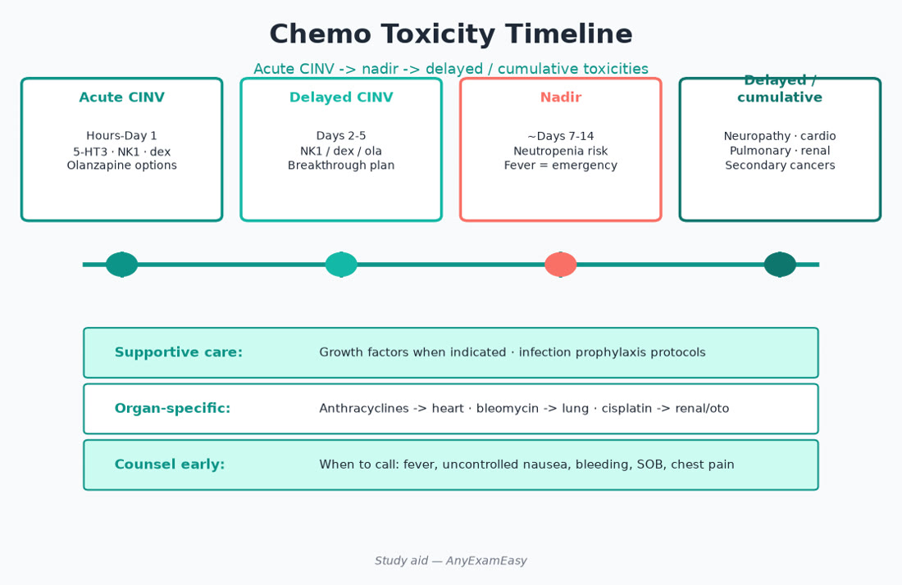
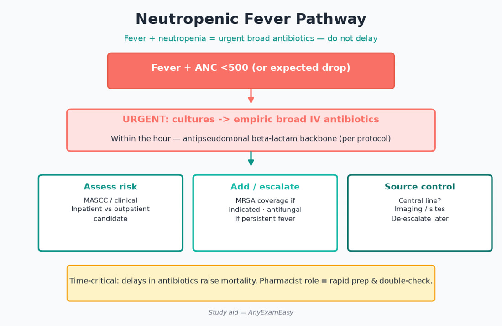
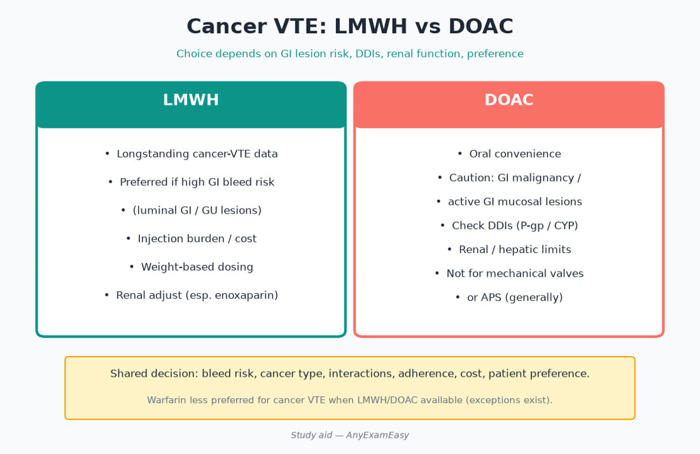

# Chapter 11 — Oncology / Hematology

> **Study aid only.** Oncology regimens are protocol-driven and specialized. Focus on supportive care, toxicity recognition, VTE, and anticoagulation in cancer — verify protocols and labeling.

---

## Why it matters on NAPLEX

You may not design FOLFOX on the exam, but you **must** catch supportive-care gaps, high-alert chemo safety, growth factors, antiemetic plans, TLS prophylaxis themes, and VTE management in malignancy. Neutropenic fever and intrathecal vinca errors are never-events pharmacists exist to prevent.

---

## Topic A — Chemo safety systems

### Key concepts

- Independent double-checks; BSA dosing; vinca alkaloids **IV only** (intrathecal vinca is fatal — never dispense for IT route).  
- Oral oncolytics: adherence, food effects, interactions (CYP/pH).  
- Hazardous drug handling (USP <800> awareness).  
- Extravasation: vesicant protocols — know to stop infusion and follow antidote pathways conceptually.  
- Standardized order sets; no verbal chemo except true emergencies with read-back.  
- Label route in tall distinctive warnings for IT vs IV drugs.

### Route control table

| Risk | Control |
| --- | --- |
| IT methotrexate/cytarabine | Distinct packaging/delivery | 
| IV vinca | Never syringe for possible IT; minibag practice themes |
| Oral chemo | Child-resistant; caregiver PPE if handling |

### Remember this

- Vinca ≠ intrathecal.  
- Oral chemo is still chemo — counseling intensity stays high.

---

## Topic B — Supportive care deep dive

### CINV (chemotherapy-induced nausea/vomiting)

Match prophylaxis to emetogenicity:

| Emetogenicity | Prophylaxis themes |
| --- | --- |
| High | 5-HT3 + NK1 + dexamethasone (± olanzapine) |
| Moderate | 5-HT3 + dexamethasone (± NK1) |
| Low | Single agent themes |
| Minimal | PRN often |

Anticipate acute vs delayed CINV (cisplatin delayed classic). Breakthrough → add agent from another class, don’t just duplicate same receptor blindly. Counsel constipation from 5-HT3 antagonists; insomnia/glucose from steroids; olanzapine sedation.

### Myelosuppression & neutropenic fever

- Nadir timing awareness (often 7–14 days themes — regimen-specific).  
- G-CSF for prevention/treatment per indications; bone pain counseling; rare splenic issues.  
- **Neutropenic fever = oncologic emergency** → rapid broad antibiotics inpatient — do not wait for “comfort cultures only.”  
- Infection prevention counseling: fever instructions, avoid delaying ED care.

### TLS (tumor lysis syndrome)

- High-burden tumors (aggressive lymphomas/leukemias themes): hydration, allopurinol/rasburicase themes, electrolyte monitoring (K⁺, Phos, Ca²⁺, uric acid).  
- Rasburicase: G6PD caution; don’t send uric acid on ice incorrectly (lab handling).  
- Cardiac monitoring for hyperK.

### Mucositis / neuropathy / cardiotoxicity / other organ toxicities

- Mouth care; ice chips themes for some infusions (fluorouracil/melphalan protocols).  
- Taxane/platinum/vinca neuropathy counseling; fall risk.  
- Anthracycline lifetime dose / HER2 therapy cardiac monitoring themes.  
- Bleomycin pulmonary; immunotherapy pneumonitis (different timeline).  
- Hemorrhagic cystitis (ifosfamide/cyclophosphamide) → mesna/hydration themes.

### Steroids & PCP prophylaxis

- Prolonged steroids ± lymphodepletion → consider PCP prophylaxis themes.  
- Steroid adverse effect counseling even for “just antiemetic” dexamethasone courses.

---

## Topic C — Toxicity timeline map (pharmacist lens)

| Timing | Examples |
| --- | --- |
| Immediate | Infusion reactions, nausea acute, extravasation |
| Days | Mucositis onset, neutropenia approaching |
| Weeks | Nadir infections, delayed CINV, neuropathy accumulating |
| Cumulative | Anthracycline cardiomyopathy, bleomycin lung, platinum hearing |
| Delayed (IO) | Checkpoint inhibitor irAEs weeks–months later |

---

## Topic D — Hematologic disorders

### Anemia / iron / B12 / folate

- Replace the right deficiency; IV iron formulations differ in infusion reactions.  
- ESA rules in CKD/cancer — thrombosis/tumor progression cautions in cancer.  
- Transfusion thresholds institutional.

### Sickle cell supportive themes

- Hydroxyurea counseling (myelosuppression, contraception, adherence).  
- Pain crisis supportive care; avoid over-nephrotoxins; vaccine importance.  
- Newer agents specialty — focus on adherence/toxicity if stemmed.

### Anticoagulation in cancer-associated thrombosis

- LMWH historically preferred; DOACs acceptable in many cases with caveats (GI/GU luminal tumors bleed risk themes) — follow current guidance.  
- Duration often while cancer active + treatment — confirm guidance.  
- Drug–drug interactions with oral oncolytics matter for DOACs.

### ITP / anticoagulation bridging

- Platelet thresholds for procedures conceptually; hold antiplatelets/anticoags per plans.  
- ITP therapies (steroids, IVIG, TPO agonists) specialty monitoring.

### Remember this

- Neutropenic fever → urgent abx, not “wait for culture comfort.”  
- Supportive care failures cause admissions.  
- Cancer VTE ≠ copy-paste AF dosing without thought.

---

## Topic E — Oral oncolytics & immunotherapy basics

### Oral oncolytics

- Adherence calendars; food rules; acid-reduction interactions (some TKIs); hold parameters for diarrhea/rash/LFTs/QT.  
- Specialty pharmacy workflows; financial toxicity empathy.  
- Missed dose rules product-specific — use labeling.  
- Partners/caregivers: safe handling of body fluids per protocol sometimes required.

### Checkpoint inhibitors

- Immune-related adverse events (colitis, pneumonitis, endocrinopathy, hepatitis, rash) may present late.  
- Significant irAEs often need high-dose steroids — counsel steroid toxicities/infection risk.  
- Don’t assume classic chemo nadir timing for immunotherapy toxicity.  
- Hold IO and escalate urgently for severe dyspnea/diarrhea.

### Remember this

- irAEs ≠ classic chemo nausea timeline.  
- Oral chemo counseling intensity equals IV chemo seriousness.

---

## Pharmacist ISCM vignettes

### Vignette 1 — Highly emetogenic chemo day −0

**I:** Cisplatin-based highly emetogenic regimen. **S:** Ensure NK1+5-HT3+dex (± olanzapine) ordered; QTc/interact. **C:** Take antiemetics as scheduled, not only PRN; constipation plan. **M:** Emesis diary; breakthrough needs; hydration.

### Vignette 2 — Fever day +10 after chemo

**I:** Possible neutropenic fever. **S:** Emergency evaluation — not OTC antipyretic alone at home without plan. **C:** Pre-taught fever threshold → ED. **M:** ANC, cultures, rapid abx inpatient.

### Vignette 3 — Cancer VTE

**I:** New PE with active cancer. **S:** Luminal GI tumor bleed risk if considering DOAC; interact with TKIs. **C:** Bleed signs; adherence. **M:** CBC, renal; oncology/heme follow-up duration plan.

---

## Concept checks

**1.** Vincristine prepared in a syringe labeled for possible IT use — action?  
A. Dispense as is  B. Stop — vinca alkaloids must never be given IT; fix system/labeling/route controls  C. Give half IT  D. Mix with methotrexate IT  
**Answer:** B.

**2.** Patient on highly emetogenic chemo without antiemetic plan — pharmacist priority?  
A. Ignore  B. Intervene to align prophylaxis with emetogenicity  C. Only give PRN APAP  D. Cancel chemo unilaterally without team  
**Answer:** B.

**3.** Neutropenic fever first pharmacologic priority theme?  
A. Wait 72 h for cultures before any abx  B. Prompt broad-spectrum IV antibiotics  C. Oral antihistamine only  D. Hold all G-CSF forever  
**Answer:** B.

**4.** Checkpoint inhibitor severe colitis often needs?  
A. More IO drug immediately  B. Urgent evaluation ± high-dose steroids per protocols  C. NSAID binge  D. Live vaccine  
**Answer:** B.

**5.** Mesna is associated with preventing which toxicity theme?  
A. Ototoxicity  B. Hemorrhagic cystitis from certain oxazaphosphorines  C. Alopecia completely  D. Hyperthyroid  
**Answer:** B.

---

## Topic F — Growth factors, transfusions, and infection prevention

G-CSF timing relative to chemo matters (usually not same-day for some regimens — protocol-specific). Pegfilgrastim On-body devices need application counseling. Erythropoiesis-stimulating agents in cancer require shared decision due to thrombosis/tumor concerns — often restricted to palliative settings per labeling themes. Antimicrobial prophylaxis in profound prolonged neutropenia (fluoroquinolone/antifungal/antiviral themes) is protocol-driven — pharmacists verify interactions and QTc.

Vaccinations: inactivated vaccines may be given between cycles when counts allow; avoid live vaccines in immunocompromised hosts. Household contacts vaccination protects the patient.

---

## Topic G — Extravasation & hypersensitivity

Stop infusion, aspirate residual, do not flush blindly, notify team, follow cold vs warm compress and antidote pathways by vesicant type (anthracycline dexrazoxane themes; vinca hyaluronidase themes — institutional). Document lot/site/volume. Hypersensitivity (taxanes, platinum re-exposure): premedication protocols; emergency meds at chairside.

---

## Topic H — VTE prevention in cancer

Hospitalized medical oncology patients often need prophylaxis unless contraindicated. Ambulatory high-risk patients may use risk scores (Khorana themes) for consideration of prophylaxis — confirm current guidance. Educate on clot signs (unilateral swelling, dyspnea). Avoid unnecessary central lines when possible.

### Oral TKI interaction lightning

Acid reducers ↓ absorption of some TKIs (dasatinib/erlotinib/pazopanib themes). Strong CYP3A inhibitors/inducers shift levels. QT-prolonging TKIs need electrolyte optimization. Hold parameters for grade 3+ toxicities per label.

### CAR-T / bispecific awareness (high-level)

CRS and neurotoxicity management specialty (tocilizumab themes); infection risk prolonged; vaccination timing complex — exam may only ask recognition of CRS fever after infusion as emergency pathway.

### Remember this (chapter close)

- Supportive care is not optional garnish—it is the regimen.  
- Fever + neutropenia → move fast.  
- Route controls prevent fatal IT vinca errors.  
- Cancer VTE needs cancer-specific anticoagulation thinking.

---

## Topic I — Antiemetic & bowel regimen pairing

5-HT3 antagonists cause constipation—proactively offer a bowel plan, especially when opioids co-exist for cancer pain. NK1 antagonists interact with CYP3A substrates (dexamethasone dose adjustments appear in some protocols). Olanzapine: metabolic/sedation counseling; caution in elderly. Cannabinoids specialty/adjuvant roles — know controlled-substance and CNS effects if stemmed.

### Cancer pain overview (pharmacist)

WHO ladder vibe still teaches stepwise multimodal care: APAP/NSAID if safe, adjuvants for neuropathic pain, opioids when needed with naloxone, constipation prophylaxis from day one, and avoid abrupt stops. Methadone for pain is specialist territory (QT, conversion complexity). Fentanyl patches only for opioid-tolerant patients—never for acute titration in naïve patients.

### Chemo brain / fatigue / fertility

Counsel realistic expectations; fertility preservation referrals before gonadotoxic therapy when relevant; contraception during and after per agent (teratogens). Fatigue workup includes anemia, thyroid, depression—not only “push through.”

### High-alert checklist before verifying chemo

Patient identity ×2, protocol name, cycle day, height/weight/BSA date, allergies, labs (ANC/platelets/Cr), antiemetics present, hydration/mesna if required, route controls, pump settings, hazardous handling PPE. If any element missing—pause.

### Final onc traps

Missing CINV prophylaxis; treating neutropenic fever at home with APAP alone; IT vinca possibility; DOAC in high-bleed GI cancer without thought; ignoring TKI–PPI interactions; restarting IO during active severe irAE without team; crushing oral chemo casually.

---

## Topic J — Blood product & anticoagulation peri-procedure themes

Know conceptual hold windows differ for DOACs vs warfarin vs LMWH vs aspirin/P2Y12—follow proceduralist protocols. Platelet thresholds for lumbar puncture/surgery are institutional. Vitamin K for warfarin reversal is not one-size; life-threatening bleed uses 4F-PCC themes plus vitamin K. For chemo thrombocytopenia, hold anticoagulants per counts and bleed risk—coordinate with oncology.

### Myeloid recovery counseling

Explain expected nadir timing before it happens so patients don’t panic on day 8 and do call on fever day 10. Provide written fever parameters. Review drug list for overlapping myelosuppressants (e.g., TMP-SMX dose, clozapine unlikely co-presence but psychotropics can appear).

### Final supportive-care scorecard

Antiemetics matched? G-CSF indicated? TLS prophylaxis if high risk? Infection teaching done? VTE plan appropriate? Oral oncolytic interactions checked? Hazardous handling explained? If any “no,” intervene before the chair or pickup ends.

Study aid reminder: oncology protocols change—verify antiemetic guidelines, growth-factor indications, and anticoagulation in cancer with current references before clinical application. On NAPLEX, pick the answer that prioritizes safety systems and urgent fever pathways over memorizing every regimen acronym.

Independent double-checks and fever action plans are the two oncology habits that most often separate safe systems from tragic near-misses—practice explaining both out loud before exam day.

When supportive care, route control, and fever pathways are solid, you have covered the NAPLEX oncology expectation without pretending to be a full oncology textbook.

Keep hazardous-drug PPE and spill procedures visible in the work area—safety culture is part of the exam’s medication-use mindset.
 Verify protocols.
 Stay humble.
 Patients first.
