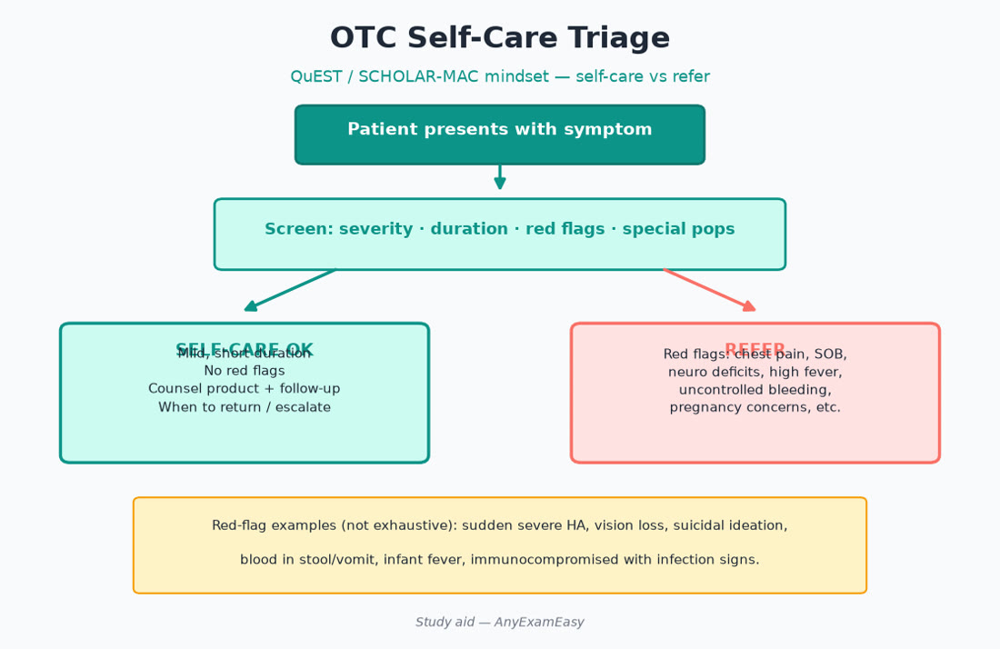
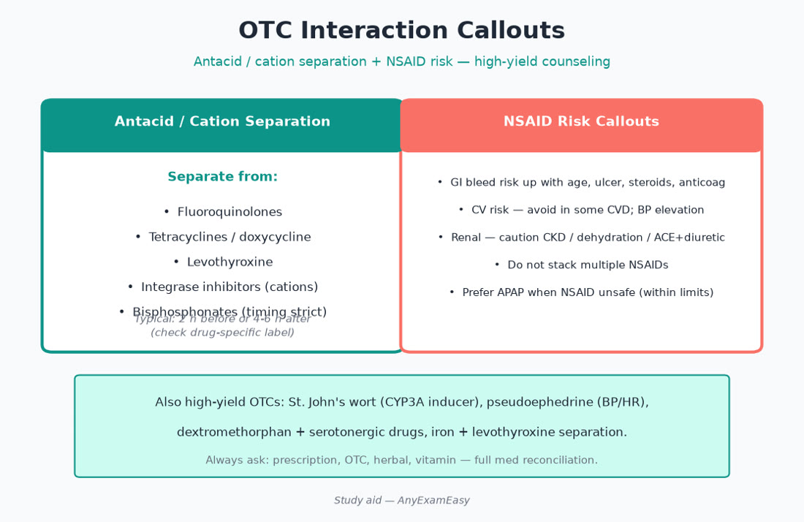

# Chapter 12 — OTC & Self-Care

> **Study aid only.** Self-care recommendations for exam scenarios — not a substitute for medical evaluation. Know referral red flags.

---

## Why it matters on NAPLEX

Community-facing pharmacists triage **self-care vs refer**, pick safe OTC options given comorbidities/meds, and counsel limits (APAP ceilings, decongestant BP effects, antacid interactions). Domain 2 and 3 meet at the counter: a wrong OTC can precipitate AKI, bleed, serotonin syndrome, or delayed meningitis care.

---

## Topic A — Triage mindset (algorithms)

### Refer urgently / promptly when stems show

- Chest pain, SOB, neuro deficits, severe abdominal pain, high fever with stiff neck, suicidal ideation  
- Pediatric dehydration red flags (no tears, dry diapers, lethargy)  
- Eye pain/vision loss, ear discharge with systemic illness  
- Worsening asthma symptoms / peak flow red zone  
- Suspected GI bleed (black stools, coffee-ground emesis)  
- Anaphylaxis signs  
- Severe headache unlike prior / thunderclap  
- Vaginal bleeding in pregnancy  

### Self-care OK when

- Mild, recognizable, short-duration symptoms without red flags  
- Patient can follow dosing and return if not improved in stated window  
- No conflicting diseases/drugs after quick profile check

### QuEST / SCHOLAR-MAC style (conceptual)

Gather symptoms, characteristics, history, onset, location, aggravating factors, remitting factors; medications, allergies, conditions — then recommend or refer.

---

## Topic B — High-yield OTC categories

### Pain / fever

- APAP: liver ceiling (counsel ≤3–4 g/day themes per labeling/patient factors); combination product vigilance.  
- NSAIDs: AKI, HF, GI bleed, CV risk, pregnancy (especially later trimesters), anticoag potentiation, lithium interaction.  
- Topicals for localized MSK when systemic NSAID risky (diclofenac gel, menthol/capsaicin — wash hands).  
- Avoid ASA in kids with viral illness (Reye).

### Cough / cold / allergy

- Oral decongestants: HTN, tachyarrhythmia, MAOI interaction, urinary retention, glaucoma caution.  
- Nasal oxymetazoline: max ~3 days — rhinitis medicamentosa.  
- Antihistamines: 1st-gen sedation/anticholinergic — caution elderly (Beers); 2nd-gen preferred for allergy.  
- Dextromethorphan: serotonergic stacks; abuse potential.  
- Guaifenesin: hydration helps.  
- Honey for cough in older children (not infants <1 year — botulism).  
- Age cutoffs on pediatric cough/cold OTCs — respect labeling.

### GI

- Antacids / H2RA / OTC PPI: duration limits; refer if alarm symptoms (weight loss, anemia, persistent vomiting, dysphagia).  
- Loperamide: not for bloody diarrhea/high fever; QT/abuse high-dose warnings.  
- Fiber / PEG / stimulant laxatives: match to situation; opioid constipation needs stimulant ± softener plan.  
- Bismuth: black stools/tongue; salicylate allergy caution; kids/teens viral illness caution.  
- ORS for gastroenteritis dehydration prevention.  
- Simethicone; alpha-galactosidase for gas — limited harm, limited miracle.

### Derm

- Hydrocortisone 1% limits; fungal creams for tinea; refer for suspected cellulitis (spreading redness, fever).  
- Sunscreen counseling SPF/reapply; mineral vs chemical preferences.  
- Acne OTCs: benzoyl peroxide bleach warning; retinoid photosensitivity; refer cystic/nodular.  
- Impetigo / eye involvement → refer.

### Women’s / GU

- Vaginal azoles for uncomplicated candidiasis if classic symptoms; refer if first episode uncertain, recurrent, pregnant, systemic signs.  
- Emergency contraception timing themes (sooner better).  
- UTI: refer — OTC urinary analgesics don’t cure infection; counsel that phenazopyridine colors urine.  
- Dysmenorrhea: NSAID timing if safe; refer severe/new patterns.

### Ophthalmic / otic

- Artificial tears; refer for pain/photophobia/contact-lens red eye.  
- Softening drops for cerumen — not with perforation/tubes.  
- Never put otic drops in eyes.

---

## Topic C — Interactions & special populations

| OTC | Interaction / population trap |
| --- | --- |
| Antacids/cations | Thyroid, FQs, tetracyclines, INSTIs — separate |
| NSAIDs | Lithium, anticoag, ACEI/diuretic, CKD, HF, pregnancy late |
| Pseudoephedrine | HTN, MAOI, BPH |
| DXM | SSRIs/MAOIs — serotonin |
| St. John’s wort | Inducer — transplant/HIV/OCP/warfarin |
| APAP multi-sources | Hepatic ceiling |
| 1st-gen AH | Elderly Beers; driving |
| PPIs long OTC use | Mask serious disease; Mg/B12/infection themes long-term |

- Warfarin: consistent vitamin K; many herbals (ginkgo, garlic high-dose, St. John’s wort) problematic.  
- Pregnancy/lactation: verify each ingredient.  
- Pediatrics: weight-based liquids; never household spoons; no ASA (Reye).

### Remember this

- APAP hiding in everything — count total daily mg.  
- Pseudoephedrine ≠ free pass in uncontrolled HTN.  
- Red flags → refer, don’t sell and shrug.

---

## Topic D — Home diagnostics & preventive OTCs

- Pregnancy/ovulation kits timing; glucose/BP monitor technique; home COVID/flu tests false-negative awareness.  
- Folic acid for people who can become pregnant; naloxone OTC access + overdose teaching; EC sooner-is-better.  
- Nicotine replacement OTC counseling (see respiratory chapter).  
- COVID tests + isolation counseling per current public health guidance themes.

---

## Topic E — Herbals that bite

- St. John’s wort inducer (transplant/HIV/OCP/warfarin failures).  
- High-dose vitamin E/ginkgo/garlic bleeding risk with anticoag/antiplatelets.  
- Red yeast rice statin-like myopathy risk; “detox” teas harm in elderly.  
- Kava/comfrey hepatotoxicity themes.  
- Natural ≠ safe — document herbals on the profile.

### Remember this

- Natural ≠ safe with anticoagulants or transplants.  
- Naloxone teaching is core public-health pharmacy.

---

## Pharmacist ISCM vignettes

### Vignette 1 — Lithium patient wants ibuprofen

**I:** Backache self-care. **S:** NSAID ↑ lithium. **C:** Prefer APAP if appropriate; heat/rest; contact prescriber if NSAID required. **M:** If NSAID used, watch tremor/GI; lithium level.

### Vignette 2 — Cold + uncontrolled HTN

**I:** Congestion. **S:** Avoid oral decongestants; caution 1st-gen AH. **C:** Saline spray; humidifier; oxymetazoline ≤3 days if used. **M:** BP home log; return if fever/sinus warning signs.

### Vignette 3 — Toddler fever

**I:** Viral illness fever. **S:** Weight-based APAP/ibuprofen; no ASA; concentration check. **C:** Oral syringe; alternate dosing only with clear instructions if clinician advised. **M:** Hydration; refer if lethargy/stiff neck/rash.

---

## Concept checks

**1.** Patient on lithium wants ibuprofen for backache. Concern?  
A. None  B. NSAIDs can increase lithium levels / toxicity risk — prefer alternatives / contact prescriber  C. Lithium blocks NSAID absorption completely  D. Must use high-dose naproxen  
**Answer:** B.

**2.** Toddler with cold; caregiver asks for aspirin. Response?  
A. Fine if low dose  B. Avoid ASA in children with viral illness — Reye risk; suggest age-appropriate APAP/ibuprofen if indicated  C. Give adult enteric-coated  D. Combine ASA + pepto freely  
**Answer:** B.

**3.** Max counseling theme for oxymetazoline?  
A. Unlimited  B. ~3 days to avoid rebound congestion  C. Only in infants  D. IV  
**Answer:** B.

**4.** Best action for suspected UTI?  
A. Phenazopyridine alone as cure  B. Refer for evaluation/antibiotics; analgesic only adjunct if used  C. High-dose DXM  D. St. John’s wort  
**Answer:** B.

**5.** St. John’s wort major concern?  
A. CYP induction → loss of efficacy of substrates  B. Always safe with tacrolimus  C. Cures HIV  D. No interactions  
**Answer:** A.

---

## Topic F — Common self-care algorithms (exam-ready)

### Heartburn algorithm

1. Alarm symptoms → refer.  
2. Infrequent mild → antacid/H2RA.  
3. Frequent (≥2 weeks) → OTC PPI short course + lifestyle; if unresolved → refer.  
4. Check for interacting drugs (azoles needing acid, etc.).  
5. Counsel not to use OTC PPI indefinitely without evaluation.

### Constipation algorithm

1. Red flags (blood, weight loss, sudden change, severe pain) → refer.  
2. Fiber + fluid + activity.  
3. PEG osmotic often preferred for chronic idiopathic themes.  
4. Stimulant for opioid-induced (with softener).  
5. Avoid habitual harsh stimulant dependence without plan.

### Diarrhea algorithm

1. Blood/fever/severe dehydration/pregnancy/infant → refer.  
2. ORS.  
3. Loperamide if appropriate non-infectious mild cases.  
4. Bismuth alternative considerations.  
5. Medication causes (metformin, antibiotics, Mg) — review.

### Allergic rhinitis algorithm

1. Avoid triggers.  
2. Intranasal steroid first-line persistent.  
3. Add 2nd-gen antihistamine.  
4. Avoid long-term oxymetazoline.  
5. Refer asthma overlap / refractory.

### Pediatric fever/pain algorithm

1. Age <3 months fever → urgent refer themes.  
2. Weight-based APAP or ibuprofen (age-appropriate).  
3. Correct concentration (infants’ vs children’s).  
4. Oral syringe.  
5. Hydration; refer lethargy/stiff neck/petechiae.

---

## Topic G — Behind-the-counter & regulated OTCs

Pseudoephedrine purchase limits/log themes (law detail → MPJE); still counsel HTN. Naloxone OTC: demonstrate device, call emergency services, recovery position, second dose. Emergency contraception: timing, BMI nuances for some products, offer antiemetic if needed, counsel not an abortifacient in typical use framing per labeling education, refer for regular contraception. Some states pharmacist prescribing protocols — NAPLEX stays clinical; MPJE covers authority.

### Ophthalmic red-flag list

Pain, vision change, contact lens with red eye, chemical splash, light sensitivity, trauma → urgent care/eye doctor — not “get the redness out” vasoconstrictor chronically.

### Remember this (chapter close)

- Triage first, product second.  
- Interaction check OTCs like Rx.  
- Teach limits and return precautions every time.  
- Naloxone and EC are public-health wins at the counter.

---

## Topic H — Travel, wounds, and miscellaneous OTCs

- Loperamide/bismuth for traveler’s diarrhea prevention vs treatment nuances; azithromycin/rifaximin Rx roles when stemmed; ORS always.  
- Insect repellents (DEET/picaridin) counseling; sunscreen with repellent layering.  
- Wound care: clean, antibiotic ointment for minor cuts; refer puncture/animal bites/deep wounds.  
- Melatonin: modest effect; interaction/sedation stacks; prefer sleep hygiene.  
- Motion sickness: meclizine/dimenhydrinate sedation; scopolamine Rx patch counseling.  
- Smoking cessation OTCs: combination NRT effectiveness (see Chapter 8).

### Caregiver communication

Use teach-back; provide written max doses; highlight combination APAP products by circling ingredients; offer to review the full OTC shelf list against the Rx profile. Document recommendations and referrals.

### Final OTC traps

Treating meningitis-like symptoms with APAP; NSAIDs in CKD/HF/pregnancy late; oral decongestants in uncontrolled HTN; DXM with MAOI/SSRI stacks; endless PPI without referral; household spoons for kids; herbal inducers with transplants; missing naloxone offers when opioid risk present.

---

## Topic I — Medication list hygiene at self-care

Ask every time: “What else are you taking—including vitamins and powders?” Combine that with a quick allergy and condition check. Offer to update the pharmacy profile. If the patient refuses interaction review, document and still give critical warnings for high-risk requests (NSAID + anticoagulant, DXM + MAOI history).

Return precautions belong on every bag: “If X happens within Y days, seek care.” Without that sentence, self-care becomes unsafe care.

### APAP ceiling counseling script

“Many cold and pain products already contain acetaminophen. Add the milligrams from every bottle so you stay within the daily limit on the Drug Facts label—and lower if you have liver disease or drink heavily. When unsure, bring the bottles in and we’ll add them together.”

Soft skill that scores: listen for the real question under the symptom (“I’m worried this is cancer” / “I can’t afford a doctor”). Triage medically first, then help navigate access without inventing diagnoses.

Before recommending any OTC, reopen the profile: anticoagulants, lithium, MTX, MAOIs, CKD, HF, pregnancy, and elderly anticholinergic load change the answer more often than brand preference does.

When unsure, refer early—self-care is for low-risk problems with clear follow-up plans only.
 Safety beats a sale every time at the counter.
 Refer early when unsure.
