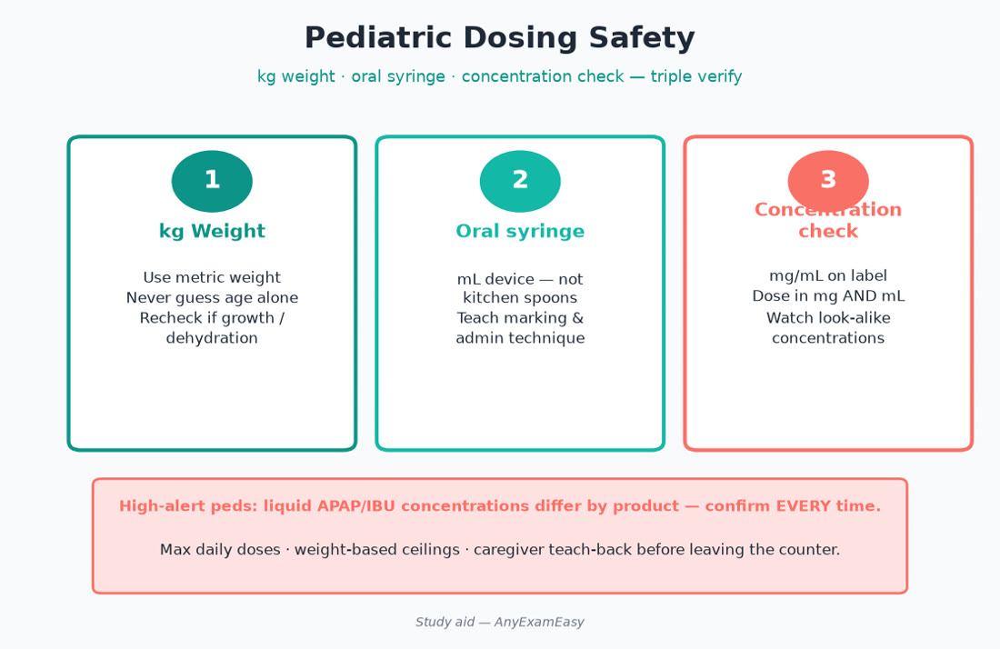
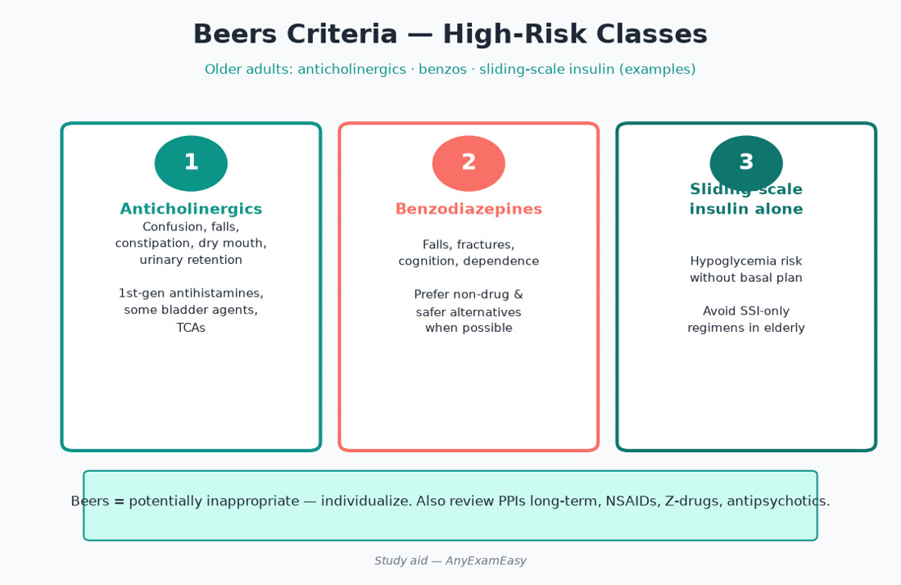
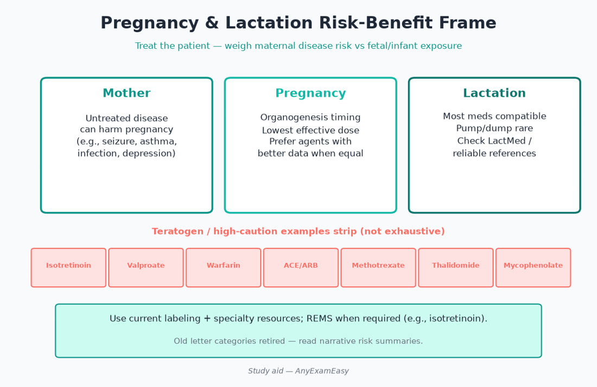

# Chapter 13 — Special Populations

> **Study aid only.** Pediatrics, geriatrics, and pregnancy/lactation require specialized references (e.g., labeling, LactMed-style resources, Beers). Verify before clinical use.

---

## Why it matters on NAPLEX

Special-population stems punish “adult default” dosing. You must adjust for **physiology**, avoid known teratogens/Beers culprits, and counsel caregivers clearly. A correct adult dose can be a 10× pediatric overdose—or a geriatric fall waiting to happen.

---

## Topic A — Pediatrics (dosing safety)

### Key concepts

- Weight-based dosing; use kg; confirm concentration of liquid.  
- Oral syringes > household spoons.  
- Immature renal/hepatic clearance in neonates — longer intervals often.  
- Avoid: tetracyclines in young children (teeth), FQs generally reserved, ASA in viral illness, OTC cough/cold in very young per labeling age cuts.  
- Vaccine schedules: catch-up conceptual; live vaccines and immunocompromise.  
- Palatability and school dosing logistics.  
- BSA dosing for some chemo/specialty.  
- Off-label frequency in peds — still verify references.

### Pediatric dosing safety checklist

1. Weight in kg today (not last year’s).  
2. mg/kg × weight = dose; check max adult/day caps.  
3. Concentration on the bottle (mg/mL) — look twice.  
4. mL volume measurable on syringe.  
5. Caregiver teach-back.  
6. Storage/shake/ BUD after reconstitution.

### Safety / red flags

> **Red flag:** 10× overdoses from mL/mg confusion; iron overdose deadly; codeine/tramadol restricted in kids (CYP2D6 UM risk).

### Remember this

- Always recalculate with weight and product concentration.  
- Caregiver teach-back for liquids.

---

## Topic B — Geriatrics / Beers themes

### Key concepts

- Beers Criteria: high-risk meds (strong anticholinergics, benzos/Z-drugs, sliding-scale insulin alone, chronic PPIs without indication, first-gen antihistamines, skeletal muscle relaxants, etc.).  
- Start low, go slow — but don’t under-treat pain or depression reflexively.  
- Fall risk: sedatives, antihypertensives, hypoglycemia.  
- Polypharmacy & prescribing cascades (drug → SE → new drug).  
- Renal dosing even when SCr “normal.”  
- Deprescribing conversations; time-to-benefit for preventive drugs in limited life expectancy.  
- Anticholinergic cognitive burden cumulative.

### High-risk Beers class table (themes)

| Class | Why risky in many older adults |
| --- | --- |
| Strong anticholinergics | Confusion, retention, constipation, falls |
| Benzodiazepines / Z-drugs | Falls, delirium, fractures |
| First-gen antihistamines | Anticholinergic + sedation |
| Sliding-scale insulin alone | Hypoglycemia without basal plan |
| Chronic PPI (no indication) | Infection, fracture, Mg themes |
| NSAIDs | GI bleed, AKI, HF |
| Muscle relaxants | Sedation |

### Assessment cues

- Cognitive impairment affecting adherence — simplify regimens, blister packs.  
- Orthostasis after new BP meds.  
- Anticholinergic burden → confusion, retention, constipation.  
- Weight loss / swallowing → formulation change.

### Remember this

- Anticholinergic load is cumulative.  
- Every new symptom may be an adverse effect.

---

## Topic C — Pregnancy & lactation judgment frame

### Key concepts

- Risk–benefit always; untreated disease also harms (e.g., uncontrolled epilepsy, depression, diabetes, hypertension).  
- Known teratogen themes: ACEI/ARB, warfarin (nuance with mechanical valves specialty care), valproate, isotretinoin (iPLEDGE), methotrexate, mycophenolate, live vaccines, tetracyclines, thalidomide class, high-dose vitamin A themes.  
- Preferred safer themes exist for many conditions (e.g., labetalol/nifedipine/methyldopa historically for HTN; insulin for diabetes; certain SSRIs preferred over others) — verify current Ob guidance.  
- Lactation: preferential agents with published data; counsel timing around feeds when relevant; pump-and-dump rarely needed blanket advice — be drug-specific (LactMed-style).  
- Prenatal vitamins / folic acid for neural tube prevention (higher dose themes with some ASMs).  
- NVP (nausea): lifestyle; doxylamine/pyridoxine themes; refer hyperemesis.

### Counseling tone

- Nonjudgmental; encourage prenatal care.  
- Avoid herbal “natural = safe” myths.  
- Confirm pregnancy status before teratogens; REMS when required.

### Trimester hooks (examples)

| Issue | Themes |
| --- | --- |
| 1st trimester | Organogenesis — teratogen avoidance critical |
| Later pregnancy | NSAID fetal kidney / ductus concerns; ACEI/ARB fetal renal damage |
| Postpartum | Lactation drug selection; VTE risk continues |

### Remember this

- Isotretinoin REMS exists for a reason.  
- Confirm pregnancy status before teratogens.  
- Lactation questions need drug-specific answers.

---

## Topic D — Other populations (brief)

- Bariatric surgery: absorption changes; avoid certain formulations; dump dumping syndromes; contraception efficacy changes.  
- Obesity: weight-based dosing caps (e.g., some antibiotics use AdjBW); DOAC labeling may exclude extremes — verify.  
- Gender-affirming hormones: interaction/monitoring awareness if stemmed.  
- Critical illness: PK shifts — specialty.  
- Disability / health literacy: accessible labeling, devices, caregiver training.

---

## Topic E — Critical illness & obesity dosing nuances

- Augmented renal clearance in some ICU patients → underdosing risk.  
- Hypoalbuminemia alters free fractions of highly bound drugs.  
- ECMO/CRRT: specialty dosing — consult references.  
- Obesity: drug-specific AdjBW vs IBW vs caps.

### Reminder

Stem gives extreme weight + kidney estimate options — pick the method matching the drug’s reference, not a one-size habit.

---

## Pharmacist ISCM vignettes

### Vignette 1 — Otitis media liquid

**I:** Pediatric AOM antibiotic. **S:** mg/kg, max dose, allergy, concentration. **C:** Oral syringe teach-back; finish course; fridge if needed. **M:** Fever trajectory; rash/diarrhea.

### Vignette 2 — Beers anticholinergic

**I:** Elderly insomnia; request diphenhydramine nightly. **S:** Beers — delirium/falls. **C:** Sleep hygiene; discuss safer plans with prescriber. **M:** Morning confusion/falls.

### Vignette 3 — ACEI in pregnancy discovered

**I:** HTN on lisinopril; positive pregnancy test. **S:** Stop ACEI; urgent obstetric-safe alternative plan. **C:** Nonjudgmental; prenatal care. **M:** BP control; fetal monitoring per Ob.

---

## Concept checks

**1.** Best device for accurate pediatric liquid dosing?  
A. Kitchen teaspoon  B. Oral syringe marked in mL  C. Eyeballing the cup  D. Adult tablespoon  
**Answer:** B.

**2.** ACEI in 2nd trimester — primary concern theme?  
A. Fetal renal toxicity / oligohydramnios spectrum  B. Improves fetal growth always  C. No placental transfer  D. Required for all gestational HTN  
**Answer:** A.

**3.** Beers concern example?  
A. Chronic lorazepam for sleep in frail elderly  B. Applesauce  C. Spacer use  D. Influenza vaccine  
**Answer:** A.

**4.** Codeine for post-op pain in young children?  
A. Preferred always  B. Restricted/avoid themes due to UM respiratory depression risk  C. No CYP involvement  D. OTC freely  
**Answer:** B.

**5.** Lactation question best approach?  
A. Always pump-and-dump all drugs  B. Drug-specific reference + risk/benefit  C. Guess based on taste  D. Stop breastfeeding for any Rx forever  
**Answer:** B.

---

## Topic F — Pediatric vaccines & fever after shots

Counsel expected fussiness/low fever after vaccines; APAP/ibuprofen for comfort per caregiver preference and clinician advice—not as pretreatment to “prevent” immune response routinely. Red flags: high fever with lethargy, seizures, allergic reaction → emergency care. Keep VIS and immunization registry documentation habits (Domain 2 crossover).

### Neonatal / infant special traps

- Avoid honey <1 year.  
- Avoid OTC cough/cold in very young per labels.  
- Ceftriaxone + calcium IV incompatibility in neonates.  
- Gasping syndrome themes with large benzyl alcohol exposures historically — compounding awareness.  
- RSV immunoprophylaxis/vaccine landscape evolving — verify current ACIP/AAP themes when studying.

---

## Topic G — Geriatric deprescribing framework

1. What is the indication still valid?  
2. Does time-to-benefit exceed life expectancy?  
3. Is this treating a side effect of another drug?  
4. Renal/hepatic dose appropriate?  
5. Can we simplify to once-daily / combo packs?  
6. Agree on a monitored taper (PPIs, benzos, anticholinergics, ASMs specialty).  

Never yank seizure/Parkinson/steroid/beta-blocker therapies without a plan.

### Falls prevention med review

Sedatives, anticholinergics, hypoglycemics, antihypertensives causing orthostasis, opioids — prioritize. Recommend vision/hearing checks, footwear, night lights as nonpharm alongside med changes.

---

## Topic H — Pregnancy disease treatment principles

| Condition | Judgment vibe |
| --- | --- |
| HTN | Avoid ACEI/ARB; use pregnancy-preferred agents |
| Diabetes | Insulin classic foundation; tight enough for fetus without severe hypo |
| UTI/ASB | Treat; agent safety matters |
| Depression | Don’t leave severe disease untreated; agent selection careful |
| Epilepsy | Optimize ASM; folate; avoid valproate when feasible |
| VTE | LMWH themes often preferred over warfarin/DOAC |
| Hyperthyroid | PTU/MMI trimester nuances — verify current |

Lactation: choose drugs with published infant safety data; observe infant for sedation/GI; time feeds if peak matters; coordinate with pediatrician for premature/fragile infants.

---

## Topic I — Pharmacist ISCM extras

**Peds seizure rescue:** Counsel nasal/rectal rescue benzo plans; when to call EMS; school forms.  
**Geriatric anticoagulation:** Fall risk ≠ automatic no anticoag in AF — shared decision; choose wisely; deprescribe interacting NSAIDs.  
**Pregnancy nausea:** Rule out other causes; escalate hyperemesis; B6 ± doxylamine themes.

### Remember this (chapter close)

- kg × concentration × teach-back for kids.  
- Beers + falls + anticholinergic burden for elders.  
- Teratogen avoidance + treat the mother for pregnancy.  
- Lactation answers are drug-specific, not vibes.

---

## Topic J — Adolescent & young adult nuances

Transitioning pediatric patients to adult dosing still needs weight/BMI reality checks. Confidential contraception counseling ethics themes (Domain 4 crossover). Stimulant diversion risk in colleges. Isotretinoin iPLEDGE pregnancy prevention monthly. Meningococcal/HPV vaccine catch-up opportunities at the pharmacy counter.

### Disability & communication access

Offer large-print labels, spoken labeling tools, interpreter services, and caregiver inclusion with patient permission. Never rely on children as sole interpreters for complex consent when avoidable.

### Obesity pharmacotherapy high-level

GLP-1/dual agonists for weight: titration against GI effects; gallbladder/pancreatitis caution themes; compounding unsafe look-alikes — stick to approved products. Orlistat GI counseling; bupropion/naltrexone themes; phentermine short-term cautions. Surgery patients need vitamin protocols lifelong.

### Final special-pop traps

Adult tablet for neonate; Beers diphenhydramine for sleep; ACEI continued after positive pregnancy test; household spoon dosing; codeine for kids; NSAIDs late pregnancy; ignoring lactation references; stopping ASM abruptly in pregnancy out of fear.

---

## Topic K — Concept check expansion answers explained

Oral syringes prevent household-spoon errors that cause 2–3× dosing swings. ACEI/ARB fetal toxicity is a hard counseling point—switch promptly with Ob. Beers is a risk list, not an absolute ban, but diphenhydramine nightly in frail elders is rarely the best first idea. Codeine’s unpredictable morphine formation in UM children drove restrictions. Lactation counseling without a reference is guessing—guessing is not pharmacist judgment.

### Monitoring calendars by population

- Peds growth + refill adherence for chronic ASMs/stimulants  
- Geriatrics orthostatics after HTN changes; A1C not too tight if hypo risk  
- Pregnancy BP logs; glucose logs in GDM; ASM levels sometimes  
- Lactation infant weight/sedation checks when relevant  

### Remember this again

Special populations are where “usual dose” becomes unsafe. Slow down, calculate, reference, and teach back.

---

## Topic L — Bridging pediatrics to adult care

When adolescents with asthma, diabetes, epilepsy, or transplant move to college, pharmacists help with refill logistics, medical ID, emergency plans, and alcohol interaction counseling. Encourage shared calendars for ASMs and insulin. For geriatric spouses caregiving for each other, simplify regimens and watch caregiver burnout affecting adherence.

Pregnancy intention screening before teratogens (isotretinoin, MTX, mycophenolate, valproate, ACEI) is a professional obligation—document and follow REMS when applicable. Offer contraception access compassionately.

Always verify pediatric max doses, Beers updates, pregnancy/lactation references, and REMS elements with current official sources before applying any study-aid pattern to real patients.

Teach-back with caregivers and patients closes the loop—ask them to show you the mL mark or explain the teratogen stop plan in their own words before they leave.
 kg, Beers, teratogens, LactMed-style references—master those four reflexes.
 Verify labels and guidelines every time.
 Done.
