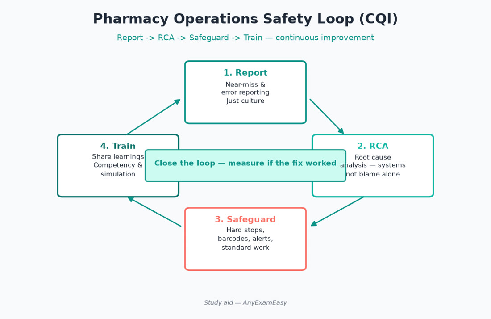
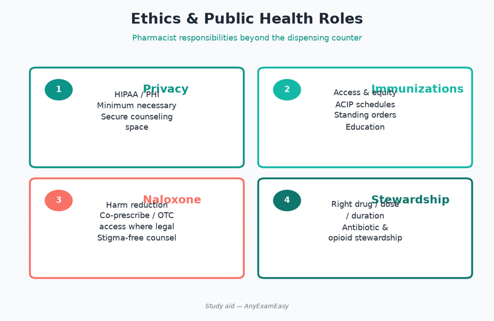

# Chapter 14 — Professional Practice & Operations

> **Study aid only.** Domains 4–5 (~5% each). Ethics and operations themes for NAPLEX — **not** a substitute for MPJE/state law study.

---

## Why it matters on NAPLEX

Small weight, easy points if you practice: ethics, public health, continuous quality improvement, inventory/shortage management, leadership communication, and technician oversight themes. Do **not** confuse this with MPJE jurisprudence detail. Five percent is still points—don’t skip entirely, and don’t balloon study time here at the expense of Domain 3.

---

## Topic A — Professional practice & ethics (Domain 4)

### Key concepts

- Patient autonomy, beneficence, nonmaleficence, justice.  
- Confidentiality / HIPAA-style privacy habits (no hallway PHI, no selfie with labels).  
- Conscience clauses vs duty to transfer/refer without obstructing care — know professional expectations themes.  
- Impaired colleague reporting pathways conceptually.  
- Public health: immunization advocacy, naloxone access, stewardship, disaster response roles.  
- Health disparities & cultural humility in counseling.  
- Documentation honesty; never falsify controlled-substance records (also law — MPJE).  
- Corresponding responsibility for controlled substances — clinical + legal vigilance.  
- Informed refusal: explain risks when patient declines; document.

### Assessment cues on stems

- Pressure to verify a questionable controlled Rx — safety first, corresponding responsibility themes.  
- Language barrier — use qualified interpreters, not minors when avoidable.  
- Social media PHI breach scenarios.  
- Refusal to fill: still help patient find lawful path to care.

### Public health pharmacist roles

| Role | Examples |
| --- | --- |
| Prevention | Vaccines, smoking cessation, PrEP access themes |
| Harm reduction | Naloxone, sterile syringe programs where allowed |
| Stewardship | Avoid unnecessary antibiotics |
| Emergency | Cold chain in disasters; triage clinics |
| Equity | Affordable alternatives, assistance programs |

### Remember this

- Refuse unsafe therapy; still help the patient find a path.  
- Privacy is daily practice, not a poster.

---

## Topic B — Pharmacy management & leadership (Domain 5)

### Key concepts

- Workflow design to reduce interruptions during verification.  
- Technician delegation within scope; RPh final check accountability.  
- Inventory: FIFO, cold-chain, controlled-substance perpetual inventory concepts, shortage triage (therapeutic alternatives).  
- Continuous quality improvement / root-cause after errors — just culture.  
- Metrics: safety > speed alone; monitor wait times without crushing verification quality.  
- Staffing, training, and feedback.  
- Billing/insurance basics that affect adherence (PA delays) — help patients navigate.  
- Technology downtime downtime procedures.

### Leadership behaviors

- Model sterile technique / hand hygiene.  
- Escalate system hazards (look-alike storage).  
- Mentor students/techs with teach-back.  
- Psychological safety so staff report near misses.  
- Huddles after formulary/device switches.

### Safety / red flags

> **Red flag:** Production pressure overriding clinical checks. Unplugged fridge / temperature excursion ignored. Sharing passwords / undocumented overrides.

### Shortage management playbook

1. Confirm true shortage vs local stockout.  
2. Therapeutic alternative with evidence + protocol.  
3. Prescriber communication.  
4. Patient counseling on device/technique/dose changes.  
5. Fair allocation for limited life-saving stock.  
6. Document.

### Remember this

- Shortages: prioritize clinical need + communication.  
- Errors → system fix + patient honesty.  
- Domain 5 is judgment about **safe operations**, not MBA trivia.

---

## Topic C — Quality metrics & medication access

- Adherence metrics (PDC): sync fills, 90-day, reminders when clinically appropriate.  
- Prior authorizations: document necessity; ethical bridging per policy/law.  
- Patient assistance / specialty onboarding reduces abandonment.  
- Health literacy: teach-back, plain language, pictograms.  
- Escalate unsafe production pressure; huddle on look-alike stock changes.  
- Patient satisfaction surveys ≠ excuse to skip counseling.

### CQI loop

Detect → report → analyze (fishbone/5 whys themes) → intervene (barcode, tall-man, separate storage, staffing) → remeasure → share learning. Just culture distinguishes human error, at-risk behavior, and reckless conduct.

### Remember this

- Access barriers are clinical problems.  
- Teach-back beats “any questions?” silence.

---

## Topic D — Technician oversight & delegation

Pharmacists verify: final product check, clinical appropriateness, counseling. Technicians may prepare, enter, and manage inventory within training/law (MPJE). Never delegate clinical judgment or final verification. Train on LASA, compounding hygiene, and when to escalate (“this dose looks high”).

---

## Topic E — Cold chain & controlled inventory (ops)

Vaccines/insulin/biologics: monitor temperature logs; excursions follow manufacturer/SOP—don’t guess “probably fine.” Controlled substances: perpetual inventory concepts, diversion surveillance (waste witnessing themes), robbery protocols at high level. NAPLEX tests safety mindset; MPJE tests statutory detail.

---

## Pharmacist ISCM vignettes (ops-flavored)

### Vignette 1 — Near miss wrong drug

**I:** Patient almost received look-alike anti-diabetic. **S:** Stop dispense; patient disclosure if exposed. **C:** Apology/honesty per policy. **M:** RCA; separate storage; tall-man; share alert.

### Vignette 2 — Conscience refusal

**I:** Lawful Rx pharmacist won’t dispense personally. **S:** Non-obstruction; timely access. **C:** Respectful referral/transfer per professional norms. **M:** Document; ensure patient not abandoned.

### Vignette 3 — Fridge excursion

**I:** Overnight temperature out of range. **S:** Quarantine stock; follow SOP/manufacturer. **C:** Reschedule vaccines if doses compromised. **M:** Fix alarm/monitoring; incident report.

---

## Concept checks

**1.** After a wrong-drug near miss, best leadership response theme?  
A. Punish only and move on  B. Care for patient if exposed, report, analyze system factors, implement safeguard  C. Hide the log  D. Blame the computer only without changes  
**Answer:** B.

**2.** MPJE content on this chapter?  
A. Fully replaces MPJE  B. Does not — study law separately  C. Identical to federal criminal code memorization  D. Only California law  
**Answer:** B.

**3.** Best shortage response theme?  
A. Say nothing and omit therapy  B. Evidence-based alternative + communicate + counsel  C. Random double dose of unrelated drug  D. Post on social media PHI  
**Answer:** B.

**4.** Just culture response to inadvertent human slip with system hole?  
A. Immediate firing always  B. Console/support + fix latent system conditions  C. Ignore  D. Public shaming  
**Answer:** B.

**5.** PHI in a public elevator discussion?  
A. Fine if quiet  B. Privacy breach risk — avoid  C. Required  D. Only illegal on Tuesdays  
**Answer:** B.

---

## Topic F — Communication & teamwork

SBAR-style escalation (Situation, Background, Assessment, Recommendation) helps when calling prescribers about unsafe orders. Close the loop—document what changed. Interprofessional respect: nurses catching pump errors and techs flagging weird directions are allies. Patients are team members—teach-back, shared decisions, cultural humility.

### Burnout & impairment

Fatigue drives errors. Leaders schedule breaks, rotate high-risk tasks, and encourage reporting without retaliation. Suspected impairment of a colleague: patient safety first, follow institutional/board pathways—don’t gossip and don’t ignore.

### Social media & marketing ethics

No PHI, no guaranteeing cure/pass rates with fake stats, no disparaging patients. Educational posts are fine; solicitation rules vary by jurisdiction (MPJE).

---

## Topic G — Disaster & public health ops

Maintain emergency contact trees, generator plans for fridges, mutual aid for shortages, and protocols for mass vaccination. Pharmacists triage chronic med access after disasters—insulin and ASMs are critical. Infection control: hand hygiene, PPE, isolation counseling for C. diff/TB exposures at high level.

### Financial toxicity & adherence ops

Sync fills, 90-day supplies when appropriate, generic/therapeutic alternatives, patient assistance, and transparent conversations about cost beat silent abandonment. Prior auth paperwork is clinical work—document diagnosis codes/tried therapies accurately.

### Metrics that matter

- Immunization rates  
- Near-miss reporting volume (up is good if culture healthy)  
- Verification interruption counts  
- Temperature log compliance  
- Time to antibiotic in neutropenic fever (inpatient)  
- Naloxone dispenses with opioid risk  

Vanity speed metrics alone harm patients.

### Remember this (chapter close)

Domains 4–5 are thin but sharp: privacy, honesty after error, just culture, shortages, cold chain, tech oversight, and public health access. Study law separately for MPJE. On NAPLEX, pick the answer that protects the patient and the system.

---

## Topic H — Exam-day Domains 4–5 spark list

- Privacy breach → stop / report / mitigate  
- Wrong-drug error → patient care + honesty + RCA  
- Refusal → non-obstruction + transfer  
- Shortage → alternative + counsel  
- Fridge excursion → quarantine + SOP  
- Impaired colleague → safety pathway  
- Tech role → no final clinical verification by tech  
- Production pressure → protect verification  
- Naloxone / vaccines → public health yes  
- MPJE ≠ this chapter  

These sparks are enough for the 10% combined Domains 4–5 if your Domain 3 work is strong. Revisit after each mock only for missed ethics/ops items—don’t rebuild your whole study plan around them.

---

## Topic I — Closing ethics vignette

A celebrity patient asks you to skip counseling “to stay discreet.” Autonomy includes privacy, but skipping safety counseling is not discretion—it’s harm. Offer a private counseling space, lower your voice, and still cover indication, safety, administration, and monitoring. Document that counseling occurred. Prestige never outranks the medication-use process.

Independent of NABP; this chapter is practice judgment for NAPLEX Domains 4–5 only—keep MPJE study in its own lane with your state board materials.
 Protect patients, fix systems, teach the team, and keep studying jurisprudence separately for MPJE.
 Stay sharp.
 End.
