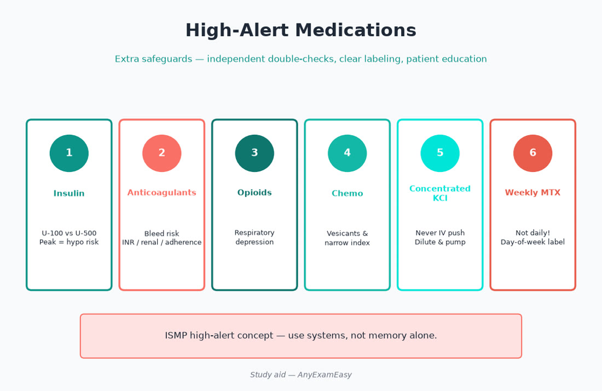
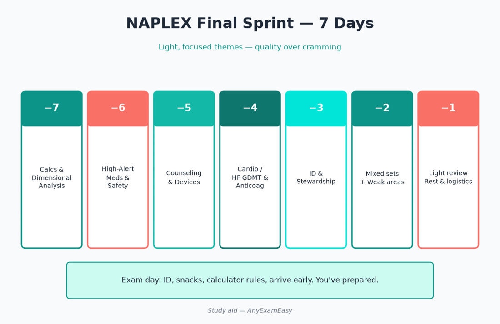

# Chapter 15 — Quick Reference

> **Study aid only.** Pocket sheets for final-week review. Verify critical values and schedules with current official sources.

---

## ISCM card

1. **Indication** appropriate?  
2. **Safety** — allergy, organ, interaction, contraindication?  
3. **Counseling** — how to take + red flags?  
4. **Monitoring** — efficacy + toxicity?

---

## Domain weight reminder (NABP Content Outline May 1, 2025+)

| Domain | Weight |
| --- | --- |
| Foundational Knowledge | 25% |
| Medication Use Process | 25% |
| Person-Centered Assessment & Treatment Planning | **40%** |
| Professional Practice | 5% |
| Pharmacy Management & Leadership | 5% |

---

## Calc cheat sparks

| Pattern | Spark |
| --- | --- |
| % w/v | 1% = **10 mg/mL** |
| Weight | lb → kg ÷ 2.2 |
| Steady state | ≈ 4–5 t½ |
| Drops | gtt/min = (mL/hr × drop factor) / 60 |
| Alligation | parts = |stock − desired| |
| BSA Mosteller | √[(cm × kg)/3600] |
| CrCl CG | [(140−age)×wt]/(72×SCr) ×0.85♀ |
| Sanity | If options differ 10×, hunt decimal |

Always cancel units; sanity-check adult vs peds magnitude.

---

## High-alert must-know table

| Class / drug | Core risk | Pharmacist control |
| --- | --- | --- |
| Insulin (esp. U-500) | Hypoglycemia; concentration errors | Pen/syringe match; dual check |
| Anticoagulants | Bleed / clot if wrong | Indication, renal, interact, holds |
| Opioids | Respiratory depression | Naloxone; no benzo stack; constipation |
| Chemotherapy | Fatal route/dose errors | BSA dual check; **no IT vinca** |
| Concentrated electrolytes | Cardiac arrest if push KCl | Dilute; restrict access |
| Methotrexate (non-onc) | Daily vs weekly | Hard stop alerts |
| Neuromuscular blockers | Paralysis without vent | Segregate; labeling |
| Pediatric liquids | 10× overdoses | kg + concentration + syringe |
| Clozapine | Neutropenia | REMS/ANC |
| Aminoglycosides / vanco | Oto/nephro | Levels; renal adjust |

---

## Interaction quick hits (dense)

| Pair | Risk |
| --- | --- |
| Nitrate + PDE-5 | Dangerous hypotension |
| Warfarin + TMP-SMX / metro / amiodarone | INR↑ / bleed |
| Serotonergic stacks (± linezolid/tramadol) | Serotonin syndrome |
| Polyvalent cations + thyroid / FQ / tetra / INSTIs | Chelation ↓ absorption |
| Inducers (rifampin, CBZ, SJW) | Substrate failure |
| ACEI/ARB + K⁺-sparing / TMP | HyperK |
| ACEI + ARNI no washout | Angioedema risk |
| Lithium + NSAID/ACEI/thiazide | Lithium↑ |
| Valproate + lamotrigine | SJS risk if rush titration |
| CNI + azole / rifampin | Toxicity or rejection |
| Clopidogrel + strong CYP2C19 inhibit themes | Efficacy questions |
| Simvastatin + strong CYP3A inhibit | Myopathy |
| Opioid + benzo / alcohol / gabapentinoid | Respiratory depression |
| QT stacks + low K/Mg | TdP |

---

## Counseling one-liners (must-know)

| Topic | Line |
| --- | --- |
| Levothyroxine | Empty stomach; separate cations |
| ICS inhaler | Rinse mouth; technique teach-back |
| SGLT2 | Genital hygiene; sick-day / surgery holds |
| Warfarin | Consistent vitamin K; bleeding signs; INR plan |
| Epinephrine | Anaphylaxis → inject → call emergency services |
| Opioids | Constipation plan; naloxone; no alcohol/benzos |
| Bisphosphonate oral | Full glass water; upright 30–60 min |
| ARNI switch | ACEI washout first |
| Methotrexate non-onc | Weekly—not daily |
| DOAC | Don’t skip; renal dosing; procedure holds |
| Lactulose HE | Titrate to soft stool goals |
| Naloxone OTC | Show device; call 911 after use |

---

## Clinical must-know mini tables

### HF GDMT pillars

ACEI/ARB/ARNI · evidence BB · MRA · SGLT2 · (+ loop for congestion)

### T2D comorbidity add-ons

ASCVD/HF/CKD → SGLT2 and/or GLP-1 RA themes (confirm current ADA)

### Asthma

No LABA monotherapy; ICS backbone; device technique = therapy

### Antibiotics stewardship

IV→PO; stop ASB treatment (most non-pregnant); dapto ≠ pneumonia; allergy clarify

### Special pops

Peds: oral syringe · Geriatrics: Beers/anticholinergic · Pregnancy: no ACEI/ARB; isotretinoin REMS · Lactation: drug-specific

---

## Special population sparks

- Pregnancy: no ACEI/ARB; isotretinoin REMS; valproate caution  
- Peds: weight-based mL with oral syringe  
- Geriatrics: anticholinergic burden; Beers; falls  
- Renal: adjust or avoid; don’t trust low SCr in frail elderly alone  
- Hepatic: no NSAIDs in cirrhosis; lactulose to stools

---

## Final sprint (optional)

| Day | Do this |
| --- | --- |
| −7 | Full-length timed sim + error log |
| −6 | Domain 3 weak systems + calc drill |
| −5 | ID + cardio + endocrine intensives |
| −4 | Med-use process + immunizations + substitutions |
| −3 | Renal/hepatic + special pops + onc supportive |
| −2 | Domains 4–5 + quick refs + error-log only |
| −1 | Light ISCM + logistics + sleep |

---

## Exam-day micro checklist

ATT/ID · snacks for breaks · pace ~1.5–1.6 min/item average · units on every calc · optional breaks · no return mindset · breathe · ISCM on every stem · don’t mix MPJE law trivia into NAPLEX answers unless asked as practice process

---

## Soft CTA (study system)

When you’re ready for exam-style reps, practice on [anyexameasy.com](https://anyexameasy.com) ($27.99/mo after trial; trial terms on site). Study aid; independent of NABP. MPJE is separate.
