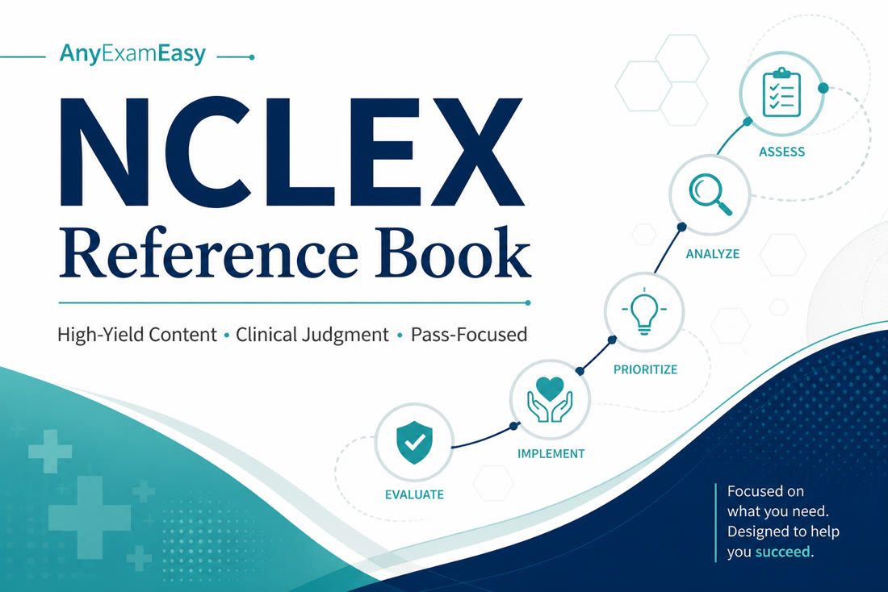

# AnyExamEasy NCLEX Reference Book

**Subtitle:** Pass-Focused Clinical Judgment Companion for the 2026 Next Gen NCLEX

**For:** NCLEX-RN and NCLEX-PN candidates  
**From:** [AnyExamEasy](https://anyexameasy.com)  
**Edition framing:** 2026 CAT / NGN  
**Edition:** Enhanced (clinical judgment deepened — vignettes, red flags, concept checks)

---

## Study-aid disclaimer (read this)

This book is a **study aid for exam preparation**. It is **not**:

- Medical advice or a treatment protocol  
- A substitute for your nursing program, clinical instructors, or facility policy  
- An official NCSBN publication or replacement for the NCLEX test plan / Candidate Bulletin  

**Always verify** labs, medication details, isolation practices, and scope-of-practice rules with current official sources, your instructors, and your nursing regulatory body. Reference ranges and protocols vary by lab and facility. When uncertain, stay directional and confirm before clinical use.

Portions of this material are **AI-generated** and may contain errors, omissions, or outdated information. Verify critical facts against authoritative textbooks, course materials, and official exam prep resources before relying on them.

Any Exam Easy does **not** guarantee exam results, licensure, or employment. We are **independent** and not affiliated with, endorsed by, or sponsored by NCSBN, Pearson VUE, or other exam owners. NCLEX®, NCLEX-RN®, and NCLEX-PN® are registered trademarks of the National Council of State Boards of Nursing, Inc.

---

## How to use this book

1. **Start with Part I (Exam Strategy)** once — CAT, NGN/CJMM, Client Needs %, frameworks, study plans, traps, exam day.  
2. **Use Part II (Clinical Content)** as a deep reference — read a topic, then immediately practice related questions.  
3. **Keep Part III (Quick Reference)** open in your final week — labs danger zones, isolation, ABCs, therapeutic keep/kill, sprint plan.  
4. **Run the learning loop:** topic → 20–40 Qbank items → full rationale review → 3 “remember this” lines in your error log.  
5. **Do not** use this book as your only content source or as a clinical protocol.

**Pro tip:** Application beats rereading. A tired 60-question day with honest rationale review beats 200 rushed guesses.

---

## RN and PN note

This book is written primarily in **RN clinical-judgment language** (Management of Care, Pharmacological and Parenteral Therapies) because that is the larger candidate pool — but **PN candidates should use it too**.

| Shared | Differs |
| --- | --- |
| CAT length/time (85–150 items, up to 5 hours), NGN clinical judgment, safety/priority mindset | Category names and % bands (PN: Coordinated Care; Pharmacological Therapies) |
| ABC, Maslow, nursing process, delegation *concepts* | Exact LPN/LVN vs RN task lists — always follow **state** scope |

Download the **official test plan** for the exam you are taking from [ncsbn.org](https://www.ncsbn.org).

---

## Pairing with AnyExamEasy Qbank

| This book | AnyExamEasy |
| --- | --- |
| Strategy, patho-enough-to-reason, memory hooks, red flags | NGN-style practice, teachable rationales, Blueprint Roadmaps, full-length mocks |

**Soft CTA:** Start free on [anyexameasy.com](https://anyexameasy.com). Upgrade when ready — **$27.99/mo after trial** (trial terms on site). One study system across boards when you need them.

---

## Table of contents

### Part I — Strategy
- Chapter 1 — Exam Strategy (CAT, NGN, frameworks, plans, traps, exam day)

### Part II — Clinical Content
- Chapter 2 — Fundamentals & Safety  
- Chapter 3 — Management of Care  
- Chapter 4 — Cardiac  
- Chapter 5 — Respiratory  
- Chapter 6 — Neurologic  
- Chapter 7 — Endocrine  
- Chapter 8 — Renal & Fluids/Electrolytes  
- Chapter 9 — GI & Hepatic  
- Chapter 10 — Other Med-Surg (MSK, immuno/onc, integument/burns, hematology)  
- Chapter 11 — Maternity & Newborn  
- Chapter 12 — Pediatrics  
- Chapter 13 — Psychosocial Integrity  
- Chapter 14 — Pharmacology  

### Part III — Pocket & Close
- Chapter 15 — Quick Reference & Final Sprint  
- Chapter 16 — FAQ, CTA & Legal  

---

*Turn the page. Train clinical judgment. Keep people safe.*
