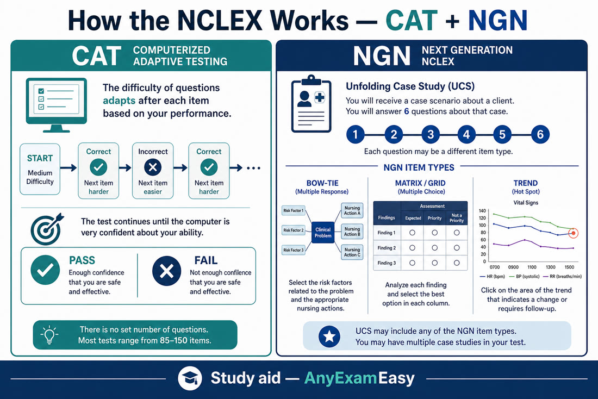
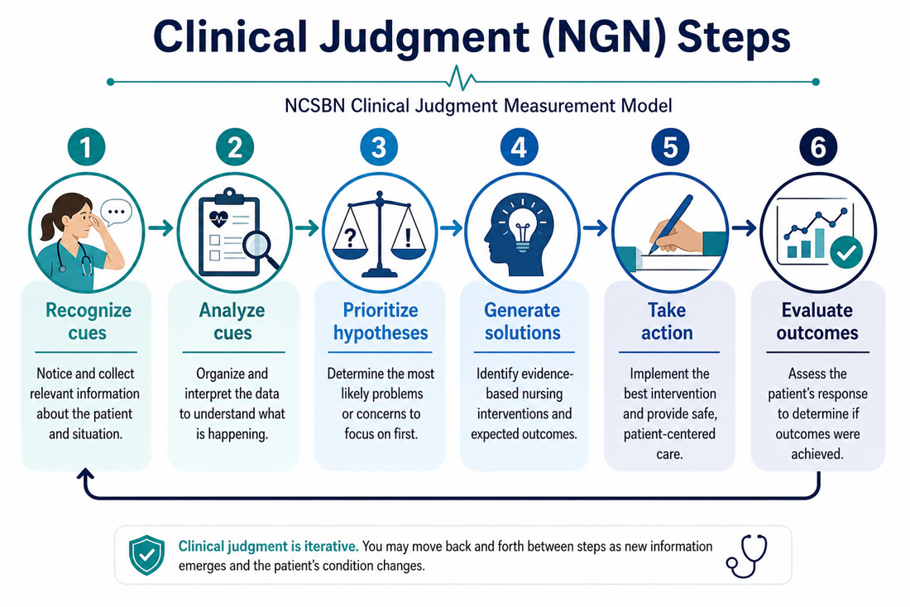
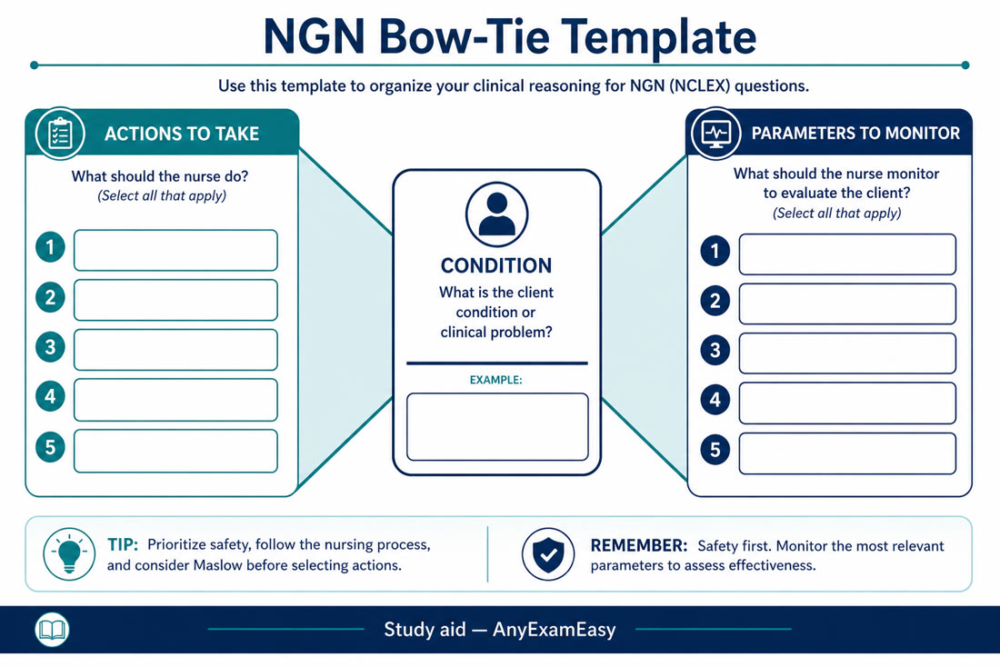
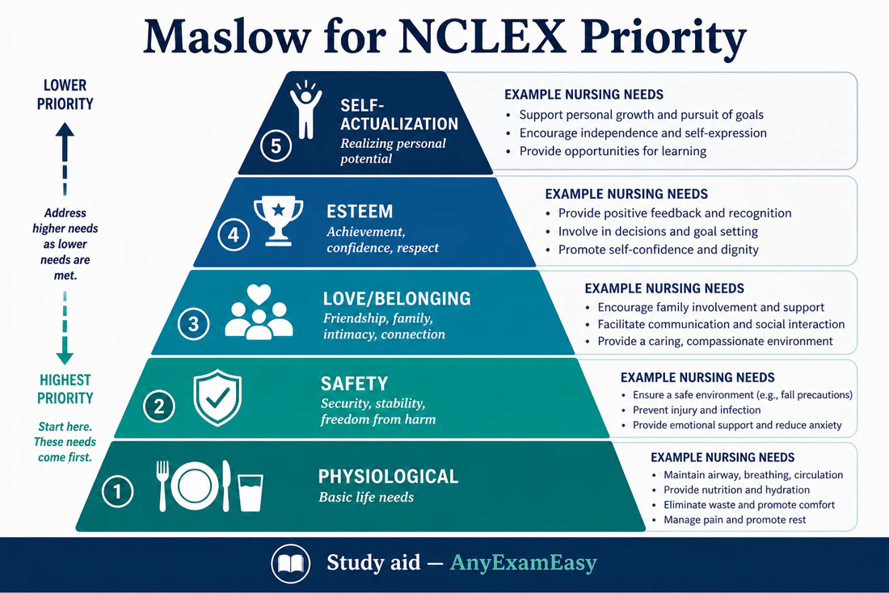
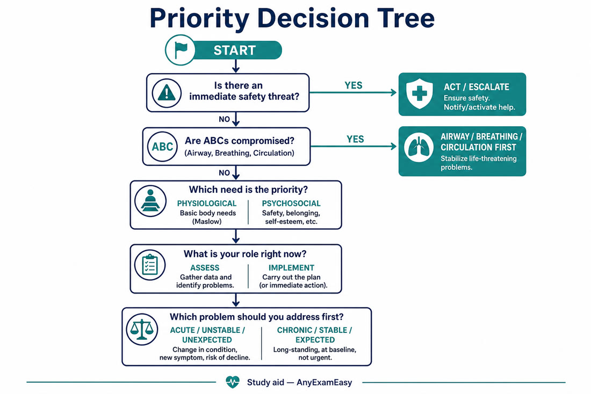

# Chapter 1 — Exam Strategy (Part I)

> **Study aid only.** Strategy framing for the 2026 Next Gen NCLEX. Confirm current rules in the official NCSBN test plan and Candidate Bulletin. Not affiliated with NCSBN.

---

## Why this chapter matters

The NCLEX is not a trivia bowl. It asks: **Can you practice as a brand-new nurse safely?** If you understand *how* the exam thinks — CAT, NGN clinical judgment, Client Needs, and priority frameworks — every content chapter becomes easier to apply.

---

## How the NCLEX works (plain English)

### The big picture

| Fact | NCLEX-RN / NCLEX-PN (2026 framing) |
| --- | --- |
| Style | Computerized Adaptive Testing (**CAT**) |
| Length | **85–150** items |
| Time | Up to **5 hours** (breaks count toward the clock) |
| Scored focus | Content + **clinical judgment** (NGN) |
| Unscored | Some **pretest** items (you can’t tell which) |
| Result | Pass/fail vs. a set standard (not a “percent correct” you see) |

**Minimum-length mix (typical framing):** about **52** content-area items + **18** case-study clinical judgment items (3 cases × 6) + **15** pretest items. Longer exams add more scored content and stand-alone clinical judgment items as needed. Always verify current Candidate Bulletin details.

### CAT in one sentence

Do well → harder items. Struggle → easier items. The computer keeps going until it’s confident you are **above or below** the passing standard (or you hit the max items/time).

**What that means for you:**

- Don’t panic if questions feel hard — that can be a good sign.  
- Don’t assume an early stop = fail.  
- Keep using the **same safe decision process** on every item.

### Next Gen NCLEX (NGN) — still the real exam in 2026

NGN is not a side quest. Clinical judgment is built into the exam through:

- **Unfolding case studies** (usually 6 questions per case)  
- **Stand-alone** clinical judgment items (~10% depending on length)

#### Six clinical judgment steps (CJMM / NCJMM)

1. **Recognize cues** — What data matters?  
2. **Analyze cues** — What does it mean?  
3. **Prioritize hypotheses** — What’s most likely / most urgent?  
4. **Generate solutions** — What could help?  
5. **Take action** — What do you do *now*?  
6. **Evaluate outcomes** — Did it work? What next?

#### Common NGN item flavors

- Extended multiple response / **SATA**  
- **Matrix / grid**  
- **Bow-tie** (condition ↔ actions ↔ monitors)  
- **Trend** (data over time)  
- Drag-and-drop / ordering  
- Highlight (hot spot)  
- Cloze / drop-down  

**Remember this:** NGN rewards *thinking like a nurse*, not trivia dump. Practice the *steps*, not just the labels.

### Stronger NGN clinical judgment drill (Enhanced edition)

Treat every unfolding case like a mini shift report:

1. **Scan for kill-me-now cues** (airway, SpO₂ trend, BP crash, suicidal means, Mag RR↓, silent chest).  
2. **Name the priority hypothesis** in one line (“flash pulmonary edema,” “PPH atony,” “stroke — NPO”).  
3. **Choose the first action that protects life/safety**, not the most educational or most complete workup.  
4. **Pick monitoring parameters that match the action** (after diuretic → UOP/K⁺/crackles/weight; after tPA → neuro checks/bleed).  
5. **Evaluate** whether the client improved; if not, escalate — NGN rewards reassessment.

**Matrix/SATA mindset:** each row/option is independently true/false — don’t use “process of elimination for the whole set” as if only one can be right.  
**Trend items:** ask what changed and what that change *means for urgency*.  
**Bow-tie:** condition ↔ actions ↔ monitors — practice even on multiple-choice stems.

**Honest caveat:** Item formats evolve; this book trains *judgment*, not a claim of official NCSBN item replicas.

### Client Needs (how content is organized)

**2026 NCLEX-RN Test Plan** (effective April 1, 2026 – March 31, 2029). Percentages guide your study time:

| Category | Approx. % of items |
| --- | --- |
| Management of Care | **15–21%** |
| Safety and Infection Prevention and Control | **10–16%** |
| Health Promotion and Maintenance | **6–12%** |
| Psychosocial Integrity | **6–12%** |
| Basic Care and Comfort | **6–12%** |
| Pharmacological and Parenteral Therapies | **13–19%** |
| Reduction of Risk Potential | **9–15%** |
| Physiological Adaptation | **11–17%** |

**NCLEX-PN note:** Same overall idea and length/time. PN uses **Coordinated Care** (instead of Management of Care) and **Pharmacological Therapies** (instead of Pharmacological and Parenteral Therapies), with slightly different percentage bands. Same NGN clinical judgment emphasis.

**Official source of truth:** [NCSBN / NCLEX test plans](https://www.ncsbn.org) and the Candidate Bulletin.

---

## Core frameworks for answering questions

Write these on your scratch board if it helps. Use them on almost every item.

### 1) Safety first

Ask: **What keeps this client safest right now?**  
Urgent safety > nice-to-have teaching > routine tasks.

### 2) ABCs (+ “D” when relevant)

1. **Airway**  
2. **Breathing**  
3. **Circulation**  
4. Then disability / neuro, then exposure / environment when trauma/context fits  

**Exception awareness:** In some disaster/triage or specific protocols, priorities shift — but for classic bedside NCLEX stems, ABCs still win often.

### 3) Maslow (when ABCs don’t settle it)

Physiological needs → safety → love/belonging → esteem → self-actualization.

**Hungry, hypoxic, or bleeding beats anxiety** — unless the psych stem is specifically about therapeutic communication *and* no acute physiologic threat is present.

### 4) Nursing process

**Assess → Analyze → Plan → Implement → Evaluate**

- Don’t jump to a fancy intervention if **assessment data is missing** and the client isn’t crashing.  
- If the client *is* crashing, act (and get help) — don’t “assess forever.”

### 5) Acute before chronic / unstable before stable / unexpected before expected

- New confusion after surgery > chronic stable dementia baseline  
- Fresh post-op day 1 > day-of-discharge education (unless stem asks for teaching)

### 6) Elimination strategy

1. Read the **stem** and cover options if you can — predict the answer type.  
2. Spot the **true question** (first action? best response? who to see first?).  
3. Kill options that are **unsafe, out of scope, or ignore the priority**.  
4. For remaining options, pick the one that is **most complete / most immediate / most nursing**.

### Keyword cheat sheet

| Keyword | Often means… |
| --- | --- |
| **First / initial / priority** | Safety + assessment vs. action based on acuity |
| **Most appropriate / best** | Therapeutic + scope + priority |
| **Further teaching needed** | Find the **wrong** patient statement |
| **Assign / delegate** | Right task, person, circumstance, communication, supervision |
| **Early sign** | Subtle change (restlessness, slight SpO₂ drop, mild confusion) |
| **Late sign** | Obvious crisis (cyanosis, unresponsiveness) |

### Delegation (RN) — quick rules

**RN keeps:** unstable clients, new admissions/assessments, teaching that requires RN judgment, complex sterile procedures (as scoped), IV push meds (per policy/scope), care planning.

**Often LPN/LVN:** stable clients with predictable outcomes, reinforce teaching, many meds (per state/facility), wound care within scope, data collection.

**Often UAP/CNA:** ADLs, vitals on stable clients, I&O, positioning, transport of stable clients — **not** assessment, teaching, or clinical judgment.

**Remember this:** You can delegate a **task**, not the **accountability**. If the client is unstable or the outcome is unpredictable, keep it.

---

## Study plans

### Quick start: pick your plan

| Timeline | Best if you… | Daily questions (target) | Focus |
| --- | --- | --- | --- |
| **2 weeks** | Just finished school, content is fresh, test is soon | 100–150 | Strategy + NGN + weak spots only |
| **4 weeks** | Solid base, want balanced review | 75–125 | Content rotation + heavy practice |
| **8 weeks** | Need rebuild, working/parenting, or first big review | 50–100 (ramp up) | Foundations → intensity → peak |

Aim for **consistency over hero days**.

### 2-week intensive

| Day | Focus | Practice |
| --- | --- | --- |
| **1** | Exam format + frameworks | 50 mixed + 1 case study |
| **2** | Safety + infection + management of care / delegation | 100 |
| **3** | Pharm: cardio, resp, endocrine + calc | 100 + 20 calc |
| **4** | Med-surg: cardiac, respiratory, neuro emergencies | 100 + 1 case study |
| **5** | Fluids/electrolytes, labs, acid-base, renal | 100 |
| **6** | Maternity + newborn high-yield | 80–100 |
| **7** | Peds + growth/development red flags | 80–100 |
| **8** | Psych + therapeutic communication | 80–100 |
| **9** | Full-length or long mixed block (timed) | 85–150 sim |
| **10** | Error-log deep dive + NGN bow-tie / matrix / trend | 100 NGN-heavy |
| **11** | Weakest 2 topics only | 100 targeted |
| **12** | Second timed long block | 85–150 sim |
| **13** | Light review: labs sheet, ABCs, traps | 40–60 easy confidence |
| **14** | Rest, logistics, light flashcards only | Sleep |

### 4-week balanced plan

| Week | Theme | Daily rhythm |
| --- | --- | --- |
| **Week 1** | Foundations + safety + management of care | AM: content 45–60 min · PM: 75 Qs · Eve: rationales |
| **Week 2** | Pharm + med-surg (cardio/resp/endo/neuro) | 75–100 Qs · 1 case study/day |
| **Week 3** | Maternity, peds, psych + fluids/labs | 100 Qs · error log weekly review |
| **Week 4** | Peak: mocks, NGN, weak areas, taper | 2–3 long sims · light content · rest before exam |

**Sample day:** Morning checklist 20–30 min → afternoon timed 50–75 Qs → evening review every miss + error log.

### 8-week rebuild plan

| Weeks | Phase | Goals |
| --- | --- | --- |
| **1–2** | Build | Client Needs overview; 50–75 Qs/day; diagnostic sets; frameworks |
| **3–5** | Intensify | 100–125 Qs/day mixed; daily NGN/case study; pharm + med-surg depth |
| **6–7** | Integrate | 2–3 full-length sims/week; maternity/peds/psych polish; endurance |
| **8** | Peak & protect | Targeted weak areas; light review; sleep, nutrition, exam logistics |

**If you’re working full-time:** protect a non-negotiable block (e.g., 90 minutes after dinner). Weekend = longer timed sets.

---

## Common traps

| Trap | What to do instead |
| --- | --- |
| Memorizing facts, skipping application | Practice NGN + rationales daily |
| Ignoring case studies until “later” | Do at least one case study most days |
| Changing answers from anxiety | Change only if you misread the stem |
| Studying only strengths | Error log drives the next day’s set |
| Resource overload | One primary bank + official test plan + this book |
| No timed practice | Build 5-hour mental endurance |
| Waiting months after graduation | Schedule while knowledge is warm (often 4–8 weeks) |
| Skipping sleep before the exam | Sleep is a study strategy |
| Reading into the question | Use only the data given |
| Picking the “nurse who sounds smart” answer | Pick the **safest / most priority / most therapeutic** answer |

**Mindset:** The NCLEX is not trying to trick you with obscure zebras. It’s testing whether you’ll **keep people safe**.

---

## Practice strategy

### Volume targets (adjust to your plan)

| Phase | Questions/day | Notes |
| --- | --- | --- |
| Foundation | 50–75 | Accuracy + learning frameworks |
| Build | 75–100 | Mix topics; add NGN |
| Peak | 100–150 | Timed blocks; full sims 2–3×/week |

**Quality rule:** Never finish a set without reviewing rationales for **wrong and lucky-right** answers.

### 4-box error log

1. **Topic** (e.g., postpartum hemorrhage)  
2. **Miss type** (cue miss / priority / content gap / misread / calc)  
3. **Correct rule** in one sentence  
4. **Next drill** (10 similar Qs tomorrow)  

Review the log every 2–3 days. Patterns > single misses.

### Score interpretation (practice only)

Practice % is **not** an official NCLEX score. Trends matter: rising rationale understanding, fewer guesses, stronger priority/safety/NGN, comfortable pacing (~1.5–2 min/item average; case studies need more focus).

### Weekly rhythm

- **5–6 practice days**  
- **1 lighter day** (labs/pharm flashcards + walk)  
- **1 longer timed simulation** in peak weeks  

---

## Exam-day checklist

### The week before
- [ ] Confirm ATT, Pearson VUE appointment, ID requirements  
- [ ] Do a full timed practice under quiet conditions  
- [ ] Drive/route check or remote logistics if applicable  
- [ ] Pack outfit layers (testing rooms vary)  
- [ ] Taper new content — protect confidence  

### Night before
- [ ] Light review only (labs sheet, frameworks)  
- [ ] Lay out IDs + confirmation info  
- [ ] Set two alarms  
- [ ] No cramming until 2 a.m.  
- [ ] Hydrate; prepare simple breakfast plan  

### Morning of
- [ ] Eat something with protein + complex carbs  
- [ ] Arrive early  
- [ ] Bathroom before check-in  
- [ ] Phone off / stored per center rules  
- [ ] Breathe: you trained for clinical judgment, not perfection  

### During the exam
- [ ] Read the stem for the **real ask**  
- [ ] Use ABC / safety / nursing process every time  
- [ ] For SATA: judge each option alone  
- [ ] For case studies: track trends across tabs/time  
- [ ] Flag nothing mentally as “I failed” — keep moving  
- [ ] Use optional breaks if needed (they count toward 5 hours)  

### After
- [ ] Don’t torture yourself reconstructing every item  
- [ ] Official results come through your nursing regulatory body; Quick Results may be available about **two business days** after testing in participating jurisdictions (unofficial; not a license)  

---

## Concept check

**Q1.** A candidate’s questions suddenly feel much harder after getting several “easy” items right. What is the most accurate interpretation?  
A. The exam is broken  
B. Harder items often mean the CAT is probing a higher ability estimate  
C. An early hard stretch always means failure  
D. You should change every answer  

**Q2.** On an unfolding NGN case, vitals worsen across three time points. Which CJMM step is most directly tested when you decide what is most urgent?  
A. Recognize cues only  
B. Prioritize hypotheses  
C. Client teaching  
D. Documentation style  

**Q3.** Which Client Needs category typically carries one of the largest RN percentage bands?  
A. Basic Care and Comfort alone  
B. Management of Care  
C. Health Promotion only  
D. Psychosocial Integrity only  

#### Answers

**Q1: B.** CAT adapts; harder items after success often reflect the algorithm estimating higher ability — stay process-focused.  
**Q2: B.** Urgency among competing explanations is prioritize hypotheses (built on recognized/analyzed cues).  
**Q3: B.** Management of Care is commonly framed around **15–21%** on the 2026 RN test plan — verify official plan.

---

## Remember this (strategy)

- Hard questions can be a **good** CAT sign — keep the same safe process.  
- NGN = clinical judgment steps, not trivia.  
- Safety → ABC → Maslow → nursing process → acute/unstable/unexpected.  
- One strong Qbank + error log > five half-used resources.  
- Sleep and logistics are part of prep.  

> **Practice the frameworks.** Open an NGN-ready set on [anyexameasy.com](https://anyexameasy.com) — start free; $27.99/mo after trial (trial terms on site).
