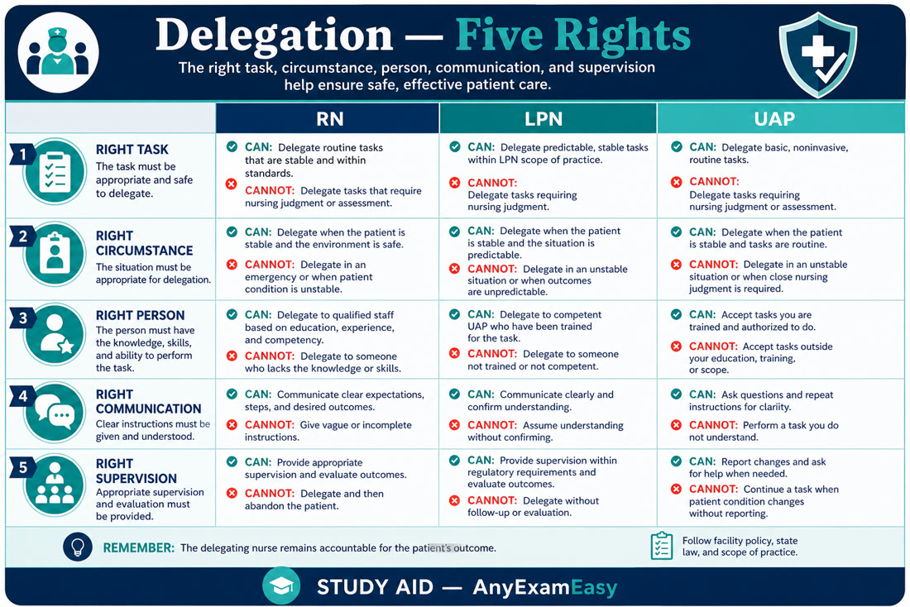

# Chapter 3 — Management of Care

> **Study aid only.** Scope and assignment rules vary by state and facility. Verify with your nursing regulatory body. PN candidates: think Coordinated Care.

---

## Why it matters on NCLEX

Management of Care is often a large slice of RN items (commonly cited in the teens–low twenties percent range on published test plans — verify current NCSBN percentages). These stems test whether you protect clients through **prioritization, delegation, advocacy, privacy, continuity, and escalation** — not whether you sound impressive.

---

## Topic A — Multi-client prioritization

### Concept

When several clients need you, rank by **ABCs, acute vs chronic, unstable vs stable, unexpected vs expected, actual problem vs risk** (actual usually wins if equal acuity framing). Maslow helps when ABCs are equal: physiologic and safety before psychosocial teaching.

### Assessment cues that scream “see first”

- New stridor, anaphylaxis signs, SpO₂ plunging  
- Active hemorrhage, chest pain with diaphoresis  
- Sudden change in LOC  
- Post-op fresh bleeds or airway risk  
- Suicidal client with means and plan (safety)

### Priority actions

1. Who is dying/crashing or about to?  
2. Who needs a **nursing assessment** only you can do?  
3. What can be delegated so you stay with the unstable client?

### Worked prioritization vignettes (practice these)

**1.** Day-2 hip replacement requesting oral pain med vs new post-op thyroidectomy with neck swelling and stridor → **thyroidectomy airway first.**  
**2.** Chronic stable HF with baseline crackles requesting education vs client with sudden crushing chest pain and diaphoresis → **chest pain first.**  
**3.** Client ready for routine discharge teaching in 1 hour vs client pulling at ET tube and desatting → **airway client first**; assign teaching later or to another RN when safe.  
**4.** UAP reports “confused” diabetic → **RN assesses** glucose/neuro before assuming dementia baseline.  
**5.** Three “stable” requests: snack, linen change, scheduled PO vitamin — none beat a fresh OR arrival with hypotensive trend.  
**6.** Psych client with escalating agitation and clenched fists vs client needing reinforcement of already-taught incentive spirometry → **safety/de-escalation first**, then IS.

### Remember this

Stable chronic pain teaching loses to new hypoxia. Expected low-grade post-op fever on day 1 often loses to unexpected chest pain.

---

## Topic B — Assignment vs delegation vs supervision

### Definitions (NCLEX lens)

- **Assignment:** distributing responsibility for client care among staff who are authorized and competent (e.g., RN-to-RN caseload).  
- **Delegation:** transferring authority to perform a **specific nursing task** to a competent person in a selected situation while **retaining accountability**.  
- **Supervision:** monitoring, follow-up, evaluation of outcomes — you still own the result.

### Five rights of delegation

Right **task**, **circumstance**, **person**, **direction/communication**, **supervision/evaluation**.

| Role | Typically can | Typically cannot |
| --- | --- | --- |
| **RN** | Assess, teach (initial), care plan, unstable, IVP per policy | “Dump” accountability |
| **LPN/LVN** | Stable predictable care, reinforce teaching, many meds per scope, data collection | Full initial admission assessment / complex unstable judgment (state-dependent) |
| **UAP** | ADLs, vitals on stable, I&O, positioning | Assess, teach, medicate, clinical judgment |

### Float nurse safety

Float staff get orientation to unit essentials (codes, equipment, documentation). Do **not** accept an assignment outside competency without support — negotiate: lighter acuity, buddy RN, or charge reassignment. “I am not oriented to this pump/population” is advocacy, not laziness. Document concerns if you must refuse an unsafe assignment per policy.

### Safety / red flags

- Delegating assessment of a fresh post-op or newly admitted client to UAP  
- Asking UAP to “evaluate if the pain med worked” as the only follow-up  
- Unclear handoff (“watch him”)  
- Floating without stating competency limits

### Remember this

You can delegate a **task**, not the **accountability**. Float = speak up early about skill gaps.

---

## Topic C — Advocacy, HIPAA, advance directives & ethics

### Advocacy

Speak up for consent, pain control, unsafe staffing patterns (use chain of command), cultural/language needs (qualified interpreter — not family minors as primary medical interpreters).

### HIPAA

Share minimum necessary with care team. No hallway gossip, no posting PHI on social media, no leaving screens open. Exceptions exist for legally required reporting (abuse, certain threats) — know the **concept**.

### Advance directives

Living will / durable power of attorney for healthcare. Ask on admission; honor DNR/AND orders per policy; if family conflicts with documented wishes, escalate to provider/ethics — don’t unilaterally override valid directives.

### Ethical principles (NCLEX style)

| Principle | Plain English | Exam vibe |
| --- | --- | --- |
| **Autonomy** | Client chooses | Informed consent/refusal |
| **Beneficence** | Do good | Pain relief, advocacy |
| **Nonmaleficence** | Do no harm | Stop unsafe med/act |
| **Justice** | Fairness | Equitable resource use |
| **Fidelity** | Keep promises | Follow through on care plan |
| **Veracity** | Truth-telling | Honest answers about prognosis per role |

When principles clash (e.g., autonomy vs beneficence), use ethics consult / chain of command — don’t invent solo solutions.

### Remember this

Privacy + client wishes + chain of command when safety is threatened. Name the ethical principle when the stem asks.

---

## Topic D — Informed consent nuances

### Concept

Provider explains procedure, risks, benefits, alternatives; nurse **witnesses signature** and verifies client understanding / voluntary consent — nurse does **not** obtain consent for surgeries they don’t perform. Client must have capacity; interpreter if language barrier; no coercion.

### Priority actions

- If client has last-minute questions about risk/benefit → **call provider back** before signing.  
- Pre-medicated / heavily sedated clients generally should not newly sign — capacity concern.  
- Emergency exceptions when client can’t consent and delay threatens life — follow law/policy.  
- Minors / guardianship: know who may legally consent in your jurisdiction.

### Remember this

Questions about the procedure → provider. Questions about timing/prep → nurse can teach. Witness ≠ explain the surgery.

---

## Topic E — Continuity, discharge readiness & referrals

### Concept

Continuity = clean handoffs (SBAR), medication reconciliation themes, follow-up appointments, home safety, teach-back.

### Discharge readiness criteria (high-yield)

Ready when: vitals reasonably stable for destination; client/caregiver can teach-back critical meds and warning signs; prescriptions/DME arranged; transportation/safe destination; follow-up scheduled; barriers (language, literacy, cognition) addressed.  
**Not ready:** unstable VS, new confusion unexplained, can’t state when to call 911 for their condition, no caregiver when one is required, unfinished teaching on high-risk meds (warfarin, insulin).

### Referrals (examples)

PT/OT, dietitian, social work/case management, home health, wound care, spiritual care — RN recognizes need and initiates per policy.

### Remember this

Teach-back beats “any questions?” Discharge unsafe → hold and escalate, don’t shrug.

---

## Topic F — Quality improvement & unsafe practice

### Concept

QI uses data (falls, CLABSI rates) to improve systems. Report near-misses. If a colleague is impaired or unsafe: **remove risk to clients first**, then follow policy for reporting — protect clients over friendships.

### Chain of command when provider orders unsafe

1. Clarify with provider (read-back; state concern with data).  
2. If still unsafe → charge nurse / nursing supervisor.  
3. Continue up (house supervisor, medical director, ethics) per policy until resolved.  
4. Do **not** give a med/perform act you know is unsafe solely because “the doctor said.” Document facts objectively.

### Remember this

Client safety > loyalty to a coworker or fear of a provider. Use policy pathways.

---

## Topic G — SBAR handoff & assignment making

### Concept

Handoff failures cause real harm. **SBAR** (Situation, Background, Assessment, Recommendation) structures urgency without novels. Assignment making matches **acuity + continuity + geography + skill mix**.

### Priority actions

- Lead with what the oncoming nurse must do in the next hour.  
- Include pending labs, new anticoagulants, fall/suicide precautions, isolation.  
- When floating: don’t take an assignment outside your competency without orientation/support — advocate for safe assignment via charge/supervisor.

### NGN angle

Trend items often hide in handoff data: “BP drifting down since 1400” beats a single normal value.

### Remember this

Clear handoff is a safety intervention. Unsafe assignment → speak up using chain of command.

---

## Topic H — Informed refusal, AMA, and capacity (high-level)

### Concept

Competent adults can refuse treatment after being informed of risks. AMA (against medical advice) departure still requires education, documentation, and offering partial alternatives when possible. Capacity is decision-specific and can fluctuate with hypoxia, intoxication, psych crisis.

### Priority actions

- Notify provider; ensure risks/benefits explained.  
- Document quotes, witnesses, what was offered.  
- If lack of capacity + emergent threat to life, emergency exceptions may apply — follow law/policy; don’t invent.

### Remember this

Respect autonomy when capacity present; protect when capacity absent and danger is imminent — escalate.

---

## Topic I — Disaster triage (START high-level)

### Concept

Mass casualty: do the **greatest good for the greatest number**. START-style categories (know the idea, not a memorized script as absolute law):

- **Red (immediate):** life-threatening but salvageable now (e.g., airway issues you can open, controlled bleeding urgency).  
- **Yellow (delayed):** serious but can wait briefly.  
- **Green (minor):** walking wounded.  
- **Black (expectant/deceased):** unlikely to survive given resources — still treat with dignity; roles vary by protocol.

Walking wounded are often tagged green first to clear the scene. This is **not** everyday ED triage — don’t apply black tags to routine single-client care.

### Remember this

Disaster = utilitarian sorting. Everyday care = sickest salvageable individual first. Know which frame the stem is using.

---

---

## Enhanced NGN frames — prioritization & delegation

### Clinical judgment vignette A — Who first?

**Stem:** Four clients call at once: (1) post-op day 1 with pain 6/10 stable VS; (2) new confusion + SpO₂ 88% on 2 L; (3) wants discharge paperwork; (4) needs PRN stool softener.

**What to do first:** See client (2) — airway/breathing + acute mental status change. Delegate comfort meds/stable pain reassessment only after ABC threat is handled; paperwork last.

**Why:** Unexpected hypoxia + confusion outranks expected pain and administrative tasks.

### Clinical judgment vignette B — Unsafe float assignment

**Stem:** Charge assigns float med-surg RN (no ICU orientation) to continuous insulin drip and arterial line client.

**What to do first:** State competency limit clearly; request buddy, education, or reassignment — don’t silently accept and “Google it.”

**Why:** Assignment safety is Management of Care. Client harm from incompetence is preventable.

### Clinical judgment vignette C — Chain of command

**Stem:** Provider orders morphine 30 mg IV push for opioid-naïve frail elder; after clarify, provider says “just give it.”

**What to do first:** Hold, notify charge/supervisor, continue chain of command per policy — document facts.

**Why:** Nonmaleficence > hierarchy theater.

### Prioritization comparison table

| Cue cluster | Priority vibe | Often wrong distractor |
| --- | --- | --- |
| New stridor / can’t speak | Airway now | Detailed pain history first |
| Chest pain + hypotension | Circulation/ACS pathway | Ambulate to calm anxiety |
| Suicidal with plan + means | Safety — remove means | Long group therapy first |
| Stable chronic pain | Lower unless ABC unstable | Jumping above hypoxia |
| Teaching need on stable client | Plan after acute threats | Skipping ABC for education |

### Delegation sharpeners

- RN: unstable, initial assessment, initial teaching, care planning, IVP per policy, triage judgment.  
- LPN/LVN: stable predictable, reinforce teaching, many meds per scope, wound care per scope.  
- UAP: ADLs, VS on stable, I&O, positioning, transport stable.  
- Never delegate what you haven’t assessed when instability is possible.

### Extra concept checks (NGN-flavored)

**Q7.** Which task is appropriate to delegate to UAP?  
A. Evaluating whether crackles improved after diuretic  
B. Assisting stable client to chair with gait belt after RN assessment  
C. Initial teaching on warfarin diet  
D. Titration of nitroglycerin drip  

**Q8.** Mass casualty START-style stem: walking wounded vs apnea corrected with airway vs unsurvivable injuries — NCLEX wants recognition that **disaster triage differs** from everyday “sickest first.” Read the stem for “disaster/mass casualty” language before answering.

#### Answers addendum

**Q7: B.** Stable ADL assist fits UAP.  
**Q8:** Follow disaster protocol cues in the stem — expectant categories can exist.

## Concept check

**Q1.** Four clients call. Whom do you see first?  
A. Day-2 post-op requesting routine oral pain med  
B. COPD client with SpO₂ 84% on usual O₂ and new confusion  
C. Diabetic requesting bedtime snack  
D. Client needing discharge teaching in 1 hour  

**Q2.** Appropriate UAP assignment?  
A. Assess breath sounds after albuterol  
B. Teach insulin self-injection  
C. Stable client bed bath and empty Foley  
D. Evaluate response to IV opioid  

**Q3.** A nurse coworker smells of alcohol and is about to give meds. Best first action?  
A. Ignore to avoid conflict  
B. Post on social media  
C. Intervene to protect clients and notify charge/supervisor per policy  
D. Document only at end of week  

**Q4.** Provider orders a dose the nurse knows exceeds safe limits for this client. After clarifying, the provider says “just give it.” Next best action?  
A. Give it to avoid conflict  
B. Refuse silently and hide the order  
C. Hold the dose, notify charge/supervisor, continue chain of command per policy  
D. Ask UAP to decide  

**Q5.** Which client is **least** ready for discharge?  
A. Teach-back correct on warfarin diet/INR follow-up; ride home present  
B. New insulin user cannot recall hypo treatment after two teaching sessions; lives alone  
C. Stable VS; home health arranged; med list reconciled  
D. Ortho client ambulating with PT clearance and caregiver  

**Q6.** Float RN not oriented to continuous insulin drips is assigned a DKA insulin infusion. Best action?  
A. Accept quietly and “figure it out”  
B. State competency limit; request orientation, buddy, or reassignment via charge  
C. Have UAP titrate the drip  
D. Stop all unit insulin protocols  

#### Answers

**Q1: B.** Airway/breathing + new confusion = unstable.  
**Q2: C.** ADLs on stable client fit UAP.  
**Q3: C.** Remove immediate risk; follow reporting policy.  
**Q4: C.** Unsafe order → hold and escalate; never knowingly harm.  
**Q5: B.** Failed teach-back on high-risk med + lives alone = not ready.  
**Q6: B.** Float safety = competency advocacy.

---

## Chapter Remember this

- Unstable / ABC / unexpected → see first; use worked vignette logic.  
- Assignment ≠ delegation ≠ supervision — RN keeps accountability.  
- Five rights; float nurses must declare skill gaps.  
- Consent: provider explains; nurse witnesses/advocates.  
- Ethics: autonomy, beneficence, nonmaleficence, justice, fidelity, veracity.  
- HIPAA minimum necessary; advance directives honored.  
- Discharge = teach-back + safety + follow-up.  
- Unsafe order/practice → chain of command.  
- Disaster START ≠ everyday triage — read the stem.
