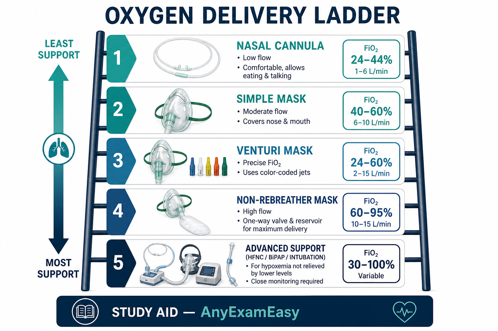
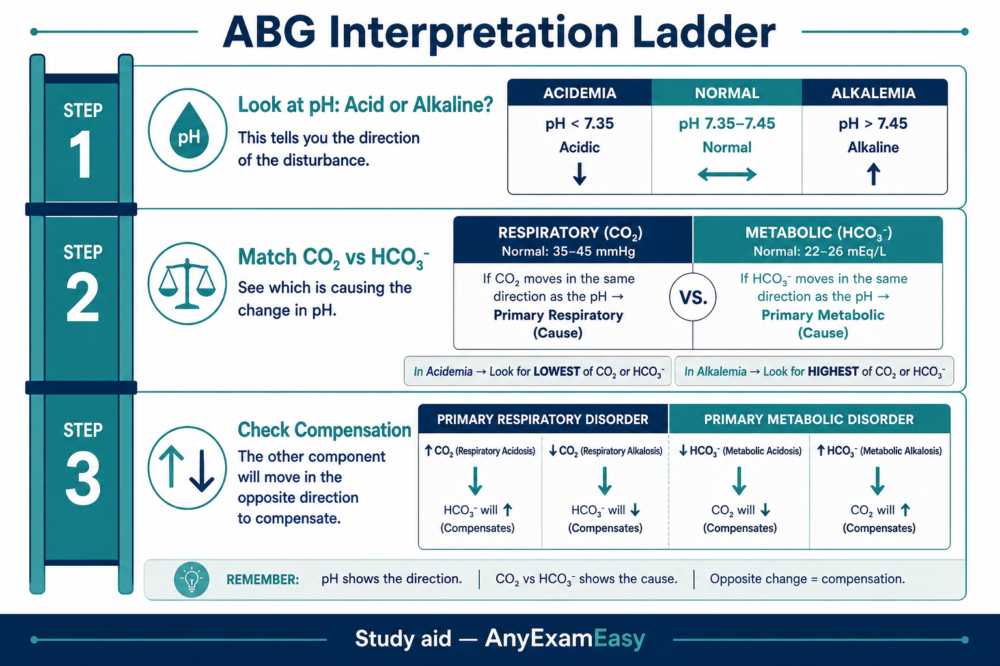
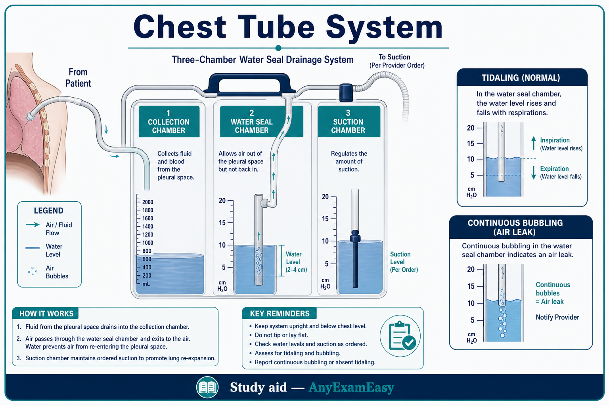

# Chapter 5 — Respiratory

> **Study aid only.** Oxygen protocols and ABG reference ranges vary — confirm with current clinical sources. Study aid, not ventilator management certification.

---

## Why it matters on NCLEX

Respiratory stems are classic **ABC** killers. Silent chest, PE, and falling SpO₂ trends appear constantly in priority and NGN items.

---

## Topic A — Asthma

### Pathophysiology / concept

Reversible airway obstruction: bronchoconstriction + inflammation + mucus. Triggers: allergens, infection, exercise, irritants.

### Assessment cues

**Early:** wheeze, cough, prolonged expiration, tachypnea, anxiety.  
**Late/ominous:** **silent chest**, inability to speak full sentences, cyanosis, exhaustion, SpO₂ drop — impending respiratory failure.

### Priority nursing actions

1. Position upright; O₂ as indicated.  
2. Short-acting beta agonist (albuterol) as ordered; anticholinergic add-ons per protocol.  
3. Systemic corticosteroids for inflammation as ordered.  
4. Monitor response; prepare for escalation if silent chest / fatigue.

### Meds (high-yield)

- SABA rescue vs inhaled corticosteroid controller adherence  
- Watch tachycardia/tremor with beta agonists  

### Client teaching

- Spacer use; rinse mouth after ICS.  
- Asthma action plan; when to seek emergency care.  
- Avoid triggers; peak flow themes if used.

### Remember this

Silent chest ≠ improvement. Speaks of dangerous airflow collapse.

---

## Topic B — COPD

### Pathophysiology / concept

Chronic bronchitis / emphysema themes → chronic airflow limitation, air trapping, CO₂ retention in some clients, hypoxic drive nuances (still give O₂ carefully per orders — don’t withhold in emergency hypoxia).

### Assessment cues

Dyspnea, barrel chest themes, pursed-lip breathing, chronic cough/sputum, clubbing sometimes; exacerbation = more dyspnea, sputum change, hypoxia/hypercapnia.

### Priority actions

- Tripod/upright; controlled O₂ titration per target SpO₂ orders.  
- Bronchodilators, steroids, antibiotics if indicated for exacerbation.  
- Pulmonary hygiene; nutrition (work of breathing burns calories).  
- Smoking cessation support.

### Teaching

- Pursed-lip / diaphragmatic breathing.  
- Vaccinations themes; pacing activities.  
- Report sputum/color change and fever.

### Safety / red flags

Rising CO₂ + somnolence; home O₂ fire/smoking risk.

### Remember this

Titrate O₂ to ordered targets; treat exacerbations early; stop smoking messaging.

---

## Topic C — Pneumonia

### Concept

Infection of lung parenchyma → consolidation, impaired gas exchange. Aspiration risk in dysphagia/altered LOC.

### Assessment

Fever, productive cough, pleuritic pain, crackles, tachypnea, confusion in elderly (may be primary cue).

### Priority actions

- O₂; cultures then antibiotics as ordered when stable enough.  
- Hydration if not contraindicated; incentive spirometry / turn-cough-deep breathe.  
- Aspiration precautions when indicated; elevate HOB.

### Remember this

Elderly: confusion may be pneumonia. Antibiotics after cultures when possible; don’t delay sepsis care inappropriately.

---

## Topic D — Pulmonary embolism

### Pathophysiology / concept

Thrombus (often DVT) → pulmonary artery obstruction → V/Q mismatch, strain on right heart, possible sudden death.

### Assessment cues

**Sudden** dyspnea, pleuritic chest pain, tachycardia, anxiety, hemoptysis sometimes, hypoxia; post-op/immobile/OCPs/cancer = risk themes.

### Priority nursing actions

1. Stay with client; call rapid response/provider.  
2. O₂; high Fowler’s; monitor VS/ECG.  
3. Prepare for diagnostics/anticoagulation/thrombolysis per orders.  
4. Prevention elsewhere: early ambulation, SCDs, anticoag prophylaxis as ordered.

### Remember this

Sudden dyspnea + risk factors → think PE until proven otherwise. Don’t leave alone.

---

## Topic E — Oxygen delivery & chest tubes (basics)

### O₂ devices (conceptual ladder)

Nasal cannula → simple mask → Venturi (precise FiO₂) → non-rebreather (high FiO₂) → advanced airways/NIV/ventilator themes. Humidify high flows as indicated; skin care on ears.

### Chest tubes

- System **below** chest level.  
- Tidaling in water seal often expected; **continuous bubbling in water seal** may indicate air leak.  
- Continuous gentle bubbling in suction chamber may be expected when suction applied (device-dependent).  
- Don’t routinely clamp without direction; dislodgement → occlusive dressing themes per protocol; call for help.

### Remember this

Below chest; know bubbling vs tidaling meaning; protect airway if tube issues.

---

## Topic F — ABGs intro

### Concept

| Look at | Meaning |
| --- | --- |
| pH | Acidemia vs alkalemia |
| PaCO₂ | Respiratory component |
| HCO₃⁻ | Metabolic component |
| PaO₂ / SaO₂ | Oxygenation |

**Shortcut:** Match the component that explains the pH = primary process. The other may compensate.

Common patterns: respiratory acidosis (hypoventilation/COPD), respiratory alkalosis (hyperventilation), metabolic acidosis (DKA/lactic), metabolic alkalosis (vomiting/NG suction themes).

**Remember this:** Treat the patient, not only the number — but know which patterns fit the stem.

---

---

## Topic G — Acute respiratory failure & ARDS themes

### Pathophysiology / concept

Respiratory failure: inadequate gas exchange — hypoxemic (low PaO₂) and/or hypercapnic (high PaCO₂). **ARDS**: inflammatory alveolar injury → shunting, stiff lungs, refractory hypoxemia; often after sepsis/trauma/aspiration/pancreatitis.

### Assessment cues

Worsening dyspnea, tachypnea, accessory muscles, falling SpO₂ despite O₂, agitation → lethargy (CO₂ rising), crackles, pink frothy sputum in cardiogenic overlap (differentiate).

### Priority nursing actions

1. Escalate early — don’t wait for perfect ABG if client crashing.  
2. High-flow O₂ / NIV / intubation as ordered and scoped.  
3. Positioning (prone therapy themes in ARDS as ordered).  
4. Treat cause (infection, fluid overload, PE).  
5. Conserve energy; cluster care; anxiety support without oversedating.

### Remember this

Refractory hypoxia + bilateral infiltrates context → ARDS pathway thinking. Lethargy after fighting for air is ominous.

---

## Topic H — Tracheostomy & suctioning safety (high-level)

### Priority actions

- Spare trach at bedside for new trachs; obturator.  
- Suction only as needed; preoxygenate per protocol; sterile technique for open suction.  
- If dislodged newly: emergency — cover stoma/ventilate per training, call for help.  
- Cuff pressures and aspiration precautions as ordered.

### Remember this

New trach dislodgement = emergency. Don’t yank ties casually in the first days.

## Concept check

**Q1.** Asthmatic with decreasing wheeze, rising lethargy, SpO₂ falling. Priority interpretation?  
A. Improving — less wheeze  
B. Possible silent chest / failure — escalate care  
C. Normal after albuterol  
D. Ignore SpO₂  

**Q2.** Post-op day 2 client with sudden dyspnea and HR 128. Best first actions?  
A. Encourage ambulation alone in hallway without assessment  
B. Stay with client, support oxygenation, notify provider/rapid response for possible PE  
C. Give PRN sleep aid  
D. Document only  

**Q3.** Continuous bubbling in water-seal chamber of chest tube likely suggests:  
A. Normal tidaling only  
B. Possible air leak — assess system/client  
C. Bag is empty of water always  
D. Client can go home immediately  

#### Answers

**Q1: B.** Silent chest / fatigue = emergency vibe.  
**Q2: B.** Sudden dyspnea + tachy post-op → PE until ruled out.  
**Q3: B.** Continuous water-seal bubbling → leak concern.

---

## Chapter Remember this

- Asthma: silent chest is ominous.  
- COPD: titrate O₂; treat exacerbations; smoking cessation.  
- Pneumonia: elderly confusion; cultures/antibiotics themes.  
- PE: sudden dyspnea — stay, O₂, escalate.  
- Chest tube: below chest; bubbling vs tidaling.  
- ABGs: pH then CO₂/HCO₃ match.
