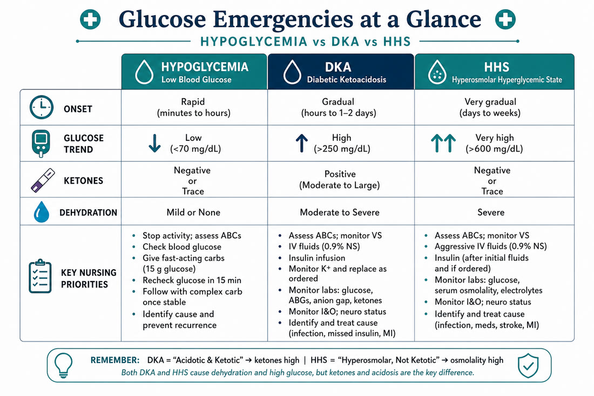
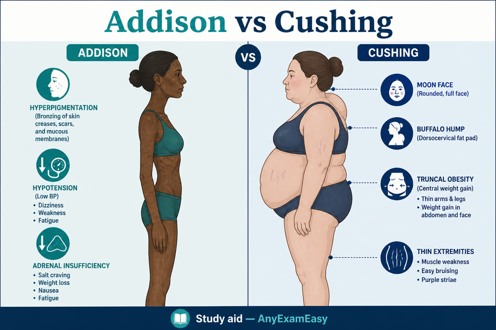

# Chapter 7 — Endocrine

> **Study aid only.** Glucose targets and insulin protocols vary. Verify with current ADA-aligned teaching and facility policy. Not dosing advice for real patients.

---

## Why it matters on NCLEX

Endocrine questions reward **pattern recognition** (hypo vs hyper; DKA vs HHS; thyroid extremes; SIADH vs DI) and **safe teaching** (sick days, tapering steroids, foot care, medical ID).

---

## Topic A — Diabetes mellitus & acute crises

### Pathophysiology / concept

Insulin deficiency/resistance → hyperglycemia. Chronic damage to vessels/nerves. Acute crises:

| | **Hypoglycemia** | **DKA** | **HHS** |
| --- | --- | --- | --- |
| Who | Any on insulin/secretagogues | Often T1; can be T2 | Often T2 older adults |
| Key lab vibe | Low glucose | High glucose + ketones + anion-gap acidosis | Very high glucose, profound dehydration, usually minimal ketones |
| Mental status | Shaky → confused → seizure/coma | Fruity breath, Kussmaul, abd pain | Profound lethargy/coma risk |

### Assessment cues

**Hypo (adrenergic → neuroglycopenic):** sweat, tremor, hunger, tachycardia → confusion, seizure, coma.  
**Hyper:** polyuria/polydipsia/polyphagia, blurry vision, dehydration.  
**DKA:** Kussmaul respirations, fruity breath, abdominal pain, vomiting.  
**HHS:** extreme dehydration, neuro changes, often precipitating illness.

### Somogyi vs dawn phenomenon (concepts)

Both cause morning hyperglycemia — different “why”:  
- **Dawn:** natural early-morning hormone surge → rising glucose; often needs evening dose adjustment per provider.  
- **Somogyi (rebound) theme:** nocturnal hypo → counter-regulatory rebound hyper; check **3 a.m. glucose** when taught — if low at 3 a.m. then high at breakfast, discuss with provider (may need less evening insulin, not more).  
Don’t memorize contested debates — know that **nighttime checks** guide the plan.

### Priority nursing actions

**Hypoglycemia (conscious, can swallow):** 15-15 rule concept — ~15 g fast carb, recheck ~15 min, repeat as needed; then protein/complex carb per protocol.  
**Unconscious / NPO:** glucagon IM/SQ or IV dextrose per orders — protect airway.  
**DKA/HHS:** ABCs; IV fluids first themes; **check K⁺ before starting insulin — hold insulin and replace potassium first if K⁺ < 3.3 mEq/L** (insulin drives K⁺ intracellularly); insulin infusion per protocol once K⁺ is adequate; continue replacement as ordered once urine output is established (total body K⁺ depleted even if serum looks normal/high initially); add dextrose to fluids as glucose approaches ~200–250 mg/dL so the drip can keep closing the gap; treat precipitating cause; NPO; frequent labs/neuro checks.

### Medications (high-yield)

- Insulins by kinetics (rapid/short/intermediate/long) — **peak = hypo risk window**  
- Never share pens; site rotation; needle safety  
- Oral agents themes: metformin (contrast/lactic caution concepts), sulfonylurea hypo risk, SGLT2 infection/DKA awareness themes — verify current teaching  

### Client teaching — foot care & sick-day rules (fuller)

**Foot care:** inspect tops/soles/between toes daily (mirror/caregiver if needed); wash/dry carefully; moisturize (not between toes); closed leather shoes; seamless socks; never go barefoot; no bathroom surgery on calluses/ingrown nails — podiatry; report non-healing ulcers, redness, drainage.  
**Sick-day:** never stop insulin blindly when ill (stress raises glucose); check glucose more often; check ketones when taught (esp. T1); sip fluids; soft carbs if not eating; call for persistent vomiting, inability to keep fluids, moderate/large ketones, or glucose staying very high per personal parameters; know when to seek ED.  
MedicAlert themes; carry fast sugar.

### Safety / red flags

- Beta blockers may mask hypo tachycardia.  
- Drawing insulin: clear before cloudy when mixing (if mixing still taught); never mix long-acting analogs that shouldn’t be mixed.  
- Hypo unawareness in longstanding diabetes.

### Delegation notes

UAP can bring juice if RN directs after confirming hypo plan; RN interprets glucose patterns and teaches.

### Remember this

- Treat hypo now — brain needs glucose.  
- DKA/HHS: fluids + insulin protocol + potassium vigilance.  
- Peak of insulin = watch for hypo.  
- Sick days ≠ stop insulin; feet are sacred.

---

## Topic B — Thyroid disorders (including storm vs myxedema)

### Pathophysiology / concept

Thyroid hormones (T3/T4) set metabolic rate. **Hypo** = underactive (Hashimoto common). **Hyper** = overactive (Graves common). Extremes: **myxedema coma** (hypo crisis) and **thyroid storm** (hyper crisis).

### Assessment cues

| Hypothyroid | Hyperthyroid |
| --- | --- |
| Fatigue, cold intolerance, weight gain, bradycardia, constipation, dry skin | Anxiety, heat intolerance, weight loss, tachycardia, diarrhea, tremor |
| Myxedema coma: hypothermia, hypoventilation, brady, altered LOC | Storm: high fever, severe tachy/arrhythmia, delirium — emergency |

### Thyroid storm vs myxedema (contrast)

| | **Thyroid storm** | **Myxedema coma** |
| --- | --- | --- |
| Temp | High fever | Hypothermia |
| HR | Severe tachy / arrhythmia | Bradycardia |
| Neuro | Agitation → delirium | Stupor → coma |
| Trigger themes | Infection, surgery, abrupt antithyroid stop | Cold, infection, sedatives, missed levothyroxine |
| Nurse energy | Cooling, O₂, meds per protocol, ICU | Airway, warming, IV hormone per orders, cautious sedation |

### Priority nursing actions

- Hypo: levothyroxine teaching (morning empty stomach themes; don’t stop abruptly); watch for over-replacement. Myxedema: ABCs, warming, IV hormone per orders, cautious sedation.  
- Hyper: cool quiet environment; antithyroid meds/beta blockers as ordered; iodine/surgery/RAI themes. Storm: escalate care, cooling, meds per protocol.  
- Post-thyroidectomy: airway (hematoma/edema), **hypocalcemia** if parathyroids affected (tetany, Chvostek/Trousseau), laryngeal nerve injury (voice/stridor).

### Meds

- Levothyroxine: take consistently; separate from some binders/iron/calcium timing.  
- Methimazole/PTU themes: agranulocytosis teaching (fever/sore throat → report).  
- Beta blockers for symptom control in hyper.

### Client teaching

- Lifelong replacement often needed in hypo.  
- RAI: radiation precautions per instructions (sleep apart, fluid intake, avoid close contact with pregnant/infants for instructed period).  
- Report storm/myxedema warning signs.

### Remember this

Post-op thyroid = airway + calcium. Storm and myxedema are ICU-level emergencies — opposite temperature/HR patterns.

---

## Topic C — Parathyroid (hyper / hypo)

### Pathophysiology / concept

PTH raises serum calcium (bone, kidney, gut activation themes).  
**Hypoparathyroid** (often post-thyroidectomy): **low Ca²⁺**, high phosphate themes → tetany, laryngospasm risk.  
**Hyperparathyroid:** **high Ca²⁺** → stones, bones, groans, psychic moans; osteoporosis/fracture risk; dehydration.

### Priority nursing actions / teaching

- HypoCa: calcium + vitamin D as ordered; seizure/airway watch; teach early tetany signs.  
- HyperCa: hydration, mobility as tolerated, strain urine if stones; caution digoxin toxicity themes with high Ca²⁺; prepare for surgery if adenoma.

### Remember this

Post-thyroidectomy tingling/spasms = think calcium. High Ca²⁺ = stones and bones.

---

## Topic D — Adrenal: Addison vs Cushing & steroid teaching

### Pathophysiology / concept

Adrenal cortex: cortisol + aldosterone (and androgens).  
**Addison (insufficiency):** low cortisol/aldosterone → weakness, hypotension, hyperpigmentation (primary), salt craving, **hyperkalemia/hyponatremia** themes; crisis = shock.  
**Cushing (excess cortisol):** central obesity, moon face, buffalo hump, hyperglycemia, infection risk, thin skin, hypertension, mood changes — exogenous steroids common cause.

### Assessment cues

Addison crisis: profound hypotension, fever, hypoglycemia, hyperkalemia themes after stress/stopped steroids.  
Cushing: infection, poor wound healing, fractures risk, hyperglycemia.

### Priority nursing actions

**Addison / crisis:** IV fluids + glucocorticoid replacement per orders; treat hyperkalemia; never abruptly stop chronic steroids.  
**Cushing:** infection precautions; monitor glucose/BP; careful skin care; if surgical cause, post-op adrenal insufficiency risk.

### Steroid teaching (high-yield — expand)

- **Taper** — never stop chronic glucocorticoids cold turkey (adrenal crisis).  
- Take with food; morning dosing often mimics circadian rhythm as taught.  
- **Infection** risk — report fever early; may mask signs.  
- **Glucose** rises — monitor if diabetic.  
- Weight/BP/mood changes; calcium/vit D and fall precautions for bone loss themes.  
- Stress dosing concepts as taught by provider (illness/surgery may need higher doses).  
- Medical ID for adrenal insufficiency.

### Safety / red flags

Abrupt steroid cessation → adrenal crisis. Infection in Cushing can be subtle then severe.

### Remember this

Addison = need hormones + salt/volume in crisis. Cushing = protect from infection/injury. Never stop steroids cold turkey — taper, infection, glucose.

---

## Topic E — Pituitary basics & SIADH vs DI (endocrine angle)

### Concept

Posterior pituitary releases **ADH** (and oxytocin). Anterior hormones include ACTH, TSH, GH — tumors/surgery can disrupt. After pituitary surgery: watch DI (high UOP), CSF leak themes (clear drainage, halo), neuro status. (See also renal chapter for fluid/Na⁺ table — same physiology, different exam angle.)

### SIADH vs DI (endocrine view)

| | **SIADH** | **DI** |
| --- | --- | --- |
| ADH | Too much | Too little / kidneys don’t respond |
| Water | Retained | Lost as dilute urine |
| Na⁺ | Dilutional hyponatremia | Hypernatremia risk |
| Nurse | Fluid restriction as ordered; seizure precautions; slow Na⁺ correction | Replace fluids; desmopressin (central DI) as ordered; strict I&O/weights |

Triggers for SIADH themes: CNS injury, small-cell lung cancer, some meds. DI: head trauma, pituitary surgery, nephrogenic causes.

### Remember this

SIADH = soaked (low Na⁺). DI = high UOP dilute urine. Pituitary post-op → watch UOP and CSF leak cues.

---

---

## Clinical judgment vignettes — endocrine deepening

### Vignette A — Hypoglycemia at the desk

**Stem:** T1D client diaphoretic, shaky, BG 54, can swallow.

**First:** 15 g fast carb (glucose tabs/juice per protocol), recheck ~15 min, then complex snack if meal distant — don’t give insulin “because lunch tray is late.”

### Vignette B — DKA vs HHS sorting

**Stem:** BG 620; one client young with Kussmaul + ketones + pH 7.1; another older with BG 900, profound dehydration, minimal ketones.

**Action theme:** Both need ABCs + fluids per protocol; DKA emphasizes insulin + K⁺ vigilance with acidosis; HHS emphasizes profound fluid resuscitation and osmolarity — don’t memorize cookbook doses; know the pattern differences.

### Vignette C — Post-thyroidectomy

**Stem:** Neck swelling, stridor, anxiety after thyroidectomy.

**First:** Airway emergency — elevate HOB, O₂, call surgeon/rapid response, trach kit readiness per protocol — not “ice collar and wait.”

### Teaching expansion — sick days & feet

- Sick days: never stop insulin blindly; check BG/ketones; sip fluids; call if vomiting/persistent highs.  
- Feet: daily inspection, closed shoes, podiatry for nails if neuropathy, report nonhealing ulcers.  
- Steroid teaching: taper; infection risk; glucose rise; medical ID for adrenal insufficiency.

### Extra concept checks

**Q7.** Somogyi vs dawn — which statement is correct?  
A. Both are treated by blindly increasing night insulin without data  
B. Nocturnal checks help distinguish hypo rebound (Somogyi) vs dawn phenomenon  
C. Ignore 0300 glucoses  
D. Stop all basal insulin forever  

**Answer: B.**

---

## Topic deepening — thyroid, adrenal, SIADH/DI tables

| Disorder | Glucose/BP/Na vibe | Nurse hooks |
| --- | --- | --- |
| DKA | High glucose, ketones, acidosis | Fluids, insulin protocol, K⁺ |
| HHS | Very high glucose, hyperosmolar | Fluids heavy, insulin, neuro |
| Addison | Low Na, high K, low BP, crisis shock | Steroids, fluids, sugar |
| Cushing | High glucose, infection risk, thin skin | Taper teaching, glucose, skin |
| SIADH | Low Na, concentrated urine | Fluid restrict as ordered, seizure precautions |
| DI | High Na risk, huge UOP, dilute urine | Replace fluids, desmopressin as ordered |
| Hypothyroid / myxedema | Bradycardia, hypothermia, coma risk | Warm, airway, hormone as ordered — no rush warm extremes |
| Thyroid storm | Fever, tachy, delirium | Cooling, airway, ordered antithyroid/beta-blocker themes |

### Red flags callout

> **Red flag:** Adrenal crisis — refractory shock + hyponatremia/hyperkalemia history of steroid stop.  
> **Red flag:** Post-op thyroid — stridor/hematoma.  
> **Red flag:** Na⁺ falling fast in SIADH — seizure risk; correct carefully per protocol (over-rapid Na rise also dangerous).

### Medication highlights

Insulin peaks; metformin hold around contrast per protocol; levothyroxine AM empty stomach; hydrocortisone stress dosing teaching for Addison; desmopressin for DI; methimazole/PTU liver/agranulocytosis teaching themes.

## Concept check

**Q1.** Client on insulin is sweaty, shaky, and confused. Glucose 52 mg/dL. First action if able to swallow?  
A. Give 15 g fast-acting carbohydrate per protocol and recheck  
B. Give NPH peak dose now  
C. Start DKA insulin drip immediately  
D. Ignore — likely anxiety  

**Q2.** DKA treatment priority sequence theme?  
A. Insulin powder PO first  
B. Airway/fluids, insulin per protocol, monitor potassium  
C. Restrict all fluids  
D. Only treat with bicarbonate always first  

**Q3.** Day-1 post-thyroidectomy with stridor and expanding neck swelling. Priority?  
A. Reassure and recheck in 4 hours  
B. Support airway and notify provider/rapid response immediately  
C. Give PO calcium without assessment  
D. Ambulate in hall  

**Q4.** Client with fever, HR 150, temperature 40°C (104°F), and known hyperthyroidism. Nurse suspects:  
A. Myxedema coma — warm blankets only  
B. Possible thyroid storm — escalate, cooling, protocol meds  
C. Simple anxiety — discharge  
D. Addison crisis from too much thyroid hormone  

**Q5.** Best sick-day teaching for insulin-dependent client?  
A. Stop all insulin until appetite returns  
B. Continue insulin per plan, check glucose/ketones more often, hydrate, know call parameters  
C. Exercise intensely until ketones clear  
D. Double long-acting insulin without guidance  

**Q6.** Chronic prednisone teaching priority includes:  
A. Stop suddenly if feeling better  
B. Taper per provider; report infection; monitor glucose themes  
C. Take only at bedtime with grapefruit juice always  
D. Avoid medical ID to reduce stigma  

#### Answers

**Q1: A.** Symptomatic hypo with intact swallow → fast carb (15-15 concept).  
**Q2: B.** Fluids + insulin protocol + K⁺ vigilance.  
**Q3: B.** Airway hematoma emergency.  
**Q4: B.** Hyperthermia + severe tachy in hyperthyroid = storm pattern.  
**Q5: B.** Sick-day = don’t blindly stop insulin; monitor and call.  
**Q6: B.** Taper + infection + glucose awareness.

---

## Chapter Remember this

- Hypo kills fast — treat.  
- DKA vs HHS: ketones/acidosis vs profound hyperosmolar dehydration.  
- Dawn vs Somogyi: use nocturnal checks to guide.  
- Thyroid extremes and post-op airway/Ca²⁺; storm ≠ myxedema.  
- Parathyroid = calcium story.  
- Addison crisis vs Cushing infection/glucose; steroid taper forever teaching.  
- SIADH vs DI; pituitary post-op UOP/CSF.  
- Feet + sick days = pass-level diabetes teaching.
