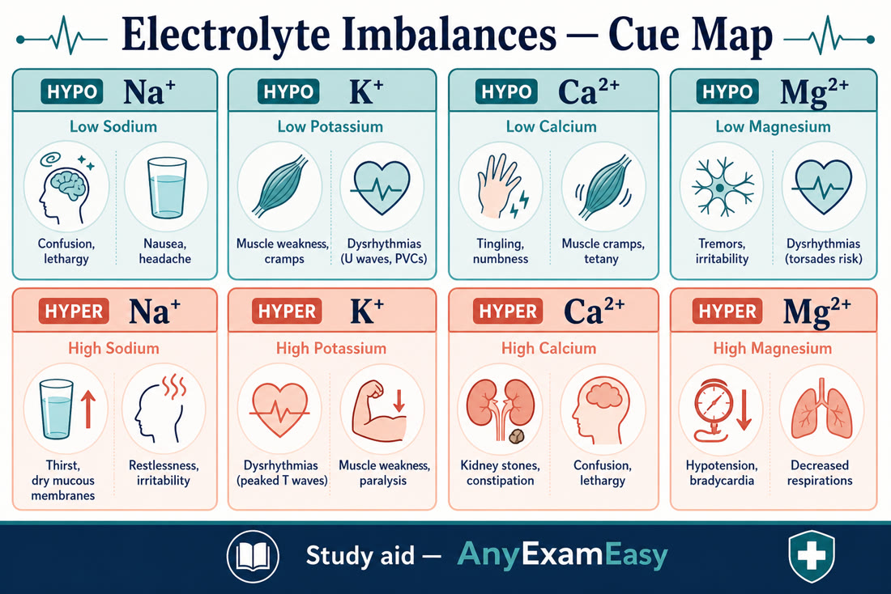
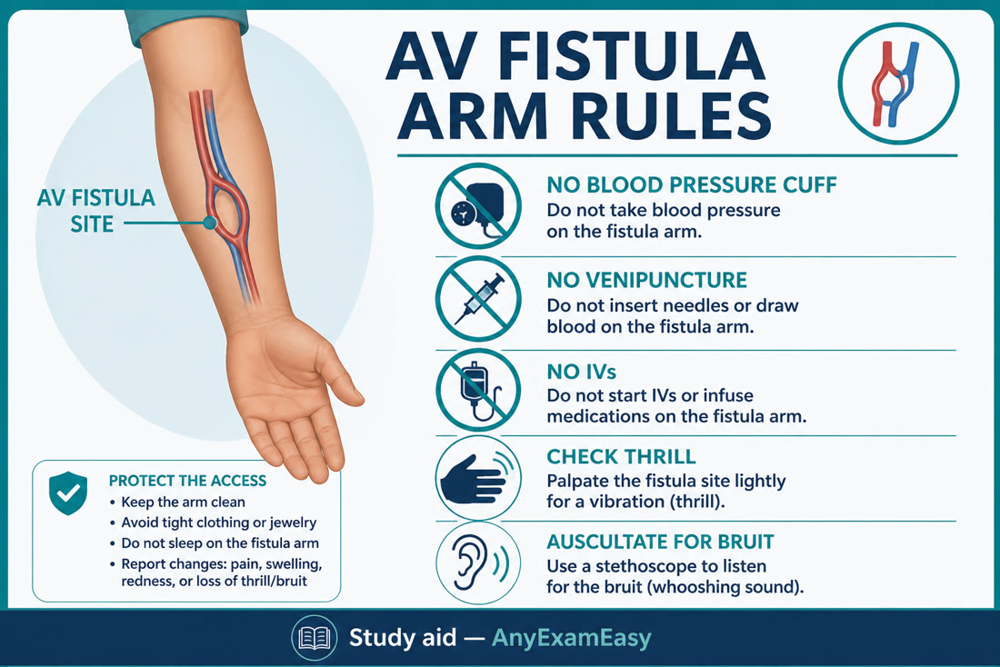
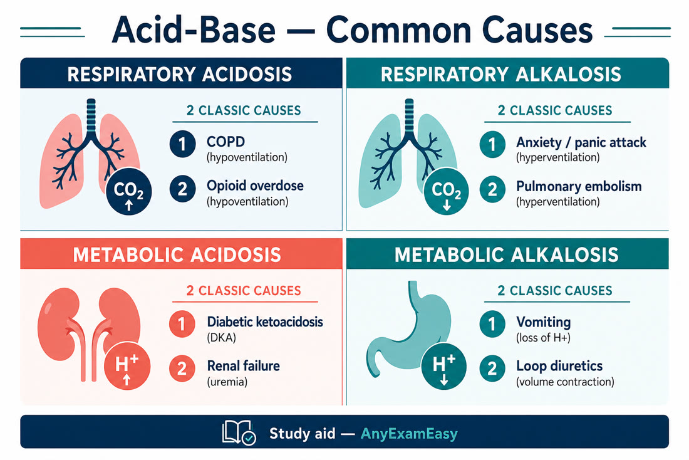

# Chapter 8 — Renal & Fluids/Electrolytes

> **Study aid only.** Exact lab reference ranges vary by laboratory. Know direction and urgency; verify local ranges. Not a dialysis prescription guide.

---

## Why it matters on NCLEX

Fluids/electrolytes and renal items sit at the intersection of **cardiac rhythm safety, neuro status, and medication effects**. Hyperkalemia, volume overload, transfusion reactions, and dialysis access problems are frequent “who do you see first?” drivers.

---

## Topic A — Fluids & electrolytes

### Pathophysiology / concept

Water follows sodium; potassium drives cardiac conduction; calcium drives neuromuscular stability; magnesium often rides with K⁺ issues.

### Assessment cues (high-level)

| Imbalance | Classic cues |
| --- | --- |
| **Hyponatremia** | Confusion, seizures (severe), headache |
| **Hypernatremia** | Thirst, dry mucosa, irritability/neuro changes |
| **Hypokalemia** | Weakness, dysrhythmias, U-wave themes, dig toxicity risk ↑ |
| **Hyperkalemia** | Peaked T waves, weakness, bradydysrhythmias — **emergency potential** |
| **Hypocalcemia** | Tetany, Chvostek/Trousseau, laryngospasm risk |
| **Hypercalcemia** | “Bones, stones, groans, psychic moans,” weakness |
| **Hypomagnesemia** | Torsades risk themes, reflexes ↑, accompanies low K⁺/Ca²⁺ |

### Fluid volume excess vs deficit (comparison)

| | **Fluid volume deficit** | **Fluid volume excess** |
| --- | --- | --- |
| VS vibe | Tachycardia, hypotension, weak pulses | HTN (often), bounding pulses |
| Respiratory | Clear unless weak/aspiration | Crackles, dyspnea, ↑ RR |
| Other | Dry mucosa, oliguria, poor turgor, weight loss | Edema, JVD, weight gain, S3 themes |
| Causes themes | Bleed, vomit/diarrhea, burns, DI, under-resuscitation | HF, renal failure, SIADH, iatrogenic IV fluids |
| Nurse focus | Replace per orders; treat cause; orthostatics | Restrict fluids/Na⁺ as ordered; diuretics; elevate HOB; daily weights |

Daily weights = best chronic volume tracker (same scale, same time, same clothes themes).

### Priority nursing actions

1. Telemetry when K⁺/Mg²⁺ deranged.  
2. Replace or remove electrolytes **per orders** — IV K⁺ never IV push; controlled infusion only.  
3. Seizure precautions for severe Na⁺ shifts; correct Na⁺ carefully (over-rapid correction risks demyelination themes).  
4. Hyperkalemia emergency themes: protect heart (calcium as ordered), shift K⁺ (insulin+glucose, beta agonists as ordered), remove K⁺ (binders, dialysis).

### Client teaching

- Diuretic diet: K⁺ rich vs avoid depending on drug.  
- Fluid restriction adherence when ordered (HF/SIADH/renal).  
- Report weight gains (~2–3 lb in a day or ~5 lb in a week themes — follow personal parameters).

### Safety / red flags

- IV potassium push = never.  
- Peaked T waves → escalate.  
- Rapid Na⁺ swings.

### Remember this

Treat patient + trend. K⁺ emergencies are cardiac emergencies. Weights win for volume.

---

## Topic B — Acid-base (integrated)

### Shortcut

1. Look at **pH**  
2. Look at **PaCO₂** (respiratory) and **HCO₃⁻** (metabolic)  
3. Match the one that explains pH → primary  
4. Other may compensate  

| Pattern | Example drivers |
| --- | --- |
| Resp acidosis | Hypoventilation, COPD, oversedation |
| Resp alkalosis | Hyperventilation, anxiety, PE early |
| Met acidosis | DKA, lactic shock, diarrhea |
| Met alkalosis | Vomiting, NG suction, diuretic themes |

### Remember this

Fix the cause (ventilate, perfuse, insulin for DKA, etc.).

---

## Topic C — AKI & CKD; nephrotic vs nephritic

### Pathophysiology / concept

**AKI:** sudden drop in GFR — prerenal (perfusion), intrinsic (ATN/nephritis), postrenal (obstruction).  
**CKD:** progressive irreversible loss; stages by GFR; complications = fluid overload, hyperkalemia, anemia, mineral bone disease, uremia, acidosis.

### Nephrotic vs nephritic (themes)

| | **Nephrotic** | **Nephritic** |
| --- | --- | --- |
| Hallmark vibe | Massive proteinuria → hypoalbuminemia → edema | Inflammation → hematuria (“cola” urine), HTN, oliguria |
| Other | Hyperlipidemia themes; infection/clot risk | RBC casts themes; rising Cr |
| Nurse | Skin care, infection watch, nutrition as ordered, anticoag awareness if ordered | BP control, fluid/Na⁺ management, monitor renal function |

### Assessment cues (AKI/CKD)

Oliguria/anuria, rising creatinine/BUN, hyperkalemia, metabolic acidosis, edema/HTN, uremic frost/encephalopathy late, pericarditis themes late.

### Priority nursing actions

- Map cause: fluids for prerenal if ordered; relieve obstruction; avoid nephrotoxins (NSAIDs, aminoglycosides themes).  
- Monitor I&O, daily weight, K⁺, ECG.  
- Renal diet themes: often protein/K⁺/phos/Na⁺ modifications as ordered.  
- Prepare for dialysis if refractory overload/K⁺/acidosis/uremia.  
- CKD: EPO/iron as ordered; phosphate binders **with meals**; HTN/diabetes control.

### Meds caution

- Adjust renally cleared drugs.  
- ACEI/ARB: renal protective long-term but monitor K⁺/Cr.  
- Contrast precautions (hydration as ordered).

### Client teaching

- No NSAIDs casually; med list review.  
- Fistula care if dialysis-bound.  
- Fluid/diet adherence.

### Remember this

Protect kidneys from hypoperfusion and toxins. Nephrotic = protein/edema; nephritic = blood/HTN. Hyperkalemia and volume overload drive urgency.

---

## Topic D — UTI, pyelonephritis & kidney stones

### UTI / pyelo

Lower UTI: dysuria, frequency, urgency, suprapubic discomfort.  
**Pyelonephritis:** flank pain, fever, chills, N/V — systemic; can seed sepsis.  
**Priorities:** cultures before antibiotics when possible; fluids as ordered; analgésics/antipyretics; teach wipe front-to-back, void after sex, don’t hold urine, finish antibiotics; catheter prevention (sterile insert, early removal).

### Kidney stones (urolithiasis)

Severe colicky flank pain radiating to groin, hematuria, N/V, can’t sit still.  
**Nurse:** pain control, strain all urine, hydration as ordered, ambulation, filter for stone analysis; infection + obstruction = emergency energy (fever + unrelieved pain). Teaching: fluid intake goals as ordered; diet depends on stone type (don’t invent one diet for all).

### Remember this

Fever + flank pain = pyelo/sepsis watch. Stones = pain + strain + fluids; infection with obstruction escalates.

---

## Topic E — BPH & TURP irrigation / clots

### Concept

**BPH:** prostate enlargement → urinary retention, weak stream, nocturia, overflow incontinence themes. Meds: alpha-blockers (orthostatic hypotension teaching), 5-ARI themes (sexual SE, pregnant partner handling precautions for crushed tabs).

### TURP continuous bladder irrigation (CBI)

Goal: keep catheter patent and urine pink-to-clear; prevent clot retention.  
**Nurse:** hang irrigant (usually isotonic sterile) as ordered; adjust rate so output stays without bright red clots/obstruction; measure true urine = output minus irrigant in; watch for **hyponatremia/TURP syndrome** themes (confusion, N/V, HTN or bradycardia patterns) with absorption of irrigant — report neuro changes.  
If outflow blocked (bladder spasms, no drip out): check kinks; hand-irrigate per protocol/orders only; notify if large clots persist. Secure catheter; traction as ordered; analgesics/antispasmodics as ordered.

### Remember this

CBI: pink and flowing. Bright red + clots + spasms = patency emergency. Confusion post-TURP → think TURP syndrome / Na⁺.

---

## Topic F — Dialysis nursing priorities

### Hemodialysis concepts

Blood cleaned via dialyzer; access via AV fistula/graft or catheter. Complications: hypotension, disequilibrium themes, bleed from heparin, infection, cramps.

### Fistula care rules (classic NCLEX)

- **No BP, no sticks, no tight clothes** on access arm.  
- Feel **thrill**, hear **bruit** — report absence.  
- Post-dialysis: watch bleeding, VS, hold certain meds until after session per orders (many antihypertensives held pre-dialysis).

### Peritoneal dialysis & peritonitis signs

Catheter in abdomen; dwell/drain. **Peritonitis:** cloudy effluent, abdominal pain, fever, rebound — report ASAP; save bag for culture; antibiotics as ordered (often intraperitoneal themes); sterile technique with exchanges; teach client asepsis at home. Other issues: incomplete drain (position change), protein loss, hyperglycemia from dialysate dextrose themes.

### Remember this

No BP/sticks on fistula arm. Cloudy PD fluid = infection until proven otherwise.

---

## Topic G — SIADH vs diabetes insipidus (high-yield contrast)

| | **SIADH** | **DI** |
| --- | --- | --- |
| Problem | Too much ADH → water retention | Too little ADH effect → water loss |
| Na⁺ vibe | Dilutional **hyponatremia** | **Hypernatremia** risk |
| Urine | Concentrated / low output | Large volumes dilute urine |
| Nurse focus | Fluid restriction as ordered; seizure precautions; careful Na⁺ correction | Replace fluids; desmopressin as ordered; monitor UOP/weight |

(Endocrine chapter covers pituitary/surgical angle — same ADH story.)

### Remember this

SIADH = soaked inside (low Na⁺). DI = dry pipes (high UOP, high Na⁺ risk).

---

## Topic H — IV fluid types, IV complications & transfusions

### IV fluid types (conceptual)

- **Isotonic** (NS, LR): volume expansion — watch overload.  
- **Hypotonic** (0.45% NaCl): pushes water into cells — avoid in ICP risk.  
- **Hypertonic** (3% NaCl): pulls water from cells — ICU-level monitoring for severe hyponatremia.  
- Colloids/blood: follow transfusion rights and reactions protocol.

### IV complications

| Problem | Cues | Nurse actions (themes) |
| --- | --- | --- |
| **Infiltration** | Cool, pale, swollen site; damp dressing | Stop IV; remove per policy; elevate; warm/cold per fluid type/policy; restart elsewhere |
| **Phlebitis** | Red, warm, streak, tender cord | Stop/remove; warm compress themes; restart other arm; culture if ordered |
| **Extravasation** | Vesicant leak — burning, blistering, necrosis risk | **Stop**; don’t flush; aspirate residual if policy; antidote/protocol; notify; mark area |
| **CLABSI risk** | Fever, chills with central line | Sterile care; scrub hub; report |

### Blood transfusion reactions — deeper algorithm

1. **Stop transfusion immediately** — keep IV line open with **NS** (new tubing themes per policy).  
2. Stay with client; VS; notify provider **and** blood bank.  
3. Recheck identifiers; save blood bag/tubing for lab per policy — don’t casually discard.  
4. Support ABCs; meds (antihistamine, epinephrine, diuretics) as ordered by reaction type.  
5. Document; collect urine if hemolysis suspected (hemoglobinuria).

| Reaction vibe | Cues | Energy |
| --- | --- | --- |
| Acute hemolytic | Fever, flank/chest pain, hypotension, hemoglobinuria (ABO mismatch) | Emergency — stop, support, blood bank |
| Febrile non-hemolytic | Fever, chills, headache | Stop, antipyretic as ordered |
| Allergic | Urticaria, itching ± anaphylaxis | Stop; antihistamine/epi as ordered |
| TACO | Dyspnea, crackles, HTN during/after volume | Stop/slow; sit up; diuretic as ordered |
| TRALI themes | Acute dyspnea/hypoxia, non-cardiogenic pulmonary edema vibe | Stop; O₂/ventilatory support; report |

Two-nurse check, baseline VS, stay first 15 minutes themes — follow facility.

### Remember this

Match fluid tonicity to the problem. Infiltration ≠ extravasation (vesicants escalate). Transfusion reaction → **stop first**, NS, notify, save bag.

---

---

## Clinical judgment vignettes — renal & fluids

### Vignette A — Hyperkalemia with ECG changes

**Stem:** K⁺ 6.8, peaked T waves, client weak.

**First:** Cardiac monitor, notify provider, anticipate calcium (membrane protection), insulin+glucose, beta-agonist, binders, dialysis prep as ordered — don’t send ambulating to vending machine.

### Vignette B — Fluid volume overload vs deficit

Sort cues: crackles/JVD/weight↑ vs dry mucosa/tachycardia/oliguria. Wrong fluids kill.

### Vignette C — AV fistula

No BP/sticks on fistula arm; thrill/bruit checks; report steal syndrome pain/cool hand; hold meds pre-dialysis as ordered.

### Extra teaching

- CKD diet themes: often Na/K/phos/protein individualized — teach the *client’s* prescription, not a generic internet diet.  
- Post-streptococcal GN and nephrotic vs nephritic pattern recognition at high level.  
- UTI → pyelo: flank pain/fever escalate; elderly may show confusion.

### Extra concept check

**Q7.** Client post-dialysis dizzy, BP 80/50. Priority?  
A. Rapid independent ambulation  
B. Support ABCs, supine with legs elevated (avoid Trendelenburg), reduce or stop ultrafiltration and give a normal saline bolus per protocol, notify, hold further antihypertensives as ordered  
C. Large free-water oral challenge immediately always  
D. Ignore — expected forever  

**Answer: B.**

---

## Electrolyte “action first” pocket

| Electrolyte | Danger cue | First nursing energy |
| --- | --- | --- |
| High K⁺ | Peaked T, weakness | Monitor + emergent protocol |
| Low K⁺ | Dysrhythmia, dig toxicity risk | Replace per orders; watch Mag |
| Low Na⁺ | Confusion, seizure | Safety; careful correction |
| Low Ca²⁺/Mg²⁺ | Tetany, laryngospasm themes | Airway readiness; replace |
| High Mg²⁺ | ↓reflexes, ↓RR | Stop Mg sources; Ca gluconate themes |

### Acid-base nursing link

Treat cause: COPD retention → ventilation support; DKA → fluids/insulin; vomiting alkalosis → volume/electrolytes; hyperventilation alkalosis → coach breathing when anxiety-driven (after ruling out PE/hypoxia causes).

## Concept check

**Q1.** Client with K⁺ 6.8 mEq/L and peaked T waves. Priority theme?  
A. Encourage banana smoothie  
B. Cardiac monitoring and emergent hyperkalemia treatment per protocol  
C. Wait for next morning labs only  
D. Give spironolactone  

**Q2.** Teaching for new AV fistula includes:  
A. BP measurements on that arm are preferred  
B. No BP or venipuncture on access arm; report loss of thrill  
C. Sleep only on fistula arm to protect it  
D. Ignore redness at site  

**Q3.** Best indicator of fluid volume status over days?  
A. Single random urine color photo  
B. Daily weights same conditions  
C. One-time BP in triage  
D. Subjective thirst alone  

**Q4.** PD client reports cloudy dialysate and abdominal pain. Priority?  
A. Reassure that cloudiness is normal forever  
B. Suspect peritonitis — notify provider, save effluent for culture, follow infection protocol  
C. Increase dwell without assessment  
D. Remove catheter at bedside without orders  

**Q5.** During CBI after TURP, no output and client has bladder spasms. First checks?  
A. Ignore — spasms are entertainment  
B. Check tubing kinks/clots/patency; irrigate only per protocol; notify if unresolved  
C. Clamp irrigant and leave for night shift  
D. Force oral fluids only  

**Q6.** Fifteen minutes into a PRBC transfusion, client has flank pain, fever, and hypotension. First action?  
A. Slow the rate and reassess tomorrow  
B. Stop transfusion, maintain IV with NS, notify provider/blood bank, support ABCs  
C. Give another unit to dilute  
D. Discard all tubing immediately in regular trash before calling  

#### Answers

**Q1: B.** Hyperkalemia with ECG changes = emergency pathway.  
**Q2: B.** Protect the access arm; thrill/bruit checks.  
**Q3: B.** Daily weights win for trends.  
**Q4: B.** Cloudy PD + pain = peritonitis until proven otherwise.  
**Q5: B.** Patency first for CBI obstruction.  
**Q6: B.** Acute hemolytic pattern — stop, NS, notify, save equipment per policy.

---

## Chapter Remember this

- Electrolyte danger zones — especially K⁺ — are cardiac/neuro emergencies.  
- Never IV push potassium; FVE vs FVD comparison.  
- AKI causes: pre / intra / post; nephrotic vs nephritic themes.  
- CKD complications: volume, K⁺, anemia, bones.  
- UTI/pyelo/stones; BPH/TURP CBI patency + TURP syndrome watch.  
- Fistula arm sacred; PD peritonitis = cloudy bag.  
- IV complications + transfusion: stop reaction first.  
- SIADH vs DI fluid/Na⁺ story.
