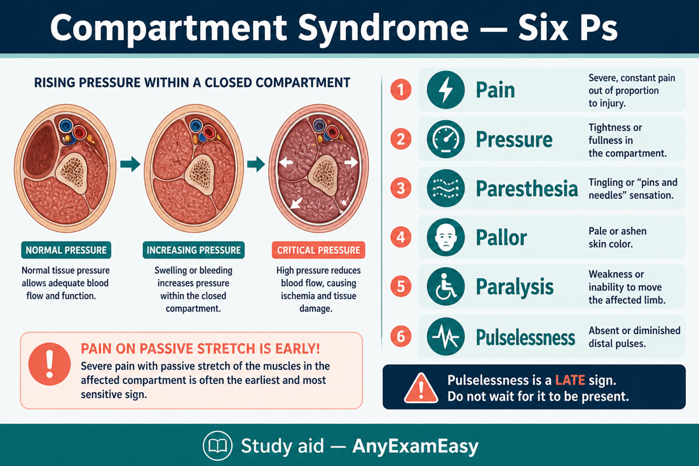
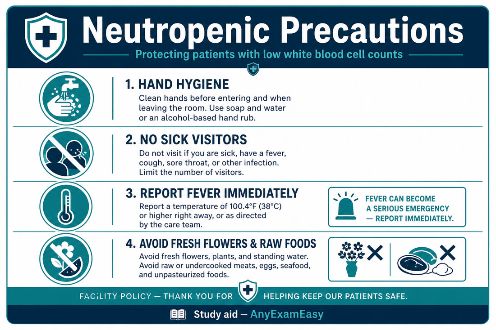
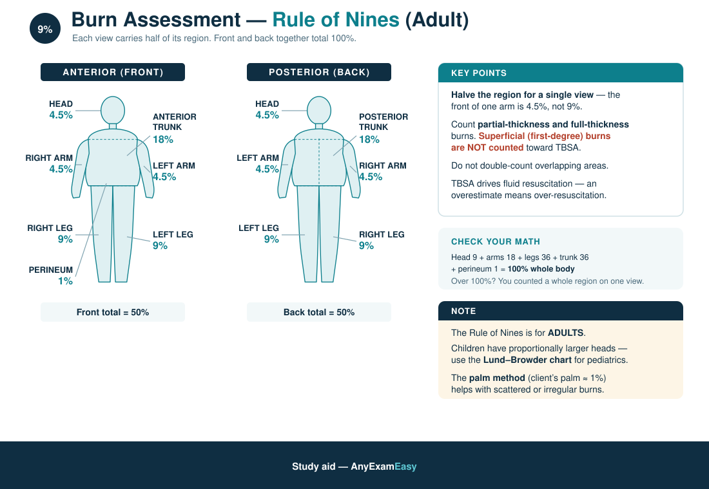

# Chapter 10 — Other Med-Surg (MSK, Immuno/Onc, Integument/Burns, Hematology)

> **Study aid only.** Oncologic emergencies and burn fluid formulas are facility/protocol-driven — verify. Not a procedural manual.

---

## Why it matters on NCLEX

These “other” topics show up as **safety bombs**: compartment syndrome, neutropenia fever, burns ABCs, HIT bleeding/clotting paradox, sickle crisis, DIC, chemo/radiation safety. High yield for priority and SATA.

---

## Topic A — Fractures, compartment syndrome, osteoporosis & hip fracture

### Pathophysiology / concept

Bone break → bleeding, soft-tissue swelling. Casts/edema in closed fascial compartments → rising pressure → ischemia of muscle/nerve (**compartment syndrome**) — time-critical limb threat. Fat embolism risk after long-bone/pelvic fractures (esp. young adults).  
**Osteoporosis:** low bone mass → fragility fractures (hip, spine, wrist). **Hip fracture** in older adults: fall risk, delirium, DVT/pneumonia/skin breakdown post-op.

### Assessment cues

Fracture: pain, deformity, loss of function, crepitus, swelling.  
**Compartment (6 Ps themes):** Pain out of proportion / pain on passive stretch (early), Pressure, Paresthesia, Pallor, Paralysis (late), Pulselessness (**late** — don’t wait for it).  
Fat embolism: respiratory distress, neuro changes, petechiae themes after fracture.  
Hip fracture: shortened externally rotated leg themes; groin/hip pain; can’t bear weight.

### Priority nursing actions

1. Immobilize; neurovascular checks distal to injury **frequently**.  
2. Elevate per orders (but if compartment suspected, elevation may be limited — follow protocol; notify provider **immediately**).  
3. Ice as ordered; pain control; tetanus status.  
4. Open fracture: cover with sterile dressing; antibiotics as ordered.  
5. Traction care: weights hang free; alignment; skin/pin care.  
6. Fat embolism: O₂, support ABCs, notify provider.  
7. Hip fracture: ABCs, pain, immobilize as ordered; post-op: abduction pillow themes per prosthesis type, NV checks, DVT prophylaxis, early PT as ordered, delirium watch, skin care; don’t flex hip acutely beyond ordered limits for some approaches.

### Osteoporosis teaching

Weight-bearing exercise as cleared; calcium/vit D per plan; fall prevention (home hazards, vision, meds); bisphosphonate teaching themes (upright after dose, water, esophageal irritation); smoking/alcohol reduction.

### Client teaching (casts)

Keep dry; don’t stick objects inside; report numbness/color change/increased pain; mobility/weight-bearing as ordered; DVT prevention.

### Safety / red flags

Pain out of proportion after cast/fracture = compartment until proven otherwise. Pulseless is late. Sudden dyspnea after long-bone fracture = fat embolism concern.

### Delegation notes

UAP can report client complaints of numbness; RN performs NV assessment.

### Remember this

Compartment = pain out of proportion + passive stretch pain → call now. Hip fracture = NV + DVT + delirium + positioning rules.

---

## Topic B — Rheumatoid vs osteoarthritis, gout

### Comparison (teaching lens)

| | **Osteoarthritis** | **Rheumatoid arthritis** |
| --- | --- | --- |
| Pattern | Wear-and-tear; weight-bearing joints | Autoimmune; symmetric small joints common |
| Stiffness | Worse with use; brief morning stiffness | Prolonged morning stiffness |
| Systemic | Local | Fatigue, fever themes, extra-articular possible |
| Care themes | Weight loss, exercise, acetaminophen/NSAIDs per orders, joint protection | DMARDs/biologics infection risk, energy conservation, flare planning |

### Gout

Uric acid crystal arthritis — often great toe. Acute: severe pain, swelling, redness. Teaching: meds as ordered (colchicine/NSAIDs/steroids acute; allopurinol chronic themes — don’t start/stop casually during acute flare without orders); hydrate; limit alcohol/purine-heavy patterns as taught; avoid triggering crash diets.

### Remember this

OA = use-related; RA = autoimmune systemic + infection risk on immunosuppressants. Gout = hydrate + med adherence + flare vs prevention teaching.

---

## Topic C — Immuno / oncology, SLE, chemo/radiation safety

### Pathophysiology / concept

Chemo/radiation suppress marrow → **neutropenia** (infection risk), thrombocytopenia (bleed), anemia (fatigue/O₂ carry). Oncologic emergencies: febrile neutropenia, tumor lysis, SVC syndrome, spinal cord compression (high-level recognition).  
**SLE (lupus):** autoimmune multisystem — butterfly rash themes, photosensitivity, arthritis, renal/CNS involvement possible; flares with sun/stress/infection; immunosuppressant infection risk.

### Assessment cues

Fever in neutropenic client = emergency energy even if they “look okay.” Mucositis, cough, dysuria may be muted. ANC low. SLE: new edema/HTN (renal), chest pain, neuro changes — escalate.

### Priority nursing actions

**Neutropenic precautions themes:** private room when indicated; hand hygiene; avoid sick visitors/fresh flowers per policy; no rectal temps; meticulous oral care; cultures + prompt antibiotics for fever as ordered.  
Soft toothbrush; avoid invasive procedures when possible; bleed precautions if platelets low.  
Tumor lysis: hydration, allopurinol/rasburicase themes, monitor K⁺/phos/uric acid/Ca²⁺.

### Chemo / radiation safety for nurses

- Chemo: PPE per policy for mixing/admin/disposal; don’t crush chemo casually; spill kits; pregnant staff often restricted from handling — follow policy.  
- Extravasation: know vesicant protocols — stop infusion, don’t just “flush harder,” follow antidote/protocol.  
- Radiation: time, distance, shielding; cluster care; dosimeter when required; sealed source — tongs/lead container themes; body fluids may have restrictions after some therapies — follow radiation safety officer rules.  
- Skin: don’t wash off markings; gentle skin care; report moist desquamation.

### Skin cancer ABCDE teaching

**A**symmetry, **B**order irregularity, **C**olor variation, **D**iameter (concerning if growing / often taught >6 mm themes), **E**volving — report changing moles; sun protection (SPF, shade, no tanning beds).

### Client teaching

- Report fever immediately (exact threshold per oncology team).  
- Food safety; avoid crowds when counts nadir.  
- Electric razor; avoid contact sports if platelets low.  
- SLE: sunscreen, med adherence, report infection/flare cues, contraception counseling if teratogenic meds.

### Safety / red flags

Febrile neutropenia. Uncontrolled chemo nausea → dehydration. New back pain + leg weakness in cancer client (cord compression). Facial/arm swelling + cancer (SVC).

### Remember this

Fever + neutropenia = urgent antibiotics pathway. Chemo = PPE + extravasation know-how. ABCDE for skin lesions. SLE = sun + infection + organ flare watch.

---

## Topic D — Integument, pressure injuries, wound healing & burns

### Pressure injury staging (review)

- **Stage 1:** non-blanchable erythema, intact skin.  
- **Stage 2:** partial-thickness loss with exposed viable pink/red dermis; intact or ruptured serum-filled blister. Does **not** include skin tears, burns, abrasions, or moisture-associated skin damage.  
- **Stage 3:** full-thickness skin loss; fat may show; no exposed bone/tendon/muscle.  
- **Stage 4:** exposed bone/tendon/muscle.  
- **Unstageable:** base obscured by eschar/slough.  
- **DTPI:** deep maroon/purple discoloration themes.  
Never reverse-stage (“Stage 4 healing” not “Stage 2”). Turn q2h themes; offload heels; nutrition (protein/calories); moisture management; support surfaces.

### Wound healing factors

Favor: perfusion, nutrition, glycemic control, moist wound healing as ordered, clean technique. Impair: smoking, steroids, infection, ischemia, malnutrition, edema, radiation.

### Burns — pathophysiology / concept

Burns destroy skin barrier → fluid loss, infection, heat loss. Depth: superficial → partial → full thickness. Rule of nines themes for TBSA adult. Capillary leak early → hypovolemia; then fluid remobilization later.

### Assessment cues (burns)

Airway: facial burns, singed nasal hair, hoarseness, carbonaceous sputum → **inhalation injury**. Circumferential chest burns → ventilation restriction. Pain severe in partial thickness; full thickness may be insensate.

### Priority nursing actions (burns)

1. **Airway** first — early intubation themes if inhalation suspected.  
2. Stop burning process; remove constricting jewelry/clothing if not stuck.  
3. Fluid resuscitation per protocol (Parkland-style concepts — large burns need aggressive LR themes as ordered).  
4. Warm environment; sterile/clean dressing per protocol; tetanus.  
5. Pain control; monitor UOP as resuscitation endpoint theme (~0.5 mL/kg/hr adults commonly cited — confirm orders).  
6. Infection prevention; nutrition (hypermetabolic).  
7. Circumferential limb: watch compartment; escharotomy as provider procedure.

### Client teaching / rehab themes

Positioning to prevent contractures; PT/OT; sun protection of healed skin; psychosocial support.

### Safety / red flags

Hoarse voice after smoke exposure. Drooling/stridor. Circumferential torso burn with rising ventilatory pressures.

### Remember this

Burns: airway > fluids > infection/pain/contractures. Pressure injuries: stage accurately, offload, nutrition. Don’t reverse-stage.

---

## Topic E — Hematology: anemia, sickle cell, HIT, DIC

### Anemia concept

↓ RBC/Hgb → fatigue, pallor, dyspnea on exertion, tachycardia. Causes: blood loss, hemolysis, production failure (iron/B12/folate, marrow).

### Sickle cell crisis priorities

Vaso-occlusive pain crises, infection risk (functional asplenia themes), acute chest syndrome (chest pain, fever, hypoxia — emergency energy), stroke risk.  
**Priorities:** fluids, opioids (believe the pain), O₂ if hypoxic, treat infection triggers, incentive spirometry themes, warm environment, hydroxyurea teaching themes as ordered; avoid high altitude/dehydration extremes as taught.

### HIT (heparin-induced thrombocytopenia) high-level

Immune reaction to heparin → **platelet drop** with **paradoxical thrombosis** risk. Stop all heparin (including flushes) as ordered; use alternative anticoagulation per protocol; avoid platelet transfusions routinely in HIT (can worsen thrombosis — follow specialist orders). Timing often 5–10 days after heparin, or sooner if re-exposed.

### DIC overview

Widespread clotting → consumption of platelets/factors → **bleeding + clotting together**. Triggers: sepsis, trauma, abruptio, malignancy. Cues: oozing from sites, petechiae, ↑ PT/PTT themes, ↓ platelets/fibrinogen, ↑ D-dimer themes.  
**Nurse:** treat cause; support ABCs; blood products as ordered; avoid unnecessary sticks; gentle care — don’t invent heparin vs antifibrinolytic battles without orders.

### Priority actions (anemia)

O₂ if hypoxic; transfusion as ordered; conserve energy; treat cause.

### Remember this

HIT = stop heparin, watch clots. Sickle = hydration + pain + O₂ + infection vigilance + acute chest. DIC = bleed + clot; treat cause. Anemia = cause + symptoms + transfusion per orders.

---

## HIV opportunistic infection themes (not encyclopedia)

Focus on **immunity down → opportunistic risk up**: pneumonia themes (including PCP when CD4 low — know “report fever/dyspnea early”), oral thrush, TB exposure caution, live vaccine caution when immunocompromised. ART adherence prevents resistance; standard precautions (not isolation solely for HIV status). Teach: safer sex, no sharing needles, infection reporting, medication timing.

### Remember this

HIV nursing = adherence + infection vigilance + dignity + standard precautions; CD4/viral load trends matter.

---

---

## Clinical judgment vignettes — immune, MSK, sensory, integument

### Vignette A — Compartment syndrome

**Stem:** Casted tibia; pain out of proportion, pain on passive stretch, paresthesia.

**First:** Notify provider NOW — loosen dressings per protocol, keep limb at heart level themes — don’t elevate high or ice blindly if it worsens arterial flow; fasciotomy pathway.

### Vignette B — Neutropenic fever

**Stem:** ANC 400; T 38.5°C; “feels fine.”

**First:** Cultures + prompt Abx pathway; protective precautions — don’t wait for “looks sick.”

### Vignette C — Burn fluid & airway

**Stem:** Facial burns, singed nasal hairs, hoarse voice.

**First:** Airway — early intubation themes before swelling closes airway; then fluid resuscitation per Parkland-style orders, rule of nines estimate, hypothermia prevention, infection control.

### Immune / oncology hooks

- Radiation skin care; chemo nadir timing; mucositis; tumor lysis (K⁺/phos/uric acid) monitoring.  
- Anaphylaxis to chemo/abx: epi IM, airway.  
- Graft-vs-host themes high-level post-transplant.

### MSK / cast / traction

- Neurovascular 6 Ps: pain, pressure, paralysis, paresthesia, pallor, pulselessness.  
- Fat embolism after long-bone fracture: petechiae, dyspnea, confusion.  
- Osteomyelitis: fever + bone pain; long Abx.  
- Amputation: phantom pain real; hemorrhage watch; contracture prevention (prone themes for AKA).

### Sensory

- Cataract post-op: no ↑IOP (no bending/lifting/straining); shield.  
- Glaucoma: sudden pain/halos = angle-closure emergency.  
- Retinal detachment: curtain/floaters — urgent.  
- Meniere: safety with vertigo; fall risk.  
- Hearing aid care; speak facing client.

### Integument / burns / wounds

- Staging pressure injuries; never massage a reddened bony prominence.  
- Stevens-Johnson / TEN: stop offending drug; airway/fluid/skin like burn care themes.  
- Cellulitis vs abscess; MRSA contact precautions as indicated.

### Extra concept checks

**Q7.** Pain out of proportion after cast — priority?  
A. Extra blanket  
B. Notify provider for compartment evaluation now  
C. Ambulate to increase circulation only  
D. Ignore if pulses still present (pulselessness is late)  

**Answer: B.** Pulselessness is late — act on pain/stretch pain early.

### Medication highlights — other med-surg

| Theme | Hook |
| --- | --- |
| Allopurinol / colchicine | Gout; hydration; interactions |
| Bisphosphonates | Sit upright after PO; jaw osteonecrosis rare teaching |
| Methotrexate | Folate; infection; liver; pregnancy avoid |
| Biologics / immunosuppressants | Infection risk; TB screen themes |
| Eyedrops | Punctal occlusion; wait between drops |
| Silver sulfadiazine / burn topicals | Allergy/sulfa; wound assessment |

## Concept check

**Q1.** Casted tibia client reports severe pain unrelieved by opioids and pain on passive toe motion. Best action?  
A. Tell them to relax  
B. Notify provider immediately for possible compartment syndrome  
C. Elevate extremely high and wait 8 hours  
D. Remove cast yourself without help  

**Q2.** Neutropenic chemo client has T 38.4°C (101.1°F). Priority theme?  
A. Wait until next clinic visit next week  
B. Urgent evaluation, cultures, prompt antibiotics as ordered  
C. Fresh flower bouquet therapy first  
D. Rectal temperature q1h  

**Q3.** Platelets halved after a week of heparin and a new DVT appears. Nurse anticipates:  
A. Increase heparin dose casually  
B. Stop heparin products and switch anticoagulation per protocol (HIT concern)  
C. Give IM injections freely  
D. Ignore platelet trend  

**Q4.** Older adult with shortened externally rotated leg after a fall. Priority cluster?  
A. Force them to walk to “test” the hip  
B. Immobilize as ordered, pain control, NV checks, prepare for surgical pathway, watch for delirium/DVT risk  
C. Apply heating pad under knee and discharge  
D. Only document and leave  

**Q5.** Client teaching that best matches rheumatoid arthritis on biologics?  
A. Skip infection precautions — joints only  
B. Report fever early; infection risk from immunosuppression; energy conservation  
C. Hold all vaccines forever without asking  
D. Double DMARD doses during flares without orders  

**Q6.** Sickle cell client with chest pain, fever, and SpO₂ 88%. Priority theme?  
A. Assume anxiety and encourage shopping  
B. Treat as possible acute chest — O₂, notify provider, support ABCs, follow crisis protocols  
C. Restrict all fluids  
D. Give ice baths to “shrink” sickled cells  

#### Answers

**Q1: B.** Classic compartment cues — escalate now.  
**Q2: B.** Febrile neutropenia urgency.  
**Q3: B.** HIT pattern — stop heparin, alternative plan.  
**Q4: B.** Hip fracture priorities — immobilize, pain, NV, complications.  
**Q5: B.** RA biologics = infection vigilance + pacing.  
**Q6: B.** Acute chest syndrome pattern — emergency energy.

---

## Chapter Remember this

- Compartment: pain ≫ expected; passive stretch pain; pulseless late.  
- Osteoporosis/hip fx: falls, NV, DVT, delirium, positioning.  
- OA vs RA vs gout — pattern + teaching.  
- Neutropenia + fever = emergency pathway; chemo/radiation PPE.  
- Pressure injury staging; wound healing factors; ABCDE skin.  
- Burns: airway (inhalation) then fluids.  
- HIT / DIC / sickle / HIV — safety patterns over trivia.
