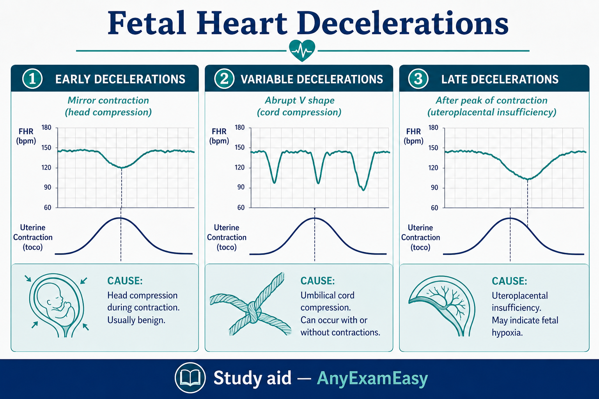
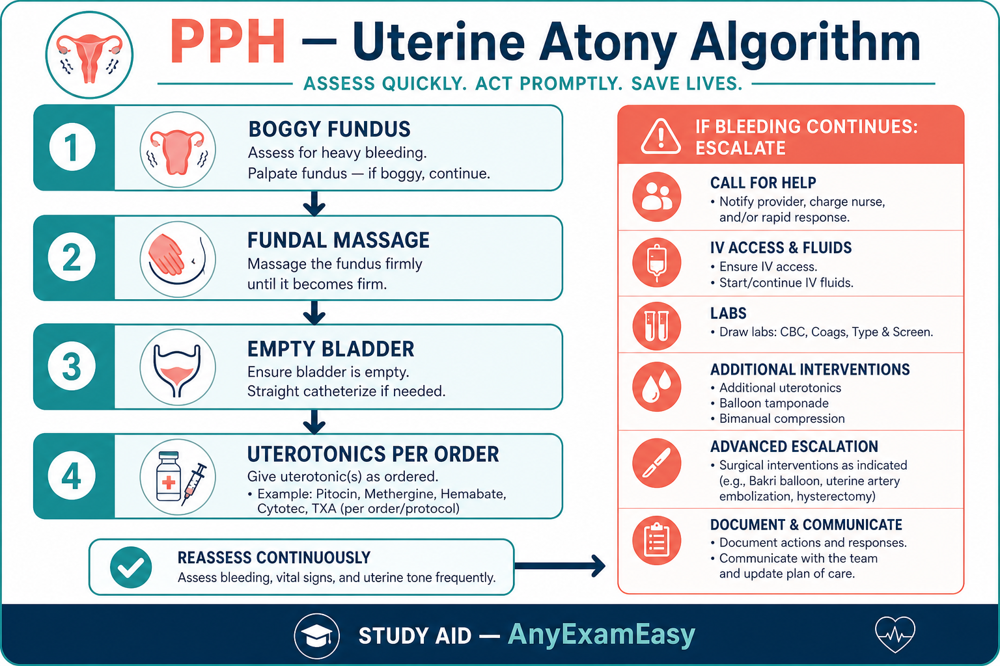
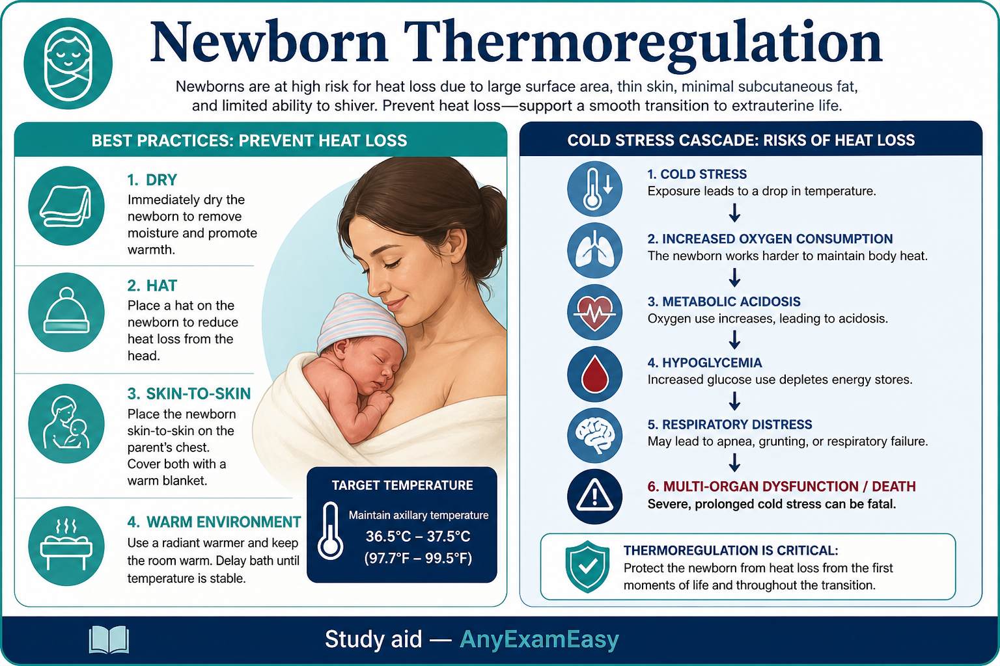

# Chapter 11 — Maternity & Newborn

> **Study aid only.** Obstetric emergencies follow facility/ACOG-aligned protocols — verify. Not a substitute for obstetric clinical training. Medication use in pregnancy must be confirmed with current references.

---

## Why it matters on NCLEX

Maternity items reward **pattern recognition under time pressure**: late decelerations, boggy fundus, magnesium toxicity, newborn thermoregulation. One correct priority action saves mother and baby in the stem — and in real life.

---

## Topic A — Antepartum essentials

### Pathophysiology / concept

Pregnancy is a high-flow, high-volume state. Screening catches preeclampsia, GDM, anemia, infections. Placenta previa (painless bleeding, placenta over os) vs abruption (painful bleeding, board-like uterus) are classic contrasts.

### Assessment cues — prenatal danger signs (teach these)

- Vaginal bleeding  
- Severe headache, visual changes, epigastric pain (preeclampsia)  
- Decreased fetal movement  
- Signs of preterm labor (regular contractions, pelvic pressure, fluid leak)  
- Dysuria / fever  
- Sudden swelling of face/hands  

### Priority nursing actions

- Accurate BP, urine protein themes, weight trends.  
- Rh-negative clients: Rho(D) immune globulin timing concepts (28 weeks / after sensitizing events / postpartum if baby Rh+).  
- GDM teaching: glucose monitoring, diet, insulin if ordered.  
- Bleeding: assess amount, pain, VS; NPO; IV access; no vaginal exams in suspected previa until localization known.

### Remember this

Painless bleeding → think previa (don’t do vaginal exam). Painful rigid uterus → abruption energy.

---

## Topic B — Labor & fetal monitoring

### Stages (nursing priorities)

| Stage | What’s happening | Nurse focus |
| --- | --- | --- |
| 1 | Dilation | Comfort, hydration, monitor fetus/contractions, progress |
| 2 | Pushing → birth | Coach pushing, prepare for delivery, perineal support themes |
| 3 | Placenta | Watch separation signs, oxytocin as ordered, blood loss |
| 4 | Recovery (1–2 h) | Fundus, lochia, VS, bonding, hemorrhage vigilance |

### Fetal heart patterns

- **Accelerations:** generally reassuring.  
- **Early decelerations:** head compression — often benign mirror of contraction.  
- **Variable decelerations:** cord compression — reposition, amnioinfusion as ordered.  
- **Late decelerations:** uteroplacental insufficiency — **intervene**: left lateral, O₂ per protocol, stop oxytocin per protocol, IV bolus as ordered, notify provider.

### Priority actions for nonreassuring patterns

Intrauterine resuscitation bundle themes above; prepare for expedited delivery if unresolved.

### Meds

- Oxytocin: titration for labor; watch tachysystole and late decels.  
- Epidural: prehydrate as ordered; watch hypotension; bladder.  

### Remember this

Late decels → act, don’t just document. Stop Pitocin per protocol when fetus is in trouble.

---

## Topic C — Postpartum hemorrhage (PPH)

### Pathophysiology / concept

Tone (atony — most common), Trauma (lacerations), Tissue (retained placenta), Thrombin (coagulopathy). Atony = boggy fundus.

### Assessment cues

Saturating pads rapidly, boggy uterus, clots, hypotension/tachycardia, anxiety; may underestimate with slow steady loss — **quantify**.

### Priority nursing actions

1. Call for help / stay with client.  
2. **Fundal massage** for boggy fundus.  
3. Express clots; empty bladder (catheter if needed).  
4. Oxytocin and other uterotonics as ordered (misoprostol, methylergonovine — caution HTN, carboprost — caution asthma).  
5. IV access/fluids/blood products; O₂; trendelenburg caution/per protocol.  
6. Prepare for OR if refractory.

### Remember this

Boggy fundus → massage. Know uterotonic contraindications at a high level.

---

## Topic D — Preeclampsia / eclampsia / HELLP

### Pathophysiology / concept

Hypertensive disorder of pregnancy with proteinuria/end-organ themes after 20 weeks. Severe features: high BP, thrombocytopenia, LFTs, creatinine, pulmonary edema, visual/neuro symptoms. Eclampsia = seizures. HELLP = hemolysis, elevated liver enzymes, low platelets.

### Assessment cues

Headache, visual changes, RUQ/epigastric pain, hyperreflexia/clonus, edema, ↓ UOP, fetal growth concerns.

### Priority nursing actions

- Quiet room; seizure precautions; bed rest themes as ordered.  
- **Magnesium sulfate** as ordered for seizure prophylaxis: monitor RR, DTRs, UOP, Mag levels; calcium gluconate antidote available.  
- Antihypertensives as ordered.  
- Delivery is definitive cure themes — timing per OB.  
- Postpartum still at risk — continue vigilance.

### Mag toxicity cues

Loss of reflexes, ↓ RR, ↓ UOP, flushing extreme, cardiac issues — stop Mag, give calcium gluconate per protocol, support airway.

### Remember this

Mag: reflexes, respirations, urine output. Antidote = calcium gluconate. Headache/visual changes = take seriously.

---

## Topic E — Newborn care

### Priority concepts

1. **Airway** — clear secretions as needed; skin-to-skin when stable.  
2. **Thermoregulation** — dry, hat, warmer; cold stress → hypoxia/hypoglycemia cascade.  
3. APGAR at 1 and 5 minutes themes (appearance, pulse, grimace, activity, respirations).  
4. ID bands; security.  
5. Vitamin K, eye prophylaxis as ordered.  
6. Hypoglycemia risk: IDM, LGA/SGA, preterm, cold stressed — feed/protocols.  
7. Jaundice: physiologic after 24h vs pathologic earlier; phototherapy eye mask/hydration.  
8. Newborn screening / hearing / CHD pulse ox themes as applicable.

### Assessment red flags

Grunting, flaring, retractions; central cyanosis; temp instability; lethargy; sugar low; bilious vomiting; ambiguous genitalia with crisis risk (CAH themes high-level).

### Teaching

Back to sleep; car seat rear-facing; feeding cues; cord care; when to call (fever, poor feeding, jaundice spreading).

### Remember this

Airway + warm + sugar. Pathologic jaundice early is concerning. Back to sleep.

---

---

## Topic F — Preterm labor & PROM

### Concept

Contractions + cervical change before 37 weeks. PROM = membrane rupture before labor; PPROM if preterm. Infection (chorio) and cord prolapse risks.

### Priority actions

- Lateral position; tocolytics as ordered; antenatal corticosteroids for fetal lungs if indicated.  
- Mag for neuroprotection in early preterm as ordered (different goal than preeclampsia dosing — follow OB orders).  
- PROM: note time/color/odor of fluid; avoid unnecessary digital exams; monitor fetal tachy/maternal fever.  
- Cord prolapse: knee-chest or Trendelenburg, lift presenting part off cord with gloved hand, O₂, emergency delivery prep — **do not** push cord back.

### Remember this

Cord prolapse = relieve pressure, call for help, to OR. Steroids for fetal lung maturity when indicated.

---

## Topic G — Mastitis, endometritis, postpartum mood

### Mastitis

Unilateral red painful breast + fever; continue breastfeeding/pumping as advised; antibiotics; hydration.

### Endometritis

Postpartum uterine infection: fever, foul lochia, uterine tenderness — antibiotics, Fowler’s, fluids.

### Mood

Baby blues (early, mild, self-limited) vs postpartum depression (persistent, impaired function) vs postpartum psychosis (emergency — safety of mother/infant). Screen and escalate.

### Remember this

Fever + uterine tenderness after birth ≠ ignore. Psychosis = safety first.

## Concept check

**Q1.** Late decelerations appear with oxytocin running. Best cluster?  
A. Increase oxytocin and leave  
B. Stop oxytocin per protocol, reposition (left lateral), O₂ as ordered, notify provider  
C. Start pushing immediately regardless of dilation  
D. Ignore — lates are always early decels  

**Q2.** Boggy fundus and heavy lochia 1 hour after birth. First action?  
A. Fundal massage and call for help  
B. Ambulate to shower  
C. Give ice chips only  
D. Document without intervening  

**Q3.** Client on mag sulfate has RR 10 and absent DTRs. Priority?  
A. Continue infusion unchanged  
B. Stop mag, support airway/breathing, give calcium gluconate per protocol, notify provider  
C. Give additional sedative  
D. Encourage ambulation  

#### Answers

**Q1: B.** Intrauterine resuscitation + stop oxytocin.  
**Q2: A.** Atony — massage and escalate.  
**Q3: B.** Mag toxicity pathway.

---

## Chapter Remember this

- Danger signs in pregnancy — teach and act.  
- Late decels → intervene; stop Pitocin per protocol.  
- Boggy fundus → massage.  
- Mag: RR, reflexes, UOP; antidote calcium gluconate.  
- Newborn: airway, thermoregulation, glucose, jaundice timing.
