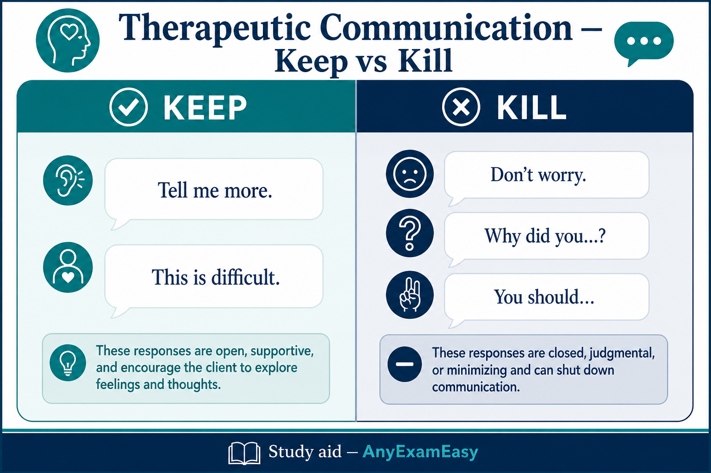

# Chapter 13 — Psychosocial Integrity

> **Study aid only.** Crisis and suicide protocols follow facility and local law. Duty-to-warn and reporting rules vary by jurisdiction — know concepts and verify locally. Not psychotherapy.

---

## Why it matters on NCLEX

Psych items are less about DSM trivia and more about **safety, therapeutic communication, and legal/ethical boundaries**. Alcohol/benzo withdrawal can kill — treat them as medical as well as psychiatric. Med toxicity (lithium, MAOIs, serotonin syndrome, NMS) is classic priority material.

---

## Topic A — Therapeutic communication

### Concept

Goal: help client express feelings, clarify, and participate in care. Presence > clever advice.

### Keep / kill phrases

**Keep:** “Tell me more.” “This sounds difficult.” “What concerns you most?” silence, reflection, clarification, open-ended questions.  
**Kill:** “Don’t worry.” “Why did you…” “You should…” “Everyone feels that way.” changing subject, false reassurance, probing curiosity, judgment.

### Priority nursing actions

- Private setting when possible.  
- Cultural humility; qualified interpreters.  
- Match acuity: if client is psychotic and unsafe, safety first, then communication.

### Remember this

Empathetic + reality-based + client-centered. Avoid “why” and false reassurance.

---

## Topic B — Suicide risk

### Concept

Ask directly about ideation, plan, means, intent, history. Asking does not “plant” the idea. Highest risk periods include after starting antidepressants (energy returns before mood — conceptual teaching) and after sudden “improvement” with resolved planning.

### Assessment cues

Talk of being a burden, giving away possessions, goodbye messages, accessing means, severe hopelessness, command hallucinations to harm self.

### Priority nursing actions

1. Ensure immediate safety — remove means; 1:1 observation when indicated.  
2. Ask directly; do not leave high-risk client alone.  
3. Contract for safety is **not** a substitute for observation when high risk.  
4. Collaborate on safety plan; involve team; follow involuntary hold laws as applicable conceptually.  
5. Document quotes and actions factually.

### Remember this

Direct questions + means restriction + observation level matches risk.

---

## Topic C — Schizophrenia

### Concept

Positive symptoms (hallucinations, delusions, disorganized speech) vs negative (flat affect, avolition). Reality testing impaired. Antipsychotics: EPS, NMS, metabolic syndrome with atypicals.

### Priority nursing actions

- Safety from command hallucinations (content assessment).  
- Calm, short, concrete communication; don’t argue delusions — acknowledge feelings, present reality gently.  
- Med adherence support; monitor EPS (dystonia, akathisia, TD).  
- NMS red flags: rigidity, high fever, autonomic instability — emergency.

### Remember this

Don’t argue delusions. Assess hallucination commands for safety. NMS = emergency.

---

## Topic D — Bipolar disorder & mania milieu safety

### Concept

Mania: elevated/irritable mood, decreased sleep need, grandiosity, pressured speech, risky behavior, poor intake. Depression poles as MDD. Lithium common mood stabilizer; anticonvulsant mood stabilizers also used.

### Priority nursing actions

- Mania: reduce stimulation, private room near nurses’ station themes, high-calorie finger foods, sleep promotion, set firm consistent limits on unsafe behavior, redirect rather than argue, remove hazardous items, supervised activities.  
- Protect other clients from intrusive/aggressive behavior — milieu safety.  
- Lithium: monitor levels; toxicity cues (see meds section); hydration/Na⁺ consistency; teratogenicity awareness.

### Remember this

Mania = stimulation down + nutrition + sleep + limits + milieu safety. Lithium toxicity is serious.

---

## Topic E — Depression, anxiety & PTSD / trauma-informed care

### Depression

SIG-E-CAPS themes; priority = suicide risk + ADLs + med teaching (SSRIs: time to effect, serotonin syndrome awareness with interactions, sexual SE). Don’t stop abruptly.

### Anxiety / panic

Stay with client during panic; short sentences; breathing coaching; quiet environment. Benzos: sedation, dependence, withdrawal risk. Buspirone slower onset themes.

### PTSD / trauma-informed basics

Intrusions (flashbacks/nightmares), avoidance, negative mood/cognition, hyperarousal. Triggers can be sensory.  
**Trauma-informed nursing:** safety, trust, choice, collaboration, empowerment; ask permission before touch; avoid re-traumatizing restraint when alternatives exist; grounded presence during flashbacks (“You are safe here; you are in the hospital”). Refer to therapy modalities as ordered (exposure, EMDR themes — know they exist, don’t practice them solo).

### Remember this

Panic: stay with them. Depression: always screen suicide. PTSD: safety + choice + don’t force storytelling. SSRI + MAOI / certain combos = serotonin syndrome risk.

---

## Topic F — Personality disorders (boundaries)

### Borderline personality themes

Intense relationships, fear of abandonment, impulsivity, self-harm risk, **splitting** (staff as all-good/all-bad).  
**Nurse:** consistent limits across shifts; team communication so splitting fails; validate feelings without reinforcing unsafe behavior; safety contracts + observation for self-harm; avoid over-involvement or punitive coldness.

### Antisocial personality themes

Disregard for rights of others, deceit, lack of remorse themes.  
**Nurse:** firm limits; safety of staff/peers; don’t moralize endlessly; document objectively; don’t bargain privileges around intimidation.

### Remember this

Consistency + boundaries + safety. Don’t take splitting personally — communicate as a team.

---

## Topic G — Substance: alcohol CIWA, opioids/naloxone, stimulants

### Alcohol / sedative-hypnotic withdrawal

Can cause seizures, DTs (autonomic hyperactivity, hallucinations, confusion) — **medically dangerous**. **CIWA**-guided benzodiazepines as ordered (score drives dosing themes); thiamine before glucose themes in alcoholics; seizure precautions; quiet safe environment; fall risk; fluids/electrolytes; aspiration precautions if vomiting.

### Opioid withdrawal vs overdose

**Withdrawal:** miserable (myalgias, diarrhea, yawning, piloerection) — usually not directly lethal like alcohol/benzo withdrawal — support hydration and MAT protocols (buprenorphine/methadone themes as ordered).  
**Overdose:** pinpoint pupils, respiratory depression, unresponsiveness — **naloxone** as ordered/protocol; support airway/breathing; may need repeat doses (naloxone may wear off before opioid); stay with client; watch for withdrawal precipitation after naloxone.

### Stimulant intoxication/crash

Cardiac/psych agitation; crash depression/suicide risk.

### Remember this

Alcohol/benzo withdrawal can kill — CIWA + benzos + thiamine concepts. Opioid OD = naloxone + airway. Don’t confuse withdrawal misery with OD apnea.

---

## Topic H — High-yield psych meds: lithium, MAOI, serotonin syndrome vs NMS

### Lithium toxicity cues

Early: nausea, vomiting, diarrhea, fine tremor worsening, polyuria/polydipsia themes. Progressing: coarse tremor, ataxia, confusion, seizures.  
**Actions:** hold lithium, notify provider, levels/labs as ordered; hydrate; teach steady salt/fluid intake (sudden low Na⁺/dehydration raises toxicity risk); NSAID/diuretic interaction awareness themes; avoid dehydration in heat/illness.

### MAOI diet / tyramine

MAOIs + **tyramine-rich foods** (aged cheeses, cured meats, fermented soy, draft beer themes — follow current diet list) → hypertensive crisis. Teach diet + all med interactions (cold meds, SSRIs — washout periods). Headache + severe HTN = emergency energy.

### Serotonin syndrome vs NMS

| | **Serotonin syndrome** | **NMS** |
| --- | --- | --- |
| Trigger vibe | Serotonergic stacking (SSRI+MAOI, etc.) | Antipsychotics (dopamine block) |
| Onset | Often faster (hours) | Often slower (days) |
| Neuromuscular | Hyperreflexia, clonus, myoclonus | **Lead-pipe rigidity**, bradyreflexia |
| Autonomic | Diaphoresis, tachy, unstable VS | Fever, tachy, labile BP |
| Nurse | Stop offending agents, support ABCs, notify — cooling/benzos/cyproheptadine themes as ordered | Stop antipsychotic, ABCs, cooling, ICU — dantrolene/bromocriptine themes as ordered |

### Remember this

Lithium: levels + hydration + salt consistency. MAOI: tyramine diet. Clonus → think serotonin; lead-pipe rigidity → think NMS.

---

## Topic I — ECT nursing care

### Concept

Electroconvulsive therapy for severe depression / catatonia / some mania — brief controlled seizure under anesthesia. Informed consent; NPO; hold certain meds (e.g., anticonvulsants) per orders; remove dentures; void.

### Post-ECT priorities

Airway/VS; reorient (temporary confusion/memory gaps common); fall risk; assess return of gag before PO; document seizure length per protocol; offer reassurance that memory issues often improve.

### Remember this

ECT = consent + NPO + post-op style airway/reorientation — not “barbaric punishment.”

---

## Topic J — Restraints, seclusion & least-restrictive

Least restrictive first: verbal de-escalation → offer PRN → quiet room → seclusion → physical restraint as last resort when imminent harm. Time-limited orders; face-to-face provider evaluation per rules; continuous or frequent monitoring; offer food/toileting/ROM; never as punishment or for staffing convenience; debrief after. Chemical restraint ethics apply. Document behaviors that justified escalation.

### Remember this

Least-restrictive ladder + time limits + monitoring + dignity. Same principle as medical restraints — plus trauma sensitivity.

---

## Topic K — Abuse / IPV screening & safety planning

### Concept

Intimate partner violence, child/elder abuse. Interview **privately**. Nonjudgmental. Provide resources. **Report** per law for mandated categories (children/elders/vulnerable adults). For competent adult IPV, reporting rules vary — safety planning + resources still core; know your jurisdiction.

### IPV screening & safety planning (high-yield)

- Screen when alone; normalize (“We ask everyone”).  
- If disclosure: believe, validate, assess immediate danger, weapons in home, strangulation history (high danger).  
- Safety plan themes: packed bag, code word with trusted person, documents/keys/meds ready, shelter/hotline numbers, exit strategies — client sets pace (leaving can increase short-term danger).  
- Do not confront abuser or hand materials that increase risk if partner searches belongings — follow advocacy best practices.  
- Photograph injuries per policy/consent; treat injuries; document objectively (quotes, body map).

### Priority actions

- Separate from suspected abuser for interview.  
- Report mandated cases; document objectively.  
- Safety plan; shelters/hotlines.

### Remember this

Private interview. Mandated reporting for kids/elders/vulnerable. Adult IPV: safety planning over lectures. Safety over secrecy.

---

## Topic L — Eating disorders (NCLEX lens)

Anorexia: restriction, low weight, bradycardia, refeeding syndrome risk when nutrition restarts (monitor phos/K⁺/Mg²⁺). Bulimia: binge-purge, enamel erosion, parotid swelling, electrolyte swings from vomiting/laxatives.  
**Priorities:** medical stabilization first; supervised meals as ordered; therapeutic alliance; cardiac monitoring when indicated.

### Remember this

Refeeding can be medically dangerous — electrolytes. Eating disorders are medical + psych.

---

## Concept check

**Q1.** Best response to “I’m such a failure”?  
A. “Don’t worry, you’ll be fine.”  
B. “Why do you always think that?”  
C. “This feels overwhelming. Tell me more about what’s been hardest.”  
D. “You should just stay positive.”  

**Q2.** Client with alcohol use disorder 48h after last drink is tremulous, tachycardic, confused. Priority theme?  
A. Ignore — only opioids withdraw dangerously  
B. Medical withdrawal protocol (benzodiazepines as ordered), safety, thiamine concepts, notify provider  
C. Group therapy as the only intervention  
D. Immediate discharge  

**Q3.** Client reports clear plan and means for suicide. First nursing priority?  
A. Leave to finish charting  
B. Ensure continuous observation / means restriction and initiate facility suicide precautions  
C. Promise total confidentiality even if they leave to die  
D. Joke to lighten mood  

**Q4.** Client on fluoxetine started tramadol and an MAOI by error presents with hyperreflexia, clonus, agitation, and fever. Suspect?  
A. NMS only — ignore serotonergic meds  
B. Possible serotonin syndrome — hold serotonergic agents, support ABCs, notify provider  
C. Simple caffeine overdose — discharge  
D. Lithium toxicity without lithium history  

**Q5.** Manic client is intrusive, not sleeping, and trying to leave AMA to “buy a jet.” Best milieu approach?  
A. Debate politics for hours  
B. Reduce stimulation, offer finger foods, set consistent limits, supervise safety  
C. Open visiting for a dance party  
D. Seclude immediately without trying least-restrictive options  

**Q6.** Partner insists on staying for all teaching. Client gives a scared look when asked about safety at home. Best action?  
A. Ignore — family is always helpful  
B. Find private time to screen for IPV and offer resources/safety planning  
C. Hand IPV pamphlets to the partner to “help”  
D. Confront the partner in the hallway  

#### Answers

**Q1: C.** Empathy + open exploration.  
**Q2: B.** Alcohol withdrawal can be life-threatening.  
**Q3: B.** Safety and precautions first.  
**Q4: B.** Hyperreflexia/clonus + serotonergic stack = serotonin syndrome pattern.  
**Q5: B.** Mania milieu = low stim, nutrition, limits, safety.  
**Q6: B.** Private IPV screen; don’t tip off abuser.

---

## Chapter Remember this

- Therapeutic: open, reflecting; kill false reassurance and “why.”  
- Suicide: ask directly; match observation to risk.  
- Psychosis: safety + don’t argue delusions; watch NMS/EPS.  
- Mania/lithium: stimulation down; toxicity cues; milieu safety.  
- Personality disorders: boundaries + consistency.  
- Alcohol/benzo withdrawal = medical emergency potential; CIWA.  
- Opioid OD: naloxone + airway; MAOI diet; serotonin vs NMS table.  
- ECT: consent, NPO, reorient.  
- Restraints: least restrictive.  
- Abuse/IPV: private interview + mandated reporting + safety plan.  
- PTSD: trauma-informed safety and choice.
