---
# PASTE INTO CURSOR
# Drop this file into your AnyExamEasy repo (or paste into a new .md), and keep the `visuals/` folder beside it.
# Brand tokens match anyexameasy.com — use with the NCLEX Study Tool or a branded MDX/page render.

title: "AnyExamEasy NCLEX Reference Book"
subtitle: "Pass-Focused Clinical Judgment Companion · 2026 Next Gen NCLEX"
brand: AnyExamEasy
site: https://anyexameasy.com
cta: "Try NCLEX practice free"
cta_url: https://anyexameasy.com
pricing: "$27.99/mo after trial; trial terms on site"
logo: visuals/nclex-book-cover.png
logo_nav: "Use study-tool public/brand/anyexameasy-logo-nav.webp when in the web app"
colors:
  accent: "#0D9488"
  accent_hover: "#0F766E"
  accent_cyan: "#00E5D8"
  cta_text_on_teal: "#071A2C"
  ink: "#0F172A"
  ink_muted: "#475569"
  bg: "#FFFFFF"
  surface: "#F8FAFC"
  hero_start: "#0A2540"
  hero_mid: "#071A2C"
  hero_end: "#04101C"
typography: "Inter / system sans (no serif)"
radius: "pill CTAs; cards 12–16px; panels 20–24px"
disclaimer: "Study aid only. Not medical advice. Independent of NCSBN."
---

<!-- ========== BRANDED PUBLIC BOOK (paste-ready) ========== -->

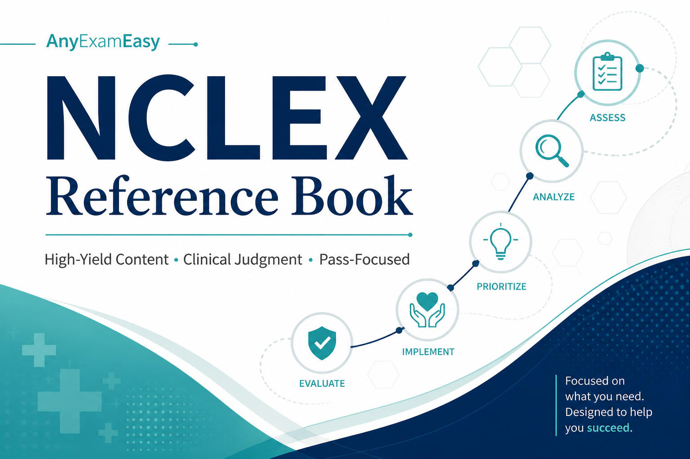

# AnyExamEasy NCLEX Reference Book

**Pass-Focused Clinical Judgment Companion for the 2026 Next Gen NCLEX**

[anyexameasy.com](https://anyexameasy.com) · One study system. Six boards.

[**Try NCLEX practice free →**](https://anyexameasy.com)

*No card required to start · $27.99/mo after trial · trial terms on site*

> **Study aid only.** This book is for exam preparation. It is **not** medical advice, clinical protocol, or a substitute for your nursing program, facility policy, or the official NCSBN test plan. Always verify critical details with current official sources. AnyExamEasy is **independent** and not affiliated with NCSBN, Pearson VUE, or other exam owners. We do not guarantee exam results or licensure.

---

## Brand (for designers / Cursor implementers)

| Token | Value |
| --- | --- |
| Accent teal | `#0D9488` |
| Teal hover | `#0F766E` |
| Cyan accent | `#00E5D8` |
| CTA text on teal | `#071A2C` |
| Ink | `#0F172A` |
| Muted ink | `#475569` |
| Page bg | `#FFFFFF` / `#F8FAFC` |
| Hero navy | `#0A2540` → `#071A2C` → `#04101C` |
| Type | Inter / system sans |
| CTA shape | Pill (`rounded-full`), bold |

**Product pairing:** Book = foundation & strategy · AnyExamEasy Qbank = active NGN practice.

---

<!-- ========== 00-front-matter.md ========== -->

# AnyExamEasy NCLEX Reference Book

**Subtitle:** Pass-Focused Clinical Judgment Companion for the 2026 Next Gen NCLEX

**For:** NCLEX-RN and NCLEX-PN candidates  
**From:** [AnyExamEasy](https://anyexameasy.com)  
**Edition framing:** 2026 CAT / NGN

---

## Study-aid disclaimer (read this)

This book is a **study aid for exam preparation**. It is **not**:

- Medical advice or a treatment protocol  
- A substitute for your nursing program, clinical instructors, or facility policy  
- An official NCSBN publication or replacement for the NCLEX test plan / Candidate Bulletin  

**Always verify** labs, medication details, isolation practices, and scope-of-practice rules with current official sources, your instructors, and your nursing regulatory body. Reference ranges and protocols vary by lab and facility. When uncertain, stay directional and confirm before clinical use.

AnyExamEasy does **not** guarantee exam results, licensure, or employment. We are **independent** and not affiliated with NCSBN, Pearson VUE, or other exam owners. Exam names are trademarks of their owners.

---

## How to use this book

1. **Start with Part I (Exam Strategy)** once — CAT, NGN/CJMM, Client Needs %, frameworks, study plans, traps, exam day.  
2. **Use Part II (Clinical Content)** as a deep reference — read a topic, then immediately practice related questions.  
3. **Keep Part III (Quick Reference)** open in your final week — labs danger zones, isolation, ABCs, therapeutic keep/kill, sprint plan.  
4. **Run the learning loop:** topic → 20–40 Qbank items → full rationale review → 3 “remember this” lines in your error log.  
5. **Do not** use this book as your only content source or as a clinical protocol.

**Pro tip:** Application beats rereading. A tired 60-question day with honest rationale review beats 200 rushed guesses.

---

## RN and PN note

This book is written primarily in **RN clinical-judgment language** (Management of Care, Pharmacological and Parenteral Therapies) because that is the larger candidate pool — but **PN candidates should use it too**.

| Shared | Differs |
| --- | --- |
| CAT length/time (85–150 items, up to 5 hours), NGN clinical judgment, safety/priority mindset | Category names and % bands (PN: Coordinated Care; Pharmacological Therapies) |
| ABC, Maslow, nursing process, delegation *concepts* | Exact LPN/LVN vs RN task lists — always follow **state** scope |

Download the **official test plan** for the exam you are taking from [ncsbn.org](https://www.ncsbn.org).

---

## Pairing with AnyExamEasy Qbank

| This book | AnyExamEasy |
| --- | --- |
| Strategy, patho-enough-to-reason, memory hooks, red flags | NGN-style practice, teachable rationales, Blueprint Roadmaps, full-length mocks |

**Soft CTA:** Start free on [anyexameasy.com](https://anyexameasy.com). Upgrade when ready — **$27.99/mo after trial** (trial terms on site). One study system across boards when you need them.

---

## Table of contents

### Part I — Strategy
- Chapter 1 — Exam Strategy (CAT, NGN, frameworks, plans, traps, exam day)

### Part II — Clinical Content
- Chapter 2 — Fundamentals & Safety  
- Chapter 3 — Management of Care  
- Chapter 4 — Cardiac  
- Chapter 5 — Respiratory  
- Chapter 6 — Neurologic  
- Chapter 7 — Endocrine  
- Chapter 8 — Renal & Fluids/Electrolytes  
- Chapter 9 — GI & Hepatic  
- Chapter 10 — Other Med-Surg (MSK, immuno/onc, integument/burns, hematology)  
- Chapter 11 — Maternity & Newborn  
- Chapter 12 — Pediatrics  
- Chapter 13 — Psychosocial Integrity  
- Chapter 14 — Pharmacology  

### Part III — Pocket & Close
- Chapter 15 — Quick Reference & Final Sprint  
- Chapter 16 — FAQ, CTA & Legal  

### Supporting files
- `VISUALS-NEEDED.md` — diagrams to generate  
- `BOOK.md` — full assembled master  

---

*Turn the page. Train clinical judgment. Keep people safe.*

---

<!-- ========== 01-exam-strategy.md ========== -->

# Chapter 1 — Exam Strategy (Part I)

> **Study aid only.** Strategy framing for the 2026 Next Gen NCLEX. Confirm current rules in the official NCSBN test plan and Candidate Bulletin. Not affiliated with NCSBN.

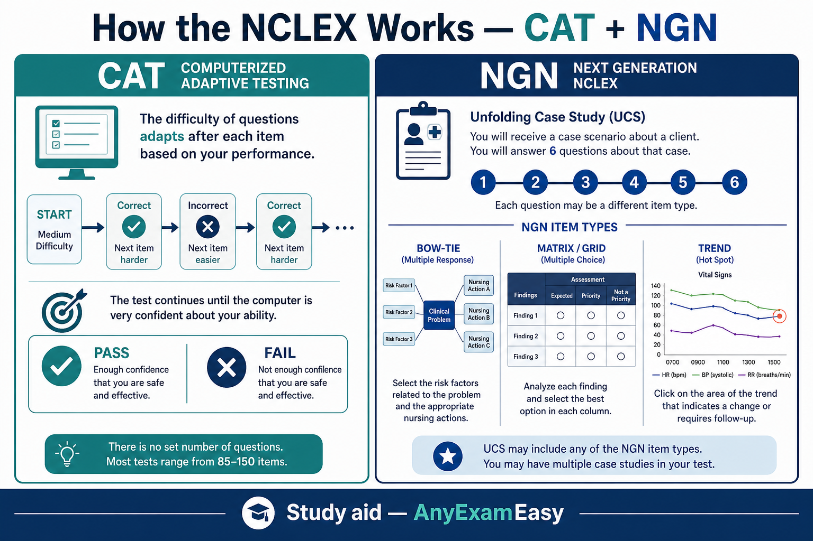

---

## Why this chapter matters

The NCLEX is not a trivia bowl. It asks: **Can you practice as a brand-new nurse safely?** If you understand *how* the exam thinks — CAT, NGN clinical judgment, Client Needs, and priority frameworks — every content chapter becomes easier to apply.

---

## How the NCLEX works (plain English)

### The big picture

| Fact | NCLEX-RN / NCLEX-PN (2026 framing) |
| --- | --- |
| Style | Computerized Adaptive Testing (**CAT**) |
| Length | **85–150** items |
| Time | Up to **5 hours** (breaks count toward the clock) |
| Scored focus | Content + **clinical judgment** (NGN) |
| Unscored | Some **pretest** items (you can’t tell which) |
| Result | Pass/fail vs. a set standard (not a “percent correct” you see) |

**Minimum-length mix (typical framing):** about **52** content-area items + **18** case-study clinical judgment items (3 cases × 6) + **15** pretest items. Longer exams add more scored content and stand-alone clinical judgment items as needed. Always verify current Candidate Bulletin details.

### CAT in one sentence

Do well → harder items. Struggle → easier items. The computer keeps going until it’s confident you are **above or below** the passing standard (or you hit the max items/time).

**What that means for you:**

- Don’t panic if questions feel hard — that can be a good sign.  
- Don’t assume an early stop = fail.  
- Keep using the **same safe decision process** on every item.

### Next Gen NCLEX (NGN) — still the real exam in 2026

NGN is not a side quest. Clinical judgment is built into the exam through:

- **Unfolding case studies** (usually 6 questions per case)  
- **Stand-alone** clinical judgment items (~10% depending on length)

#### Six clinical judgment steps (CJMM / NCJMM)

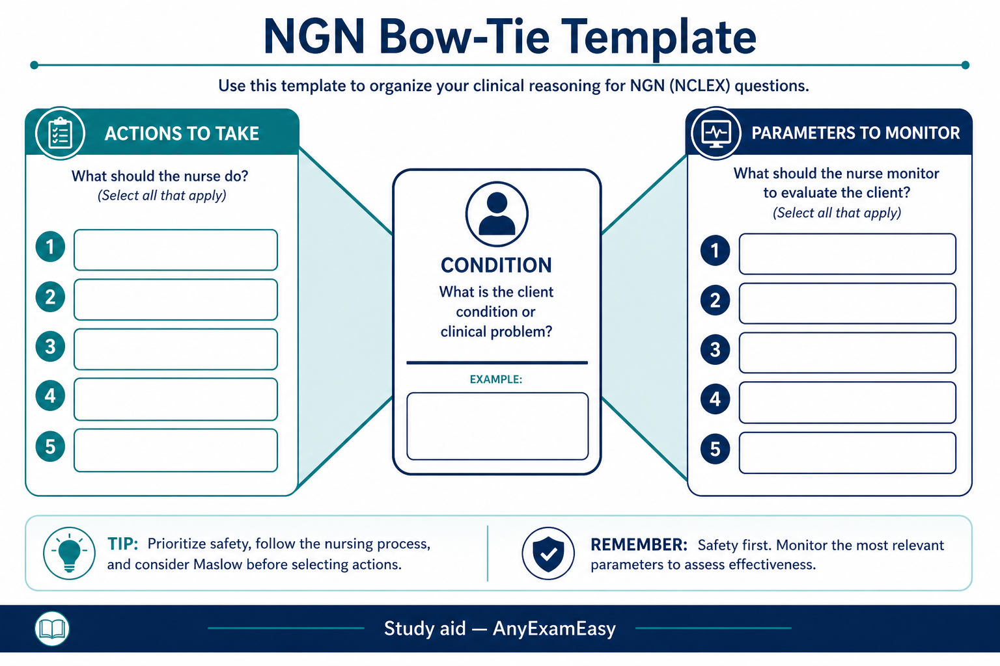

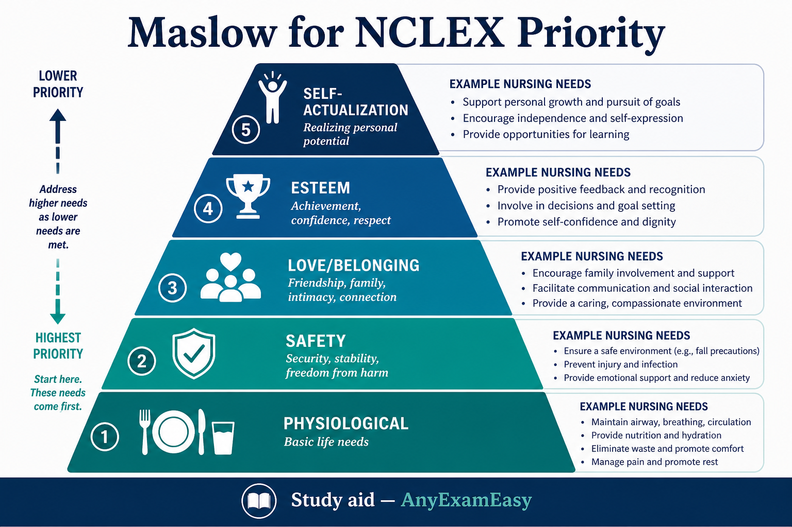

1. **Recognize cues** — What data matters?  
2. **Analyze cues** — What does it mean?  
3. **Prioritize hypotheses** — What’s most likely / most urgent?  
4. **Generate solutions** — What could help?  
5. **Take action** — What do you do *now*?  
6. **Evaluate outcomes** — Did it work? What next?

#### Common NGN item flavors

- Extended multiple response / **SATA**  
- **Matrix / grid**  
- **Bow-tie** (condition ↔ actions ↔ monitors)  
- **Trend** (data over time)  
- Drag-and-drop / ordering  
- Highlight (hot spot)  
- Cloze / drop-down  

**Remember this:** NGN rewards *thinking like a nurse*, not trivia dump. Practice the *steps*, not just the labels.

### Client Needs (how content is organized)

**2026 NCLEX-RN Test Plan** (effective April 1, 2026 – March 31, 2029). Percentages guide your study time:

| Category | Approx. % of items |
| --- | --- |
| Management of Care | **15–21%** |
| Safety and Infection Prevention and Control | **10–16%** |
| Health Promotion and Maintenance | **6–12%** |
| Psychosocial Integrity | **6–12%** |
| Basic Care and Comfort | **6–12%** |
| Pharmacological and Parenteral Therapies | **13–19%** |
| Reduction of Risk Potential | **9–15%** |
| Physiological Adaptation | **11–17%** |

**NCLEX-PN note:** Same overall idea and length/time. PN uses **Coordinated Care** (instead of Management of Care) and **Pharmacological Therapies** (instead of Pharmacological and Parenteral Therapies), with slightly different percentage bands. Same NGN clinical judgment emphasis.

**Official source of truth:** [NCSBN / NCLEX test plans](https://www.ncsbn.org) and the Candidate Bulletin.

---

## Core frameworks for answering questions

Write these on your scratch board if it helps. Use them on almost every item.

### 1) Safety first

Ask: **What keeps this client safest right now?**  
Urgent safety > nice-to-have teaching > routine tasks.

### 2) ABCs (+ “D” when relevant)

1. **Airway**  
2. **Breathing**  
3. **Circulation**  
4. Then disability / neuro, then exposure / environment when trauma/context fits  

**Exception awareness:** In some disaster/triage or specific protocols, priorities shift — but for classic bedside NCLEX stems, ABCs still win often.

### 3) Maslow (when ABCs don’t settle it)

Physiological needs → safety → love/belonging → esteem → self-actualization.

**Hungry, hypoxic, or bleeding beats anxiety** — unless the psych stem is specifically about therapeutic communication *and* no acute physiologic threat is present.

### 4) Nursing process

**Assess → Analyze → Plan → Implement → Evaluate**

- Don’t jump to a fancy intervention if **assessment data is missing** and the client isn’t crashing.  
- If the client *is* crashing, act (and get help) — don’t “assess forever.”

### 5) Acute before chronic / unstable before stable / unexpected before expected

- New confusion after surgery > chronic stable dementia baseline  
- Fresh post-op day 1 > day-of-discharge education (unless stem asks for teaching)

### 6) Elimination strategy

1. Read the **stem** and cover options if you can — predict the answer type.  
2. Spot the **true question** (first action? best response? who to see first?).  
3. Kill options that are **unsafe, out of scope, or ignore the priority**.  
4. For remaining options, pick the one that is **most complete / most immediate / most nursing**.

### Keyword cheat sheet

| Keyword | Often means… |
| --- | --- |
| **First / initial / priority** | Safety + assessment vs. action based on acuity |
| **Most appropriate / best** | Therapeutic + scope + priority |
| **Further teaching needed** | Find the **wrong** patient statement |
| **Assign / delegate** | Right task, person, circumstance, communication, supervision |
| **Early sign** | Subtle change (restlessness, slight SpO₂ drop, mild confusion) |
| **Late sign** | Obvious crisis (cyanosis, unresponsiveness) |

### Delegation (RN) — quick rules

**RN keeps:** unstable clients, new admissions/assessments, teaching that requires RN judgment, complex sterile procedures (as scoped), IV push meds (per policy/scope), care planning.

**Often LPN/LVN:** stable clients with predictable outcomes, reinforce teaching, many meds (per state/facility), wound care within scope, data collection.

**Often UAP/CNA:** ADLs, vitals on stable clients, I&O, positioning, transport of stable clients — **not** assessment, teaching, or clinical judgment.

**Remember this:** You can delegate a **task**, not the **accountability**. If the client is unstable or the outcome is unpredictable, keep it.

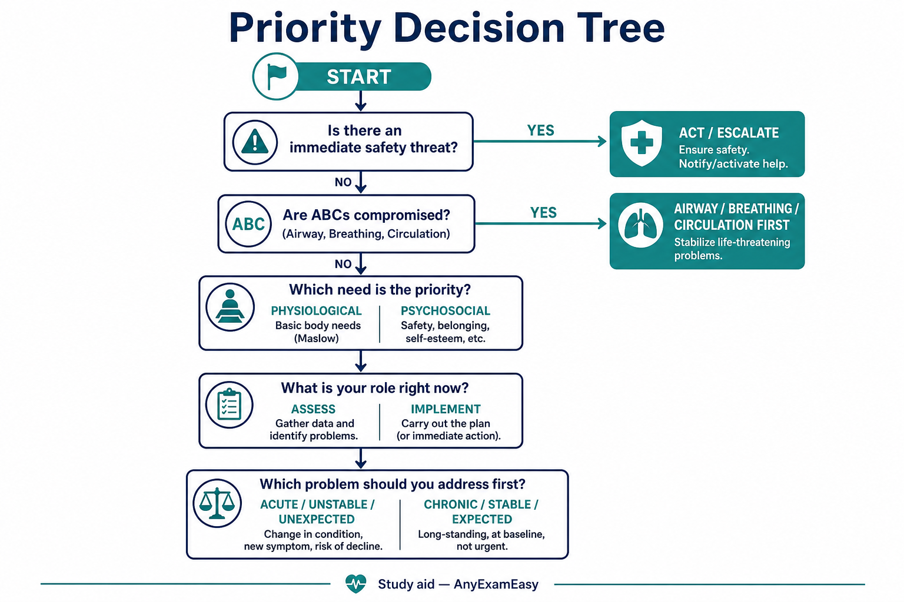

---

## Study plans

### Quick start: pick your plan

| Timeline | Best if you… | Daily questions (target) | Focus |
| --- | --- | --- | --- |
| **2 weeks** | Just finished school, content is fresh, test is soon | 100–150 | Strategy + NGN + weak spots only |
| **4 weeks** | Solid base, want balanced review | 75–125 | Content rotation + heavy practice |
| **8 weeks** | Need rebuild, working/parenting, or first big review | 50–100 (ramp up) | Foundations → intensity → peak |

Aim for **consistency over hero days**.

### 2-week intensive

| Day | Focus | Practice |
| --- | --- | --- |
| **1** | Exam format + frameworks | 50 mixed + 1 case study |
| **2** | Safety + infection + management of care / delegation | 100 |
| **3** | Pharm: cardio, resp, endocrine + calc | 100 + 20 calc |
| **4** | Med-surg: cardiac, respiratory, neuro emergencies | 100 + 1 case study |
| **5** | Fluids/electrolytes, labs, acid-base, renal | 100 |
| **6** | Maternity + newborn high-yield | 80–100 |
| **7** | Peds + growth/development red flags | 80–100 |
| **8** | Psych + therapeutic communication | 80–100 |
| **9** | Full-length or long mixed block (timed) | 85–150 sim |
| **10** | Error-log deep dive + NGN bow-tie / matrix / trend | 100 NGN-heavy |
| **11** | Weakest 2 topics only | 100 targeted |
| **12** | Second timed long block | 85–150 sim |
| **13** | Light review: labs sheet, ABCs, traps | 40–60 easy confidence |
| **14** | Rest, logistics, light flashcards only | Sleep |

### 4-week balanced plan

| Week | Theme | Daily rhythm |
| --- | --- | --- |
| **Week 1** | Foundations + safety + management of care | AM: content 45–60 min · PM: 75 Qs · Eve: rationales |
| **Week 2** | Pharm + med-surg (cardio/resp/endo/neuro) | 75–100 Qs · 1 case study/day |
| **Week 3** | Maternity, peds, psych + fluids/labs | 100 Qs · error log weekly review |
| **Week 4** | Peak: mocks, NGN, weak areas, taper | 2–3 long sims · light content · rest before exam |

**Sample day:** Morning checklist 20–30 min → afternoon timed 50–75 Qs → evening review every miss + error log.

### 8-week rebuild plan

| Weeks | Phase | Goals |
| --- | --- | --- |
| **1–2** | Build | Client Needs overview; 50–75 Qs/day; diagnostic sets; frameworks |
| **3–5** | Intensify | 100–125 Qs/day mixed; daily NGN/case study; pharm + med-surg depth |
| **6–7** | Integrate | 2–3 full-length sims/week; maternity/peds/psych polish; endurance |
| **8** | Peak & protect | Targeted weak areas; light review; sleep, nutrition, exam logistics |

**If you’re working full-time:** protect a non-negotiable block (e.g., 90 minutes after dinner). Weekend = longer timed sets.

---

## Common traps

| Trap | What to do instead |
| --- | --- |
| Memorizing facts, skipping application | Practice NGN + rationales daily |
| Ignoring case studies until “later” | Do at least one case study most days |
| Changing answers from anxiety | Change only if you misread the stem |
| Studying only strengths | Error log drives the next day’s set |
| Resource overload | One primary bank + official test plan + this book |
| No timed practice | Build 5-hour mental endurance |
| Waiting months after graduation | Schedule while knowledge is warm (often 4–8 weeks) |
| Skipping sleep before the exam | Sleep is a study strategy |
| Reading into the question | Use only the data given |
| Picking the “nurse who sounds smart” answer | Pick the **safest / most priority / most therapeutic** answer |

**Mindset:** The NCLEX is not trying to trick you with obscure zebras. It’s testing whether you’ll **keep people safe**.

---

## Practice strategy

### Volume targets (adjust to your plan)

| Phase | Questions/day | Notes |
| --- | --- | --- |
| Foundation | 50–75 | Accuracy + learning frameworks |
| Build | 75–100 | Mix topics; add NGN |
| Peak | 100–150 | Timed blocks; full sims 2–3×/week |

**Quality rule:** Never finish a set without reviewing rationales for **wrong and lucky-right** answers.

### 4-box error log

1. **Topic** (e.g., postpartum hemorrhage)  
2. **Miss type** (cue miss / priority / content gap / misread / calc)  
3. **Correct rule** in one sentence  
4. **Next drill** (10 similar Qs tomorrow)  

Review the log every 2–3 days. Patterns > single misses.

### Score interpretation (practice only)

Practice % is **not** an official NCLEX score. Trends matter: rising rationale understanding, fewer guesses, stronger priority/safety/NGN, comfortable pacing (~1.5–2 min/item average; case studies need more focus).

### Weekly rhythm

- **5–6 practice days**  
- **1 lighter day** (labs/pharm flashcards + walk)  
- **1 longer timed simulation** in peak weeks  

---

## Exam-day checklist

### The week before
- [ ] Confirm ATT, Pearson VUE appointment, ID requirements  
- [ ] Do a full timed practice under quiet conditions  
- [ ] Drive/route check or remote logistics if applicable  
- [ ] Pack outfit layers (testing rooms vary)  
- [ ] Taper new content — protect confidence  

### Night before
- [ ] Light review only (labs sheet, frameworks)  
- [ ] Lay out IDs + confirmation info  
- [ ] Set two alarms  
- [ ] No cramming until 2 a.m.  
- [ ] Hydrate; prepare simple breakfast plan  

### Morning of
- [ ] Eat something with protein + complex carbs  
- [ ] Arrive early  
- [ ] Bathroom before check-in  
- [ ] Phone off / stored per center rules  
- [ ] Breathe: you trained for clinical judgment, not perfection  

### During the exam
- [ ] Read the stem for the **real ask**  
- [ ] Use ABC / safety / nursing process every time  
- [ ] For SATA: judge each option alone  
- [ ] For case studies: track trends across tabs/time  
- [ ] Flag nothing mentally as “I failed” — keep moving  
- [ ] Use optional breaks if needed (they count toward 5 hours)  

### After
- [ ] Don’t torture yourself reconstructing every item  
- [ ] Official results come through your nursing regulatory body; Quick Results may be available ~48 hours in some jurisdictions (not a license)  

---

## Concept check

**Q1.** A candidate’s questions suddenly feel much harder after getting several “easy” items right. What is the most accurate interpretation?  
A. The exam is broken  
B. Harder items often mean the CAT is probing a higher ability estimate  
C. An early hard stretch always means failure  
D. You should change every answer  

**Q2.** On an unfolding NGN case, vitals worsen across three time points. Which CJMM step is most directly tested when you decide what is most urgent?  
A. Recognize cues only  
B. Prioritize hypotheses  
C. Client teaching  
D. Documentation style  

**Q3.** Which Client Needs category typically carries one of the largest RN percentage bands?  
A. Basic Care and Comfort alone  
B. Management of Care  
C. Health Promotion only  
D. Psychosocial Integrity only  

#### Answers

**Q1: B.** CAT adapts; harder items after success often reflect the algorithm estimating higher ability — stay process-focused.  
**Q2: B.** Urgency among competing explanations is prioritize hypotheses (built on recognized/analyzed cues).  
**Q3: B.** Management of Care is commonly framed around **15–21%** on the 2026 RN test plan — verify official plan.

---

## Remember this (strategy)

- Hard questions can be a **good** CAT sign — keep the same safe process.  
- NGN = clinical judgment steps, not trivia.  
- Safety → ABC → Maslow → nursing process → acute/unstable/unexpected.  
- One strong Qbank + error log > five half-used resources.  
- Sleep and logistics are part of prep.  

> **Practice the frameworks.** Open an NGN-ready set on [anyexameasy.com](https://anyexameasy.com) — start free; $27.99/mo after trial (trial terms on site).

---

<!-- ========== 02-fundamentals-safety.md ========== -->

# Chapter 2 — Fundamentals & Safety

> **Study aid only.** Verify isolation, med rights, and facility protocols with current CDC-aligned practice and your instructors. Not clinical protocol.

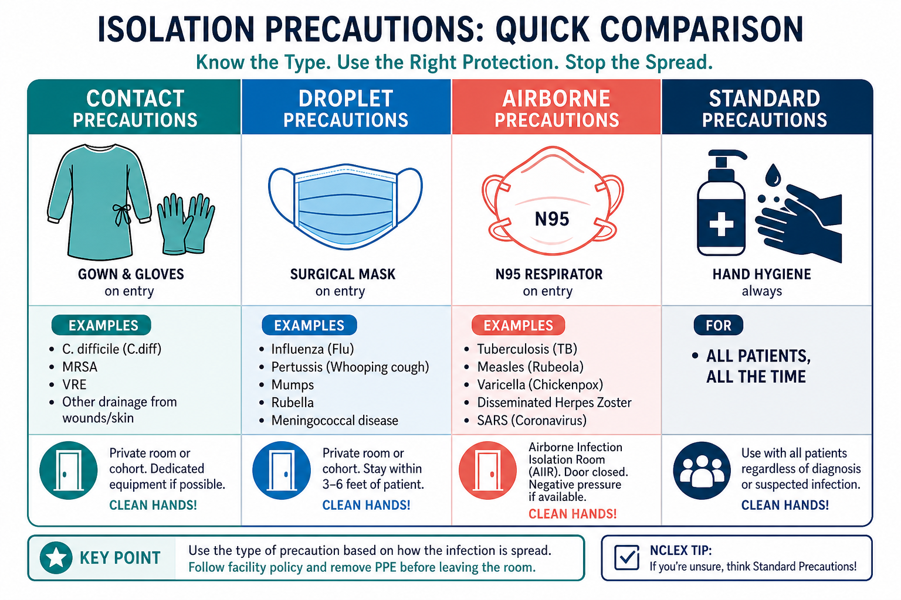

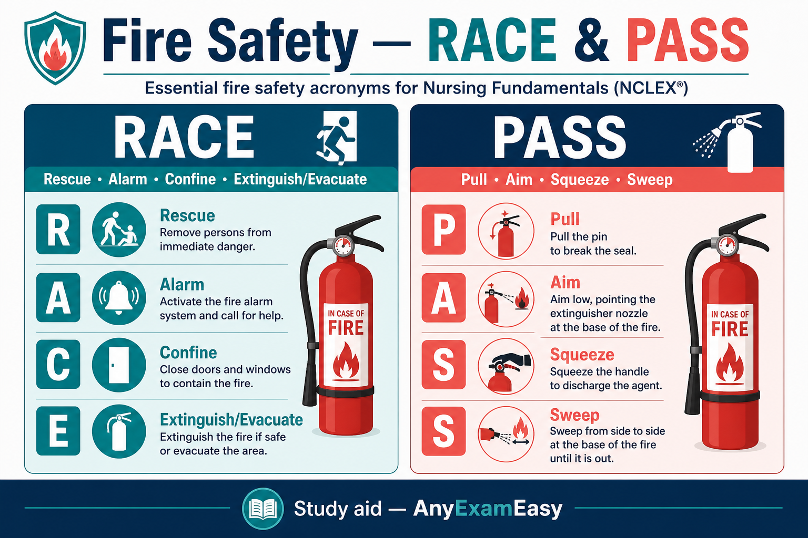

---

## Why it matters on NCLEX

Safety and Infection Prevention is a large Client Needs slice. Many “priority” and “first action” stems are really **infection control, falls, med safety, consent, or environment** questions in disguise. Master these and you protect points across the whole exam.

---

## Topic A — Infection prevention & isolation

### Pathophysiology / concept

Infection control interrupts the chain of infection (infectious agent → reservoir → portal of exit → mode of transmission → portal of entry → susceptible host). **Standard precautions** apply to **every** client. Transmission-based precautions add barriers when the pathogen’s spread mode demands it.

### Assessment cues

- Fever, local redness/drainage, rising WBC (context-dependent)  
- Clusters of similar illness on a unit (QI signal)  
- Client risk: neutropenia, open wounds, invasive lines, age extremes  

### Priority nursing actions

1. Hand hygiene before/after every contact (and after glove removal).  
2. Choose correct isolation category; post signage; stock PPE outside room.  
3. Teach visitors; cohort only per policy.  
4. For **C. difficile**: soap and water (spores); bleach-capable cleaning per policy — alcohol gel alone is not enough.  
5. Don/doff in correct order; never “clean” your phone with contaminated gloves.

### Medications / treatments (high-yield)

- Antibiotics: allergy history first; culture before first dose when ordered and client is stable enough.  
- Antipyretics treat comfort — they do not replace source control.

### Client teaching

- Cover cough; stay home when contagious (community teaching themes).  
- Don’t share personal items; complete antibiotic courses as prescribed.

### Safety / red flags

| Type | Classic organisms (high-level) | PPE / room highlight |
| --- | --- | --- |
| Standard | Everyone | Hand hygiene |
| Contact | C. diff, MRSA* | Gown + gloves |
| Droplet | Flu, N. meningitidis, many respiratory | Mask within close range |
| Airborne | TB, measles, varicella | **N95** + airborne/negative-pressure room when indicated |

\*Follow current facility/CDC-aligned practice.

### Delegation notes

UAP can often gather supplies and remind about hygiene on stable clients; **RN** decides isolation type and teaches complex infection risk (e.g., neutropenia).

### Remember this

- Airborne = N95 + special room when indicated.  
- C. diff = soap and water.  
- Gloves do not replace hand hygiene.  
- Isolation is a **priority** intervention when exposure risk is live.

---

## Topic B — Falls & restraints

### Pathophysiology / concept

Falls = leading hospital injury theme. Risk rises with age, confusion, meds (sedatives, antihypertensives), mobility aids, unfamiliar environment, and urgency to toilet. **Restraints** are a last resort after least-restrictive alternatives fail — they can cause injury, humiliation, and worse outcomes if misused.

### Assessment cues (early vs late)

- **Early risk:** unsteady gait, “I need to get to the bathroom now,” new sedative, bed alarm ignored historically  
- **Late/harm:** found on floor, head injury signs, fracture pain, sudden change in LOC after unwitnessed fall  

### Priority nursing actions

1. Universal fall precautions + targeted interventions (non-skid footwear, call light in reach, bed low, adequate lighting, toileting schedule).  
2. Hourly rounding themes for high-risk clients.  
3. Post-fall: ABCs, neuro check if head injury possible, notify provider, incident process per policy.  
4. Restraints: least restrictive → order required (timing per policy) → assess circulation, skin, toileting, nutrition, release for ROM → document behavior that justified use and alternatives tried.

### Client teaching

- Use call light before standing; sit at edge of bed first.  
- Home: remove rugs, night lights, grab bars themes.

### Safety / red flags

- Restraint as “convenience” or punishment = never.  
- Soft wrist restraints still need frequent CMS checks.  
- Chemical restraint mindset: sedating to control behavior without clinical indication is a safety/ethics issue.

### Delegation notes

UAP can assist with ambulation of **stable** clients using proper technique and report near-falls; RN assesses fall risk and restraint necessity.

### Remember this

- Least restrictive first.  
- Restraints need orders, frequent checks, and a clear clinical reason.  
- Toileting schedules prevent many “I fell trying to get to the bathroom” stems.

---

## Topic C — Medication rights & high-alert safety

### Concept

Classic rights (person, med, dose, route, time — plus documentation, reason, response, education as taught in your program). High-alert meds (insulin, anticoagulants, opioids, chemo, concentrated electrolytes) need **independent double-checks** per policy.

### Priority actions

1. Two client identifiers.  
2. Allergy check — every time.  
3. Clarify unclear orders; never assume.  
4. Watch look-alike/sound-alike packaging.  
5. After giving: evaluate response (pain relief? BP drop? glucose change?).

### Safety / red flags

- Skipping ID because “I know this patient.”  
- Trailing zeros / missing leading zeros in doses.  
- IV push without checking compatibility/rate.

### Remember this

If an option skips **allergy check**, **ID check**, or **compatible route/time**, it’s usually wrong.

---

## Topic D — Sterile technique & invasive device basics

### Concept

Sterile field protects sterile body cavities and devices. Clean technique reduces bioburden but is not sterile. Central lines and urinary catheters are major CLABSI/CAUTI prevention themes.

### Priority actions

- Sterile: don’t turn back on field; 1-inch border contaminated; wet field = contaminated; above waist.  
- Foley: sterile insertion; keep bag below bladder; closed system; peri care; remove ASAP when ordered/criteria met.  
- Central line: aseptic hub scrub; dressing integrity; report fever/redness at site.

### Remember this

Break in sterile field → stop and restart. Don’t “kinda” salvage it.

---

## Topic E — Informed consent & incident reports

### Consent roles

- **Provider** obtains informed consent (explain procedure, risks, benefits, alternatives).  
- **Nurse** witnesses signature, verifies client understanding at a basic level, advocates if client is confused/coerced/has unanswered questions — **does not** replace the provider as primary educator of risks/benefits.  
- Consent requires capacity; emergency exceptions exist per law/policy.

### Incident reports

- Factual, objective, timely.  
- Do **not** write “incident report filed” as a punitive narrative in the medical record progress note (follow facility charting rules).  
- Purpose = safety/QI, not blame theater.

### Remember this

Nurse witnesses/clarifies; provider informs. Incident reports feed QI.

---

## Topic F — Fire & disaster basics

### Fire

- **RACE:** Rescue → Alarm → Contain → Extinguish/Evacuate  
- **PASS:** Pull → Aim → Squeeze → Sweep  

### Disaster / triage themes (high-level)

Mass casualty may shift from “sickest first” to **greatest good for greatest number** (expectant category exists in true disaster triage). Know your facility’s role; NCLEX usually tests recognition that priorities can differ from bedside ABC norms in declared disaster protocols.

### Remember this

RACE/PASS are classic. Disaster triage ≠ everyday ED prioritization.

---

---

## Topic G — Pressure injury prevention & skin

### Concept

Pressure + shear + moisture → tissue ischemia. Staging I–IV (+ unstageable, DTPI). Prevention is cheaper than treatment — and it’s a core safety quality metric.

### Priority actions

- Turn q2h themes (individualize); offload heels; moisture management.  
- Nutrition/protein; never massage reddened bony areas.  
- Document size/stage carefully; wound photos per policy.  
- Braden/risk tool on admission and regularly.

### Remember this

Red non-blanching over bone = stage 1 at minimum — intervene. Don’t stage what you can’t see (eschar = unstageable until debrided per protocol).

---

## Topic H — Pain vs oversedation

### Concept

Pain is real and deserves treatment; opioids still require RR/sedation monitoring. Pasero/sedation scales themes. Multimodal analgesia reduces opioid need.

### Priority actions

- Assess pain with appropriate scale (numeric, faces, FLACC, PAINAD).  
- Reassess after intervention.  
- Hold opioids for oversedation/low RR per parameters; naloxone for overdose.  
- Nonpharm: positioning, ice/heat as ordered, distraction.

### Remember this

Treat pain and protect the airway. Sedation precedes respiratory arrest — watch the trend.

## Concept check

**Q1.** A client with suspected pulmonary TB is admitted. Which action is highest priority?  
A. Private room with airborne precautions / N95 as indicated  
B. Soft restraints  
C. Clear liquid diet  
D. Schedule teaching video first  

**Q2.** Further teaching is needed when a UAP says:  
A. “I’ll wash with soap and water after the C. diff room.”  
B. “Alcohol gel alone is fine after C. diff care.”  
C. “I’ll keep the Foley bag below the bladder.”  
D. “Call light in reach for fall risk.”  

**Q3.** A client needs surgery and asks the nurse to “explain all the risks like the surgeon should have.” Best action?  
A. Provide full risk/benefit informed consent teaching yourself  
B. Notify the provider to return and complete informed consent discussion  
C. Have the UAP witness and sign  
D. Cancel surgery without communication  

#### Answers

**Q1: A.** Airborne isolation protects staff/others immediately.  
**Q2: B.** C. diff spores need soap and water.  
**Q3: B.** Provider obtains informed consent; nurse advocates for unanswered questions.

---

## Chapter Remember this

- Standard precautions for everyone; add transmission-based correctly.  
- C. diff = soap and water; airborne = N95 + room.  
- Falls: toileting + environment; restraints last resort.  
- Med rights + allergy + high-alert double-checks.  
- Consent = provider informs; nurse witnesses/advocates.  
- RACE/PASS; incident reports = factual QI tools.

---

<!-- ========== 03-management-of-care.md ========== -->

# Chapter 3 — Management of Care

> **Study aid only.** Scope and assignment rules vary by state and facility. Verify with your nursing regulatory body. PN candidates: think Coordinated Care.

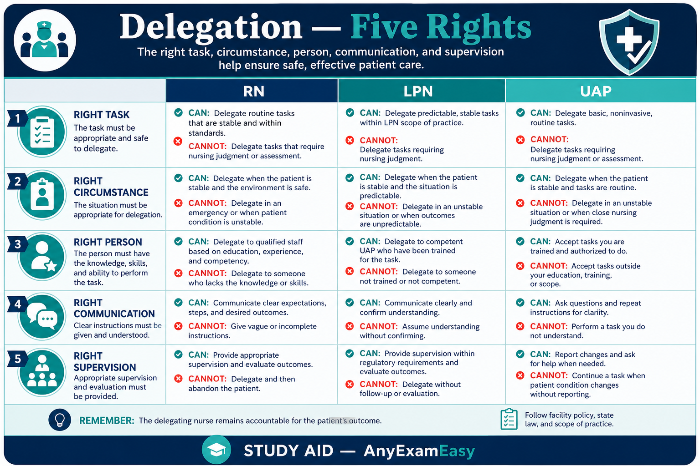

---

## Why it matters on NCLEX

Management of Care is often a large slice of RN items (commonly cited in the teens–low twenties percent range on published test plans — verify current NCSBN percentages). These stems test whether you protect clients through **prioritization, delegation, advocacy, privacy, continuity, and escalation** — not whether you sound impressive.

---

## Topic A — Multi-client prioritization

### Concept

When several clients need you, rank by **ABCs, acute vs chronic, unstable vs stable, unexpected vs expected, actual problem vs risk** (actual usually wins if equal acuity framing). Maslow helps when ABCs are equal: physiologic and safety before psychosocial teaching.

### Assessment cues that scream “see first”

- New stridor, anaphylaxis signs, SpO₂ plunging  
- Active hemorrhage, chest pain with diaphoresis  
- Sudden change in LOC  
- Post-op fresh bleeds or airway risk  
- Suicidal client with means and plan (safety)

### Priority actions

1. Who is dying/crashing or about to?  
2. Who needs a **nursing assessment** only you can do?  
3. What can be delegated so you stay with the unstable client?

### Worked prioritization vignettes (practice these)

**1.** Day-2 hip replacement requesting oral pain med vs new post-op thyroidectomy with neck swelling and stridor → **thyroidectomy airway first.**  
**2.** Chronic stable HF with baseline crackles requesting education vs client with sudden crushing chest pain and diaphoresis → **chest pain first.**  
**3.** Client ready for routine discharge teaching in 1 hour vs client pulling at ET tube and desatting → **airway client first**; assign teaching later or to another RN when safe.  
**4.** UAP reports “confused” diabetic → **RN assesses** glucose/neuro before assuming dementia baseline.  
**5.** Three “stable” requests: snack, linen change, scheduled PO vitamin — none beat a fresh OR arrival with hypotensive trend.  
**6.** Psych client with escalating agitation and clenched fists vs client needing reinforcement of already-taught incentive spirometry → **safety/de-escalation first**, then IS.

### Remember this

Stable chronic pain teaching loses to new hypoxia. Expected low-grade post-op fever on day 1 often loses to unexpected chest pain.

---

## Topic B — Assignment vs delegation vs supervision

### Definitions (NCLEX lens)

- **Assignment:** distributing responsibility for client care among staff who are authorized and competent (e.g., RN-to-RN caseload).  
- **Delegation:** transferring authority to perform a **specific nursing task** to a competent person in a selected situation while **retaining accountability**.  
- **Supervision:** monitoring, follow-up, evaluation of outcomes — you still own the result.

### Five rights of delegation

Right **task**, **circumstance**, **person**, **direction/communication**, **supervision/evaluation**.

| Role | Typically can | Typically cannot |
| --- | --- | --- |
| **RN** | Assess, teach (initial), care plan, unstable, IVP per policy | “Dump” accountability |
| **LPN/LVN** | Stable predictable care, reinforce teaching, many meds per scope, data collection | Full initial admission assessment / complex unstable judgment (state-dependent) |
| **UAP** | ADLs, vitals on stable, I&O, positioning | Assess, teach, medicate, clinical judgment |

### Float nurse safety

Float staff get orientation to unit essentials (codes, equipment, documentation). Do **not** accept an assignment outside competency without support — negotiate: lighter acuity, buddy RN, or charge reassignment. “I am not oriented to this pump/population” is advocacy, not laziness. Document concerns if you must refuse an unsafe assignment per policy.

### Safety / red flags

- Delegating assessment of a fresh post-op or newly admitted client to UAP  
- Asking UAP to “evaluate if the pain med worked” as the only follow-up  
- Unclear handoff (“watch him”)  
- Floating without stating competency limits

### Remember this

You can delegate a **task**, not the **accountability**. Float = speak up early about skill gaps.

---

## Topic C — Advocacy, HIPAA, advance directives & ethics

### Advocacy

Speak up for consent, pain control, unsafe staffing patterns (use chain of command), cultural/language needs (qualified interpreter — not family minors as primary medical interpreters).

### HIPAA

Share minimum necessary with care team. No hallway gossip, no posting PHI on social media, no leaving screens open. Exceptions exist for legally required reporting (abuse, certain threats) — know the **concept**.

### Advance directives

Living will / durable power of attorney for healthcare. Ask on admission; honor DNR/AND orders per policy; if family conflicts with documented wishes, escalate to provider/ethics — don’t unilaterally override valid directives.

### Ethical principles (NCLEX style)

| Principle | Plain English | Exam vibe |
| --- | --- | --- |
| **Autonomy** | Client chooses | Informed consent/refusal |
| **Beneficence** | Do good | Pain relief, advocacy |
| **Nonmaleficence** | Do no harm | Stop unsafe med/act |
| **Justice** | Fairness | Equitable resource use |
| **Fidelity** | Keep promises | Follow through on care plan |
| **Veracity** | Truth-telling | Honest answers about prognosis per role |

When principles clash (e.g., autonomy vs beneficence), use ethics consult / chain of command — don’t invent solo solutions.

### Remember this

Privacy + client wishes + chain of command when safety is threatened. Name the ethical principle when the stem asks.

---

## Topic D — Informed consent nuances

### Concept

Provider explains procedure, risks, benefits, alternatives; nurse **witnesses signature** and verifies client understanding / voluntary consent — nurse does **not** obtain consent for surgeries they don’t perform. Client must have capacity; interpreter if language barrier; no coercion.

### Priority actions

- If client has last-minute questions about risk/benefit → **call provider back** before signing.  
- Pre-medicated / heavily sedated clients generally should not newly sign — capacity concern.  
- Emergency exceptions when client can’t consent and delay threatens life — follow law/policy.  
- Minors / guardianship: know who may legally consent in your jurisdiction.

### Remember this

Questions about the procedure → provider. Questions about timing/prep → nurse can teach. Witness ≠ explain the surgery.

---

## Topic E — Continuity, discharge readiness & referrals

### Concept

Continuity = clean handoffs (SBAR), medication reconciliation themes, follow-up appointments, home safety, teach-back.

### Discharge readiness criteria (high-yield)

Ready when: vitals reasonably stable for destination; client/caregiver can teach-back critical meds and warning signs; prescriptions/DME arranged; transportation/safe destination; follow-up scheduled; barriers (language, literacy, cognition) addressed.  
**Not ready:** unstable VS, new confusion unexplained, can’t state when to call 911 for their condition, no caregiver when one is required, unfinished teaching on high-risk meds (warfarin, insulin).

### Referrals (examples)

PT/OT, dietitian, social work/case management, home health, wound care, spiritual care — RN recognizes need and initiates per policy.

### Remember this

Teach-back beats “any questions?” Discharge unsafe → hold and escalate, don’t shrug.

---

## Topic F — Quality improvement & unsafe practice

### Concept

QI uses data (falls, CLABSI rates) to improve systems. Report near-misses. If a colleague is impaired or unsafe: **remove risk to clients first**, then follow policy for reporting — protect clients over friendships.

### Chain of command when provider orders unsafe

1. Clarify with provider (read-back; state concern with data).  
2. If still unsafe → charge nurse / nursing supervisor.  
3. Continue up (house supervisor, medical director, ethics) per policy until resolved.  
4. Do **not** give a med/perform act you know is unsafe solely because “the doctor said.” Document facts objectively.

### Remember this

Client safety > loyalty to a coworker or fear of a provider. Use policy pathways.

---

## Topic G — SBAR handoff & assignment making

### Concept

Handoff failures cause real harm. **SBAR** (Situation, Background, Assessment, Recommendation) structures urgency without novels. Assignment making matches **acuity + continuity + geography + skill mix**.

### Priority actions

- Lead with what the oncoming nurse must do in the next hour.  
- Include pending labs, new anticoagulants, fall/suicide precautions, isolation.  
- When floating: don’t take an assignment outside your competency without orientation/support — advocate for safe assignment via charge/supervisor.

### NGN angle

Trend items often hide in handoff data: “BP drifting down since 1400” beats a single normal value.

### Remember this

Clear handoff is a safety intervention. Unsafe assignment → speak up using chain of command.

---

## Topic H — Informed refusal, AMA, and capacity (high-level)

### Concept

Competent adults can refuse treatment after being informed of risks. AMA (against medical advice) departure still requires education, documentation, and offering partial alternatives when possible. Capacity is decision-specific and can fluctuate with hypoxia, intoxication, psych crisis.

### Priority actions

- Notify provider; ensure risks/benefits explained.  
- Document quotes, witnesses, what was offered.  
- If lack of capacity + emergent threat to life, emergency exceptions may apply — follow law/policy; don’t invent.

### Remember this

Respect autonomy when capacity present; protect when capacity absent and danger is imminent — escalate.

---

## Topic I — Disaster triage (START high-level)

### Concept

Mass casualty: do the **greatest good for the greatest number**. START-style categories (know the idea, not a memorized script as absolute law):

- **Red (immediate):** life-threatening but salvageable now (e.g., airway issues you can open, controlled bleeding urgency).  
- **Yellow (delayed):** serious but can wait briefly.  
- **Green (minor):** walking wounded.  
- **Black (expectant/deceased):** unlikely to survive given resources — still treat with dignity; roles vary by protocol.

Walking wounded are often tagged green first to clear the scene. This is **not** everyday ED triage — don’t apply black tags to routine single-client care.

### Remember this

Disaster = utilitarian sorting. Everyday care = sickest salvageable individual first. Know which frame the stem is using.

---

## Concept check

**Q1.** Four clients call. Whom do you see first?  
A. Day-2 post-op requesting routine oral pain med  
B. COPD client with SpO₂ 84% on usual O₂ and new confusion  
C. Diabetic requesting bedtime snack  
D. Client needing discharge teaching in 1 hour  

**Q2.** Appropriate UAP assignment?  
A. Assess breath sounds after albuterol  
B. Teach insulin self-injection  
C. Stable client bed bath and empty Foley  
D. Evaluate response to IV opioid  

**Q3.** A nurse coworker smells of alcohol and is about to give meds. Best first action?  
A. Ignore to avoid conflict  
B. Post on social media  
C. Intervene to protect clients and notify charge/supervisor per policy  
D. Document only at end of week  

**Q4.** Provider orders a dose the nurse knows exceeds safe limits for this client. After clarifying, the provider says “just give it.” Next best action?  
A. Give it to avoid conflict  
B. Refuse silently and hide the order  
C. Hold the dose, notify charge/supervisor, continue chain of command per policy  
D. Ask UAP to decide  

**Q5.** Which client is **least** ready for discharge?  
A. Teach-back correct on warfarin diet/INR follow-up; ride home present  
B. New insulin user cannot recall hypo treatment after two teaching sessions; lives alone  
C. Stable VS; home health arranged; med list reconciled  
D. Ortho client ambulating with PT clearance and caregiver  

**Q6.** Float RN not oriented to continuous insulin drips is assigned a DKA insulin infusion. Best action?  
A. Accept quietly and “figure it out”  
B. State competency limit; request orientation, buddy, or reassignment via charge  
C. Have UAP titrate the drip  
D. Stop all unit insulin protocols  

#### Answers

**Q1: B.** Airway/breathing + new confusion = unstable.  
**Q2: C.** ADLs on stable client fit UAP.  
**Q3: C.** Remove immediate risk; follow reporting policy.  
**Q4: C.** Unsafe order → hold and escalate; never knowingly harm.  
**Q5: B.** Failed teach-back on high-risk med + lives alone = not ready.  
**Q6: B.** Float safety = competency advocacy.

---

## Chapter Remember this

- Unstable / ABC / unexpected → see first; use worked vignette logic.  
- Assignment ≠ delegation ≠ supervision — RN keeps accountability.  
- Five rights; float nurses must declare skill gaps.  
- Consent: provider explains; nurse witnesses/advocates.  
- Ethics: autonomy, beneficence, nonmaleficence, justice, fidelity, veracity.  
- HIPAA minimum necessary; advance directives honored.  
- Discharge = teach-back + safety + follow-up.  
- Unsafe order/practice → chain of command.  
- Disaster START ≠ everyday triage — read the stem.

---

<!-- ========== 04-cardiac.md ========== -->

# Chapter 4 — Cardiac

> **Study aid only.** Cardiac protocols (ACS pathways, ACLS) follow facility/AHA-aligned standards — verify current practice. Labs/ranges vary.

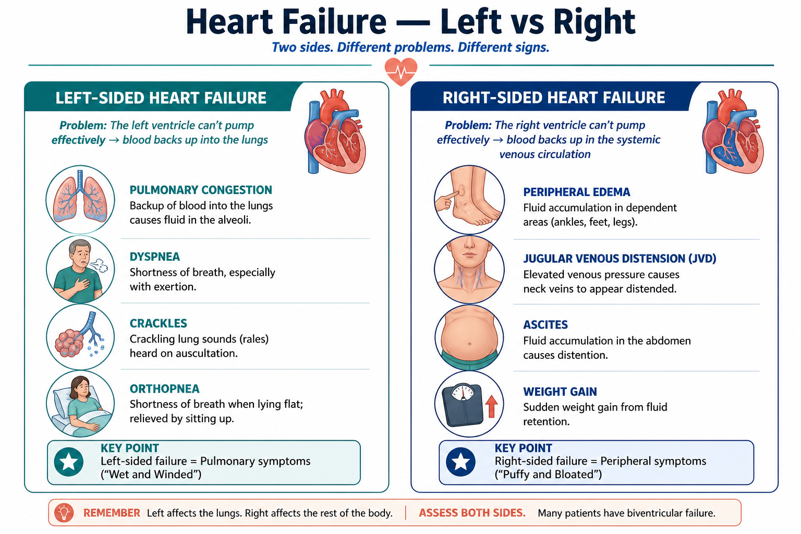

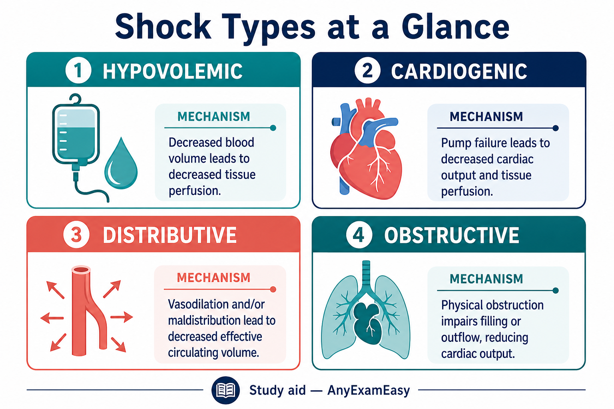

---

## Why it matters on NCLEX

Cardiac items test **perfusion, oxygen supply/demand, fluid overload, and lethal rhythm urgency**. NGN cases love trending vitals, troponin, and response to nitro or diuretics.

---

## Topic A — CAD / ACS / MI

### Pathophysiology / concept

Coronary arteries supply myocardium. Atherosclerotic plaque → ischemia (stable angina with exertion) → plaque rupture/thrombus → **acute coronary syndrome** (unstable angina / NSTEMI / STEMI). Time is muscle.

### Assessment cues

**Early / typical:** chest pressure/pain ± radiation to arm/jaw/back, dyspnea, diaphoresis, nausea, sense of doom; women/diabetics/elderly may have atypical cues (fatigue, epigastric discomfort, dyspnea alone).

**Concerning progression:** ongoing pain despite rest/nitro, hypotension, new crackles (LV failure), lethal arrhythmias, cardiogenic shock.

### Priority nursing actions

1. ABCs; sit upright if dyspneic; O₂ **if hypoxic** per current protocol mindset.  
2. Continuous cardiac monitoring; 12-lead ECG urgently.  
3. Notify provider / activate ACS pathway.  
4. IV access; aspirin as ordered; nitroglycerin as ordered (watch BP; caution with recent PDE-5 inhibitors).  
5. Morphine only as ordered for refractory pain — not a substitute for reperfusion strategy.  
6. NPO if cath/possible intervention; prepare for reperfusion themes (PCI/thrombolysis eligibility concepts).

### Medications / treatments (high-yield)

- **Antiplatelets** (aspirin, P2Y12 themes): bleeding precautions  
- **Anticoagulants** in ACS per protocol  
- **Nitroglycerin:** vasodilation; headache/hypotension common; hold themes if BP low  
- **Beta blockers:** reduce myocardial O₂ demand; watch HR/BP  
- **Statins:** plaque stabilization/long-term  

### Client teaching

- Call emergency services for unrelieved chest pain (don’t drive yourself).  
- Risk factor modification: smoking, lipids, HTN, diabetes, activity as cleared.  
- Nitro storage/use teaching when prescribed.

### Safety / red flags

- Sudden hypotension + tachycardia after nitro  
- New murmur / flash pulmonary edema post-MI (mechanical complication concern)  
- Bleeding after PCI access site  

### Delegation notes

UAP can report chest pain complaints immediately; RN stays with unstable ACS client.

### Remember this

- ECG + don’t leave unstable chest-pain clients alone.  
- Aspirin/nitro per orders; watch BP.  
- Atypical presentations still count.

---

## Topic B — Heart failure

### Pathophysiology / concept

Pump failure → backup (pulmonary congestion in left-sided; systemic edema in right-sided) and/or poor forward flow (fatigue, oliguria, cool extremities). Compensatory SNS/RAAS worsen remodeling over time.

### Assessment cues

**Congestion:** dyspnea, orthopnea, crackles, weight gain, edema, JVD, S3 themes.  
**Hypoperfusion:** cool clammy skin, hypotension, confusion, falling UOP.  
**Acute decompensation:** pink frothy sputum vibe = pulmonary edema emergency energy.

### Priority nursing actions

1. ABCs; high Fowler’s; O₂ as indicated.  
2. Telemetry; daily weights; strict I&O.  
3. Diuretics as ordered; monitor K⁺ and BP.  
4. Low-sodium diet teaching; fluid restriction if ordered.  
5. Watch digoxin toxicity if applicable (GI, visual changes, bradycardia — confirm with levels/protocol).

### Medications (high-yield)

- Loop diuretics (furosemide): K⁺ wasting; ototoxicity if pushed too fast IV  
- ACEI/ARB/ARNI themes: cough/hyperkalemia/angioedema awareness for ACEI  
- Beta blockers (stable HF chronic care themes)  
- Aldosterone antagonists: K⁺ sparing  

### Client teaching

- Weigh daily — report gain per provider parameters (commonly ~2–3 lb themes).  
- Sodium awareness; med adherence; vaccines themes as advised.  
- Know when to seek care (worsening dyspnea, orthopnea, swelling).

### Safety / red flags

- Rapid weight gain + dyspnea  
- Hypokalemia on loops → dysrhythmia risk  
- Dig toxicity cues  

### Remember this

Daily weights are a vital sign in HF. Treat congestion and protect perfusion.

---

## Topic C — Hypertension

### Concept

Sustained elevated BP damages vessels/organs (brain, heart, kidney, eye). Hypertensive urgency vs emergency (end-organ damage) themes matter for priority.

### Assessment

Often silent; headache/vision changes/chest pain/neuro deficits = concerning.

### Priority actions

- Accurate BP technique; trend readings.  
- Meds as ordered; slow controlled reduction in emergencies per protocol (avoid crashing BP).  
- Lifestyle teaching: DASH/sodium, weight, alcohol, activity, smoking.

### Med themes

- Diuretics, ACEI/ARB, CCB, beta blockers — hypotension/dizziness teaching; orthostatics.

### Remember this

Lower BP safely; teach lifelong management; watch acute end-organ clues.

---

## Topic D — Shock overview (cardiac lens)

### Concept

Shock = inadequate tissue perfusion. Types: hypovolemic, cardiogenic, distributive (septic/anaphylactic/neurogenic), obstructive (PE/tamponade themes).

| Type | Sketch | Early nursing priorities |
| --- | --- | --- |
| Hypovolemic | Volume loss | Stop bleed/fluid replace per orders |
| Cardiogenic | Pump fail | Don’t drown with fluids; support BP/O₂; treat cause |
| Septic | Vasodilation/infection | Cultures, antibiotics, fluids per sepsis bundles |
| Anaphylactic | Allergy | Epinephrine IM themes, airway |
| Obstructive | Block | Relieve cause (e.g., tension PTX, tamponade) |

### Assessment cues

Tachycardia, hypotension, cool clammy (or warm in early distributive), oliguria, rising lactate themes, altered LOC.

### Remember this

Treat cause + restore perfusion. Cardiogenic ≠ “just give lots of fluid.”

---

## Topic E — Dysrhythmia nursing priorities (high-level)

### Concept

Electrical problems alter rate/output. Focus on **pulse presence, stability (BP, LOC, chest pain, dyspnea), and lethal rhythms**.

### Priority actions

- Assess **patient**, not only the monitor (pulse check).  
- Unstable tachycardia/bradycardia → rapid response / ACLS-aligned pathway.  
- VF/pVT → CPR + defibrillation themes.  
- Afib: rate control/anticoagulation stroke-risk themes as ordered.  
- PVCs: treat causes (hypoxia, K⁺/Mg²⁺).  

### Med themes

- Amiodarone, adenosine, atropine, epinephrine — recognition of emergency use classes, not cookbook dosing from memory alone. Verify ACLS/facility.

### Remember this

No pulse + lethal rhythm = CPR/defib energy. Stable vs unstable changes the pathway.

---

---

## Topic F — VTE / DVT / anticoagulation nursing

### Pathophysiology / concept

Virchow’s triad: stasis, endothelial injury, hypercoagulability. DVT → PE risk.

### Assessment cues

Unilateral leg swelling, pain, warmth, redness; Homans’ is unreliable — don’t rely on it. Post-op orthopedic and oncology clients = high risk.

### Priority nursing actions

- Prevention: early ambulation, SCDs on correctly, anticoag prophylaxis as ordered.  
- Suspected DVT: don’t massage limb; elevate as ordered; prepare for duplex; anticoagulate as ordered.  
- Bleeding precautions once anticoagulated.

### Remember this

Prevention beats treatment. Unilateral swelling after surgery → take seriously.

---

## Topic G — Pacemaker / ICD teaching themes

- Immobilize shoulder briefly as ordered post-implant; don’t raise arm above head initially.  
- ID card; avoid strong magnets/MRI unless device-compatible.  
- Report dizziness, hiccups persistent, or shocks (ICD).  
- Microwaves usually fine; follow manufacturer teaching.

### Remember this

Arm precautions early post-op; know when to report shocks.

## Concept check

**Q1.** Client with crushing chest pain, diaphoresis, BP 88/50. First nursing action?  
A. Detailed diet history  
B. Stay with client, ABCs/monitoring, activate ACS/emergency response, do not leave  
C. Ambulate to reduce anxiety  
D. Give PO ibuprofen  

**Q2.** HF teaching success looks like:  
A. “I’ll avoid weighing myself so I don’t worry.”  
B. “I’ll report a rapid weight gain and new orthopnea.”  
C. “I can stop ACEI if I cough once.”  
D. “Salt is fine if I drink more water.”  

**Q3.** Monitor shows a lethal rhythm and client is unresponsive without pulse. Priority?  
A. Obtain 12-lead before any action  
B. Begin CPR and defibrillation per protocol  
C. Call family first  
D. Give oral beta blocker  

#### Answers

**Q1: B.** Unstable ACS — stay, support ABCs, activate help.  
**Q2: B.** Daily weight surveillance + symptom reporting.  
**Q3: B.** Pulseless lethal rhythm → CPR/defib pathway.

---

## Chapter Remember this

- ACS: time, ECG, aspirin/nitro per orders, watch BP.  
- HF: weights, Na⁺, diuretics/K⁺, congestion vs hypoperfusion.  
- Shock: type drives fluids vs restraint of fluids.  
- Dysrhythmias: pulse + stability first.  
- New restlessness + falling SpO₂ / chest pain often outranks chronic stable complaints.

---

<!-- ========== 05-respiratory.md ========== -->

# Chapter 5 — Respiratory

> **Study aid only.** Oxygen protocols and ABG reference ranges vary — confirm with current clinical sources. Study aid, not ventilator management certification.

---

## Why it matters on NCLEX

Respiratory stems are classic **ABC** killers. Silent chest, PE, and falling SpO₂ trends appear constantly in priority and NGN items.

---

## Topic A — Asthma

### Pathophysiology / concept

Reversible airway obstruction: bronchoconstriction + inflammation + mucus. Triggers: allergens, infection, exercise, irritants.

### Assessment cues

**Early:** wheeze, cough, prolonged expiration, tachypnea, anxiety.  
**Late/ominous:** **silent chest**, inability to speak full sentences, cyanosis, exhaustion, SpO₂ drop — impending respiratory failure.

### Priority nursing actions

1. Position upright; O₂ as indicated.  
2. Short-acting beta agonist (albuterol) as ordered; anticholinergic add-ons per protocol.  
3. Systemic corticosteroids for inflammation as ordered.  
4. Monitor response; prepare for escalation if silent chest / fatigue.

### Meds (high-yield)

- SABA rescue vs inhaled corticosteroid controller adherence  
- Watch tachycardia/tremor with beta agonists  

### Client teaching

- Spacer use; rinse mouth after ICS.  
- Asthma action plan; when to seek emergency care.  
- Avoid triggers; peak flow themes if used.

### Remember this

Silent chest ≠ improvement. Speaks of dangerous airflow collapse.

---

## Topic B — COPD

### Pathophysiology / concept

Chronic bronchitis / emphysema themes → chronic airflow limitation, air trapping, CO₂ retention in some clients, hypoxic drive nuances (still give O₂ carefully per orders — don’t withhold in emergency hypoxia).

### Assessment cues

Dyspnea, barrel chest themes, pursed-lip breathing, chronic cough/sputum, clubbing sometimes; exacerbation = more dyspnea, sputum change, hypoxia/hypercapnia.

### Priority actions

- Tripod/upright; controlled O₂ titration per target SpO₂ orders.  
- Bronchodilators, steroids, antibiotics if indicated for exacerbation.  
- Pulmonary hygiene; nutrition (work of breathing burns calories).  
- Smoking cessation support.

### Teaching

- Pursed-lip / diaphragmatic breathing.  
- Vaccinations themes; pacing activities.  
- Report sputum/color change and fever.

### Safety / red flags

Rising CO₂ + somnolence; home O₂ fire/smoking risk.

### Remember this

Titrate O₂ to ordered targets; treat exacerbations early; stop smoking messaging.

---

## Topic C — Pneumonia

### Concept

Infection of lung parenchyma → consolidation, impaired gas exchange. Aspiration risk in dysphagia/altered LOC.

### Assessment

Fever, productive cough, pleuritic pain, crackles, tachypnea, confusion in elderly (may be primary cue).

### Priority actions

- O₂; cultures then antibiotics as ordered when stable enough.  
- Hydration if not contraindicated; incentive spirometry / turn-cough-deep breathe.  
- Aspiration precautions when indicated; elevate HOB.

### Remember this

Elderly: confusion may be pneumonia. Antibiotics after cultures when possible; don’t delay sepsis care inappropriately.

---

## Topic D — Pulmonary embolism

### Pathophysiology / concept

Thrombus (often DVT) → pulmonary artery obstruction → V/Q mismatch, strain on right heart, possible sudden death.

### Assessment cues

**Sudden** dyspnea, pleuritic chest pain, tachycardia, anxiety, hemoptysis sometimes, hypoxia; post-op/immobile/OCPs/cancer = risk themes.

### Priority nursing actions

1. Stay with client; call rapid response/provider.  
2. O₂; high Fowler’s; monitor VS/ECG.  
3. Prepare for diagnostics/anticoagulation/thrombolysis per orders.  
4. Prevention elsewhere: early ambulation, SCDs, anticoag prophylaxis as ordered.

### Remember this

Sudden dyspnea + risk factors → think PE until proven otherwise. Don’t leave alone.

---

## Topic E — Oxygen delivery & chest tubes (basics)

### O₂ devices (conceptual ladder)

Nasal cannula → simple mask → Venturi (precise FiO₂) → non-rebreather (high FiO₂) → advanced airways/NIV/ventilator themes. Humidify high flows as indicated; skin care on ears.

### Chest tubes

- System **below** chest level.  
- Tidaling in water seal often expected; **continuous bubbling in water seal** may indicate air leak.  
- Continuous gentle bubbling in suction chamber may be expected when suction applied (device-dependent).  
- Don’t routinely clamp without direction; dislodgement → occlusive dressing themes per protocol; call for help.

### Remember this

Below chest; know bubbling vs tidaling meaning; protect airway if tube issues.

---

## Topic F — ABGs intro

### Concept

| Look at | Meaning |
| --- | --- |
| pH | Acidemia vs alkalemia |
| PaCO₂ | Respiratory component |
| HCO₃⁻ | Metabolic component |
| PaO₂ / SaO₂ | Oxygenation |

**Shortcut:** Match the component that explains the pH = primary process. The other may compensate.

Common patterns: respiratory acidosis (hypoventilation/COPD), respiratory alkalosis (hyperventilation), metabolic acidosis (DKA/lactic), metabolic alkalosis (vomiting/NG suction themes).

**Remember this:** Treat the patient, not only the number — but know which patterns fit the stem.

---

---

## Topic G — Acute respiratory failure & ARDS themes

### Pathophysiology / concept

Respiratory failure: inadequate gas exchange — hypoxemic (low PaO₂) and/or hypercapnic (high PaCO₂). **ARDS**: inflammatory alveolar injury → shunting, stiff lungs, refractory hypoxemia; often after sepsis/trauma/aspiration/pancreatitis.

### Assessment cues

Worsening dyspnea, tachypnea, accessory muscles, falling SpO₂ despite O₂, agitation → lethargy (CO₂ rising), crackles, pink frothy sputum in cardiogenic overlap (differentiate).

### Priority nursing actions

1. Escalate early — don’t wait for perfect ABG if client crashing.  
2. High-flow O₂ / NIV / intubation as ordered and scoped.  
3. Positioning (prone therapy themes in ARDS as ordered).  
4. Treat cause (infection, fluid overload, PE).  
5. Conserve energy; cluster care; anxiety support without oversedating.

### Remember this

Refractory hypoxia + bilateral infiltrates context → ARDS pathway thinking. Lethargy after fighting for air is ominous.

---

## Topic H — Tracheostomy & suctioning safety (high-level)

### Priority actions

- Spare trach at bedside for new trachs; obturator.  
- Suction only as needed; preoxygenate per protocol; sterile technique for open suction.  
- If dislodged newly: emergency — cover stoma/ventilate per training, call for help.  
- Cuff pressures and aspiration precautions as ordered.

### Remember this

New trach dislodgement = emergency. Don’t yank ties casually in the first days.

## Concept check

**Q1.** Asthmatic with decreasing wheeze, rising lethargy, SpO₂ falling. Priority interpretation?  
A. Improving — less wheeze  
B. Possible silent chest / failure — escalate care  
C. Normal after albuterol  
D. Ignore SpO₂  

**Q2.** Post-op day 2 client with sudden dyspnea and HR 128. Best first actions?  
A. Encourage ambulation alone in hallway without assessment  
B. Stay with client, support oxygenation, notify provider/rapid response for possible PE  
C. Give PRN sleep aid  
D. Document only  

**Q3.** Continuous bubbling in water-seal chamber of chest tube likely suggests:  
A. Normal tidaling only  
B. Possible air leak — assess system/client  
C. Bag is empty of water always  
D. Client can go home immediately  

#### Answers

**Q1: B.** Silent chest / fatigue = emergency vibe.  
**Q2: B.** Sudden dyspnea + tachy post-op → PE until ruled out.  
**Q3: B.** Continuous water-seal bubbling → leak concern.

---

## Chapter Remember this

- Asthma: silent chest is ominous.  
- COPD: titrate O₂; treat exacerbations; smoking cessation.  
- Pneumonia: elderly confusion; cultures/antibiotics themes.  
- PE: sudden dyspnea — stay, O₂, escalate.  
- Chest tube: below chest; bubbling vs tidaling.  
- ABGs: pH then CO₂/HCO₃ match.

---

<!-- ========== 06-neuro.md ========== -->

# Chapter 6 — Neurologic

> **Study aid only.** Stroke pathways and seizure protocols follow facility/AHA-aligned standards — verify current practice. Not a neurosurgery manual.

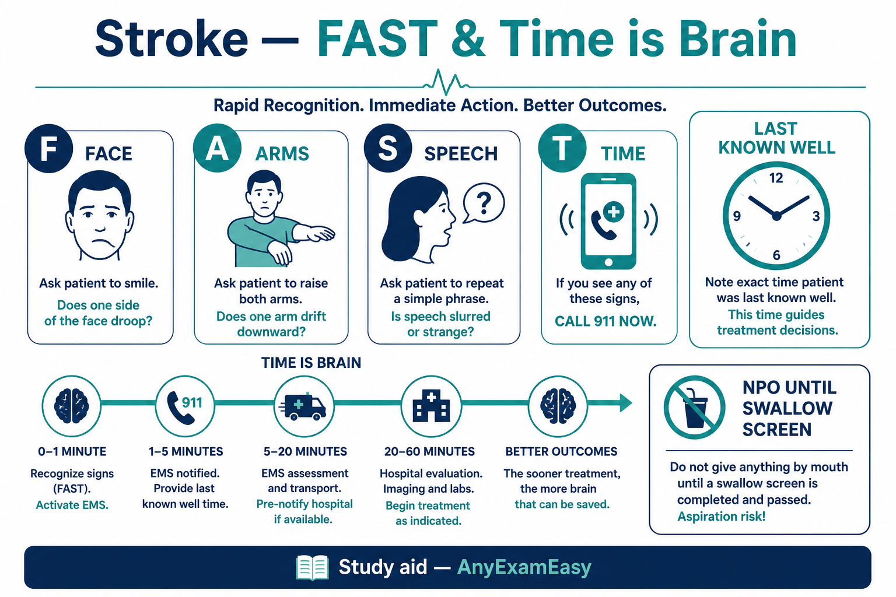

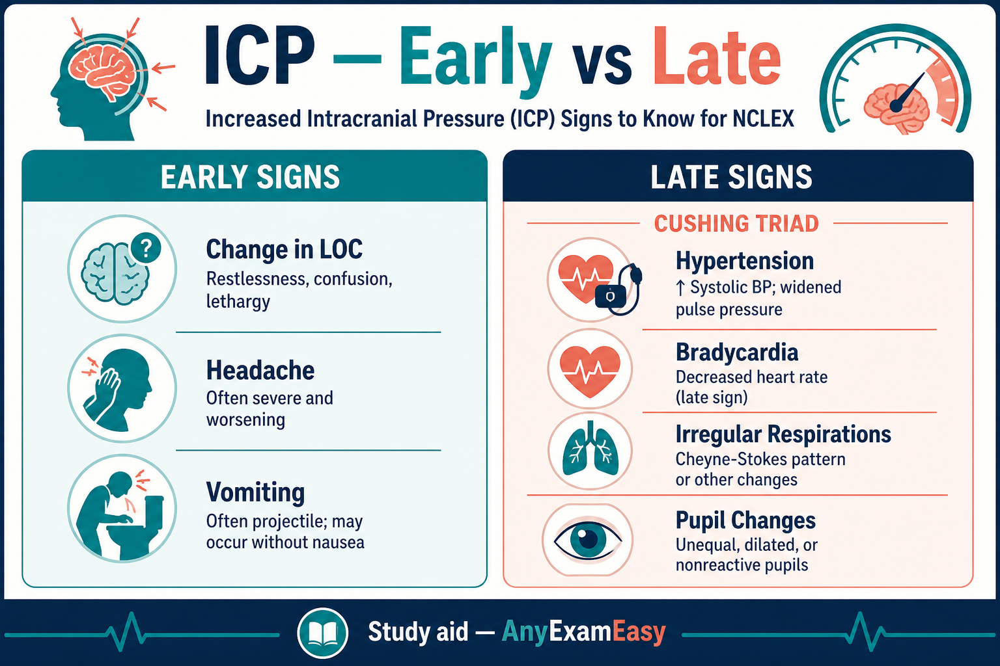

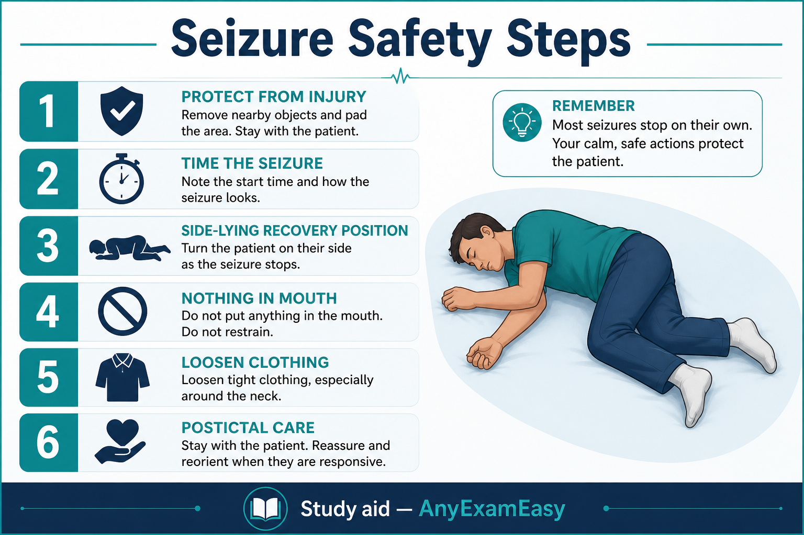

---

## Why it matters on NCLEX

Neuro items test **airway protection, time-sensitive perfusion (stroke), rising ICP recognition, and seizure safety**. Early vs late signs are classic NCLEX bait.

---

## Topic A — Stroke (CVA)

### Pathophysiology / concept

Brain tissue dies when blood flow stops. **Ischemic** (thrombotic/embolic) is most common; **hemorrhagic** (ICH/SAH) bleeds into/around brain. “Time is brain.” Penumbra can be saved with timely reperfusion in eligible ischemic strokes — hemorrhagic paths differ (no tPA).

### Assessment cues

**FAST:** Face droop, Arm weakness, Speech difficulty, Time to call emergency care.  
Other: sudden severe headache (esp. hemorrhagic), visual field loss, ataxia, neglect, altered LOC, aphasia vs dysarthria.

**NIHSS themes** (high-level): structured deficit scoring — know that serial neuro checks matter more than memorizing every item.

### Priority nursing actions

1. ABCs; **NPO until swallow screen** passed — aspiration is a killer complication.  
2. Exact **last known well** time — drives eligibility windows.  
3. Rapid stroke protocol / CT to differentiate ischemic vs hemorrhagic.  
4. Glucose check (hypoglycemia mimics stroke).  
5. Elevate HOB per protocol if not contraindicated; head midline; avoid fever if possible.  
6. After ischemic confirmation and eligibility: thrombolysis/thrombectomy pathways as ordered — BP parameters matter.  
7. Hemorrhagic: BP control per orders; reverse anticoagulation if ordered; neurosurg consult themes.

### Medications / treatments (high-yield)

- Alteplase (tPA) concepts: strict inclusion/exclusion; bleed risk; no anticoags/antiplatelets for a period after per protocol  
- Antiplatelets for secondary prevention (ischemic) as ordered  
- Anticoagulation for afib-related prevention when appropriate  
- Statins, BP meds for secondary prevention  

### Client teaching

- Call emergency services at FAST signs — don’t “wait and see.”  
- Med adherence; smoking cessation; diabetes/HTN/lipid control.  
- Aspiration precautions / diet texture as prescribed.  
- Unilateral neglect safety (scan environment).

### Safety / red flags

- Sudden neuro decline after tPA → possible hemorrhage  
- Aspiration pneumonia risk  
- DVT risk with immobility  
- Shoulder injury on flaccid side if pulled  

### Delegation notes

UAP can assist with safe positioning and report changes; **RN** does swallow screen and neuro assessment.

### Remember this

- NPO until swallow cleared.  
- Last known well time is critical data.  
- Ischemic ≠ hemorrhagic treatment path.

---

## Topic B — Increased ICP & head injury themes

### Pathophysiology / concept

Skull is closed box (Monro-Kellie): brain + blood + CSF. Increase in one → ICP rises unless compensation. High ICP → ischemia → herniation risk.

### Assessment cues

**Early:** change in **LOC** (irritability, confusion, restlessness), headache, vomiting (sometimes projectile), pupil changes beginning.  
**Late:** Cushing’s triad themes (**bradycardia, irregular respirations, widening pulse pressure/hypertension**), fixed dilated pupils, posturing, coma.

### Priority nursing actions

1. Maintain airway; avoid hypoxia/hypercarbia (both raise ICP).  
2. HOB elevation ~30° often; head midline; avoid tight collar ties.  
3. Minimize clustering of painful care; stool softeners to avoid Valsalva.  
4. Osmotic therapy / hypertonic saline as ordered; monitor labs.  
5. Seizure precautions when indicated.  
6. No lumbar puncture if mass lesion/herniation risk without clearance.

### Meds (high-yield)

- Mannitol / hypertonic saline themes: monitor osmolality, electrolytes, volume status  
- Antiepileptics if ordered  
- Avoid hypotonic free water overload themes  

### Safety / red flags

- Sudden LOC drop + Cushing’s signs = emergency  
- CSF leak (halo sign / clear drainage) — report; don’t pack nose aggressively  

### Remember this

Early ICP = LOC change. Late = Cushing’s. Protect airway and cerebral perfusion.

---

## Topic C — Seizures

### Pathophysiology / concept

Abnormal synchronized electrical discharge. Status epilepticus = prolonged/repeated seizures without recovery — airway and brain injury risk.

### Assessment cues

Aura possible; tonic-clonic motor activity; incontinence; postictal confusion; focal deficits after (Todd’s paralysis themes).

### Priority nursing actions

1. Protect from injury — lower to floor if needed, pad, turn side when able.  
2. **Nothing in the mouth.**  
3. Time the seizure; loosen clothing; suction ready for **after**.  
4. Oxygen if ordered/available; don’t restrain forcibly.  
5. Status: call emergency response; benzos per protocol.  
6. After: neuro check, glucose if indicated, document phases, meds as ordered.

### Client teaching

- Med adherence (breakthrough seizures often = missed doses).  
- Safety: driving laws vary; swim with buddy; medical ID.  
- Triggers: sleep deprivation, alcohol, flashing lights in photosensitive types.

### Remember this

Airway/safety; time it; nothing in mouth; status = emergency meds/airway.

---

## Topic D — Meningitis basics

### Concept

Infection/inflammation of meninges. Bacterial is a **medical emergency** and often **droplet** precautions (e.g., N. meningitidis) until adequately treated per protocol.

### Assessment cues

Fever, severe headache, nuchal rigidity, photophobia, altered LOC; Kernig/Brudzinski themes; petechial rash with meningococcus (purpura fulminans concern).

### Priority actions

- Droplet precautions early when suspected.  
- Blood cultures / LP as ordered when safe; antibiotics promptly.  
- Dark quiet room; seizure precautions; monitor ICP signs.  
- Close-contact prophylaxis themes as directed by public health/provider.

### Remember this

Droplet + don’t delay antibiotics for bacterial meningitis suspicion. Rash + meningitis signs = scary fast.

---

## Topic E — Spinal precautions (high-level)

### Concept

Protect spinal cord when trauma mechanism suggests injury (falls, MVC, diving). Movement can convert incomplete injury to complete.

### Priority actions

- Manual in-line stabilization / C-collar as trained; log roll with team.  
- ABC first — airway with jaw thrust themes if trauma.  
- Motor/sensory baseline; report loss of function, autonomic dysreflexia in chronic SCI (severe HTN + headache below T6 lesions themes — sit up, find noxious stimulus like full bladder).

### Remember this

Spine precautions until cleared. Autonomic dysreflexia = sit up + find stimulus.

---

---

## Topic F — Myasthenia gravis & Guillain-Barré (high-level)

### Myasthenia gravis

Autoimmune attack on ACh receptors → fatigable weakness, ptosis, risk of **myasthenic crisis** (airway/breathing failure). Tensilon test historical; now antibody/EMG. Crisis vs cholinergic crisis (overdose of cholinesterase inhibitors) — both can cause weakness; differentiate carefully under protocol.

**Nurse focus:** med timing before meals; aspiration risk; respiratory monitoring; infection can trigger crisis.

### Guillain-Barré

Post-infectious ascending paralysis; autonomic instability; **airway** may fail as paralysis climbs. Often needs ICU monitoring; plasmapheresis/IVIG themes.

**Nurse focus:** serial VC/NIF themes as ordered; prepare for intubation; DVT prophylaxis; fear/communication support (client may be locked-in aware).

### Remember this

GBS rising weakness → watch breathing capacity. MG crisis = ventilatory emergency potential.

---

## Topic G — Parkinson’s & Alzheimer’s care themes

### Parkinson’s

Dopamine loss → tremor, rigidity, bradykinesia, postural instability. Fall risk; aspiration; med timing (levodopa) critical for “on” periods.

### Alzheimer’s / dementia

Safety, redirection, routine, caregiver support; don’t argue delusions aggressively; wandering precautions; cholinesterase inhibitors SE (GI, bradycardia themes).

### Remember this

Fall + aspiration + dignity. Schedule care when Parkinson meds are working.

## Concept check

**Q1.** Suspected stroke client arrives. Highest early nursing priority among these?  
A. Hot breakfast tray immediately  
B. Maintain NPO until swallow screen; support ABCs; activate stroke pathway  
C. Ambulate to CT alone  
D. Give aspirin before CT always without orders  

**Q2.** Earliest sign of rising ICP among typical options?  
A. Fixed dilated pupils only  
B. Change in level of consciousness  
C. Cushing’s triad complete  
D. Decerebrate posturing  

**Q3.** During a tonic-clonic seizure, the nurse should:  
A. Insert a tongue blade  
B. Protect from injury, time seizure, nothing in mouth  
C. Force oral meds mid-seizure  
D. Leave to get a full chart  

#### Answers

**Q1: B.** Airway/aspiration prevention + pathway. Aspirin only when ordered and hemorrhage excluded as applicable.  
**Q2: B.** LOC change is early; Cushing’s/posturing are late.  
**Q3: B.** Safety and timing; never force objects into mouth.

---

## Chapter Remember this

- Stroke: FAST, last known well, NPO until swallow screen.  
- ICP: early LOC → late Cushing’s.  
- Seizure: protect, time, nothing in mouth; status = emergency.  
- Meningitis: droplet + rapid treatment themes.  
- Spinal: immobilize until cleared; know autonomic dysreflexia cue.

---

<!-- ========== 07-endocrine.md ========== -->

# Chapter 7 — Endocrine

> **Study aid only.** Glucose targets and insulin protocols vary. Verify with current ADA-aligned teaching and facility policy. Not dosing advice for real patients.

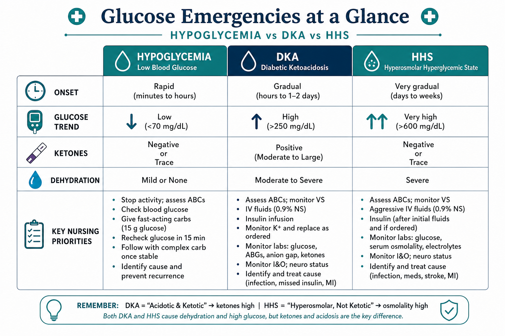

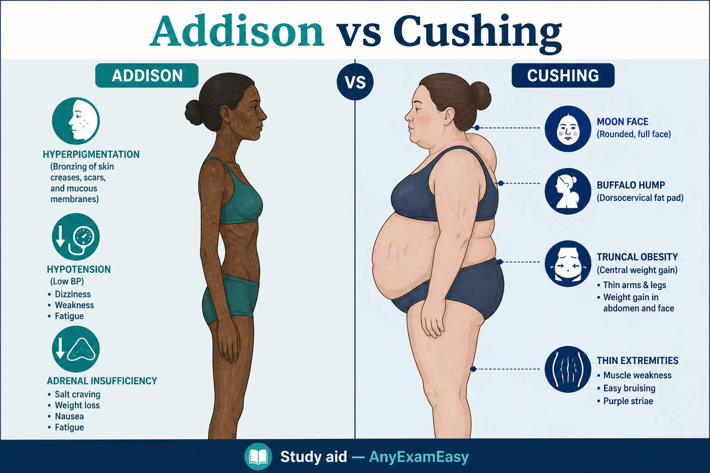

---

## Why it matters on NCLEX

Endocrine questions reward **pattern recognition** (hypo vs hyper; DKA vs HHS; thyroid extremes; SIADH vs DI) and **safe teaching** (sick days, tapering steroids, foot care, medical ID).

---

## Topic A — Diabetes mellitus & acute crises

### Pathophysiology / concept

Insulin deficiency/resistance → hyperglycemia. Chronic damage to vessels/nerves. Acute crises:

| | **Hypoglycemia** | **DKA** | **HHS** |
| --- | --- | --- | --- |
| Who | Any on insulin/secretagogues | Often T1; can be T2 | Often T2 older adults |
| Key lab vibe | Low glucose | High glucose + ketones + anion-gap acidosis | Very high glucose, profound dehydration, usually minimal ketones |
| Mental status | Shaky → confused → seizure/coma | Fruity breath, Kussmaul, abd pain | Profound lethargy/coma risk |

### Assessment cues

**Hypo (adrenergic → neuroglycopenic):** sweat, tremor, hunger, tachycardia → confusion, seizure, coma.  
**Hyper:** polyuria/polydipsia/polyphagia, blurry vision, dehydration.  
**DKA:** Kussmaul respirations, fruity breath, abdominal pain, vomiting.  
**HHS:** extreme dehydration, neuro changes, often precipitating illness.

### Somogyi vs dawn phenomenon (concepts)

Both cause morning hyperglycemia — different “why”:  
- **Dawn:** natural early-morning hormone surge → rising glucose; often needs evening dose adjustment per provider.  
- **Somogyi (rebound) theme:** nocturnal hypo → counter-regulatory rebound hyper; check **3 a.m. glucose** when taught — if low at 3 a.m. then high at breakfast, discuss with provider (may need less evening insulin, not more).  
Don’t memorize contested debates — know that **nighttime checks** guide the plan.

### Priority nursing actions

**Hypoglycemia (conscious, can swallow):** 15-15 rule concept — ~15 g fast carb, recheck ~15 min, repeat as needed; then protein/complex carb per protocol.  
**Unconscious / NPO:** glucagon IM/SQ or IV dextrose per orders — protect airway.  
**DKA/HHS:** ABCs; IV fluids first themes; insulin infusion per protocol; **monitor K⁺** (total body K⁺ depleted even if serum looks normal/high initially); treat precipitating cause; NPO; frequent labs/neuro checks.

### Medications (high-yield)

- Insulins by kinetics (rapid/short/intermediate/long) — **peak = hypo risk window**  
- Never share pens; site rotation; needle safety  
- Oral agents themes: metformin (contrast/lactic caution concepts), sulfonylurea hypo risk, SGLT2 infection/DKA awareness themes — verify current teaching  

### Client teaching — foot care & sick-day rules (fuller)

**Foot care:** inspect tops/soles/between toes daily (mirror/caregiver if needed); wash/dry carefully; moisturize (not between toes); closed leather shoes; seamless socks; never go barefoot; no bathroom surgery on calluses/ingrown nails — podiatry; report non-healing ulcers, redness, drainage.  
**Sick-day:** never stop insulin blindly when ill (stress raises glucose); check glucose more often; check ketones when taught (esp. T1); sip fluids; soft carbs if not eating; call for persistent vomiting, inability to keep fluids, moderate/large ketones, or glucose staying very high per personal parameters; know when to seek ED.  
MedicAlert themes; carry fast sugar.

### Safety / red flags

- Beta blockers may mask hypo tachycardia.  
- Drawing insulin: clear before cloudy when mixing (if mixing still taught); never mix long-acting analogs that shouldn’t be mixed.  
- Hypo unawareness in longstanding diabetes.

### Delegation notes

UAP can bring juice if RN directs after confirming hypo plan; RN interprets glucose patterns and teaches.

### Remember this

- Treat hypo now — brain needs glucose.  
- DKA/HHS: fluids + insulin protocol + potassium vigilance.  
- Peak of insulin = watch for hypo.  
- Sick days ≠ stop insulin; feet are sacred.

---

## Topic B — Thyroid disorders (including storm vs myxedema)

### Pathophysiology / concept

Thyroid hormones (T3/T4) set metabolic rate. **Hypo** = underactive (Hashimoto common). **Hyper** = overactive (Graves common). Extremes: **myxedema coma** (hypo crisis) and **thyroid storm** (hyper crisis).

### Assessment cues

| Hypothyroid | Hyperthyroid |
| --- | --- |
| Fatigue, cold intolerance, weight gain, bradycardia, constipation, dry skin | Anxiety, heat intolerance, weight loss, tachycardia, diarrhea, tremor |
| Myxedema coma: hypothermia, hypoventilation, brady, altered LOC | Storm: high fever, severe tachy/arrhythmia, delirium — emergency |

### Thyroid storm vs myxedema (contrast)

| | **Thyroid storm** | **Myxedema coma** |
| --- | --- | --- |
| Temp | High fever | Hypothermia |
| HR | Severe tachy / arrhythmia | Bradycardia |
| Neuro | Agitation → delirium | Stupor → coma |
| Trigger themes | Infection, surgery, abrupt antithyroid stop | Cold, infection, sedatives, missed levothyroxine |
| Nurse energy | Cooling, O₂, meds per protocol, ICU | Airway, warming, IV hormone per orders, cautious sedation |

### Priority nursing actions

- Hypo: levothyroxine teaching (morning empty stomach themes; don’t stop abruptly); watch for over-replacement. Myxedema: ABCs, warming, IV hormone per orders, cautious sedation.  
- Hyper: cool quiet environment; antithyroid meds/beta blockers as ordered; iodine/surgery/RAI themes. Storm: escalate care, cooling, meds per protocol.  
- Post-thyroidectomy: airway (hematoma/edema), **hypocalcemia** if parathyroids affected (tetany, Chvostek/Trousseau), laryngeal nerve injury (voice/stridor).

### Meds

- Levothyroxine: take consistently; separate from some binders/iron/calcium timing.  
- Methimazole/PTU themes: agranulocytosis teaching (fever/sore throat → report).  
- Beta blockers for symptom control in hyper.

### Client teaching

- Lifelong replacement often needed in hypo.  
- RAI: radiation precautions per instructions (sleep apart, fluid intake, avoid close contact with pregnant/infants for instructed period).  
- Report storm/myxedema warning signs.

### Remember this

Post-op thyroid = airway + calcium. Storm and myxedema are ICU-level emergencies — opposite temperature/HR patterns.

---

## Topic C — Parathyroid (hyper / hypo)

### Pathophysiology / concept

PTH raises serum calcium (bone, kidney, gut activation themes).  
**Hypoparathyroid** (often post-thyroidectomy): **low Ca²⁺**, high phosphate themes → tetany, laryngospasm risk.  
**Hyperparathyroid:** **high Ca²⁺** → stones, bones, groans, psychic moans; osteoporosis/fracture risk; dehydration.

### Priority nursing actions / teaching

- HypoCa: calcium + vitamin D as ordered; seizure/airway watch; teach early tetany signs.  
- HyperCa: hydration, mobility as tolerated, strain urine if stones; caution digoxin toxicity themes with high Ca²⁺; prepare for surgery if adenoma.

### Remember this

Post-thyroidectomy tingling/spasms = think calcium. High Ca²⁺ = stones and bones.

---

## Topic D — Adrenal: Addison vs Cushing & steroid teaching

### Pathophysiology / concept

Adrenal cortex: cortisol + aldosterone (and androgens).  
**Addison (insufficiency):** low cortisol/aldosterone → weakness, hypotension, hyperpigmentation (primary), salt craving, **hyperkalemia/hyponatremia** themes; crisis = shock.  
**Cushing (excess cortisol):** central obesity, moon face, buffalo hump, hyperglycemia, infection risk, thin skin, hypertension, mood changes — exogenous steroids common cause.

### Assessment cues

Addison crisis: profound hypotension, fever, hypoglycemia, hyperkalemia themes after stress/stopped steroids.  
Cushing: infection, poor wound healing, fractures risk, hyperglycemia.

### Priority nursing actions

**Addison / crisis:** IV fluids + glucocorticoid replacement per orders; treat hyperkalemia; never abruptly stop chronic steroids.  
**Cushing:** infection precautions; monitor glucose/BP; careful skin care; if surgical cause, post-op adrenal insufficiency risk.

### Steroid teaching (high-yield — expand)

- **Taper** — never stop chronic glucocorticoids cold turkey (adrenal crisis).  
- Take with food; morning dosing often mimics circadian rhythm as taught.  
- **Infection** risk — report fever early; may mask signs.  
- **Glucose** rises — monitor if diabetic.  
- Weight/BP/mood changes; calcium/vit D and fall precautions for bone loss themes.  
- Stress dosing concepts as taught by provider (illness/surgery may need higher doses).  
- Medical ID for adrenal insufficiency.

### Safety / red flags

Abrupt steroid cessation → adrenal crisis. Infection in Cushing can be subtle then severe.

### Remember this

Addison = need hormones + salt/volume in crisis. Cushing = protect from infection/injury. Never stop steroids cold turkey — taper, infection, glucose.

---

## Topic E — Pituitary basics & SIADH vs DI (endocrine angle)

### Concept

Posterior pituitary releases **ADH** (and oxytocin). Anterior hormones include ACTH, TSH, GH — tumors/surgery can disrupt. After pituitary surgery: watch DI (high UOP), CSF leak themes (clear drainage, halo), neuro status. (See also renal chapter for fluid/Na⁺ table — same physiology, different exam angle.)

### SIADH vs DI (endocrine view)

| | **SIADH** | **DI** |
| --- | --- | --- |
| ADH | Too much | Too little / kidneys don’t respond |
| Water | Retained | Lost as dilute urine |
| Na⁺ | Dilutional hyponatremia | Hypernatremia risk |
| Nurse | Fluid restriction as ordered; seizure precautions; slow Na⁺ correction | Replace fluids; desmopressin (central DI) as ordered; strict I&O/weights |

Triggers for SIADH themes: CNS injury, small-cell lung cancer, some meds. DI: head trauma, pituitary surgery, nephrogenic causes.

### Remember this

SIADH = soaked (low Na⁺). DI = high UOP dilute urine. Pituitary post-op → watch UOP and CSF leak cues.

---

## Concept check

**Q1.** Client on insulin is sweaty, shaky, and confused. Glucose 52 mg/dL. First action if able to swallow?  
A. Give 15 g fast-acting carbohydrate per protocol and recheck  
B. Give NPH peak dose now  
C. Start DKA insulin drip immediately  
D. Ignore — likely anxiety  

**Q2.** DKA treatment priority sequence theme?  
A. Insulin powder PO first  
B. Airway/fluids, insulin per protocol, monitor potassium  
C. Restrict all fluids  
D. Only treat with bicarbonate always first  

**Q3.** Day-1 post-thyroidectomy with stridor and expanding neck swelling. Priority?  
A. Reassure and recheck in 4 hours  
B. Support airway and notify provider/rapid response immediately  
C. Give PO calcium without assessment  
D. Ambulate in hall  

**Q4.** Client with fever, HR 150, temperature 40°C (104°F), and known hyperthyroidism. Nurse suspects:  
A. Myxedema coma — warm blankets only  
B. Possible thyroid storm — escalate, cooling, protocol meds  
C. Simple anxiety — discharge  
D. Addison crisis from too much thyroid hormone  

**Q5.** Best sick-day teaching for insulin-dependent client?  
A. Stop all insulin until appetite returns  
B. Continue insulin per plan, check glucose/ketones more often, hydrate, know call parameters  
C. Exercise intensely until ketones clear  
D. Double long-acting insulin without guidance  

**Q6.** Chronic prednisone teaching priority includes:  
A. Stop suddenly if feeling better  
B. Taper per provider; report infection; monitor glucose themes  
C. Take only at bedtime with grapefruit juice always  
D. Avoid medical ID to reduce stigma  

#### Answers

**Q1: A.** Symptomatic hypo with intact swallow → fast carb (15-15 concept).  
**Q2: B.** Fluids + insulin protocol + K⁺ vigilance.  
**Q3: B.** Airway hematoma emergency.  
**Q4: B.** Hyperthermia + severe tachy in hyperthyroid = storm pattern.  
**Q5: B.** Sick-day = don’t blindly stop insulin; monitor and call.  
**Q6: B.** Taper + infection + glucose awareness.

---

## Chapter Remember this

- Hypo kills fast — treat.  
- DKA vs HHS: ketones/acidosis vs profound hyperosmolar dehydration.  
- Dawn vs Somogyi: use nocturnal checks to guide.  
- Thyroid extremes and post-op airway/Ca²⁺; storm ≠ myxedema.  
- Parathyroid = calcium story.  
- Addison crisis vs Cushing infection/glucose; steroid taper forever teaching.  
- SIADH vs DI; pituitary post-op UOP/CSF.  
- Feet + sick days = pass-level diabetes teaching.

---

<!-- ========== 08-renal-fluids.md ========== -->

# Chapter 8 — Renal & Fluids/Electrolytes

> **Study aid only.** Exact lab reference ranges vary by laboratory. Know direction and urgency; verify local ranges. Not a dialysis prescription guide.

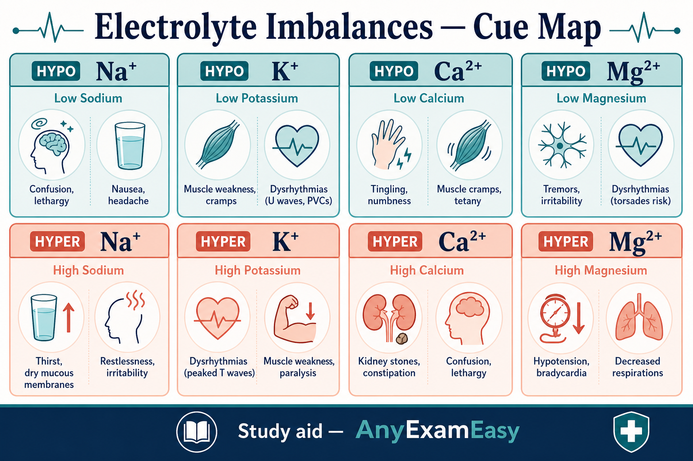

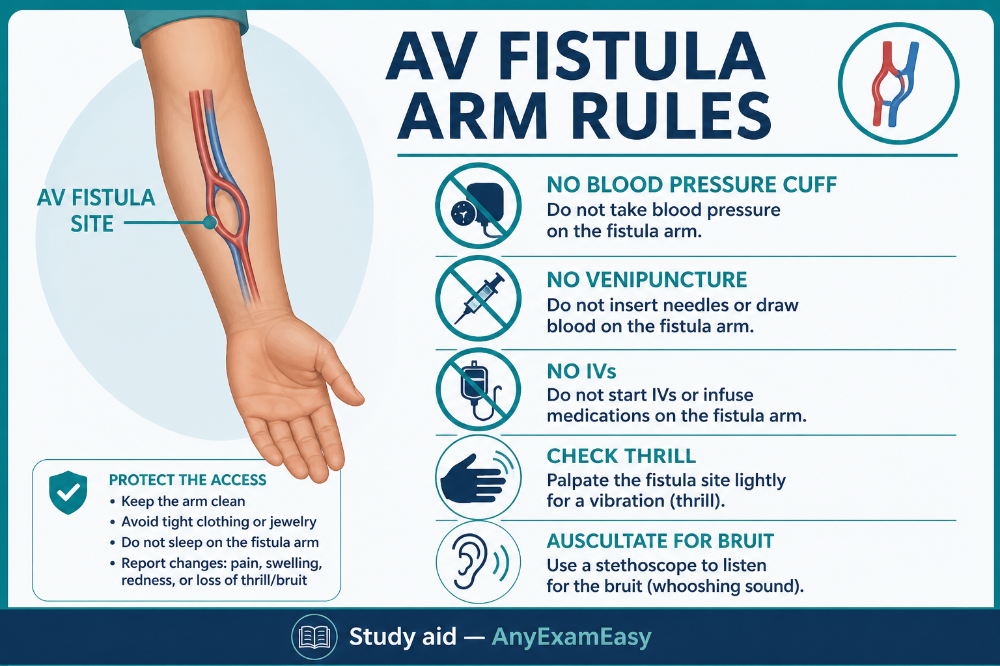

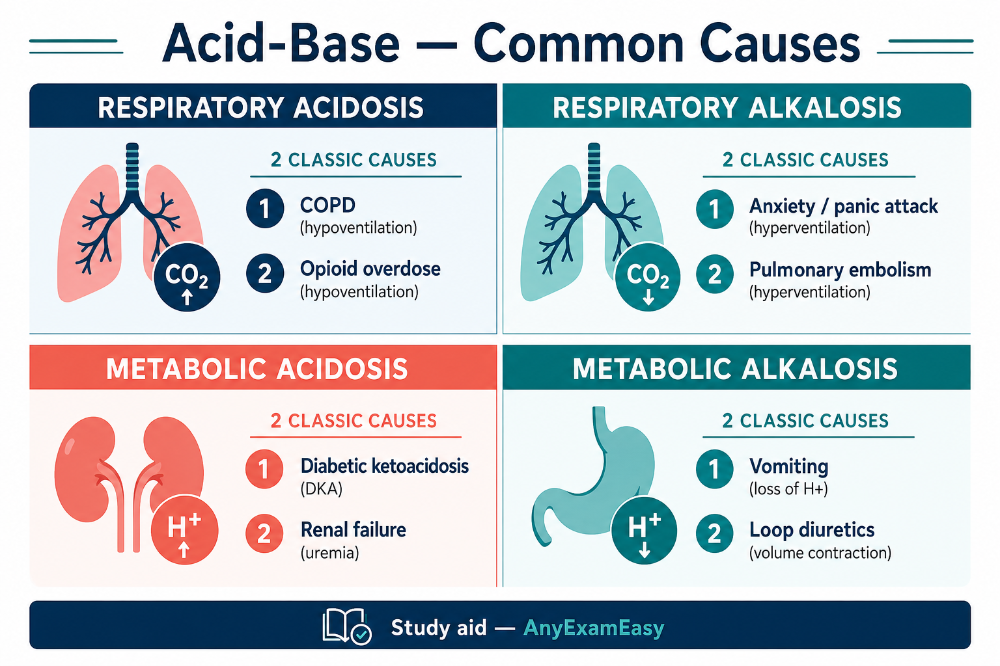

---

## Why it matters on NCLEX

Fluids/electrolytes and renal items sit at the intersection of **cardiac rhythm safety, neuro status, and medication effects**. Hyperkalemia, volume overload, transfusion reactions, and dialysis access problems are frequent “who do you see first?” drivers.

---

## Topic A — Fluids & electrolytes

### Pathophysiology / concept

Water follows sodium; potassium drives cardiac conduction; calcium drives neuromuscular stability; magnesium often rides with K⁺ issues.

### Assessment cues (high-level)

| Imbalance | Classic cues |
| --- | --- |
| **Hyponatremia** | Confusion, seizures (severe), headache |
| **Hypernatremia** | Thirst, dry mucosa, irritability/neuro changes |
| **Hypokalemia** | Weakness, dysrhythmias, U-wave themes, dig toxicity risk ↑ |
| **Hyperkalemia** | Peaked T waves, weakness, bradydysrhythmias — **emergency potential** |
| **Hypocalcemia** | Tetany, Chvostek/Trousseau, laryngospasm risk |
| **Hypercalcemia** | “Bones, stones, groans, psychic moans,” weakness |
| **Hypomagnesemia** | Torsades risk themes, reflexes ↑, accompanies low K⁺/Ca²⁺ |

### Fluid volume excess vs deficit (comparison)

| | **Fluid volume deficit** | **Fluid volume excess** |
| --- | --- | --- |
| VS vibe | Tachycardia, hypotension, weak pulses | HTN (often), bounding pulses |
| Respiratory | Clear unless weak/aspiration | Crackles, dyspnea, ↑ RR |
| Other | Dry mucosa, oliguria, poor turgor, weight loss | Edema, JVD, weight gain, S3 themes |
| Causes themes | Bleed, vomit/diarrhea, burns, DI, under-resuscitation | HF, renal failure, SIADH, iatrogenic IV fluids |
| Nurse focus | Replace per orders; treat cause; orthostatics | Restrict fluids/Na⁺ as ordered; diuretics; elevate HOB; daily weights |

Daily weights = best chronic volume tracker (same scale, same time, same clothes themes).

### Priority nursing actions

1. Telemetry when K⁺/Mg²⁺ deranged.  
2. Replace or remove electrolytes **per orders** — IV K⁺ never IV push; controlled infusion only.  
3. Seizure precautions for severe Na⁺ shifts; correct Na⁺ carefully (over-rapid correction risks demyelination themes).  
4. Hyperkalemia emergency themes: protect heart (calcium as ordered), shift K⁺ (insulin+glucose, beta agonists as ordered), remove K⁺ (binders, dialysis).

### Client teaching

- Diuretic diet: K⁺ rich vs avoid depending on drug.  
- Fluid restriction adherence when ordered (HF/SIADH/renal).  
- Report weight gains (~2–3 lb in a day or ~5 lb in a week themes — follow personal parameters).

### Safety / red flags

- IV potassium push = never.  
- Peaked T waves → escalate.  
- Rapid Na⁺ swings.

### Remember this

Treat patient + trend. K⁺ emergencies are cardiac emergencies. Weights win for volume.

---

## Topic B — Acid-base (integrated)

### Shortcut

1. Look at **pH**  
2. Look at **PaCO₂** (respiratory) and **HCO₃⁻** (metabolic)  
3. Match the one that explains pH → primary  
4. Other may compensate  

| Pattern | Example drivers |
| --- | --- |
| Resp acidosis | Hypoventilation, COPD, oversedation |
| Resp alkalosis | Hyperventilation, anxiety, PE early |
| Met acidosis | DKA, lactic shock, diarrhea |
| Met alkalosis | Vomiting, NG suction, diuretic themes |

### Remember this

Fix the cause (ventilate, perfuse, insulin for DKA, etc.).

---

## Topic C — AKI & CKD; nephrotic vs nephritic

### Pathophysiology / concept

**AKI:** sudden drop in GFR — prerenal (perfusion), intrinsic (ATN/nephritis), postrenal (obstruction).  
**CKD:** progressive irreversible loss; stages by GFR; complications = fluid overload, hyperkalemia, anemia, mineral bone disease, uremia, acidosis.

### Nephrotic vs nephritic (themes)

| | **Nephrotic** | **Nephritic** |
| --- | --- | --- |
| Hallmark vibe | Massive proteinuria → hypoalbuminemia → edema | Inflammation → hematuria (“cola” urine), HTN, oliguria |
| Other | Hyperlipidemia themes; infection/clot risk | RBC casts themes; rising Cr |
| Nurse | Skin care, infection watch, nutrition as ordered, anticoag awareness if ordered | BP control, fluid/Na⁺ management, monitor renal function |

### Assessment cues (AKI/CKD)

Oliguria/anuria, rising creatinine/BUN, hyperkalemia, metabolic acidosis, edema/HTN, uremic frost/encephalopathy late, pericarditis themes late.

### Priority nursing actions

- Map cause: fluids for prerenal if ordered; relieve obstruction; avoid nephrotoxins (NSAIDs, aminoglycosides themes).  
- Monitor I&O, daily weight, K⁺, ECG.  
- Renal diet themes: often protein/K⁺/phos/Na⁺ modifications as ordered.  
- Prepare for dialysis if refractory overload/K⁺/acidosis/uremia.  
- CKD: EPO/iron as ordered; phosphate binders **with meals**; HTN/diabetes control.

### Meds caution

- Adjust renally cleared drugs.  
- ACEI/ARB: renal protective long-term but monitor K⁺/Cr.  
- Contrast precautions (hydration as ordered).

### Client teaching

- No NSAIDs casually; med list review.  
- Fistula care if dialysis-bound.  
- Fluid/diet adherence.

### Remember this

Protect kidneys from hypoperfusion and toxins. Nephrotic = protein/edema; nephritic = blood/HTN. Hyperkalemia and volume overload drive urgency.

---

## Topic D — UTI, pyelonephritis & kidney stones

### UTI / pyelo

Lower UTI: dysuria, frequency, urgency, suprapubic discomfort.  
**Pyelonephritis:** flank pain, fever, chills, N/V — systemic; can seed sepsis.  
**Priorities:** cultures before antibiotics when possible; fluids as ordered; analgésics/antipyretics; teach wipe front-to-back, void after sex, don’t hold urine, finish antibiotics; catheter prevention (sterile insert, early removal).

### Kidney stones (urolithiasis)

Severe colicky flank pain radiating to groin, hematuria, N/V, can’t sit still.  
**Nurse:** pain control, strain all urine, hydration as ordered, ambulation, filter for stone analysis; infection + obstruction = emergency energy (fever + unrelieved pain). Teaching: fluid intake goals as ordered; diet depends on stone type (don’t invent one diet for all).

### Remember this

Fever + flank pain = pyelo/sepsis watch. Stones = pain + strain + fluids; infection with obstruction escalates.

---

## Topic E — BPH & TURP irrigation / clots

### Concept

**BPH:** prostate enlargement → urinary retention, weak stream, nocturia, overflow incontinence themes. Meds: alpha-blockers (orthostatic hypotension teaching), 5-ARI themes (sexual SE, pregnant partner handling precautions for crushed tabs).

### TURP continuous bladder irrigation (CBI)

Goal: keep catheter patent and urine pink-to-clear; prevent clot retention.  
**Nurse:** hang irrigant (usually isotonic sterile) as ordered; adjust rate so output stays without bright red clots/obstruction; measure true urine = output minus irrigant in; watch for **hyponatremia/TURP syndrome** themes (confusion, N/V, HTN or bradycardia patterns) with absorption of irrigant — report neuro changes.  
If outflow blocked (bladder spasms, no drip out): check kinks; hand-irrigate per protocol/orders only; notify if large clots persist. Secure catheter; traction as ordered; analgesics/antispasmodics as ordered.

### Remember this

CBI: pink and flowing. Bright red + clots + spasms = patency emergency. Confusion post-TURP → think TURP syndrome / Na⁺.

---

## Topic F — Dialysis nursing priorities

### Hemodialysis concepts

Blood cleaned via dialyzer; access via AV fistula/graft or catheter. Complications: hypotension, disequilibrium themes, bleed from heparin, infection, cramps.

### Fistula care rules (classic NCLEX)

- **No BP, no sticks, no tight clothes** on access arm.  
- Feel **thrill**, hear **bruit** — report absence.  
- Post-dialysis: watch bleeding, VS, hold certain meds until after session per orders (many antihypertensives held pre-dialysis).

### Peritoneal dialysis & peritonitis signs

Catheter in abdomen; dwell/drain. **Peritonitis:** cloudy effluent, abdominal pain, fever, rebound — report ASAP; save bag for culture; antibiotics as ordered (often intraperitoneal themes); sterile technique with exchanges; teach client asepsis at home. Other issues: incomplete drain (position change), protein loss, hyperglycemia from dialysate dextrose themes.

### Remember this

No BP/sticks on fistula arm. Cloudy PD fluid = infection until proven otherwise.

---

## Topic G — SIADH vs diabetes insipidus (high-yield contrast)

| | **SIADH** | **DI** |
| --- | --- | --- |
| Problem | Too much ADH → water retention | Too little ADH effect → water loss |
| Na⁺ vibe | Dilutional **hyponatremia** | **Hypernatremia** risk |
| Urine | Concentrated / low output | Large volumes dilute urine |
| Nurse focus | Fluid restriction as ordered; seizure precautions; careful Na⁺ correction | Replace fluids; desmopressin as ordered; monitor UOP/weight |

(Endocrine chapter covers pituitary/surgical angle — same ADH story.)

### Remember this

SIADH = soaked inside (low Na⁺). DI = dry pipes (high UOP, high Na⁺ risk).

---

## Topic H — IV fluid types, IV complications & transfusions

### IV fluid types (conceptual)

- **Isotonic** (NS, LR): volume expansion — watch overload.  
- **Hypotonic** (0.45% NaCl): pushes water into cells — avoid in ICP risk.  
- **Hypertonic** (3% NaCl): pulls water from cells — ICU-level monitoring for severe hyponatremia.  
- Colloids/blood: follow transfusion rights and reactions protocol.

### IV complications

| Problem | Cues | Nurse actions (themes) |
| --- | --- | --- |
| **Infiltration** | Cool, pale, swollen site; damp dressing | Stop IV; remove per policy; elevate; warm/cold per fluid type/policy; restart elsewhere |
| **Phlebitis** | Red, warm, streak, tender cord | Stop/remove; warm compress themes; restart other arm; culture if ordered |
| **Extravasation** | Vesicant leak — burning, blistering, necrosis risk | **Stop**; don’t flush; aspirate residual if policy; antidote/protocol; notify; mark area |
| **CLABSI risk** | Fever, chills with central line | Sterile care; scrub hub; report |

### Blood transfusion reactions — deeper algorithm

1. **Stop transfusion immediately** — keep IV line open with **NS** (new tubing themes per policy).  
2. Stay with client; VS; notify provider **and** blood bank.  
3. Recheck identifiers; save blood bag/tubing for lab per policy — don’t casually discard.  
4. Support ABCs; meds (antihistamine, epinephrine, diuretics) as ordered by reaction type.  
5. Document; collect urine if hemolysis suspected (hemoglobinuria).

| Reaction vibe | Cues | Energy |
| --- | --- | --- |
| Acute hemolytic | Fever, flank/chest pain, hypotension, hemoglobinuria (ABO mismatch) | Emergency — stop, support, blood bank |
| Febrile non-hemolytic | Fever, chills, headache | Stop, antipyretic as ordered |
| Allergic | Urticaria, itching ± anaphylaxis | Stop; antihistamine/epi as ordered |
| TACO | Dyspnea, crackles, HTN during/after volume | Stop/slow; sit up; diuretic as ordered |
| TRALI themes | Acute dyspnea/hypoxia, non-cardiogenic pulmonary edema vibe | Stop; O₂/ventilatory support; report |

Two-nurse check, baseline VS, stay first 15 minutes themes — follow facility.

### Remember this

Match fluid tonicity to the problem. Infiltration ≠ extravasation (vesicants escalate). Transfusion reaction → **stop first**, NS, notify, save bag.

---

## Concept check

**Q1.** Client with K⁺ 6.8 mEq/L and peaked T waves. Priority theme?  
A. Encourage banana smoothie  
B. Cardiac monitoring and emergent hyperkalemia treatment per protocol  
C. Wait for next morning labs only  
D. Give spironolactone  

**Q2.** Teaching for new AV fistula includes:  
A. BP measurements on that arm are preferred  
B. No BP or venipuncture on access arm; report loss of thrill  
C. Sleep only on fistula arm to protect it  
D. Ignore redness at site  

**Q3.** Best indicator of fluid volume status over days?  
A. Single random urine color photo  
B. Daily weights same conditions  
C. One-time BP in triage  
D. Subjective thirst alone  

**Q4.** PD client reports cloudy dialysate and abdominal pain. Priority?  
A. Reassure that cloudiness is normal forever  
B. Suspect peritonitis — notify provider, save effluent for culture, follow infection protocol  
C. Increase dwell without assessment  
D. Remove catheter at bedside without orders  

**Q5.** During CBI after TURP, no output and client has bladder spasms. First checks?  
A. Ignore — spasms are entertainment  
B. Check tubing kinks/clots/patency; irrigate only per protocol; notify if unresolved  
C. Clamp irrigant and leave for night shift  
D. Force oral fluids only  

**Q6.** Fifteen minutes into a PRBC transfusion, client has flank pain, fever, and hypotension. First action?  
A. Slow the rate and reassess tomorrow  
B. Stop transfusion, maintain IV with NS, notify provider/blood bank, support ABCs  
C. Give another unit to dilute  
D. Discard all tubing immediately in regular trash before calling  

#### Answers

**Q1: B.** Hyperkalemia with ECG changes = emergency pathway.  
**Q2: B.** Protect the access arm; thrill/bruit checks.  
**Q3: B.** Daily weights win for trends.  
**Q4: B.** Cloudy PD + pain = peritonitis until proven otherwise.  
**Q5: B.** Patency first for CBI obstruction.  
**Q6: B.** Acute hemolytic pattern — stop, NS, notify, save equipment per policy.

---

## Chapter Remember this

- Electrolyte danger zones — especially K⁺ — are cardiac/neuro emergencies.  
- Never IV push potassium; FVE vs FVD comparison.  
- AKI causes: pre / intra / post; nephrotic vs nephritic themes.  
- CKD complications: volume, K⁺, anemia, bones.  
- UTI/pyelo/stones; BPH/TURP CBI patency + TURP syndrome watch.  
- Fistula arm sacred; PD peritonitis = cloudy bag.  
- IV complications + transfusion: stop reaction first.  
- SIADH vs DI fluid/Na⁺ story.

---

<!-- ========== 09-gi-hepatic.md ========== -->

# Chapter 9 — GI & Hepatic

> **Study aid only.** GI bleed and liver failure management follow facility protocols — verify. Not endoscopic procedure guidance.

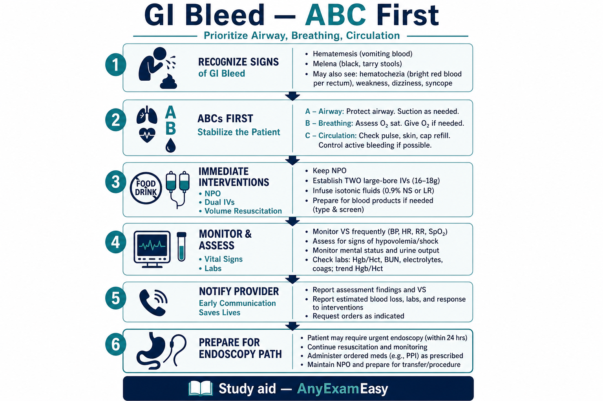

---

## Why it matters on NCLEX

GI/hepatic stems mix **ABCs (bleed, airway in hematemesis), neuro (encephalopathy), and fluid/electrolyte** judgment. Pancreatitis, obstruction, gallbladder disease, and feeding-tube safety add pain + shock + aspiration risk. Expect priority, SATA, and “what do you teach?” items.

---

## Topic A — GI bleed

### Pathophysiology / concept

Upper (PUD, varices, Mallory-Weiss, erosive gastritis) vs lower (diverticular, angiodysplasia, colitis, hemorrhoids). Blood loss → hypovolemic shock. **Esophageal varices** in portal hypertension can bleed torrentially — treat as ABC emergency until proven otherwise. Melena often points upper; bright hematochezia may be lower *or* brisk upper.

### Assessment cues

**Early:** restlessness, thirst, orthostatic dizziness, mild tachycardia.  
**Progressing:** hematemesis, coffee-ground emesis, melena, hematochezia; cool clammy skin; oliguria; syncope.  
**Late / shock:** hypotension, altered LOC, metabolic acidosis themes. Hgb drop **lags** acute bleed — don’t wait for labs if the client is crashing.

### Priority nursing actions

1. ABCs — airway if vomiting blood; suction ready; NPO.  
2. Two large-bore IVs; fluid/blood products as ordered; type & cross.  
3. Continuous VS; stay with unstable client.  
4. Notify provider; prepare for endoscopy / balloon tamponade themes as ordered.  
5. Proton pump inhibitor infusion themes as ordered; **octreotide** for varices as ordered.  
6. Avoid NSAIDs; reverse anticoags if ordered; bleeding precautions.

### Esophageal varices bleeding priorities

- Volume + airway first; don’t leave client alone.  
- Avoid straining, vomiting when possible (antiemetics as ordered); soft foods only when cleared.  
- No blind NG placement in known varices unless ordered by experienced provider — facility rules apply.  
- After bleed: lactulose if encephalopathy risk; alcohol cessation teaching; beta-blocker prophylaxis themes as ordered.

### Safety / red flags

- Bright red hematemesis + hypotension  
- Known cirrhosis + bleed = varices until proven otherwise  
- Rising HR before BP falls — early hypovolemia cue

### Remember this

Volume and airway first. Don’t feed an unstable bleeder. Varices = torrential bleed potential.

---

## Topic B — GERD, PUD & H. pylori

### Pathophysiology / concept

**GERD:** LES relaxation → acid reflux → esophagitis, Barrett risk long-term, aspiration risk if severe.  
**PUD:** mucosal break in stomach/duodenum — *H. pylori* and NSAIDs are classic drivers; complications = bleed, perforation, obstruction (pyloric).

### Assessment cues

GERD: heartburn, regurgitation, worse after meals/lying flat, chronic cough/hoarseness themes.  
PUD: epigastric pain — duodenal often relieved by food; gastric may worsen with food; melena/hematemesis if bleeding; rigid abdomen if perforation.

### Priority nursing actions / teaching

- Elevate HOB; small meals; avoid late-night eating, alcohol, caffeine, peppermint, chocolate, fatty foods as individually trigger-linked.  
- Sit upright after meals; smoking cessation.  
- PPIs/H2 blockers as ordered — take PPI before meals per teaching.  
- **H. pylori:** complete full antibiotic + PPI regimen (adherence prevents resistance/relapse).  
- NSAID avoidance or gastroprotection per orders; report black stools / severe sudden pain.

### Safety / red flags

Sudden severe abdominal pain + board-like abdomen after PUD history = perforation → surgical emergency energy.

### Remember this

GERD = lifestyle + acid suppression. PUD bleed/perforation = ABCs and escalate. Finish *H. pylori* therapy.

---

## Topic C — Pancreatitis

### Pathophysiology / concept

Autodigestion of pancreas (gallstones/alcohol common). Cytokine storm → third-spacing, ARDS, hypocalcemia, hyperglycemia risk. Severity ranges from mild edematous to necrotizing.

### Assessment cues

**Early:** severe epigastric pain radiating to back, N/V, worse lying flat.  
**Progressing:** fever, tachycardia, volume depletion.  
**Concerning:** Cullen/Grey-Turner rare late; ↑ lipase/amylase themes; hypocalcemia tetany; dyspnea (ARDS).

### Priority nursing actions

- NPO; aggressive IV fluids as ordered; pain control (often opioids).  
- Antiemetics; glucose monitor; electrolyte replace.  
- Position for comfort (fetal/side-lying).  
- Watch ARDS/shock; ERCP themes if gallstone etiology.  
- Advance diet slowly when pain/enzymes improve per orders; jejunal feeding themes sometimes used.

### Teaching

Alcohol cessation; low-fat diet when restarted; gallstone follow-up; report severe recurrent pain.

### Remember this

Rest the pancreas (NPO), fluids, pain control, watch calcium and lungs.

---

## Topic D — Cholecystitis & biliary colic

### Pathophysiology / concept

Gallstones (cholelithiasis) obstruct cystic duct → inflammation (**cholecystitis**). Fat intolerance common. Risk themes: “fair, fat, fertile, forty” is a mnemonic — not destiny. Choledocholithiasis / ascending cholangitis = fever, jaundice, RUQ pain (Charcot themes) — escalate.

### Assessment cues

RUQ / epigastric pain radiating to right shoulder/scapula, especially after fatty meal; N/V; fever; positive Murphy-type pain themes; dark urine/clay stools if CBD obstructed.

### Priority nursing actions

- NPO if acute; IV fluids; analgesia; antiemetics; antibiotics as ordered.  
- Prepare for cholecystectomy (lap themes); post-op: early ambulation, shoulder gas pain teaching, low-fat diet progression.  
- T-tube care if present: drainage character/amount; keep bag below insertion; report sudden cessation or bilious peritonitis signs.

### Remember this

RUQ after fatty meal = biliary until proven otherwise. Fever + jaundice + pain = cholangitis concern — escalate.

---

## Topic E — Appendicitis vs peritonitis

### Pathophysiology / concept

Appendicitis: lumen obstruction → inflammation → possible rupture → **peritonitis**. Peritonitis = peritoneal inflammation from perforation, trauma, or spontaneous (ascites) — fluid shifts and sepsis risk.

### Assessment cues

**Appendicitis early:** periumbilical pain → migrates to RLQ (McBurney); anorexia, low-grade fever, rebound/guarding.  
**Rupture / peritonitis:** pain may briefly ease then diffuse; rigid board-like abdomen, rebound, fever, tachycardia, absent bowel sounds, shock.

### Priority nursing actions

- NPO; IV access; no heating pads to abdomen (may ↑ perforation risk conceptually).  
- Avoid laxatives/enemas if appendicitis suspected.  
- Pain control after assessment baseline; prep for surgery.  
- Post-rupture: antibiotics, drains, sepsis vigilance.

### Safety / red flags

Sudden relief of appendicitis pain can mean rupture — not “cured.” Rigid abdomen + fever = escalate now.

### Remember this

RLQ migratory pain = appendicitis pattern. Rigid abdomen = peritonitis emergency vibe.

---

## Topic F — Liver failure, ascites & hepatic encephalopathy

### Pathophysiology / concept

Liver fails to synthesize clotting factors/albumin, detoxify ammonia, handle bilirubin → coagulopathy, ascites/edema, jaundice, encephalopathy. Portal hypertension → varices/ascites. **Ascites** = fluid in peritoneum; large-volume **paracentesis** can drop BP — albumin as ordered.

### Assessment cues

Jaundice, ascites, spider angiomas, bruising/bleeding, asterixis, confusion/coma, fetor hepaticus themes; ↑ INR, ↑ bili, ↓ albumin, ↑ ammonia themes.

### Priority nursing actions

1. Neuro checks; safety for confused clients.  
2. Lactulose as ordered — goal is improved mentation / stooling per parameters.  
3. Low-protein only if specifically ordered in acute encephalopathy (nutrition has nuance — follow orders).  
4. Bleeding precautions; soft toothbrush; fall risk.  
5. Ascites: sodium restriction, diuretics (spironolactone ± loop), measure abdominal girth/daily weight.  
6. Paracentesis assist: void first if ordered; baseline VS; watch post-tap hypotension; sterile field; send fluid if infection suspected.  
7. Avoid hepatotoxic meds/alcohol; dose-adjust drugs.

### Meds (high-yield)

- Lactulose / rifaximin themes for encephalopathy  
- Vitamin K / FFP/blood products as ordered for bleed  
- Spironolactone ± loop for ascites  

### Client teaching

- Why lactulose matters (trap ammonia via stooling).  
- No alcohol; med review; infection reporting (**SBP** risk with ascites — fever + abd pain).  
- Skin care with jaundice/pruritus.

### Safety / red flags

- Sudden confusion in cirrhotic = encephalopathy until proven otherwise  
- GI bleed in cirrhotic  
- Fever + ascites = possible spontaneous bacterial peritonitis  

### Remember this

Encephalopathy → lactulose + safety. Cirrhosis = bleed risk. Protect airway if obtunded. Post-paracentesis = watch BP.

---

## Topic G — Bowel obstruction

### Pathophysiology / concept

Mechanical (adhesions, hernia, tumor, volvulus) or paralytic ileus. Proximal dilation, vomiting, fluid shifts, ischemia/perforation risk → peritonitis.

### Assessment cues

Crampy pain, distention, vomiting (feculent if distal), high-pitched → absent bowel sounds progression, obstipation; XR/CT air-fluid levels themes.

### Priority nursing actions

- NPO; NG decompression as ordered.  
- IV fluids/electrolytes; pain control; antiemetics.  
- Monitor for peritonitis (rigid abdomen, rebound, fever) → surgical emergency energy.  
- Ambulation for ileus prevention post-op when appropriate.

### Remember this

NPO + decompress + fluids; peritonitis signs = escalate now.

---

## Topic H — Inflammatory bowel, diverticulitis, dumping & ostomy

### Ulcerative colitis vs Crohn’s (pattern)

UC: continuous colon, bloody diarrhea. Crohn’s: skip lesions anywhere, fistulas possible. Both: dehydration, anemia, infection risk with immunosuppressants/biologics.

### Diverticulitis

LLQ pain, fever; NPO/clear liquids as ordered; antibiotics; avoid barium/colonoscopy in acute flare per orders; watch perforation/abscess. Later: high-fiber teaching when stable (acute phase often low-fiber/NPO first).

### Dumping syndrome (post-gastrectomy high-yield)

Rapid gastric emptying → hyperosmolar load → fluid shift + reactive hypo themes.  
**Cues:** diaphoresis, tachycardia, dizziness, diarrhea soon after meals; late hypoglycemia possible.  
**Teaching:** small frequent meals; separate liquids from solids; high protein/fat, lower simple carbs; lie down after meals as taught; avoid extreme sweets.

### Ostomy care basics

- Stoma should be **pink/red and moist** — pale/dusky/black = perfusion emergency.  
- Empty pouch when ~1/3–1/2 full; skin barrier integrity; measure wafer to fit closely.  
- Ileostomy: liquid output, dehydration/electrolyte risk; colostomy: more formed distally.  
- Psychosocial support; diet trial-and-error; gas/odor management teaching.

### Priority nursing actions (IBD flare)

- I&O, electrolytes, skin care for diarrhea.  
- Nutrition support; monitor for megacolon/perforation (distention, rigidity, shock).  
- Immunosuppressant infection teaching.

### Remember this

Rigid abdomen in IBD/diverticulitis = perforation. Purple stoma = call now. Dumping = small meals, fluids between meals.

---

## Topic I — Hepatitis A/B/C teaching & precautions

### Concept

| Type | Transmission (exam lens) | Notes |
| --- | --- | --- |
| **A** | Fecal-oral (food/water, poor hand hygiene) | Vaccine; acute; hygiene teaching |
| **B** | Blood/body fluids, perinatal, sexual | Vaccine; chronic risk → cirrhosis/HCC |
| **C** | Blood (sharing needles historically high) | No vaccine; treatable with antivirals themes; chronic risk |

### Nursing priorities

Standard precautions always; teach no sharing razors/needles/toothbrushes; safe-sex themes for B/C; hand hygiene for A; reportable diseases per public health; rest; avoid alcohol/hepatotoxins; vaccination for A/B when indicated.

### Remember this

Know transmission route for teaching and isolation decisions. Hep B vaccine protects; Hep C is blood-focused teaching.

---

## Topic J — TPN & enteral feeding safety

### Enteral (tube feeding)

- Confirm placement per policy before each use (x-ray initial; mark tube; residual/pH per protocol — follow facility).  
- HOB ↑ ~30–45° during and after feeds to cut aspiration.  
- Flush; check residuals as ordered; don’t mix meds into formula casually.  
- Formula room-temp; change bags/tubing per policy; glucose/electrolyte/diarrhea monitoring.

### TPN (parenteral)

- Central line preferred for hypertonic TPN; dedicated lumen themes.  
- Aseptic technique; filter as ordered; refrigerate unused; hang times limited.  
- Monitor glucose (often q6h themes), electrolytes, infection (CLABSI), fluid balance.  
- **Never** abruptly stop without dextrose plan — rebound hypo risk.  
- If next bag late: per policy often D10 at same rate via central line until TPN arrives — know facility rule.

### Safety / red flags

Aspiration during tube feed; TPN bag with precipitates/cracks; fever in TPN client; sudden stop of TPN.

### Remember this

Enteral: HOB up + placement check. TPN: sterile + glucose + don’t stop cold.

---

## Concept check

**Q1.** Client with hematemesis, HR 130, BP 86/50. First priority cluster?  
A. Immediate cheeseburger for comfort  
B. Airway/NPO, large-bore IV access, fluid resuscitation per orders, stay with client  
C. Outpatient teaching pamphlet only  
D. Ambulate to bathroom alone  

**Q2.** Cirrhotic client becomes confused with asterixis. Expected ordered therapy theme?  
A. Lactulose to improve mentation  
B. High-dose NSAIDs  
C. Immediate high-protein binge without orders  
D. Soft restraints as first line without assessment  

**Q3.** Pancreatitis pain management and care theme includes:  
A. Immediate high-fat feast  
B. NPO, IV fluids, analgesia as ordered  
C. Encourage alcohol “in moderation” tonight  
D. Dry fasting without IV access  

**Q4.** Client 2 weeks post-gastrectomy has diaphoresis, tachycardia, and diarrhea 20 minutes after a sugary meal. Best teaching emphasis?  
A. Drink large fluids with every sweet meal  
B. Small frequent meals, separate liquids from solids, limit simple sugars  
C. Lie flat during meals and chug soda  
D. Resume three large high-carb meals  

**Q5.** Neutropenic precautions do **not** apply here — but which hepatitis teaching is correct?  
A. Hep A: bloodborne only; ignore handwashing  
B. Hep B/C: avoid sharing razors/needles; discuss transmission and vaccination (B) / treatment themes (C)  
C. All hepatitis types are airborne — N95 always  
D. Alcohol is encouraged in chronic Hep C  

**Q6.** During large-volume paracentesis, priority nursing vigilance includes:  
A. Encouraging a heavy meal mid-procedure  
B. Baseline/ongoing VS, empty bladder if ordered, watch for post-tap hypotension  
C. Removing albumin orders as irrelevant  
D. Ambulating immediately if dizzy  

#### Answers

**Q1: B.** Hypovolemic shock from GI bleed — ABCs/volume.  
**Q2: A.** Hepatic encephalopathy — lactulose cornerstone theme.  
**Q3: B.** Rest pancreas, fluids, pain control.  
**Q4: B.** Classic dumping syndrome teaching.  
**Q5: B.** Transmission-matched teaching; Hep B vaccine; Hep C blood-focused.  
**Q6: B.** Paracentesis safety = VS + bladder + post-tap BP watch.

---

## Chapter Remember this

- GI bleed: ABCs and volume; NPO; varices can be torrential.  
- GERD/PUD: lifestyle + PPI; finish *H. pylori* Rx; watch perforation.  
- Pancreatitis: NPO, fluids, pain, Ca²⁺/lungs.  
- Cholecystitis: RUQ after fat; cholangitis triad = escalate.  
- Appendicitis → peritonitis: migratory RLQ then rigid abdomen.  
- Liver: encephalopathy (lactulose), bleed risk, ascites/SBP, paracentesis BP.  
- Obstruction: decompress; watch perforation.  
- Dumping: small meals, fluids between; ostomy pink & moist.  
- Hepatitis: know route; vaccines for A/B.  
- Enteral HOB up; TPN sterile + glucose + no abrupt stop.

---

<!-- ========== 10-other-medsurg.md ========== -->

# Chapter 10 — Other Med-Surg (MSK, Immuno/Onc, Integument/Burns, Hematology)

> **Study aid only.** Oncologic emergencies and burn fluid formulas are facility/protocol-driven — verify. Not a procedural manual.

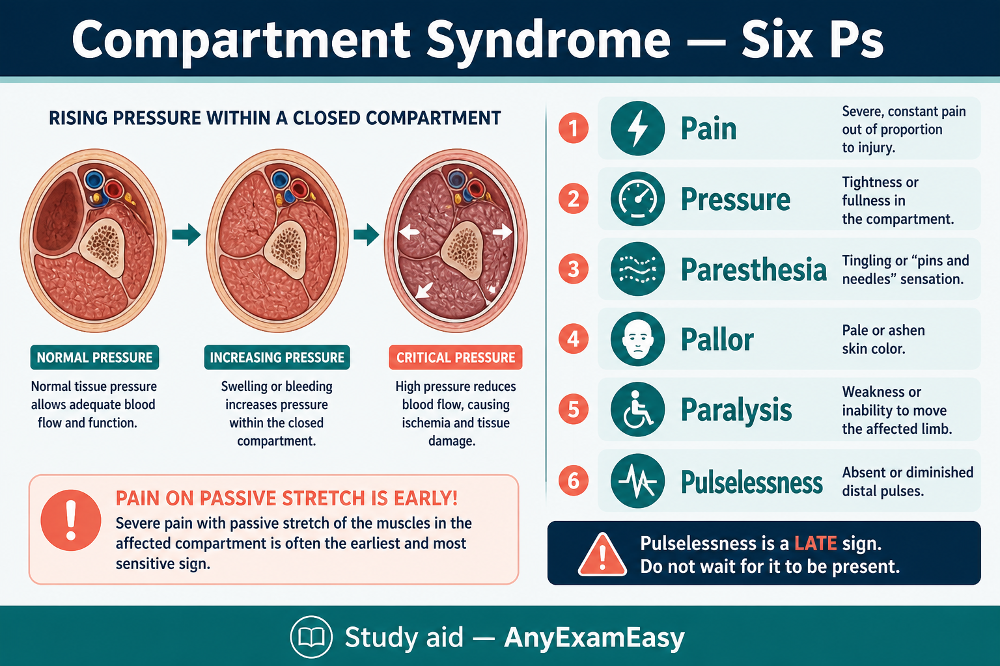

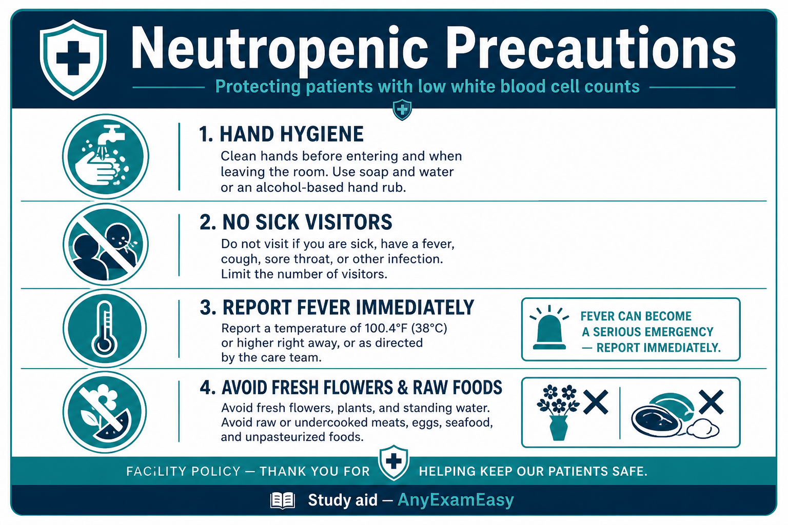

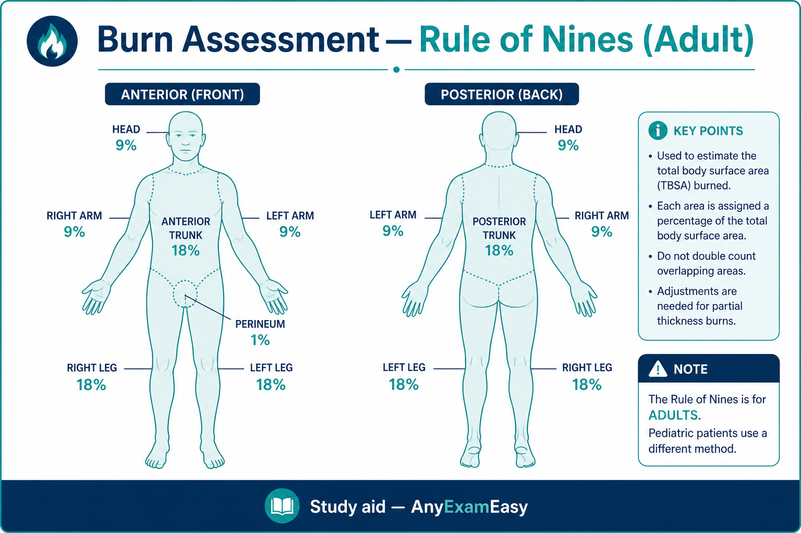

---

## Why it matters on NCLEX

These “other” topics show up as **safety bombs**: compartment syndrome, neutropenia fever, burns ABCs, HIT bleeding/clotting paradox, sickle crisis, DIC, chemo/radiation safety. High yield for priority and SATA.

---

## Topic A — Fractures, compartment syndrome, osteoporosis & hip fracture

### Pathophysiology / concept

Bone break → bleeding, soft-tissue swelling. Casts/edema in closed fascial compartments → rising pressure → ischemia of muscle/nerve (**compartment syndrome**) — time-critical limb threat. Fat embolism risk after long-bone/pelvic fractures (esp. young adults).  
**Osteoporosis:** low bone mass → fragility fractures (hip, spine, wrist). **Hip fracture** in older adults: fall risk, delirium, DVT/pneumonia/skin breakdown post-op.

### Assessment cues

Fracture: pain, deformity, loss of function, crepitus, swelling.  
**Compartment (6 Ps themes):** Pain out of proportion / pain on passive stretch (early), Pressure, Paresthesia, Pallor, Paralysis (late), Pulselessness (**late** — don’t wait for it).  
Fat embolism: respiratory distress, neuro changes, petechiae themes after fracture.  
Hip fracture: shortened externally rotated leg themes; groin/hip pain; can’t bear weight.

### Priority nursing actions

1. Immobilize; neurovascular checks distal to injury **frequently**.  
2. Elevate per orders (but if compartment suspected, elevation may be limited — follow protocol; notify provider **immediately**).  
3. Ice as ordered; pain control; tetanus status.  
4. Open fracture: cover with sterile dressing; antibiotics as ordered.  
5. Traction care: weights hang free; alignment; skin/pin care.  
6. Fat embolism: O₂, support ABCs, notify provider.  
7. Hip fracture: ABCs, pain, immobilize as ordered; post-op: abduction pillow themes per prosthesis type, NV checks, DVT prophylaxis, early PT as ordered, delirium watch, skin care; don’t flex hip acutely beyond ordered limits for some approaches.

### Osteoporosis teaching

Weight-bearing exercise as cleared; calcium/vit D per plan; fall prevention (home hazards, vision, meds); bisphosphonate teaching themes (upright after dose, water, esophageal irritation); smoking/alcohol reduction.

### Client teaching (casts)

Keep dry; don’t stick objects inside; report numbness/color change/increased pain; mobility/weight-bearing as ordered; DVT prevention.

### Safety / red flags

Pain out of proportion after cast/fracture = compartment until proven otherwise. Pulseless is late. Sudden dyspnea after long-bone fracture = fat embolism concern.

### Delegation notes

UAP can report client complaints of numbness; RN performs NV assessment.

### Remember this

Compartment = pain out of proportion + passive stretch pain → call now. Hip fracture = NV + DVT + delirium + positioning rules.

---

## Topic B — Rheumatoid vs osteoarthritis, gout

### Comparison (teaching lens)

| | **Osteoarthritis** | **Rheumatoid arthritis** |
| --- | --- | --- |
| Pattern | Wear-and-tear; weight-bearing joints | Autoimmune; symmetric small joints common |
| Stiffness | Worse with use; brief morning stiffness | Prolonged morning stiffness |
| Systemic | Local | Fatigue, fever themes, extra-articular possible |
| Care themes | Weight loss, exercise, acetaminophen/NSAIDs per orders, joint protection | DMARDs/biologics infection risk, energy conservation, flare planning |

### Gout

Uric acid crystal arthritis — often great toe. Acute: severe pain, swelling, redness. Teaching: meds as ordered (colchicine/NSAIDs/steroids acute; allopurinol chronic themes — don’t start/stop casually during acute flare without orders); hydrate; limit alcohol/purine-heavy patterns as taught; avoid triggering crash diets.

### Remember this

OA = use-related; RA = autoimmune systemic + infection risk on immunosuppressants. Gout = hydrate + med adherence + flare vs prevention teaching.

---

## Topic C — Immuno / oncology, SLE, chemo/radiation safety

### Pathophysiology / concept

Chemo/radiation suppress marrow → **neutropenia** (infection risk), thrombocytopenia (bleed), anemia (fatigue/O₂ carry). Oncologic emergencies: febrile neutropenia, tumor lysis, SVC syndrome, spinal cord compression (high-level recognition).  
**SLE (lupus):** autoimmune multisystem — butterfly rash themes, photosensitivity, arthritis, renal/CNS involvement possible; flares with sun/stress/infection; immunosuppressant infection risk.

### Assessment cues

Fever in neutropenic client = emergency energy even if they “look okay.” Mucositis, cough, dysuria may be muted. ANC low. SLE: new edema/HTN (renal), chest pain, neuro changes — escalate.

### Priority nursing actions

**Neutropenic precautions themes:** private room when indicated; hand hygiene; avoid sick visitors/fresh flowers per policy; no rectal temps; meticulous oral care; cultures + prompt antibiotics for fever as ordered.  
Soft toothbrush; avoid invasive procedures when possible; bleed precautions if platelets low.  
Tumor lysis: hydration, allopurinol/rasburicase themes, monitor K⁺/phos/uric acid/Ca²⁺.

### Chemo / radiation safety for nurses

- Chemo: PPE per policy for mixing/admin/disposal; don’t crush chemo casually; spill kits; pregnant staff often restricted from handling — follow policy.  
- Extravasation: know vesicant protocols — stop infusion, don’t just “flush harder,” follow antidote/protocol.  
- Radiation: time, distance, shielding; cluster care; dosimeter when required; sealed source — tongs/lead container themes; body fluids may have restrictions after some therapies — follow radiation safety officer rules.  
- Skin: don’t wash off markings; gentle skin care; report moist desquamation.

### Skin cancer ABCDE teaching

**A**symmetry, **B**order irregularity, **C**olor variation, **D**iameter (concerning if growing / often taught >6 mm themes), **E**volving — report changing moles; sun protection (SPF, shade, no tanning beds).

### Client teaching

- Report fever immediately (exact threshold per oncology team).  
- Food safety; avoid crowds when counts nadir.  
- Electric razor; avoid contact sports if platelets low.  
- SLE: sunscreen, med adherence, report infection/flare cues, contraception counseling if teratogenic meds.

### Safety / red flags

Febrile neutropenia. Uncontrolled chemo nausea → dehydration. New back pain + leg weakness in cancer client (cord compression). Facial/arm swelling + cancer (SVC).

### Remember this

Fever + neutropenia = urgent antibiotics pathway. Chemo = PPE + extravasation know-how. ABCDE for skin lesions. SLE = sun + infection + organ flare watch.

---

## Topic D — Integument, pressure injuries, wound healing & burns

### Pressure injury staging (review)

- **Stage 1:** non-blanchable erythema, intact skin.  
- **Stage 2:** partial-thickness; blister/abrasion themes.  
- **Stage 3:** full-thickness skin loss; fat may show; no exposed bone/tendon/muscle.  
- **Stage 4:** exposed bone/tendon/muscle.  
- **Unstageable:** base obscured by eschar/slough.  
- **DTPI:** deep maroon/purple discoloration themes.  
Never reverse-stage (“Stage 4 healing” not “Stage 2”). Turn q2h themes; offload heels; nutrition (protein/calories); moisture management; support surfaces.

### Wound healing factors

Favor: perfusion, nutrition, glycemic control, moist wound healing as ordered, clean technique. Impair: smoking, steroids, infection, ischemia, malnutrition, edema, radiation.

### Burns — pathophysiology / concept

Burns destroy skin barrier → fluid loss, infection, heat loss. Depth: superficial → partial → full thickness. Rule of nines themes for TBSA adult. Capillary leak early → hypovolemia; then fluid remobilization later.

### Assessment cues (burns)

Airway: facial burns, singed nasal hair, hoarseness, carbonaceous sputum → **inhalation injury**. Circumferential chest burns → ventilation restriction. Pain severe in partial thickness; full thickness may be insensate.

### Priority nursing actions (burns)

1. **Airway** first — early intubation themes if inhalation suspected.  
2. Stop burning process; remove constricting jewelry/clothing if not stuck.  
3. Fluid resuscitation per protocol (Parkland-style concepts — large burns need aggressive LR themes as ordered).  
4. Warm environment; sterile/clean dressing per protocol; tetanus.  
5. Pain control; monitor UOP as resuscitation endpoint theme (~0.5 mL/kg/hr adults commonly cited — confirm orders).  
6. Infection prevention; nutrition (hypermetabolic).  
7. Circumferential limb: watch compartment; escharotomy as provider procedure.

### Client teaching / rehab themes

Positioning to prevent contractures; PT/OT; sun protection of healed skin; psychosocial support.

### Safety / red flags

Hoarse voice after smoke exposure. Drooling/stridor. Circumferential torso burn with rising ventilatory pressures.

### Remember this

Burns: airway > fluids > infection/pain/contractures. Pressure injuries: stage accurately, offload, nutrition. Don’t reverse-stage.

---

## Topic E — Hematology: anemia, sickle cell, HIT, DIC

### Anemia concept

↓ RBC/Hgb → fatigue, pallor, dyspnea on exertion, tachycardia. Causes: blood loss, hemolysis, production failure (iron/B12/folate, marrow).

### Sickle cell crisis priorities

Vaso-occlusive pain crises, infection risk (functional asplenia themes), acute chest syndrome (chest pain, fever, hypoxia — emergency energy), stroke risk.  
**Priorities:** fluids, opioids (believe the pain), O₂ if hypoxic, treat infection triggers, incentive spirometry themes, warm environment, hydroxyurea teaching themes as ordered; avoid high altitude/dehydration extremes as taught.

### HIT (heparin-induced thrombocytopenia) high-level

Immune reaction to heparin → **platelet drop** with **paradoxical thrombosis** risk. Stop all heparin (including flushes) as ordered; use alternative anticoagulation per protocol; avoid platelet transfusions routinely in HIT (can worsen thrombosis — follow specialist orders). Timing often 5–10 days after heparin, or sooner if re-exposed.

### DIC overview

Widespread clotting → consumption of platelets/factors → **bleeding + clotting together**. Triggers: sepsis, trauma, abruptio, malignancy. Cues: oozing from sites, petechiae, ↑ PT/PTT themes, ↓ platelets/fibrinogen, ↑ D-dimer themes.  
**Nurse:** treat cause; support ABCs; blood products as ordered; avoid unnecessary sticks; gentle care — don’t invent heparin vs antifibrinolytic battles without orders.

### Priority actions (anemia)

O₂ if hypoxic; transfusion as ordered; conserve energy; treat cause.

### Remember this

HIT = stop heparin, watch clots. Sickle = hydration + pain + O₂ + infection vigilance + acute chest. DIC = bleed + clot; treat cause. Anemia = cause + symptoms + transfusion per orders.

---

## HIV opportunistic infection themes (not encyclopedia)

Focus on **immunity down → opportunistic risk up**: pneumonia themes (including PCP when CD4 low — know “report fever/dyspnea early”), oral thrush, TB exposure caution, live vaccine caution when immunocompromised. ART adherence prevents resistance; standard precautions (not isolation solely for HIV status). Teach: safer sex, no sharing needles, infection reporting, medication timing.

### Remember this

HIV nursing = adherence + infection vigilance + dignity + standard precautions; CD4/viral load trends matter.

---

## Concept check

**Q1.** Casted tibia client reports severe pain unrelieved by opioids and pain on passive toe motion. Best action?  
A. Tell them to relax  
B. Notify provider immediately for possible compartment syndrome  
C. Elevate extremely high and wait 8 hours  
D. Remove cast yourself without help  

**Q2.** Neutropenic chemo client has T 38.4°C (101.1°F). Priority theme?  
A. Wait until next clinic visit next week  
B. Urgent evaluation, cultures, prompt antibiotics as ordered  
C. Fresh flower bouquet therapy first  
D. Rectal temperature q1h  

**Q3.** Platelets halved after a week of heparin and a new DVT appears. Nurse anticipates:  
A. Increase heparin dose casually  
B. Stop heparin products and switch anticoagulation per protocol (HIT concern)  
C. Give IM injections freely  
D. Ignore platelet trend  

**Q4.** Older adult with shortened externally rotated leg after a fall. Priority cluster?  
A. Force them to walk to “test” the hip  
B. Immobilize as ordered, pain control, NV checks, prepare for surgical pathway, watch for delirium/DVT risk  
C. Apply heating pad under knee and discharge  
D. Only document and leave  

**Q5.** Client teaching that best matches rheumatoid arthritis on biologics?  
A. Skip infection precautions — joints only  
B. Report fever early; infection risk from immunosuppression; energy conservation  
C. Hold all vaccines forever without asking  
D. Double DMARD doses during flares without orders  

**Q6.** Sickle cell client with chest pain, fever, and SpO₂ 88%. Priority theme?  
A. Assume anxiety and encourage shopping  
B. Treat as possible acute chest — O₂, notify provider, support ABCs, follow crisis protocols  
C. Restrict all fluids  
D. Give ice baths to “shrink” sickled cells  

#### Answers

**Q1: B.** Classic compartment cues — escalate now.  
**Q2: B.** Febrile neutropenia urgency.  
**Q3: B.** HIT pattern — stop heparin, alternative plan.  
**Q4: B.** Hip fracture priorities — immobilize, pain, NV, complications.  
**Q5: B.** RA biologics = infection vigilance + pacing.  
**Q6: B.** Acute chest syndrome pattern — emergency energy.

---

## Chapter Remember this

- Compartment: pain ≫ expected; passive stretch pain; pulseless late.  
- Osteoporosis/hip fx: falls, NV, DVT, delirium, positioning.  
- OA vs RA vs gout — pattern + teaching.  
- Neutropenia + fever = emergency pathway; chemo/radiation PPE.  
- Pressure injury staging; wound healing factors; ABCDE skin.  
- Burns: airway (inhalation) then fluids.  
- HIT / DIC / sickle / HIV — safety patterns over trivia.

---

<!-- ========== 11-maternity-newborn.md ========== -->

# Chapter 11 — Maternity & Newborn

> **Study aid only.** Obstetric emergencies follow facility/ACOG-aligned protocols — verify. Not a substitute for obstetric clinical training. Medication use in pregnancy must be confirmed with current references.

---

## Why it matters on NCLEX

Maternity items reward **pattern recognition under time pressure**: late decelerations, boggy fundus, magnesium toxicity, newborn thermoregulation. One correct priority action saves mother and baby in the stem — and in real life.

---

## Topic A — Antepartum essentials

### Pathophysiology / concept

Pregnancy is a high-flow, high-volume state. Screening catches preeclampsia, GDM, anemia, infections. Placenta previa (painless bleeding, placenta over os) vs abruption (painful bleeding, board-like uterus) are classic contrasts.

### Assessment cues — prenatal danger signs (teach these)

- Vaginal bleeding  
- Severe headache, visual changes, epigastric pain (preeclampsia)  
- Decreased fetal movement  
- Signs of preterm labor (regular contractions, pelvic pressure, fluid leak)  
- Dysuria / fever  
- Sudden swelling of face/hands  

### Priority nursing actions

- Accurate BP, urine protein themes, weight trends.  
- Rh-negative clients: Rho(D) immune globulin timing concepts (28 weeks / after sensitizing events / postpartum if baby Rh+).  
- GDM teaching: glucose monitoring, diet, insulin if ordered.  
- Bleeding: assess amount, pain, VS; NPO; IV access; no vaginal exams in suspected previa until localization known.

### Remember this

Painless bleeding → think previa (don’t do vaginal exam). Painful rigid uterus → abruption energy.

---

## Topic B — Labor & fetal monitoring

### Stages (nursing priorities)

| Stage | What’s happening | Nurse focus |
| --- | --- | --- |
| 1 | Dilation | Comfort, hydration, monitor fetus/contractions, progress |
| 2 | Pushing → birth | Coach pushing, prepare for delivery, perineal support themes |
| 3 | Placenta | Watch separation signs, oxytocin as ordered, blood loss |
| 4 | Recovery (1–2 h) | Fundus, lochia, VS, bonding, hemorrhage vigilance |

### Fetal heart patterns

- **Accelerations:** generally reassuring.  
- **Early decelerations:** head compression — often benign mirror of contraction.  
- **Variable decelerations:** cord compression — reposition, amnioinfusion as ordered.  
- **Late decelerations:** uteroplacental insufficiency — **intervene**: left lateral, O₂ per protocol, stop oxytocin per protocol, IV bolus as ordered, notify provider.

### Priority actions for nonreassuring patterns

Intrauterine resuscitation bundle themes above; prepare for expedited delivery if unresolved.

### Meds

- Oxytocin: titration for labor; watch tachysystole and late decels.  
- Epidural: prehydrate as ordered; watch hypotension; bladder.  

### Remember this

Late decels → act, don’t just document. Stop Pitocin per protocol when fetus is in trouble.

---

## Topic C — Postpartum hemorrhage (PPH)

### Pathophysiology / concept

Tone (atony — most common), Trauma (lacerations), Tissue (retained placenta), Thrombin (coagulopathy). Atony = boggy fundus.

### Assessment cues

Saturating pads rapidly, boggy uterus, clots, hypotension/tachycardia, anxiety; may underestimate with slow steady loss — **quantify**.

### Priority nursing actions

1. Call for help / stay with client.  
2. **Fundal massage** for boggy fundus.  
3. Express clots; empty bladder (catheter if needed).  
4. Oxytocin and other uterotonics as ordered (misoprostol, methylergonovine — caution HTN, carboprost — caution asthma).  
5. IV access/fluids/blood products; O₂; trendelenburg caution/per protocol.  
6. Prepare for OR if refractory.

### Remember this

Boggy fundus → massage. Know uterotonic contraindications at a high level.

---

## Topic D — Preeclampsia / eclampsia / HELLP

### Pathophysiology / concept

Hypertensive disorder of pregnancy with proteinuria/end-organ themes after 20 weeks. Severe features: high BP, thrombocytopenia, LFTs, creatinine, pulmonary edema, visual/neuro symptoms. Eclampsia = seizures. HELLP = hemolysis, elevated liver enzymes, low platelets.

### Assessment cues

Headache, visual changes, RUQ/epigastric pain, hyperreflexia/clonus, edema, ↓ UOP, fetal growth concerns.

### Priority nursing actions

- Quiet room; seizure precautions; bed rest themes as ordered.  
- **Magnesium sulfate** as ordered for seizure prophylaxis: monitor RR, DTRs, UOP, Mag levels; calcium gluconate antidote available.  
- Antihypertensives as ordered.  
- Delivery is definitive cure themes — timing per OB.  
- Postpartum still at risk — continue vigilance.

### Mag toxicity cues

Loss of reflexes, ↓ RR, ↓ UOP, flushing extreme, cardiac issues — stop Mag, give calcium gluconate per protocol, support airway.

### Remember this

Mag: reflexes, respirations, urine output. Antidote = calcium gluconate. Headache/visual changes = take seriously.

---

## Topic E — Newborn care

### Priority concepts

1. **Airway** — clear secretions as needed; skin-to-skin when stable.  
2. **Thermoregulation** — dry, hat, warmer; cold stress → hypoxia/hypoglycemia cascade.  
3. APGAR at 1 and 5 minutes themes (appearance, pulse, grimace, activity, respirations).  
4. ID bands; security.  
5. Vitamin K, eye prophylaxis as ordered.  
6. Hypoglycemia risk: IDM, LGA/SGA, preterm, cold stressed — feed/protocols.  
7. Jaundice: physiologic after 24h vs pathologic earlier; phototherapy eye mask/hydration.  
8. Newborn screening / hearing / CHD pulse ox themes as applicable.

### Assessment red flags

Grunting, flaring, retractions; central cyanosis; temp instability; lethargy; sugar low; bilious vomiting; ambiguous genitalia with crisis risk (CAH themes high-level).

### Teaching

Back to sleep; car seat rear-facing; feeding cues; cord care; when to call (fever, poor feeding, jaundice spreading).

### Remember this

Airway + warm + sugar. Pathologic jaundice early is concerning. Back to sleep.

---

---

## Topic F — Preterm labor & PROM

### Concept

Contractions + cervical change before 37 weeks. PROM = membrane rupture before labor; PPROM if preterm. Infection (chorio) and cord prolapse risks.

### Priority actions

- Lateral position; tocolytics as ordered; antenatal corticosteroids for fetal lungs if indicated.  
- Mag for neuroprotection in early preterm as ordered (different goal than preeclampsia dosing — follow OB orders).  
- PROM: note time/color/odor of fluid; avoid unnecessary digital exams; monitor fetal tachy/maternal fever.  
- Cord prolapse: knee-chest or Trendelenburg, lift presenting part off cord with gloved hand, O₂, emergency delivery prep — **do not** push cord back.

### Remember this

Cord prolapse = relieve pressure, call for help, to OR. Steroids for fetal lung maturity when indicated.

---

## Topic G — Mastitis, endometritis, postpartum mood

### Mastitis

Unilateral red painful breast + fever; continue breastfeeding/pumping as advised; antibiotics; hydration.

### Endometritis

Postpartum uterine infection: fever, foul lochia, uterine tenderness — antibiotics, Fowler’s, fluids.

### Mood

Baby blues (early, mild, self-limited) vs postpartum depression (persistent, impaired function) vs postpartum psychosis (emergency — safety of mother/infant). Screen and escalate.

### Remember this

Fever + uterine tenderness after birth ≠ ignore. Psychosis = safety first.

## Concept check

**Q1.** Late decelerations appear with oxytocin running. Best cluster?  
A. Increase oxytocin and leave  
B. Stop oxytocin per protocol, reposition (left lateral), O₂ as ordered, notify provider  
C. Start pushing immediately regardless of dilation  
D. Ignore — lates are always early decels  

**Q2.** Boggy fundus and heavy lochia 1 hour after birth. First action?  
A. Fundal massage and call for help  
B. Ambulate to shower  
C. Give ice chips only  
D. Document without intervening  

**Q3.** Client on mag sulfate has RR 10 and absent DTRs. Priority?  
A. Continue infusion unchanged  
B. Stop mag, support airway/breathing, give calcium gluconate per protocol, notify provider  
C. Give additional sedative  
D. Encourage ambulation  

#### Answers

**Q1: B.** Intrauterine resuscitation + stop oxytocin.  
**Q2: A.** Atony — massage and escalate.  
**Q3: B.** Mag toxicity pathway.

---

## Chapter Remember this

- Danger signs in pregnancy — teach and act.  
- Late decels → intervene; stop Pitocin per protocol.  
- Boggy fundus → massage.  
- Mag: RR, reflexes, UOP; antidote calcium gluconate.  
- Newborn: airway, thermoregulation, glucose, jaundice timing.

---

<!-- ========== 12-pediatrics.md ========== -->

# Chapter 12 — Pediatrics

> **Study aid only.** Pediatric dosing is weight-based and error-prone — always verify with current references and double-checks. Vaccine schedules change; confirm CDC schedule. Not clinical protocol.

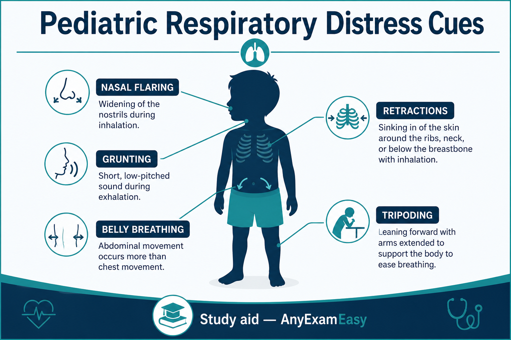

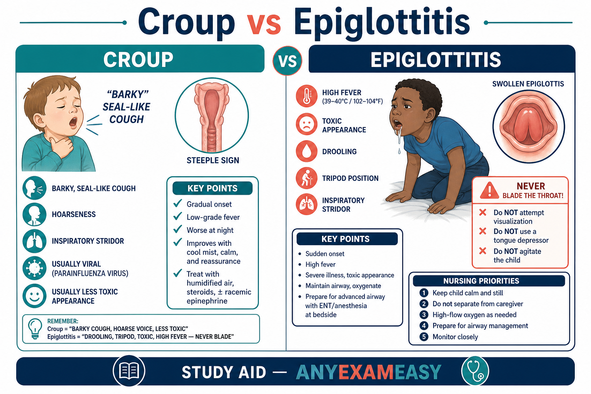

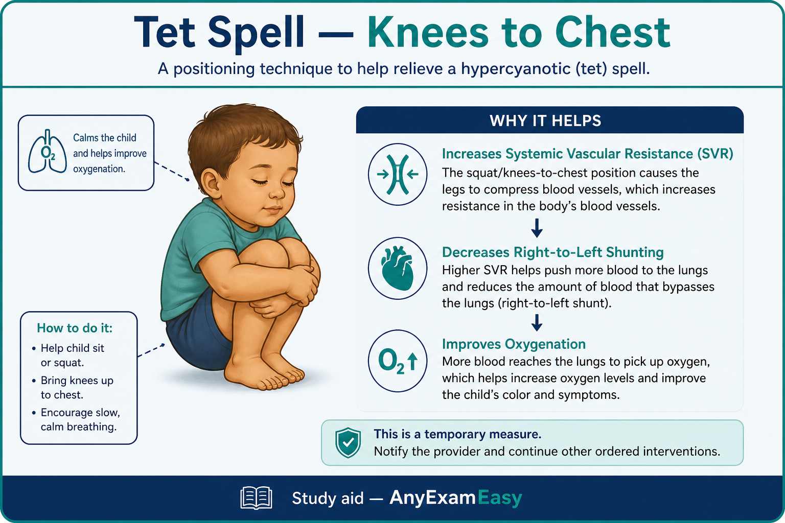

---

## Why it matters on NCLEX

Kids **compensate then crash**. Peds stems test developmental safety, dehydration, airway differences (epiglottitis vs croup), and mandated reporting. Weight-based calc safety is non-negotiable.

---

## Topic A — Growth, development & safety teaching

### Concept

Milestones are ranges; **red flags** matter more than memorizing every week. Anticipatory guidance prevents injury (choking, drowning, falls, burns, guns, car seats).

### High-yield red flags (examples — verify with developmental refs)

- Not tracking/smiling by expected windows  
- No babbling / no single words by expected ages  
- Loss of previously acquired skills  
- Extreme tone abnormalities  

### Age-themed safety

| Age vibe | Safety themes |
| --- | --- |
| Infant | Back to sleep, no loose bedding, rear-facing car seat, water heater temp, never shake |
| Toddler | Choking hazards, cabinet locks, water safety, rear-facing as long as possible then forward per guidelines |
| Preschool | Stranger safety, helmet, poison control number |
| School-age | Bike/helmet, sports, internet beginnings |
| Adolescent | Driving, substances, mental health, sexual health, consent |

### Remember this

Injury prevention teaching is Health Promotion gold. Regression with stress is common — assess for red flags vs temporary regression.

---

## Topic B — Dehydration

### Pathophysiology / concept

Higher % body water + higher metabolic rate → kids dehydrate faster (GE, fever, burns). Mild → severe: from sticky mucosa to sunken fontanel/eyes, no tears, oliguria, lethargy, delayed CRT, shock.

### Priority nursing actions

- Oral rehydration therapy (ORT) for mild-moderate if tolerating PO.  
- IV fluids for severe / shock / intractable vomiting — boluses per PALS-aligned orders.  
- Daily weights; strict I&O; avoid diluted homemade “guess” recipes when commercial ORS available.  
- Electrolyte caution with IV hypotonic fluids (iatrogenic hyponatremia themes).

### Teaching

ORT small frequent sips; signs to return (lethargy, no urine, blood in stool, persistent vomiting).

### Remember this

Lethargy + poor perfusion = IV pathway, not “just try juice.”

---

## Topic C — Pediatric respiratory: RSV, croup, epiglottitis

### RSV / bronchiolitis

Viral lower airway in infants; wheeze, tachypnea, feeding difficulty. Supportive care primary; isolation contact/droplet per policy; suction nose before feeds; watch apnea in young infants.

### Croup (laryngotracheobronchitis)

Viral; barky cough, stridor, hoarseness; steeple sign themes. Cool mist / night air folklore vs evidence — follow orders; steroids; nebulized epinephrine for moderate-severe as ordered. Keep child calm.

### Epiglottitis (less common with Hib vaccine but still tested)

**Bacterial** emergency: drooling, dysphagia, distress, tripod, high fever, **no cough** often. **Do not** throat-exam with tongue blade. Keep with parent, NPO, airway team / OR for controlled airway, antibiotics after airway secured as ordered.

### Comparison memory hook

| | Croup | Epiglottitis |
| --- | --- | --- |
| Vibe | Barky cough, stridor | Drooling, no cough, toxic |
| Action | Calm, steroids ± racemic epi | Airway first, don’t agitate throat |

### Remember this

Epiglottitis = don’t look in the throat. Kids with retractions/flaring/grunting need escalation.

---

## Topic D — Congenital heart disease (high-level)

### Concept

Left-to-right shunts (VSD/ASD/PDA) → pulmonary overcirculation, failure to thrive, CHF themes. Right-to-left / cyanotic lesions (TOF, transposition) → cyanosis, polycythemia, spells. Obstructive (coarctation) → BP/ pulse discrepancies.

### Assessment cues

Poor feeding, sweating with feeds, tachypnea, murmur, cyanosis, differential cyanosis, delayed CRT, hepatomegaly in CHF.

### Priority nursing actions

- Cluster care; optimize feeding; digoxin/diuretic themes as ordered (dig toxicity same cues).  
- Tet spell: knees-to-chest, calm, O₂, morphine/fluids as ordered.  
- Pre/post ductal sat comparisons when relevant.  
- Infective endocarditis prophylaxis only when currently indicated — guidelines change; don’t invent.

### Remember this

Feeding fatigue + sweat = cardiac red flag in infants. Tet spell → knees to chest.

---

## Topic E — Vaccines, febrile seizures, abuse reporting

### Vaccines

Know that schedules update — teach importance, common mild reactions vs emergencies (anaphylaxis). Injection site by age (vastus lateralis infants; deltoid when muscle adequate). Document VIS themes.

### Febrile seizures

Usually brief, age-limited; protect airway/safety; antipyretics for comfort don’t always prevent; teach when to seek care (first seizure, prolonged, focal, status).

### Abuse / mandated reporting

Nurses are **mandated reporters**. Inconsistent history, patterned injuries, spiral fractures themes in non-ambulatory infants, STIs in young children — private interview, treat injuries, report per law. Don’t confront aggressively alone in a way that blocks reporting.

### Remember this

Mandated reporter = report suspicion per law. Weight-based dosing double-check. Epiglottitis ≠ croup management.

---

---

## Topic F — Pyloric stenosis, intussusception, Hirschsprung (high-yield)

| Condition | Classic cue | Nurse priorities |
| --- | --- | --- |
| Pyloric stenosis | Projectile nonbilious vomit, olive mass, hungry, dehydrated/alkaline | NPO, IV fluids/electrolytes, prep surgery |
| Intussusception | Currant jelly stools, intermittent severe pain, sausage mass | Air/contrast enema themes may reduce; NPO; watch perforation |
| Hirschsprung | Failure to pass meconium, ribbon stools, obstruction | Prep for pull-through; measure abd girth; avoid rectal temps if ordered |

### Remember this

Bilious vomiting in newborn = emergency until proven otherwise (malrotation/volvulus themes).

---

## Topic G — Otitis, meningitis peds, Kawasaki (pattern)

- Otitis media: pain, fever; finish Abx; feed upright.  
- Pediatric meningitis: bulging fontanel, high-pitched cry, photophobia — droplet as indicated, Abx after cultures when safe.  
- Kawasaki: prolonged fever, strawberry tongue, rash, conjunctivitis → coronary aneurysm risk; IVIG + aspirin as ordered (special aspirin indication).

### Remember this

Kawasaki = fever + mucocutaneous signs → cardiac follow-up. Incomplete Kawasaki still dangerous.

## Concept check

**Q1.** Toddler with drooling, tripod position, high fever, no cough. Priority?  
A. Examine throat with tongue blade at bedside alone  
B. Keep child calm with parent, NPO, prepare for emergency airway management, notify provider  
C. Force flat supine for XR immediately without airway plan  
D. Give orange juice  

**Q2.** Infant with diarrhea, sunken fontanel, CRT 4 seconds, lethargic. Best theme?  
A. Home observation only  
B. Emergent evaluation and IV fluid resuscitation per orders  
C. Tap water boluses by parents  
D. Restrict all fluids  

**Q3.** Nurse suspects child abuse. Correct action?  
A. Ignore if parents are “nice”  
B. Report per mandated reporter law/policy after ensuring immediate safety  
C. Post photos on social media  
D. Wait until absolute courtroom proof  

#### Answers

**Q1: B.** Epiglottitis airway emergency — don’t blade the throat.  
**Q2: B.** Severe dehydration/shock pathway.  
**Q3: B.** Mandated reporting — safety first.

---

## Chapter Remember this

- Compensate then crash — tachypnea and lethargy matter.  
- ORT vs IV based on severity.  
- Croup vs epiglottitis — management differs radically.  
- CHD: feeding fatigue; tet spell knees-to-chest.  
- Mandated reporter; vaccine teaching; weight-based calc safety.

---

<!-- ========== 13-psych.md ========== -->

# Chapter 13 — Psychosocial Integrity

> **Study aid only.** Crisis and suicide protocols follow facility and local law. Duty-to-warn and reporting rules vary by jurisdiction — know concepts and verify locally. Not psychotherapy.

---

## Why it matters on NCLEX

Psych items are less about DSM trivia and more about **safety, therapeutic communication, and legal/ethical boundaries**. Alcohol/benzo withdrawal can kill — treat them as medical as well as psychiatric. Med toxicity (lithium, MAOIs, serotonin syndrome, NMS) is classic priority material.

---

## Topic A — Therapeutic communication

### Concept

Goal: help client express feelings, clarify, and participate in care. Presence > clever advice.

### Keep / kill phrases

**Keep:** “Tell me more.” “This sounds difficult.” “What concerns you most?” silence, reflection, clarification, open-ended questions.  
**Kill:** “Don’t worry.” “Why did you…” “You should…” “Everyone feels that way.” changing subject, false reassurance, probing curiosity, judgment.

### Priority nursing actions

- Private setting when possible.  
- Cultural humility; qualified interpreters.  
- Match acuity: if client is psychotic and unsafe, safety first, then communication.

### Remember this

Empathetic + reality-based + client-centered. Avoid “why” and false reassurance.

---

## Topic B — Suicide risk

### Concept

Ask directly about ideation, plan, means, intent, history. Asking does not “plant” the idea. Highest risk periods include after starting antidepressants (energy returns before mood — conceptual teaching) and after sudden “improvement” with resolved planning.

### Assessment cues

Talk of being a burden, giving away possessions, goodbye messages, accessing means, severe hopelessness, command hallucinations to harm self.

### Priority nursing actions

1. Ensure immediate safety — remove means; 1:1 observation when indicated.  
2. Ask directly; do not leave high-risk client alone.  
3. Contract for safety is **not** a substitute for observation when high risk.  
4. Collaborate on safety plan; involve team; follow involuntary hold laws as applicable conceptually.  
5. Document quotes and actions factually.

### Remember this

Direct questions + means restriction + observation level matches risk.

---

## Topic C — Schizophrenia

### Concept

Positive symptoms (hallucinations, delusions, disorganized speech) vs negative (flat affect, avolition). Reality testing impaired. Antipsychotics: EPS, NMS, metabolic syndrome with atypicals.

### Priority nursing actions

- Safety from command hallucinations (content assessment).  
- Calm, short, concrete communication; don’t argue delusions — acknowledge feelings, present reality gently.  
- Med adherence support; monitor EPS (dystonia, akathisia, TD).  
- NMS red flags: rigidity, high fever, autonomic instability — emergency.

### Remember this

Don’t argue delusions. Assess hallucination commands for safety. NMS = emergency.

---

## Topic D — Bipolar disorder & mania milieu safety

### Concept

Mania: elevated/irritable mood, decreased sleep need, grandiosity, pressured speech, risky behavior, poor intake. Depression poles as MDD. Lithium common mood stabilizer; anticonvulsant mood stabilizers also used.

### Priority nursing actions

- Mania: reduce stimulation, private room near nurses’ station themes, high-calorie finger foods, sleep promotion, set firm consistent limits on unsafe behavior, redirect rather than argue, remove hazardous items, supervised activities.  
- Protect other clients from intrusive/aggressive behavior — milieu safety.  
- Lithium: monitor levels; toxicity cues (see meds section); hydration/Na⁺ consistency; teratogenicity awareness.

### Remember this

Mania = stimulation down + nutrition + sleep + limits + milieu safety. Lithium toxicity is serious.

---

## Topic E — Depression, anxiety & PTSD / trauma-informed care

### Depression

SIG-E-CAPS themes; priority = suicide risk + ADLs + med teaching (SSRIs: time to effect, serotonin syndrome awareness with interactions, sexual SE). Don’t stop abruptly.

### Anxiety / panic

Stay with client during panic; short sentences; breathing coaching; quiet environment. Benzos: sedation, dependence, withdrawal risk. Buspirone slower onset themes.

### PTSD / trauma-informed basics

Intrusions (flashbacks/nightmares), avoidance, negative mood/cognition, hyperarousal. Triggers can be sensory.  
**Trauma-informed nursing:** safety, trust, choice, collaboration, empowerment; ask permission before touch; avoid re-traumatizing restraint when alternatives exist; grounded presence during flashbacks (“You are safe here; you are in the hospital”). Refer to therapy modalities as ordered (exposure, EMDR themes — know they exist, don’t practice them solo).

### Remember this

Panic: stay with them. Depression: always screen suicide. PTSD: safety + choice + don’t force storytelling. SSRI + MAOI / certain combos = serotonin syndrome risk.

---

## Topic F — Personality disorders (boundaries)

### Borderline personality themes

Intense relationships, fear of abandonment, impulsivity, self-harm risk, **splitting** (staff as all-good/all-bad).  
**Nurse:** consistent limits across shifts; team communication so splitting fails; validate feelings without reinforcing unsafe behavior; safety contracts + observation for self-harm; avoid over-involvement or punitive coldness.

### Antisocial personality themes

Disregard for rights of others, deceit, lack of remorse themes.  
**Nurse:** firm limits; safety of staff/peers; don’t moralize endlessly; document objectively; don’t bargain privileges around intimidation.

### Remember this

Consistency + boundaries + safety. Don’t take splitting personally — communicate as a team.

---

## Topic G — Substance: alcohol CIWA, opioids/naloxone, stimulants

### Alcohol / sedative-hypnotic withdrawal

Can cause seizures, DTs (autonomic hyperactivity, hallucinations, confusion) — **medically dangerous**. **CIWA**-guided benzodiazepines as ordered (score drives dosing themes); thiamine before glucose themes in alcoholics; seizure precautions; quiet safe environment; fall risk; fluids/electrolytes; aspiration precautions if vomiting.

### Opioid withdrawal vs overdose

**Withdrawal:** miserable (myalgias, diarrhea, yawning, piloerection) — usually not directly lethal like alcohol/benzo withdrawal — support hydration and MAT protocols (buprenorphine/methadone themes as ordered).  
**Overdose:** pinpoint pupils, respiratory depression, unresponsiveness — **naloxone** as ordered/protocol; support airway/breathing; may need repeat doses (naloxone may wear off before opioid); stay with client; watch for withdrawal precipitation after naloxone.

### Stimulant intoxication/crash

Cardiac/psych agitation; crash depression/suicide risk.

### Remember this

Alcohol/benzo withdrawal can kill — CIWA + benzos + thiamine concepts. Opioid OD = naloxone + airway. Don’t confuse withdrawal misery with OD apnea.

---

## Topic H — High-yield psych meds: lithium, MAOI, serotonin syndrome vs NMS

### Lithium toxicity cues

Early: nausea, vomiting, diarrhea, fine tremor worsening, polyuria/polydipsia themes. Progressing: coarse tremor, ataxia, confusion, seizures.  
**Actions:** hold lithium, notify provider, levels/labs as ordered; hydrate; teach steady salt/fluid intake (sudden low Na⁺/dehydration raises toxicity risk); NSAID/diuretic interaction awareness themes; avoid dehydration in heat/illness.

### MAOI diet / tyramine

MAOIs + **tyramine-rich foods** (aged cheeses, cured meats, fermented soy, draft beer themes — follow current diet list) → hypertensive crisis. Teach diet + all med interactions (cold meds, SSRIs — washout periods). Headache + severe HTN = emergency energy.

### Serotonin syndrome vs NMS

| | **Serotonin syndrome** | **NMS** |
| --- | --- | --- |
| Trigger vibe | Serotonergic stacking (SSRI+MAOI, etc.) | Antipsychotics (dopamine block) |
| Onset | Often faster (hours) | Often slower (days) |
| Neuromuscular | Hyperreflexia, clonus, myoclonus | **Lead-pipe rigidity**, bradyreflexia |
| Autonomic | Diaphoresis, tachy, unstable VS | Fever, tachy, labile BP |
| Nurse | Stop offending agents, support ABCs, notify — cooling/benzos/cyproheptadine themes as ordered | Stop antipsychotic, ABCs, cooling, ICU — dantrolene/bromocriptine themes as ordered |

### Remember this

Lithium: levels + hydration + salt consistency. MAOI: tyramine diet. Clonus → think serotonin; lead-pipe rigidity → think NMS.

---

## Topic I — ECT nursing care

### Concept

Electroconvulsive therapy for severe depression / catatonia / some mania — brief controlled seizure under anesthesia. Informed consent; NPO; hold certain meds (e.g., anticonvulsants) per orders; remove dentures; void.

### Post-ECT priorities

Airway/VS; reorient (temporary confusion/memory gaps common); fall risk; assess return of gag before PO; document seizure length per protocol; offer reassurance that memory issues often improve.

### Remember this

ECT = consent + NPO + post-op style airway/reorientation — not “barbaric punishment.”

---

## Topic J — Restraints, seclusion & least-restrictive

Least restrictive first: verbal de-escalation → offer PRN → quiet room → seclusion → physical restraint as last resort when imminent harm. Time-limited orders; face-to-face provider evaluation per rules; continuous or frequent monitoring; offer food/toileting/ROM; never as punishment or for staffing convenience; debrief after. Chemical restraint ethics apply. Document behaviors that justified escalation.

### Remember this

Least-restrictive ladder + time limits + monitoring + dignity. Same principle as medical restraints — plus trauma sensitivity.

---

## Topic K — Abuse / IPV screening & safety planning

### Concept

Intimate partner violence, child/elder abuse. Interview **privately**. Nonjudgmental. Provide resources. **Report** per law for mandated categories (children/elders/vulnerable adults). For competent adult IPV, reporting rules vary — safety planning + resources still core; know your jurisdiction.

### IPV screening & safety planning (high-yield)

- Screen when alone; normalize (“We ask everyone”).  
- If disclosure: believe, validate, assess immediate danger, weapons in home, strangulation history (high danger).  
- Safety plan themes: packed bag, code word with trusted person, documents/keys/meds ready, shelter/hotline numbers, exit strategies — client sets pace (leaving can increase short-term danger).  
- Do not confront abuser or hand materials that increase risk if partner searches belongings — follow advocacy best practices.  
- Photograph injuries per policy/consent; treat injuries; document objectively (quotes, body map).

### Priority actions

- Separate from suspected abuser for interview.  
- Report mandated cases; document objectively.  
- Safety plan; shelters/hotlines.

### Remember this

Private interview. Mandated reporting for kids/elders/vulnerable. Adult IPV: safety planning over lectures. Safety over secrecy.

---

## Topic L — Eating disorders (NCLEX lens)

Anorexia: restriction, low weight, bradycardia, refeeding syndrome risk when nutrition restarts (monitor phos/K⁺/Mg²⁺). Bulimia: binge-purge, enamel erosion, parotid swelling, electrolyte swings from vomiting/laxatives.  
**Priorities:** medical stabilization first; supervised meals as ordered; therapeutic alliance; cardiac monitoring when indicated.

### Remember this

Refeeding can be medically dangerous — electrolytes. Eating disorders are medical + psych.

---

## Concept check

**Q1.** Best response to “I’m such a failure”?  
A. “Don’t worry, you’ll be fine.”  
B. “Why do you always think that?”  
C. “This feels overwhelming. Tell me more about what’s been hardest.”  
D. “You should just stay positive.”  

**Q2.** Client with alcohol use disorder 48h after last drink is tremulous, tachycardic, confused. Priority theme?  
A. Ignore — only opioids withdraw dangerously  
B. Medical withdrawal protocol (benzodiazepines as ordered), safety, thiamine concepts, notify provider  
C. Group therapy as the only intervention  
D. Immediate discharge  

**Q3.** Client reports clear plan and means for suicide. First nursing priority?  
A. Leave to finish charting  
B. Ensure continuous observation / means restriction and initiate facility suicide precautions  
C. Promise total confidentiality even if they leave to die  
D. Joke to lighten mood  

**Q4.** Client on fluoxetine started tramadol and an MAOI by error presents with hyperreflexia, clonus, agitation, and fever. Suspect?  
A. NMS only — ignore serotonergic meds  
B. Possible serotonin syndrome — hold serotonergic agents, support ABCs, notify provider  
C. Simple caffeine overdose — discharge  
D. Lithium toxicity without lithium history  

**Q5.** Manic client is intrusive, not sleeping, and trying to leave AMA to “buy a jet.” Best milieu approach?  
A. Debate politics for hours  
B. Reduce stimulation, offer finger foods, set consistent limits, supervise safety  
C. Open visiting for a dance party  
D. Seclude immediately without trying least-restrictive options  

**Q6.** Partner insists on staying for all teaching. Client gives a scared look when asked about safety at home. Best action?  
A. Ignore — family is always helpful  
B. Find private time to screen for IPV and offer resources/safety planning  
C. Hand IPV pamphlets to the partner to “help”  
D. Confront the partner in the hallway  

#### Answers

**Q1: C.** Empathy + open exploration.  
**Q2: B.** Alcohol withdrawal can be life-threatening.  
**Q3: B.** Safety and precautions first.  
**Q4: B.** Hyperreflexia/clonus + serotonergic stack = serotonin syndrome pattern.  
**Q5: B.** Mania milieu = low stim, nutrition, limits, safety.  
**Q6: B.** Private IPV screen; don’t tip off abuser.

---

## Chapter Remember this

- Therapeutic: open, reflecting; kill false reassurance and “why.”  
- Suicide: ask directly; match observation to risk.  
- Psychosis: safety + don’t argue delusions; watch NMS/EPS.  
- Mania/lithium: stimulation down; toxicity cues; milieu safety.  
- Personality disorders: boundaries + consistency.  
- Alcohol/benzo withdrawal = medical emergency potential; CIWA.  
- Opioid OD: naloxone + airway; MAOI diet; serotonin vs NMS table.  
- ECT: consent, NPO, reorient.  
- Restraints: least restrictive.  
- Abuse/IPV: private interview + mandated reporting + safety plan.  
- PTSD: trauma-informed safety and choice.

---

<!-- ========== 14-pharmacology.md ========== -->

# Chapter 14 — Pharmacology

> **Study aid only.** Drug information changes. Verify dosing, interactions, pregnancy categories/labeling, and monitoring with current drug references and facility policy. This chapter teaches **patterns**, not prescriptions.

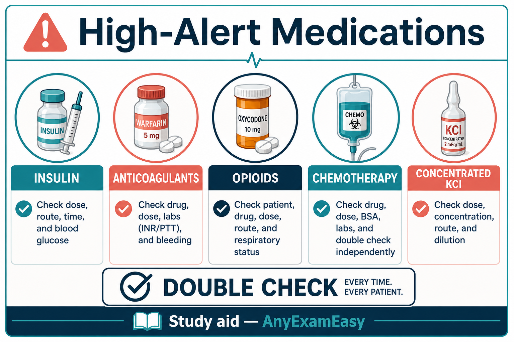

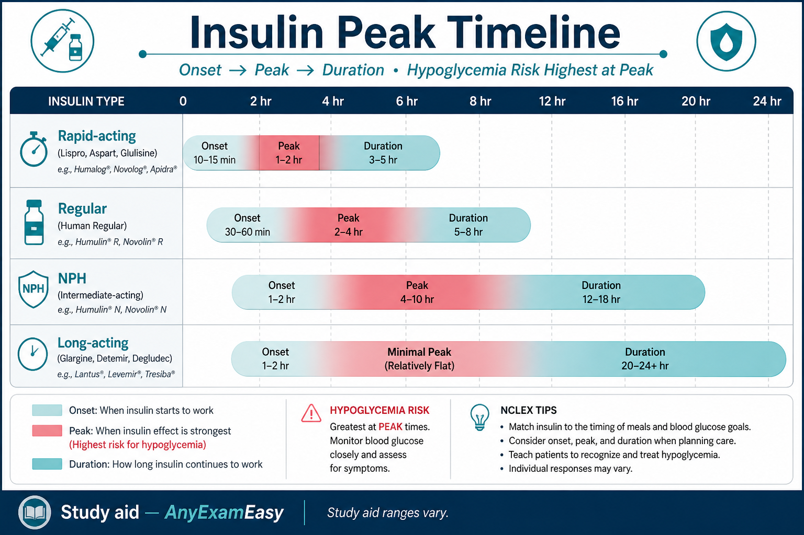

---

## Why it matters on NCLEX

Pharmacological and Parenteral Therapies is a large Client Needs band (~13–19% RN). The exam tests **class patterns, safety checks, monitoring labs, and teaching** — not obscure brand trivia.

---

## How to study pharm for NCLEX

For every class, lock four hooks:

1. **Use** (why give it?)  
2. **Key side effects / toxicities**  
3. **Labs / monitoring**  
4. **Teaching / hold parameters**  

Drill **high-alert** and **look-alike/sound-alike** separately.

---

## Topic A — High-alert medications

### Concept

High-alert = elevated risk of significant harm if used in error. Independent double-checks per policy.

### Classic high-alert groups

- Insulins  
- Anticoagulants / thrombolytics  
- Opioids  
- Chemotherapeutic agents  
- Concentrated electrolytes (KCl, Mg, hypertonic NaCl)  
- Neuromuscular blockers (OR/ICU contexts)  

### Priority nursing actions

- Two-nurse check when required.  
- Smart-pump libraries; no workarounds.  
- Clarify unusual doses.  
- Label lines; trace tubing.

### Remember this

High-alert mistakes are rarely “minor.” Slow down.

---

## Topic B — Cardiac med class patterns

| Class | Use vibe | Watch for | Teaching / holds |
| --- | --- | --- | --- |
| ACEI (-pril) | HTN, HF | Cough, hyperkalemia, angioedema, ↑Cr | Report swelling of lips/tongue; avoid K⁺ salt substitutes |
| ARB (-sartan) | HTN, HF | Hyperkalemia, less cough | Same K⁺ themes |
| Beta blockers (-olol) | HTN, angina, HF, rate | Bradycardia, bronchospasm (nonselective), masks hypo | Don’t stop abruptly; hold if HR/BP below parameters |
| CCB | HTN, rate (non-DHP) | Hypotension, constipation (verapamil), bradycardia | Grapefruit interactions themes |
| Nitrates | Antianginal | Hypotension, headache | No PDE-5 inhibitors combo; sit when taking |
| Digoxin | HF/rate | Toxicity: GI, visual yellow-green, brady — worse with low K⁺ | Pulse check themes; levels |
| Loop diuretics | Fluid overload | Hypokalemia, hypomagnesemia, ototoxicity if rapid IV | K⁺ foods; report weakness |
| Thiazides | HTN | Hypokalemia, ↑glucose/uric acid themes | Same |
| K⁺-sparing (spironolactone) | HF/HTN | Hyperkalemia, gynecomastia | Avoid excess K⁺ |

### Remember this

ACE cough/angioedema; dig + low K⁺ = trouble; loops waste K⁺.

---

## Topic C — Respiratory meds

- **SABA (albuterol):** rescue; tachycardia/tremor; overuse = uncontrolled asthma signal.  
- **ICS:** rinse mouth — thrush prevention; not for acute rescue alone.  
- **LAMA/LABA:** maintenance COPD/asthma as indicated — LABA without steroid in asthma is a safety theme.  
- **Montelukast:** psych side-effect awareness per current labeling themes.  
- **Theophylline:** narrow therapeutic index — rare but tested historically.

---

## Topic D — Endocrine: insulin deep dive

### Kinetics mindset (examples — verify products)

| Type | Role | Hypo risk window vibe |
| --- | --- | --- |
| Rapid (lispro/aspart) | Meal coverage | ~1 hour peak themes |
| Regular | Short / IV in DKA protocols | Later than rapid |
| NPH | Intermediate | Peak mid-window |
| Long (glargine/detemir/degludec) | Basal | Usually less peak — still can cause hypo |

### Safety rules

- Match insulin to meal timing (rapid with food arrival).  
- Site rotation; never share pens.  
- Clear before cloudy when mixing **only** if that pair is mixable.  
- U-500 and concentrated products need extreme caution.  
- Pump users: know DKA risk if infusion interrupts.

### Oral agents (pattern)

- Metformin: GI SE; lactic acidosis risk themes with hypoxia/renal failure/contrast timing per protocol.  
- Sulfonylureas: hypo risk.  
- SGLT2: genital infections; euglycemic DKA awareness.  
- GLP-1 RAs: GI SE; aspiration/peri-op themes evolving — verify current.

### Remember this

Peak = snack plan. Unconscious hypo → glucagon/IV dextrose per orders.

---

## Topic E — Anticoagulants & antiplatelets

| Agent | Monitor vibe | Reversal / notes |
| --- | --- | --- |
| Heparin (UFH) | aPTT / anti-Xa | Protamine themes; HIT risk |
| Enoxaparin | Often no routine aPTT; anti-Xa special pops | Renal dosing; don’t eject air bubble incorrectly per product |
| Warfarin | INR | Vitamin K / PCC themes; diet Vit K consistency; many interactions |
| DOACs | Usually no INR | Specific reversal agents when available; renal considerations |
| Aspirin / P2Y12 | Bleeding | Hold before surgery per orders |

### Teaching

Soft toothbrush, electric razor, report black stools/coffee ground emesis/bleeding gums, medic alert, fall prevention.

### Remember this

Know which lab pairs conceptually with which drug. Bleeding precautions universal.

---

## Topic F — Antibiotics themes

- **Allergy history** every time — clarify rash vs anaphylaxis.  
- Culture before first dose when possible (don’t delay sepsis care inappropriately).  
- Finish course teaching (with nuance for some stewardship cases — follow discharge instructions).  
- **C. diff** risk with broad spectrum — report diarrhea.  
- Specific famous toxicities: aminoglycosides (oto/nephro), vancomycin (levels, Red Man if infused too fast — slow infusion), fluoroquinolones (tendon/QT themes), macrolides (QT), tetracyclines (teeth/photosensitivity — not in young kids/pregnancy themes), metronidazole (alcohol disulfiram-like), sulfa (Stevens-Johnson, crystalluria — hydrate).  
- TB meds: RIPE — hepatotoxicity; rifampin orange fluids; INH B6 for neuropathy.

### Remember this

Allergy + superinfection + organ toxicity patterns > memorizing every MIC.

---

## Topic G — Opioids, psych, maternity pharm themes

### Opioids

Resp depression, sedation, constipation, nausea, pruritus. Hold if RR low per parameters; **naloxone** for overdose; stool softener teaching for chronic use.

### Psych meds

- SSRIs: serotonin syndrome (clonus, hyperreflexia, fever, agitation) with interactions.  
- MAOIs: tyramine hypertensive crisis.  
- Lithium: level, Na⁺/fluid consistency, toxicity cues.  
- Antipsychotics: EPS (benztropine/diphenhydramine for acute dystonia themes), TD, NMS, metabolic syndrome.  
- Benzos: sedation, withdrawal seizures if abrupt stop.

### Maternity

- Oxytocin: tachysystole / fetal distress — stop per protocol.  
- Mag sulfate: toxicity monitoring (see maternity chapter).  
- Rho(D) immune globulin: timing for Rh-negative clients.  
- Terbutaline/tocolytics: maternal HR themes.  
- Verify every pregnancy/lactation drug with current refs — labels change.

---

## Topic H — Calculation safety

### Habits

1. Dimensional analysis.  
2. Leading zeros yes (0.5); trailing zeros no (5.0 forbidden).  
3. Pediatric: mg/kg → check max/day; weigh in kg.  
4. Never round intermediate steps into oblivion; round at appropriate final step per protocol.  
5. IV: mL/hr and gtt/min; know drop factor.  
6. Independent double-check for high-alert.

### Mini practice mindset

If your answer is 10× larger/smaller than typical clinical sense, **recalculate**.

### Remember this

If an option skips allergy, ID, or compatible route/time — wrong. Calc errors are preventable with process.

---

---

## Topic I — Fluids, electrolytes & emergency meds (pattern)

| Med | Hook |
| --- | --- |
| IV KCl | Never push; diluted infusion on pump; burn at site possible |
| Calcium gluconate | Mag toxicity antidote; protect heart in hyperK themes |
| Sodium polystyrene / binders | Remove K⁺ GI route — slower than cardiac protection |
| Albuterol neb | Can shift K⁺ inward temporarily |
| Naloxone | Opioid reversal — short half-life, may renarcotize |
| Flumazenil | Benzo reversal — seizure risk in chronic users; rarely first-line casually |
| Epinephrine | Anaphylaxis IM mid-thigh themes; cardiac ACLS use |
| Atropine | Symptomatic bradycardia themes |
| Adenosine | SVT; brief asystole expected — warn client |

### Remember this

Know antidote pairs: opioid–naloxone, mag–calcium, warfarin–vit K, heparin–protamine, benzo–flumazenil (cautious), acetaminophen–NAC, anticholinergic–physostigmine (specialist), dig–digibind themes.

---

## Topic J — Herbal & interaction awareness

Garlic/ginkgo/ginseng/ginger → bleeding risk with anticoags. St. John’s wort → many CYP interactions / serotonin risk. Teach clients to disclose herbals.

### Remember this

“Natural” ≠ harmless on NCLEX stems about bleeding or serotonin.

## Concept check

**Q1.** Client on warfarin with INR above therapeutic range and new epistaxis. Nurse anticipates:  
A. Extra heparin SQ  
B. Hold warfarin, notify provider, possible vitamin K / reversal per orders  
C. IM injection of large volumes  
D. Start aspirin for good measure  

**Q2.** Teaching for new lispro insulin is correct when client says:  
A. “I’ll take it at bedtime only regardless of meals.”  
B. “I’ll eat within the rapid onset window so I don’t bottom out.”  
C. “I can share my pen with my spouse.”  
D. “Peaks don’t matter.”  

**Q3.** Vancomycin infused rapidly; client becomes flushed and itchy. Best immediate action theme?  
A. Stop/slow infusion per protocol, assess airway, notify provider (Red Man vs allergy differentiation)  
B. Give next dose faster  
C. Ignore  
D. Give IM epinephrine without assessment always  

#### Answers

**Q1: B.** Supratherapeutic INR + bleeding → hold and reverse pathway.  
**Q2: B.** Rapid insulin timed with food.  
**Q3: A.** Red Man often rate-related; still assess for true anaphylaxis.

---

## Chapter Remember this

- Study by class: use → SE → labs → teaching.  
- High-alert double-checks.  
- ACE/ARB K⁺; dig toxicity; diuretic K⁺ patterns.  
- Insulin peaks; never share pens.  
- Anticoag bleeding + lab pairs.  
- Antibiotics: allergy, C. diff, famous toxicities.  
- Opioid RR; naloxone; psych NMS/serotonin/lithium.  
- Calc: dimensional analysis + sense-check.

---

<!-- ========== 15-quick-reference.md ========== -->

# Chapter 15 — Quick Reference & Final Sprint

> **Study aid only.** Lab ranges vary by laboratory and population. Use as a memory scaffold — confirm with your program’s accepted ranges and current clinical sources.

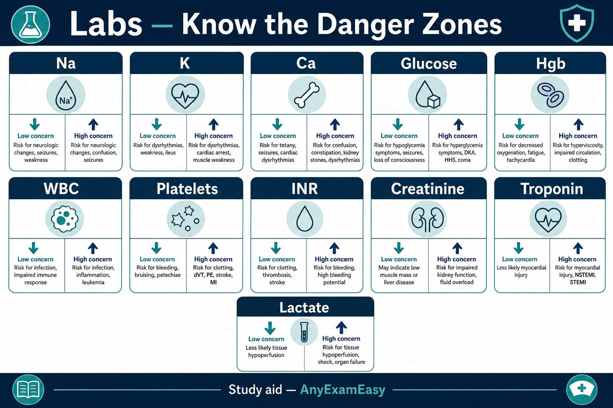

---

## ABCs + priority order (pocket)

1. Airway obstruction / compromise  
2. Breathing failure / severe distress  
3. Circulation — shock, uncontrolled bleed, lethal rhythms  
4. Neuro disability / acute change in LOC  
5. Safety (falls, suicide means, infection exposure)  
6. Pain, education, psychosocial (unless that’s the stem’s true focus and client is stable)

**Tie-breakers:** acute > chronic · unstable > stable · unexpected > expected · actual > risk (when acuity otherwise similar)

---

## Isolation — ultra short

| Type | Think | PPE highlight |
| --- | --- | --- |
| Standard | Everyone | Hand hygiene |
| Contact | C. diff, MRSA* | Gown + gloves; soap & water for C. diff |
| Droplet | Flu, N. meningitidis | Mask |
| Airborne | TB, measles, varicella | N95 + airborne room |

\*Follow current facility/CDC-aligned practice.

---

## Labs — know the danger zone (direction + urgency)

Exact numbers vary. Focus on **which way is dangerous** and **what you do**.

| Lab | Low concern themes | High concern themes |
| --- | --- | --- |
| **Na⁺** | Seizures, confusion | Thirst, neuro changes |
| **K⁺** | Dysrhythmia, weakness | Peaked T, emergency risk |
| **Ca²⁺** | Tetany, spasms | Weakness, stones, moans |
| **Mg²⁺** | Dysrhythmia, tetany themes | Reflexes ↓, RR ↓ if severe |
| **Glucose** | Shake/sweat/confusion/seizure | Dehydration, DKA/HHS risk |
| **Hgb / Hct** | Fatigue, bleed signs, O₂ carry ↓ | Context (e.g., polycythemia) |
| **WBC** | Infection risk (neutropenia) | Infection/inflammation |
| **ANC** | Febrile neutropenia urgency | — |
| **Platelets** | Bleeding risk | HIT/thrombosis context |
| **INR / aPTT** | Clot risk if too low on therapy | Bleed risk if too high |
| **Creatinine / BUN** | — | Kidney injury / clearance |
| **Troponin** | — | Cardiac injury |
| **Lactate** | — | Perfusion/sepsis concern |
| **BNP** | — | HF strain themes |
| **Ammonia** | — | Encephalopathy context |
| **Lipase** | — | Pancreatitis context |

**Remember this:** A **trending** change often matters more than one static number.

---

## Therapeutic communication — keep / kill

**Keep:** “Tell me more.” “This is difficult.” “What concerns you most?” reflection, silence, clarification.  
**Kill:** “Don’t worry.” “Why did you…” “You should…” “Everyone feels that way.” judgment, false reassurance.

---

## Delegation pocket

| Keep with RN | Often LPN/LVN | Often UAP |
| --- | --- | --- |
| Unstable, new admit assess, initial teach, care plan, IVP per policy | Stable predictable, reinforce teach, many meds per scope | ADLs, VS stable, I&O, position |

Five rights: task, circumstance, person, direction, supervision.

---

## Emergency action flashes

| Situation | First moves |
| --- | --- |
| Chest pain unstable | Stay, ABCs, ECG/monitor, activate pathway, aspirin/nitro per orders |
| PE suspicion | Stay, O₂, escalate |
| Stroke | NPO, last known well, pathway, glucose |
| Seizure | Protect, time, nothing in mouth |
| Hypoglycemia conscious | 15-15 carb concept |
| Anaphylaxis | Epinephrine IM themes, airway |
| Boggy fundus | Massage + help |
| Late decels | Stop oxytocin per protocol, reposition, O₂, notify |
| Mag toxicity | Stop mag, Ca gluconate, airway |
| Hyperkalemia + ECG | Monitor + emergent protocol |
| Compartment | Notify now — pain out of proportion |
| Neutropenic fever | Cultures + prompt Abx pathway |
| Pulseless VT/VF | CPR + defib |

---

## 7-day final sprint

| Day | Do this |
| --- | --- |
| −7 | Full sim + error log |
| −6 | Pharm + calc + high-alert |
| −5 | Med-surg emergencies + ABCs drills |
| −4 | Maternity/peds/psych mixed |
| −3 | NGN case studies × 3 |
| −2 | Weakest topics only + this labs sheet |
| −1 | Light review + logistics + sleep |

---

## Error-log mini template

1. Topic: __________  
2. Miss type: cue / priority / content / misread / calc  
3. Correct rule (1 sentence): __________  
4. Drill tomorrow: 10 similar Qs  

---

## Remember this (sprint)

- Process > panic on every item.  
- Safety → ABC → Maslow → nursing process.  
- Review lucky-right answers too.  
- Sleep is a study strategy.  
- Official rules live in NCSBN documents — this sheet is a study aid.

> **Drill these flashes in a Qbank.** [anyexameasy.com](https://anyexameasy.com) — start free; $27.99/mo after trial (trial terms on site).

---

<!-- ========== 16-back-matter.md ========== -->

# Chapter 16 — FAQ, CTA & Legal (Back Matter)

---

## FAQ

### What is CAT on the NCLEX?

**CAT** (Computerized Adaptive Testing) means the exam adapts to your performance. Do well → harder items; struggle → easier ones. The computer continues until it’s confident you’re above or below the passing standard — or you hit the maximum items or time.

### What is Next Gen NCLEX (NGN)?

NGN is the current NCLEX format. It emphasizes **clinical judgment** through unfolding case studies and stand-alone items (bow-tie, matrix, trend, and more). It’s not optional extra content — it’s how the exam works in 2026.

### How long should I study?

It depends on how fresh your content is. Many grads do well with **4–8 weeks** of focused practice after school. Use the **2-week** plan if knowledge is hot and the test is soon; use **8 weeks** if you need a rebuild or you’re balancing work and family.

### What’s the difference between NCLEX-RN and NCLEX-PN?

Both use CAT, NGN clinical judgment, and a similar length/time window (85–150 items, up to 5 hours). RN organizes content under categories like **Management of Care** and **Pharmacological and Parenteral Therapies**; PN uses **Coordinated Care** and **Pharmacological Therapies**, with different percentage bands. Download the official test plan for the exam you’re taking.

### How many questions is the NCLEX?

You’ll see between **85 and 150** items. Some are unscored pretest items — you won’t know which. The exam may stop early once the computer is confident about pass/fail.

### Is this book enough without a question bank?

No. Content review builds knowledge; **practice builds clinical judgment**. Pair these chapters with daily NGN-ready questions, full rationale review, and an error log. One strong bank beats five half-used resources.

### Does this book replace the official test plan?

No. Third-party books prepare you — they do **not** replace [NCSBN](https://www.ncsbn.org) test plans or the Candidate Bulletin.

### Are the lab values in this book exact?

No. Ranges vary by lab, age, sex, and method. We teach **direction and urgency**. Confirm ranges accepted by your program and clinical sites.

### Can AnyExamEasy help with NCLEX prep?

Yes. [AnyExamEasy](https://anyexameasy.com) offers NGN-style NCLEX practice, teachable rationales, Blueprint Roadmaps, and full-length mocks — plus other boards in one login. Start free, then upgrade when you’re ready (**$27.99/mo after trial**; trial terms on site). We’re independent and not affiliated with NCSBN.

---

## You’ve got this

You already survived nursing school. The NCLEX asks you to show **safe clinical judgment** under pressure — and that is a skill you can train.

Open a practice set today. Review the misses like a detective. Repeat tomorrow.

### Ready for NGN-ready practice?

**AnyExamEasy** is built for students who want serious board prep without stacking six expensive subscriptions — **one study system across six boards**, including **NCLEX** with NGN-style practice, teachable rationales, Blueprint Roadmaps, and full-length mocks.

**[Try NCLEX practice free →](https://anyexameasy.com)** — explore the bank, then upgrade when you’re ready ($27.99/mo after trial; trial terms on site).

*One login. Real practice. Make the exam feel familiar before it counts.*

---

## Legal / attribution

*AnyExamEasy is independent and not affiliated with NCSBN, Pearson VUE, or other exam owners. Exam names are trademarks of their owners. We do not guarantee exam results, licensure, or employment. Always confirm current policies in the official Candidate Bulletin and your nursing regulatory body.*

*This book is a **study aid only**. It is not medical advice, clinical protocol, or a substitute for your nursing program, facility policy, or official board documents. Medication, lab, isolation, and scope details must be verified with current official sources and instructors before clinical use.*

*© AnyExamEasy. All rights reserved. For educational use by AnyExamEasy students and site visitors as published on anyexameasy.com.*

---

**Document / publish notes (operators)**  
- Suggested web base: `/nclex-book/` or `/guides/nclex-reference`  
- Keep study-aid disclaimer in site chrome on every chapter  
- Soft CTA only — no invented pass rates, student counts, or question counts  
- Visuals: see `VISUALS-NEEDED.md`; place PNGs in `visuals/`

---

### Ready for NGN-ready practice?

**AnyExamEasy** — one study system across six boards, including NCLEX-RN with NGN-style practice.

[**Try NCLEX practice free →**](https://anyexameasy.com)

*$27.99/mo after trial · trial terms on site*

