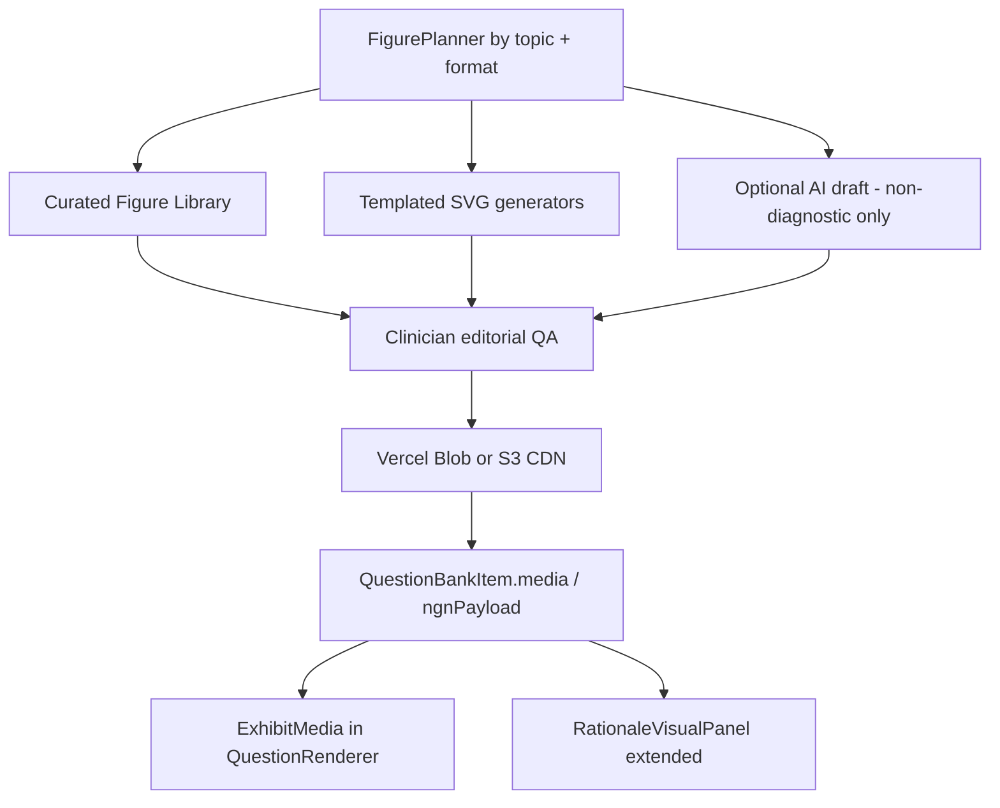

# USMLE world-class figures & media — investment path

**Goal:** Match Amboss/UWorld figure density and clinical fidelity for high-yield stems — without hallucinated histology/ECG as “truth.”

**Product rule:** Figures teach; they do not imply NBME affiliation or predict pass rates.

**Honest baseline (2026-09-06):** Tables + Expert `visualBlocks` (lab/flow/comparison) work. Pixel medical figures (`imageUrl`, Blob/S3, ECG/histo/CXR) are largely greenfield. Content rating gap vs UWorld is dominated by media (~3/10 today).

**Implementation status (2026-09-06):** Phase 0 + Phase 2 starter **shipped in-repo**.

| Piece | Status |
|-------|--------|
| Exhibit normalize (`findings` / `labTable` → `table`) | Done — `normalize-exhibit.ts` + quality-gate |
| Stem UI (`ExhibitMedia`, abnormal labs) | Done |
| SVG teaching catalog (ECG STEMI/NSR/AF, ACS pathway, PTX CXR schematic) | Done — approved only |
| Rationale `image` visualBlocks | Done — panel + derive from `media` |
| Backfill scripts | Done — `db:enrich-usmle-visual-rationales`, `db:attach-usmle-figures` |
| Licensed real CXR/histo (Phase 2 ops) | **Not done** — needs licensing + Blob upload |

Schematics are board-style teaching diagrams, not patient tracings/radiographs. Do not treat them as diagnostic truth.

---

## North star (what “world class” means)

Every figure-eligible item must clear this bar:

1. **Clinically accurate** — curated template or licensed asset; never raw generative histo/ECG as authority
2. **Exam-native** — looks like NBME-style exhibit (clean, labeled, zoomable), not a stock photo
3. **Stem-integrated** — figure appears *with* the vignette before options (not only in rationale)
4. **Accessible** — alt text, captions, keyboard zoom; abnormal labs flagged
5. **Teachable** — optional callouts / panel labels in Expert rationale (not cluttering the stem)
6. **Licensed & auditable** — provenance + review status on every asset

---

## Architecture



### Asset model (new)

```ts
type UsmleFigureAsset = {
  id: string;
  kind: "ecg" | "cxr" | "histo" | "gross" | "pathway" | "lab_panel" | "diagram";
  url: string;           // CDN
  thumbUrl?: string;
  alt: string;
  caption?: string;
  license: string;       // provenance
  sourceNote: string;
  organSystem: string;   // spine id
  topics: string[];      // blueprintTopic slugs
  reviewStatus: "draft" | "approved" | "rejected";
  reviewedAt?: string;
  annotations?: { x: number; y: number; label: string }[];
};
```

Persist as `generationMeta.media` and/or options-envelope `ngnPayload.media[]` initially (avoid Prisma migration friction); promote to dedicated column when volume warrants.

---

## Phased path

### Phase 0 — Unblock what we already generate (1 week)

**Outcome:** AI “image_based” / exhibit items actually show tables; Expert labs densify.

| Work | Detail |
|------|--------|
| Normalize exhibits | Map generation `findings[]` / `labTable` → renderable `ngnPayload.table` in USMLE quality-gate / pipeline |
| USMLE visual backfill | Clone `scripts/enrich-nclex-visual-rationales.ts` → `enrich-usmle-visual-rationales.ts` |
| Stem table polish | Shared abnormal highlighting (match `RationaleVisualPanel`) |
| Metrics | `% items with stem exhibit`, `% with visualBlocks` |

**Do not** ship generative medical images yet.

### Phase 1 — World-class *structured* exhibits (2–3 weeks)

**Outcome:** Lab panels and pathway flows feel EHR/board-like (Amboss-adjacent without pixels).

| Work | Detail |
|------|--------|
| `lab_panel` stem component | Multi-column chemistry/CBC with ref ranges + flags |
| SVG pathway renderer | Render `flow` visualBlocks as clean diagram (not only numbered list) |
| Comparison tables in-stem | For classic differentials (e.g. Crohn vs UC, SIADH vs DI) |
| Figure planner v0 | Decide when a slot needs `exhibit` / `lab_panel` / `pathway` from topic + physician task |

**Quality bar:** Side-by-side with Amboss lab cards — typography, density, abnormal color.

### Phase 2 — Curated pixel library (4–8 weeks) — **core investment**

**Outcome:** Real ECG / CXR / histo / gross path on the highest-yield topics.

| Work | Detail |
|------|--------|
| Storage | `@vercel/blob` or S3 + CDN URLs (never bake binaries into JSON) |
| Admin upload + review | Approve/reject, alt/caption required |
| Seed library | Start with **top 80–120 assets** covering: STEMI patterns, common CXR (pneumo, CHF, pneumonia), classic histo tiles, dermatology, fundoscopy |
| Attach by topic | `scripts/attach-usmle-figures.ts --topic acute-coronary-syndrome` |
| `ExhibitMedia` UI | Zoom, caption, fullscreen; wire `QuestionRenderer` |
| Blueprint quota | Raise true `image_based` share toward official-ish ~5–10% *with real assets* |

**Sourcing strategy (world-class, low legal risk):**

1. **First:** Commission / license educational libraries (Radiopaedia-style licenses where allowed, Open-i, institutional teaching files with written permission)
2. **Second:** Clinician-drawn / templated SVG (ECG leads, spirometry curves, nephron diagrams)
3. **Last:** Generative AI only for **non-diagnostic** schematic diagrams — always human-reviewed; **never** for primary ECG/histo diagnosis truth

### Phase 3 — Annotations & interaction (ongoing)

| Work | Detail |
|------|--------|
| Callouts | Numbered arrows on stem figure; mirrored in Expert |
| Multi-panel | A/B comparison images |
| Hotspots | Mark-the-finding items (pixel regions) |
| Analytics | Accuracy on figure items vs text-only; time-on-figure |

### Phase 4 — Generative assist (carefully)

| Allowed | Forbidden as authority |
|---------|------------------------|
| Mechanism cartoons, labeled pathways (after QA) | Fake histology “diagnosing” the stem |
| UI chrome / empty-state illustrations | Synthetic ECGs used as the only finding |

Pipeline: planner → draft → **mandatory MD review** → approved library only.

---

## Priority topics for first 120 assets

Order by Step 2 underweight + HY yield:

1. Cardiovascular — ECG (STEMI territories, AF, VT, blocks), CXR CHF
2. Respiratory-renal — CXR pneumonia/PTX, ABG panels, urinalysis tables
3. MSK-skin — derm photos (psoriasis, melanoma ABCDE), joint X-ray classics
4. Blood-lymph-immune — peripheral smear tiles, SPEP patterns
5. Neuro — CT bleed patterns, fundus papilledema
6. GI — endoscopy stills (ulcer, varices) where licensed
7. Biostats — forest plot / ROC SVG templates (generate, don’t photograph)

---

## Team & cost (indicative)

| Role | Cadence |
|------|---------|
| Eng (media pipeline + UI) | 1 FTE for Phases 0–2 |
| Clinician reviewer (MD) | 4–8 hrs/week asset QA |
| Licensing / content ops | Asset acquisition + provenance log |
| Budget | Licensing + Blob storage + optional illustration commission |

World-class is mostly **curation + QA discipline**, not more model tokens.

---

## Success metrics

| Metric | Phase 0 | Phase 1 | Phase 2 |
|--------|---------|---------|---------|
| Stem exhibits render rate (AI gen) | ≥95% | ≥98% | ≥98% |
| Serve-ready with stem visual (table or image) | 10% | 20% | 35%+ |
| Approved pixel assets | 0 | 0 | ≥120 |
| Figure items with `reviewStatus=approved` | — | — | 100% of served |
| Blind clinician “board-like?” score (1–5) | ≥3.5 tables | ≥4.0 | ≥4.5 images |
| Content media grade vs UWorld | 3 → 5 | 5 → 6.5 | 6.5 → **8+** |

Overall USMLE content grade path: **7.5 → ~8.5** once Phase 2 lands with expert rationale coverage continuing in parallel.

---

## Repo insert points (implementation)

| Concern | Path |
|---------|------|
| Types | New `src/lib/exam-prep/usmle/figure-assets.ts` + extend `visual-rationale-types.ts` |
| Normalize | `src/lib/exam-prep/usmle/quality-gate.ts`, `generation-pipeline.ts` |
| Stem UI | `UsmleFormats.tsx`, `QuestionRenderer.tsx`, new `ExhibitMedia.tsx` |
| Rationale UI | `RationaleVisualPanel.tsx` |
| Backfill | `scripts/enrich-usmle-visual-rationales.ts`, later `attach-usmle-figures.ts` |
| Storage | `@vercel/blob` (see note in `src/lib/images/compress-image.ts`) |
| Docs | This file; link from `docs/USMLE_EXPERT_RATIONALES.md` |

---

## Explicit non-goals (near term)

- Building a full Primum CCS simulator
- Claiming NBME-quality official forms
- Unreviewed generative medical imaging at serve time
- Replacing UWorld overnight — this path closes the **media moat** deliberately

---

## Commands

```bash
# Derive lab/image visualBlocks into generationMeta (no OpenAI)
npm run db:enrich-usmle-visual-rationales -- --limit 2000
npm run db:enrich-usmle-visual-rationales:dry

# Normalize stem tables + attach matching SVG catalog figures by topic
npm run db:attach-usmle-figures -- --limit 2000
npm run db:attach-usmle-figures -- --topic acute-coronary-syndrome
npm run db:attach-usmle-figures:dry
```

## Next (ops / content)

1. Shortlist ~40 licensed ECG/CXR assets; upload to Blob with `reviewStatus=approved`
2. Expand catalog topics beyond cardio/pulm schematics
3. Keep expert-rationale enrich running so figures sit beside attending-quality explanations
4. Phase 1 polish: denser EHR-style lab panels + pathway SVG renderer for `flow` blocks
